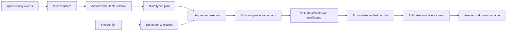

# RAG-MATHS Pattern Zoo

## Why this book exists

The RAG-MATHS archive contains several attempts to describe the same difficult system. One manuscript starts from canonical evidence and lawful merge. Another starts from typed retrieval operations. Another starts from durable jobs and publication. Later manuscripts use category theory, probability kernels, intervention fields, optics, order theory, and transition systems. The names change because each study looks at the system from a different boundary.

The recurring engineering ideas are much smaller than the combined vocabulary. This book isolates those ideas as design patterns. Each chapter explains one pattern first as a concrete software problem and then as mathematics. The mathematics is included because it states the law independently of a particular implementation. Once you recognize the law, you can find the same pattern in a cache, a job runner, an experiment ledger, a release manager, or an authorization pipeline even when the code uses different names.

This is an ELI5 book for a professional developer: it assumes that you can read typed pseudocode and reason about APIs, but it does not assume category theory, abstract algebra, probability theory, or formal methods. Terms are introduced before they are used. Equations are derived from examples rather than presented as credentials.

> [!important] What “the math explains the system” means
> The mathematics states which implementation changes are allowed without changing the promised result. If evidence merge is associative, commutative, and idempotent, then batch grouping, worker completion order, and duplicate delivery cannot change the merged evidence state. The law explains why a retry is safe; the queue implementation merely performs the retry.

## How to read a pattern

Every chapter follows the same path:

1. **The first-day version** gives the smallest useful explanation and a concrete example.
2. **The problem it solves** shows what becomes ambiguous or unsafe without the pattern.
3. **The mathematical model** names the objects and laws precisely.
4. **The worked RAG example** connects the law to retrieval, generation, evaluation, or publication.
5. **Failure modes** show what incorrect implementations look like.
6. **Names and sightings** map the pattern back to the manuscripts and their local terminology.
7. **Key points** state what should survive after the details fade.

You do not need to memorize the notation. Read each equation as a compact testable requirement. Ask three questions:

- What software values do the symbols stand for?
- Which transformations are permitted?
- What must remain equal after those transformations?

## The system in one page

A request is evaluated against one immutable release. The release identifies the corpus, indexes, query policy, generation policy, auxiliary facts, presentation rules, and validators that jointly determine behavior. A typed plan describes the operations to perform. An interpreter executes that plan and returns an explicit outcome together with observations such as provenance, disclosures, costs, fallbacks, and failures.

Produced information is not accepted merely because a component returned it. Small validators check canonical identity, artifact integrity, source lineage, authorization, grounding, and experiment custody. Valid records accumulate without timing-based overwrites. Deterministic views then authorize, collapse, rank, budget, and select from a fixed verified snapshot.

When configuration or data changes, the change declares its support. Dependency closure computes what may have been affected. Artifacts outside that closure may be reused when their external identities still match. Builds, experiments, and activation advance through append-only events reduced by deterministic state machines. Promotion uses hard constraints before product preference. Activation changes a mutable alias to point at an immutable release root; each request acquires one root and does not mix epochs.



## The twelve animals in the zoo

1. [[#Pattern 1 — Semantic Identity as Explicit Projection]]
2. [[#Pattern 2 — Entity–Derivation–Observation Separation]]
3. [[#Pattern 3 — Accumulate Before Selecting]]
4. [[#Pattern 4 — Typed Plans and Multiple Interpreters]]
5. [[#Pattern 5 — Explicit Outcomes and Observation Algebra]]
6. [[#Pattern 6 — Intervention Support, Dependency Closure, and Lawful Reuse]]
7. [[#Pattern 7: Append-Only Events, Pure Reducers, and Observable Idempotence]]
8. [[#Pattern 8: Exact Experimental Coordinates and Explicit Coupling]]
9. [[#Pattern 9: Constraint-First Decisions and Partial Preference]]
10. [[#Pattern 10 — Large Producers, Small Trusted Validators / Proof-Carrying Artifacts]]
11. [[#Pattern 11 — Immutable Release as Synchronization Root]]
12. [[#Pattern 12 — Authorization Dominates Disclosure]]

## Recurring mathematical vocabulary

| Term | Meaning in this book | Concrete software question |
|---|---|---|
| Function or arrow | A typed transformation from one kind of value to another. | What does this stage accept and return? |
| Projection | A function that deliberately keeps some fields and discards others. | Which fields define semantic identity or protected observation? |
| Canonical form | One agreed representation for values considered equal. | Will two processes encode the same semantic value identically? |
| Monoid | Values with an associative combine operation and an empty value. | Can partial observations be combined without caring about grouping? |
| Idempotent operation | Reapplying the operation has the same declared result as applying it once. | Can duplicate delivery alter accepted state? |
| Closure | The smallest set containing initial elements and everything reachable by a rule. | Which downstream artifacts may be affected by this change? |
| Partial order | A comparison that can leave two valid values incomparable. | Can two candidates trade quality for cost without pretending one is universally better? |
| Reducer | A deterministic function from current state and one event to next state. | Can state be reconstructed from its event history? |
| Coupling | A declared joint procedure for producing two stochastic observations. | What makes baseline and challenger results meaningfully paired? |
| Noninterference | Changes to protected/high-authority inputs cannot affect specified low-authority observations. | Can unauthorized evidence influence output or remote disclosure? |

## Source map

The chapters cite the following primary manuscripts. They are generated research artifacts and should be read as design evidence, not as peer-reviewed or independently reproduced results.

- [[Transcripts/2026/08/06/RAG DSL for Retrieval/rag-ttc-p01-p03-doctoral-thesis|RAG-TTC P01–P03 Doctoral Thesis]] — canonical identity, fact/derivation/observation separation, variant-aware state, lawful merge, provenance, and authorization.
- [[Transcripts/2026/08/06/RAG DSL for Retrieval/rag-ttc-research-projects-compendium|RAG-TTC Research Projects Compendium]] — the larger research program, evidence contracts, product boundaries, and authorization projects.
- [[Transcripts/2026/08/09/Designing RAG Abstractions/Compositional_Retrieval_Systems_Thesis|Compositional Retrieval Systems]] — identity strata, typed operations, observations, trusted validators, exact pairing, and package boundaries.
- [[Transcripts/2026/08/09/Designing RAG Abstractions/The_Semantics_and_Dynamics_of_RAG|The Semantics and Dynamics of RAG]] — release-relative behavior, retrieval algebra, outcomes and traces, incremental maintenance, activation, and authorization.
- [[Transcripts/2026/08/09/Designing RAG Abstractions/The_Algebra_of_Intervention_Fields|The Algebra of Intervention Fields]] — interventions, support, closure, reuse, observation-indexed comparison, evidence obligations, and constraint-first promotion.
- [[Transcripts/2026/08/09/Branch Branch Designing RAG Abstractions/Compositional_Probabilistic_Optimization|Compositional Probabilistic Optimization]] — stochastic processes, exact coordinates, coupling, sampled interpreters, resources, and experiment control.
- [[Transcripts/2026/08/08/Job System Design Thesis/Compositional_RAG_Job_System_Thesis_MathJax|Compositional RAG Job-System Thesis]] — durable plans, at-least-once attempts, fenced acceptance, semantic reuse, reducers, and compare-and-swap publication.

---

# Pattern 1 — Semantic Identity as Explicit Projection

## The first-day version

Decide which fields define the result before you serialize or hash a request. Put only those fields into a deliberately designed identity record, encode that record in one standard form, and then hash it.

Tiny example: these two requests should usually share a retrieval cache entry:

```text
{query: "oak wilt cause", corpus: "2026-08", workers: 4}
{query: "oak wilt cause", corpus: "2026-08", workers: 8}
```

They differ only in worker count. If worker count changes speed but not the completed result, it is not part of semantic identity. Changing `corpus` to `2026-09` must produce a different identity because it can change the retrieved documents.

## The problem it solves

A program can compare pointers, structs, serialized bytes, source entities, requests, or observable behavior. These are different equality relations. A hash function cannot choose the correct one.

In a RAG system, that choice determines whether caches are sound and whether independently produced evidence deduplicates. A retrieval request may contain a query, corpus release, fusion constant, worker count, display title, and API credential. A corpus-release or fusion-constant change can alter the ranked result; a display-title change should not. Worker count is irrelevant only when the interpreter guarantees a schedule-independent completed result. If a shared deadline means that only some workers finish, scheduling settings may affect behavior and must be represented.

The pattern makes identity an explicit, versioned API contract rather than an accidental consequence of struct layout or serializer behavior.

## The mathematical model

Start with the tiny example. Let $x$ be the four-worker request and $y$ the eight-worker request. Let $X$ be the set of complete runtime requests. A **projection** is a function that selects or computes only the information relevant to a stated purpose. Here,

$$
P(x)=(\text{"oak wilt cause"},\text{"2026-08"})=P(y).
$$

The function $P:X\to Y$ maps a full runtime request in $X$ to an identity record in $Y$. It deliberately drops `workers` under the stated schedule-independence guarantee.

A **canonical** representation is the one standard byte representation chosen for every permitted value. “Canonical” does not mean merely valid JSON: it requires fixed rules for such details as field order, number encoding, Unicode, absent values, and collection order. Let $C:Y\to B^*$ encode an identity record as canonical bytes, where $B^*$ is the set of finite byte strings. Let $H:B^*\to I$ hash bytes into an identifier space $I$.

A semantic identity contract is the tuple

$$
(D,V,P,C,H),
$$

where $D$ is a domain name such as `rag.retrieval.request`, $V$ is the contract version, and $P$, $C$, and $H$ are the functions just introduced. Define

$$
\operatorname{ID}(x)=H(\operatorname{frame}(D,V,C(P(x)))).
$$

`frame` must combine the domain, version, and payload without ambiguity, normally with length prefixes. Keeping $D$ and $V$ inside the hash input prevents the same payload bytes under `rag.fact/v1` and `rag.observation/v1` from receiving the same name accidentally.

The projection is the substantive policy. Canonicalization removes only representation differences that the policy declares irrelevant. Hashing shortens the resulting canonical name. Most identity defects are omissions or category errors in $P$ or $V$, not SHA-256 defects.

Classify candidate fields during review:

- **semantic** fields affect intended content or results;
- **lineage** fields identify a source, rule, model, or configuration;
- **observation** fields record a measurement in a context;
- **presentation** fields affect display only;
- **operational** fields affect execution but, under a stated guarantee, not the protected result;
- **secret** fields grant access and must not appear as raw identity material.

Classification informs but does not decide inclusion. A retrieval score is excluded from source-fact identity but included in retrieval-observation identity. Always state what kind of thing the ID names.

The contract should satisfy these laws:

**Determinism.** Let $C_i$ and $C_j$ be any two conforming executions of the canonical encoder—for example, two processes, machines, or language implementations. For every admitted runtime value $x$,

$$
C_i(P(x))=C_j(P(x)).
$$

Operationally, retries and independent implementations compute the same cache key; the encoder may not depend on map iteration order, locale, clock time, or hidden process state.

**Declared invariance.** Write $x\equiv_P y$ when $P(x)=P(y)$. Then, subject to the normal hash assumption,

$$
x\equiv_P y \Longrightarrow \operatorname{ID}(x)=\operatorname{ID}(y).
$$

Operationally, changes explicitly declared irrelevant—such as `workers` in the tiny example—do not cause false cache misses.

**Declared sensitivity.** Let $\mathcal O$ be the declared family of protected observers, such as the completed-ranking observer or authorization-trace observer. If one of those observers can distinguish two runtime values, the projection must distinguish them:

$$
\bigl(\exists o\in\mathcal O:\;o(x)\ne o(y)\bigr)
\Longrightarrow P(x)\ne P(y).
$$

The canonical encoder must then be injective over admitted projected values: $P(x)\ne P(y)\Rightarrow C(P(x))\ne C(P(y))$. This is tested before hashing because a fixed-size hash cannot be mathematically one-to-one over unbounded inputs. Operationally, a behaviorally meaningful mutation cannot silently reuse a stale cached result.

**Version separation.** A changed equality or encoding policy requires a new $V$. Operationally, deployed `v1` identifiers retain their original meaning while `v2` occupies a separate namespace.

Collection rules are also part of the contract. A list preserves order and duplicate elements. A set sorts canonical child encodings and removes duplicates. An object sorts fields and rejects duplicate names. Reject non-finite floating-point values. Distinguish an absent field from a present zero value whenever the schema gives them different meanings.

<!-- ADVANCED 1 -->

## Advanced reader: category theory and abstract mathematics

Let $X$ be the type of complete retrieval requests and let

$$
P_{\mathrm{ret}}:X\to Y_{\mathrm{ret}}
$$

be the projection used in the worked oak-wilt example. Thus $P_{\mathrm{ret}}$ retains the normalized query, corpus release, channel set, fusion algorithm and constant, reranker configuration, and candidate limit, while omitting `worker_count`, `display_title`, `api_key`, and `request_id` under the stated guarantees. The projection induces an equivalence relation

$$
x\sim_{\mathrm{ret}}y \quad\Longleftrightarrow\quad
P_{\mathrm{ret}}(x)=P_{\mathrm{ret}}(y).
$$

Reflexivity, symmetry, and transitivity follow immediately from equality in $Y_{\mathrm{ret}}$. The semantic object being named is therefore not literally a runtime request $x$, but its equivalence class $[x]$ in the quotient $X/{\sim_{\mathrm{ret}}}$. The projection factors through the quotient map $q:X\to X/{\sim_{\mathrm{ret}}}$: there is a unique injective map $\bar P$ onto $\operatorname{im}(P_{\mathrm{ret}})$ such that $P_{\mathrm{ret}}=\bar P\circ q$. This is the formal content behind the source’s claim that [[Transcripts/2026/08/06/RAG DSL for Retrieval/rag-ttc-p01-p03-doctoral-thesis.md#Identity is an API decision|identity is an API decision]].

Canonical encoding does a different job. The quotient says which requests count as equal; $C:Y_{\mathrm{ret}}\to B^*$ chooses stable bytes for the projected value. When $C$ is injective on valid projected values, $C(P(x))$ is a canonical representative of the *encoded semantic class*. It is not necessarily a representative element of $X$: no canonical worker count or credential need be chosen. Calling canonical JSON “quotient semantics” without first specifying $P$ is therefore an overreach. Canonicalization cannot decide that worker count is irrelevant; it can only erase representational variation already declared irrelevant. This distinction is reflected in [[Transcripts/2026/08/09/Designing RAG Abstractions/Compositional_Retrieval_Systems_Thesis.md#9.2 Kernel K0: canonical identity|Kernel K0: canonical identity]].

The name should also be typed. Write

$$
\operatorname{ID}_{D,V}(x)=H(\operatorname{frame}(D,V,C(P(x))))
$$

with, for example, $D=\texttt{rag.retrieval.request}$ rather than treating every digest as an inhabitant of one undifferentiated string type. At the API level, use distinct types such as `RetrievalRequestID`, `FactID`, and `ObservationID`; at the byte level, domain and version separation prevent cross-sort aliasing. This is exactly the concern in [[Transcripts/2026/08/09/Designing RAG Abstractions/Compositional_Retrieval_Systems_Thesis.md#7.3 Domain-separated hashes|7.3 Domain-separated hashes]]. A cryptographic hash does not make the quotient map injective: equality of digests implies equality of preimages only under a collision-resistance assumption, never as a set-theoretic theorem for unbounded inputs.

One can relate $\sim_{\mathrm{ret}}$ to observational equivalence. Given a declared family $\mathcal O$ of permitted observers—completed retrieval interpreters, cache consumers, or validators—define

$$
x\approx_{\mathcal O}y \quad\Longleftrightarrow\quad
\forall o\in\mathcal O,\;o(x)=o(y).
$$

A valid identity contract should establish $P(x)=P(y)\Rightarrow x\approx_{\mathcal O}y$ for its protected observers. In the example, dropping `worker_count` is justified only if all observers in scope see the same completed ranking. A deadline-sensitive observer is a counterexample and forces deadline, scheduling, or fallback policy back into the projection. The converse need not hold: $P$ may conservatively distinguish requests that current observers happen not to distinguish.

The architectural consequence is to make each quotient explicit and local: define a versioned projection per named domain, test its invariances and sensitivities, retain the projected record beside the digest, and prohibit IDs from crossing typed namespaces without an explicit map. This supports [[Transcripts/2026/08/09/Designing RAG Abstractions/The_Semantics_and_Dynamics_of_RAG.md#5.4 Runtime identity|runtime identity]] without claiming a single universal notion of sameness. The formal claim is that a specified $P$ induces a quotient and stable naming protocol. The overclaim is that the resulting ID captures every future notion of behavioral equivalence.

## Worked RAG example/pseudocode

For the query “What causes oak wilt?”, suppose the runtime request is:

```text
query                 = "What causes oak wilt?"
corpus_release        = "release-2026-08-06"
channels              = {bm25, dense}
rrf_algorithm         = "weighted-rrf-v1"
rrf_constant          = 60
reranker_config       = "sid1:rag.provider.configuration:v1:..."
max_candidates        = 20
worker_count          = 8
display_title         = "Tree health assistant"
api_key               = <secret>
request_id            = "req-9182"
```

Define the retrieval projection as

$$
P_{retrieve}(x)=(
\operatorname{normalize}(query),
corpus\_release,
\operatorname{set}(channels),
rrf\_algorithm,
rrf\_constant,
reranker\_config,
max\_candidates).
$$

Here $x$ is the full request. `normalize` is the contract's specified query normalization. `set(channels)` states that channel order and duplicates are irrelevant. The remaining symbols name fields shown above.

Worker count, display title, raw API key, and request ID are excluded. Request ID names this execution rather than its retrieval behavior. Provider configuration is included by fingerprint, not by provider label alone, because model aliases and settings such as temperature can change behavior.

The reciprocal-rank-fusion score is

$$
\operatorname{score}(c)=
\sum_{i:c\in H_i}\frac{w_i}{k_0+\operatorname{rank}_i(c)}.
$$

Here $c$ is a candidate, $H_i$ is channel $i$'s ranked hit list, $w_i$ is that channel's weight, $k_0$ is `rrf_constant`, and $\operatorname{rank}_i(c)$ is the position of $c$ in $H_i$. Changing $k_0$ can change final ordering, so omitting it can create a false cache hit. Conversely, including `worker_count` creates false misses when scheduling cannot affect complete channel results. If a shared deadline makes completion schedule-sensitive, the deadline and fallback policy belong in the projection.

```text
function semantic_id(domain, version, runtime_value):
    projected = project_for(domain, version, runtime_value)
    validate_field_catalog(projected)
    canonical = canonical_encode(projected)
    preimage = frame(
        "rag-semantic-id\0",
        domain,
        version,
        canonical)
    return "sid1:" + domain + ":" + version + ":sha256:" + sha256(preimage)

function retrieval_projection(request):
    return Object({
        "query": String(normalize_query(request.query)),
        "release": String(request.corpus_release),
        "channels": Set(map(String, request.channels)),
        "fusion": Object({
            "algorithm": String(request.rrf_algorithm),
            "constant": FiniteFloat(request.rrf_constant)
        }),
        "reranker_config": String(request.reranker_config_id),
        "max_candidates": Int(request.max_candidates)
    })
```

Use the same pattern for a retrieved chunk, but use a different named projection:

```text
kind = "source-chunk"
schema = "rag.source-chunk/v1"
payload = {document_id, byte_start, byte_end, exact_text_digest}
```

Do not include the query, BM25 rank, dense score, or citation label. Two retrievers can then discover one chunk without manufacturing two source entities.

Review the implementation with a mutation matrix. Query, release, fusion constant, and reranker configuration must change the retrieval ID. Worker count, title, credential rotation, and request ID must not change it under the stated behavioral contract.

## Failure modes

- **Struct hashing.** A serializer includes every current field, so presentation additions invalidate caches and secrets may enter cache material.
- **Partial labels.** Provider and model names omit resolved settings that alter behavior.
- **Two canonicalizers for one entity.** Raw-text hashing on one path and JSON-string hashing on another assign different IDs to the same chunk.
- **Unversioned repair.** Number, Unicode, path, or collection rules change while `v1` is retained, silently reinterpreting stored identifiers.
- **Set/list confusion.** Delivery order changes an unordered channel set, or sorting destroys meaningful premise order.
- **Operational optimism.** Worker count is excluded even though deadlines make scheduling observable.
- **Hash absolutism.** Code trusts an ID without retaining and validating the complete record.

## Names and sightings

| Name or alias | Exact source sighting |
|---|---|
| Semantic identity; identity projection | [[Transcripts/2026/08/06/RAG DSL for Retrieval/rag-ttc-p01-p03-doctoral-thesis.md#Identity is an API decision]] |
| Semantic identity and cache fingerprints | [[Transcripts/2026/08/06/RAG DSL for Retrieval/rag-ttc-p01-p03-doctoral-thesis.md#P01 - Semantic identity and cache fingerprints]] |
| Canonical identity | [[Transcripts/2026/08/09/Designing RAG Abstractions/Compositional_Retrieval_Systems_Thesis.md#9.2 Kernel K0: canonical identity]] |
| Semantic plan identity | [[Transcripts/2026/08/09/Designing RAG Abstractions/Compositional_Retrieval_Systems_Thesis.md#Semantic plan identity]] |
| Domain-separated hash | [[Transcripts/2026/08/09/Designing RAG Abstractions/Compositional_Retrieval_Systems_Thesis.md#7.3 Domain-separated hashes]] |
| Semantic invocation key | [[Transcripts/2026/08/08/Job System Design Thesis/Compositional_RAG_Job_System_Thesis_MathJax.md#7.2 Semantic invocation key]] |
| Behavior identity; build-key projection | [[Transcripts/2026/08/09/Designing RAG Abstractions/The_Algebra_of_Intervention_Fields.md#13. Behavior identity and causal identity]] |
| Runtime identity; behavior-complete release identity | [[Transcripts/2026/08/09/Designing RAG Abstractions/The_Semantics_and_Dynamics_of_RAG.md#5.4 Runtime identity]] |

> [!example] Architecture Garden evidence
> [[Research/Software Architecture Garden/rag-ttc/03 - Reproducible Experiment Custody and Semantic Identity#2. Deterministic digest mechanisms|rag-ttc's deterministic digest design]] projects behavior-relevant configuration into versioned operation keys; [[Research/Software Architecture Garden/upwork-tracker/02 - Capture Ingestion Projection and Local State#Canonical identity|Upwork Tracker's canonical identity boundary]] distinguishes occurrence identity from content identity; and [[Research/Software Architecture Garden/zitadel-go-test/README|zitadel-go-test]] projects external users through the scoped `(issuer, subject)` coordinate.

## Key points

- Identity is an API decision expressed by $P$, not a serializer feature.
- Domain, version, canonicalization, and field roles are part of the public contract.
- Semantic identities, material artifact identities, execution identities, and release identities answer different questions.
- Mutation tests and golden canonical vectors make the contract reviewable.

# Pattern 2 — Entity–Derivation–Observation Separation

## The first-day version

Store stable content separately from why it exists and from scores measured during a particular request.

Tiny example: the sentence `Oak wilt is caused by Bretziella fagacearum.` is one source fact. A dense retriever may return it with score `0.91`, and BM25 may return it later at rank `2`. Keep one fact, two retrieval observations, and the relevant provenance records. Do not create two copies of the sentence or update the fact whenever a score changes.

## The problem it solves

A typical `Evidence` record mixes source text, retrieval method, score, rank, extraction confidence, request ID, and citation label. These fields have different lifetimes and equality rules. Treating them as one entity creates opposing errors: every new score appears to create a new source, while deduplication by source identity can discard independent retrieval paths and proofs.

Mutation also becomes unclear. Reranking seems to modify a fact, and changing a display label seems to modify evidence. Separating stable entities, support records, and contextual measurements gives each kind of data an explicit identity and update policy.

## The mathematical model

In the tiny example, let $f$ be the stable source sentence, let $d$ record how that sentence entered the corpus or request state, and let $o_1$ and $o_2$ record the dense and BM25 measurements.

An **entity**, also called a **Fact**, is stable semantic content:

$$
f=(kind,schema,payload),
\qquad id_F(f)=H(D_F,V_F,C(f)).
$$

Here `kind` classifies the entity, `schema` gives its payload contract, and `payload` contains the content. $D_F$ and $V_F$ are the fact-identity domain and version; $C$ is canonical encoding; $H$ is hashing; and $id_F(f)$ is the resulting fact ID.

A **Derivation** records why an entity is present:

$$
d=(out,rule,ruleVersion,inputs,request,config,attributes).
$$

`out` is the output fact ID; `rule` and `ruleVersion` identify the transformation; `inputs` are role-labelled premise fact IDs; `request` and `config` identify the relevant execution context; and `attributes` hold schema-defined provenance details. Mathematically, a derivation is a directed, role-labelled hyperedge: one edge can connect zero or more input facts to one output fact. A zero-input derivation is a seed import. One fact may have multiple derivations, representing alternate support rather than duplicate facts.

An **Observation** records a measurement about a fact in a context:

$$
o=(kind,schema,subject,request,payload).
$$

`subject` is the measured fact ID; `request` identifies the measurement context; and `payload` contains values such as method, score, rank, confidence, ambiguity, or latency. Their exact lifetime follows the observation schema.

The key independence law is

$$
\frac{\partial id_F(f)}{\partial o}=0.
$$

This is dependency notation, not numerical differentiation. It says that no field from observation $o$ occurs in the fact-ID projection. Operationally, reranking, replaying a query, or adding a confidence measurement cannot rename or duplicate the underlying fact.

The records form a finite directed hypergraph: facts are nodes, and derivations may connect several input nodes to one output node. Let $F$, $D$, and $O$ be unconflicted sets of facts, derivations, and observations. Referential closure requires

$$
\forall d\in D:\ out(d)\in F,
$$

$$
\forall d\in D,\ p\in inputs(d):\ p.fact\in F,
$$

$$
\forall o\in O:\ subject(o)\in F.
$$

The symbol $\forall$ means “for every.” The first law requires every derivation output to exist. The second requires every premise $p$ and its referenced fact to exist. The third requires every observation subject to exist. Operationally, no proof or measurement can silently point to missing content.

Structural validity also requires a finite, well-founded proof for each fact. Seed derivations have rank zero. Other derivations propose one plus their deepest input rank, while alternate derivations compete by minimum:

$$
rank(f)=\min_{d:out(d)=f}
\begin{cases}
0,&inputs(d)=\varnothing,\\
1+\max_{p\in inputs(d)}rank(p.fact),&\text{all inputs ranked}.
\end{cases}
$$

Here $\varnothing$ is the empty input set. `min` chooses the shortest available proof, and `max` ensures all premises of one derivation are supported. Operationally, a pure cycle receives no rank and cannot justify itself; a cycle is acceptable only when an alternate finite path from a seed supports the fact.

<!-- ADVANCED 2 -->

## Advanced reader: category theory and abstract mathematics

The oak-wilt example naturally yields three typed collections. Let $F$ contain source chunks $A,B$ and claim $C$; let $D$ contain seed imports and the derivations $A\xrightarrow{\texttt{extract-pathogen/v3}}C$ and $B\xrightarrow{\texttt{entity-resolution/v2}}C$; and let $O$ contain request-relative dense, BM25, and reranker measurements. The essential typing is

$$
\operatorname{out}:D\to F,
\qquad
\operatorname{in}:D\to \operatorname{List}(\mathrm{Role}\times F),
\qquad
\operatorname{subject}:O\to F.
$$

Together these data form a finite directed, role-labelled provenance hypergraph, as in [[Transcripts/2026/08/06/RAG DSL for Retrieval/rag-ttc-p01-p03-doctoral-thesis.md#Provenance as a finite hypergraph|Provenance as a finite hypergraph]]. A derivation is a hyperedge because it may consume several role-distinguished premises and produce one fact. An observation is not another derivation edge: score `0.91` measures $A$ in a retrieval context but neither constructs $A$ nor justifies $A$’s source content. This is the formal separation developed in [[Transcripts/2026/08/06/RAG DSL for Retrieval/rag-ttc-p01-p03-doctoral-thesis.md#Derivation model|Derivation model]] and [[Transcripts/2026/08/06/RAG DSL for Retrieval/rag-ttc-p01-p03-doctoral-thesis.md#Observation model|Observation model]].

If categorical language is useful, an ordinary category is slightly too weak for primitive multi-input derivations. A precise model is the free strict symmetric monoidal category generated by fact types and derivation generators. A rule with premises $A_1,\ldots,A_n$ and output $B$ is a morphism

$$
d:A_1\otimes\cdots\otimes A_n\to B.
$$

Sequential proof construction is categorical composition; independent proof fragments combine by $\otimes$; identity morphisms represent unchanged facts. Role labels prevent the symmetry from erasing semantically significant positions such as `left` and `right`. Alternatively, the raw database can remain a typed hypergraph and paths can be generated only during proof checking. Saying merely “provenance is a category” is an overreach unless identities, composition, typing, and the treatment of multiple premises are actually defined.

The entity/derivation distinction then becomes object versus morphism, with an important qualification: an entity record is a vertex/object, while a *derivation record* generates a morphism whose identity also includes rule version, labelled inputs, request/config references, and attributes. Two generators may share codomain $C$ without being duplicate facts; they are alternate proofs. The finite-rank check from the RAG example identifies the well-founded fragment reachable from seed generators. It proves structural support, not truth of $C$, a boundary also emphasized by [[Transcripts/2026/08/09/Designing RAG Abstractions/Compositional_Retrieval_Systems_Thesis.md#6.3 "Evidence" names three different things|“Evidence” names three different things]].

Observations are better modeled as indexed data. Let $\mathcal K$ be a small category of measurement contexts—at minimum discrete objects such as `(request, method, config)`, or with explicit context maps when replay or restriction is defined. A functor

$$
\mathsf{Obs}:\mathcal K^{op}\to\mathbf{Set}
$$

assigns to each context $k$ the set of well-typed observations available there; a map $u:k'\to k$ induces a specified reindexing function $\mathsf{Obs}(u):\mathsf{Obs}(k)\to\mathsf{Obs}(k')$. Subject typing can be represented by fibers $\mathsf{Obs}_k(f)$ over $f\in F$. The Grothendieck construction $\int\mathsf{Obs}\to\mathcal K$ is then a discrete fibration: its objects are pairs $(k,o)$, and cartesian lifting is precisely the declared reindexing of observations. This fibrational statement is valid only when those context morphisms and reindexing laws—identity and composition—exist in the implementation. If request IDs are merely unrelated keys, $\mathcal K$ is discrete and the fibration says no more than “observations are partitioned by context.”

Architecturally, use separate stores and ID sorts for $F$, $D$, and $O$; enforce referential closure at admission; retain multiple derivations; and query observations through explicit context indexes. A reranker then appends an observation in the appropriate fiber rather than mutating the fact or adding a causal edge. The source’s equation that [[Transcripts/2026/08/06/RAG DSL for Retrieval/rag-ttc-p01-p03-doctoral-thesis.md#Fact identity is independent of observations|fact identity is independent of observations]] becomes a schema dependency restriction: the fact-ID projection factors through $F$ alone. The valid formal claim is a typed hypergraph, optionally presented by a free monoidal category and an indexed observation family. The overclaim is that this structure certifies source truth, causal validity, or a nontrivial fibration without implemented reindexing.

## Worked RAG example/pseudocode

For “What causes oak wilt?”, admit two source chunks and one extracted claim:

```text
Fact A (source-chunk):
  "Oak wilt is caused by Bretziella fagacearum."

Fact B (source-chunk):
  "The oak-wilt pathogen is a vascular fungus formerly called Ceratocystis fagacearum."

Fact C (claim):
  {subject: "oak wilt", relation: "caused_by",
   object: "Bretziella fagacearum"}
```

A and B each have a seed derivation naming their source revision and import rule. C has two derivations:

```text
D1: A --extract-pathogen/v3--> C
D2: B --entity-resolution/v2--> C
```

Dense retrieval returns A at rank 1 with score 0.91. BM25 returns B at rank 1 with score 14.2. Store those as observations $O_A$ and $O_B$, not fields on A and B. A later query may give A another dense score without changing A's identity. A reranker may add another observation without rewriting any source fact.

The proof ranks are

$$
rank(A)=rank(B)=0,\qquad rank(C)=1.
$$

C remains one claim with two independent supports. A proof bundle for C includes C, D1, D2, A, B, their seed derivations, and selected attached observations. A consumer can recompute every ID and check transitive closure. This proves structural integrity, not the external truth of the sources or extraction rules.

A generated question used for dense retrieval should likewise be a derived representation fact linked to its source chunk. Its retrieval rank explains discovery, but the source chunk remains the citable entity. This distinction appears in [[Transcripts/2026/08/09/Designing RAG Abstractions/Compositional_Retrieval_Systems_Thesis.md#3.3 Representations are not evidence]].

```text
function admit_retrieval_hit(hit, request, config):
    fact = Fact(
        kind = "source-chunk",
        schema = "rag.source-chunk/v1",
        payload = canonical_source_payload(hit.chunk))

    derivation = Derivation(
        output = fact.id,
        rule = "seed/retrieval-corpus",
        rule_version = "v1",
        inputs = [],
        request_id = request.id,
        config_id = config.id,
        attributes = {source_revision: hit.source_revision})

    observation = Observation(
        kind = "retrieval-score",
        schema = "rag.retrieval-score/v1",
        subject = fact.id,
        request_id = request.id,
        payload = {
            method: hit.method,
            score: finite(hit.score),
            rank: positive_integer(hit.rank)})

    return {fact}, {derivation}, {observation}

function verify(state):
    reject_identity_conflicts(state)
    recompute_all_record_ids(state)
    check_derivation_outputs_and_inputs(state)
    check_observation_subjects(state)

    ranks = empty_map()
    repeat:
        changed = false
        for d in canonical_order(state.derivations):
            candidate = proof_rank_if_ready(d, ranks)
            if candidate exists and candidate < ranks.get(d.output, infinity):
                ranks[d.output] = candidate
                changed = true
    until not changed

    reject_each_fact_without_derivation_or_finite_rank(state, ranks)
    return ranks
```

Input roles must preserve semantic order. For a derivation with left and right operands, encode roles `left` and `right`; never use worker arrival order as premise order.

## Failure modes

- **Evidence blob.** Source, scores, labels, and execution details share one identity and mutation policy.
- **Fact per discovery.** Dense and lexical retrieval duplicate a source instead of attaching separate observations or derivations.
- **Proof overwrite.** A map from fact to one derivation discards corroboration and weakens retraction analysis.
- **Score in fact identity.** Reranking manufactures new facts and prevents query replay over a stable fact store.
- **No seed derivation.** Imported facts bypass provenance, leaving source custody unexplained.
- **ID-only trust.** Payload tampering passes because the verifier does not recompute identifiers.
- **Closed-edge failure.** Derivations reference missing or conflicted premises, or observations reference absent subjects.
- **Circular justification.** A cycle is accepted without a finite path from a seed.
- **Overclaiming.** A structurally valid proof bundle is presented as proof that its content is true.

## Names and sightings

| Name or alias | Exact source sighting |
|---|---|
| Canonical facts and provenance | [[Transcripts/2026/08/06/RAG DSL for Retrieval/rag-ttc-p01-p03-doctoral-thesis.md#P02 - Canonical facts and provenance]] |
| Canonical fact model | [[Transcripts/2026/08/06/RAG DSL for Retrieval/rag-ttc-p01-p03-doctoral-thesis.md#Canonical fact model]] |
| Derivation model | [[Transcripts/2026/08/06/RAG DSL for Retrieval/rag-ttc-p01-p03-doctoral-thesis.md#Derivation model]] |
| Observation model | [[Transcripts/2026/08/06/RAG DSL for Retrieval/rag-ttc-p01-p03-doctoral-thesis.md#Observation model]] |
| Provenance hypergraph | [[Transcripts/2026/08/06/RAG DSL for Retrieval/rag-ttc-p01-p03-doctoral-thesis.md#Provenance as a finite hypergraph]] |
| Observation separation | [[Transcripts/2026/08/06/RAG DSL for Retrieval/rag-ttc-p01-p03-doctoral-thesis.md#Fact identity is independent of observations]] |
| Provenance links | [[Transcripts/2026/08/09/Designing RAG Abstractions/Compositional_Retrieval_Systems_Thesis.md#7.8 Provenance links]] |
| Source evidence versus derivational and experimental evidence | [[Transcripts/2026/08/09/Designing RAG Abstractions/Compositional_Retrieval_Systems_Thesis.md#6.3 "Evidence" names three different things]] |
| Observation-rich codomain | [[Transcripts/2026/08/09/Designing RAG Abstractions/The_Algebra_of_Intervention_Fields.md#6.3 Observation-rich codomains]] |
| Typed evidence with provenance | [[Transcripts/2026/08/09/Designing RAG Abstractions/The_Semantics_and_Dynamics_of_RAG.md#2.4 Structured facts and connected retrieval]] |

## Key points

- Facts answer *what*; derivations answer *why*; observations answer *what was measured, when, and for which request*.
- One fact may have many derivations and observations without changing identity.
- Verification checks record integrity, referential closure, conflicts, and finite proof rank.
- Presentation labels belong to a selected view, not to canonical facts.

# Pattern 3 — Accumulate Before Selecting

## The first-day version

Collect all worker results into an order-independent store before applying top-$k$, budgets, or citation labels.

Tiny example: worker A returns candidate `a` with utility `0.70`, then worker B returns `b` with utility `0.95`. A “take the first result” collector selects `a`; reversing completion order selects `b`. A collect-then-rank implementation stores both and always selects `b`, regardless of completion order.

## The problem it solves

Concurrent retrievers finish in an order determined by scheduler timing, network latency, retries, and batching. If a collector accepts the first $k$ arrivals, consumes a token budget during insertion, or assigns citation labels immediately, operational timing determines the selected evidence and potentially the generated answer.

A mutex prevents simultaneous memory mutation, but it still serializes operations in whichever order threads acquire it. The semantic remedy is to accumulate complete record variants with a lawful join, then perform conflict checking, ranking, budgeting, one-per-entity filtering, and labeling over the merged state or an explicitly named snapshot.

This pattern is also called a variant-preserving join because conflicts are retained for verification rather than resolved by arrival time.

## The mathematical model

In the tiny example, let $S$ contain candidate `a` and $T$ contain candidate `b`. The merge operation $S\sqcup T$ contains both. Its result must equal $T\sqcup S$, so worker completion order cannot alter accumulated information.

More precisely, let $I_F$, $I_D$, and $I_O$ be the identifier spaces for facts, derivations, and observations. Let $R_F$, $R_D$, and $R_O$ be their complete record spaces. An evidence state is

$$
S=(S_F,S_D,S_O),
$$

where

$$
S_F:I_F\rightharpoonup\mathcal P_{fin}(R_F),
$$

with analogous maps for derivations and observations. The arrow $\rightharpoonup$ means a partial map: not every possible ID need be present. $\mathcal P_{fin}(R_F)$ means a finite set of complete fact records. Thus each ID maps to every complete variant that claims that ID.

Join is pointwise set union:

$$
(S\sqcup T)_F(i)=S_F(i)\cup T_F(i),
$$

and likewise for derivations and observations. $i$ is an ID, $\cup$ is set union, and $\sqcup$ names whole-state join.

A **commutative** operation produces the same result when its operands are swapped:

$$
S\sqcup T=T\sqcup S.
$$

Operationally, delivery order does not affect accumulated state.

An associative operation groups repeated applications without changing the result:

$$
(S\sqcup T)\sqcup U=S\sqcup(T\sqcup U).
$$

Operationally, batch boundaries and reduction-tree shape do not affect state.

An **idempotent** operation gives the same result when the same input is applied again:

$$
S\sqcup S=S.
$$

Operationally, retries and duplicate delivery do not create duplicate evidence.

A **semilattice** is a set equipped with a join operation that is commutative, associative, and idempotent. These three laws are valuable engineering requirements, not prerequisites the reader must infer. They make an add-only evidence state converge for a fixed set of admitted deltas despite delivery order, batching, and duplication.

The join induces an information order:

$$
S\preceq T \iff S\sqcup T=T.
$$

Read $S\preceq T$ as “all information in $S$ is already in $T$.” The join $S\sqcup T$ is the least state containing information from both inputs.

A same-ID, same-record insertion is an idempotent retry. A same-ID, different-record insertion is retained as a conflict:

```text
S[x] = {variant_A, variant_B}
```

Verification reports that identity conflict and makes the ambiguous record unavailable for proof closure. First-writer-wins and last-writer-wins are rejected because both make timing a conflict-resolution policy.

Selection deliberately sits outside the semilattice. Let $V_P(S,C)$ be a view made with policy $P$ over candidate set $C$ from state $S$. Adding a higher-utility candidate can remove an earlier top-$k$ member. Selection is therefore **non-monotone**: more input information can remove an item from the selected output even though accumulation itself only adds information. Operationally, selection must run after a named barrier or snapshot, not during merge.

<!-- ADVANCED 3 -->

## Advanced reader: category theory and abstract mathematics

Let $R_F,R_D,R_O$ be the complete record types for facts, derivations, and observations. For a finite run, the evidence state

$$
S=(S_F,S_D,S_O),\qquad
S_F:I_F\rightharpoonup\mathcal P_{fin}(R_F)
$$

(and analogously for $D,O$) has finite support and finite variant sets. Pointwise union defines $S\sqcup T$. Because set union is associative, commutative, and idempotent (ACI), so is $\sqcup$:

$$
(S\sqcup T)\sqcup U=S\sqcup(T\sqcup U),\quad
S\sqcup T=T\sqcup S,\quad
S\sqcup S=S.
$$

With the empty state $\bot$, this is a finite join-semilattice for a bounded run. The induced order

$$
S\preceq T\iff S\sqcup T=T
$$

is exactly componentwise inclusion. Thus merge computes the least upper bound: the smallest state containing every complete variant from both inputs. The variant-preserving construction in [[Transcripts/2026/08/06/RAG DSL for Retrieval/rag-ttc-p01-p03-doctoral-thesis.md#Variant-aware state|Variant-aware state]] is mathematically important: same-ID/different-record conflicts remain information, whereas first- or last-writer-wins would hide them behind arrival order.

Each admitted delta acts by a monotone inflationary map $a_\delta(S)=S\sqcup\delta$. “Monotone” means $S\preceq T\Rightarrow a_\delta(S)\preceq a_\delta(T)$; “inflationary” means $S\preceq a_\delta(S)$. Validators that derive structural facts can also be modeled as monotone maps. For example, let $\Phi$ add every proof-rank fact whose premises are already ranked. Starting at $\bot$ and iterating

$$
S_0=\bot,\qquad S_{n+1}=\Phi(S_n)
$$

reaches a fixed point $S_N=\Phi(S_N)$ after finitely many strict additions because the carrier for the run is finite. This is the operational fixed-point algorithm behind seed reachability and proof closure; no transfinite machinery is needed. If the carrier were infinite, monotonicity alone would guarantee a least fixed point on a complete lattice by Knaster–Tarski, but not necessarily termination after finitely many machine steps.

The resemblance to a state-based CRDT is real but conditional. If replicas exchange states, merge exclusively by $\sqcup$, never discard variants, and every local update is inflationary, then ACI merge gives convergence once replicas have received the same updates. Duplicate and reordered delivery are harmless. This supports the source’s [[Transcripts/2026/08/06/RAG DSL for Retrieval/rag-ttc-p01-p03-doctoral-thesis.md#P03 - Lawful merge and deterministic evidence ledger|lawful merge]] account. It does **not** prove that retrievers emit the same deltas, that delivery is eventual, or that deletions are safe. Retraction requires an enlarged lattice—perhaps tombstones or version vectors—and domain-specific semantics. Nor does a mutex supply the CRDT law: it gives race freedom while leaving an order-sensitive update function order-sensitive.

Finalization is deliberately outside this monotone core. Let $\operatorname{Top}_k(S)$ return the highest-utility candidates under the total key from the oak-wilt example. If $S$ selects $A$ and a larger state $T\succeq S$ adds higher-utility $C$, then $A$ may disappear:

$$
S\preceq T\quad\not\Rightarrow\quad
\operatorname{Top}_k(S)\subseteq\operatorname{Top}_k(T).
$$

Budget scans, one-per-fact constraints, conflict rejection, and citation numbering are similarly nonmonotone: additional information can retract a previous choice or relabel every choice. That is not a defect to “fix” with a semilattice. It is a deliberate selection phase evaluated over a reproducible snapshot, exactly the boundary described by [[Transcripts/2026/08/06/RAG DSL for Retrieval/rag-ttc-p01-p03-doctoral-thesis.md#The selection barrier|The selection barrier]]. A live best-so-far view may be useful, but it is a revisable observation, not the finalized evidence view.

The architectural consequence is a two-level semantics. Below the barrier, admit immutable records with inflationary updates, merge by join, preserve conflicts, and compute monotone closures to fixed points. Above the barrier, verify a named snapshot and apply total deterministic yet intentionally nonmonotone ranking, budgeting, and labeling. The valid claim is schedule independence for the accumulated state given a fixed finite set of admitted deltas, plus finite termination for explicitly finite monotone closures. The overreach is “the whole RAG system is a CRDT” or “ACI merge makes final answers deterministic”: provider nondeterminism and snapshot choice remain outside the theorem, as the source’s [[Transcripts/2026/08/06/RAG DSL for Retrieval/rag-ttc-p01-p03-doctoral-thesis.md#Deterministic selection theorem|deterministic selection theorem]] must explicitly assume.

## Worked RAG example/pseudocode

Dense and BM25 workers for the oak-wilt query produce:

```text
A via dense: utility 0.91, stable key "dense/A", units 10
B via BM25:  utility 0.88, stable key "bm25/B",  units 12
C claim:     utility 0.95, stable key "claim/C", units 8
```

The prompt policy allows at most two items and 20 units, and at most one candidate per fact. If completion order is A, B, C, an arrival-limited collector may consume 22 units, stop after A, or accept A and B without considering C. Under C, A, B it accepts C and A. Identical worker outputs produce different evidence and labels.

The lawful collector merges all fact, derivation, and observation deltas and stores every candidate. At the barrier it validates references, removes exact duplicate candidates, and sorts by the total key

```text
(-utility, stable_key, fact_id, observation_id, units)
```

“Total” means every two valid distinct candidates have a deterministic order, including score ties. The order is C, A, B. The budget scan selects C (8 units) and A (10 units), then reaches the two-item limit. Only then are labels `E1` and `E2` assigned. Every completion permutation produces the same view.

If two workers claim fact ID A but provide different exact text, both variants remain under A. Verification marks A conflicted, so selection cannot use it. The system preserves diagnostic evidence instead of allowing the faster worker to define source truth.

The barrier need not mean that every distributed producer has terminated forever. It must name a reproducible boundary, such as “all channels in retrieval plan `v4` completed or returned declared failure outcomes.” A streaming “best so far” display may exist, but it is provisional and must not be persisted as the finalized citation set.

```text
function join(left, right):
    result = clone(left)
    for namespace in [facts, derivations, observations]:
        for (semantic_id, variants) in right[namespace]:
            result[namespace][semantic_id] =
                result[namespace][semantic_id] union variants
    return result

function finalize(state, candidates, policy):
    snapshot = deterministic_snapshot(state)
    verify(snapshot)

    unique = set()
    for candidate in candidates:
        validate_reference(candidate, snapshot)
        reject_non_finite_utility(candidate)
        unique.add(canonical_candidate(candidate))

    ordered = total_sort(unique,
        by = (-utility, stable_key, fact_id, observation_id, units))

    selected = []
    seen_facts = set()
    used_units = 0

    for c in ordered:
        if c.fact_id in seen_facts:
            continue
        if length(selected) == policy.max_items:
            break
        if used_units + c.units > policy.max_units:
            continue
        selected.append(c)
        seen_facts.add(c.fact_id)
        used_units += c.units

    for index, c in enumerate(selected, start=1):
        c.rank = index
        c.label = policy.label_prefix + decimal(index)

    return selected
```

A concurrent implementation may mutate inner sets under a lock instead of cloning the state. The lock provides race freedom; set union provides schedule independence. Deterministic snapshots sort semantic IDs and complete-variant keys before serialization.

## Failure modes

- **First $k$ arrivals.** Completion order becomes ranking policy.
- **Admission-time budget.** Early low-utility evidence consumes capacity needed by later high-utility evidence.
- **Immediate citation numbering.** Labels change across runs and contaminate prompts, transcripts, and answers.
- **Mutex-only reasoning.** Memory is race-free, but output still depends on lock acquisition order.
- **Map overwrite.** First- or last-writer policy hides same-ID conflicts.
- **Partial comparator.** Equal scores or non-finite values leave sort order dependent on input order or implementation details.
- **Unverified selection.** Candidates reference absent, conflicted, or tampered records.
- **Retry as duplication.** Repeated delivery consumes another budget slot because exact candidates were not deduplicated.
- **No declared barrier.** A provisional prefix is persisted as a final view.
- **Convergence overclaim.** Lawful merge cannot force nondeterministic providers to emit the same deltas; it removes schedule variation only for a fixed admitted delta set.
- **Retraction by join.** Deletion is forced into an add-only model without tombstones or dependency-aware semantics.

## Names and sightings

| Name or alias | Exact source sighting |
|---|---|
| Lawful merge; deterministic evidence ledger | [[Transcripts/2026/08/06/RAG DSL for Retrieval/rag-ttc-p01-p03-doctoral-thesis.md#P03 - Lawful merge and deterministic evidence ledger]] |
| Variant-aware state | [[Transcripts/2026/08/06/RAG DSL for Retrieval/rag-ttc-p01-p03-doctoral-thesis.md#Variant-aware state]] |
| Conflict-preserving join | [[Transcripts/2026/08/06/RAG DSL for Retrieval/rag-ttc-p01-p03-doctoral-thesis.md#Why conflicts are retained]] |
| Merge before limit; selection barrier | [[Transcripts/2026/08/06/RAG DSL for Retrieval/rag-ttc-p01-p03-doctoral-thesis.md#The selection barrier]] |
| Deterministic post-merge view | [[Transcripts/2026/08/06/RAG DSL for Retrieval/rag-ttc-p01-p03-doctoral-thesis.md#Deterministic selection theorem]] |
| Append-only ledger reducer | [[Transcripts/2026/08/09/Designing RAG Abstractions/Compositional_Retrieval_Systems_Thesis.md#9.6 Kernel K4: append-only ledger reducer]] |
| Evidence admission after ranking | [[Transcripts/2026/08/09/Designing RAG Abstractions/The_Semantics_and_Dynamics_of_RAG.md#9.7 Evidence admission]] |
| Evidence-ledger effects | [[Transcripts/2026/08/09/Designing RAG Abstractions/The_Semantics_and_Dynamics_of_RAG.md#10.4 Evidence-ledger effects]] |
| Mergeable evidence; monoidal reduction | [[Transcripts/2026/08/09/Designing RAG Abstractions/The_Algebra_of_Intervention_Fields.md#20.1 Mergeable evidence]] |
| Idempotent semantic stages | [[Transcripts/2026/08/08/Job System Design Thesis/Compositional_RAG_Job_System_Thesis_MathJax.md#1.3 Design thesis]] |

## Key points

- Accumulation is monotone; ranking and budgeting are not.
- Preserve every complete variant under its claimed identity, then verify conflicts.
- Apply a total deterministic order after exact deduplication and global merge.
- Assign ranks and citation labels only in the finalized view.
- Concurrency control and lawful merge solve different problems; robust ledgers need both.


---

## Additional vocabulary for Patterns 4–6

The following terms are defined here before they are used in any pattern.

- A **morphism**, also called an **arrow**, is a typed transformation from one kind of value to another. The notation $f:A\to B$ says that transformation $f$ accepts a value of type $A$ and returns a value of type $B$. In ordinary code, a typed function is the main example. The term does not imply category-theory knowledge beyond typed input, typed output, and valid composition.
- A **product type** contains one value of each of several types. The product of $A$ and $B$ is written $A\times B$ or $(A,B)$; for example, `(LexicalRanking, VectorRanking)` contains both rankings. A **tensor** is a general operation for combining independent inputs or computations. In this document the concrete tensor is the product: independent arrows $f:A\to B$ and $g:C\to D$ can be combined into an arrow $(f\otimes g):(A\times C)\to(B\times D)$.
- An **interpreter** assigns executable or analytical meaning to a data structure that describes a program. One interpreter can execute a retrieval plan; another can inspect the same plan for required services without executing it. A **fold** is the implementation technique that recursively replaces each constructor in a tree with a handler and combines the results. Thus, plan interpreters in this document are folds over plan syntax.
- A **sum type** represents exactly one of several named alternatives. `Success(value) | Abstained(reason) | Failed(details)` is a sum type: one result has one constructor, so it cannot be both successful and failed.
- A **monoid** is a set of values with a combine operation and an empty value. Combining must be associative, and the empty value must change nothing. Integer counts under addition with empty value `0` are a monoid. The name matters here because observations must combine predictably when a plan is regrouped.
- The **support** of an artifact or result is the complete set of semantic inputs on which its meaning may depend. A ranking's support can include the normalized query, index release, filters, and retrieval depth. Support is not the files that happened to be read; it is the declared dependency set needed to decide whether reuse is valid.
- The **closure** of a set of changed dependency nodes is that set plus every node reachable downstream. It is the smallest downstream-complete set: once a node is included, all nodes that may depend on it are included. Closure describes what must be considered invalid after a change, not what is proven to have a different value.

# Pattern 4 — Typed Plans and Multiple Interpreters

## The first-day version

Represent a retrieval workflow as typed data before running it. Then pass that data to an interpreter that either executes it or inspects it.

Tiny example: instead of immediately calling `search(query)` and then `generate(results)`, construct:

```text
Then(Search, Generate)
```

where `Search : Query -> Context` and `Generate : Context -> Answer`. An executor runs the two steps. A cost checker reads the same value and reports which providers could be called. Because the plan remains available as data, tools can inspect it without causing network or storage effects.

## The problem it solves

A retrieval system has two concerns: **what computation is requested** and **how that computation is performed**. When both are represented only as calls among effectful functions, the workflow can run, but it cannot be reliably inspected in advance. Code cannot safely answer which providers may receive text, which indexes are required, which cache identities exist, or which branches are independent without partially executing the workflow.

A typed plan makes the requested computation a value. Execution becomes one interpretation of that value rather than the plan's definition. This is developed as “free plans and interpreters” in [[Transcripts/2026/08/09/Designing RAG Abstractions/Compositional_Retrieval_Systems_Thesis.md#8.5 Free plans and interpreters]] and as a free retrieval signature in [[Transcripts/2026/08/09/Designing RAG Abstractions/The_Semantics_and_Dynamics_of_RAG.md#7.4 Interpreters over a free retrieval signature]].

This pattern is appropriate for stable build, query, evaluation, and policy kernels where inspection before effects is valuable. Keep runtime-dependent choice at application edges when later structure genuinely depends on a runtime value, such as an agent deciding whether to issue another tool request. Mark that region as incompletely inspectable. The architectural boundary `Plan -> Execute -> Admit -> Merge -> Verify -> View -> Generate` is compatible with this division: [[Transcripts/2026/08/06/RAG DSL for Retrieval/rag-ttc-p01-p03-doctoral-thesis.md#Plan, Execute, Admit, Merge, View, Generate]].

## The mathematical model

Let $A$, $B$, $C$, and $D$ denote typed value domains such as `Query`, `Ranking`, `AuthorizedCandidates`, `Context`, and `Answer`. A primitive operation $p:A\to B$ is an arrow that accepts an $A$ and returns a $B$. Its specification records semantic identity, input and output schemas, effects, required capabilities, and determinism class.

A plan is a finite syntax tree generated from primitive operations and typed combinators:

$$
\frac{f:A\to B \quad g:B\to C}
{\operatorname{Then}(f,g):A\to C}.
$$

Here $f$ produces the exact type consumed by $g$. `Then` means run $f$, then pass its result to $g$. This typing law buys an operational guarantee: the compiler or plan validator rejects a wire from `Ranking` to an operation requiring `AuthorizedCandidates`, before production execution.

$$
\frac{f:A\to B \quad g:A\to C}
{\operatorname{Fanout}(f,g):A\to(B,C)}.
$$

`Fanout` gives the same input to both arrows and returns their product. This law buys safe branch construction and makes potential parallelism explicit without requiring a particular scheduler.

$$
\frac{f:A\to B \quad g:C\to D}
{\operatorname{Zip}(f,g):(A,C)\to(B,D)}.
$$

`Zip` is the product tensor described in the terminology section: each arrow consumes its own input and the output retains both results. This law buys independent processing of paired inputs while preserving which result came from which branch.

The syntax is **free** in the practical sense that constructing it records only operations and composition; it does not choose implementations. Let $\operatorname{Plan}(A,B)$ be plans from $A$ to $B$. Let $\rho$ be a runtime environment containing bindings such as clients and credentials. Let $J(B)$ be an execution result containing a possible $B$ plus outcome and observation data. Let $\mathcal C(A,J(B))$ denote executable arrows from $A$ to $J(B)$. An interpreter is the mapping

$$
\mathcal I_\rho:
\operatorname{Plan}(A,B)\to\mathcal C(A,J(B)).
$$

The symbol $\mathcal I$ means “interpret this plan,” and the subscript $\rho$ says which runtime environment supplies implementations. An interpreter can be implemented as a fold: handle each primitive, recursively interpret each child, and combine child meanings according to the constructor.

Because execution returns $J(B)$ rather than a bare $B$, sequential execution uses **Kleisli composition**, written $\mathbin{>=>}$ here, rather than ordinary function composition. If $k:A\to J(B)$ and $\ell:B\to J(C)$, define

$$
(k\mathbin{>=>}\ell)(a)=\operatorname{bind}(k(a),\ell),
$$

where `bind` propagates failure or cancellation and passes a successful $B$ to $\ell$ while combining observations according to Pattern 5. A lawful execution interpreter therefore satisfies

$$
\mathcal I_\rho(\operatorname{Then}(f,g))
=
\mathcal I_\rho(f)\mathbin{>=>}\mathcal I_\rho(g).
$$

Operationally, this law buys refactoring safety: interpreting a combined `Then` node has the same stage order, short-circuit behavior, and observation accumulation as interpreting $f$ and then $g$ separately. Pure analysis interpreters whose results are bare values may use ordinary composition.

The same syntax can be folded into an executor, semantic-ID calculator, capability checker, disclosure checker, cost preflight, graph renderer, simulator, or deterministic fixture runner. The source's corresponding list is in [[Transcripts/2026/08/09/Designing RAG Abstractions/Compositional_Retrieval_Systems_Thesis.md#8.5 Free plans and interpreters]].

A primitive specification should contain every fact that can change the returned domain result: operation version, provider model revision, prompt, fallback policy, required capabilities, remote-disclosure class, and determinism declaration. Worker count, queue name, retry backoff, and logging verbosity usually belong to execution policy. The practical test is behavioral: if a timeout changes the returned result, that timeout is semantic policy even if the implementation calls it operational. See [[Transcripts/2026/08/09/Designing RAG Abstractions/Compositional_Retrieval_Systems_Thesis.md#8.6 Static specification and dynamic policy]].

Let $E$ be a canonical byte encoding, and let $H$ be a domain-separated hash that includes a constructor tag. A recursive semantic identity is:

$$
\operatorname{id}(\operatorname{Prim}(s))=H(\texttt{prim},E(s)),
$$

where $s$ is the primitive's semantic specification, and

$$
\operatorname{id}(\operatorname{Then}(x,y))
=H(\texttt{then},\operatorname{id}(x),\operatorname{id}(y)),
$$

where $x$ and $y$ are child plans. The constructor tags prevent unlike syntax from sharing an encoding, and recursion makes any semantic child change alter the parent identity. Operationally, these rules buy stable cache keys and audit comparisons. They commit to claimed semantics; they do not prove that a runtime implementation honors the claim. Conformance tests and law certificates provide that evidence, as emphasized in [[Transcripts/2026/08/09/Branch Branch Designing RAG Abstractions/Compositional_Probabilistic_Optimization.md#22.2 Specification identity]].

<!-- ADVANCED 4 -->

## Advanced reader: category theory and abstract mathematics

The typed plan can be made precise as syntax freely generated by the RAG primitives. Start with objects such as `Query`, `RewrittenQuery`, `Ranking`, `AuthorizedCandidates`, `Context`, and `Answer`, and generating arrows such as

$$
\mathsf{rewrite}:Q\to Q',\quad
\mathsf{lex},\mathsf{vec}:Q'\to R,\quad
\mathsf{auth}:R\to U,\quad
\mathsf{generate}:C\to A.
$$

Closing these generators under identities and typed sequential composition gives a **free category** $\mathsf{Free}(\Sigma)$. “Free” means that the only equalities imposed are the category laws: associativity and left/right identity. Thus `Then(Then(f,g),h)` and `Then(f,Then(g,h))` denote the same compositional shape, but `auth;rerank` is not equated with `rerank;auth`. The latter distinction is exactly what a disclosure checker needs. This formalizes the free-plan account in [[Transcripts/2026/08/09/Designing RAG Abstractions/Compositional_Retrieval_Systems_Thesis.md#8.5 Free plans and interpreters]] and the free retrieval signature in [[Transcripts/2026/08/09/Designing RAG Abstractions/The_Semantics_and_Dynamics_of_RAG.md#7.4 Interpreters over a free retrieval signature]].

Adding side-by-side composition yields a **free symmetric monoidal category**. For the Green Line plan, lexical and vector retrieval form

$$
\mathsf{lex}\otimes\mathsf{vec}:Q'\otimes Q'\to R\otimes R.
$$

If query values are safely duplicable, a diagonal $\Delta:Q'\to Q'\times Q'$ turns this into `Fanout`, followed by $\mathsf{fuse}:R\times R\to R$. This exposes an important distinction. A cartesian product $B\times C$ supports projections, copying, and discarding; a general tensor $B\otimes C$ merely expresses parallel or independent composition. Query data may be copied, but credentials, budgets, rate-limit permits, random streams, or one-shot handles need not be. Treating every tensor as a cartesian product silently grants contraction and weakening—duplication and disposal—that the runtime may not lawfully support. `Zip` naturally uses tensor; `Fanout` additionally requires a lawful copying map.

An interpreter assigns each generating type an object and each primitive an arrow in a semantic category, then extends uniquely to a structure-preserving functor (or, in implementation language, a fold). An executor, semantic-ID calculator, capability analysis, disclosure checker, simulator, and graph renderer are different such assignments. Preservation gives

$$
F(g\circ f)=F(g)\circ F(f),\qquad F(1_A)=1_{F(A)},
$$

and a monoidal interpreter also preserves tensor up to its specified coherence maps. What this buys is local definition with global consistency: define the meaning of each primitive and constructor once, and the fold determines every finite plan. Refactoring parentheses cannot reverse authorization order or alter accumulated capabilities. The practical interpreter catalogue is listed in [[Transcripts/2026/08/09/Designing RAG Abstractions/Compositional_Retrieval_Systems_Thesis.md#11.9 Interpreters]].

Effects determine the semantic boundary. Static analyses can land in ordinary algebraic categories: required capabilities may be finite sets with union, and cost preflight may be a resource algebra. Execution usually maps a primitive $A\to B$ to $A\to T B$, where $T$ represents failure, observations, nondeterminism, or I/O. Sequential execution then composes in the **Kleisli category** of $T$, not by plain function composition. A static plan remains completely foldable only while later syntax does not depend on effect-produced values. An unrestricted bind $A\to T B$, followed by a function choosing a new plan from the observed $B$, crosses into a dynamic Kleisli region: the exact provider and disclosure path may be unknowable before execution. Keep that boundary explicit, as recommended by [[Transcripts/2026/08/09/Branch Branch Designing RAG Abstractions/Compositional_Probabilistic_Optimization.md#24.1 Pure specification, effectful binding]].

The categorical language should not be oversold. An AST is not automatically free: optimizer equations, sharing, retries, and branch cancellation may impose extra equations or operational distinctions. Nor does a functor prove that a handler matches its declared provider behavior. It supplies compositional obligations; conformance tests, effect declarations, and custody checks still establish implementation fidelity.

## Worked RAG example and pseudocode

The user asks, “When is the Green Line closed for maintenance?” The release has lexical and vector indexes. Policy requires authorization before candidate text reaches a remote reranker.

```text
rewrite : Query -> RewrittenQuery
lexical : RewrittenQuery -> Ranking
vector  : RewrittenQuery -> Ranking
fuse    : (Ranking, Ranking) -> Ranking
auth    : Ranking -> AuthorizedCandidates
hydrate : AuthorizedCandidates -> HydratedCandidates
rerank  : HydratedCandidates -> Ranking
pack    : Ranking -> Context
generate: Context -> Answer
```

Construct this plan without running it:

```text
Then(rewrite,
  Then(Fanout(lexical, vector),
    Then(fuse,
      Then(auth,
        Then(hydrate,
          Then(rerank,
            Then(pack, generate)))))))
```

The product returned by `Fanout` matches the pair required by `fuse`. The type path also makes the security order visible: `rerank` can receive only `HydratedCandidates`, which can be created only after `auth` produces `AuthorizedCandidates`.

A disclosure interpreter checks every path to a remote operation and verifies that `auth` precedes, or dominates, `rerank`. A capability interpreter reports `lexical-index`, `vector-index`, `document-store`, and `remote-reranker`. A fixture interpreter returns retained rankings and a retained model response. The executor may schedule lexical and vector search concurrently, but scheduling is not part of the plan's result meaning.

```text
function interpret(plan, input, handler):
    match plan:
      Primitive(spec):
        handler.check(spec)
        return handler.run(spec, input)

      Then(first, second):
        firstResult = interpret(first, input, handler)
        if firstResult is not Success:
            return firstResult
        secondResult = interpret(second, firstResult.value, handler)
        return attach(secondResult, firstResult.observations)

      Fanout(left, right):
        (leftResult, rightResult) = handler.schedule(
            interpret(left, input, handler),
            interpret(right, input, handler))
        return pairOutcomes(leftResult, rightResult)
```

Static folds replace `handler.run` with accumulation. `SemanticID` hashes nodes, `CheckDisclosure` propagates authorization facts, and `RequiredResources` unions declared capabilities and combines resource ceilings. None calls a provider.

## Failure modes

- **Execution during construction.** `Primitive` performs I/O immediately, so analyzers receive completed values instead of inspectable intent.
- **Type erasure as semantics.** Strings or `any` replace domain types, moving invalid wires from plan validation to production failures.
- **Hidden semantic policy.** A retry, timeout, fallback, endpoint, or model revision changes outcomes but is omitted from semantic identity.
- **Analyzer/executor drift.** The disclosure checker reads declared effects while the executor performs undeclared remote I/O.
- **Unrestricted runtime bind in the core.** Resource and disclosure paths cannot be known before execution.
- **False parallel equivalence.** A `Fanout` executor resamples shared randomness or changes provider batching semantics, so scheduling changes results.
- **One universal interpreter interface.** Execution, rendering, and static checking are forced through runtime methods and must recover syntax by reflection.

## Names and sightings

| Name or alias | Exact source sighting |
|---|---|
| Free plans and interpreters | [[Transcripts/2026/08/09/Designing RAG Abstractions/Compositional_Retrieval_Systems_Thesis.md#8.5 Free plans and interpreters]] |
| Typed plan values | [[Transcripts/2026/08/09/Designing RAG Abstractions/Compositional_Retrieval_Systems_Thesis.md#11.8 Typed plan values]] |
| Interpreters | [[Transcripts/2026/08/09/Designing RAG Abstractions/Compositional_Retrieval_Systems_Thesis.md#11.9 Interpreters]] |
| Interpreters over a free retrieval signature | [[Transcripts/2026/08/09/Designing RAG Abstractions/The_Semantics_and_Dynamics_of_RAG.md#7.4 Interpreters over a free retrieval signature]] |
| Exact and sampled interpreters | [[Transcripts/2026/08/09/Branch Branch Designing RAG Abstractions/Compositional_Probabilistic_Optimization.md#28. Exact and sampled interpreters]] |
| Pure specification, effectful binding | [[Transcripts/2026/08/09/Branch Branch Designing RAG Abstractions/Compositional_Probabilistic_Optimization.md#24.1 Pure specification, effectful binding]] |

## Key points

- Represent the computation as typed data before performing effects.
- Keep behavior-affecting facts in semantic specifications and scheduling choices in execution policy.
- Treat execution and static analysis as separate folds over one plan.
- Require interpreters to preserve typed composition and declared observation laws.
- Mark undeclared effects and runtime-dependent structure as explicit losses of inspectability.

# Pattern 5 — Explicit Outcomes and Observation Algebra

## The first-day version

Return one named outcome and structured observations from every stage. Do not encode product behavior only as nullable values, booleans, or exceptions.

Tiny example:

```text
Success([chunk7], warnings=[reranker_timeout], tokens=18)
```

This says retrieval succeeded through an approved fallback and records what happened. It differs from `Abstained(no_supported_context)` and `Failed(provider_refused)`. A corrupt cache payload is different again: it is an interpreter error because the system cannot trust the evidence needed to report a normal product outcome.

## The problem it solves

A signature such as `(value, error)` is too small for a production RAG stage. “No supported answer,” “provider refused the request,” “reranker degraded to fused order,” and “artifact digest failed verification” have different operational and evaluation meanings. If all become errors, evaluation loses attributable product behavior. If all become successful values with flags, contradictory states become representable.

The pattern separates **domain outcome** from **interpreter failure** and makes instrumentation compose under explicit rules. Domain outcomes are expected states covered by the product contract. Interpreter failures mean execution could not preserve that contract or trustworthy evidence custody.

## The mathematical model

For a successful value type $B$, abstention-detail type $N$, failure-detail type $F$, and cancellation-detail type $C$, define the sum type

$$
\operatorname{Result}(B)
=
\operatorname{Success}(B)
+
\operatorname{Abstained}(N)
+
\operatorname{Failed}(F)
+
\operatorname{Cancelled}(C).
$$

The plus signs denote alternatives, not arithmetic. Exactly one constructor is present. Operationally, this sum-type law buys impossible-state prevention: a result cannot simultaneously be successful and failed. Constructors can enforce further invariants:

```text
Success(value, observations)
Abstained(reason, observations)
Failed(class, message, retryable, observations)
Cancelled(reason, observations)
```

Only `Success` necessarily carries the requested value; abstained, failed, and cancelled outcomes carry their own typed details. Resource quantities must be finite and nonnegative. `error` remains reserved for failed interpretation or custody, such as corrupt bindings, invalid digests, impossible internal states, or serialization failure. The concrete API appears in [[Transcripts/2026/08/09/Designing RAG Abstractions/Compositional_Retrieval_Systems_Thesis.md#11.5 Outcome as a sum type]]. Classification follows the system contract, not the exception class produced by a client library. A provider timeout is a domain failure if timeout behavior is part of the evaluated product policy; a corrupt cached payload is an interpreter failure because no trustworthy domain event can be attributed.

A stricter model for nondeterministic execution is

$$
X\longrightarrow
\mathcal D\!\left((B+N+F+C)\times T\times R\times W\right).
$$

Here $X$ is the input type; $B$ is success data; $N$ is abstention data; $F$ is attributable failure data; $C$ is cancellation data; $T$ is structured trace; $R$ is resource usage; $W$ is warnings; $\times$ forms one product containing all four coordinates; and $\mathcal D(X)$ denotes a probability distribution over values of type $X$. No probability theory is required to implement the interface: $\mathcal D$ simply records that repeated execution can produce different outcomes and that an exact or sampled interpreter must say which behavior it implements. This denotation is stated in [[Transcripts/2026/08/09/Branch Branch Designing RAG Abstractions/Compositional_Probabilistic_Optimization.md#7.1 Denotation]].

Let $O$ be the type of all observations. Define $0\in O$ as an empty observation and $\oplus:O\times O\to O$ as combination. Require

$$
(x\oplus y)\oplus z=x\oplus(y\oplus z)
$$

for all observations $x$, $y$, and $z$. This is **associativity**. Operationally, it buys regrouping safety: changing `(stage1 then stage2) then stage3` to `stage1 then (stage2 then stage3)` does not change aggregate counters, warnings, or evidence.

Require also

$$
0\oplus x=x=x\oplus0.
$$

This is the **identity law**. Operationally, it buys a correct starting value for accumulation and allows no-observation stages to compose without special cases. Together, $(O,\oplus,0)$ is a monoid.

Individual fields can use different monoids:

- counters and token usage add by `(name, unit)`;
- money adds integer micros by currency;
- artifact references form a set union keyed by semantic identity;
- warnings use ordered concatenation or a specified stable-deduplication operation;
- sequential traces concatenate in order;
- parallel traces use a canonical, schedule-independent constructor.

Trace should distinguish $\operatorname{Seq}(t_1,t_2)$ from $\operatorname{Par}(t_1,t_2)$, where $t_1$ and $t_2$ are child traces. Sequential composition is associative but ordered. Parallel composition may be associative and commutative after canonical sorting; commutativity means $\operatorname{Par}(t_1,t_2)=\operatorname{Par}(t_2,t_1)$. Operationally, canonical order prevents worker completion timing from changing semantic evidence. Do not assert a law that equates sequence and parallel execution, because that would erase causal and security order. See [[Transcripts/2026/08/09/Branch Branch Designing RAG Abstractions/Compositional_Probabilistic_Optimization.md#8.1 Two forms of composition]].

For sequential arrows $f:A\to B$ and $g:B\to C$, composition short-circuits non-success outcomes but retains existing observations:

```text
function then(f, g, inputA):
    first = f(inputA)
    match first:
      Success(valueB, firstObs):
        second = g(valueB)
        return second.withObservations(firstObs ⊕ second.observations)
      Abstained(value, reason, firstObs):
        return Abstained(value, reason, firstObs)
      Failed(details, firstObs):
        return Failed(details, firstObs)
```

This rule buys evidence retention: generation failure does not erase retrieval cost or disclosure records. Parallel composition must retain both branch outcomes and observations unless an explicit cancellation policy says otherwise.

Observations are not artifact identity. Latency, rank, request-local confidence, retrieval score, or relevance judgment may change while the underlying chunk remains identical. The provenance model states this separation in [[Transcripts/2026/08/06/RAG DSL for Retrieval/rag-ttc-p01-p03-doctoral-thesis.md#Observation model]].

<!-- ADVANCED 5 -->

## Advanced reader: category theory and abstract mathematics

The concrete outcome is a coproduct, not a record with loosely related flags. For success data $B$, abstention evidence $N$, attributable failure $F$, and cancellation data $C$, write

$$
Y=B+N+F+C.
$$

Each injection identifies exactly one case, and a consumer $Y\to Z$ is defined by coproduct elimination: give one handler for each constructor. For the Green Line query, `Success([c2,c7])`, `Abstained(no_supported_context)`, and `Failed(provider_refused)` therefore cannot coexist in one value. Adding structured observations is a product decoration,

$$
Y\times T\times R\times W,
$$

where trace $T$, resource use $R$, and warnings $W$ accompany whichever alternative occurred. This is the sum-of-cases/product-of-fields distinction behind [[Transcripts/2026/08/09/Designing RAG Abstractions/Compositional_Retrieval_Systems_Thesis.md#11.5 Outcome as a sum type]]. Interpreter corruption remains outside this coproduct when no trustworthy product outcome can be constructed.

Observation accumulation is the familiar **writer** construction. Let $(O,\oplus,0)$ be a monoid and decorate a value as $B\times O$. Sequential composition combines the first stage’s observation with the second’s:

$$
(b,o_1)\mathbin{\operatorname{bind}}f
=\text{let }f(b)=(c,o_2)\text{ in }(c,o_1\oplus o_2).
$$

Associativity of $\oplus$ makes regrouping stages observationally invariant; $0$ makes an uninstrumented stage neutral. In the worked RAG run, token counters add, artifact identities union, and warnings retain the reranker timeout even though fallback succeeds. This is not “just logging”: the algebra determines whether observations survive short-circuiting and whether refactoring changes evidence. The source develops this explicitly in [[Transcripts/2026/08/09/Designing RAG Abstractions/Compositional_Retrieval_Systems_Thesis.md#8.8 Observation algebra]].

There need not be one monoid for every field. Sequential traces form an ordered concatenation monoid, whereas a parallel trace may use a canonical symmetric constructor. Integer token counts add; maximum resident memory may combine by maximum sequentially but by a different bound in parallel; money is indexed by currency; disclosure records may union as a set while preserving causal order separately. The total observation object is a product of these chosen algebras only after units and laws are fixed.

Nondeterministic RAG execution has a useful denotation

$$
A\longrightarrow \mathcal D(Y\times O),
$$

where $\mathcal D$ is a distribution monad. Such arrows compose in the Kleisli category of $\mathcal D$: sample an intermediate outcome, continue only through the admitted constructors, and integrate over intermediate choices. More generally this is a Markov-kernel semantics, making explicit that reranker or generator calls can vary across runs. An exact interpreter manipulates distributions or kernels; a sampled interpreter produces draws and observations. The distinction is documented in [[Transcripts/2026/08/09/Branch Branch Designing RAG Abstractions/Compositional_Probabilistic_Optimization.md#28. Exact and sampled interpreters]]. It buys a place to state whether repeated evaluation estimates expected utility, tail risk, or merely one trace—without pretending that a stochastic provider is a pure function.

Several **distinct monoidal structures** are present and must not be conflated. Pipeline sequencing composes causal arrows. Branch tensor places lexical and vector retrieval side by side. Observation $\oplus$ accumulates evidence. Resource composition may add token budgets, take maxima for latency under ideal parallelism, union capability requirements, or reject two branches competing for an affine permit. Meanwhile $\operatorname{Seq}(t_1,t_2)$ and $\operatorname{Par}(t_1,t_2)$ deliberately retain different trace structure; see [[Transcripts/2026/08/09/Branch Branch Designing RAG Abstractions/Compositional_Probabilistic_Optimization.md#8.1 Two forms of composition]]. What this buys is honest scheduling and accounting: swapping parallel completion order need not change canonical evidence, but moving authorization after disclosure remains detectably different.

The abstraction has limits. A sum type does not decide which exceptions are domain failures; that classification comes from the product contract. A writer model does not by itself handle rollback, cancellation, streaming, or observations whose meaning depends on global context. Finally, $\mathcal D$ is an idealization: provider drift, correlated retries, adversarial failures, and unrecorded environment state may violate a stationary Markov model. Use the structure to state and test composition laws, not to claim probabilistic validity that the data cannot support.

## Worked RAG example and pseudocode

For the Green Line query, lexical search returns chunks `c7, c2`, and vector search returns `c2, c9`:

```text
lexical:
  Success([c7, c2],
    counters={queries: 1},
    artifacts={lex-index: L4},
    trace=Event(search, channel=lexical))

vector:
  Success([c2, c9],
    counters={queries: 1, embedding_tokens: 11},
    artifacts={vec-index: V8},
    trace=Event(search, channel=vector))
```

`Fanout` creates `Par(lexicalTrace, vectorTrace)` and combines counters. Fusion produces `[c2,c7,c9]`. Authorization removes `c9`. The remote reranker receives authorized text for `c2` and `c7` but times out. Policy explicitly degrades to fused order, so reranking returns success rather than an interpreter error:

```text
Success(
  [c2, c7],
  warnings=[reranker-timeout],
  counters={remote_requests: 1},
  trace=Seq(Event(disclose, chunks=[c2,c7]), Event(fallback, to=fused_order)))
```

Generation then returns:

```text
Success(
  Answer(
    text="Maintenance closure is 01:00–04:00 on Sunday.",
    citations=[c7]),
  observations=
      retrieval ⊕ authorization ⊕ reranking ⊕ generation)
```

The answer is successful but degraded. Evaluation can constrain fallback rate, disclosure count, token use, and citation validity.

```text
function rerankWithPolicy(authorizedChunks, client):
    baseObs = Event(disclose, ids(authorizedChunks))
    try:
        ranking, usage = client.rerank(authorizedChunks)
        return Success(ranking, baseObs ⊕ usage)
    catch ProviderTimeout:
        return Success(
            fusedOrder(authorizedChunks),
            baseObs
              ⊕ Warning("reranker-timeout")
              ⊕ Event(fallback, "fused_order"))

function generateAfterRerank(rerankResult):
    match rerankResult:
      Success(ranking, earlierObs):
        generated = generate(pack(ranking))
        return generated.withObservations(
            earlierObs ⊕ generated.observations)
      other:
        return other
```

If cached reranker bytes do not match the artifact digest, execution returns an interpreter failure instead. It must not silently return `Failed(cache_corrupt)`, because that would record untrustworthy evidence as normal product behavior.

The structured trace is semantically relevant. Two runs can return the same chunks while one authorizes before remote disclosure and the other authorizes afterward. Final-value equality cannot establish security equivalence; the trace can. This issue is discussed under [[Transcripts/2026/08/09/Branch Branch Designing RAG Abstractions/Compositional_Probabilistic_Optimization.md#7.4 Why trace is part of meaning]].

## Failure modes

- **Boolean state explosion.** `success`, `failed`, `abstained`, and `cancelled` flags permit contradictory combinations.
- **Exceptions for expected behavior.** Abstention and provider refusal disappear from product metrics because only successful rows are evaluated.
- **Domain failures for corruption.** Invalid artifacts enter evidence as though they were trustworthy observations.
- **Observation loss on short circuit.** Earlier cost, disclosure, and trace records vanish when a later stage fails.
- **Non-associative combination.** Deduplication depends on grouping, so refactoring `Then` changes usage or warnings.
- **Floating-point accounting.** NaN, infinity, and rounding contaminate totals; use finite typed units and integer currency micros.
- **Wall-clock trace as semantic trace.** Worker IDs and timestamps make schedule-equivalent runs look semantically different.
- **Unstructured logs as evidence.** Prose cannot reliably recover operation identity, artifact references, or disclosure class.

## Names and sightings

| Name or alias | Exact source sighting |
|---|---|
| Outcome as a sum type | [[Transcripts/2026/08/09/Designing RAG Abstractions/Compositional_Retrieval_Systems_Thesis.md#11.5 Outcome as a sum type]] |
| Failure as data versus interpreter failure | [[Transcripts/2026/08/09/Designing RAG Abstractions/Compositional_Retrieval_Systems_Thesis.md#8.9 Failure as data versus interpreter failure]] |
| Observation algebra | [[Transcripts/2026/08/09/Designing RAG Abstractions/Compositional_Retrieval_Systems_Thesis.md#8.8 Observation algebra]] |
| Observations and usage | [[Transcripts/2026/08/09/Designing RAG Abstractions/Compositional_Retrieval_Systems_Thesis.md#11.6 Observations and usage]] |
| Outcome structure | [[Transcripts/2026/08/09/Branch Branch Designing RAG Abstractions/Compositional_Probabilistic_Optimization.md#7.2 Outcome structure]] |
| Structured trace algebra | [[Transcripts/2026/08/09/Branch Branch Designing RAG Abstractions/Compositional_Probabilistic_Optimization.md#8. Structured trace algebra]] |
| Observation model | [[Transcripts/2026/08/06/RAG DSL for Retrieval/rag-ttc-p01-p03-doctoral-thesis.md#Observation model]] |

> [!example] Architecture Garden evidence
> [[Research/Software Architecture Garden/devctl/README|devctl]] preserves raw streams alongside sequenced run journals and explicit owner/ready/exit artifacts; [[Research/Software Architecture Garden/rag-ttc/README|rag-ttc]] records bounded-work outcomes and durable result custody. These are operational observations, not interchangeable semantic facts.

## Key points

- Make success, abstention, attributable failure, and cancellation disjoint states.
- Reserve interpreter errors for cases where execution cannot preserve the contract or evidence custody.
- Attach observations to every outcome and retain them through short circuits.
- Define and test associative observation combination with an identity element.
- Preserve semantic process structure separately from scheduling details.

# Pattern 6 — Intervention Support, Dependency Closure, and Lawful Reuse

## The first-day version

When a configuration changes, recompute every artifact that may depend on the change. Reuse an old artifact only when its declared semantic inputs are unchanged or a checked rule proves reuse valid.

Tiny example: changing `fusion_constant` from `60` to `40` does not change lexical or vector search results, so those rankings can be reused if their query and release identities match. The fused ranking and everything after it must be recomputed.

## The problem it solves

Optimization repeatedly changes a system and asks which existing work remains valid. Parameter names and cache filenames cannot answer that question. A new fusion weight need not rebuild embeddings; a new chunk size invalidates chunks, representations, embeddings, indexes, rankings, contexts, and answers. Incorrect reuse corrupts experimental conclusions, while unnecessary recomputation increases cost and iteration time.

The solution has three parts: describe each change as an intervention, declare complete support for each reusable object, and compute the downstream closure of changed dependencies. Reuse is lawful only when the change cannot reach the object's support and external identities still match, or when a stronger checked witness proves equivalence.

## The mathematical model

Let $\Theta$ be the set of behavior-complete release specifications, and let $\theta\in\Theta$ be the current specification. An intervention $i$ declares a change $\delta\theta$. Write

$$
\theta'=\theta\oplus\delta\theta,
$$

where $\theta'$ is the candidate specification and $\oplus$ means “apply this declared change,” not numerical addition. The intervention records its target, before and after identities, causal hypothesis, claimed preserved properties, required fidelity, and constraints. This controlled-intervention definition appears in [[Transcripts/2026/08/09/Designing RAG Abstractions/The_Semantics_and_Dynamics_of_RAG.md#21.1 Optimization as controlled intervention]].

For an artifact or evaluation $a$, let $S_a$ be its support: all semantic coordinates through which $a$ can depend on the world. Let $\pi_{S_a}$ project a full specification to only those coordinates. The support claim is that some function $\bar a$ exists such that

$$
a=\bar a\circ\pi_{S_a}.
$$

Here $\bar a$ computes the artifact from its supported coordinates, and $\circ$ is function composition. Operationally, this factorization buys a reviewable reuse boundary: coordinates outside $S_a$ cannot change $a$'s meaning if the support declaration is correct. A lexical ranking's support can include normalized query, analyzer identity, lexical release, filters, and depth. An answer evaluation can include context, prompt, provider revision, validator, judge policy, case suite, randomization, and fidelity. Artifact owners must declare support; scheduler filenames are not semantic evidence.

Represent parameters, artifacts, stages, and evaluators as nodes in a directed graph $G=(V,E)$. Here $V$ is the set of nodes, $E$ is the set of directed edges, and $u\to v$ means node $v$ may semantically depend on node $u$. For changed nodes $C\subseteq V$, define closure as

$$
\operatorname{cl}(C)=\mu X.\;C\cup\operatorname{succ}(X).
$$

In this formula, $X$ is a candidate impacted set, $\operatorname{succ}(X)$ is the set of immediate downstream successors of nodes in $X$, $\cup$ is set union, and $\mu X$ means the **least fixed point**: repeatedly add successors until another repetition adds nothing. This is exactly the smallest downstream-complete set containing $C$.

Closure obeys four laws:

$$
C\subseteq\operatorname{cl}(C).
$$

This **extensiveness** law says every direct change is impacted. Operationally, it prevents a planner from reusing the changed node itself.

$$
C\subseteq D\Rightarrow
\operatorname{cl}(C)\subseteq\operatorname{cl}(D).
$$

This **monotonicity** law says adding changes cannot reduce impact. Operationally, it makes conservative planning stable as a candidate accumulates edits.

$$
\operatorname{cl}(\operatorname{cl}(C))=\operatorname{cl}(C).
$$

This **idempotence** law says closing an already closed set adds nothing. Operationally, repeated planning passes do not expand invalidation because of processing order.

$$
\operatorname{cl}(C\cup D)=
\operatorname{cl}(C)\cup\operatorname{cl}(D).
$$

This **union preservation** law holds for reachability closure. Operationally, independently computed impacts for two changes combine correctly, which makes compound intervention planning predictable and testable. The laws are stated in [[Transcripts/2026/08/09/Designing RAG Abstractions/The_Algebra_of_Intervention_Fields.md#12.2 Closure algebra]]. Closure is a conservative “may change” result, not proof that a value did change.

For intervention $i$, let $C_i$ be its directly changed nodes and $I_i=\operatorname{cl}(C_i)$ its impact. Let $S_a$ be artifact $a$'s support. Let $K_a$ be its required external identities, such as source barrier, release epoch, case suite, evaluator policy, provider identity, and randomization design. A conservative reuse rule is

$$
\operatorname{Reuse}(a,i)
\iff
I_i\cap S_a=\varnothing
\land
K_a^{\mathrm{before}}=K_a^{\mathrm{after}}.
$$

The symbol $\cap$ is set intersection, $\varnothing$ is the empty set, $\land$ means both conditions must hold, and $\iff$ means the two sides are equivalent. The first condition says the intervention's impact touches none of the artifact's support. The second says relevant external identities remain equal. Operationally, the conjunction prevents reuse both for local dependency changes and for context changes omitted from the local graph. The support-disjoint argument follows from factorization: the intervention leaves $\pi_{S_a}$ unchanged, so $a$ retains the same meaning. See [[Transcripts/2026/08/09/Designing RAG Abstractions/The_Algebra_of_Intervention_Fields.md#12.1 Soundness condition]].

A nonempty intersection does not make reuse impossible, but it requires a stronger witness. For example, changing reranker pool size from 20 to 4 may reuse a stored fused prefix of 20 if input identities and ordering laws match. That is a named, checked projection theorem, not a scheduler exception.

Build identity should project full behavior identity onto build-relevant coordinates. Let $\pi_B$ select those coordinates, and let $H_B$ hash their canonical encoding:

$$
\operatorname{BuildID}(\theta)=H_B(\pi_B(\theta)).
$$

Operationally, projection allows releases with different reranking or context policy to share a build when their build inputs are identical. A hash over the entire configuration is safe but too restrictive; a hash over incomplete hand-picked fields is unsafe.

Finally, let $B(\theta)$ be a clean build from specification $\theta$, and let $DB(\theta,\delta\theta)$ be the incremental work planned for a change. Validate

$$
B(\theta\oplus\delta\theta)
\simeq
B(\theta)\oplus DB(\theta,\delta\theta).
$$

The symbol $\simeq$ means equality under the artifact's declared comparison: byte or semantic equality for exact artifacts, or an observation-relative tolerance for approximate indexes. Operationally, this law makes a clean build an oracle for detecting missing dependencies in the incremental path. The derivative formulation appears in [[Transcripts/2026/08/09/Designing RAG Abstractions/The_Algebra_of_Intervention_Fields.md#11.2 Derivatives of build functions]].

<!-- ADVANCED 6 -->

## Advanced reader: category theory and abstract mathematics

An intervention can be treated as a **change action** rather than as numerical subtraction. A change action on specifications consists of a set $\Theta$, a monoid of admissible changes $(\Delta\Theta,\cdot,0)$, and an action

$$
\oplus:\Theta\times\Delta\Theta\to\Theta
$$

satisfying $\theta\oplus0=\theta$ and $(\theta\oplus\delta_1)\oplus\delta_2=\theta\oplus(\delta_1\cdot\delta_2)$. For a build function $B:\Theta\to A$, a derivative is an update function $DB$ satisfying from-scratch consistency:

$$
B(\theta\oplus\delta)=B(\theta)\oplus_A DB(\theta,\delta).
$$

This accommodates keyed patches, insertions/deletions, and configuration replacements; no additive inverse is assumed. In the concrete RAG release, `fusion_constant: 60→40` acts on the specification, while $DB$ can retain lexical and vector rankings and update fusion onward. The derivative formulation appears in [[Transcripts/2026/08/09/Designing RAG Abstractions/The_Algebra_of_Intervention_Fields.md#11.2 Derivatives of build functions]].

The **support** of an artifact $a$ is a coordinate set $S_a$ through which its semantics factors:

$$
a=\bar a\circ\pi_{S_a}.
$$

For a lexical ranking, this can include normalized query, analyzer, lexical-index release, filters, and depth. For an answer evaluation, it can additionally include case suite, judge policy, provider revision, and randomization. Support is extensional dependency information: if two worlds have equal projections to $S_a$, the artifact has equal declared meaning. It is stronger than “these files were read” and only as sound as its completeness. See [[Transcripts/2026/08/09/Designing RAG Abstractions/The_Algebra_of_Intervention_Fields.md#11.3 Support abstraction]].

A directed may-depend graph induces reachability closure $\mathrm{cl}:\mathcal P(V)\to\mathcal P(V)$. For changed nodes $C$, $\mathrm{cl}(C)$ is the least downstream-complete superset. It obeys

$$
C\subseteq\mathrm{cl}(C),\qquad
C\subseteq D\Rightarrow\mathrm{cl}(C)\subseteq\mathrm{cl}(D),
$$
$$
\mathrm{cl}(\mathrm{cl}(C))=\mathrm{cl}(C),\qquad
\mathrm{cl}(C\cup D)=\mathrm{cl}(C)\cup\mathrm{cl}(D).
$$

These are extensiveness, monotonicity, idempotence, and—specifically for reachability closure—finite union preservation. They buy executable metamorphic tests: adding an intervention cannot reduce invalidation; running the planner twice stabilizes; separately planned changes combine predictably. The laws and their operational use are given in [[Transcripts/2026/08/09/Designing RAG Abstractions/The_Algebra_of_Intervention_Fields.md#12.2 Closure algebra]]. Not every closure operator preserves unions, so the fourth law must be justified by this graph construction rather than imported from the first three.

Let $I_i=\mathrm{cl}(C_i)$ be intervention impact and $K_a$ the required external identities. A conservative reuse theorem is

$$
I_i\cap S_a=\varnothing
\ \land\ K_a^{old}=K_a^{new}
\quad\Longrightarrow\quad
\mathrm{meaning}(a_{old})=\mathrm{meaning}(a_{new}).
$$

The proof is short: disjoint impact leaves every supported coordinate unchanged; equality of external identities closes the explicitly modeled world boundary; factorization through $\pi_{S_a}$ then gives equal meaning. Thus a fusion change from `60` to `40` permits reuse of channel rankings but not fused ranking, reranking, context, or answer. A chunk-size change from `400` to `300` reaches chunks, both indexes, and all downstream products. A judge-policy-only change preserves native answers but invalidates evaluations. Reuse despite intersecting support requires another theorem—for example, a checked prefix projection proving that a retained fused top-20 safely supplies a new reranker pool of 4. This is “reuse as a semantic theorem” in [[Transcripts/2026/08/09/Branch Branch Designing RAG Abstractions/Compositional_Probabilistic_Optimization.md#46.2 Reuse as a semantic theorem]].

Dependency and provenance answer different questions. A dependency edge says what **may** affect a node and supports conservative invalidation. Provenance records what evidence, derivation, or run **did** produce a particular value and supports explanation, custody, and sometimes finer reuse. Provenance can reveal that `c9` was filtered by authorization in one run, but it does not prove that an omitted dependency could never matter in another. Conversely, the graph can invalidate every answer after a chunking change without claiming that the answer text actually changes. The distinction is reflected in [[Transcripts/2026/08/06/RAG DSL for Retrieval/rag-ttc-p01-p03-doctoral-thesis.md#Dependency closure]].

Do not overclaim differentiation. Graph closure is an abstract, Boolean “may-change” derivative, not a minimal semantic delta and not calculus. Hash equality proves byte commitment, not complete support. The practical safeguard is to compare incremental results with clean recomputation under the declared artifact equivalence; without that oracle, elegant laws can still certify an incomplete graph.

## Worked RAG example and pseudocode

Use this dependency graph:

```text
chunk_size -> chunks -> representations -> embeddings -> vector_index -> vector_ranking --\
                    \-> lexical_index -----------------------> lexical_ranking -+-> fusion -> rerank -> context -> answer
query -> query_embedding ------------------------------------> vector_ranking --/
query -------------------------------------------------------> lexical_ranking -/
```

The baseline $\theta_0$ uses chunk size `400`, reciprocal-rank fusion constant `60`, reranker pool `20`, and context count `6`.

**Candidate A changes only fusion constant `60` to `40`.** Closure is `{fusion, rerank, context, answer, evaluations-of-these}`. Lexical and vector rankings have upstream support, so they are reusable if query suite, release, filters, depths, and channel-policy identities match. Fused rankings and downstream objects are recomputed.

**Candidate B changes reranker pool `20` to `4`.** A retained fused prefix of 20 can be reused under a checked prefix witness. Hydrated candidates can be reused if their support includes the same release and candidate IDs. Reranking output, context, answer, and corresponding evaluations cannot be reused. A fused prefix of 3 is insufficient for a pool of 4.

**Candidate C changes chunk size `400` to `300`.** Closure reaches both indexes and all downstream rankings. No old ranking or answer is reusable. Equal query text is insufficient because chunk identities and release roots changed.

**Candidate D changes only evaluator judge policy.** Native answers can be reused; evaluation summaries cannot. Artifact reuse and evaluation reuse are separate decisions.

```text
function closure(graph, changedNodes):
    impacted = set(changedNodes)
    work = queue(changedNodes)
    while not work.empty():
        node = work.pop()
        for next in graph.successors(node):
            if next not in impacted:
                impacted.add(next)
                work.push(next)
    return impacted

function planReuse(intervention, objects, graph,
                   externalBefore, externalAfter):
    impact = closure(graph, intervention.changedNodes)
    plan = []

    for object in objects:
        localInputsUnchanged = disjoint(impact, object.support)
        externalInputsUnchanged = equal(
            project(externalBefore, object.externalKeys),
            project(externalAfter, object.externalKeys))

        if localInputsUnchanged and externalInputsUnchanged:
            plan.append(Reuse(object.id))
        else if verifyWitness(object.reuseWitness, intervention):
            plan.append(
                ReuseByWitness(object.id, object.reuseWitness.id))
        else:
            plan.append(Recompute(object.id))

    return plan
```

Start adoption with a conservative directed acyclic graph. Add canonical keyed nodes, then exact affected-key sets, then semantic deltas checked against clean rebuilds, and finally proof-carrying reuse where its cost is justified. This precision ladder appears in [[Transcripts/2026/08/09/Designing RAG Abstractions/The_Algebra_of_Intervention_Fields.md#12.3 Precision ladder]]. False invalidation wastes work; false reuse corrupts conclusions, so conservative over-approximation is the correct initial policy.

Dependency-aware scheduling may share builds among candidates with the same chunk-and-embedding projection and rankings among candidates with identical channel inputs. Scheduling is only an optimization. Correctness remains determined by support, identity, and witnesses: [[Transcripts/2026/08/09/Designing RAG Abstractions/The_Algebra_of_Intervention_Fields.md#30.5 Shared intermediate work]].

## Failure modes

- **Flat configuration diff.** Every changed field triggers a full rebuild, or no field does; neither policy represents semantic dependency.
- **Incomplete support.** Provider revision, source barrier, filter policy, case suite, or randomization is omitted, allowing unsound reuse.
- **Hash equality without projection discipline.** A digest commits to bytes but not necessarily to every semantic input required by the object.
- **Closure treated as exact causation.** A conservative “may depend” edge is reported as proof that an output changed.
- **Hidden exceptions.** Scheduler code reuses a prefix or cache entry without a named projection law and checked witness.
- **Evaluation/artifact conflation.** Native answers are unchanged, so old judge scores are incorrectly reused under a new judge policy.
- **Cross-release ranking reuse.** Query and parameters match, but chunk IDs or release root differ.
- **Incremental path without an oracle.** Delta builds are never compared with clean builds, so missing dependencies accumulate.
- **Incorrect compound closure.** Failure to test union preservation makes multi-change invalidation depend on processing order.

## Names and sightings

| Name or alias | Exact source sighting |
|---|---|
| Support abstraction | [[Transcripts/2026/08/09/Designing RAG Abstractions/The_Algebra_of_Intervention_Fields.md#11.3 Support abstraction]] |
| Dependency closure as an abstract derivative | [[Transcripts/2026/08/09/Designing RAG Abstractions/The_Algebra_of_Intervention_Fields.md#12. Dependency closure as an abstract derivative]] |
| Dependency closure | [[Transcripts/2026/08/09/Designing RAG Abstractions/The_Semantics_and_Dynamics_of_RAG.md#21.4 Dependency closure]] |
| Dependency-aware build and evaluation reuse | [[Transcripts/2026/08/09/Designing RAG Abstractions/The_Algebra_of_Intervention_Fields.md#30. Dependency-aware build and evaluation reuse]] |
| Build-key projection | [[Transcripts/2026/08/09/Designing RAG Abstractions/The_Algebra_of_Intervention_Fields.md#30.3 Build-key projection]] |
| Reuse as a semantic theorem | [[Transcripts/2026/08/09/Branch Branch Designing RAG Abstractions/Compositional_Probabilistic_Optimization.md#46.2 Reuse as a semantic theorem]] |
| Dependency closure (provenance verification) | [[Transcripts/2026/08/06/RAG DSL for Retrieval/rag-ttc-p01-p03-doctoral-thesis.md#Dependency closure]] |

## Key points

- Model each candidate as a declared intervention on a behavior-complete specification.
- Give every reusable artifact and evaluation complete semantic support.
- Compute invalidation as least downstream closure and test its algebraic laws.
- Require support disjointness and equality of external identities for conservative reuse.
- Permit reuse across impacted support only with an explicit, verified semantic witness.
- Validate incremental execution against a clean recomputation oracle.


---

# Pattern 7: Append-Only Events, Pure Reducers, and Observable Idempotence

## The first-day version

Store each accepted fact as a new record instead of repeatedly overwriting one `status` field. Compute the current status by applying those records in order.

A **reducer** is a function that takes the current state and one event and returns the next state. A **fold** is the repeated use of that reducer over a list of events.

Tiny example:

```text
initial state: pending
events: [Started, Completed]
reduce(pending, Started)   = running
reduce(running, Completed) = complete
fold(pending, [Started, Completed]) = complete
```

If `Completed` is delivered twice, the system should still expose one completed run. This is **observable idempotence**: repeating physical work produces the same result at the interface the system promises to keep stable. It does not mean that only one worker attempt or network request occurred.

## Problem

Production RAG systems retry queue messages, lose acknowledgements, restart workers, reconnect browsers, and sometimes receive a provider response after a timeout. Exactly-once physical execution is generally unavailable. A mutable `status.json` file or one database row can also disagree with the artifacts that justify it after a crash.

The design must answer four separate questions:

1. What facts were durably accepted, and in what order?
2. Is each requested state transition legal?
3. Can current state be rebuilt after a restart?
4. If an operation is repeated, which externally visible effects must remain unchanged?

An append-only event ledger answers the first question. A pure reducer answers the second and third. An explicit effect protocol answers the fourth. None of the three replaces the others.

## Mathematical model

For one stream with identifier $s$, let

$$
E_s=[e_1,e_2,\ldots,e_n]
$$

be its accepted event sequence. Here $E_s$ is the complete finite sequence for stream $s$; $e_i$ is the event at ordinal $i$; $i$ ranges from $1$ to $n$; and $n$ is the number of accepted events. **Append-only** means an accepted $e_i$ is not updated or deleted in place. Operationally, corrections require later events, so an audit can retain both the original fact and its correction.

Each event should carry a stable event ID, its stream ID $s$, ordinal $i$, event kind, payload identity, and the previous record's digest. Define

$$
h_i=H(\operatorname{enc}(s,i,\operatorname{kind}_i,
\operatorname{payloadID}_i,h_{i-1})).
$$

In this equation, $h_i$ is event $i$'s digest; $H$ is a specified cryptographic hash function; $\operatorname{enc}$ is a specified canonical byte encoding; $\operatorname{kind}_i$ is the event type; $\operatorname{payloadID}_i$ identifies or hashes its payload; and $h_{i-1}$ is the previous digest. A fixed initial digest $h_0$ starts the chain. Operationally, the store rejects gaps, duplicate ordinals, and a `previous` value unequal to its current head. Hash linkage detects substitution and reordering, but it does not establish that a domain transition is sensible.

Let $S$ be the set of valid application states and $E$ the set of possible events. A pure reducer is

$$
\rho:S\times E\rightarrow S+\operatorname{Error}.
$$

Here $\rho$ names the reducer; $S\times E$ means one state-event input pair; $S+\operatorname{Error}$ means the result is either a valid next state or a declared error. **Pure** means equal inputs always produce equal outputs and the function does not read the clock, network, random values, or hidden mutable data. Operationally, any timestamp, model identity, or policy value that affects replay must be stored in the event or initial state.

The reducer's **fold** over a sequence is

$$
\rho^*(S_0,[e_1,\ldots,e_n])
 =\rho(\cdots\rho(\rho(S_0,e_1),e_2)\cdots,e_n).
$$

Here $\rho^*$ means repeated reduction; $S_0$ is the initial state; and the events are applied from ordinal 1 through $n$. Operationally, replaying the same initial state and accepted sequence must rebuild the same current state. If $S_n$ is a verified snapshot after event $n$, then for any later ordinal $m$,

$$
S_m=\rho^*(S_n,[e_{n+1},\ldots,e_m]).
$$

Here $S_m$ is the state after event $m$, and the bracketed sequence is the suffix after the snapshot. This snapshot-suffix equivalence permits faster recovery without making the snapshot the sole authority.

Let $P$ be a physical operation, $x$ its semantic input, and $\mathcal O$ a function that returns only the observations promised by the system. Repetition is observably idempotent when

$$
\mathcal O(P(P(x)))=\mathcal O(P(x)).
$$

The left side observes two applications; the right side observes one. **Observable idempotence** therefore means repeated execution is indistinguishable at the explicitly named observation boundary. Operationally, the boundary might include the accepted artifact digest, publication alias, ledger state, charge, and user-visible answer. It must be written down. Two worker logs may remain visible even when one publication is promised.

Event identity and effect identity are different. The store deduplicates one delivered event by `event_id`. Separate attempts can adopt one already committed result only when a semantic effect key and verified digest match. External effects require content addressing, provider idempotency keys, a transactional inbox/outbox, compare-and-swap, a fencing token, or reconciliation by provider operation ID. If none applies after a timeout, `CompletionUnknown` is a valid state; blind retry is not safe.

The implementation boundary is:

- the store adapter serializes writers, allocates the next ordinal, and atomically appends the event and projection;
- the reducer validates domain transitions and computes state;
- the effect protocol deduplicates, fences, conditionally commits, or reconciles external consequences.

Required laws are contiguous prefix integrity, deterministic replay, rejection of ordinary mutation after terminal state, duplicate-event idempotence, rejection of stale entity versions, recovery from an incomplete tail, and deterministic display ordering with complete tie-breakers.

<!-- ADVANCED 7 -->

## Advanced reader: category theory and abstract mathematics

For one RAG run, let $E$ be the alphabet of typed events—`RunCreated`, `CellStarted(q17,2,candidate)`, `CellCompleted(q17,2,candidate,d)`, and so on. Finite histories form the **free monoid** $E^*$: the unit is the empty history $\epsilon$, multiplication is concatenation $uv$, and no equations are imposed beyond associativity and the unit laws. “Free” matters architecturally: two deliveries do not become equal merely because they look similar, and `Started·Completed` is not interchangeable with `Completed·Started`. Domain equations, deduplication, and legality enter only through interpretation. This sharpens the append-only account in [[Transcripts/2026/08/09/Designing RAG Abstractions/Compositional_Retrieval_Systems_Thesis#9.6 Kernel K4: append-only ledger reducer]].

A reducer $\rho:S\times E\rightharpoonup S$ is naturally a **partial right action** of $E^*$ on valid run states. Extend it by

$$
s\cdot\epsilon=s,\qquad s\cdot(ue)=(s\cdot u)\cdot e,
$$

whenever every intermediate transition exists. Thus `(pending)·Completed` may be undefined, while `(pending)·Started·Completed=complete`. Equivalently, each event denotes a partial endomorphism $\widehat\rho(e):S\rightharpoonup S$, and freeness gives a monoid homomorphism

$$
\widehat\rho^*:E^*\longrightarrow \operatorname{PEnd}(S),
\qquad
\widehat\rho^*(uv)=\widehat\rho^*(v)\circ\widehat\rho^*(u).
$$

The fold from a fixed initial state is evaluation, $h\mapsto\widehat\rho^*(h)(S_0)$; it is not generally itself a homomorphism into $S$, because $S$ has no canonical monoid structure. Errors expose absence from the partial action’s domain rather than manufacturing a new ordinary state. If duplicate event IDs are deliberately ignored, that is an additional quotient or stateful legality rule, not a law of the free monoid.

The same machine has an **LTS/coalgebra** presentation. A deterministic partial labeled transition system is a map

$$
\delta:S\longrightarrow(1+S)^E,
$$

where $\delta(s)(e)$ is either no legal successor or one successor. The algebraic view asks how histories act; the coalgebraic view asks what one-step behavior a state exposes. In the concrete eight-cell evaluation, the projection records which coordinates are terminal, while the coalgebra says which labels are currently accepted: `RunCompleted` is unavailable until all eight terminal facts verify. Replay and live execution should be two interpreters of this same transition object, matching the reducer laws in [[Transcripts/2026/08/09/Designing RAG Abstractions/The_Semantics_and_Dynamics_of_RAG#15.3 Reducer laws]]. Bisimulation can justify replacing a detailed internal state by a smaller projection only when every admitted future event preserves indistinguishability.

Observable idempotence is also quotient-relative. Let $O:S\to Q$ retain the promised observations—one published digest, one charge status, one visible completion—and define $s\sim_O t$ iff $O(s)=O(t)$. A retrying operation $P$ is idempotent at that boundary when

$$
P(P(s))\sim_O P(s),
$$

not necessarily when the physical states are equal. Two worker attempts and two diagnostic records may remain distinct while both reduce to the same publication class. For this claim to compose with later transitions, $\sim_O$ must be a congruence for the relevant future actions; otherwise a hidden difference can later become visible. The exactly-once boundary is discussed in [[Transcripts/2026/08/08/Job System Design Thesis/Compositional_RAG_Job_System_Thesis_MathJax#10.13 Exactly-once boundary]].

**Architectural consequence.** Keep the raw history, the partial transition interpreter, and the observation map as separate, versioned artifacts; test the action laws, rejected words, replay equivalence, and quotient stability. Snapshots are cached evaluations of prefixes, not rival authorities. **Limit.** This mathematics does not serialize writers, make a hash chain truthful, or render provider effects idempotent. External calls still need fencing, idempotency keys, reconciliation, or an explicit `CompletionUnknown`; bisimulation and quotient claims are only as strong as the labels and observations chosen.

## Worked RAG example and pseudocode

A RAG evaluation run contains cases `q17` and `q18`, repeats 1 and 2, and roles `baseline` and `candidate`: eight cells. `RunCreated` fixes the suite, evaluator, candidate, seed protocol, and expected cells. A worker may append `CellStarted` and then exactly one terminal `CellCompleted` or `CellFailed` for its cell. The reducer permits `RunCompleted` only when all eight cells are terminal and their native artifacts verify.

For `(q17, 1, candidate)`, a worker writes answer digest `sha256:a9…`, appends `CellCompleted`, and commits. Its acknowledgement is lost. On retry, replay already shows that cell as terminal. The runner verifies the digest and adopts the result rather than generating again. If a provider accepted generation but returned neither a recoverable result nor an operation ID, the runner records `CompletionUnknown`.

```text
function append(stream, proposed_without_ordinal):
    transaction:
        head = lock_stream(stream.id)

        existing = find_event_by_id(stream.id, proposed_without_ordinal.id)
        if existing exists:
            require existing.canonical_payload_digest ==
                    digest(proposed_without_ordinal.payload)
            return head.projected_state       // exact idempotent replay

        event = proposed_without_ordinal.with(
            sequence = head.sequence + 1,
            previous = head.record_hash)
        event.record_hash = hash_canonical(event)

        prior = head.projected_state
        next = reduce(prior, event)
        require next is not Error

        insert_event(event)
        update_head(event.sequence, event.record_hash, next)
    return next

function reduce(state, event):
    if event.id in state.seen_event_ids:
        return state
    require event.entity_version >= state.version[event.entity_id]
    require transition_allowed(state, event.kind)
    next = copy(state)
    apply_declared_change(next, event)
    next.seen_event_ids.add(event.id)
    return next
```

For publication, alias `garden/current` is at generation 41. The candidate digest is `sha256:73…` from source revision 912.

```text
function publish(alias, expected_generation=41, digest="sha256:73…", revision=912):
    transaction:
        current = lock_alias(alias)
        if current.digest == digest and current.revision == revision:
            return current                 // successful idempotent replay
        require revision > current.revision
        require current.generation == expected_generation
        return write_alias(generation=42, digest=digest, revision=revision)
```

If the write commits and its acknowledgement is lost, retry returns generation 42 instead of creating generation 43. The declared observation is one monotone alias transition to one verified release.

A browser follows the same rule. If it hydrates at ordinal 120 while events 119, 121, and duplicate 121 are buffered, it discards 119 and applies 121 once by event ID. Streamed text needs offsets because applying `append "abc"` twice produces `abcabc`; versioned full-content replacement is often simpler.

## Failure modes

- **Mutable status as authority:** a crash between artifact creation and status rewrite leaves an unsupported claim. Treat status as a replayable projection.
- **Impure reducer:** reading current time or remote state during replay changes history. Put required values in events.
- **Hash chain without transition checks:** authentic records can still encode illegal transitions. Validate domain rules separately.
- **Append assumed idempotent:** duplicate text or list patches duplicate content. Deduplicate event IDs or require exact offsets.
- **Fence confined to one database:** an expired worker can still modify an external service. Carry an idempotency key, fence, or operation ID across the boundary.
- **Duplicate cells in an aggregate:** regrouping valid values does not authorize counting a cell twice. Enforce unique cell identity first.
- **Ambiguous completion retried silently:** a provider call can be charged or applied twice. Reconcile it or record unknown completion.
- **Unnecessary global ordering:** one gap-free order per run is normally sufficient; global ordering adds write contention.

## Names and sightings

| Name or alias | Exact source sighting |
|---|---|
| append-only ledger reducer | [[Transcripts/2026/08/09/Designing RAG Abstractions/Compositional_Retrieval_Systems_Thesis#9.6 Kernel K4: append-only ledger reducer]] |
| ledger / reducer API | [[Transcripts/2026/08/09/Designing RAG Abstractions/Compositional_Retrieval_Systems_Thesis#11.10 Ledger]] |
| runstore as a reducer | [[Transcripts/2026/08/09/Designing RAG Abstractions/Compositional_Retrieval_Systems_Thesis#13.6 Runstore as a reducer]] |
| frontend replica; snapshot plus suffix | [[Transcripts/2026/08/09/Designing RAG Abstractions/The_Semantics_and_Dynamics_of_RAG#15.1 The frontend is a replica]] |
| duplicate idempotence and reducer laws | [[Transcripts/2026/08/09/Designing RAG Abstractions/The_Semantics_and_Dynamics_of_RAG#15.3 Reducer laws]] |
| event-prefix integrity | [[Transcripts/2026/08/08/Job System Design Thesis/Compositional_RAG_Job_System_Thesis_MathJax#10.5 Event-prefix integrity]] |
| exactly-once boundary / observable idempotence | [[Transcripts/2026/08/08/Job System Design Thesis/Compositional_RAG_Job_System_Thesis_MathJax#10.13 Exactly-once boundary]] |
| ambiguous completion | [[Transcripts/2026/08/08/Job System Design Thesis/Compositional_RAG_Job_System_Thesis_MathJax#12.5 Ambiguous completion]] |

> [!example] Architecture Garden evidence
> [[Research/Software Architecture Garden/upwork-tracker/03 - SQLite Evidence and Workflow Ledger#Append-only proposal evidence|Upwork Tracker's proposal ledger]] accumulates immutable form observations, receipts, submissions, and lifecycle events; its separate [[Research/Software Architecture Garden/upwork-tracker/03 - SQLite Evidence and Workflow Ledger#Durable idempotency|durable-idempotency boundary]] recognizes replayed requests. This is narrower than a universal event-sourced reducer, but it protects append-only history and observable idempotence at the submission boundary.

## Key points

- Persist immutable events and derive mutable views with a pure reducer and fold.
- Name the observation boundary before claiming idempotence.
- Keep delivery ID, attempt ID, event ID, and semantic effect ID distinct.
- Use a separate protocol for external effects; reducer purity alone is insufficient.
- Record unknown completion rather than treating it as permission to retry.
- Test replay, duplicates, stale versions, incomplete tails, and terminal transitions.

# Pattern 8: Exact Experimental Coordinates and Explicit Coupling

## The first-day version

Every evaluation result needs a complete key that says exactly what was run. That key is its **coordinate**: an immutable tuple of identifiers locating one result in the experiment. Compare a candidate and baseline only when their keys match in every field except the arm name.

Tiny example:

```text
(plan-4, question-17, repeat-2, baseline, release-9)  -> score 0.70
(plan-4, question-17, repeat-2, candidate, release-9) -> score 0.76
paired improvement = 0.76 - 0.70 = 0.06
```

**Coupling** specifies how the two runs share or do not share random inputs. If both arms use the same recorded query perturbation, that shared input is part of the experimental design. Merely writing the same integer seed is not proof that the services used the same random choices.

## Problem

Equal row counts, similar filenames, and matching seeds do not establish a valid comparison. Rows can be mispaired after sorting; failed candidate rows can disappear; retries can create duplicates; source content can change between arms; and providers can interpret the same seed differently.

The experiment must make the following inspectable:

- the one expected coordinate for each observation;
- exact coverage, including failures;
- the quantity the experiment intends to estimate;
- which random inputs are shared between arms;
- which identities, schedules, and environments are locked;
- whether a resumed cell still belongs to the same experiment.

## Mathematical model

A **coordinate** is a complete immutable key locating one semantic observation. For a RAG cell, define

$$
k=(p,c,r,a,s).
$$

Here $k$ is the coordinate; $p$ is the experiment-plan ID; $c$ is the case ID; $r$ is the repeat number; $a$ is the arm role such as baseline or candidate; and $s$ is the source or release snapshot ID. Operationally, a unique database constraint should cover all five fields. Host, worker, start time, lease, and retry attempt belong in the record payload because they describe execution, not the semantic observation.

Let $K$ be the finite set of expected coordinates and $C$ the set of accepted terminal cell records. For a record $x$, let $x.k$ denote its coordinate. Exact coverage requires

$$
\forall k\in K:\quad |\{x\in C\mid x.k=k\}|=1.
$$

The symbol $\forall$ means “for every”; the vertical bars count records in the set; and $x.k=k$ tests exact coordinate equality. Operationally, validation rejects missing, duplicate, and unexpected cells. A failure is a terminal record with an outcome, not a missing row.

For paired comparison, define the shared context

$$
u=(p,c,r,s).
$$

Here $u$ contains every coordinate field except arm role. The baseline coordinate is $k_b=(u,\text{baseline})$, and the candidate coordinate is $k_c=(u,\text{candidate})$. Let $o_{b,u}$ and $o_{c,u}$ be the baseline and candidate outcomes for context $u$, and let $m(o)$ be a specified metric computed from outcome $o$. For a higher-is-better metric, define

$$
\Delta_u=m(o_{c,u})-m(o_{b,u}).
$$

For a lower-is-better metric, reverse the subtraction. In either case, $\Delta_u>0$ means improvement. Operationally, join records on $u$, verify locked identities, and compute each paired difference before aggregation.

An **estimand** is the exact population-level quantity an experiment is intended to estimate. If $U$ is a random case-repeat context drawn according to the declared suite and repeat protocol, one useful estimand is

$$
\theta=\mathbb E[\Delta_U].
$$

Here $\theta$ is the target average paired improvement; $\mathbb E$ denotes an expectation, meaning the long-run average under the declared sampling process; $U$ is the sampled context; and $\Delta_U$ is its direction-normalized paired difference. Operationally, the suite population, stratum weights, failure handling, and metric direction are part of the estimand. Dropping timeouts or changing weights changes the question being answered, not just its implementation.

A **coupling** is a joint probability rule for baseline and candidate outcomes that preserves each arm's individual probability rule. Let $O_b$ and $O_c$ be the sets of possible baseline and candidate outcomes. Let $P_b(o_b)$ and $P_c(o_c)$ be the individual probabilities of outcomes $o_b\in O_b$ and $o_c\in O_c$. A joint rule $\gamma(o_b,o_c)$ is a coupling when

$$
\sum_{o_c\in O_c}\gamma(o_b,o_c)=P_b(o_b),
\qquad
\sum_{o_b\in O_b}\gamma(o_b,o_c)=P_c(o_c).
$$

The sums say that ignoring one arm recovers the other arm's original outcome probabilities. Operationally, coupling changes how paired outcomes co-vary without changing what either arm does by itself.

Independent execution uses $\gamma(o_b,o_c)=P_b(o_b)P_c(o_c)$. Common random inputs instead define a random context $Z$ with distribution $P_Z$ and deterministic functions $f_b$ and $f_c$:

$$
Z\sim P_Z,\qquad o_b=f_b(c,Z),\qquad o_c=f_c(c,Z).
$$

Here $Z\sim P_Z$ means draw shared context $Z$ according to rule $P_Z$; $f_b$ and $f_c$ are the arm implementations; and $c$ is the case. Operationally, shared query perturbations, request artifacts, or semantically namespaced random streams can reduce noise in $\Delta_U$. They do not remove suite bias, evaluator bias, source drift, or model drift. Equal seed text is inadequate if implementations consume random values differently or ignore seeds.

The plan must identify the seed-derivation algorithm and version; suite and ordering; repeat count; snapshot barrier; provider, model, and sampling parameters; batching, retry, timeout, and schedule policy; index and load-generation randomness; evaluator and visibility policy; requested coupling class; and both arms' compatibility declarations. Derive child random streams from semantic call IDs rather than call order, so adding one call does not shift every later draw.

<!-- ADVANCED 8 -->

## Advanced reader: category theory and abstract mathematics

A stochastic RAG arm is better modeled as a **Markov kernel** than as a function with an incidental seed. For a locked context $u=(p,c,r,s)$—plan, case, repeat, and source snapshot—let

$$
K_a:U\rightsquigarrow O_a,
\qquad K_a(u,A)=\Pr(O_a\in A\mid u),
$$

where $a$ is `baseline` or `candidate`. The outcome includes answer, retrieved identities, provider trace, metric-bearing artifacts, and terminal failure. Kernel composition (Kleisli composition for the probability monad, subject to the usual measurable-space conditions) integrates intermediate randomness: retrieval $K_R$, reranking $K_Q$, and generation $K_G$ compose by $(K_G\circ K_Q\circ K_R)(u,A)=\int K_G(z,A)\,d(K_Q\circ K_R)(u,z)$. This makes clear why changing batching, timeout policy, or stochastic provider version can change the arm kernel even when application code is unchanged; compare [[Transcripts/2026/08/09/Branch Branch Designing RAG Abstractions/Compositional_Probabilistic_Optimization#9. Randomness and couplings]].

A paired experiment needs more than the two kernels. It needs a **coupling kernel**

$$
\Gamma:U\rightsquigarrow O_b\times O_c
$$

whose marginals are exactly $K_b$ and $K_c$: for measurable $A\subseteq O_b$ and $B\subseteq O_c$,

$$
\Gamma(u,A\times O_c)=K_b(u,A),\qquad
\Gamma(u,O_b\times B)=K_c(u,B).
$$

Independent execution chooses the product coupling. Common random numbers choose a correlated joint law, often by a latent kernel $L:U\rightsquigarrow Z$ and arm maps or kernels driven by the same $z$: sample a query perturbation, reranker disturbance, or replay artifact once, then produce both outcomes conditionally. In the fusion-weight example, replaying one recorded reranker response is a strong coupling only while both arms ask the same semantic reranker question. If their top-ten memberships differ, forcing one response across both changes a marginal and is not a coupling of the intended kernels. Semantic call-ID namespaces can couple matched calls and leave unmatched calls independent, yielding an explicitly partial product construction.

Coupling affects the joint variance, not the arm expectations. For $D=m(O_c)-m(O_b)$,

$$
\operatorname{Var}(D)=\operatorname{Var}(m(O_c))+\operatorname{Var}(m(O_b))
-2\operatorname{Cov}(m(O_c),m(O_b)).
$$

Positive covariance can reduce variance; negative covariance can increase it. A common seed string neither proves common randomness nor preserves marginals when providers ignore seeds, consume streams in different orders, or hide sampling. Coupling compatibility therefore belongs in the plan and evidence, as in [[Transcripts/2026/08/09/Branch Branch Designing RAG Abstractions/Compositional_Probabilistic_Optimization#13.3 Coupling compatibility]].

Exact coordinates connect this probability model to stored evidence. Each accepted cell has

$$
k=(p,c,r,a,s),
$$

with one terminal outcome per expected $k$; attempts, workers, and wall-clock times are payload, not coordinate. Joining only on $u=(p,c,r,s)$ constructs the empirical pairs prescribed by $\Gamma$. The estimand must then state the distribution $\mu$ over contexts and the failure-valued metric:

$$
\theta=\int_U\int_{O_b\times O_c}
[m(o_c)-m(o_b)]\,\Gamma(u,d(o_b,o_c))\,\mu(du).
$$

Because the integrand is additive, $\theta$ depends on the marginals (and $\mu$), while coupling controls estimator precision. Dropping candidate timeouts, reweighting security cases, or resuming under a new snapshot changes the estimand or observed sample, not merely bookkeeping. Exact pairing and direction-normalized differences are developed in [[Transcripts/2026/08/09/Designing RAG Abstractions/Compositional_Retrieval_Systems_Thesis#9.7 Kernel K5: exact pairing]] and [[Transcripts/2026/08/09/Branch Branch Designing RAG Abstractions/Compositional_Probabilistic_Optimization#14.1 Direction-normalized differences]].

**Architectural consequence.** Persist plan identity, expected coordinate set, kernel-defining versions, negotiated coupling, semantic random namespaces, schedule, and terminal failures; make uniqueness and exact coverage database invariants. **Limit.** Markov kernels describe declared stochastic behavior, not hidden provider truth. Common randomness cannot repair source drift, evaluator bias, leaked suites, selective missingness, or an unrepresentative $\mu$, and deterministic replay may estimate behavior under retained responses rather than a future provider distribution.

## Worked RAG example and pseudocode

A baseline retrieves 40 BM25 and 40 vector results, applies reciprocal-rank fusion, and uses a stochastic model reranker for the top 10. A candidate changes only fusion weights. The suite contains 500 support questions and 100 security questions, with three repeats against snapshot `sha256:44…`.

For `support-017`, repeat 2, the two coordinates differ only in arm role. Both arms produce the same reranker membership, so the plan replays one recorded provider response artifact and maps its scores to each arm's ordering. The coupling is `common provider response artifact`, which is stronger and more verifiable than a shared seed.

For `security-031`, the changed fusion weights produce different reranker membership. One shared response is invalid. The runner uses random streams derived from semantic document IDs for matched calls and independent streams for unmatched calls. The evidence records partial coupling rather than claiming every random choice was shared.

One candidate cell times out. The matrix retains a failed candidate record and a successful baseline record. It reports 1,800 expected pairs, 1,799 metric-bearing pairs, and one candidate timeout under the plan's declared failure policy. It does not silently drop the pair or insert zero.

```text
function run_pair(plan, case, repeat):
    shared = (plan.id, case.id, repeat, plan.snapshot)
    base = (shared, BASELINE)
    cand = (shared, CANDIDATE)
    require ledger.has_no_terminal(base)
    require ledger.has_no_terminal(cand)

    z = derive_context(plan.seed_protocol, plan.id, case.id, repeat)
    coupling = negotiate(plan.requested_coupling,
                         baseline.capabilities,
                         candidate.capabilities)
    require coupling is supported_by_both_arms

    schedule = choose_and_record(plan.schedule_policy)
    ob = execute_cell(base, baseline, coupling.for_baseline(z), schedule)
    oc = execute_cell(cand, candidate, coupling.for_candidate(z), schedule)
    append_terminal(ob)
    append_terminal(oc)

function validate_and_compare(plan, cells):
    expected = cartesian_product(
        [plan.id], plan.cases, plan.repeats, plan.roles, [plan.snapshot_id])
    reject duplicate_coordinates(cells)
    reject coordinates_not_in(expected)
    require one_terminal_record_for_each(expected)
    verify_artifacts_and_locked_identities(cells)
    pairs = join_by_plan_case_repeat_snapshot(cells)
    return direction_normalized_deltas(pairs, plan.metrics, plan.failure_policy)
```

Distributed workers need leases or fencing so only one terminal record is accepted per coordinate. Resume executes missing coordinates under the unchanged plan. A changed implementation, evaluator, candidate, snapshot, or seed protocol requires a new plan ID.

## Failure modes

- **Pairing by row position:** sorting or partial failure pairs unrelated cases. Join by exact shared coordinate.
- **Identity stored only in filenames:** reused directories can mix campaigns. Bind suite, policy, and candidate through the plan ID.
- **Failures omitted:** complete-case results can favor the arm that fails selectively. Preserve terminal failures and denominators.
- **Shared seed claimed as shared randomness:** providers or call graphs may use seeds differently. Declare and verify coupling at stochastic leaves.
- **Call-index random streams:** one inserted call shifts later random values. Namespace streams by semantic call identity.
- **Schedule unrecorded:** cache warming, load, or remote drift can confound arms. Record whether execution alternates, randomizes, overlaps, or replays.
- **Resume after semantic change:** mixed versions no longer estimate one declared quantity. Start a new run plan.
- **Pairing treated as bias removal:** pairing can reduce shared variation but cannot repair a biased suite, leaked holdout, or changed source.

## Names and sightings

| Name or alias | Exact source sighting |
|---|---|
| exact pairing kernel | [[Transcripts/2026/08/09/Designing RAG Abstractions/Compositional_Retrieval_Systems_Thesis#9.7 Kernel K5: exact pairing]] |
| cell coordinates | [[Transcripts/2026/08/09/Designing RAG Abstractions/Compositional_Retrieval_Systems_Thesis#13.5 Cell coordinates]] |
| paired design | [[Transcripts/2026/08/09/Designing RAG Abstractions/The_Algebra_of_Intervention_Fields#18.2 Paired design]] |
| randomness as typed context | [[Transcripts/2026/08/09/Designing RAG Abstractions/The_Algebra_of_Intervention_Fields#18.3 Randomness as typed context]] |
| randomness and couplings | [[Transcripts/2026/08/09/Branch Branch Designing RAG Abstractions/Compositional_Probabilistic_Optimization#9. Randomness and couplings]] |
| exact paired experiments | [[Transcripts/2026/08/09/Branch Branch Designing RAG Abstractions/Compositional_Probabilistic_Optimization#13. Exact paired experiments]] |
| coupling compatibility | [[Transcripts/2026/08/09/Branch Branch Designing RAG Abstractions/Compositional_Probabilistic_Optimization#13.3 Coupling compatibility]] |
| direction-normalized differences | [[Transcripts/2026/08/09/Branch Branch Designing RAG Abstractions/Compositional_Probabilistic_Optimization#14.1 Direction-normalized differences]] |

> [!example] Architecture Garden evidence
> [[Research/Software Architecture Garden/rag-ttc/03 - Reproducible Experiment Custody and Semantic Identity#3. The run directory|rag-ttc's run directory]] supplies operational evidence only for coordinate completeness and custody: effective configuration, immutable inputs, per-unit observations, status, and completed results remain together for recovery and replay. The study does **not** establish this chapter's stronger stochastic-coupling, terminal-coverage, or estimand laws.

## Key points

- Give every result one immutable, complete coordinate and enforce uniqueness.
- Define the estimand, including population, weights, metric direction, and failure policy.
- Require one terminal outcome, including failure, for every expected coordinate.
- Treat coupling as a declared experimental protocol rather than a seed field.
- Validate coupling compatibility at each stochastic operation.
- Record snapshot, evaluator, schedule, and randomization protocol in plan identity.

# Pattern 9: Constraint-First Decisions and Partial Preference

## The first-day version

Check requirements that must never be traded away before comparing desirable improvements. If a candidate discloses protected data, higher relevance does not make it releasable. If the available evidence cannot establish pass or fail, return `need-more-evidence`.

Tiny example:

```text
required: disclosure violations = 0; p95 latency <= 900 ms
candidate A: 1 violation, relevance +0.08 -> fail
candidate B: 0 violations, latency interval 870–940 ms -> need-more-evidence
candidate C: 0 violations, p95 820 ms, relevance +0.03 -> pass gates
```

Only candidates that pass the gates enter a multi-objective comparison. That comparison can validly return several candidates rather than one forced winner.

## Problem

A RAG release changes relevance, grounding, disclosure, latency, cost, freshness, index size, and subgroup behavior at once. A weighted average can allow a large quality gain to compensate for a safety violation. It can also hide uncertainty, absolute budget failures, or subgroup regressions.

A release policy therefore needs to distinguish:

- feasibility: whether every mandatory condition is met;
- uncertainty: whether evidence supports pass, fail, or neither;
- non-inferiority: whether protected metrics avoided excessive degradation;
- preference: how feasible candidates compare across several objectives;
- selection: which documented business rule chooses among incomparable options.

These stages have an explicit order and produce auditable evidence.

## Mathematical model

Let $X$ be the set of candidate releases and $M$ the evidence object containing verified measurements, intervals, artifacts, and identities. A hard constraint $p_i$ is a function

$$
p_i:X\times M\rightarrow\{\text{true},\text{false}\}.
$$

Here $i$ identifies one rule; $X\times M$ supplies a candidate and its evidence; and the output states whether that rule holds. The feasible set is

$$
F=\{x\in X\mid \bigwedge_i p_i(x,M)\}.
$$

Here $F$ contains feasible candidates; $x$ is one candidate; $\mid$ means “such that”; and $\bigwedge_i$ means every indexed rule must be true. Operationally, filter on disclosure, artifact integrity, coverage, capacity, and other mandatory rules before computing preference. A failed hard constraint cannot be offset by another metric.

Evidence may not support a Boolean result. A **three-valued decision** returns exactly one of `pass`, `fail`, or `need-more-evidence`. For an upper-bound requirement $m\le t$, let $m$ be the unknown true metric value, $t$ the fixed maximum, and $[L,U]$ an interval of values compatible with the declared evidence procedure. Decide:

$$
\begin{cases}
\text{pass} & \text{if } U\le t,\\
\text{fail} & \text{if } L>t,\\
\text{need-more-evidence} & \text{otherwise.}
\end{cases}
$$

Here $L$ and $U$ are the interval's lower and upper endpoints. Operationally, an interval that crosses the threshold blocks promotion without falsely claiming failure. The interval procedure and support size must be recorded.

For a protected metric where a positive paired difference means improvement, let $\varepsilon\ge0$ be the largest permitted degradation. The candidate establishes non-inferiority when

$$
L\ge-\varepsilon.
$$

Here $L$ is the lower endpoint for the estimated paired difference. To establish a target improvement $\delta>0$, require $L\ge\delta$. Operationally, $\varepsilon$ and $\delta$ are fixed in the policy before candidate results are observed.

A **partial order** is a comparison relation that can leave two elements incomparable. On objective vectors, its non-strict form is reflexive (every vector is no worse than itself), antisymmetric (if each vector is no worse than the other, the vectors are equal), and transitive (if vector $a$ is no worse than $b$, and $b$ than $c$, then $a$ is no worse than $c$). Two distinct releases can have equal vectors and are then tied by this model. Operationally, the system must support a result containing multiple alternatives instead of inventing a tie-breaker.

For each feasible candidate $x$, let

$$
v(x)=(v_1(x),\ldots,v_d(x))\in\mathbb R^d
$$

be its objective vector. Here $d$ is the number of objectives; $v_j(x)$ is candidate $x$'s value on objective $j$; $\mathbb R^d$ is the set of real-valued vectors with $d$ entries; and every entry is direction-normalized so larger is better. Candidate $a$ **Pareto-dominates** candidate $b$, written $a\succ b$, when

$$
\forall j,\ v_j(a)\ge v_j(b)
\quad\text{and}\quad
\exists j,\ v_j(a)>v_j(b).
$$

The symbol $\forall j$ means every objective, and $\exists j$ means at least one objective. **Pareto** comparison therefore says $a$ is no worse everywhere and strictly better somewhere. The Pareto frontier is the set of feasible candidates not dominated by another feasible candidate. Operationally, retain the whole frontier unless an approved selection rule distinguishes its members.

Under uncertainty, robust dominance may require candidate $a$'s worst credible value to be at least candidate $b$'s best credible value on every objective, with a strict advantage on at least one. This deliberately produces more incomparability when evidence is weak.

A **lexicographic** decision evaluates rules in a fixed priority order: rule 2 is considered only if rule 1 permits continuation. The first decisive rule determines the result. Operationally, integrity and safety rules run before coverage, protected-metric, target, and budget rules. Later gains cannot reverse an earlier hard failure. The policy version must identify this order.

A weighted search score may still guide evaluation allocation:

$$
J(x)=\sum_{j=1}^{d}w_jm_j(x).
$$

Here $J(x)$ is the scalar search score; $m_j(x)$ is objective $j$'s measured value; $w_j$ is its chosen weight; and the sum ranges over all $d$ objectives. Operationally, use this score to decide what to test next, not as sole promotion authority, because scale and weights allow compensation.

<!-- ADVANCED 9 -->

## Advanced reader: category theory and abstract mathematics

After hard feasibility checks, a RAG candidate is not naturally a point on one line. Let its direction-normalized evidence vector be $v(x)=(q,g,-\ell,-c)$: retrieval quality, answer grounding, latency, and cost, with larger always better. Each coordinate carries a preorder $\preceq_i$, and their categorical product carries the **product preorder**

$$
x\preceq_\Pi y\quad\Longleftrightarrow\quad
v_i(x)\preceq_i v_i(y)\text{ for every }i.
$$

A preorder allows observational ties: two releases may be mutually no-worse without being identical artifacts. Quotienting by $x\simeq y\iff x\preceq_\Pi y\land y\preceq_\Pi x$ yields a partial order. The Pareto front is the set of maximal feasible equivalence classes. Thus a chunking candidate with better MRR and latency and a reranking candidate with better grounding and index cost can both be maximal. Product order intentionally refuses to infer an exchange rate; see [[Transcripts/2026/08/09/Branch Branch Designing RAG Abstractions/Compositional_Probabilistic_Optimization#16. Partial order and Pareto fronts]].

Feasibility itself is an intersection of predicates. With complete evidence, each hard rule $p_i:X\to 2$ selects a subobject, and the feasible region is their meet $F=\bigcap_i p_i^{-1}(\top)$. Operational policies, however, receive partial evidence: a protected-language MRR interval may straddle its non-inferiority margin, or a disclosure audit may be missing. Model rule results in $\mathbb K=\{\mathsf F,\mathsf U,\mathsf T\}$, ordered by information so that $\mathsf U$ means “not established,” not “half true.” Under a strong Kleene reading, conjunction is false if any conjunct is false, true only if all are true, and unknown otherwise. An interval $[L,U]$ against upper limit $t$ returns $\mathsf T$ when $U\le t$, $\mathsf F$ when $L>t$, and $\mathsf U$ otherwise. This is **evidence partiality**: more valid observations may refine unknown to pass or fail; absence must not be silently coerced to zero or success. The RAG treatment appears in [[Transcripts/2026/08/09/Designing RAG Abstractions/The_Algebra_of_Intervention_Fields#21.2 Three-valued decisions]].

A lexicographic gate is not simply conjunction. It is an **ordered predicate program** $(p_1,\ldots,p_n)$ with short-circuit semantics and evidence traces. For example: verify artifacts and exact coverage; reject any disclosure; establish subgroup non-inferiority; enforce absolute latency and cost budgets; then require a quality target. Earlier decisive failure cannot be compensated by a later gain, while an earlier unknown blocks promotion pending evidence. Ordering is observable—changing it can change which decision and explanation are emitted—so the policy sequence and thresholds need a versioned identity. This realizes the lexicographic kernel described in [[Transcripts/2026/08/09/Designing RAG Abstractions/Compositional_Retrieval_Systems_Thesis#9.8 Kernel K6: lexicographic gate]]. Only candidates returning pass from the mandatory program enter the product preorder.

A scalarization $J_w(x)=\sum_iw_iv_i(x)$ is a monotone map from the product preorder when $w_i\ge0$, but monotonicity does not make it an order embedding: incomparable vectors become artificially comparable, and distinct vectors can collapse to one score. It also encodes units and exchange rates. With sufficiently large quality gain, a weighted score can outweigh one disclosure violation unless feasibility has already removed that candidate. Even among feasible points, linear scalarization selects only frontier points supported by its chosen hyperplane and can miss non-convex portions of an attainable frontier. Therefore scalarization is useful for search scheduling or for a separately authorized business selector, but it is not a proof of promotion.

For uncertainty-aware comparison, objective coordinates can themselves be interval or evidence preorders. A conservative dominance rule may require candidate A’s lower bound to exceed candidate B’s upper bound coordinatewise. This creates more incomparability, correctly reflecting limited evidence rather than manufacturing confidence. The constraint-first sequence and sound promotion rule are developed in [[Transcripts/2026/08/09/Designing RAG Abstractions/The_Algebra_of_Intervention_Fields#23. Pareto order after feasibility]] and [[Transcripts/2026/08/09/Designing RAG Abstractions/The_Algebra_of_Intervention_Fields#24. A sound promotion rule]].

**Architectural consequence.** Separate a versioned three-valued gate reducer, a feasible-set/Pareto computation, and an optional explicit selector; retain per-rule evidence, unknowns, dominance witnesses, and the full frontier in the decision ledger. Search code must not write `Promoted`. **Limit.** Orders do not choose priorities, intervals inherit assumptions from their estimators, and Pareto maximality says neither “safe” nor “best.” Thresholds, protected strata, missingness rules, and any final tie-break remain governance decisions that mathematics can expose but not supply.

## Worked RAG example and pseudocode

The incumbent uses 800-token chunks, hybrid retrieval, and no reranker. Three candidates are evaluated:

- **A:** 500-token overlapping chunks, higher MRR, larger index, unchanged latency.
- **B:** bounded reranking, higher answer support, higher p95 latency and provider cost.
- **C:** lexical-heavy fusion, slightly lower MRR, lower latency and index cost.

The promotion policy requires verified artifacts, complete exact pairing, zero disclosure violations, grounding-delta lower bound at least `-0.005`, p95 latency at most 900 ms, provider cost at most `$0.012/query`, and protected-language MRR degradation no worse than `0.01`. It also requires either MRR improvement of `0.015` or answer-support improvement of `0.02`.

B has the highest scalar quality score but one unauthorized remote-reranker disclosure. It fails immediately. A has protected-language interval `[-0.014, 0.006]`, which crosses the allowed lower margin `-0.01`; its result is `need-more-evidence`. C passes hard constraints and non-inferiority, but establishes neither target improvement, so it remains undecided under this promotion policy.

A larger sample narrows A's interval to `[-0.008, 0.003]`, making A non-inferior and eligible. A corrected reranker candidate B2 removes remote disclosure and is also eligible. Their direction-normalized vectors are

$$
v(A)=(0.021,0.008,-0.02,-0.30),
\qquad
v(B2)=(0.013,0.031,-0.11,-0.04).
$$

The entries respectively represent MRR improvement, answer-support improvement, latency benefit, and index-cost benefit; larger is better in every position. A is better on MRR and latency benefit; B2 is better on answer support and index-cost benefit. Neither Pareto-dominates the other, so the frontier is $\{A,B2\}$. A versioned product policy may choose between them; absent such a policy, human review of the two is a correct result.

```text
function decide(candidate, baseline, evidence, policy):
    checks = []
    for rule in policy.rules_in_lexicographic_order:
        result = rule.evaluate(candidate, baseline, evidence)
        checks.append({rule.id, result, rule.threshold, rule.support})
        if rule.hard and result == FAIL:
            return REJECTED(checks)
        if result == NEED_MORE_EVIDENCE:
            return UNDECIDED(checks)
    return ELIGIBLE(checks)

function pareto_frontier(eligible, objectives):
    return [a for a in eligible
            if no b in eligible satisfies:
                robustly_no_worse_on_every_objective(b, a)
                and robustly_better_on_at_least_one(b, a)]

function select(frontier, selection_policy):
    if selection_policy is absent or cannot_distinguish(frontier):
        return HUMAN_REVIEW(frontier)
    return selection_policy.apply(frontier)  // versioned and audited
```

The decision ledger retains B's rejection, A's earlier undecided result, the new evidence, and the final frontier or selection. Search code cannot append a promotion directly; only the constraint-first decision reducer can authorize that transition.

## Failure modes

- **Weighted sum used as a gate:** relevance can hide disclosure or subgroup harm. Establish feasibility first.
- **Uncertainty collapsed to Boolean:** a threshold-crossing interval is mislabeled. Preserve `need-more-evidence`.
- **Relative improvement replaces an absolute budget:** a faster candidate can still exceed 900 ms. Check both conditions.
- **Overall mean hides strata:** require declared non-inferiority separately for protected groups.
- **Pareto comparison before feasibility:** unsafe candidates appear on the frontier. Filter them first.
- **Unversioned rule order:** reordered checks silently change decision semantics. Identify the lexicographic policy program.
- **Missing metric treated as zero:** invented data can reverse a result. Apply the declared missingness policy.
- **Frontier reported as one winner:** non-dominance does not select a release. Apply an explicit selector or retain alternatives.
- **Margins chosen after results:** candidate-specific margins remove the intended protection. Fix them in advance.

## Names and sightings

| Name or alias | Exact source sighting |
|---|---|
| lexicographic gate | [[Transcripts/2026/08/09/Designing RAG Abstractions/Compositional_Retrieval_Systems_Thesis#9.8 Kernel K6: lexicographic gate]] |
| gate policy / ordered phases | [[Transcripts/2026/08/09/Designing RAG Abstractions/Compositional_Retrieval_Systems_Thesis#13.8 Gate policy]] |
| constraints as subobjects and predicates | [[Transcripts/2026/08/09/Designing RAG Abstractions/The_Algebra_of_Intervention_Fields#21. Constraints as subobjects and predicates]] |
| three-valued decisions | [[Transcripts/2026/08/09/Designing RAG Abstractions/The_Algebra_of_Intervention_Fields#21.2 Three-valued decisions]] |
| non-inferiority and partial orders | [[Transcripts/2026/08/09/Designing RAG Abstractions/The_Algebra_of_Intervention_Fields#22. Non-inferiority and partial orders]] |
| Pareto order after feasibility | [[Transcripts/2026/08/09/Designing RAG Abstractions/The_Algebra_of_Intervention_Fields#23. Pareto order after feasibility]] |
| sound promotion rule | [[Transcripts/2026/08/09/Designing RAG Abstractions/The_Algebra_of_Intervention_Fields#24. A sound promotion rule]] |
| ordered gates | [[Transcripts/2026/08/09/Branch Branch Designing RAG Abstractions/Compositional_Probabilistic_Optimization#15.2 Ordered gates]] |
| partial order and Pareto fronts | [[Transcripts/2026/08/09/Branch Branch Designing RAG Abstractions/Compositional_Probabilistic_Optimization#16. Partial order and Pareto fronts]] |

> [!example] Architecture Garden evidence
> [[Research/Software Architecture Garden/upwork-tracker/05 - Proposal Lifecycle and Human Submission Boundary#Critical finding UT-P0-001: generic submitted transition bypass|Upwork Tracker's generic submission bypass]] and [[Research/Software Architecture Garden/upwork-tracker/05 - Proposal Lifecycle and Human Submission Boundary#Critical finding UT-P0-002: incomplete dedicated confirmation validation|incomplete dedicated validation]] are counterexamples to this pattern. Eligibility checks shown in the workspace do not dominate every path to `submitted`; the audit therefore demonstrates why hard constraints must be centralized before the irreversible transition, not a successful implementation of Pareto selection.

## Key points

- Establish feasibility before optimization; hard failures cannot be compensated.
- Use three-valued decisions when evidence does not establish pass or fail.
- Fix non-inferiority and target margins before observing candidate results.
- Compare only feasible candidates with a partial, Pareto preference relation.
- Use lexicographic ordering to preserve rule priority and audit it by policy version.
- Treat scalar scores as search tools, not release authority.
- Retain multiple frontier candidates when no approved selector distinguishes them.


---

# Pattern 10 — Large Producers, Small Trusted Validators / Proof-Carrying Artifacts

## The first-day version

Let a complex component create a candidate, but do not let it mark its own output as trusted. Put a smaller, deterministic validator at the boundary. The validator checks explicit requirements and returns a type that downstream code can accept safely.

Tiny example: an embedding job writes 1,000 vectors and says they have 1,536 dimensions. The validator opens the file, counts the vectors, checks every dimension and ID, and only then returns `VerifiedVectorIndex`. A successful job exit or a field such as `"valid": true` is not validation.

A **proof-carrying artifact** is an artifact packaged with a **certificate**: evidence that an independent validator can use to check named obligations without trusting or rerunning the producer. A certificate may be a manifest of hashes and IDs, a derivation graph, a signature over an evaluation report, or a combination. “Proof” is relative to stated obligations. A hash certificate can establish byte identity under its hash assumption; it cannot establish that the bytes are factually true.

## Problem

RAG systems depend on parsers, embedding providers, index builders, rerankers, language models, agent loops, and optimizers. These components may be large, concurrent, probabilistic, remote, or frequently replaced. Establishing their complete behavior by inspection is generally impractical.

The system still needs a precise admission rule. Otherwise a producer bug, compromised service, stale build, or mismatched input can enter serving state merely because the producer reported success. The design goal is not to prove the entire producer correct. It is to make acceptance depend on a compact set of independently checked properties.

The **trusted computing base (TCB)** is the code, configuration, keys, runtime mechanisms, and dependencies whose correct behavior is required for a security or integrity claim to hold. Here the validator, trusted expected inputs, artifact store verification, and constructors that prevent bypass are in the TCB. The producer is deliberately outside it. Keeping the validator small reduces, but never eliminates, what must be trusted.

## Mathematical model

Model the producer as

$$
P:X\rightsquigarrow A\times C.
$$

Here $P$ is the producer; $X$ is the set of allowed build inputs; $A$ is the set of candidate artifacts; $C$ is the set of certificates; and $\rightsquigarrow$ means one input may produce different outputs, for example because embedding generation is stochastic. Operationally, callers may run or replace $P$ freely, but its output remains untrusted.

Model the validator as

$$
V:X\times A\times C\to \mathsf{Accept}(T)+\mathsf{Reject}(E).
$$

Here $V$ is deterministic validation; $T$ is a typed trusted value such as `VerifiedBundle`; $E$ is a structured set of validation errors; and $+$ means the result is exactly one of the two alternatives. Operationally, downstream APIs accept $T$, not raw $A$, so rejection cannot be bypassed by passing the original bytes.

Let $\mathcal T$ be trusted state, and let lowercase $x\in X$, $a\in A$, and $c\in C$ denote one concrete input, artifact, and certificate. The admission rule is

$$
a\notin\mathcal T\quad\text{unless}\quad V(x,a,c)=\mathsf{Accept}(t)
$$

for some trusted value $t\in T$. In production terms, publication and serving constructors must require $t$. A producer Boolean, confidence score, signature from an untrusted key, or successful process exit does not satisfy this rule.

Let $\Phi(x,a,c)$ be the complete predicate of obligations claimed by this validator version. **Soundness** requires

$$
V(x,a,c)=\mathsf{Accept}(t)\implies\Phi(x,a,c).
$$

The implication means that every accepted bundle satisfies the named checks, assuming the TCB and cryptographic assumptions are correct. **Completeness** over a supported format is

$$
\Phi(x,a,c)\land\mathsf{WellFormed}(x,a,c)
\implies V(x,a,c)=\mathsf{Accept}(t)
$$

for some $t\in T$.

Here $\mathsf{WellFormed}$ means the input uses an admitted, unambiguous schema. Operationally, soundness prevents bad acceptance; completeness prevents valid supported bundles from being rejected. Unknown schemas should fail closed rather than make either claim undefined.

A useful validator independently recomputes identities, bounds, links, and policy decisions. Certificates compose only when exact subjects agree. If one certificate proves chunk lineage for chunk-set ID `C9`, a second proves index coverage for exactly `C9`, and a third binds that index to a release root, the chain composes. A path, label, or mutable alias does not provide that identity.

**What the certificate proves:** only the obligations it names—for example byte integrity, source lineage, exact key coverage, schema compatibility, index openability, or finite structural derivations. **What it does not prove:** source truth, answer correctness, retrieval completeness, absence of bias, or producer safety, unless separate checks explicitly establish those properties.

<!-- ADVANCED 10 -->
## Advanced reader: category theory and abstract mathematics

A proof-carrying artifact separates *search* from *checking*. A large producer may search an enormous space, use heuristics, or call a stochastic model; it returns a candidate artifact $a\in A$ and certificate $c\in C$. A small validator decides a predicate

$$
\mathsf{check}:X\times A\times C\to\mathsf{Bool},
\qquad
P_x(a,c)\;\overset{\mathrm{def}}{\Longleftrightarrow}\;\mathsf{check}(x,a,c)=\mathsf{true}.
$$

Because $P_x$ is decidable, acceptance can construct a refinement value $\{a:A\mid P_x(a,c)\}$. In dependent-type notation this is a pair $(a,p)$ with $p:P_x(a,c)$; in an ordinary language it is an opaque `VerifiedArtifact` whose constructor is private to the validator. The important abstraction is not the notation but the elimination rule: downstream publication can consume `VerifiedArtifact`, never unchecked bytes. This is the same trusted-kernel separation described in [[Transcripts/2026/08/09/Designing RAG Abstractions/Compositional_Retrieval_Systems_Thesis#9.1 The trusted-kernel principle]].

Let $\Phi_x(a)$ express the intended semantic obligation and let $C_x(a)=\{c\mid P_x(a,c)\}$ be the certificates accepted for $a$. **Soundness** is

$$
C_x(a)\neq\varnothing\Longrightarrow\Phi_x(a),
$$

whereas **completeness** is $\Phi_x(a)\Longrightarrow C_x(a)\neq\varnothing$ for the advertised input language. They are independent. A validator that rejects everything is sound but uselessly incomplete. One that accepts every well-formed manifest is complete for syntax but unsound for lineage. In practice, completeness is deliberately bounded by schema version, algorithm, and resource limits: an unknown certificate language should be rejected rather than silently interpreted.

**Concrete example.** A dense-index builder emits index $D$, chunk manifest $M$, and a certificate containing the canonical ID list, vector dimension, metric, child digests, and source root. The checker independently establishes

$$
\mathsf{IDs}(D)=\mathsf{IDs}(M),\quad \dim(D)=1536,\quad
H(D)=d_D,\quad \mathsf{source}(M)=S_{17}.
$$

It then returns `VerifiedIndex<S17,M>`. A builder that accidentally embeds chunk set `C8` while packaging manifest `C9` is rejected even if every vector is numerically valid. The certificate turns expensive generation into cheap replayable checking and makes the accepted subject explicit; evidence-as-certificate rather than a Boolean is developed in [[Transcripts/2026/08/09/Designing RAG Abstractions/The_Algebra_of_Intervention_Fields#17.2 Evidence as a certificate, not a Boolean]].

The proof is only as strong as its **trusted computing base**. The TCB includes the validator implementation, canonical decoder, hash and signature libraries, trusted expected root, key distribution, opaque constructor, storage read path, and the mechanism preventing publication bypass. Shrinking the checker is valuable because there is less code whose correctness underwrites acceptance, but “small” is not “infallible.” A parser ambiguity or compromised expected digest can validate a perfectly self-consistent lie.

Certificates also have principled limits. A digest proves byte commitment under cryptographic assumptions, not factual truth. Exact ID coverage proves no declared chunk was omitted, not that chunking preserved meaning. A finite derivation DAG proves structural support, not that axioms correspond to the world. Some true properties are undecidable, prohibitively expensive, probabilistic, or not finitely witnessable; Gödel-style and computability limits prevent a universal checker for arbitrary program behavior. Resource-bounded checking adds another gap: a valid certificate may time out, weakening operational completeness without falsifying soundness.

**Benefit.** Producers become replaceable and untrusted while acceptance remains deterministic, typed, auditable, and independently replayable; certificates can compose when they bind exactly the same subjects and policy versions, as in [[Transcripts/2026/08/06/RAG DSL for Retrieval/rag-ttc-p01-p03-doctoral-thesis#Proof bundles]]. **Limit.** The construction proves only the named decidable predicate, relative to the TCB and assumptions. It does not automatically establish truth, usefulness, fairness, retrieval completeness, or the producer’s safety.

## Worked RAG example and pseudocode

A hybrid build consumes trusted source snapshot `S17` and produces:

- chunk set `C9`, claiming 18,204 chunks from `S17`;
- lexical index `L4`, claiming coverage of `C9`;
- dense index `D8`, claiming coverage of `C9`, dimension 1,536, cosine metric;
- manifest `M2`, linking those artifacts;
- smoke-test report `Q6`.

Let $H$ be the configured cryptographic hash function; $\operatorname{bytes}(z)$ the stored bytes of artifact $z$; $\operatorname{digest}(z)$ its declared digest; $\operatorname{source}(z)$ its source-snapshot ID; $\operatorname{chunkset}(z)$ its declared chunk-set ID; $\operatorname{keys}(z)$ its canonical item-ID set; $\operatorname{dim}(z)$ its vector dimension; $\operatorname{open}(z)$ successful read-only opening; $\operatorname{smoke}(z)$ its observed deterministic smoke-test result; $\operatorname{canon}(z)$ canonical serialization; and $\operatorname{id}(z)$ its content ID. The validator checks

$$
\begin{aligned}
&H(\operatorname{bytes}(C9))=\operatorname{digest}(C9),\\
&\operatorname{source}(C9)=S17,\\
&\operatorname{chunkset}(L4)=\operatorname{chunkset}(D8)=C9,\\
&\operatorname{keys}(L4)=\operatorname{keys}(D8)=\operatorname{keys}(C9),\\
&\operatorname{dim}(D8)=1536,\\
&\operatorname{open}(L4)\land\operatorname{open}(D8),\\
&\operatorname{smoke}(M2)=Q6,\\
&H(\operatorname{canon}(M2))=\operatorname{id}(M2).
\end{aligned}
$$

Each equality has a direct consequence: altered bytes fail integrity; a wrong source fails lineage; `C8` vectors cannot be paired with `C9` chunks; missing IDs fail coverage; the wrong embedding shape fails before query time; unreadable indexes fail staging; smoke-test drift blocks publication; and a changed manifest receives a different identity.

```text
function verify_hybrid_bundle(root_ref, expected_source, verifier_version):
    root = store.read_and_verify(root_ref)
    require root.schema == "rag/release-candidate/v3"
    require root.supports(verifier_version)
    require root.source_ref == expected_source

    chunks  = store.read_and_verify(root.chunk_set_ref)
    lexical = store.read_and_verify(root.lexical_ref)
    dense   = store.read_and_verify(root.vector_ref)

    require chunks.schema == "rag/chunk-set/v2"
    require lexical.chunk_set_id == chunks.id
    require dense.chunk_set_id == chunks.id
    require dense.dimension == root.embedding_spec.dimension
    require finite(dense.metric_parameters)

    ids = canonical_id_set(chunks.items)
    require lexical.document_ids == ids
    require dense.vector_ids == ids
    require lexical.open_read_only() and dense.open_read_only()
    require deterministic_smoke_queries(root) == root.smoke_expected

    certificate = canonicalize({
        subject: root.id,
        source: expected_source.id,
        verifier: verifier_version,
        checked_children: [chunks.id, lexical.id, dense.id],
        obligations: ["integrity", "lineage", "coverage", "openability", "smoke"]
    })
    return VerifiedBundle(root_ref, certificate)
```

If the dense builder used `C8`, its vectors may be individually valid and its nearest-neighbor tests may pass, but validation rejects the bundle because `dense.chunk_set_id != chunks.id`. Retrying unchanged inputs is not a remedy for this semantic mismatch.

The same pattern applies to derivation bundles. For selected facts $Q$ and state $S$, let $B_S(Q)$ be the smallest substate containing every fact in $Q$, every included fact's derivation, and every premise of those derivations. Let $D_B$ and $F_B$ be the derivations and facts in bundle $B$. Referential closure requires

$$
\forall d\in D_B:\quad \operatorname{out}(d)\in F_B
\land \operatorname{in}(d)\subseteq F_B.
$$

Here $\operatorname{out}(d)$ is the derived fact and $\operatorname{in}(d)$ is its premise set. The operational consequence is that no proof edge can refer to omitted evidence. For fact $f$, finite proof rank $\rho(f)$ is zero for a zero-input derivation; otherwise

$$
\rho(f)=\min_{d:\operatorname{out}(d)=f}
\left(1+\max_{g\in\operatorname{in}(d)}\rho(g)\right).
$$

The minimum selects the shortest available finite derivation; the maximum requires all premises to have finite rank. Facts supported only by cycles have no finite rank and are rejected. This proves structural support, not real-world truth.

## Failure modes

- **Validator duplicates the producer:** the TCB becomes as complex as generation. Check compact evidence and semantic invariants instead.
- **Producer supplies the expected digest:** a self-consistent wrong bundle passes. Expected source, schema, and policy IDs must come from trusted plan or release state.
- **Certificate is only a Boolean:** it does not bind subject, issuer, verifier, policy, schema, or obligations.
- **Partial verification:** checking only the root digest admits absent, substituted, or incompatible children.
- **Mutable evidence:** paths and `latest` aliases can denote different bytes after acceptance.
- **Unknown-version acceptance:** the meaning of acceptance is undefined for an unrecognized schema.
- **Diagnostics disclose data:** errors copy restricted source into broadly readable logs.
- **Validation follows publication:** consumers can observe invalid state before rejection.
- **Integrity is presented as truth:** faithful preservation of a false source assertion remains false.

## Names and sightings

| Name or alias | Exact source sighting |
|---|---|
| Trusted-kernel principle | [[Transcripts/2026/08/09/Designing RAG Abstractions/Compositional_Retrieval_Systems_Thesis#9.1 The trusted-kernel principle]] |
| Proof-carrying artifacts | [[Transcripts/2026/08/09/Designing RAG Abstractions/Compositional_Retrieval_Systems_Thesis#9. Trusted kernels and proof-carrying artifacts]] |
| Artifact verification and commit | [[Transcripts/2026/08/09/Designing RAG Abstractions/Compositional_Retrieval_Systems_Thesis#9.5 Kernel K3: artifact verification and commit]] |
| Grounding contract | [[Transcripts/2026/08/09/Designing RAG Abstractions/Compositional_Retrieval_Systems_Thesis#9.9 Kernel K7: grounding contract]] |
| Proof bundles / independently verifiable bundle | [[Transcripts/2026/08/06/RAG DSL for Retrieval/rag-ttc-p01-p03-doctoral-thesis#Proof bundles]]; [[Transcripts/2026/08/06/RAG DSL for Retrieval/rag-ttc-p01-p03-doctoral-thesis#Corollary 10.12 - independently verifiable bundle]] |
| Proof-carrying experiments and replay | [[Transcripts/2026/08/06/RAG DSL for Retrieval/rag-ttc-research-projects-compendium#P10 - Proof-Carrying Experiments and Replay]] |
| Evidence as a certificate, not a Boolean | [[Transcripts/2026/08/09/Designing RAG Abstractions/The_Algebra_of_Intervention_Fields#17.2 Evidence as a certificate, not a Boolean]] |
| Proof-carrying candidates | [[Transcripts/2026/08/09/Designing RAG Abstractions/The_Algebra_of_Intervention_Fields#17.4 Proof-carrying candidates]] |
| Assemble and verify | [[Transcripts/2026/08/08/Job System Design Thesis/Compositional_RAG_Job_System_Thesis_MathJax#14.7 Assemble and verify]] |

> [!example] Architecture Garden evidence
> [[Research/Software Architecture Garden/devctl/05 - Declarative Plugins and Validated Dynamic Commands#Catalog as discovery cache|devctl's plugin catalog]] treats cached discovery as advisory and revalidates module identity, capabilities, and schemas against the live provider before invocation. This is a small trusted admission boundary around a larger extension producer; it is not a formal proof certificate.

## Key points

- Complex or stochastic components propose artifacts; small deterministic validators admit them.
- A proof-carrying artifact contains evidence for explicit, independently checkable obligations.
- The TCB includes every mechanism required to make validation and non-bypass claims true.
- A certificate proves only its stated properties; integrity and structural support do not imply factual truth.

# Pattern 11 — Immutable Release as Synchronization Root

## The first-day version

Resolve one complete, immutable RAG release at the beginning of a request or turn, then use only components from that release. Do not ask for `current` again halfway through.

Tiny example: turn 1 starts with release `R41`, containing index `D8` and prompt `G9`. While it runs, deployment activates `R42`, containing `D9` and `G10`. Turn 1 finishes entirely on `R41`; the next turn may acquire `R42`.

A **release root** is a content-identified manifest that names the exact, immutable closure of behaviorally relevant artifacts and policies. A **lease** is a scoped, revocable or expiring right to keep using one release and to prevent its resources from being reclaimed while work is active. **Compare-and-swap (CAS)** is an atomic update that writes a new root only if the stored root or generation still equals an expected value.

## Problem

An index version alone does not identify a RAG system. Retrieval policy, synonyms, reranker, prompt, authorization policy, validators, product facts, tools, and presentation can all change behavior. If each stage resolves a mutable alias independently, one request can combine individually valid but mutually incompatible versions. The result cannot be explained or replayed as one system state.

The required consistency interval must be explicit. Per-request pinning suits independent calls. Per-turn pinning includes tool calls, context assembly, validation, and presentation. Per-conversation pinning gives stronger temporal stability but retains old resources longer.

## Mathematical model

Represent a release as

$$
R=(S,B,Q,G,X,P,V).
$$

Here $R$ is one release; $S$ is immutable source state; $B$ is build and index material; $Q$ is query and retrieval policy; $G$ is generation or agent policy; $X$ is auxiliary stores such as product facts; $P$ is presentation policy; and $V$ is the validator set. Operationally, any behaviorally relevant change creates a new $R$ rather than modifying a coordinate in place.

Define its release ID by

$$
\operatorname{RID}(R)=H(\texttt{"rag-release/vN"}\parallel\operatorname{canon}(R)).
$$

Here $\operatorname{RID}$ computes the identity; $H$ is the configured cryptographic hash; `rag-release/vN` is a domain-and-version tag; $\parallel$ is byte concatenation; and $\operatorname{canon}$ is deterministic serialization. Operationally, equal IDs commit to equal canonical manifests under the hash assumption. A directory, branch, model alias, environment set, or mutable row may resolve an ID but is not itself the release.

Keep only a small mutable resolver:

$$
\mathsf{head}:(\mathsf{scope},\mathsf{cohort})\to(\operatorname{RID},\mathsf{generation}).
$$

Here $\mathsf{scope}$ identifies a deployment or tenant; $\mathsf{cohort}$ identifies a routing group; $\operatorname{RID}$ is the selected release; and $\mathsf{generation}$ is a monotonically increasing fencing number. Operationally, activation changes one resolver record while large artifacts remain immutable.

For a consistency interval $t$, let $R_t$ be the release acquired once; $\operatorname{ops}(t)$ the operations executed during the interval; and $\operatorname{release}(o)$ the release bound to operation $o$. The invariant is

$$
\forall o\in\operatorname{ops}(t),\quad \operatorname{release}(o)=R_t.
$$

This means search, hydration, generation, authorization, validation, and presentation all receive the same release handle. None may call `resolve_current` independently.

Write the lease as $\lambda_R$, a lease for release $R$. APIs become $\mathsf{Search}_{\lambda_R}$, $\mathsf{Hydrate}_{\lambda_R}$, $\mathsf{Generate}_{\lambda_R}$, and $\mathsf{Validate}_{\lambda_R}$. The subscript records the operational requirement that every access be reachable through the pinned handle.

Activation uses

$$
\mathsf{CASActivate}(scope,R_{old},R_{new}).
$$

Here $scope$ is the resolver namespace, $R_{old}$ is the expected current release, and $R_{new}$ is the verified target. CAS rejects stale writers. In practice the generation is also compared, and an idempotency key makes retries return the recorded result. Rollback advances the generation while pointing to an earlier immutable root; it never edits that root.

<!-- ADVANCED 11 -->
## Advanced reader: category theory and abstract mathematics

Model a release as an immutable value, not as a mutable deployment record. If $\operatorname{canon}(R)$ is its canonical manifest, define

$$
\operatorname{rid}(R)=H(\texttt{"rag-release/v3"}\parallel\operatorname{canon}(R)).
$$

The manifest names child hashes, and those children name further hashes, so `rid` commits to the Merkle-reachable closure: source snapshot, indexes, prompt, retrieval policy, authorization policy, validators, and presentation rules. Under the hash and canonicalization assumptions, the identifier denotes one value forever. Mutation is isolated in a small alias map $A:(\mathsf{scope},\mathsf{cohort})\mapsto(r,g)$, where $r$ is a root and $g$ a monotonically increasing generation. This “immutable data plane, mutable control plane” separation is also stated in [[Transcripts/2026/08/08/Job System Design Thesis/Compositional_RAG_Job_System_Thesis_MathJax#4.3 Immutable data plane, mutable control plane]]. No category vocabulary is needed: ordinary values, references, and state transitions suffice.

For each request or turn $t$, resolve the alias exactly once and acquire a lease $\lambda_t=(r,g,e)$ with expiry or epoch $e$. Every operation in that coherence interval must satisfy

$$
\forall o\in\operatorname{Ops}(t),\quad \operatorname{root}(o)=r,
$$

and every dereference must verify that the obtained child hash equals the hash named by $r$. The lease has two jobs: it makes $r$ a stable snapshot for the reader, and it prevents garbage collection from reclaiming reachable resources before the interval closes. Whether the interval is one request, tool-using turn, or conversation is an explicit product choice; longer intervals improve coherence but retain stale policy and resources longer. Release pinning and concurrency are treated directly in [[Transcripts/2026/08/09/Designing RAG Abstractions/The_Semantics_and_Dynamics_of_RAG#14. Release activation, pinning, and concurrency]].

The control plane is a transition system. Useful invariants over every transition $s\to s'$ are:

1. every aliased root is already published and closure-verified;
2. immutable objects never change at an existing content ID;
3. $g' > g$ whenever an alias changes, including rollback;
4. new leases use the alias observed at acquisition, while existing leases retain their root;
5. an object is collected only when unreachable from aliases *and* live leases.

Activation implements compare-and-swap:

$$
\mathsf{CAS}((r_{old},g),(r_{new},g+1)).
$$

It succeeds only if the alias still equals the expected pair. The successful atomic write is the **linearization point**: concurrent history can be explained as if activation occurred at that instant. Preloading and smoke tests happen before it; draining and collection happen after it. A stale deployer based on generation 108 cannot overwrite generation 109. Rollback to old content `R41` writes `(R41,110)`, preserving a monotone control history rather than pretending time moved backward. Compare-and-swap activation has a source treatment at [[Transcripts/2026/08/09/Designing RAG Abstractions/The_Semantics_and_Dynamics_of_RAG#14.2 Compare-and-swap activation]].

**Concrete example.** Turn $t$ acquires `R41`, whose root names lexical index `L4`, vector index `D8`, prompt `G9`, and policy `A5`. Deployment then linearizes activation of `R42`, naming `D9`, `G10`, and `A6`. All searches, hydration, authorization, generation, and validation in $t$ continue through the `R41` handle; the next turn may acquire `R42`. Without the invariant, one answer could retrieve under `D8`, authorize under `A6`, and generate under `G10`: each component is valid, but the mixture is neither release and cannot be replayed. This is the mixed-release prohibition documented in [[Transcripts/2026/08/09/Designing RAG Abstractions/The_Semantics_and_Dynamics_of_RAG#14.6 Mixed-release prohibitions]].

**Benefit.** Merkle identity gives exact snapshots and cheap integrity checks; a single mutable alias makes activation atomic; leases provide explainable request coherence, rollback, replay, and safe reclamation. **Limits.** Hash identity depends on canonicalization and collision resistance, not semantic correctness. CAS orders one alias but does not by itself coordinate multiple registries, external side effects, or asynchronous provider state. Leases require crash recovery, TTLs or heartbeats, and fencing; otherwise they either leak resources or expire during valid work. Snapshot coherence also does not mean currentness: a pinned request may intentionally finish under an older policy, so emergency revocation needs a separately specified interrupt or epoch check.

## Worked RAG example and pseudocode

Release `R41` closes over source `S17`, lexical index `L4`, vector index `D8`, query plan `Q12`, synonym set `Y3`, reranker `RR6`, prompt `G9`, authorization policy `A5`, grounding validator `V2`, and facts `X7`.

A chat turn acquires `λ(R41)`. During dense search, deployment activates `R42`, which uses `Y4`, `G10`, `X8`, and `A6`. The active turn continues with `R41`; a new turn resolves `R42`. Without pinning, the first turn could retrieve with `L4`, hydrate a newer source, generate with `G10`, and present facts from `X8`. No component must be corrupt for that mixed result to be invalid.

Publication and activation proceed in this order:

1. write immutable children;
2. verify every child digest and schema;
3. publish the root manifest last;
4. preload and smoke-test the complete root;
5. CAS `(R41, 108)` to `(R42, 109)`;
6. stop issuing new `R41` leases;
7. retain `R41` resources until existing leases close.

A stale actor that observes generation 109 cannot overwrite it with a decision based on generation 108. Rollback writes `(R41, 110)`. The content returns to `R41`, but the control-plane history remains monotone.

```text
function acquire_turn(scope, cohort, session):
    // Atomically resolve the eligible active head and pin it against GC.
    lease = registry.acquire_lease(scope, cohort, session.pin_policy)
    try:
        head = lease.pinned_head
        manifest = store.read_and_verify(head.release_id)
        require manifest.release_id == lease.release_id
        handles = pool.open_exact(manifest)
        require handles.all_ids_match(manifest)
        return ReleaseHandle(manifest, handles, lease)
    catch error:
        lease.close()
        raise error

function answer_turn(handle, subject, query):
    hits = parallel(
        handle.lexical.search(query, handle.query_policy),
        handle.vector.search(query, handle.query_policy))
    evidence = handle.sources.hydrate(hits)
    authorized = handle.authorization.filter(subject, evidence)
    context = handle.context_policy.assemble(authorized)
    candidate = handle.generator.generate(handle.prompt, context)
    return handle.validator.check(candidate, context)

function activate(scope, expected_generation, desired_release, evidence, key):
    candidate = verify_release_closure(desired_release)
    require gate_accepts(candidate.id, evidence)
    preload_and_smoke_test(candidate)
    return registry.compare_and_swap(
        scope, expected_generation, candidate.id, key)
```

The handle is the only route to release material. Rebuilding `R41`'s plan may yield different stochastic embeddings; serving retained `R41` artifacts gives byte-exact artifact replay. Plan reproduction and artifact replay are separate claims.

## Failure modes

- **Index-only identity:** prompt, policy, facts, or synonym changes alter behavior under the same reported release.
- **Repeated alias resolution:** activation between stages mixes generations.
- **Mutable children:** a root names content that can change without changing the root.
- **Root published first:** readers observe missing or partial dependencies.
- **In-place repair:** historical traces keep an ID whose meaning changed.
- **Rollback by rebuild:** nondeterminism or missing configuration prevents exact restoration.
- **Unfenced activation:** delayed automation overwrites a newer canary or operator decision.
- **Premature garbage collection:** active leases lose required artifacts.
- **Leaked leases:** crashes retain resources indefinitely unless epochs, TTLs, or heartbeats bound them.
- **Conversation relabeling:** old evidence is presented with current-release metadata.

## Names and sightings

| Name or alias | Exact source sighting |
|---|---|
| Release identity | [[Transcripts/2026/08/09/Designing RAG Abstractions/Compositional_Retrieval_Systems_Thesis#Release identity]] |
| Full release manifests | [[Transcripts/2026/08/09/Designing RAG Abstractions/Compositional_Retrieval_Systems_Thesis#14.6 Full release manifests]] |
| Full release roots | [[Transcripts/2026/08/09/Designing RAG Abstractions/Compositional_Retrieval_Systems_Thesis#D.10 ADR-010: full release roots]] |
| Release construction | [[Transcripts/2026/08/09/Designing RAG Abstractions/The_Semantics_and_Dynamics_of_RAG#8.5 Release construction]] |
| Release activation, pinning, and concurrency | [[Transcripts/2026/08/09/Designing RAG Abstractions/The_Semantics_and_Dynamics_of_RAG#14. Release activation, pinning, and concurrency]] |
| Compare-and-swap activation | [[Transcripts/2026/08/09/Designing RAG Abstractions/The_Semantics_and_Dynamics_of_RAG#14.2 Compare-and-swap activation]] |
| Mixed-release prohibitions | [[Transcripts/2026/08/09/Designing RAG Abstractions/The_Semantics_and_Dynamics_of_RAG#14.6 Mixed-release prohibitions]] |
| Immutable data plane, mutable control plane | [[Transcripts/2026/08/08/Job System Design Thesis/Compositional_RAG_Job_System_Thesis_MathJax#4.3 Immutable data plane, mutable control plane]] |
| Publication aliases | [[Transcripts/2026/08/08/Job System Design Thesis/Compositional_RAG_Job_System_Thesis_MathJax#13.5 Publication aliases]] |

> [!example] Architecture Garden evidence
> [[Research/Software Architecture Garden/publish-vault/README|publish-vault]] builds a complete immutable site snapshot, atomically swaps the active pointer, and delays cleanup while readers may still hold the old epoch. This directly protects complete-epoch reads; rag-ttc result custody is intentionally not treated as equivalent because it lacks activation aliases and request-time release acquisition.

## Key points

- A release root identifies the complete behaviorally relevant closure, not only an index.
- A lease pins one release and keeps its resources available for a declared interval.
- Readers synchronize once through a release handle; writers synchronize through one fenced CAS update.
- Activation, rollback, replay, canaries, and garbage collection operate on exact immutable identities.

# Pattern 12 — Authorization Dominates Disclosure

## The first-day version

Check permission before protected data can leave its authorized boundary—not only before returning the final answer. The check must cover the exact data sent.

Tiny example: a remote reranker receives chunk text. Filter unauthorized chunks before serializing the request. If the allowed ID list is `[c-public]`, the adapter rejects any payload containing another chunk, even if the final answer would omit it.

**Authorization domination** means that every execution path to a disclosure operation passes through an applicable authorization decision, and that the decision covers the exact value disclosed. It combines a control-flow requirement with a value-binding requirement.

## Problem

Final-result filtering is too late. Unauthorized candidates may already have reached a reranker, language model, connected-search provider, cache, trace sink, error report, or frontend stream. They may also influence an answer without appearing in citations.

Authorization must therefore be an ordering constraint over every disclosure effect. It must use server-established subject, tenant, release, policy, and provider context. Model-generated arguments and client labels are data, not authority.

**Noninterference** is a property stating that changes to high-confidentiality inputs do not change observations available at a lower authorization level. The observation boundary must be named: it might include returned content, IDs, errors, caches, traces, and provider payloads while excluding timing, or it might also include timing. A direct-content test is not a proof of full noninterference.

## Mathematical model

Let a compiled query plan be a directed graph $G=(N,E)$, where $N$ is the set of operation nodes and $E$ is the set of possible control-flow edges. A node $a$ **dominates** node $d$, written $a\operatorname{dom}d$, when every path from the graph entry to $d$ contains $a$. Let $D\subseteq N$ be all disclosure nodes, and let $\mathsf{Authorize}\subseteq N$ be authorization nodes. The graph requirement is

$$
\forall d\in D,\ \exists a\in\mathsf{Authorize}:a\operatorname{dom}d.
$$

The universal quantifier $\forall$ means every disclosure is covered; the existential quantifier $\exists$ permits different authorizers for different disclosures. Operationally, compilation fails if a remote call, sensitive trace write, cache projection, or frontend event has a bypass path.

For release $R$, subject $u$, evidence item $e$, and provider $p$, let $A_R(u,e)$ be the release-pinned authorization decision and $P_R(u,e,p)$ the release-pinned provider data-policy decision. For execution trace $t$, every disclosure event must satisfy

$$
\forall\mathsf{disclose}(e,p)\in t:\quad
A_R(u,e)=\mathsf{allow}\land P_R(u,e,p)=\mathsf{permit}.
$$

Here $\land$ means both decisions are required. Operationally, user access alone does not permit sending the item to an unapproved region or training-enabled provider.

Bind the runtime decision in

$$
\gamma=\operatorname{Cert}(u,R,A_R,p,\operatorname{IDs}(H),\mathsf{epoch}).
$$

Here $\gamma$ is a local authorization certificate; $H$ is the exact candidate set; $\operatorname{IDs}(H)$ is its canonical ID set; $\mathsf{epoch}$ is a policy-revocation generation; and the other arguments bind subject, release, policy, and provider. The adapter recomputes IDs from the outgoing payload and requires exact equality. Adding one item after authorization invalidates $\gamma$. The certificate is not exposed as bearer authority to the model or client.

For candidate universe $H$, define the subject-authorized domain

$$
H^u=\{e\in H\mid A_R(u,e)=\mathsf{allow}\}.
$$

Here $H^u$ contains exactly the evidence allowed for user $u$. Correct ranking targets $\operatorname{TopK}(H^u)$, the best $k$ items in that domain, rather than

$$
\operatorname{Filter}_u(\operatorname{TopM}(H)).
$$

In the latter expression, $\operatorname{TopM}$ chooses a global prefix of size $m$, and $\operatorname{Filter}_u$ removes unauthorized members afterward. Unauthorized items can consume the prefix, so postfiltering may safely return no forbidden item yet still miss the best allowed item. Partitioned indexes, backend authorization predicates, or exhaustive local filtering compute within the authorized domain. Fixed overfetch does not prove authorized top-$k$ completeness.

For derivations, let $\ell(x)$ be the security requirement of item or derivation $x$; let $g_1,\ldots,g_n$ be premises; let $\bigvee$ be the least label at least as restrictive as every premise; and let $\succeq$ mean “at least as restrictive as.” Then

$$
\ell(d)\succeq\bigvee_{i=1}^{n}\ell(g_i).
$$

Operationally, a summary cannot receive a public label after using a confidential premise. If an identical fact has a separate low-label derivation, that derivation may support disclosure, but provenance must record which derivation was selected.

For noninterference, let $W_{public}$ and $W_{secret}$ be worlds identical except for evidence unavailable to low-authority user $u$; let $\mathsf{Run}(W,u)$ execute the system in world $W$; and let $\mathcal O_L$ project all observations visible at low level $L$. The goal is

$$
\mathcal O_L(\mathsf{Run}(W_{public},u))
=
\mathcal O_L(\mathsf{Run}(W_{secret},u)).
$$

The equality means confidential-only changes do not alter declared low observations. Operationally, tests must enumerate the observation boundary. If timing or shared approximate-nearest-neighbor topology is excluded, the claim must say so.

<!-- ADVANCED 12 -->
## Advanced reader: category theory and abstract mathematics

Give each datum a security label in a partially ordered set $(L,\sqsubseteq)$, where $\ell_1\sqsubseteq\ell_2$ means information at $\ell_1$ may flow to a context cleared for $\ell_2$. Joins combine requirements: if a summary depends on premises $x_i$, then

$$
\ell(\mathsf{summary})\sqsupseteq\bigvee_i\ell(x_i).
$$

Thus a `public` conclusion cannot be justified by a `finance-confidential` premise merely because the final wording omits the secret. A finite lattice is convenient for computing joins and meets, but a policy-specific partial order is enough if required bounds exist. The label order constrains possible flow; release-pinned authorization still decides whether subject $u$ may use item $x$ for purpose and provider $p$.

Compile the query plan to a directed graph with entry and exit. An authorization/filter node $a$ **dominates** disclosure node $d$ when every entry-to-$d$ path contains $a$. A node $a$ **postdominates** candidate-production node $n$ when every $n$-to-exit path contains $a$. Requiring both catches different mistakes: domination forbids a bypass to a remote model, trace, cache, or frontend; postdomination prevents a branch from producing sensitive candidates and escaping through an error or fallback path without passing the authorization boundary. In implementations with exceptional exits, those exits must be explicit graph nodes—otherwise postdomination proves the wrong graph. The basic authorization-domination formulation appears in [[Transcripts/2026/08/09/Designing RAG Abstractions/The_Semantics_and_Dynamics_of_RAG#13.3 Authorization domination]].

Control-flow placement is insufficient unless the exact value is bound. Let $E$ be evidence sets, $D_p$ payloads for provider $p$, and $\Gamma$ authorization certificates. Safe disclosure should factor as

$$
E\xrightarrow{\ \mathsf{authorize}_{u,R,p}\ }\Gamma
\xrightarrow{\ \mathsf{serialize}_{p}\ }D_p
\xrightarrow{\ \mathsf{send}_{p}\ }\mathsf{Effect},
$$

where $\gamma\in\Gamma$ commits to subject, release, policy, provider, epoch, and canonical evidence IDs. `serialize` recomputes the outgoing IDs and data classes; there is no direct $E\to D_p\to\mathsf{Effect}$ route. Consequently, adding one chunk after authorization breaks the factorization and is rejected. This is a typed local witness, not bearer authority handed to a model. See [[Transcripts/2026/08/09/Designing RAG Abstractions/Compositional_Retrieval_Systems_Thesis#17.3 Authorization certificates]].

**Concrete example.** Retrieval finds confidential `c-secret` (“VIP refunds: 90 days”) at global rank 1 and public `c-public` (“standard refunds: 30 days”) at rank 2. A public user’s authorized domain is $H^u=\{\texttt{c-public}\}$. Computing $\operatorname{Top1}(H)$ and filtering later returns nothing and has already exposed `c-secret` if reranking was remote. Computing $\operatorname{Top1}(H^u)$ returns `c-public`; the adapter accepts only a certificate whose ID set is exactly `{c-public}`. Authorization before ranking effects is analyzed in [[Transcripts/2026/08/09/Designing RAG Abstractions/The_Semantics_and_Dynamics_of_RAG#29.2 Authorization before ranking effects]].

Noninterference makes the intended guarantee observational. For low observer $u$, worlds $W$ and $W'$ that agree on all information visible to $u$ should satisfy

$$
\mathcal O_{u,R}(\mathsf{Run}_R(W,u))
=
\mathcal O_{u,R}(\mathsf{Run}_R(W',u)).
$$

The projection $\mathcal O$ must name answers, citations, provider payloads, caches, traces, errors, counts, and perhaps timing. This is **release-relative security**: labels, policy, allowed declassifications, provider rules, and observation boundaries belong to release $R$. Equality across `R41` and `R42` is not required when a policy change intentionally releases information. Within one release, an authorized declassifier (for example, publishing an approved aggregate) weakens the claim to noninterference *modulo that declared release function*. The noninterference goal and its boundaries are discussed in [[Transcripts/2026/08/09/Designing RAG Abstractions/The_Semantics_and_Dynamics_of_RAG#29.3 Noninterference goal]].

**Benefit.** The lattice exposes implicit derivation flows; domination/postdomination makes ordering statically reviewable; certificate factorization binds authority to the exact payload; two-world tests can exercise every named observation. **Limits.** Graph proofs omit unmodeled effects, dynamic code, and hidden exception paths. Tests sample executions rather than prove universal noninterference. Timing, shared-index topology, access-pattern, statistical, and provider-retention channels may remain, and release-authorized declassification intentionally permits specified influence. Claims must therefore state the release, observer, observations, and side channels excluded.

## Worked RAG example and pseudocode

For “How long is the refund period?”, retrieval sees:

| ID | Text | Scope | Global rank |
|---|---|---|---:|
| `c-secret` | “VIP exceptions permit 90 days.” | `finance-confidential` | 1 |
| `c-public` | “Standard refunds are accepted for 30 days.” | `public` | 2 |
| `c-internal` | “Support may request manager review.” | `support` | 3 |

The requester has only `public`. Sending all three chunks to a remote reranker and filtering afterward leaks `c-secret`, even if only `c-public` appears in the answer. It also makes global top-1 return nothing after filtering, while authorized top-1 correctly returns `c-public`.

The corrected plan derives scope from the authenticated server subject, searches an authorized partition or filters metadata locally before hydration, rechecks hydrated lineage and scope, and creates:

```text
subject = user:314
release = R41
auth_policy = A5
provider_policy = reranker-eu:no-training/v2
evidence_ids = [c-public]
epoch = 77
```

The remote adapter verifies that serialized evidence IDs equal `[c-public]` and that the provider policy permits every payload data class.

```text
function compile_query_plan(plan):
    graph = control_flow_graph(plan)
    for node in graph.nodes:
        if node.effect in {
            RemoteDiscloseSource, RemoteDiscloseQuery,
            PersistSensitiveTrace, ProjectToFrontend
        }:
            auth = nearest_dominating_authorizer(graph, node)
            require auth != none
            require auth.output_type covers node.input_type
            require no path(auth, node) can widen_certified_evidence()
    return CompiledAuthorizedPlan(graph)

function remote_rerank(handle, subject, candidates, provider):
    ids = canonical_ids(candidates)
    decisions = handle.auth_policy.evaluate(subject, ids)
    require all(decisions.allowed)

    gamma = certificate(
        subject_id = subject.server_identity,
        release_id = handle.release_id,
        policy_id = handle.auth_policy.id,
        provider_policy_id = provider.data_policy.id,
        evidence_ids = ids,
        epoch = handle.auth_policy.epoch)

    payload = serialize_source_text(candidates)
    require canonical_ids(payload.evidence) == gamma.evidence_ids
    require provider.data_policy.permits(payload.data_classes)
    return provider.rerank(payload, gamma)
```

A regression test uses a spy reranker and fails if any request contains `VIP-SECRET-90`, regardless of final citations. A two-world test changes only confidential chunks and compares returned evidence, answers, cache output, trace projection, errors, and provider payloads. That test supports noninterference only for those observations and executions; it does not prove absence of timing, topology, statistical, or unmodeled side channels.

## Failure modes

- **Only final citations are filtered:** unauthorized text has already affected ranking, generation, provider state, logs, or caches.
- **IDs are authorized and then widened:** the runtime certificate does not cover the outgoing value.
- **Model-supplied scopes are trusted:** untrusted text controls authority.
- **Cache identity omits authorization scope:** a low-authority request reuses privileged context or answers.
- **Source is authorized but derivation is not:** a summary leaks a confidential premise behind a public citation.
- **Overfetch is called complete:** a bounded global prefix can omit relevant authorized evidence.
- **Provider fallback skips policy:** protected data reaches an unapproved provider, purpose, or region.
- **Traces and errors are ignored:** counts, IDs, snippets, prompts, or exceptions disclose restricted state.
- **Certificate becomes bearer authority:** model or client replay bypasses the intended local typed boundary.
- **Release mismatch:** a certificate under `A5` is reused with release policy `A6`.
- **Full noninterference is claimed:** timing, shared indexes, ANN topology, or provider behavior remain outside the tested boundary.

## Names and sightings

| Name or alias | Exact source sighting |
|---|---|
| Authorization domination | [[Transcripts/2026/08/09/Designing RAG Abstractions/The_Semantics_and_Dynamics_of_RAG#13.3 Authorization domination]] |
| Authorization semantics | [[Transcripts/2026/08/09/Designing RAG Abstractions/The_Semantics_and_Dynamics_of_RAG#9.5 Authorization semantics]] |
| Authorization before ranking effects | [[Transcripts/2026/08/09/Designing RAG Abstractions/The_Semantics_and_Dynamics_of_RAG#29.2 Authorization before ranking effects]] |
| Noninterference goal | [[Transcripts/2026/08/09/Designing RAG Abstractions/The_Semantics_and_Dynamics_of_RAG#29.3 Noninterference goal]] |
| Authorization noninterference boundary | [[Transcripts/2026/08/09/Designing RAG Abstractions/Compositional_Retrieval_Systems_Thesis#9.10 Kernel K8: authorization noninterference boundary]] |
| Move authorization before remote disclosure | [[Transcripts/2026/08/09/Designing RAG Abstractions/Compositional_Retrieval_Systems_Thesis#18.4 Move authorization before remote disclosure]] |
| Authorization certificates | [[Transcripts/2026/08/09/Designing RAG Abstractions/Compositional_Retrieval_Systems_Thesis#17.3 Authorization certificates]] |
| Authorization before remote disclosure | [[Transcripts/2026/08/09/Designing RAG Abstractions/Compositional_Retrieval_Systems_Thesis#D.7 ADR-007: authorization before remote disclosure]] |
| Security labels, authorization, and noninterference | [[Transcripts/2026/08/06/RAG DSL for Retrieval/rag-ttc-research-projects-compendium#P13 - Security Labels, Authorization, and Noninterference]] |
| Reranking and remote disclosure | [[Transcripts/2026/08/09/Designing RAG Abstractions/The_Algebra_of_Intervention_Fields#38.3 Reranking and remote disclosure]] |

> [!example] Architecture Garden evidence
> [[Research/Software Architecture Garden/zitadel-go-test/README|zitadel-go-test]] supplies a generalized security analogue: tenant authority is repeated across OIDC, PostgreSQL, Vault, Kubernetes, and GitOps so that a presentation-layer filter cannot become the security boundary. [[Research/Software Architecture Garden/upwork-tracker/05 - Proposal Lifecycle and Human Submission Boundary#Critical finding UT-P0-001: generic submitted transition bypass|Upwork Tracker's generic submission bypass]] is negative evidence—the Widget guard is bypassed by other adapters because the authoritative service policy does not dominate them.

## Key points

- Authorization domination requires both an unavoidable control-flow check and exact value coverage.
- Authorization must precede every remote, durable, cached, traced, or presented disclosure.
- Authorized top-$k$ ranks inside the authorized domain; global ranking followed by filtering is not equivalent.
- Noninterference claims must state their observation boundary and must not exceed the evidence provided by tests.


---

# Part III — Combining the Patterns

The patterns are easiest to understand separately, but they earn their keep in combination. This final part follows one change through the system and then identifies the smallest implementation nucleus suggested by the full zoo.

## A complete change path

Assume a team wants to replace the current chunker with a structure-aware chunker. The proposal sounds local: change one component and measure retrieval quality. The patterns reveal the full semantic path.

### 1. Name the old and new meanings

The chunker specification receives a canonical semantic identity. Operational settings such as worker count stay outside that identity unless they can change the protected result. The produced chunk files receive separate material identities. Each execution attempt receives an execution ID. The candidate release receives a release ID.

This is [[#Pattern 1 — Semantic Identity as Explicit Projection]]. Without it, the system cannot distinguish “same chunking behavior, different attempt” from “different chunking behavior.”

### 2. Preserve what was produced and why

Each chunk is an entity. Its derivation names the source revision, chunker specification, and source span. Scores observed during evaluation remain observations rather than becoming fields of chunk identity.

This is [[#Pattern 2 — Entity–Derivation–Observation Separation]]. Without it, evaluation measurements contaminate source identity and invalidate unrelated caches.

### 3. Compute impact rather than rebuilding by habit

The chunker change supports the chunking parameter and source-to-chunk operation. Dependency closure reaches representations, embeddings, indexes, retrieval runs, and evaluation cells. It may not reach a lexical source field that is defined directly from the unchanged source text. Artifacts outside the closure remain candidates for reuse.

This is [[#Pattern 6 — Intervention Support, Dependency Closure, and Lawful Reuse]]. The closure is conservative: it says what may have changed. A more precise witness may later recover additional reuse.

### 4. Inspect and execute the affected plan

The build plan describes source validation, chunking, representation, embedding, indexing, and release assembly as typed operations. A dependency interpreter computes affected nodes; a resource interpreter estimates work; an executor performs the admitted plan.

This is [[#Pattern 4 — Typed Plans and Multiple Interpreters]]. The plan supplies structure; interpreters supply execution and analysis.

### 5. Validate before admission

The chunker and embedding provider may be complex. Small validators recompute chunk identities, source spans, artifact digests, representation links, and index manifest closure. Only verified values enter candidate state.

This is [[#Pattern 10 — Large Producers, Small Trusted Validators / Proof-Carrying Artifacts]]. The validator proves declared structural obligations, not that the chunks are useful.

### 6. Accumulate all valid evidence

Parallel builders may finish in different orders or retry deliveries. Verified records join into variant-preserving state. If two unequal chunk bodies claim one semantic identity, the conflict remains visible and verification fails. The system does not choose whichever arrived first.

This is [[#Pattern 3 — Accumulate Before Selecting]]. Timing cannot silently decide semantic truth.

### 7. Record progress through events

Build and experiment events are appended. Pure reducers reconstruct candidate status, accepted artifacts, completed coordinates, and terminal decisions. If a worker retries, effect identity and fencing prevent stale or duplicate commitment.

This is [[#Pattern 7: Append-Only Events, Pure Reducers, and Observable Idempotence]]. The physical history may contain retries while the accepted semantic result remains unchanged.

### 8. Compare under a declared experiment

Baseline and candidate are evaluated on the same declared case/repeat coordinates with an explicit coupling policy. Failures remain cells. Pairing does not silently discard difficult cases.

This is [[#Pattern 8: Exact Experimental Coordinates and Explicit Coupling]]. The coordinate matrix defines what population the comparison actually summarizes.

### 9. Decide constraints before preference

Artifact integrity, authorization, coordinate completeness, and protected-metric noninferiority are checked before target improvement and cost preference. A missing evaluation cell produces `Undecided`, not a guessed score. Eligible candidates can remain Pareto-incomparable.

This is [[#Pattern 9: Constraint-First Decisions and Partial Preference]]. Selection begins only after eligibility.

### 10. Publish one immutable root

The candidate release commits to the complete behavior required for serving. Activation performs a compare-and-swap update of a mutable alias. Each request acquires a lease on one immutable root.

This is [[#Pattern 11 — Immutable Release as Synchronization Root]]. Build success is not the same operation as activation.

### 11. Enforce disclosure on every path

The query plan requires authorization before candidate text can reach remote reranking or generation. The authorization certificate is bound to subject, policy, release, provider, and evidence identities.

This is [[#Pattern 12 — Authorization Dominates Disclosure]]. Filtering the final answer is too late.

### 12. Return a complete outcome

The request returns `Answered`, `Abstained`, `Failed`, or `Cancelled`, together with semantic derivation and operational telemetry. These observations support audit and later evaluation without pretending that every dimension combines in the same way.

This is [[#Pattern 5 — Explicit Outcomes and Observation Algebra]]. Final text is only one projection of what happened.

## The restrained kernel

The manuscripts sometimes package the patterns into a broad universal framework. The zoo supports a narrower starting point.

### Domain-neutral nucleus

A small semantic core can own:

1. versioned canonical encodings and typed identities;
2. immutable artifact references and verification;
3. entity, derivation, and observation envelopes;
4. explicit terminal outcomes;
5. variant-preserving finite-state join;
6. append-only event envelopes and reducer law helpers;
7. support sets and conservative dependency closure;
8. property-test helpers for the corresponding laws.

This nucleus knows nothing about chunks, prompts, rerankers, judges, queues, or deployment. It provides the vocabulary needed for those domains to make precise claims.

### RAG-owned semantics

The RAG layer should own source revisions, chunks and representations, retrieval and fusion order, authorization, admission, grounding, answer outcomes, and release coherence. These meanings are small and testable, but they are not domain-neutral.

### Experiment-owned semantics

The experiment layer should own candidate identity, expected coordinates, pairing and coupling, aggregation, missingness, ordered gates, reports, and campaign custody. It should not own retrieval semantics or deployment authority.

### Infrastructure-owned protocols

Queue delivery, worker leases, retry timing, object storage, scheduling, rate limiting, and activation transports remain infrastructure. They carry semantic identities and obey reducer/commit laws, but they do not define semantic equality.

## What not to unify

Several concepts resemble one another without sharing the same meaning:

- A **dependency graph** predicts invalidation; a **provenance graph** records actual contribution.
- A **semantic identity** names intended meaning; a **material digest** names bytes; an **execution ID** names an occurrence; a **release ID** names activated behavior.
- A **trusted validator** is a small deterministic checker; a **Markov kernel** is a stochastic map. The word “kernel” is overloaded.
- A **plan port** is a typed wire; a **system port** is a boundary implemented by a plugin or adapter.
- Source evidence, derivation traces, experimental evidence, and UI evidence are different record families.
- Semantic tensor/product expresses independent wiring; runtime parallelism is an executor policy.

A shared abstraction is justified when two consumers share meaning and laws, not merely when their structures look similar.

## A practical adoption sequence

A team can adopt the patterns without rewriting the system:

1. Define identity strata and add mutation/golden-vector tests.
2. Separate semantic derivation from runtime telemetry.
3. Make failures, abstention, and missing experimental cells explicit.
4. Add deterministic validators around existing producers.
5. Introduce append-only reducers at the most failure-prone custody boundaries.
6. Declare dependency support and compute conservative closure before optimizing reuse.
7. Persist exact experiment coordinates and ordered gate evidence.
8. Make release acquisition and authorization certificates explicit.
9. Reify typed plans only where static identity, capability, disclosure, or dependency analysis has a real consumer.

This order begins with laws that expose current ambiguity. It postpones larger frameworks until concrete implementations demonstrate that they share more than terminology.

## Final perspective

The zoo is not a catalog of independent tricks. It is one discipline viewed from twelve boundaries:

> Name meaning explicitly, retain immutable evidence, make dependencies and outcomes visible, and permit state or authority to change only through small lawful transitions.

Category theory contributes composition laws. Algebra contributes canonical forms, monoids, idempotence, and closure. Probability contributes explicit stochastic outcomes and coupling. Order theory contributes noncompensatory constraints and partial preference. Transition-system semantics contributes replayable reducers. Security contributes noninterference and authorization domination.

The implementation does not need to expose all of those theories. It needs to satisfy the laws they identify.

## Suggested reading paths

### Joining the RAG implementation team

Read Patterns 1, 2, 3, 5, 11, and 12. They define identity, evidence, selection, outcomes, release coherence, and authorization.

### Working on indexing and incremental builds

Read Patterns 1, 4, 6, 7, 10, and 11. They define plan identity, invalidation, custody, validation, and publication.

### Working on optimization and evaluation

Read Patterns 1, 5, 6, 8, 9, and 10. They define candidates, observations, lawful reuse, comparison, gates, and evidence admission.

### Working on infrastructure

Read Patterns 1, 5, 7, and 11. They separate semantic identity from attempts, specify observable idempotence, and define publication/acquisition boundaries.

> [!warning] Evidence status
> The cited theses and transcripts are generated research artifacts over repository snapshots. Their formal laws and architectural distinctions are useful design material. Repository-specific counts, claimed test results, and proof language still require independent validation against current code and execution.
