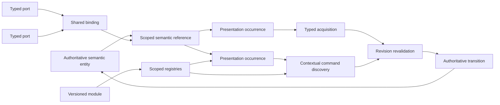

# PBUI-MATHS Pattern Zoo Handbook

## Why this book exists

The PBUI archive contains several attempts to explain how semantic user interfaces should work. One begins with CLIM and React. Another begins with a serializable widget DSL. Another asks how PBUI crosses Wails, QML, and process boundaries. A linked-workspace study starts from synchronized analytical views. The later P01–P15 program explores type theory, fixed points, ports, bidirectional links, coalgebras, algebraic effects, incremental computation, replication, and proof-carrying compilation.

These documents use different words because they start at different boundaries. Their durable center is smaller:

> Stable semantic references appear through transient visual occurrences. Runtime semantic types and explicit context determine applicable commands. Typed acquisition collects missing arguments. Translation remains distinct from subtyping. Authoritative state and effects sit behind serializable contracts. Scoped runtimes and registries permit extension. Linked views coordinate through explicit typed bindings rather than peer-to-peer event relays.

This handbook extracts that center as fourteen design patterns. It is written for a professional developer joining the project. It assumes ordinary software-engineering experience but no category theory, abstract algebra, type theory, or formal methods. Every pattern begins with a first-week explanation and a concrete example. A separate advanced section then develops the mathematics, explains what the laws buy in production, and states where the formal analogy stops.

> [!important] What the mathematics contributes
> The mathematics identifies transformations that must preserve meaning. If two placements share one logical view before copying, an alias-preserving graph copy must make them share one corresponding view afterward. If input acquisition accepts a semantic type, any selected occurrence must carry evidence that its runtime type is compatible. If two ports share one binding, updates must flow through the binding's authoritative state rather than through timing-dependent peer messages. The theory is useful when it rules out an implementation that looks plausible but violates one of those laws.

## Evidence and branch discipline

The four `CLIM UI in React` transcript files are not four independent studies. They share a large inherited foundation; several generated P01–P15 documents are also copied across branch directories. This handbook counts evidence by independent problem setting:

- browser-authored Widget IR and the Goja boundary;
- multi-process desktop and toolkit integration;
- React prototype architecture and persistence;
- linked analytical workspaces;
- the set-theoretic/type-algebra branch;
- the proof-oriented architecture branch.

PDF exports, repeated transcript blocks, compendia, and regenerated branch directories are useful renditions, not additional confirmations. Generated theses and “proof” artifacts are design evidence unless their exact implementation, assumptions, and validation boundary are independently checked.

## How to read a pattern

Each chapter uses the same sequence:

1. **The first-day version** gives the smallest practical rule.
2. **The problem it solves** shows the ambiguity or race the rule removes.
3. **The mathematical model** introduces symbols from a concrete PBUI example.
4. **Advanced reader** places the pattern in category theory or abstract mathematics.
5. **Worked example and pseudocode** shows the implementation boundary.
6. **Failure modes** provide review counterexamples.
7. **Names and sightings** map aliases to exact source headings.
8. **Key points** retain the durable lesson.

Read equations as contracts. Ask what each symbol represents in code, what transformation is allowed, and what observation must remain equal afterward.

## The PBUI system in one page

A semantic object has a stable scoped reference. Rendering creates one or more presentation occurrences: mounted regions that say “this region presents that reference as this semantic type.” A scoped runtime records those occurrences and provides type, command, resolver, authorization, and acquisition services.

Commands are data with stable IDs and typed arguments. Contextual applicability discovers candidate commands from subject type, scope, permissions, and dynamic predicates. If a command lacks an argument, a typed input context waits for a compatible occurrence. Selection returns evidence about what was selected and under which revisions. The command revalidates that evidence against authoritative state immediately before committing one transition.

Renderers, plugins, and remote surfaces do not exchange arbitrary closures. They exchange bounded, versioned semantic contracts. Registries compile module contributions into deterministic scoped indexes. Explicit translators convert between representations; subtype compatibility alone never performs an object lookup or lossy conversion.

Multiple views coordinate through typed ports connected to shared bindings. Bindings own selected semantic state; views render and propose updates. Copy and persistence preserve the graph's intended aliases rather than recursively cloning objects by accident. Interaction traces record outcomes and reasons without pretending that logs are formal proofs.



## The fourteen patterns

1. [[#Pattern 1 — Semantic Reference]]
2. [[#Pattern 2 — Semantic Occurrence]]
3. [[#Pattern 3 — Runtime Semantic Type]]
4. [[#Pattern 4 — Typed Input Context]]
5. [[#Pattern 5 — Command as Data]]
6. [[#Pattern 6 — Explicit Translation]]
7. [[#Pattern 7 — Contextual Applicability and Dispatch]]
8. [[#Pattern 8 — Serializable Semantic Contract]]
9. [[#Pattern 9 — Registry and Module Boundary]]
10. [[#Pattern 10 — Scoped Runtime and Context]]
11. [[#Pattern 11 — Authoritative State, Resolver, and Revision]]
12. [[#Pattern 12 — Typed Port and Shared Binding]]
13. [[#Pattern 13 — Graph-Aware Copy and Persistence]]
14. [[#Pattern 14 — Transactional Interaction and Evidence]]

## Recurring vocabulary

| Term | Meaning in this handbook | Concrete question |
|---|---|---|
| Semantic reference | Stable scoped identity of an application object. | Which object does this command mean after reload or transport? |
| Occurrence | One mounted visual region presenting a reference as a type. | Which visible region did the user act on? |
| Semantic type | Runtime interface meaning used for compatibility and dispatch. | Which commands and input requests may use this value? |
| Input context | Scoped request for one or more typed arguments. | What semantic object is the current interaction waiting for? |
| Command | Serializable typed user intent. | What operation is requested independently of the button that offered it? |
| Translation | Explicit representation-changing derivation. | How can this value become the required type, and what evidence records the conversion? |
| Registry | Scoped deterministic index compiled from module contributions. | Which types, commands, renderers, and codecs exist here? |
| Revision | Version coordinate of authoritative state or policy. | Is the evidence collected earlier still valid at commit time? |
| Port | Named typed endpoint exposed by a view or component. | What may this component share or consume? |
| Binding | Explicit shared semantic state connected to compatible ports. | Which views intentionally coordinate through the same subject? |
| Projection | Derived presentation or explanation of a semantic interaction. | Which facts must this representation preserve? |
| Evidence | Structured reason or witness for a decision. | Why did the match, command, translation, or transition occur? |

## Source map

- [[Transcripts/2026/07/21/React PBUI Widget DSL Guide/pbui-widget-dsl-intern-guide|PBUI Widget DSL Intern Guide]] — browser authoring, semantic references, widget IR, actions, acquisition, registries, and state boundaries.
- [[Transcripts/2026/07/22/PBUI WM Integration Possibilities/pbui_wails_qml_integration_report|PBUI Wails/QML Integration Report]] — process boundaries, toolkit adapters, providers, commands, surfaces, and desktop scope.
- [[Transcripts/2026/07/26/Codebase Analysis and Refactor/PBUI_REACT_ARCHITECTURE_REVIEW|PBUI React Architecture Review]] — occurrence registration, persistence, commands, resolver boundaries, and workspace state.
- [[Transcripts/2026/08/06/CLIM UI in React/LINKED-ANALYSIS-WORKSPACES-PBUI-DATALAB-STUDY|Linked Analysis Workspaces Study]] — typed ports, shared bindings, duplicate/fork semantics, topology, and transactional interaction.
- [[Transcripts/2026/08/06/CLIM UI in React/PRESENTATION-BASED-UI-CLIM-DESIGN-AND-IMPLEMENTATION|PBUI CLIM Design and Implementation]] — foundational React/CLIM vocabulary and operational model.
- [[Transcripts/2026/08/06/CLIM UI in React/BEYOND-CLIM-PROOF-ORIENTED-PRESENTATION-SYSTEM-ARCHITECTURES|Beyond CLIM Proof-Oriented Architectures]] — proof-oriented composition, selectors, ports, bindings, and formal boundaries.
- [[Transcripts/2026/08/06/Branch Branch CLIM UI in React/Semantic-Interfaces-Textbook|Semantic Interfaces Textbook]] — set-theoretic types, selection evidence, dispatch, translation, and semantic-interface pedagogy.
- [[Transcripts/2026/08/06/Branch CLIM UI in React/PBUI-RESEARCH-PROJECTS-COMPENDIUM|PBUI Research Projects Compendium]] — P01–P15 research decomposition and proposed formal extensions.

---

# Pattern 1 — Semantic Reference

## The first-day version

When PBUI puts an application object on screen, identify the object with a small, stable reference rather than with the JavaScript object that happens to contain its data. A useful first reference looks like this:

```text
{ scope: "project:acme", sort: "datalab.document", key: "doc-42" }
```

`scope` says which authority owns the name, `sort` says what kind of application object it names, and `key` distinguishes that object from others of the same sort. If the document is reloaded into a new object, edited into a new immutable snapshot, or displayed by another toolkit, the reference stays the same. The current title, rows, pipeline, and revision are resolved separately.

That separation is the working rule: **pass references between presentations, commands, caches, and persistence; resolve them against current authoritative state when data is needed**. A React key may help React reconcile children, but it is not the application's answer to “which document is this?” A copied row payload, DOM node, pointer, or QObject address is not that answer either. This practical distinction recurs in the Widget DSL, desktop protocol, React review, and linked-workspace studies, which are independently motivated source families rather than repeated branch exports.

## The problem it solves

Suppose `doc-42` is visible as a chart title, as a row in a document browser, and as a pipeline header. The browser row was loaded yesterday; the chart uses a fresh immutable object; the pipeline receives only an ID over a process boundary. Pointer equality says all three values differ. Deep structural equality can also fail because the representations contain different fields. Worse, deep equality can merge two genuinely distinct rows that happen to contain equal values.

The obvious alternative—putting the complete live object everywhere—moves the problem rather than solving it. Captured objects become stale, transport contracts become large and nonserializable, and components begin treating their local copy as authoritative. The Widget guide explicitly recommends carrying references rather than full objects in presentations and resolving them through an entity store ([[Transcripts/2026/07/21/React PBUI Widget DSL Guide/pbui-widget-dsl-intern-guide#7.4 Carry references, not full objects, in presentations|carry references, not full objects]]; [[Transcripts/2026/07/21/React PBUI Widget DSL Guide/pbui-widget-dsl-intern-guide#9.6 Entity store and resolver|entity store and resolver]]). The desktop protocol reaches the same boundary from multi-process integration ([[Transcripts/2026/07/22/PBUI WM Integration Possibilities/pbui_wails_qml_integration_report#2.3 Inline values and live object references|inline values and live references]]), while the React review reaches it from state and persistence concerns ([[Transcripts/2026/07/26/Codebase Analysis and Refactor/PBUI_REACT_ARCHITECTURE_REVIEW#14. Presentation values should be references, not arbitrary live objects|presentation values should be references]]).

A semantic reference solves four concrete problems:

1. It preserves identity across allocation, decoding, immutable updates, and renderer boundaries.
2. It prevents keys from different domains from colliding accidentally.
3. It gives commands and saved state a compact serializable coordinate.
4. It makes freshness explicit: callers resolve current data instead of trusting a captured payload.

It does **not** answer every sameness question. Two data rows may need value equality; two aliases may need an explicit alias policy; two visible regions need occurrence identity; a cached calculation needs both subject identity and relevant revision. PBUI should expose these questions separately instead of hiding them behind one universal `equals`.

## The mathematical model

Start with three concrete values:

```text
r1 = {scope: "project:acme", sort: "datalab.document", key: "doc-42"}
r2 = {scope: "project:acme", sort: "datalab.document", key: "doc-42"}
r3 = {scope: "project:acme", sort: "datalab.source",   key: "doc-42"}
```

Let $S$ be the set of semantic sorts, such as `datalab.document` and `datalab.source`. For each sort $s$ in $S$, let $K_s$ be the set of valid keys for that sort. Let $C$ be the set of runtime scopes or naming authorities. The set of semantic references is

$$
R = \{(c,s,k) \mid c \in C,\ s \in S,\ k \in K_s\}.
$$

The notation says that a reference is a triple whose key is valid for its sort. Here $r_1$ and $r_2$ are the same reference, while $r_3$ is different even though the bare string `doc-42` is equal:

$$
(c,s,k) = (c',s',k')
\quad\text{exactly when}\quad
c=c',\ s=s',\ k=k'.
$$

**Sort and scope separation.** Equal key text does not imply equal application identity across sorts or authorities.

Operationally, maps and caches cannot accidentally treat `source/doc-42` as `document/doc-42`, and two providers can use `doc-42` without a collision.

Let $R_s=\{(c,s,k)\in R\}$ be the references of one fixed sort $s$, let $V_s$ be that sort's current values, and let $N$ be the set of revisions. Resolution is a sort-indexed family of partial operations:

$$
\operatorname{resolve}_s:R_s \times N \to V_s \cup \{\operatorname{missing}\}.
$$

The subscript binds the formerly implicit sort: resolving a document reference yields a document value or `missing`, never a source value. Equivalently, one can use a dependent resolver whose result type is selected by the `sort` tag carried in the input reference. “Partial” is represented explicitly by `missing`; a reference can outlive a mounted occurrence or point at a deleted object.

**Identity–revision separation.** If a document is edited from revision $17$ to $18$, its reference can remain $(\text{project:acme},\text{datalab.document},\text{doc-42})$ while its resolved value changes.

Operationally, stable selection and linking survive edits, while caches can still require a revision match. Putting the revision inside the identity key would make every edit look like deletion followed by creation.

Some domains declare aliases, such as an imported legacy key and a new canonical key. For a fixed scope and sort, let $\sim$ be an explicit equivalence relation on keys. It must be reflexive, symmetric, and transitive:

$$
k\sim k,
$$

$$
k\sim j \Rightarrow j\sim k,
$$

$$
k\sim j \land j\sim m \Rightarrow k\sim m.
$$

Operationally, alias comparison is independent of insertion order. But this is optional policy, not permission to infer aliases from similar payloads. The generated P01 proposal recommends retaining the alias edges and evidence rather than persisting a union-find root ([[Transcripts/2026/08/06/Branch CLIM UI in React/P01-semantic-identity-subject-registry#Formal object of study|formal object of study]]; [[Transcripts/2026/08/06/Branch CLIM UI in React/P01-semantic-identity-subject-registry#Evidence and diagnostics|evidence and diagnostics]]). That capsule and its reported prototype tests are generated/prototype evidence, not a peer-reviewed identity theorem.

## Advanced reader: category theory and abstract mathematics

The sort-indexed construction is a dependent disjoint union. Without scope, it is often written $\sum_{s\in S}K_s$; adding scope yields $\sum_{c\in C}\sum_{s\in S}K_s$. The important property is disjointness: equal-looking elements from two summands remain distinct. In ordinary typed code, branded key types and a tagged record implement the useful part. No category-theory runtime is required.

A resolver can be viewed as a partial map from references to current values, or as a total map into a sum containing `missing`. The total version is usually better at an API boundary because deletion and temporary unavailability become typed outcomes. Revisions index observations of one stable coordinate; they do not enlarge the coordinate itself.

If explicit alias declarations generate $\sim$, then the alias classes form a quotient set. A chosen canonicalizer picks one representative per class, but the quotient class—not a mutable union-find root or lexicographically smallest key—is the semantic object. Any operation advertised as identity-insensitive should be constant on alias classes. This is the idea of a congruence: if $k\sim j$, the operation must not produce observably contradictory answers merely because one spelling was used. The textbook proposal develops identity domains, quotient sets, and revisions under [[Transcripts/2026/08/06/Branch Branch CLIM UI in React/Semantic-Interfaces-Textbook#6.5 Identity domains|identity domains]], [[Transcripts/2026/08/06/Branch Branch CLIM UI in React/Semantic-Interfaces-Textbook#6.6 Quotient sets|quotient sets]], and [[Transcripts/2026/08/06/Branch Branch CLIM UI in React/Semantic-Interfaces-Textbook#14.5 Revisions|revisions]]. This is generated design evidence.

The operational payoff is modest and strong: tagged coordinates give collision isolation; equivalence laws give order-independent alias comparison; revision separation gives stable links with explicit cache invalidation. The overreach would be to claim that PBUI has discovered universal object identity. Identity remains domain-declared, can be undefined for ephemeral values, does not prove authorization, and is distinct from port-binding equivalence or representation translation.

## Worked example and pseudocode

A command is opened from a stale browser row for `doc-42`. Before execution, the command resolves the reference at the current project revision. If the document was deleted, it reports `missing`; if it changed, it uses revision 18 rather than the row's captured revision 17.

```text
type Ref = { scope: ScopeId, sort: SortId, key: Key }
type Snapshot<T> = { revision: Revision, value: T }

function sameReference(a: Ref, b: Ref): Boolean:
    return a.scope == b.scope
       and a.sort == b.sort
       and a.key == b.key

function runRename(intent, stores): Result:
    ref = intent.document
    if ref.sort != "datalab.document":
        return WrongSort(expected="datalab.document", actual=ref.sort)

    store = stores.forScope(ref.scope)
    return store.transaction(state => {
        current = state.resolveDocument(ref.key)
        if current is Missing:
            return MissingReference(ref)
        if current.revision != intent.expectedDocumentRevision:
            return StaleReference(ref)
        if not state.authorizer.allows(intent.actor, "document.rename", ref,
                                       policyRevision=state.policyRevision):
            return Unauthorized(ref)

        next = current.withTitle(intent.newTitle)
        state.replaceDocument(ref.key, next)
        return Renamed(ref, next.revision, state.policyRevision)
    })
```

`sameReference` satisfies sort and scope separation. `runRename` demonstrates the payoff without smuggling authority into identity: knowing the reference is not permission to rename it. Resolution, entity-revision comparison, current-policy authorization, and replacement occur under one transaction, so either an entity edit or an independent permission revocation is observed before commitment.

## Failure modes

- **Bare-string IDs:** `doc-42` from two sorts or projects collides. Carry scope and sort with the key, and use branded codecs at typed boundaries.
- **Pointer identity:** immutable reload splits one semantic object into several identities. Extract a stable reference before storage or presentation.
- **Deep structural identity:** equal-looking rows merge, while compact and detailed forms split. Compare declared coordinates, not arbitrary payloads.
- **Revision in the key:** every edit destroys selection and links. Keep revision in resolved snapshots and validity evidence.
- **Captured object as authority:** a command executes against yesterday's data. Resolve and revalidate at commitment.
- **Canonical representative leakage:** a union-find root or current normalization policy becomes a permanent business ID. Persist declared references and alias evidence instead.
- **Identity as authorization:** possession of `doc-42` is treated as access. Authorization is a separate, current judgment.
- **Reference confused with occurrence:** focusing one chart title accidentally focuses every display of the document. Use Pattern 2's occurrence identity for local visual behavior.

## Names and sightings

| Source | Local name | Shared structure | Important difference |
|---|---|---|---|
| [[Transcripts/2026/07/21/React PBUI Widget DSL Guide/pbui-widget-dsl-intern-guide#3.1 Domain object|Widget DSL guide]] | domain object, reference, resolver | Stable application identity with current resolution | Code-oriented guide; references also cross a Goja/React contract. |
| [[Transcripts/2026/07/22/PBUI WM Integration Possibilities/pbui_wails_qml_integration_report#2.3 Inline values and live object references|WM integration report]] | `ObjectRef`, live reference | Provider-qualified identity and revision-aware lookup | Proposed multi-process desktop protocol; not implementation proof. |
| [[Transcripts/2026/07/26/Codebase Analysis and Refactor/PBUI_REACT_ARCHITECTURE_REVIEW#14. Presentation values should be references, not arbitrary live objects|React architecture review]] | presentation handle/reference | Serializable reference rather than arbitrary live object | Codebase analysis plus refactor recommendation. |
| [[Transcripts/2026/08/06/CLIM UI in React/LINKED-ANALYSIS-WORKSPACES-PBUI-DATALAB-STUDY#3.2 Why object identity matters for links|Linked-workspace study]] | application object, semantic identity | Stable identity supports links across views | Generated design study; binding identity remains separate. |
| [[Transcripts/2026/08/06/CLIM UI in React/PRESENTATION-BASED-UI-CLIM-DESIGN-AND-IMPLEMENTATION#7.1 Semantic identity descriptors|PBUI implementation account]] | semantic identity descriptor | Namespaced key extraction and comparison | Generated account of an implemented baseline; duplicate branch copies are one lineage. |

“Presentation reference” is overloaded in the corpus: it sometimes means the semantic reference alone and sometimes a handle carrying type, value, or occurrence metadata. This chapter reserves **semantic reference** for the stable application coordinate.

> [!example] Architecture Garden evidence
> [[Research/Software Architecture Garden/upwork-tracker/02 - Capture Ingestion Projection and Local State#Canonical identity|Upwork Tracker's canonical identity analysis]] distinguishes occurrence identity from content identity, while [[Research/Software Architecture Garden/zitadel-go-test/README|zitadel-go-test]] projects an external principal to the scoped `(issuer, subject)` coordinate. Both confirm that identity must outlive one in-memory representation.

## Key points

- A semantic reference is a scoped, sort-indexed key, not a live object or renderer identity.
- Current data and revision are resolved separately from stable identity.
- Equality, aliasing, freshness, value equality, occurrence identity, and authorization are different judgments.
- References make commands, caches, transport, persistence, and cross-view links smaller and safer.
- Quotients explain declared aliases, but universal identity and automatic structural aliasing would be overclaims.

# Pattern 2 — Semantic Occurrence

## The first-day version

A semantic occurrence is one visible, addressable appearance of a semantic reference. If `doc-42` appears in a browser row, a chart title, and a pipeline header, PBUI has one semantic reference and three occurrences. Each occurrence can have its own DOM node, geometry, focus, hover state, form, surface, and lifetime.

Rendering remains the host toolkit's job. PBUI does not replace a React component, SVG mark, QML item, or native widget. It wraps or registers the region so the interaction runtime knows, “this committed region currently presents `doc-42` as a document.” That is why the WM report says presentations are occurrences, not widgets ([[Transcripts/2026/07/22/PBUI WM Integration Possibilities/pbui_wails_qml_integration_report#2.2 Presentations are occurrences, not widgets|presentations are occurrences, not widgets]]) and the React review says semantics attach to objects rather than pixels ([[Transcripts/2026/07/26/Codebase Analysis and Refactor/PBUI_REACT_ARCHITECTURE_REVIEW#6.3 Presentation semantics are attached to objects, not pixels|semantics attach to objects]]).

On day one, remember two IDs: the semantic reference answers **what application object is this?**; the occurrence ID answers **which appearance did the user activate?** Do not choose one as a substitute for the other.

## The problem it solves

Ordinary callbacks bind behavior to components. A row's `onClick` knows about the row, and a chart mark's handler knows about the mark, but neither contributes to a shared typed interaction. PBUI needs visible output to become reusable input without forcing every renderer into one widget hierarchy.

Conflating object and occurrence creates subtler bugs. Imagine the browser row carries a compact snapshot while the chart title carries a fresh detailed snapshot. If applicability is cached by semantic reference, PBUI may correctly learn that the document is acceptable. If commitment then returns whichever payload was cached first, clicking the chart can return the row's stale payload. Identity can deduplicate an eligibility calculation; it cannot erase which region was activated. The implementation account names this rule “separate denotation from occurrence” ([[Transcripts/2026/08/06/CLIM UI in React/PRESENTATION-BASED-UI-CLIM-DESIGN-AND-IMPLEMENTATION#6.1 Separate denotation from occurrence|separate denotation from occurrence]]).

Renderer lifecycle adds another boundary. React may render speculatively and abandon a tree, reuse a local key, mount a replacement before an old cleanup runs, or virtualize an off-screen row. Registering during render creates ghost candidates. Cleaning up by occurrence ID alone can delete a newer replacement. The generated P02 capsule proposes commit-causal publication with generation leases to address these races ([[Transcripts/2026/08/06/Branch CLIM UI in React/P02-occurrence-lifecycle-react-adapter#Formal object of study|formal object of study]]). Its renderer-neutral prototype tests are useful experimental evidence, but they do not establish correctness for React Offscreen, hydration, or every concrete adapter.

## The mathematical model

Let $R$ be the semantic-reference set from Pattern 1. Let $O$ be the set of currently committed occurrence identities. For the three visible appearances:

```text
o-row   denotes doc-42
 o-title denotes doc-42
 o-pipe  denotes doc-42
```

Define the denotation function

$$
d:O\to R.
$$

Then

$$
d(o_{row})=d(o_{title})=d(o_{pipe})=r_{doc42},
$$

while

$$
o_{row}\ne o_{title}\ne o_{pipe}.
$$

**One denotation per occurrence.** Every committed occurrence denotes exactly one semantic reference at a particular committed generation.

Operationally, activation can always return an unambiguous semantic target, while many occurrences may denote the same target.

Let $T$ be the set of runtime semantic types and $F$ the set of rendering forms, such as `compact-row`, `chart-title`, and `pipeline-header`. An occurrence descriptor can be modeled as

$$
\operatorname{desc}(o)=(d(o),\tau(o),f(o),u(o)),
$$

where $\tau(o)\in T$ is the presented semantic type, $f(o)\in F$ is the visual form, and $u(o)$ is toolkit-local metadata such as surface and hit target. Type and form are separate: two forms can present the same reference as the same type, and one reference can have several semantically legitimate roles.

For lifecycle safety, let $I$ be occurrence IDs, $G$ generation numbers, and $D$ descriptors. The active registry is a partial map represented with an explicit absent case:

$$
A:I\to (G\times D)\cup\{\operatorname{absent}\}.
$$

A lease is a pair $(i,g)$. Cleanup removes an entry only if its generation still matches:

$$
\operatorname{cleanup}(A,(i,g))=A\setminus\{i\}
\quad\text{if }A(i)=(g,D),
$$

and otherwise

$$
\operatorname{cleanup}(A,(i,g))=A.
$$

**Stale cleanup inertness.** Cleanup from generation $g$ cannot remove generation $g+1$.

Operationally, delayed effect cleanup is harmless after replacement. Activation follows the same rule: it is accepted only if occurrence ID, generation, denotation, surface policy, and current input context still agree.

**Commit-only publication.** Speculative rendering does not add an element to $O$; only adapter commitment does.

Operationally, abandoned renders cannot become selectable ghost regions. Virtualization removes an occurrence from $O$ but does not delete its reference from $R$ or its entity from the authoritative store.

## Advanced reader: category theory and abstract mathematics

The denotation map $d:O\to R$ is an object over $R$ in the slice category $\mathbf{Set}/R$. For a reference $r$, the fiber

$$
O_r=\{o\in O\mid d(o)=r\}
$$

is the set of its current appearances. This vocabulary precisely explains why object-level work may be shared over a fiber while focus, geometry, and activation remain attached to one member. A map between two occurrence registries is meaningful only if it preserves denotation. In code, ordinary records, maps, and invariant tests are enough; implementing a “slice category” package would add no value.

Occurrence lifetime is better modeled as a labeled transition system than as a static set:

$$
\operatorname{Absent}\to\operatorname{Prepared}\to\operatorname{Committed}(g)\to\operatorname{Retired}.
$$

Generations act like fencing tokens. They impose a simple temporal order on replacements and make stale operations observationally inert. This is infrastructure mathematics, not a claim that React itself has this state machine. A concrete adapter must show that render, commit effects, cleanup, hydration, and external-store publication refine the abstract protocol. The proof-oriented proposal calls occurrences “committed semantic resources” and states the React concurrency rule under [[Transcripts/2026/08/06/Branch CLIM UI in React/PRESENTATION-BASED-UI-ARCHITECTURES-BEYOND-CLIM#29. Occurrences as committed semantic resources|committed semantic resources]] and [[Transcripts/2026/08/06/Branch CLIM UI in React/PRESENTATION-BASED-UI-ARCHITECTURES-BEYOND-CLIM#29.2 React concurrency rule|React concurrency rule]]. Those are generated proposed semantics, not a completed adapter proof.

The operational payoff is exact: fibers justify sharing subject-level eligibility without losing clicked-occurrence materialization; the transition system supplies testable no-ghost and stale-cleanup laws. The abstraction stops at mounted semantic output. It does not make the occurrence a logical view, placement, output-history record, or domain object, and it cannot promise direct-manipulation completeness for unmounted virtualized items.

## Worked example and pseudocode

The title occurrence is replaced during a React update. Generation 7 is committed, generation 8 replaces it, and cleanup for generation 7 arrives late. The registry must retain generation 8. Later, a click carrying the old lease must fail.

```text
type Lease = { occurrenceId: Id, generation: Integer }
type Descriptor = { ref: Ref, semanticType: TypeId,
                    form: FormId, surface: SurfaceId }

function commit(id, descriptor): Lease:
    return registry.transactionFor(id, state => {
        // highWater survives cleanup, so a generation is never reused.
        next = state.highWater.getOrDefault(id, 0) + 1
        state.highWater[id] = next
        state.active[id] = { generation: next, descriptor: descriptor }
        state.publishSnapshot()
        return { occurrenceId: id, generation: next }
    })

function cleanup(lease): Void:
    current = active[lease.occurrenceId]
    if current exists and current.generation == lease.generation:
        delete active[lease.occurrenceId]
        publishSnapshot(active)

function activate(lease, expectedRef, inputContext): Result:
    current = active[lease.occurrenceId]
    if current is missing or current.generation != lease.generation:
        return StaleOccurrence
    if not sameReference(current.descriptor.ref, expectedRef):
        return RetargetedOccurrence
    if not inputContext.accepts(current.descriptor):
        return NotApplicable
    return AcceptedOccurrence(lease, current.descriptor)
```

After generation 8 commits, `cleanup({id:title,generation:7})` changes nothing. `activate` materializes the exact current descriptor rather than a subject-level cached payload. Pointer, keyboard, and accessibility activation should all call this same validation path.

## Failure modes

- **Object equals occurrence:** all appearances share focus, geometry, or payload. Keep subject-level and occurrence-level state separate.
- **Occurrence equals component:** semantic registration can only wrap one custom widget family. Let adapters annotate host-toolkit regions.
- **Registration during render:** abandoned speculative trees remain selectable. Publish only after commitment.
- **Cleanup by ID alone:** a late cleanup removes a replacement. Fence cleanup and activation with generations.
- **React key as domain identity:** local reconciliation decisions leak into commands and persistence. Use a semantic reference for denotation and a separate occurrence ID for the mounted appearance.
- **Eligibility cache returns payload:** clicking a detailed form returns a stale compact value. Cache subject-level truth only where lawful, then materialize and revalidate the activated occurrence.
- **Virtualization deletes the subject:** scrolling a row away destroys selection or links. Retire only the occurrence; keep the semantic reference and entity store independent.
- **Mounted means visible or enabled:** hidden, occluded, disabled, and off-screen states are collapsed. Model these as separate policies when they matter.

## Names and sightings

| Source | Local name | Shared structure | Important difference |
|---|---|---|---|
| [[Transcripts/2026/07/21/React PBUI Widget DSL Guide/pbui-widget-dsl-intern-guide#3.2 Presentation|Widget DSL guide]] | presentation, presentation adapter | A rendered region carries object and type semantics | Code-oriented Goja/React guide; prototype coverage is local. |
| [[Transcripts/2026/07/22/PBUI WM Integration Possibilities/pbui_wails_qml_integration_report#2.2 Presentations are occurrences, not widgets|WM integration report]] | presentation occurrence | Toolkit-neutral occurrence registered with desktop semantics | Proposed Wails/QML/WM protocol. |
| [[Transcripts/2026/07/26/Codebase Analysis and Refactor/PBUI_REACT_ARCHITECTURE_REVIEW#1.5 Presentation|React architecture review]] | presentation | Visible object/type association usable by accept | Review of current prototype plus recommendations. |
| [[Transcripts/2026/08/06/CLIM UI in React/PRESENTATION-BASED-UI-CLIM-DESIGN-AND-IMPLEMENTATION#2.3 Presentation occurrences|PBUI implementation account]] | presentation occurrence | One object may have many screen appearances | Generated implementation account; one common branch lineage. |
| [[Transcripts/2026/08/06/Branch CLIM UI in React/P02-occurrence-lifecycle-react-adapter#Proof and validation obligations|P02 capsule]] | committed registration, generation, lease | Commit-causal publication and stale-operation fencing | Generated/proposed capsule with renderer-neutral prototype evidence, not a React refinement proof. |

“Presentation” sometimes means the object/type pair and sometimes the mounted appearance. This chapter uses **semantic occurrence** only for the latter. A logical view, workspace tile, and occurrence may coincide in a small demo but have different identities and lifecycles.

## Key points

- One semantic reference can have many semantic occurrences.
- An occurrence records denotation, semantic type, form, surface, and lifecycle without replacing the host renderer.
- Subject-level eligibility may be shared, but activation must return and revalidate the exact occurrence used.
- Commit-only publication and generation fencing prevent ghost entries and stale cleanup races.
- Occurrence mathematics does not turn React's tree into semantic truth or promise access to unmounted output.

# Pattern 3 — Runtime Semantic Type

## The first-day version

A runtime semantic type says what an application reference means to PBUI, not merely what shape its JavaScript value has. For example:

```text
datalab.object
  └── datalab.analysis
       └── datalab.document
```

An occurrence presented as `datalab.document` can satisfy a request for `datalab.analysis` because every document is declared to be an analysis in this application vocabulary. A TypeScript interface alone cannot provide this behavior at runtime: types are erased, remote values cross language boundaries, and two structurally equal records may play different semantic roles.

Start small. Give atomic types stable namespaced IDs, register explicit parent edges, and ask the registry whether one type is compatible with another. Keep capabilities such as `inspectable`, current predicates such as “editable by this user,” and translations such as `ProjectId -> Project` out of the parent graph unless they really express representation-safe substitutability.

## The problem it solves

With exact string matching, a command requesting `datalab.analysis` rejects a visible `datalab.document` even when the document supports the entire analysis interface. Developers then duplicate commands for every concrete type or add ad hoc string lists. With TypeScript-only typing, the browser may know a static interface while the Wails broker, QML application, serialized manifest, and dynamic plugin do not.

The opposite mistake is an overpowered hierarchy. If a project ID string is declared a subtype of `project`, code that accepts a project may immediately read `.title` from a string. That is lookup or translation, not substitutability. If “archivable by the current user” becomes a subtype, changing permissions mutates what was supposed to be stable ancestry. The PBUI implementation account states the boundary directly: subtyping means “already is,” while conversion means “can be interpreted as” ([[Transcripts/2026/08/06/CLIM UI in React/PRESENTATION-BASED-UI-CLIM-DESIGN-AND-IMPLEMENTATION#10.1 Subtyping means “already is”|subtyping means already is]]; [[Transcripts/2026/08/06/CLIM UI in React/PRESENTATION-BASED-UI-CLIM-DESIGN-AND-IMPLEMENTATION#10.2 Conversion means “can be interpreted as”|conversion means can be interpreted as]]).

A runtime semantic type therefore supplies a shared vocabulary for presentation registration, typed input, command applicability, rendering choices, protocol manifests, and diagnostics. The Widget guide defines presentation types at the Goja/React boundary ([[Transcripts/2026/07/21/React PBUI Widget DSL Guide/pbui-widget-dsl-intern-guide#3.3 Presentation type|presentation type]]); the WM report proposes type definitions and subtyping across desktop applications ([[Transcripts/2026/07/22/PBUI WM Integration Possibilities/pbui_wails_qml_integration_report#2.4 Type definitions and subtyping|type definitions and subtyping]]); and the React review independently identifies exact strings as too weak ([[Transcripts/2026/07/26/Codebase Analysis and Refactor/PBUI_REACT_ARCHITECTURE_REVIEW#13. Presentation types are strings rather than an extensible type system|strings are not an extensible type system]]).

## The mathematical model

Let $R$ be the semantic references from Pattern 1. Let $T$ be a set of runtime semantic type IDs. Use these concrete atoms:

```text
object, analysis, document, pipeline
```

A type's meaning is the set of references classified by that type. Let

$$
D:T\to \mathcal P(R),
$$

where $\mathcal P(R)$ means the set of all subsets of $R$. If $t$ is `document`, then $D(t)$ is the set of document references in the current semantic world.

Membership is written

$$
r:t
$$

and means $r\in D(t)$. It is a semantic judgment, not a JavaScript `instanceof` test.

Define semantic subtyping by set inclusion:

$$
s\le t
\quad\text{when}\quad
D(s)\subseteq D(t).
$$

Thus `document` $\le$ `analysis` says every document reference is acceptable where an analysis reference is required.

**Reflexivity.** Every type is a subtype of itself:

$$
t\le t.
$$

Operationally, exact-type presentations remain acceptable without special cases.

**Transitivity.** Subtype chains compose:

$$
r\le s \land s\le t \Rightarrow r\le t.
$$

Here the letters denote types, not semantic references. Operationally, if `document` is below `analysis` and `analysis` is below `object`, a document satisfies an object request even without a direct edge.

**Membership inheritance.** Presented membership flows upward:

$$
x:s \land s\le t \Rightarrow x:t.
$$

Operationally, a typed input context and command dispatcher can use one compatibility service instead of copying ancestor lists.

A practical registry stores only declared parent edges $E\subseteq T\times T$. The runtime computes $\le$ by graph reachability, including a zero-edge path for reflexivity. Cycles should be rejected or diagnosed because two distinct names that reach each other are semantically equivalent in the subtype preorder and usually signal duplicate definitions.

The set model also suggests optional constructors. If supported, union and intersection mean

$$
D(s\cup t)=D(s)\cup D(t),
$$

$$
D(s\cap t)=D(s)\cap D(t).
$$

These laws make a request such as “document or source” compositional. They do not require the first implementation to support a full Boolean algebra. The generated textbook proposes a larger set-theoretic calculus under [[Transcripts/2026/08/06/Branch Branch CLIM UI in React/Semantic-Interfaces-Textbook#5.2 A type denotes a set|a type denotes a set]] and [[Transcripts/2026/08/06/Branch Branch CLIM UI in React/Semantic-Interfaces-Textbook#11. Membership and semantic subtyping|membership and semantic subtyping]]. That is proposed design evidence. The implemented baseline described in [[Transcripts/2026/08/06/CLIM UI in React/PRESENTATION-BASED-UI-CLIM-DESIGN-AND-IMPLEMENTATION#7.2 Runtime subtype graph|runtime subtype graph]] is the restrained starting point.

## Advanced reader: category theory and abstract mathematics

A subtype relation with reflexivity and transitivity is a preorder. Viewed categorically, it is a thin category: types are objects, and there is at most one arrow $s\to t$, precisely when $s\le t$. Identity arrows correspond to reflexivity; arrow composition corresponds to transitivity. Reachability in the declared DAG is therefore not just an implementation trick—it computes the generated preorder.

If $s\le t$ and $t\le s$ for distinct names, the preorder is not antisymmetric. Quotienting mutually reachable types produces a partial order, but production systems often prefer to reject accidental cycles and preserve explicit aliases or migrations. Again, the quotient is explanatory unless the product truly supports equivalent type names.

When union and intersection exist with their set meanings, they are joins and meets in the subtype order: $s\cup t$ is the least type above both, and $s\cap t$ is the greatest type below both. This gives practical law tests such as commutativity and idempotence. Full complements are dangerous in an open registry: adding a plugin type changes the universe against which “not document” is interpreted. Base-relative difference or snapshot-scoped meaning is more honest, as the generated textbook warns under [[Transcripts/2026/08/06/Branch Branch CLIM UI in React/Semantic-Interfaces-Textbook#11.9 Open-world negation|open-world negation]].

The categorical payoff is bounded: a thin category explains subtype composition, and a lattice explains lawful unions and intersections. It does not make translation a subtype arrow. A translator may perform lookup, fail, incur effects, change representation, or require authority; those facts violate the direct substitutability promised by $D(s)\subseteq D(t)$. Nor does set inclusion prove behavioral compatibility of arbitrary host values unless membership and consumer obligations are themselves sound. The formal model is a contract for a documented runtime fragment, not a claim that PBUI implements a complete programming-language type checker.

## Worked example and pseudocode

Register four namespaced atoms and three direct edges. Then test a visible document occurrence against requests for `analysis`, `object`, and `pipeline`.

```text
function registerType(id): Void:
    require isNamespaced(id)
    require id not in types
    types.add(id)
    parents[id] = emptySet()

function addSubtype(child, parent): Result:
    require child in types and parent in types
    if reaches(parent, child):
        return CycleDetected(child, parent)
    parents[child].add(parent)
    subtypeCache.clear()
    return Added

function isSubtype(actual, requested): Boolean:
    if actual == requested:
        return true
    return graphSearch(start=actual,
                       next=(t) => parents[t],
                       goal=requested)

registerType("datalab.object")
registerType("datalab.analysis")
registerType("datalab.document")
registerType("datalab.pipeline")
addSubtype("datalab.analysis", "datalab.object")
addSubtype("datalab.document", "datalab.analysis")
addSubtype("datalab.pipeline", "datalab.object")

assert isSubtype("datalab.document", "datalab.analysis")
assert isSubtype("datalab.document", "datalab.object")
assert not isSubtype("datalab.document", "datalab.pipeline")
```

The zero-edge equality case implements reflexivity; graph traversal implements transitivity. The cycle check prevents silent equivalence, and cache invalidation makes results relative to the current registry version. An occurrence with actual type `datalab.document` can now satisfy an input request for `datalab.analysis`. A `datalab.document-id` should not be added below `datalab.document`; define an explicit resolver or translator instead.

Capabilities and refinements can sit beside this service:

```text
compatible = isSubtype(occurrence.type, request.type)
          and request.refinement(currentContext, occurrence.ref)
```

The first term is stable structural compatibility. The second may change with permissions, revision, or user context and must be re-evaluated accordingly.

## Failure modes

- **Exact-string-only typing:** reusable commands reject valid subtypes. Compute explicit reachability in a scoped registry.
- **TypeScript shape equals semantic type:** erased or remote values lose meaning, and equal shapes imply false substitutability. Carry stable runtime IDs.
- **Lookup as subtyping:** `ProjectId` is accepted where code expects `.title`. Use a separate translation or resolver.
- **Capability as ancestry:** `inspectable` or `archivable-now` creates a sprawling, mutable class tree. Model orthogonal capabilities or refinements.
- **Every predicate becomes a named subtype:** the registry explodes and cache invalidation becomes opaque. Keep dynamic predicates explicit.
- **Registration order resolves conflict:** plugin import order changes meaning. Reject duplicate IDs, diagnose cycles, and use explicit policy for ambiguity.
- **Unbounded Boolean calculus:** normalization, open-world negation, and arbitrary refinements become a hidden language implementation. Begin with atoms and a modest DAG.
- **Subtype result treated as authorization:** structural compatibility enables an operation without current permission. Authorization remains authoritative and context-relative.
- **Type confused with form:** `compact-row` becomes a subtype of `document`. Forms control rendering; semantic types classify application meaning.

## Names and sightings

| Source | Local name | Shared structure | Important difference |
|---|---|---|---|
| [[Transcripts/2026/07/21/React PBUI Widget DSL Guide/pbui-widget-dsl-intern-guide#3.3 Presentation type|Widget DSL guide]] | presentation type, ptype | Runtime semantic classification used by presentation and accept | Code-oriented guide; warns that ptype is not backend schema type. |
| [[Transcripts/2026/07/22/PBUI WM Integration Possibilities/pbui_wails_qml_integration_report#1.1 Typed presentations|WM existing model]] | typed presentation | Type labels cross application boundaries | Existing v1 is smaller than the proposed registry and subtype model. |
| [[Transcripts/2026/07/22/PBUI WM Integration Possibilities/pbui_wails_qml_integration_report#2.4 Type definitions and subtyping|WM proposal]] | type definition, subtype | Namespaced runtime vocabulary and compatibility | Proposed desktop protocol, not production attestation. |
| [[Transcripts/2026/07/26/Codebase Analysis and Refactor/PBUI_REACT_ARCHITECTURE_REVIEW#31.4 Type hierarchy|React architecture review]] | type hierarchy | Shared parent relation for command acquisition | Refactor target derived from prototype review. |
| [[Transcripts/2026/08/06/CLIM UI in React/PRESENTATION-BASED-UI-CLIM-DESIGN-AND-IMPLEMENTATION#7.2 Runtime subtype graph|PBUI implementation account]] | runtime subtype graph | Declared edges and transitive compatibility | Generated account of implemented nominal baseline. |
| [[Transcripts/2026/08/06/Branch Branch CLIM UI in React/Semantic-Interfaces-Textbook#5.4 Set operations as type constructors|Semantic Interfaces textbook]] | type expression, atom, union, intersection | Types denote sets of semantic references | Generated proposal extends far beyond the baseline and must name its decidable fragment. |

“Type” is overloaded. A TypeScript type checks source programs; a backend schema validates data shape; a semantic type classifies a reference's interface meaning at runtime; a form chooses how an occurrence is rendered. This chapter concerns only the third.

> [!example] Architecture Garden evidence
> [[Research/Software Architecture Garden/go-go-datadrop/02 - The Presentation Protocol#2. The concrete shape|go-go-datadrop's presentation protocol]] uses interface-level presentation types to classify what a visible value means and which verbs it offers, independently of the value's TypeScript structural shape.

## Key points

- A runtime semantic type classifies application references after TypeScript types have been erased.
- Semantic subtyping means representation-safe substitutability and is modeled by inclusion of denoted reference sets.
- A namespaced atomic vocabulary plus an explicit subtype DAG is the restrained implementation.
- Capabilities, dynamic refinements, translations, forms, and authorization are separate relations.
- Preorders and optional lattice operations explain the laws, but a full open-world type calculus would exceed the demonstrated need.

---

# Pattern 4 — Typed Input Context

## The first-day version

A typed input context lets code say, “I need one `Field`,” and lets the user satisfy that request with any currently eligible field presentation. The requesting command does not need to know whether the field appears in a chart, a table, a search result, or another workspace. PBUI temporarily marks compatible occurrences, accepts keyboard or pointer activation, validates the chosen occurrence again, and returns a semantic reference rather than a DOM node.

For example, a chart command may already know its target document but still need an x-axis field. It opens an acquisition session owned by that command invocation. A table column headed `revenue` and a chart mark denoting the same field can both satisfy the request. Persistent table selection is not the session: it may suggest a candidate, but only an explicit submission to the active session completes the missing argument.

Treat each acquisition as an owned, cancellable session. Give it a unique ID, requester ID, semantic type, scope, cardinality, and replacement policy. The owning runtime—not a row component—holds the continuation. Escape, an `AbortSignal`, owner teardown, provider unmount, deadline expiry, or supersession must settle the caller exactly once. A practical first version allows one active request per project interaction scope and either rejects or explicitly replaces a second request.

## The problem it solves

A local callback is adequate when a button always consumes one value already in its component. It breaks down when a reusable command needs an argument that may be visible elsewhere. Passing setters through the component tree couples command logic to layout. Storing a promise resolver in the selectable widget couples the lifetime of the caller to a transient rendering. Reading a process-global “current selection” loses the requested type, the requesting command, and the scope in which the selection is meaningful.

The failure becomes visible at lifecycle boundaries. A second request can overwrite the first resolver and leave its promise pending. Unmounting the workbench can orphan a caller. Two embedded projects can compete for one global Escape listener. A remote translation can finish after cancellation and resolve a newer request. A candidate that was eligible on hover can lose permission or change revision before click. Multi-select is ambiguous unless minimum and maximum cardinality are stated.

Typed acquisition separates five concerns:

- the **request** states what semantic value is missing;
- the **session** owns temporal state and a unique token;
- the **scope** says which occurrences and input devices may participate;
- the **matcher** decides current eligibility and produces evidence;
- the **owner** controls cancellation, supersession, focus restoration, and final settlement.

The smallest useful broker should therefore specify `owner`, `scope`, `type`, `cardinality`, `occurrencePolicy`, `signal`, and `replacementPolicy`. Scope may be host, workspace, project, or—only deliberately—desktop/seat. Cardinality distinguishes exactly one, optional one, and bounded many. Occurrence policy distinguishes direct manipulation of mounted output from subject-only lookup. None of these choices should be inferred from whichever React component happens to call `accept`.

## The mathematical model

Let $Q$ be the set of unique session IDs, $O$ the set of owners, $R$ semantic references, $E$ environment snapshots, and $T$ semantic types. A request is a record

$$
q=(id,owner,type,scope,min,max,policy,revision).
$$

For the running example, `type = Field`, `min = max = 1`, and `scope = project-7`. Let $eligible(r,q,e)$ mean that reference $r$ has a currently committed occurrence in the allowed scope, satisfies the requested type directly or by an allowed translation, and passes the request's predicates in environment $e$.

The broker state is deliberately small:

$$
S = Idle + Active(q,A) + Resolving(q,A,r),
$$

where $A$ is the set or ordered list of values already acquired. Events include `START`, `SUBMIT`, `RESOLVE`, `CANCEL`, and `OWNER_GONE`. A transition is written $s \xrightarrow{a} s'$.

**Acceptance soundness.** If a session successfully returns $A$ at commit snapshot $e_c$, every returned reference is eligible and cardinality is satisfied:

$$
Success(q,A,e_c) \Rightarrow min(q) \leq |A| \leq max(q)
\land \forall r \in A.\ eligible(r,q,e_c).
$$

Operationally, highlighting is only advice. `submit` must rematch the exact activated occurrence and current authority before settlement.

**At-most-once settlement.** For each session ID, the number of terminal outcomes is at most one:

$$
\forall id \in Q.\ |terminal(id)| \leq 1.
$$

Operationally, Escape racing an asynchronous translator cannot both cancel and resolve the same caller. A settled bit plus current-session ID check is sufficient for a basic implementation.

**Ownership confinement.** Only the active owner, its broker, or an authorized lifecycle parent may cancel or replace a session:

$$
Cancel(actor,q) \Rightarrow actor=owner(q) \lor controls(actor,owner(q)).
$$

Operationally, unmounting an unrelated tile cannot cancel another project's acquisition, and a closed context cannot retain keyboard ownership.

**Cancellation isolation.** Once session $q$ is terminally cancelled, later events carrying $q$ cannot change live application state:

$$
Cancelled(q) \land late(q,a) \Rightarrow step(s,a)=s.
$$

Operationally, abort the translator and also fence its completion by session ID; abort alone is not enough when an implementation ignores the signal.

**Explicit supersession.** A `START` while active follows a declared policy: reject, cancel-and-replace, queue, or stack. There is no transition that silently overwrites the old continuation. Stacking is not the default because it adds focus-restoration and nested-cancellation obligations.

These are exact safety claims under matcher soundness, current-snapshot revalidation, and correct scope membership. They do not guarantee that the user will eventually choose something. Liveness needs assumptions such as a reachable cancellation gesture and a fair effect handler.

## Advanced reader: category theory and abstract mathematics

The immediate structure is a labeled transition system, not a promise. If $A$ is the set of input events, an operational machine can be represented as a partial function $\delta:S\times A\to S\times O_u$, where $O_u$ contains broker outputs such as “announce candidate,” “abort effect,” or “settle result.” Traces make cancellation races testable. A coalgebraic account can model ongoing observation of the machine, and bisimulation can compare a React broker with a remote desktop broker, but ordinary reducer traces are enough for the first implementation.

The asynchronous `accept` façade is an effect operation: a workflow requests a value of type $\tau$ and suspends until an interpreter returns success, rejection, or cancellation. Algebraic effects or a free-monadic interaction language become useful only when the same workflow must run through browser, scripted-test, and remote handlers. They do not remove the need for unique IDs, ownership, commit revalidation, or resource cancellation.

There is also an indexed aspect: sessions are indexed by owner and scope. The admissible occurrences for `(project-7, seat-default)` form a different fiber from those for `(project-8, seat-default)`. This language explains why one unqualified global accept is ill-typed, but PBUI need not implement a fibration. Owner-qualified maps and scope checks carry the architectural payoff.

The theorem-like result is the acceptance-safety implication above. It is derived from matcher/translator soundness, current-ID fencing, and commit revalidation. It is not a proof of accessibility, eventual completion, or authorization. The source progression from a promise prototype to an explicit machine appears in [[Transcripts/2026/08/06/Branch Branch CLIM UI in React/Semantic-Interfaces-Textbook#18. Input contexts as a transition system|input contexts as a transition system]] and [[Transcripts/2026/08/06/CLIM UI in React/BEYOND-CLIM-PROOF-ORIENTED-PRESENTATION-SYSTEM-ARCHITECTURES#29.2 A small interaction machine|a small interaction machine]]. These are related generated design lineages, not independent formal proofs.

## Worked example and pseudocode

A `Use field as x-axis` command has a target chart but no field. It requests exactly one `Field` from project `p-7`. The broker highlights compatible occurrences in all workspaces sharing that project broker. The user activates the `revenue` column. Before returning it, the broker confirms the occurrence lease is current, rematches the reference, and checks cardinality. If the project closes while a remote translator is pending, owner teardown cancels and settles the request.

```text
type AcceptSpec = {
    owner: InvocationId
    requestedType: SemanticType
    scope: Scope
    min: Int
    max: Int
    replacement: "reject" | "replace"
    signal?: AbortSignal
}

type Pending = {
    id: SessionId
    spec: AcceptSpec
    values: List<SemanticRef>
    settled: Bool
    controller: AbortController
}

function request(actor, spec): Promise<AcceptResult>:
    if actor != spec.owner and not controls(actor, spec.owner):
        return resolved(Rejected("unauthorized-owner"))
    if pending != null:
        if spec.replacement == "reject":
            return resolved(Rejected("session-already-active"))
        cancelled = cancel(actor, pending.id, "superseded")
        if cancelled is UnauthorizedCancellation:
            return resolved(Rejected("unauthorized-supersession"))
        // cancel aborts the old controller and terminally settles its continuation.
        require pending == null

    q = Pending(freshSessionId(), spec, [], false, AbortController())
    pending = q
    subscribeOwnerGone(spec.owner,
        () => cancel(lifecycleAuthority(spec.owner), q.id, "owner-gone"))
    subscribeAbort(spec.signal,
        () => cancel(spec.owner, q.id, "caller-aborted"))
    publishActiveRequest(q.id, spec)
    return continuationFor(q.id)

function submit(sessionId, occurrenceLease): Bool:
    q = pending
    if q == null or q.id != sessionId or q.settled:
        return false
    occurrence = occurrenceRegistry.current(occurrenceLease)
    if occurrence == null or not q.spec.scope.contains(occurrence.origin):
        return false
    match = matcher.revalidate(occurrence.ref, q.spec.requestedType, currentEnv())
    if match.kind != "success":
        return false
    next = q.values + [{ref: match.acceptedRef, lease: occurrenceLease}]
    if size(next) > q.spec.max:
        return false
    q.values = next
    if size(next) == q.spec.max:
        return finish(sessionId)
    return true

function finish(sessionId): Bool:
    q = pending
    if q == null or q.id != sessionId or q.settled:
        return false
    if size(q.values) < q.spec.min or size(q.values) > q.spec.max:
        return false

    accepted = []
    evidence = []
    env = currentEnv()
    for selected in q.values:
        occurrence = occurrenceRegistry.current(selected.lease)
        if occurrence == null or not q.spec.scope.contains(occurrence.origin):
            return false
        match = matcher.revalidate(selected.ref, q.spec.requestedType, env)
        if match.kind != "success":
            return false
        accepted.append(match.acceptedRef)
        evidence.append(match.evidence)
    settleOnce(q, Accepted(accepted, evidence))
    return true

function cancel(actor, sessionId, reason):
    q = pending
    if q == null or q.id != sessionId:
        return
    if actor != q.spec.owner and not controls(actor, q.spec.owner):
        return UnauthorizedCancellation
    q.controller.abort()
    settleOnce(q, Cancelled(reason))

function settleOnce(q, result):
    if q.settled:
        return
    q.settled = true
    if pending?.id == q.id:
        pending = null
    releaseFocusAndHighlights(q.id)
    resolveContinuation(q.id, result)
```

The ID checks establish stale-event inertness; `settled` establishes at-most-once completion; the scope and current matcher checks establish the operational part of acceptance soundness. Production code must also define how a bounded-many session is explicitly finished when `min < max`.

## Failure modes

- **Resolver stored in a widget:** unmount or replacement leaves a pending caller. Put continuations in the scoped broker and settle them on teardown.
- **Silent overwrite:** a second request replaces state without cancelling the first. Declare reject, replace, queue, or stack semantics.
- **One process-global broker:** unrelated projects fight over highlighting, Escape, and focus. Qualify the broker by host/workspace/project or seat.
- **Selection confused with acquisition:** a persistent selected row unexpectedly fills a command argument. Require explicit submission to the active session.
- **Hover evidence treated as commitment:** stale eligibility or permission is accepted. Revalidate the exact occurrence and current environment at submit.
- **Abort without fencing:** an async translator ignores cancellation and commits late. Check the session ID and terminal state on every completion.
- **Unspecified cardinality:** a multi-select either settles too early or never finishes. State `min`, `max`, duplicate policy, and explicit finish behavior.
- **Nested contexts by accident:** a command opens another request and loses focus/cancellation ownership. Prefer one workflow machine; add a stack only with restoration laws.

## Names and sightings

| Source | Local name | Shared structure | Important difference |
|---|---|---|---|
| [[Transcripts/2026/07/21/React PBUI Widget DSL Guide/pbui-widget-dsl-intern-guide#3.5 Input context and accept loop|Widget DSL guide]] | input context, accept loop | A typed request satisfied by semantic output. | Browser/widget authoring boundary; not evidence for a desktop-global singleton. |
| [[Transcripts/2026/07/22/PBUI WM Integration Possibilities/pbui_wails_qml_integration_report#2.8 Accept sessions as typed acquisition|WM integration report]] | accept session, typed acquisition | Owner/requester, scope, cardinality, deadline, and translation policy. | Extends acquisition across applications and seats, requiring stronger protocol authority. |
| [[Transcripts/2026/07/26/Codebase Analysis and Refactor/PBUI_REACT_ARCHITECTURE_REVIEW#16. The accept implementation is a useful prototype, not a durable broker|React architecture review]] | `AcceptBroker`, pending accept | Scoped ownership and explicit cancellation replace one resolver in React state. | A codebase critique and recommendation, not a completed broker attestation. |
| [[Transcripts/2026/08/06/Branch Branch CLIM UI in React/Semantic-Interfaces-Textbook#18.7 Replacement policies|Semantic Interfaces Textbook]] | replacement policy, input-context machine | Reject, replace, stack, or workflow semantics are explicit. | Formal elaboration in the same research lineage; generated design evidence. |

“Typed acquisition” names the pattern; an “accept session” is one runtime instance. “Choose” is an effect/program term. “Selection” is either the accepted result or persistent UI state and must not be used unqualified. “Broker” names an implementation boundary, not a license for global ownership.

## Key points

- A typed input context is an owned, scoped, cancellable acquisition session rather than a callback hidden in a widget.
- Unique IDs, at-most-once settlement, explicit supersession, and teardown cancellation are baseline requirements.
- Eligibility shown during interaction is advisory; commit revalidates the exact occurrence, semantic type, scope, and current environment.
- Cardinality, occurrence policy, and focus ownership are part of the request contract.
- State-machine and effect interpretations explain the protocol but do not replace its lifecycle and authorization checks.

# Pattern 5 — Command as Data

## The first-day version

Represent user intent as a stable command descriptor plus typed arguments. A menu item, toolbar button, keyboard shortcut, command palette, automation client, and typed input workflow should all produce the same command instance. The descriptor says what the command is; a handler decides what it does in the current authoritative environment.

For example, `UseFieldAsEncoding(document=d-7, field=revenue, channel=x)` is data. Its stable ID and arguments can be logged, transported, validated, retried, tested, and shown in several interfaces. The menu label “Use as X axis” is presentation metadata. The DuckDB query, state mutation, network request, and toast are effects interpreted after validation; they are not fields smuggled in as closures.

Keep an **offer** separate from an **authorization**. Client-side PBUI can derive that a command appears applicable and can explain why. The executor must independently check the actor, command schema, object existence, revisions, current preconditions, capabilities, and idempotency before committing. Hiding a command is useful UX, never a security boundary.

## The problem it solves

Descriptor-owned callbacks duplicate common operations across semantic types and bind behavior to the component that rendered an object. Closures cannot cross JSON or process boundaries, are difficult to inspect, and often capture stale state. If menus execute callbacks directly, keyboard and automation paths either reimplement behavior or bypass validation. If a command ID alone is trusted, a client can invoke an allowed-looking name with unauthorized arguments.

The pattern separates four artifacts that are often all called “action”:

1. A **command schema** has a stable ID, parameter types, preconditions, authorization requirements, and result contract.
2. A **command offer/descriptor** is discoverable UI data: label, grouping, enabled reason, and a partial command.
3. A **command instance** binds typed arguments and may retain evidence/revision from discovery.
4. An **effect** is an interpreted consequence such as persistence, file I/O, a worker computation, or navigation.

This separation appears at the browser/server boundary, where the server must revalidate an action request; at the WM/application boundary, where one catalog feeds menus and palettes; and inside Redux-like application architecture, where a serializable verb can be replayed while a closure cannot. It also permits partial commands: `CompareCommits(left=current, right=?)` can invoke Pattern 4 to fill the missing argument, then become a complete command instance.

## The mathematical model

Let $\Sigma$ be authoritative states, $I_c$ the typed argument set for command schema $c$, and $Actor$ the actors. Define precondition and authorization predicates

$$
Pre_c \subseteq \Sigma \times I_c,
$$

$$
Auth_c \subseteq Actor \times \Sigma \times I_c.
$$

A pure semantic transition is a partial function or relation

$$
T_c:\Sigma\times I_c \rightharpoonup \Sigma\times E_c,
$$

where $E_c$ is a data description of requested external effects. The transition does not perform those effects. For the running example, $I_c$ contains `(documentRef, fieldRef, channel)`, the precondition checks field membership and channel availability, and authorization checks permission to modify the document.

**Offer soundness, not completeness.** If PBUI offers a command, its preview predicates held at snapshot $r$:

$$
Offer(c,i,r) \Rightarrow PreviewPre_c(i,r).
$$

This does not imply the command must still succeed later, and absence from a menu does not prove impossibility. Plugin discovery, viewport scope, or incomplete evidence may make offers incomplete.

**Authoritative commit.** A successful execution at state $\sigma$ requires both current precondition and authority:

$$
Commit(a,c,i,\sigma)=Success(\sigma')
\Rightarrow Pre_c(\sigma,i)\land Auth_c(a,\sigma,i).
$$

Operationally, the handler ignores client claims of permission and recomputes them at the commit revision.

**Invariant preservation.** For a declared application invariant $Inv$ and postcondition $Post_c$:

$$
Inv(\sigma)\land Pre_c(\sigma,i)\land T_c(\sigma,i)=(\sigma',e)
\Rightarrow Inv(\sigma')\land Post_c(\sigma,i,\sigma').
$$

Operationally, validate the pure next state before publishing it or running non-compensable effects.

**Descriptor/effect separation.** Serialization of a command instance contains only bounded data:

$$
encode(c,i)=encode(c',i') \Rightarrow c=c'\land i=i'
$$

within the versioned command vocabulary and canonical encoding assumptions. This is not a cryptographic authorization claim; it only states that decoding does not ambiguously change intent.

**Retry discipline.** If a schema declares idempotence at an observation boundary $obs$, repeated execution with the same idempotency key must satisfy

$$
obs(exec(k,c,i,exec(k,c,i,\sigma)))=obs(exec(k,c,i,\sigma)).
$$

Commands must not claim this law merely because their descriptor is immutable. Non-idempotent effects need deduplication, fencing, compensation, or an explicit rejection of retries.

## Advanced reader: category theory and abstract mathematics

Command syntax can be modeled as an initial algebra or free term language generated by operations such as `Choose`, `Validate`, `Apply`, and `RequestEffect`. A fold interprets the same term into a browser runtime, a deterministic test runtime, or a remote protocol. This gives an architectural test: interpreters may differ in mechanics while preserving command meaning and terminal outcomes.

External effects prevent naive function composition. A handler returning an effectful result has the shape $I_c\to M(Result)$ for an effect type $M$; sequential workflows use bind/Kleisli composition, not ordinary composition of pure functions. A free monad or algebraic-effects system can keep workflow syntax inspectable. It becomes worthwhile when several real interpreters share nontrivial workflows; a typed command bus plus explicit state machine is simpler for an initial PBUI.

The transition law is closer to Hoare logic than category theory: precondition, pure transition, postcondition, and invariant preservation constrain the executor. Command families may additionally form a partial algebra with declared idempotence, commutation, or inverse operations. These declarations are proof or test obligations. Two commands sharing an ID do not thereby commute, and an “undo” descriptor is not an inverse of an already published external effect unless the effect protocol establishes it.

The source model is explicit in [[Transcripts/2026/08/06/CLIM UI in React/BEYOND-CLIM-PROOF-ORIENTED-PRESENTATION-SYSTEM-ARCHITECTURES#25. Actions as commands with preconditions and effects|actions as commands with preconditions and effects]]. The practical serializable-verb split appears in [[Transcripts/2026/08/06/CLIM UI in React/PRESENTATION-BASED-UI-CLIM-DESIGN-AND-IMPLEMENTATION#9.5 Why rules still return verbs|why rules still return verbs]]. Neither turns a UI derivation into an authority token.

## Worked example and pseudocode

A chart context menu offers “Use `revenue` as X axis.” Discovery constructs a descriptor with a partial or complete command. The command bus decodes it against a local schema registry. The authoritative executor reloads current references, checks revision and capability, computes the next state and effect plan, validates invariants, commits one semantic event, and then runs effects. A stale offer returns a typed conflict rather than invoking a captured callback.

```text
commandSchema UseFieldAsEncoding = {
    id: "org.example.chart.use-field-as-encoding/v1"
    args: { document: DocumentRef, field: FieldRef, channel: Channel }
    requiredCapabilities: ["workspace.modify"]
}

function offersFor(subject, actor, previewSnapshot): List<CommandOffer>:
    if not previewMatcher.accepts(subject, FieldType, previewSnapshot):
        return []
    return [{
        offerId: stableOfferId(schema.id, subject.ref),
        label: "Use as X axis",
        command: {
            schema: schema.id,
            args: { document: currentDocumentRef(), field: subject.ref, channel: "x" },
            basedOnRevision: previewSnapshot.revision
        },
        enabledReason: "field-compatible"
    }]

function execute(actor, envelope): CommandResult:
    schema = commandRegistry.lookup(envelope.schema)
    decoded = schema?.decodeArgs(envelope.args)
    if schema == null or decoded is Invalid:
        return Rejected("unknown-or-malformed-command")

    // This coordinate is computable before state-dependent resolution.
    requestKey = canonicalIdempotencyCoordinate(
        tenant=actor.tenant,
        principal=actor.subjectId,
        command=schema.id,
        canonicalArgs=schema.canonicalEnvelopeArgs(decoded),
        callerKey=envelope.idempotencyKey)

    return authoritativeStore.transaction(state => {
        prior = idempotencyLog.lookup(requestKey)
        if prior exists:
            // Do not rerun a precondition already changed by the first success.
            if not state.authorizer.mayReplayResult(actor, prior,
                                                    policyRevision=state.policyRevision):
                return PreviouslyCompletedButResultWithheld(prior.receipt)
            return prior.result

        args = resolver.resolveCurrent(decoded, state)
        if args == null:
            return Rejected("missing-subject")
        if not authorizer.allows(actor, schema.requiredCapabilities, args, state):
            return Rejected("unauthorized")
        if not schema.precondition(state, args):
            return Rejected("stale-precondition")

        plan = schema.pureTransition(state, args)
        if not invariants.hold(plan.nextState):
            return Rejected("invariant-violation")

        event = commit(plan.nextState, schema.id, args)
        recordIdempotency(requestKey, event.result)
        enqueueEffects(event.id, plan.effects)
        return Accepted(event.result, event.nextRevision)
    })
```

The authorization check is inside the transaction, not copied from the offer. `pureTransition` returns effect descriptions rather than performing network work during validation. In a system where an effect must precede commit, replace this ordering with an explicit reservation/saga protocol; do not quietly move I/O into the precondition.

## Failure modes

- **Callback as command:** a closure captures stale state and cannot be transported or replayed. Emit a stable schema ID and typed arguments.
- **Command ID as authority:** a malicious client invokes a known ID with another object's reference. Resolve and authorize every argument at commit.
- **Menu visibility as security:** hidden UI is bypassed by HTTP or automation. Keep client applicability advisory and handler authorization authoritative.
- **Effect during discovery:** opening a menu triggers network or mutation work. Keep discovery pure/bounded; make effectful acquisition a staged command.
- **Descriptor confused with effect:** “delete” both names intent and directly deletes. Interpret through a handler with preconditions, revisions, and a result contract.
- **Registration-order conflict:** two plugins contribute incompatible definitions with one ID. Detect duplicates and use explicit override/specificity policy.
- **Whole-store undo for server mutation:** local snapshot restoration cannot reverse committed remote state. Use a server-confirmed inverse or compensation.
- **Unchecked idempotence metadata:** retries duplicate builds or payments. Bind deduplication to command, arguments, actor/tenant as needed, and an observation boundary.

## Names and sightings

| Source | Local name | Shared structure | Important difference |
|---|---|---|---|
| [[Transcripts/2026/07/21/React PBUI Widget DSL Guide/pbui-widget-dsl-intern-guide#12. Action transport, revisions, and effects|Widget DSL guide]] | action request, command, server action | Serializable intent crosses a trust boundary and is revalidated. | `ActionSpec` is transport intent; “action” is broader elsewhere. |
| [[Transcripts/2026/07/22/PBUI WM Integration Possibilities/pbui_wails_qml_integration_report#2.9 Menus, palettes, and command tables as one model|WM integration report]] | action catalog, command table, distributed verb | One semantic catalog feeds several renderers and invocation channels. | Cross-application broker adds protocol negotiation and WM policy. |
| [[Transcripts/2026/08/06/CLIM UI in React/PRESENTATION-BASED-UI-CLIM-DESIGN-AND-IMPLEMENTATION#9. Actions and command-table-style rules|PBUI design and implementation]] | action rule, serializable verb | Applicability is computed, but performed intent remains data. | Implemented baseline is intentionally smaller than full command schemas. |
| [[Transcripts/2026/08/06/CLIM UI in React/BEYOND-CLIM-PROOF-ORIENTED-PRESENTATION-SYSTEM-ARCHITECTURES#25.6 Capability-based authority|Proof-oriented architecture]] | command instance, capability authority, effect program | Authority and effects are independent of UI visibility. | Proposed formal architecture, not implementation or proof attestation. |

In this chapter, **command** means typed user-intent data, **offer/descriptor** means a discoverable contribution, **effect** means an interpreted external consequence, and **workflow** means a sequence of acquisitions, commands, and effects. Existing sources also use “action” and “verb”; those words must be defined at each package boundary.

> [!example] Architecture Garden evidence
> [[Research/Software Architecture Garden/go-go-datadrop/02 - The Presentation Protocol#4. Why it works|go-go-datadrop's presentation protocol]] attaches pure serializable verbs to visible objects and interprets them at one reducer seam; [[Research/Software Architecture Garden/rag-evaluation-system/04 - Serializable Actions and Host Owned Effects#Action flow|rag-evaluation-system's action flow]] transports intent across the Goja/Go/React boundary while effects remain host-owned.

## Key points

- One stable command instance should serve menus, buttons, palettes, automation, transport, and typed argument acquisition.
- Command schemas, UI offers, command instances, and interpreted effects are separate artifacts.
- Applicability is advisory; current authoritative preconditions and capabilities are checked at commit.
- Pure transition planning before effects makes invariant validation, replay, testing, and typed rejection possible.
- Algebraic command languages are optional machinery; serializable descriptors and disciplined handlers are the practical core.

# Pattern 6 — Explicit Translation

## The first-day version

Use subtyping only when the presented value already satisfies the requested semantic interface. Use translation when PBUI must compute, look up, project, or reinterpret a different representation. An `Employee` can be used where a `Person` is requested without changing the value. A `ProjectId` cannot: code expecting `Project.title` cannot safely receive the string `"p-7"`; it needs an explicit `project-id-to-project` translator.

A translator is a named, typed, usually partial edge. It declares source type, target type, cost or preference, and relevant properties such as synchronous/asynchronous, pure/effectful, lossy, or identity-preserving. Successful translation produces a new semantic reference and retains the edge or path used. Direct membership is always considered before translation.

Begin with direct, synchronous, named conversions. Add path search only when composition solves real workflows. If several paths can reach an acceptable target, PBUI needs deterministic policy, ambiguity reporting, and—where paths are intended to mean the same thing—a coherence law. “Shortest” is merely a policy metric and may prefer a lossy route. Effectful migration or mutation is a command, not an invisible acceptance conversion.

## The problem it solves

Treating lookup as subtyping makes the runtime lie about representation safety. Treating every relationship as translation has the opposite problem: ordinary subtype use performs needless computation and loses the fact that the original reference remains valid. A flat list of converter callbacks then introduces further ambiguity: the first registered function wins, cycles can loop, failures are unexplained, and clients cannot tell whether a result was direct or derived.

Path composition adds a less obvious risk. Suppose `ProjectId -> CachedProject -> ProjectSummary` and `ProjectId -> RemoteProject -> ProjectSummary` are both available. They may differ in freshness, authorization, latency, or fields. Equal endpoints at the type level do not guarantee equal results. A path policy must decide whether one route is preferred, whether both are acceptable but provenance-distinct, or whether disagreement is an error. This is the coherence problem.

The boundary is also temporal. A local `Category -> Field` projection can safely participate in hover matching. A remote `ProjectId -> Project` lookup may require pending UI, cancellation, and authority checks. A `PipelineBlueprint -> AppliedPipeline` operation that allocates state is a migration/command. Putting all three in one implicit coercion registry hides effects and makes simple pointer movement trigger I/O.

## The mathematical model

Let $T$ be semantic types and $Ref(t)$ references presented as type $t$. Subtyping is a preorder $\leq$ with representation-safe inclusion:

$$
s \leq t \Rightarrow Ref(s) \subseteq AcceptDirect(t).
$$

No new reference is constructed. If `Employee <= Person`, selecting an employee for a person request returns the employee reference.

A translator $f:s\to t$ is a typed partial computation at environment snapshot $e$:

$$
f_e:Ref(s) \rightharpoonup Ref(t).
$$

For `project-id-to-project`, the source reference contains `"p-7"`; success returns a project reference. Undefined can mean not applicable, missing, unknown, denied, or error, preferably as a structured result.

**Translator soundness.** Every successful output satisfies the declared target type:

$$
f_e(r)=r' \Rightarrow r'\in Ref(t).
$$

Runtime schemas are needed for untrusted plugin values; TypeScript signatures alone do not prove this law.

**Identity preservation when declared.** A translator claiming to preserve denotation must satisfy

$$
f_e(r)=r' \Rightarrow sameSubject_e(r,r').
$$

A display projection such as `Project -> ProjectTitle` should not claim this property merely because the title came from the project.

A path $p=f_1;\ldots;f_n$ is defined only if every step succeeds. With nonnegative costs,

$$
cost(p)=\sum_{i=1}^{n} cost(f_i).
$$

For a finite concrete state graph, deterministic expansion, and nonnegative costs, bounded Dijkstra search returns a minimum-cost reachable target among the states it is allowed to explore. Depth and state budgets make operational failure explicit; budget exhaustion is not “no translation exists.”

**Acceptance closure remains separate from denotation.** A source $r$ can satisfy a request for $t$ if it is directly compatible or an allowed path produces an accepted target:

$$
Accept(r,t,e) \Leftrightarrow Direct(r,t,e)
\lor \exists p,r'.\ p_e(r)=r'\land Direct(r',t,e).
$$

This does not redefine $r$ as a member of $t$.

**Path coherence.** For two paths $p,q:s\to t$ that are declared semantically equivalent, require observational agreement:

$$
coherent(p,q) \Rightarrow obs_t(p_e(r))=obs_t(q_e(r))
$$

whenever both sides succeed under the same snapshot and authorization context. If this cannot be promised, the paths must remain distinguishable by provenance or require explicit user/policy choice. Same source and target types alone never establish coherence.

## Advanced reader: category theory and abstract mathematics

A directed translator graph generates a free category: semantic types are objects, paths are morphisms, the empty path is identity, and path concatenation is associative. This explains why named paths and provenance are stable objects of reasoning. Runtime translators are partial, however, so their semantics is better described in a category of partial maps or via a result/option effect. Asynchronous and error-producing translators require effect-aware composition rather than ordinary function composition.

Costs decorate paths. Nonnegative additive cost with alternative choice by minimum is the min-plus, or tropical, semiring: path concatenation adds and competition takes minimum. This justifies Dijkstra's algorithm under its assumptions, but it does not prove that the least-cost path is least lossy, safest, freshest, or most understandable. Those properties need separate dimensions or a lexicographic policy.

Coherence asks whether a diagram commutes. If $p$ and $q$ are two paths from $s$ to $t$, a commuting diagram means their interpreted outputs agree under a named observation. PBUI should demand this only when both paths claim one semantic conversion. Cached and remote project resolution may intentionally not commute because revisions differ. In that case the correct model retains provenance and policy rather than quotienting the paths as equal.

Translation also resembles morphisms between representations of one subject, but not every translator is an isomorphism. Lossy projections have no inverse; lookups may be partial; migrations may allocate a new subject. A groupoid or setoid account is justified only when there are genuinely reversible, identity-preserving representations. Most PBUI implementations need typed edges, bounded graph search, and property tests—not a category library.

The distinction and weighted implementation are explicit in [[Transcripts/2026/08/06/CLIM UI in React/PRESENTATION-BASED-UI-CLIM-DESIGN-AND-IMPLEMENTATION#10. Subtyping and conversion are different relations|subtyping and conversion are different relations]]. The fuller formal account appears in [[Transcripts/2026/08/06/Branch Branch CLIM UI in React/Semantic-Interfaces-Textbook#15. Translations, coercions, and paths|translations, coercions, and paths]] and [[Transcripts/2026/08/06/CLIM UI in React/BEYOND-CLIM-PROOF-ORIENTED-PRESENTATION-SYSTEM-ARCHITECTURES#26. Conversions as derivations with cost and provenance|conversions as derivations]]. These generated branches elaborate one lineage and do not constitute independent proofs.

## Worked example and pseudocode

A command requests a `ProjectSummary`. The user activates a `ProjectId("p-7")`. Direct subtype compatibility fails. Two pure, locally available paths exist: `ProjectId -> CachedProject -> ProjectSummary` with cost 2, and a direct stale-summary fallback with cost 5. The search chooses cost 2, returns the accepted summary plus path IDs, and revalidates at commit. A remote lookup edge is excluded from hover policy; choosing a “resolvable” occurrence would instead enter Pattern 4's asynchronous resolving state.

```text
type Translator = {
    id: TranslatorId
    from: SemanticType
    to: SemanticType
    cost: NonNegativeNumber
    pure: Bool
    asynchronous: Bool
    information: "preserving" | "lossy" | "enriching"
    preservesIdentity: Bool
    run(ref, env, signal): TranslationResult
}

function acceptViaTranslation(source, requested, policy, env, signal): Match:
    direct = matcher.direct(source, requested, env)
    if direct.success:
        return Match(source, source, [], 0, direct.evidence)

    queue = PriorityQueue.by(cost, depth, stablePathIds)
    queue.push(Node(source, [], 0, 0))
    best = Map<SemanticState, Number>()
    expanded = 0

    while not queue.empty() and expanded < policy.maxStates:
        node = queue.pop()
        key = semanticState(node.ref)  // type + identity namespace + key
        if best.contains(key) and best[key] <= node.cost:
            continue
        best[key] = node.cost
        expanded += 1

        target = matcher.direct(node.ref, requested, env)
        if target.success:
            return Match(source, node.ref, node.path, node.cost, target.evidence)
        if node.depth == policy.maxDepth:
            continue

        for edge in translators.from(node.ref.type):
            if not policy.allows(edge):
                continue
            result = edge.run(node.ref, env, signal)
            if result.kind != "success":
                continue
            if not schemas.validate(edge.to, result.value):
                recordMalformedEdge(edge.id)
                continue
            if edge.preservesIdentity and not sameSubject(node.ref, result.value, env):
                recordBrokenIdentityClaim(edge.id)
                continue
            queue.push(Node(
                result.value,
                node.path + [edge.id],
                node.cost + edge.cost,
                node.depth + 1))

    return Incomplete("no-path-within-budget", expanded)
```

The algorithm checks direct membership first, validates every declared target, records a witness path, controls cycles by semantic state and best cost, and distinguishes bounded incompleteness from impossibility. If two equal-ranked target paths are not declared coherent, production policy should report ambiguity or apply an explicit stable preference—not module order.

## Failure modes

- **Lookup encoded as subtype:** a string reaches code expecting object fields. Restore representation-safe subtyping and add a translator.
- **Translation silently changes denotation:** an identity-changing projection claims to preserve the subject. Mark it as a new role/subject and retain provenance.
- **First registered path wins:** import order determines semantics. Use cost/specificity/priority with explicit ambiguity behavior.
- **Shortest means best:** low numeric cost chooses a lossy or stale path. Separate information loss, effect class, freshness, and policy priority.
- **Cycle without semantic visited keys:** translators recreate fresh objects forever. Key search by type and semantic identity, enforce depth/state budgets, and reject unsafe zero-cost cycles.
- **Effectful translator during hover:** pointer movement triggers remote I/O or mutation. Restrict hover to pure synchronous edges or use staged acceptance with cancellation.
- **Path equality assumed from endpoints:** cached and remote routes disagree while code treats them as interchangeable. State a coherence observation or preserve path provenance.
- **Migration called conversion:** applying a blueprint allocates or mutates domain state invisibly. Model it as an authorized command with transactional effects.

## Names and sightings

| Source | Local name | Shared structure | Important difference |
|---|---|---|---|
| [[Transcripts/2026/08/06/CLIM UI in React/PRESENTATION-BASED-UI-CLIM-DESIGN-AND-IMPLEMENTATION#10.4 Weighted paths|PBUI design and implementation]] | conversion definition, weighted path | Named typed edges compose under bounded least-cost search. | Exact-source indexing is deliberately conservative in the baseline. |
| [[Transcripts/2026/08/06/Branch Branch CLIM UI in React/Semantic-Interfaces-Textbook#15.12 Translation and acceptance closure|Semantic Interfaces Textbook]] | translator, coercion, acceptance closure | Derived acceptability is separate from type denotation. | Adds purity, async, loss, and soundness obligations beyond minimal runtime metadata. |
| [[Transcripts/2026/08/06/CLIM UI in React/BEYOND-CLIM-PROOF-ORIENTED-PRESENTATION-SYSTEM-ARCHITECTURES#26.3 Path composition|Proof-oriented architecture]] | conversion derivation, provenance, min-plus path | Composition adds cost and retains a witness. | Proposed relational/proof elaboration, not a production theorem. |
| [[Transcripts/2026/07/22/PBUI WM Integration Possibilities/pbui_wails_qml_integration_report#2.4 Type definitions and subtyping|WM integration report]] | translator, type definition, compatibility | Cross-toolkit acquisition needs explicit conversions without corrupting subtype meaning. | Protocol boundary may require remote capability negotiation and stricter effect classification. |

“Translator,” “conversion,” and sometimes “coercion” are aliases here when they mean a typed semantic value conversion. “Toolkit adapter” is not an alias: it connects React, QML, Wails, or a WM protocol. “Migration” changes persistent structure or identity and belongs to commands. “Subtype,” “accepts,” and “translates” are distinct judgments.

## Key points

- Subtyping means the original reference is already safely usable; translation constructs or derives another representation or role.
- Direct membership stays separate from translation-based acceptance closure.
- Named typed edges, structured failure, bounded search, and retained paths make conversion auditable.
- Least cost is only one policy dimension, and equal endpoints do not establish path coherence.
- Pure direct translations are the safe default; asynchronous acquisition needs a session machine, while effectful migration needs a command.

---

# Pattern 7 — Contextual Applicability and Dispatch

## The first-day version

Suppose the user right-clicks project `project:17`. The menu should not come from the React component that happened to render that project. PBUI asks a broader question: **which commands apply to this subject, in this context, for this user, under the active command scope?** A compact project chip, a table row, and a search result can therefore offer the same semantic commands even though they are different components.

Keep four decisions separate. Type matching asks whether the subject has the required semantic type. Applicability asks whether a rule's contextual conditions hold now. Dispatch decides which applicable rule is the most specific, or whether several independent commands should be combined. Authorization asks the authoritative application or server whether an attempted command may commit. A visible or enabled menu item is useful preview, never a security grant.

A practical rule might say: offer `archive-project` when the subject is a `Project`, the `admin` command table is active, the current snapshot says the project is archivable, and the client has a current capability hint. The rule returns command data. It does not mutate the project and it does not conclusively authorize the future mutation.

## The problem it solves

Component-owned callbacks duplicate policy. Every project renderer grows its own `onArchive`, labels drift, keyboard and palette behavior diverge, and a new plugin cannot contribute behavior without editing old components. A flat `actionsFor(type)` map improves reuse but still ignores the user, gesture, workspace, second argument, active table, and current state.

The obvious fallback—scan rules and take the first match—is unstable. Import order then changes behavior. A general `Project` rule may shadow a safer `Project and Archivable` rule merely because it registered first. Conversely, adding one plugin can silently replace a core action. Multi-argument commands make the problem clearer: linking a chart to a pipeline depends on both arguments, not on either object alone.

The boundary is also security-sensitive. Menu computation usually runs from cached client state. Authority may be revoked after the menu opens. Treating `enabled: true` as permission creates a time-of-check/time-of-use hole. PBUI therefore derives affordances for discovery, then revalidates authoritative preconditions when the command commits.

## The mathematical model

Let `R` be the finite set of registered action rules. For the running example, an interaction supplies a tuple

$$
x = (s,c,g,u),
$$

where `s` is the project reference, `c` is the active context, `g` is the gesture, and `u` is the user. A rule `r` has a signature

$$
S_r = (T_s,T_c,T_g,T_u)
$$

and a current predicate $P_r(x)$. The rule is applicable when every tuple coordinate matches its declared semantic type, its command table is active, and its predicate holds:

$$
\operatorname{applicable}(r,x,e)
\iff
\left(\bigwedge_i x_i \in T_i^r\right)
\land \operatorname{active}(r,c)
\land P_r(x,e).
$$

Here `e` is the snapshot used for discovery. This formula deliberately does not contain final authorization.

Semantic type inclusion gives a specificity order. For equal-arity signatures, say that $S_a$ is at least as specific as $S_b$ when

$$
S_a \succeq S_b
\iff
\forall i,\;T_i^a \subseteq T_i^b.
$$

Thus `RepositoryProject and Archivable` is more specific than `Project and Archivable`. Dynamic ownership remains a predicate involving the current user and environment; it is not installed as a permanent semantic subtype. Among applicable rules with the same stable action ID, dispatch selects a unique maximal rule under this specificity order. If two maximal rules are incomparable, the result is an explicit ambiguity unless an acyclic preference says otherwise. Rules with different IDs may coexist in the menu.

The important laws are:

- **Registration-order independence:** permuting rules does not change applicability or a unique-maximal result.
- **Specificity:** a strictly more specific applicable method with the same action ID shadows a general one.
- **Ambiguity honesty:** incomparable maximal methods are not silently ordered.
- **Preference acyclicity:** an explicit preference relation contains no cycle.
- **Preview/commit separation:** an offered command is evidence about snapshot `e`, not authority at commit snapshot `e'`.

For an operation transition $\tau$, authoritative commit requires

$$
\operatorname{Authorized}(u,\tau,s,e')
\land \operatorname{Pre}_\tau(s,e').
$$

Operationally, these laws let plugins and scopes extend menus without making import timing semantic, while still permitting the server to reject stale or unauthorized intent.

## Advanced reader: category theory and abstract mathematics

Semantic types form a preorder and therefore a **thin category**: there is at most one morphism $A\to B$, present when $A\subseteq B$. A method signature of arity $n$ lies in the product preorder $\mathcal T^n$. Product specificity is componentwise order in that category. Dispatch asks for maximal applicable objects in a finite sub-poset; the useful theorem is modest: a unique maximal element is independent of enumeration order.

Applicability itself is better modeled as a relation

$$
A \subseteq R \times X \times E
$$

than as ownership by a subject descriptor. Proof-relevant implementations may return a witness containing matched types, predicate/rule IDs, active tables, and revisions. Such evidence supports “why available?” but does not become an authorization token. Authorization is an environment-indexed proposition or separate judgment, not another subtype edge.

One can describe command-table inheritance as a second preorder, but it must remain separate from the semantic-type preorder. Activating an `admin` table does not turn a `Project` into an `Administrator`. Full CLOS method combination, Datalog closure, semiring provenance, or proof-carrying authorization are possible elaborations, not requirements for a small finite rule registry. The category theory earns its place only by justifying componentwise specificity and order-independent unique-maximal choice; it does not choose product policy, grant authority, or prove predicate code truthful.

The corpus develops this relational/product-order account in [[Transcripts/2026/08/06/Branch Branch CLIM UI in React/Semantic-Interfaces-Textbook#17.1 Actions are relational|Actions are relational]], [[Transcripts/2026/08/06/Branch Branch CLIM UI in React/Semantic-Interfaces-Textbook#17.4 Product specificity|Product specificity]], and [[Transcripts/2026/08/06/Branch Branch CLIM UI in React/Semantic-Interfaces-Textbook#26.4 Authorization is not client evidence|Authorization is not client evidence]]. These are proposed semantics; they do not establish a production authorization system.

## Worked example and pseudocode

The host defines a general inspector and an admin archive method. A plugin adds a more specific archive explanation for owned projects. Rules construct command descriptors only.

```text
rules = RegistrySnapshot([
  rule(id="inspect", subject=Inspectable, tables=["global"],
       build=(x) => Command("inspect", {ref: x.subject.ref})),

  rule(id="archive-project", subject=Project AND Archivable,
       context=AdminContext, tables=["admin"],
       enabled=(x, preview) => preview.ownership.owns(x.user, x.subject.ref)
                            and preview.capabilities.has("archive", x.subject.ref),
       build=(x) => Command("archive-project", {projectRef: x.subject.ref,
                                                 seenRevision: x.revision})),

  rule(id="archive-project", subject=RepositoryProject AND Archivable,
       context=AdminContext, tables=["admin"],
       enabled=(x, preview) => preview.ownership.owns(x.user, x.subject.ref)
                            and preview.capabilities.has("archive", x.subject.ref),
       build=(x) => Command("archive-project", {projectRef: x.subject.ref,
                                                 seenRevision: x.revision,
                                                 reason: "repository-project"}))
])

function actionsFor(subject, context, gesture, user, preview):
    candidates = []
    for rule in rules.canonicalOrder():
        evidence = matchAll(rule.signature, [subject, context, gesture, user], preview)
        enabled = rule.enabled ?? ((evidence, preview) => true)
        if evidence.ok and tableActive(rule.tables, context) and enabled(evidence, preview):
            candidates.append({rule, evidence, command: rule.build(evidence)})

    groups = groupBy(candidates, candidate => candidate.rule.id)
    return groups.flatMap(group => chooseUniqueMaximalOrAmbiguity(group))

function perform(command, principal):
    targetRef = operationTargetRef(command)
    return authority.transaction(state => {
        current = state.readCurrent(targetRef)
        if not state.authorized(principal, command.id, current,
                                policyRevision=state.policyRevision):
            return Rejected("unauthorized")
        if not operationPrecondition(command.id, current):
            return Rejected("stale-or-inapplicable")
        return state.commit(command, expectedEntityRevision=current.revision,
                            expectedPolicyRevision=state.policyRevision)
    })
```

For an owned archivable project, the specific archive rule shadows the general archive rule, while `inspect` remains alongside it because it has another ID. If ownership changes after the menu opens, `perform` rejects or recomputes against current state. The pseudocode satisfies registration-order independence because iteration order does not select a winner; maximality does. In a real implementation, `rule.enabled` must be bounded and side-effect-free enough for menu discovery.

## Failure modes

- **Renderer-owned behavior:** a table row offers archive while a chip does not. Move semantic discovery to rules keyed by references and context.
- **First registered wins:** plugin load order changes the selected method. Compute maximal specificity and report incomparable maxima.
- **Priority as a universal escape hatch:** arbitrary numbers conceal overlapping semantics. Use stable IDs and specificity first; reserve explicit acyclic preferences for genuine ambiguity.
- **Capability as inheritance:** `ArchivableNow` is installed as permanent ancestry. Model changing facts as predicates or capability evidence.
- **Menu equals permission:** stale client evidence authorizes deletion. Recheck principal, precondition, revision, and invariant at commit.
- **Hidden expensive dispatch:** opening a menu starts network translation for every method. Restrict discovery to direct membership and cheap prepared predicates, or represent pending behavior explicitly.
- **Overreach:** a small application with nonoverlapping local actions may not need full multimethods. Stable IDs, explicit scopes, and deterministic filtering can be sufficient.

## Names and sightings

| Source | Local name | Shared structure | Important difference |
|---|---|---|---|
| [[Transcripts/2026/07/21/React PBUI Widget DSL Guide/pbui-widget-dsl-intern-guide#7.6 Make applicability declarative|Widget DSL guide]] | applicability, central dispatcher | Contextual rules return reusable action intent. | The DSL presents a bounded transport-oriented subset. |
| [[Transcripts/2026/07/22/PBUI WM Integration Possibilities/pbui_wails_qml_integration_report#2.5 Actions rather than only flat verbs|WM integration]] | actions, verbs | Broker composes discoverable behavior from semantic context. | Desktop/process authority and transport are prominent. |
| [[Transcripts/2026/07/26/Codebase Analysis and Refactor/PBUI_REACT_ARCHITECTURE_REVIEW#15. `actionsFor` is a hard-coded command registry|Architecture review]] | `actionsFor`, command registry | Hard-coded object dispatch should become extensible and scoped. | It reviews a concrete prototype rather than defining full multimethod semantics. |
| [[Transcripts/2026/08/06/CLIM UI in React/PRESENTATION-BASED-UI-CLIM-DESIGN-AND-IMPLEMENTATION#9.2 Action rules|PBUI implementation guide]] | action rules, command-table-style rules | Stable IDs, selectors, and ordering derive commands. | Baseline ordering includes explicit priority; product dispatch is a later extension. |
| [[Transcripts/2026/08/06/Branch Branch CLIM UI in React/Semantic-Interfaces-Textbook#17.7 Command tables and scopes|Semantic Interfaces textbook]] | multimethods, command tables | Applicability depends on arguments and active scope. | Generated design evidence, not independent runtime validation. |

> [!example] Architecture Garden evidence
> [[Research/Software Architecture Garden/devctl/05 - Declarative Plugins and Validated Dynamic Commands#Catalog as discovery cache|devctl's dynamic-command catalog]] discovers cached commands but revalidates them against the live provider before invocation. [[Research/Software Architecture Garden/go-go-datadrop/02 - The Presentation Protocol#2. The concrete shape|go-go-datadrop's presentation protocol]] derives available operations from the presented value's semantic type. Both keep discovery contextual and execution authoritative.

## Key points

- Available behavior is a relation among subject, context, gesture, arguments, scope, and current facts, not property of a rendering component.
- Specificity and stable action IDs make dispatch deterministic without giving registration order semantic meaning.
- Dynamic enabled state, semantic type compatibility, dispatch, and authoritative permission are separate judgments.
- Rules return command data; authoritative execution revalidates current preconditions.
- Full multimethod machinery is optional until overlap, multiple arguments, or plugin extension creates real dispatch pressure.

---

# Pattern 8 — Serializable Semantic Contract

## The first-day version

Server-side or plugin authoring code may use callbacks and fluent builders because those are convenient to write. The boundary sent to another process must be different: a small, bounded, versioned data structure. The callback runs once to build that value and then disappears. React, QML, a test renderer, or a remote host reads the value using local trusted adapters.

For example, authoring code can call `page.card(...)`, but the delivered node is data such as `{kind: "component", type: "Card", props: {...}}`. A click is `{kind: "server", name: "archive-project", payload: ...}`, not a JavaScript closure. A semantic predicate is a stable registered ID plus validated arguments, not source code in a string.

This pattern does not mean “make the whole UI remote.” It means choose a deliberate semantic seam: references, component names, command descriptors, bindings, and manifests cross it; toolkit objects, functions, promises, DOM nodes, stores, and effect handlers stay local.

## The problem it solves

Closures cannot be faithfully serialized. Their behavior depends on captured variables, module versions, authority, runtime objects, and language implementation. Shipping source text merely turns a protocol into remote code execution. Shipping arbitrary React trees or HTML similarly gives the producer control over a boundary that the local host must validate, render accessibly, and secure.

Unbounded “JSON-shaped” values are not enough. Deep trees, huge strings, unknown component names, arbitrary object graphs, and unrestricted binding paths can still exhaust or confuse a client. Without explicit versions, a producer and renderer may assign different meaning to the same field. Without separate envelope and node-vocabulary versions, changing transport metadata unnecessarily invalidates every node parser.

The boundary becomes visible whenever values cross Goja-to-Go, server-to-browser, process-to-broker, persistence-to-runtime, or plugin-to-host. It also improves local testing: a contract can be validated, logged, diffed, replayed, migrated, and interpreted by a fake renderer without starting React.

## The mathematical model

Let `A` be convenient authoring programs, `D_v` the valid finite data contracts at version `v`, and `H` trusted local host services. Lowering is a partial checked function

$$
L_v : A \to D_v + \operatorname{Error}.
$$

It is partial in the API sense because invalid names, unsupported nodes, cycles, or exceeded budgets return structured errors. A renderer is an interpretation

$$
I_h : D_v \times H \to \operatorname{View} + \operatorname{Diagnostic}.
$$

`D_v` contains only admitted sums, records, lists, literals, stable IDs, and bounded recursive nodes. Define a size measure $|d|$. Validation requires constraints such as

$$
|d| \le B,\qquad \operatorname{depth}(d) \le K,
$$

plus allowlisted names and schema-valid props. Unknown semantics produce an explicit diagnostic; they do not silently disappear or execute.

For canonical encode/decode functions, the useful round-trip law is

$$
\operatorname{decode}_v(\operatorname{encode}_v(d)) = d
$$

for valid canonical `d`. Incoming bytes first decode to unknown data, then validate into `D_v`. A migration $m_{v,w}:D_v\to D_w+\operatorname{Error}$ must be deterministic and target-idempotent:

$$
m_{w,w}(m_{v,w}(d)) = m_{v,w}(d)
$$

whenever both sides succeed. Operationally, replay does not rerun authoring callbacks, and a retry cannot acquire new captured behavior.

## Advanced reader: category theory and abstract mathematics

A finite Widget IR can be described as the initial algebra $\mu F$ of a polynomial functor $F$ built from sums (node kinds), products (record fields), and finite lists (children). Each renderer supplies an $F$-algebra, and structural interpretation is a fold. This explains why one validated syntax can have React, QML, text, accessibility, static-analysis, and test interpreters without embedding renderer callbacks in nodes.

That statement has assumptions: the core is finite and inductive; opaque foreign nodes weaken analysis; host lookups and effects occur in explicitly interpreted leaves. The initial-algebra account does not prove a particular renderer secure or accessible. A recursive JSON object is not automatically a lawful DSL.

Version migrations form directed arrows between schema versions only where an explicit migration exists. Identity migrations and composition should obey identity and associativity on successful normalized values. It can be useful to call this a small category of contract versions, but migrations may be partial and lossy, so the exact category may instead use partial maps or typed result arrows. Do not claim equivalence when information is discarded.

The authoring callback is not the syntax's denotation. It is one producer compiled by $L_v$. Likewise, a command descriptor denotes intent interpreted by a trusted dispatcher; it is not the effect itself. This is the architectural payoff: executable power remains at named local interpreters, while the wire value stays inspectable. Full proof-carrying compilation, arbitrary remote React, serialized continuations, and a universal UI language are beyond the demonstrated need.

The corpus makes the code/data split explicit in [[Transcripts/2026/07/21/React PBUI Widget DSL Guide/pbui-widget-dsl-intern-guide#4.1 Authoring callback|Authoring callback]], [[Transcripts/2026/07/21/React PBUI Widget DSL Guide/pbui-widget-dsl-intern-guide#4.2 Widget IR|Widget IR]], and [[Transcripts/2026/08/06/Branch Branch CLIM UI in React/Semantic-Interfaces-Textbook#24.1 Data versus executable code|Data versus executable code]].

## Worked example and pseudocode

A Goja author writes a page with a project presentation and an archive action. Finalization lowers it to data; the transport never sees the callback.

```text
function finalize(authoringCallback, limits, registries):
    builder = NewBuilder()
    authoringCallback(builder)              // trusted local authoring phase only
    raw = builder.toData()
    validateEnvelopeVersion(raw.version)
    validateTree(raw.root,
                 maxNodes=limits.maxNodes,
                 maxDepth=limits.maxDepth,
                 allowedComponents=registries.components.ids)
    validateManifest(raw.pbui,
                     allowedTypes=registries.types.ids,
                     allowedCommands=registries.commands.ids)
    assertJsonValuesOnly(raw)               // rejects functions, promises, DOM/toolkit objects
    return canonicalize(raw)

function renderNode(node, host):
    match node.kind:
      case "text":
        return host.text(node.text)
      case "element":
        return host.allowedElement(node.tag, validateAttrs(node.attrs),
                                   map(node.children, child => renderNode(child, host)))
      case "component":
        adapter = host.componentRegistry.lookup(node.type)
        if adapter is Missing:
            return host.diagnostic("unknown-component", node.type)
        props = validateAgainst(adapter.propsSchema, node.props)
        return adapter.render(props, map(node.children, child => renderNode(child, host)))
      default:
        return host.diagnostic("unknown-node-kind", node.kind)

function dispatch(actionData, localHandlers, principal):
    validated = validateActionSchema(actionData)
    handler = localHandlers.lookup(validated.kind, validated.name)
    return handler.perform(validated, principal)  // executable effect remains local
```

A second renderer can fold the same nodes into an accessibility tree. If the producer emits `type: "RawAdminConsole"`, an old client returns an unknown-component diagnostic. If the tree has 100,001 nodes against a 10,000-node budget, finalization or admission rejects it before recursive rendering. Canonical data can be recorded and replayed without recreating a Goja lexical environment.

## Failure modes

- **Serialized closure:** a field contains function text or a captured callback. Replace it with a stable operation ID and data arguments interpreted locally.
- **JSON means safe:** the contract permits unbounded depth, size, names, or paths. Add budgets, schemas, allowlists, and typed admission errors.
- **Remote React/HTML:** the server controls toolkit behavior and bypasses semantic adapters. Send a narrow semantic tree instead.
- **Unknown means ignore:** an unsupported command or node disappears, producing misleading partial UI. Render or return a visible diagnostic.
- **Version as decoration:** parser and producer disagree while both claim `v1`. Version envelope and vocabulary semantics, preserve fixtures, and migrate explicitly.
- **Command equals effect:** replaying a descriptor mutates during decoding. Keep decode/validation pure and execute only through a trusted dispatcher.
- **Overreach:** not every local component needs an IR. Use this contract where persistence, process separation, alternate renderers, plugins, or replay justify the cost.

## Names and sightings

| Source | Local name | Shared structure | Important difference |
|---|---|---|---|
| [[Transcripts/2026/07/21/React PBUI Widget DSL Guide/pbui-widget-dsl-intern-guide#4.2 Widget IR|Widget DSL guide]] | Widget IR | Bounded semantic nodes survive authoring as data. | Focuses on Goja authoring and React adapters. |
| [[Transcripts/2026/07/21/React PBUI Widget DSL Guide/pbui-widget-dsl-intern-guide#4.6 Page envelope|Widget DSL guide: envelope]] | page envelope | Tree and PBUI manifest travel with explicit versions. | Envelope and node vocabulary have separate versions. |
| [[Transcripts/2026/07/22/PBUI WM Integration Possibilities/pbui_wails_qml_integration_report#6.1 Preserve the debuggable v1 transport|WM integration]] | protocol messages, declarative surfaces | Inspectable transport joins independent toolkits/processes. | Includes leases, broker security, and reliable-state concerns. |
| [[Transcripts/2026/07/26/Codebase Analysis and Refactor/PBUI_REACT_ARCHITECTURE_REVIEW#36. Do not serialize runtime objects directly|Architecture review]] | serializable stores, bundle formats | Runtime objects and derived state stay outside persistence. | Concerned with application save/import as well as UI delivery. |
| [[Transcripts/2026/08/06/Branch Branch CLIM UI in React/Semantic-Interfaces-Textbook#24.2 Serialization classes|Semantic Interfaces textbook]] | portable type expressions, action verbs | Stable IDs and arguments cross the boundary; lambdas do not. | Broader proposed semantic type calculus; generated design evidence. |

> [!example] Architecture Garden evidence
> [[Research/Software Architecture Garden/rag-evaluation-system/04 - Serializable Actions and Host Owned Effects#Action flow|rag-evaluation-system's action flow]] carries bounded action and binding data through Widget IR while the receiving host owns interpretation and effects. [[Research/Software Architecture Garden/go-go-datadrop/02 - The Presentation Protocol#4. Why it works|go-go-datadrop]] independently confirms the serializable-intent boundary.

## Key points

- Convenient authoring code should lower once to a finite, bounded, versioned semantic value.
- Functions, promises, toolkit objects, continuations, and effect handlers remain on trusted local sides of the boundary.
- Stable names are protocol identifiers and must be allowlisted, namespaced, schema-checked, and versioned.
- A small inductive IR supports multiple interpreters; this does not justify arbitrary remote UI code.
- Validation failures and unknown semantics must be explicit and observable.

---

# Pattern 9 — Registry and Module Boundary

## The first-day version

A registry is the runtime index built from explicit module contributions. A module says, “I provide these semantic types, commands, component adapters, codecs, and migrations under these names and versions.” The host validates all contributions, reports duplicates or cycles, freezes a snapshot, and gives that snapshot to one application or interaction scope.

Do not make the registry an ambient mutable singleton. Tests, embedded workbenches, pages, and plugin sets need isolation. An active input session should continue against the snapshot where its meaning was established, or restart explicitly when a new snapshot is installed.

Names such as `core/project` and `acme/export-project` are protocol IDs, not labels. Registration order must not resolve collisions or dispatch. A plugin can extend declared open points, but it cannot silently claim a core name, mutate a frozen snapshot, or reach around the module boundary into another plugin's React context or store.

## The problem it solves

Static maps work for a prototype but create parallel sources of truth: one file lists apps, another lists renderers, another has `actionsFor`, and a fourth knows codecs. Adding a plugin requires coordinated edits. A global mutable registry then appears attractive, but it makes tests order-dependent, leaks registrations between applications, and lets late loading alter an in-progress interaction.

Duplicate names are especially dangerous. If “last registration wins,” bundle order decides meaning. If identical duplicates are silently accepted without provenance, accidental double installation is hidden. If a plugin can override a sealed core command, open extension becomes an authorization bypass. Type cycles, action-preference cycles, missing dependencies, incompatible semantic versions, and unknown adapters must fail during construction rather than emerge from a user click.

The module boundary is also broader than a map. A contribution should declare requirements, versions, authority assumptions, and compatibility. Independent components should compose through those declarations and explicit wiring—not direct imports of private stores or framework contexts.

## The mathematical model

Let a manifest $M$ be a finite set of declarations. Every declaration has a kind, canonical namespaced ID, semantic version, payload schema, provenance, and dependencies. A registry snapshot is produced by checked compilation:

$$
C : (B,\{M_1,\ldots,M_n\})
\to \operatorname{RegistrySnapshot} + \operatorname{Diagnostics},
$$

where `B` is a frozen base snapshot.

For compatible manifests with disjoint canonical IDs, composition is disjoint union $\uplus$. It obeys

$$
M \uplus \varnothing = M,
$$

$$
(M_1 \uplus M_2) \uplus M_3
= M_1 \uplus (M_2 \uplus M_3),
$$

$$
M_1 \uplus M_2 = M_2 \uplus M_1.
$$

These identity, associativity, and commutativity laws mean packaging and registration order do not alter the resulting canonical snapshot. The operation is **partial**: two different declarations with the same `(kind,id,version)` produce a duplicate diagnostic, not a winner.

A host may make exact repeated installation idempotent only when canonical bytes and provenance identify the same declaration:

$$
M \uplus M = M.
$$

That is a deliberate deduplication policy, not permission for two owners to claim one ID. A stricter builder may reject all duplicates; either behavior is lawful if explicit and order-independent.

Snapshot immutability gives temporal coherence. If interaction `q` starts with snapshot version $r$, all lookups in `q` use $R_r$. Installing a plugin constructs $R_{r+1}$ rather than mutating $R_r$. Canonical equality should ignore internal map iteration order but include definitions and versions that affect meaning.

## Advanced reader: category theory and abstract mathematics

A module signature is an open interface: imported names are its boundary, provided declarations its exports, and private definitions its interior. Compatible composition can be modeled by coproduct plus identification of explicitly shared boundary names; in graph-like settings this is pushout-like gluing. The useful universal-property intuition is that the composite is the least structure receiving both modules while agreeing on the declared shared interface.

That construction exists only after naming, typing, and version compatibility are defined. Same-spelled ports are not automatically equal. A semantic adapter is a morphism with direction, possible information loss, and failure; it cannot be invented by a pushout. Likewise, a colimit of declarations does not schedule effects, synchronize state, resolve duplicate authority, or choose a plugin override.

Viewed more simply, compatible manifests and disjoint union form a partial commutative monoid. If exact duplicate installation is normalized, they resemble a join-semilattice only for declarations whose equality and ownership policy make union meaningful. Most registries should not advertise an unrestricted join: conflicting definitions need diagnostics, and command overrides need host policy.

Open-world extension also changes denotations. Adding `ForecastProject` below `Project` can enlarge the set denoted by `Project`; compiled negation and complement are therefore snapshot-indexed. A plugin may introduce a more-specific method, changing dispatch. Frozen snapshots make those changes explicit epochs rather than ambient mutation.

The formal open-component proposal in [[Transcripts/2026/08/06/Branch CLIM UI in React/P07-open-components-plugin-composition#Formal object of study|Formal object of study]] and [[Transcripts/2026/08/06/Branch CLIM UI in React/P07-open-components-plugin-composition#Structural composition|Structural composition]] is design evidence, not a demonstrated generic plugin platform. Use cospans, institutions, or Kan extensions only when they improve an actual compatibility checker, migration, or law test.

## Worked example and pseudocode

The host compiles a core module and two plugins into an application-scoped immutable snapshot. One plugin contributes a card adapter; another contributes a command and requires the project type.

```text
core = Manifest(
  id="core", version="3.0.0",
  provides=[typeDef("core/project", semanticVersion=2),
            commandDef("core/inspect", subject="core/project"),
            adapterDef("core/Card", propsSchema=CardProps)])

exportPlugin = Manifest(
  id="acme.export", version="1.4.0",
  requires=[requireType("core/project", semanticVersion=2)],
  provides=[commandDef("acme/export-project", subject="core/project")])

function compileRegistry(base, manifests):
    ordered = sortByCanonicalManifestId(manifests)  // diagnostics stay reproducible
    declarations = base.declarations.copy()
    owners = base.owners.copy()

    for manifest in ordered:
        validateManifestSchema(manifest)
        validateNamespaceOwnership(manifest)
        for declaration in canonicalize(manifest.provides):
            key = [declaration.kind, declaration.id, declaration.semanticVersion]
            if key in declarations:
                if sameCanonicalDeclaration(declarations[key], declaration) and
                   owners[key] == manifest.id and policy.dedupeExactReinstall:
                    continue
                return Diagnostics.duplicate(key, owners[key], manifest.id)
            declarations[key] = declaration
            owners[key] = manifest.id

    validateRequirements(declarations, ordered)
    validateSubtypeAcyclicity(declarations)
    validatePreferenceAcyclicity(declarations)
    validateSchemasAndAdapters(declarations)
    return freeze(RegistrySnapshot(hashCanonical(declarations), declarations, owners))

function installForNewContexts(runtime, manifests):
    next = compileRegistry(runtime.baseSnapshot, manifests)
    if next is Diagnostics:
        return next
    runtime.snapshotForNewContexts = next
    return Installed(next.version)
```

Sorting makes diagnostics reproducible, but sorting does not define conflict winners. Swapping `core` and `exportPlugin` produces the same snapshot because successful composition is based on canonical declarations. If a malicious plugin claims `core/inspect`, compilation reports both owners. Existing accept session `q` retains its previous snapshot; a new session sees the newly installed export command.

A plugin may contain executable local adapter code, but the manifest crossing a process boundary names that adapter and its schema rather than serializing the function. The host decides which trusted package may satisfy the name.

## Failure modes

- **Mutable global singleton:** tests and embedded apps leak definitions. Build scoped immutable snapshots and inject them through a runtime/provider.
- **Last registration wins:** import order becomes dispatch and security policy. Reject duplicates or require an explicit sealed/open override declaration.
- **Bare names:** two plugins claim `project`. Persist canonical namespaced IDs; keep local aliases ergonomic and nonauthoritative.
- **Parallel registries:** app, component, command, and codec maps drift. Compile one manifest family into typed indexes with clear ownership.
- **Hot mutation of active meaning:** a session's subtype or negation result changes mid-gesture. Pin a registry snapshot or explicitly restart the session.
- **Manifest mirrors TypeScript:** no versions, semantic tags, requirements, or schemas are declared. Expose the stable compatibility boundary, not implementation trivia.
- **Pushout overclaim:** structural composition is described as behavioral synchronization. Keep runtime state, effects, links, authority, and conflict policy in their owning layers.
- **Overreach:** a closed single-bundle application may need only a constructed immutable map and duplicate checks, not dynamic plugins or category-theoretic composition.

## Names and sightings

| Source | Local name | Shared structure | Important difference |
|---|---|---|---|
| [[Transcripts/2026/07/21/React PBUI Widget DSL Guide/pbui-widget-dsl-intern-guide#4.3 Registry-driven renderer|Widget DSL guide]] | adapter registry | Stable component IDs select trusted local renderers; duplicates fail visibly. | One registry among a wider manifest/runtime design. |
| [[Transcripts/2026/07/21/React PBUI Widget DSL Guide/pbui-widget-dsl-intern-guide#9.3 Registry ownership|Widget DSL guide: ownership]] | registry ownership, manifest compiler | Registries belong to packages/scopes rather than recursive rendering. | Focuses on Goja/React organization. |
| [[Transcripts/2026/07/26/Codebase Analysis and Refactor/PBUI_REACT_ARCHITECTURE_REVIEW#18. `APPS` is a useful registry but is still static and parallel|Architecture review]] | `APPS`, source registry | Static parallel maps expose the need for an explicit compiled boundary. | Concrete refactor finding, not a complete plugin protocol. |
| [[Transcripts/2026/08/06/Branch Branch CLIM UI in React/Semantic-Interfaces-Textbook#24.6 Plugin registry construction|Semantic Interfaces textbook]] | plugin builder, frozen snapshot | Restricted contributions validate then freeze a new version. | Broad open-world semantics are proposed/generated. |
| [[Transcripts/2026/08/06/Branch CLIM UI in React/P07-open-components-plugin-composition#Signature language|P07 brief]] | component signature, plugin compiler | Independent modules expose typed boundaries and explicit requirements. | Research brief with validation obligations, not implementation attestation. |

> [!example] Architecture Garden evidence
> [[Research/Software Architecture Garden/devctl/05 - Declarative Plugins and Validated Dynamic Commands#Catalog as discovery cache|devctl's plugin catalog]] compiles extension metadata with deterministic conflict handling, then revalidates live module identity and capability before execution. [[Research/Software Architecture Garden/rag-evaluation-system/08 - Architecture Debt and Patterns Not to Repeat#7. Extension abstractions without extension users|rag-evaluation-system's unused extension machinery]] is counter-evidence: one default registry, duplicated incomplete catalogs, and unenforced version labels do not establish this pattern.

## Key points

- A manifest is a versioned contribution; a registry is its compiled, scoped, immutable runtime index.
- Canonical IDs, ownership, duplicate diagnostics, dependency checks, and frozen snapshots make extension deterministic.
- Successful compatible composition is associative and order-independent; conflicts are typed results, never implicit winners.
- Open extension must declare where plugins may add or override meaning, and active interactions must retain coherent snapshot semantics.
- Structural module composition does not solve behavior, state sharing, effects, authorization, or conflict resolution.


---

# Pattern 10 — Scoped Runtime and Context

## The first-day version

A PBUI runtime is the set of services that makes semantic interaction work: type and command registries, an object resolver, the current accept session, occurrence registration, authorization context, and command dispatch. Put those services in an explicit scope and pass that scope to the code that needs it. Do not hide them in module globals.

Suppose one browser page embeds two project workbenches. Both contain a document named `doc-7`. A click in the left workbench must use the left project's resolver, permissions, command table, and pending input request. A global `currentProject`, global accept Promise, or unqualified `doc-7` can let the right workbench receive the click. A scoped runtime makes the real address closer to `(project-A, doc-7)` and makes an input request belong to one host unless cross-host selection was deliberately requested.

Scope also tells us where state belongs. A document belongs to project state; a saved tile arrangement belongs to a workspace; a menu, drag, focus owner, and accept session usually belong to a host; hover and DOM geometry belong to an occurrence or renderer. “Put everything in React context” is not the pattern. The pattern is to define ownership first, then inject stable service interfaces at the corresponding boundary.

## The problem it solves

Ambient globals are convenient while there is one demo. They become ambiguous when a page has multiple roots, a desktop has multiple windows, a plugin has page-local contributions, or tests run runtimes in parallel. The failures are semantic, not merely stylistic:

- a presentation resolves a same-looking ID in the wrong project;
- a page-local command leaks into every page;
- Escape cancels another host's accept session;
- focus in one embedded workbench changes another's menu target;
- unmount leaves a pending Promise alive;
- server rendering or a test accidentally shares mutable registry state;
- “active document” substitutes proximity for an owner-qualified reference.

The obvious fix—one giant provider object—still mixes lifetimes. It encourages host-local focus to be persisted, project state to disappear on renderer unmount, and transient promise resolvers to be serialized. The boundary becomes visible whenever two independently usable instances coexist, when one host reconnects, or when a command outlives the render that offered it.

A useful ownership cut is:

| Scope | Typical contents | Must not silently own |
|---|---|---|
| application/project | canonical entities, project revision, domain services | DOM nodes, hover, pending Promise continuations |
| workspace/frame | placements, logical views, explicit bindings | the canonical document payload |
| host/surface | focus owner, menu, drag, accept session, occurrence index | unrelated hosts' interaction state |
| page/module | contributed types, commands, renderer vocabulary | process-wide mutable defaults |
| occurrence | mounted region, geometry, toolkit handle | semantic object identity or authority |

Cross-scope work is allowed, but it needs an explicit capability and address. A desktop broker can intentionally create an accept session spanning two hosts; that does not justify making every accept session desktop-global.

## The mathematical model

Start with the two workbenches. Let $S$ be the set of runtime scopes, with values `project-A/host-1` and `project-B/host-2`. For each scope $s$, let:

- $E_s$ be the entities visible to its resolver;
- $O_s$ be its committed presentation occurrences;
- $C_s$ be its command contributions;
- $I_s$ be its current interaction state.

The runtime is therefore not one unindexed bag $E,O,C,I$. It is a family:

$$
R_s=(E_s,O_s,C_s,I_s).
$$

A semantic reference is owner-qualified. For a local key set $K_s$, resolution has the partial type

$$
\operatorname{resolve}_s:K_s\rightharpoonup E_s.
$$

The partial arrow means lookup may return missing, retired, unauthorized, or temporarily unavailable rather than inventing an object. `doc-7` from scope $s$ is not automatically a valid key in scope $t$.

Scopes normally form a containment or visibility preorder. Write $t\preceq s$ when code in narrower scope $t$ may use declarations exported by $s$. Let $B_s$ be the services and declarations that scope $s$ explicitly exports. A restriction map

$$
\rho_{s,t}:B_s\to B_{s\mid t}
$$

selects the authorized inherited view available to child $t$. The full child runtime is an extension

$$
R_t=\operatorname{Extend}_t(B_{s\mid t},L_t),
$$

where $L_t$ contains child-local project state, occurrences, commands, focus, and interaction state. Those local values are not fabricated by restriction from the parent. For $u\preceq t\preceq s$, inherited views obey

$$
\rho_{s,u}=\rho_{t,u}\circ\rho_{s,t},
\qquad \rho_{s,s}=\operatorname{id},
$$

with the intermediate maps understood on exported service views. Operationally, nested provider lookup may be regrouped without changing inherited meaning, while each child can still add local state. Restriction can remove commands or capabilities; extension cannot overwrite inherited IDs without the declared shadow/conflict policy.

An accept session is indexed too. If $a\in I_s$, only events admitted by its scope policy may settle it:

$$
\operatorname{settle}(a,o)\text{ is defined only if }o\in O_t\text{ and }t\in\operatorname{reach}(a).
$$

For a normal host-local session, $\operatorname{reach}(a)=\{s\}$. A brokered desktop session names a larger finite set. This turns “cross-window selection” from accidental global behavior into explicit policy.

## Advanced reader: category theory and abstract mathematics

Treat the scope preorder as a category $\mathcal S$: scopes are objects and there is at most one morphism $t\to s$ when $t$ may depend on $s$. The **exported service views** form a contravariant functorial family over $\mathcal S$. Full runtimes do not: they also contain local extensions $L_t$. The identity and composition equations above are functor laws for inheritance. They buy a concrete architectural property: inherited service lookup depends on the explicit provider path, not on import order or ambient process state, without claiming that parent restriction creates child-local occurrences or interaction state.

This resembles a presheaf of runtime data. A parent may expose a command schema while a child adds host-local occurrences and focus. If compatible local data can be uniquely combined, one may discuss sheaf-like gluing, but ordinary PBUI providers do not establish the cover, compatibility, or unique-gluing conditions required for a sheaf. The restrained claim is **indexed semantics with lawful restriction**, as explored under [[Transcripts/2026/08/06/Branch CLIM UI in React/PRESENTATION-BASED-UI-ARCHITECTURES-BEYOND-CLIM#16. Architecture K: presheaves, contextual semantics, and gluing|presheaves and contextual semantics]].

There is also a Kripke-style reading. A world records currently available entities, bindings, revisions, and capabilities. Moving to an extended world should preserve judgments declared monotone; authorization revocation, unmount, and cancellation are not monotone extensions and require explicit transitions. Thus “world-indexed” does not mean that UI history only grows.

A CLIM application frame is a historical relative, React Provider is one adapter, and a desktop broker can be a higher scope. They are not definitionally the same object. Category theory does not decide provider lifetime, security policy, or whether child registration shadows or conflicts with parent registration. Those remain declared product/runtime rules. See [[Transcripts/2026/08/06/CLIM UI in React/PRESENTATION-BASED-UI-CLIM-DESIGN-AND-IMPLEMENTATION#6.3 Scope caches to an interaction|scope caches to an interaction]] and [[Transcripts/2026/07/26/Codebase Analysis and Refactor/PBUI_REACT_ARCHITECTURE_REVIEW#32. Provider design|provider design]].

## Worked example and pseudocode

A page renders census and sales workbenches. Each has a private registry overlay and host interaction state, while both use the same immutable core command vocabulary.

```text
type RuntimeScope = {
  id: ScopeId
  parent?: RuntimeScope
  project: ProjectStore
  resolver: Resolver
  commands: RegistryOverlay
  interaction: HostInteraction
  occurrences: OccurrenceIndex
}

function childScope(parent, project, hostId): RuntimeScope:
  return {
    id: scopedId(parent.id, hostId),
    parent,
    project,
    resolver: resolverFor(project),
    commands: overlay(parent.commands),
    interaction: newHostInteraction(),
    occurrences: newOccurrenceIndex()
  }

function beginAccept(actor, scope, goal, requestedReach = {scope.id}): Result:
  reach = set()
  for targetId in requestedReach:
    if targetId == scope.id:
      reach.add(targetId)
    else if scope.desktopBroker.authorizeReach(
              actor, originScope=scope.id, targetScope=targetId, goal=goal):
      reach.add(targetId)
    else:
      return UnauthorizedCrossScopeReach(targetId)

  cancelPendingOwnedBy(scope.interaction, actor)
  token = freshToken(scope.id)
  scope.interaction.pending = {token, owner=actor, goal, reach, status: "active"}
  return token

function commitOccurrence(originScope, token, occurrenceAddress): Result:
  request = originScope.interaction.pending
  if request == null or request.token != token:
    return StaleRequest
  if occurrenceAddress.scopeId not in request.reach:
    return WrongScope

  targetScope = scopeDirectory.lookup(occurrenceAddress.scopeId)
  if targetScope == null:
    return MissingScope
  occurrence = targetScope.occurrences.get(occurrenceAddress.occurrenceId)
  if occurrence == null or occurrence.scopeId != targetScope.id:
    return MissingOccurrence
  return evaluateAndSettleOnce(originScope, request, occurrence,
                               resolver=targetScope.resolver)

function disposeHost(scope):
  settlePending(scope.interaction, Cancelled("host-disposed"))
  scope.occurrences.clear()
```

A sales occurrence cannot settle the census request because its `scopeId` is outside `reach`. Disposal settles the owned request rather than leaking its continuation. A deliberate desktop picker can supply both scope IDs, but the receiving broker still resolves the selected owner-qualified reference through the owning scope.

Tests should create two scopes with the same local entity key and overlapping command IDs. Verify isolation, explicit inheritance, child duplicate diagnostics, cross-scope denial by default, deliberate brokered reach, and cancellation on disposal.

## Failure modes

- **Mutable global registry:** test order or plugin load order changes behavior. Use immutable base declarations plus explicit scoped overlays and duplicate policy.
- **One giant provider:** unrelated updates rerender everything and lifetimes blur. Split project, workspace, host interaction, and renderer adapters by ownership.
- **Ambient active document:** a command targets whichever view most recently focused. Carry an owner-qualified subject or binding explicitly.
- **Process-global accept:** a click or Escape in one host settles another's request. Give every request an owner token and explicit reach set.
- **Scope mistaken for authorization:** being inside a provider does not grant permission. Recheck authoritative capability at command commit.
- **Persisting runtime machinery:** DOM refs, promise resolvers, menu objects, and union-find caches appear in saved state. Persist semantic declarations and reconstruct runtime indexes.
- **Presheaf overclaim:** nested contexts are called a sheaf without a cover or gluing theorem. Keep the formal claim to indexed lookup and restriction laws.

## Names and sightings

| Source | Local name | Shared structure | Important difference |
|---|---|---|---|
| [[Transcripts/2026/07/21/React PBUI Widget DSL Guide/pbui-widget-dsl-intern-guide#11.5 Page scope versus application scope|Widget DSL guide]] | page scope, application scope | Contributions and runtime services have explicit visibility/lifetime. | A serialized page contribution is not host interaction state. |
| [[Transcripts/2026/07/22/PBUI WM Integration Possibilities/pbui_wails_qml_integration_report#2.7 Desktop context and selection|WM report]] | desktop context | A broker may deliberately coordinate hosts. | Desktop scope is wider than a React root and has security obligations. |
| [[Transcripts/2026/07/26/Codebase Analysis and Refactor/PBUI_REACT_ARCHITECTURE_REVIEW#23. Multiple embedded workbenches reveal global-interaction risks|Architecture review]] | embedded workbench/provider isolation | Multiple instances expose accidental globals. | This is implementation evidence and refactor guidance, not a categorical model. |
| [[Transcripts/2026/08/06/CLIM UI in React/BEYOND-CLIM-PROOF-ORIENTED-PRESENTATION-SYSTEM-ARCHITECTURES#24.7 Scope|Proof-oriented study]] | context scope | Eligibility and acquisition are context-indexed. | Generated architecture evidence does not prove a production scope calculus. |

**Aliases:** CLIM frame, Provider, root, host, surface context, project scope, desktop context, broker context. These names overlap but differ in lifetime and authority; use **runtime scope** for the general pattern.

> [!example] Architecture Garden evidence
> [[Research/Software Architecture Garden/go-go-datadrop/README|go-go-datadrop]] constructs its Redux store as a factory, allowing six independent workbench instances on one page without a module singleton. This is direct implementation evidence for instance-scoped runtime state.

## Key points

- Runtime services and interaction state are indexed by explicit owner and lifetime.
- Host-local interaction is isolated by default; cross-host acquisition requires declared reach.
- Provider nesting should obey identity and composition laws, but does not itself prove security or sheaf gluing.
- Canonical, workspace, host, and occurrence state must not be collapsed into one context object.

# Pattern 11 — Authoritative State, Resolver, and Revision

## The first-day version

Presentations should carry compact references, not trusted snapshots of mutable domain objects. When the user acts, resolve the reference against the current authoritative store, then re-check type, applicability, authorization, and revision immediately before committing the command.

Imagine a menu opens for document `analysis-17` at revision 41. While the menu is open, another action deletes the document or changes permissions and the project reaches revision 42. The label and cached eligibility were valid evidence for revision 41; they are not permission to mutate revision 42. The command must either re-resolve and succeed under current facts or return a typed result such as `stale`, `missing`, `unauthorized`, or `conflict`.

Keep four kinds of state distinct. **Canonical state** is the durable source of truth. **Session state** records optional resumable choices. **Transient state** includes hover, menu, drag, and pending accept. **Derived state** includes rows, compiled charts, compatibility indexes, geometry, and enabled-command lists. Derived values can be cached, but their dependencies and revision must be known; they never become a second authority.

## The problem it solves

React closures, copied rows, remote messages, and presentation values age immediately. If they carry full objects, several versions of “the same” document circulate. A callback can then mutate an object no longer in the store, authorize from an old role, or overwrite a concurrent edit. Persisting every object does not fix this; it serializes stale snapshots and runtime-only handles.

A resolver makes object lookup explicit, but resolver lookup alone is insufficient. Identity answers **which entity**. Revision answers **which observation of it**. Authority and applicability answer **whether this operation is valid now**. The failure is visible at asynchronous boundaries: menu-open to click, hover to drop, request to server response, offline reconnect, compatibility preflight to transaction, and undo against a changed aggregate.

The command boundary should therefore carry a resolution/revalidation tuple rather than an unqualified payload. For a practical PBUI command, that tuple is:

```text
(reference, observedEntityRevision, observedEnvironmentRevision,
 dependencyFingerprint, invocationId)
```

Not every command needs every coordinate, but omitting one must be deliberate. A purely append-only command may tolerate a newer entity revision; replace-at-revision normally may not.

## The mathematical model

Let $K$ be semantic keys, $E$ entities, and $N$ revision numbers or opaque version tokens. At authoritative snapshot $n$, resolution is partial:

$$
\operatorname{resolve}_n:K\rightharpoonup E.
$$

Let an observation be the tuple

$$
\omega=(k,r_e,r_x,d),
$$

where $k$ is the key, $r_e$ is the observed entity revision, $r_x$ is the environment revision (registry, permissions, schema, or project epoch), and $d$ is a dependency fingerprint. Resolution returns a current tuple

$$
\operatorname{resolve}(k)=(e,r'_e,r'_x).
$$

Revalidation for command $c$ is a predicate with a reason-bearing result:

$$
\operatorname{valid}(c,\omega,e,r'_e,r'_x)\in
\{\operatorname{Ok},\operatorname{Stale},\operatorname{Missing},
\operatorname{Unauthorized},\operatorname{Inapplicable},\operatorname{Conflict}\}.
$$

**Commit freshness.** The state transition uses the same authoritative snapshot validated at its linearization point:

$$
\operatorname{commit}(c,\omega,S_n)=S_{n+1}
$$

only if current resolution and all preconditions hold in $S_n$. Operationally, validation followed by an unguarded later write is still racy; use a transaction, compare-and-swap, lock, or server-side conditional mutation.

**Revision is not identity.** If immutable decoding changes allocation while retaining the same entity, the key stays equal and the revision may increase:

$$
k(e_n)=k(e_{n+1}),\qquad \operatorname{rev}(e_n)\ne\operatorname{rev}(e_{n+1}).
$$

**Cache safety.** A derived value $f(e,x)$ cached under $(k,r_e,r_x,d)$ may be reused only when the relevant coordinates are unchanged or the command declares a weaker observation relation. Exact numeric equality is not required; revisions may be hashes, epochs, vector components, or opaque validators, but collision and ordering assumptions must be stated.

## Advanced reader: category theory and abstract mathematics

Snapshots and transitions form a versioned state system. One useful categorical view is a category whose objects are authoritative snapshots and whose morphisms are committed transactions. A reference does not denote one timeless in-memory value; it induces a partial observation over snapshots. Resolution is therefore indexed by state, and a command prepared at $S_m$ must be transported to $S_n$ only through an explicit revalidation rule.

The tuple $(k,r_e,r_x,d)$ acts like a validity witness for a fiber over a world. In a Kripke or indexed semantics, a judgment valid at one world persists only along transitions that preserve every dependency it reads. Permission revocation and deletion demonstrate why arbitrary judgments are not monotone. A dependency fingerprint approximates the support of the judgment; incomplete support makes cache reuse unsound.

Optimistic concurrency can be described as a pullback-like compatibility check: the command's expected version and the store's current version must agree over the revision interface before the transition exists. This language explains agreement but does not implement atomicity. The database conditional write is the operational enforcement.

Resolver composition can be Kleisli-like because lookup is partial or effectful, but do not hide network I/O inside subtype tests or render-time predicates. The useful theorem-sized claim is narrower: if resolution, validation, and transition read one consistent snapshot, and the transition preserves its stated invariant, then no stale observed payload is used as authoritative command input. It does not establish liveness, distributed serializability, or authorization merely from revision equality.

Relevant exact discussions are [[Transcripts/2026/07/21/React PBUI Widget DSL Guide/pbui-widget-dsl-intern-guide#3.6 Resolver and stale objects|Resolver and stale objects]], [[Transcripts/2026/07/21/React PBUI Widget DSL Guide/pbui-widget-dsl-intern-guide#12.4 Revisions and staleness|Revisions and staleness]], and [[Transcripts/2026/08/06/CLIM UI in React/LINKED-ANALYSIS-WORKSPACES-PBUI-DATALAB-STUDY#21.4 Async preflight races|Async preflight races]].

## Worked example and pseudocode

A user opens “Switch linked group” for binding `binding-9`. The preview was computed at project revision 120 and says four views can switch to `analysis-17`. Before click, the analysis is retired at revision 121.

```text
type Observed = {
  ref: ScopedRef
  entityRev: Revision
  envRev: Revision
  dependencies: Fingerprint
}

function executeSwitch(authority, observed, bindingId): Result:
  return authority.transaction(current => {
    resolved = current.resolve(observed.ref)
    if resolved == Missing:
      return Missing(observed.ref)

    if not current.can("switch-binding", bindingId, resolved.entity):
      return Unauthorized

    if current.envRevision != observed.envRev:
      fresh = current.recomputeApplicability(bindingId, resolved.entity)
      if not fresh.allowed:
        return Inapplicable(fresh.reason)

    if resolved.revision != observed.entityRev:
      return Stale({expected: observed.entityRev,
                    actual: resolved.revision})

    if not current.dependenciesMatch(observed.dependencies):
      return StaleEvidence

    next = current.setBindingSubject(bindingId, observed.ref)
    return commit(next, trace("switch-binding", observed.ref))
  })
```

The transaction reads and writes one authoritative snapshot. A different command could declare `entityRevisionPolicy = "latest-compatible"`, re-resolve, recompute, and proceed; silently doing so would erase user-visible concurrency policy. On a remote boundary, send the tuple and enforce it server-side. Client checks improve feedback but are not authority.

Tests should cover deletion, revision change, permission revocation, schema epoch change, an unrelated revision that the dependency fingerprint excludes, duplicate invocation IDs, and a race injected between validation and write. The last test must fail against a two-step implementation and pass only when the store enforces the guard atomically.

## Failure modes

- **Captured live object:** a closure mutates a retired instance. Carry a scoped reference and resolve at commit.
- **Revision treated as identity:** every edit appears to create a different domain entity. Keep stable key and revision as separate coordinates.
- **Resolver treated as authority:** successful lookup is interpreted as permission. Evaluate capabilities and preconditions independently.
- **Validate-then-write gap:** current facts change after checking. Make validation and mutation one atomic operation.
- **One project-wide epoch for every cache:** unrelated edits invalidate everything. Use declared dependencies where worthwhile, while retaining a conservative epoch fallback.
- **Underdeclared fingerprint:** a permission or schema dependency is omitted and stale evidence is reused. Treat foreign predicates as `unknown` or conservatively dependent.
- **Derived state persisted as truth:** compiled rows or geometry compete with canonical state after restore. Recompute and version disposable projections.
- **Automatic stale retry:** the system applies intent to new facts without telling the user. Retry only commands whose semantics explicitly tolerate rebasing.

## Names and sightings

| Source | Local name | Shared structure | Important difference |
|---|---|---|---|
| [[Transcripts/2026/07/21/React PBUI Widget DSL Guide/pbui-widget-dsl-intern-guide#9.6 Entity store and resolver|Widget DSL guide]] | entity store, resolver | Compact references are materialized from current state. | A provider/store is an implementation behind the resolver interface. |
| [[Transcripts/2026/07/22/PBUI WM Integration Possibilities/pbui_wails_qml_integration_report#2.3 Inline values and live object references|WM report]] | live object reference | Cross-process references require origin and revision-aware lookup. | Inline immutable values may be valid without live resolution. |
| [[Transcripts/2026/07/26/Codebase Analysis and Refactor/PBUI_REACT_ARCHITECTURE_REVIEW#10. Canonical, transient, and derived state are mixed|Architecture review]] | canonical, session, transient, derived state | State families have different authority and persistence. | This classification is broader than resolver mechanics. |
| [[Transcripts/2026/08/06/CLIM UI in React/LINKED-ANALYSIS-WORKSPACES-PBUI-DATALAB-STUDY#19.6 Revision checks|Linked workspace study]] | revision checks | Remote/topology mutations reject stale observations. | Binding topology revisions may differ from entity revisions. |

**Aliases:** source of truth, entity store, repository, provider, resolver, snapshot, epoch, ETag, revision, dependency fingerprint. `Resolver` is the lookup protocol; the other terms name authorities, implementations, or validity coordinates and are not exact synonyms.

> [!example] Architecture Garden evidence
> [[Research/Software Architecture Garden/devctl/02 - Durable State Process Identity and Wrapper Evidence#Environment state is not run history|devctl's durable state model]] resolves a stable service slot through a revisioned current index to immutable attempt evidence. [[Research/Software Architecture Garden/upwork-tracker/02 - Capture Ingestion Projection and Local State#Four ownership classes|Upwork Tracker]] likewise separates rebuildable remote projections from operator-owned workflow authority.

## Key points

- References identify; resolvers materialize; revisions and dependency fingerprints bound when evidence was valid.
- Final authorization and applicability checks belong inside the authoritative commit boundary.
- Canonical, session, transient, and derived state have different ownership and persistence rules.
- Revision guards prevent stale writes only when validation and mutation are atomic.

# Pattern 12 — Typed Port and Shared Binding

## The first-day version

A view should declare named ports for the state facets it can share: `analysis`, `selection`, `cursor`, `filter`, or `zoom`. A binding is an explicit shared cell for one compatible facet. Linking two ports makes them read and write the same binding; it does not make their widgets, logical views, or all their state identical.

In Datalab, a chart and a pipeline editor can both expose a writable `analysis: AnalysisRef` port. Linking those ports means both observe one selected analysis. The chart keeps its zoom and the editor keeps its expanded rows. Two unlinked bindings may currently contain `analysis-17`; equal values do not imply a link. Conversely, linked ports remain linked when their shared value changes to `analysis-18`.

This UI binding graph is not the analysis dependency graph. The dependency graph says that a pipeline step consumes a source and produces a relation. The UI graph says which view ports share selection state. Changing a UI link must not rewrite the pipeline, and adding a pipeline edge must not silently couple chart zoom or document selection.

## The problem it solves

Peer-to-peer synchronization looks easy: when chart selection changes, copy it to pipeline; when pipeline changes, copy it back. With three views it creates callback meshes, loops, transient disagreement, unclear ownership, and order-dependent results. A global active analysis removes loops but allows only one group. Sharing `viewId` falsely makes distinct applications one logical view. One omnibus `linkGroupId` over-couples analysis, filter, cursor, zoom, and theme.

Typed ports expose the exact facet and contract. Shared bindings normalize authority: update one cell once; every member reads it. Private state is still represented by a binding with one attached port, so link and unlink do not need a nullable special case.

A port contract must include more than its TypeScript payload. It can include semantic type, read/write direction, multiplicity, lifetime, authority, temporal mode, and update algebra. `primaryAnalysis: AnalysisRef` and `comparisonAnalysis: AnalysisRef` have equal payload shapes but different roles and must not be identity-linked by default.

## The mathematical model

Let $P_\tau$ be the finite set of port occurrences with compatible contract $\tau$. Let $E_\tau$ be explicit identity-link edges, with endpoint maps

$$
s,t:E_\tau\rightrightarrows P_\tau.
$$

The edges generate the least equivalence relation $\sim_\tau$ containing every linked pair. Concretely, reflexivity keeps each port in a class, symmetry makes linking undirected, and transitivity makes a chain one group. The binding classes are

$$
Q_\tau=P_\tau/\!\sim_\tau,
\qquad q_\tau:P_\tau\to Q_\tau.
$$

For finite runtime graphs, $Q_\tau$ is simply the connected components of the valid identity-link graph, computed separately per contract fiber. A value assignment

$$
v_\tau:Q_\tau\to V_\tau
$$

makes a port observe $v_\tau(q_\tau(p))$. Therefore the coherence law is structural:

$$
q_\tau(p)=q_\tau(r)
\Longrightarrow
\operatorname{read}(p)=\operatorname{read}(r).
$$

For mutable bindings, both ports should project to one location, not hold equal copied values. Edge insertion order, duplicate edges, and self-links must not change the partition. A generated union-find representative is an optimization and is not durable binding identity.

Unlink removes an edge and recomputes the affected connected component. If it splits, the common **copy-current** policy allocates fresh bindings initialized with the old observed value:

$$
\operatorname{read}_{S}(p)=
\operatorname{read}_{\operatorname{unlink}(S,e)}(p)
$$

immediately after unlink. This preserves the visible subject, not future equality. Removing one edge from a cycle may not split anything, which is why the source edges or equivalent provenance must be retained.

## Advanced reader: category theory and abstract mathematics

The quotient is the coequalizer of $s$ and $t$. Besides $q\circ s=q\circ t$, it has the universal property: for any $g:P_\tau\to X$ that gives linked endpoints the same result, there is a unique $\bar g:Q_\tau\to X$ such that

$$
g=\bar g\circ q.
$$

The architectural payoff is precise: any **binding-level observation** that respects identity links can be implemented once per class and projected to ports. Whole widgets generally do not factor through $Q$; a chart and pipeline may render differently while sharing a resource. This is the critical limit on the quotient claim.

There is a useful variance reversal. Quotienting identifies port names, a colimit-like construction. Compatible assignments form the environments constant on each class. Precomposition gives

$$
q^*:V^{Q_\tau}\to V^{P_\tau},
\qquad q^*(v)=v\circ q,
$$

whose image is exactly the coherent local assignments. This limit/equalizer-like view explains why structure is glued while allowed states are restricted.

If independently developed open components are first joined along an interface, a pushout or structured cospan may describe structural composition; the later port identification is a quotient/coequalizer. Neither construction chooses a value when two existing classes merge. `prefer-left`, user choice, conflict, or a commutative idempotent join are separate value policies. Unlink is a stateful graph rewrite, not an inverse coequalizer.

The finite connected-component implementation is enough for current PBUI. Category theory earns its place by specifying order independence and factorization, not by requiring literal categorical objects in a React store. See [[Transcripts/2026/08/06/Branch CLIM UI in React/PRESENTATION-BASED-UI-ARCHITECTURES-BEYOND-CLIM#20. Pushouts, coequalizers, and pullbacks for linking|pushouts, coequalizers, and pullbacks]] and [[Transcripts/2026/08/06/Branch Branch Branch CLIM UI in React/P06-TYPED-PORTS-BINDING-QUOTIENT-COMPILER#Quotient and coequalizer semantics|quotient and coequalizer semantics]].

The UI graph $G_U$ and analysis graph $G_A$ must remain typed separately. In $G_U$, vertices are port occurrences/bindings and edges mean shared UI state. In $G_A$, vertices are analysis artifacts and edges mean data dependence or provenance. Both use graph algorithms, but edge deletion has different consequences: deleting a UI edge may split a binding class; deleting a dependency edge changes computation and invalidation. Similar representation is not shared semantics.

## Worked example and pseudocode

Three view ports are declared:

```text
chart.analysis    : Port<AnalysisRef, read-write, primary>
pipeline.analysis : Port<AnalysisRef, read-write, primary>
table.analysis    : Port<AnalysisRef, read-write, primary>
```

The chart and pipeline are linked; table is private. The pipeline changes the shared subject from `analysis-17` to `analysis-18`. One binding write updates what chart and pipeline observe; no peer events are relayed.

```text
function compileBindings(ports, identityEdges): Plan:
  validEdges = []
  for edge in identityEdges:
    left = ports.require(edge.left)
    right = ports.require(edge.right)
    if normalizeContract(left.contract) != normalizeContract(right.contract):
      return Error("incompatible-port-contract", edge)
    validEdges.append(edge)

  components = connectedComponents(ports.ids, validEdges)
  return reconcileDurableBindingIds(components)

function writePort(plan, store, portId, value, principal): Result:
  return store.transaction(state => {
    if state.topologyRevision != plan.topologyRevision:
      return StaleBindingPlan
    bindingId = state.compiledPlan.bindingFor(portId)
    contract = state.compiledPlan.contractFor(portId)
    if contract.direction == "read-only": return ReadOnly
    binding = state.bindings.require(bindingId)
    if not state.authority.mayWrite(principal, binding, value,
                                    policyRevision=state.policyRevision):
      return Unauthorized
    state.set(bindingId, value,
              expectedBindingRevision=binding.revision,
              expectedTopologyRevision=state.topologyRevision)
    return Updated(bindingId, binding.revision + 1)
  })

function unlink(store, edgeId, principal,
                expectedTopologyRevision, expectedBindingRevision): Result:
  return store.transaction(state => {
    if state.topologyRevision != expectedTopologyRevision:
      return StaleTopology
    edge = state.edges.require(edgeId)
    oldBinding = state.bindings.require(state.compiledPlan.bindingFor(edge.left))
    if oldBinding.revision != expectedBindingRevision:
      return StaleBindingValue
    if not state.authority.mayRewriteTopology(
             principal, edge, policyRevision=state.policyRevision):
      return Unauthorized

    oldValue = oldBinding.value
    nextEdges = state.edges.remove(edgeId)
    nextPlan = compileBindings(state.ports, nextEdges)
    nextBindings = initializeAnyNewClasses(
        oldBindings=state.bindings,
        oldPlan=state.compiledPlan,
        nextPlan=nextPlan,
        splitSeed=oldValue)
    state.replaceTopologyAndBindings(
        nextEdges, nextPlan, nextBindings,
        expectedTopologyRevision, expectedBindingRevision)
    return Unlinked(edgeId, state.topologyRevision + 1)
  })
```

If the original graph is a triangle, removing one edge leaves one connected component. If the edge was a bridge, two classes result and both initially contain the old value. A class merge needs a preflight that compares current values and invokes an explicit merge policy before atomically committing topology and value changes.

Separately, the analysis dependency graph might contain `source -> filterStep -> outputRelation`. It is not passed to `compileBindings`. Property tests should permute and duplicate link edges, generate cycles, reject cross-contract edges, verify one binding per component, preserve reads on unlink, and compare an optimized union-find plan with a canonical traversal reference up to generated-ID renaming.

## Failure modes

- **Peer event relay:** cycles cause loops and intermediate disagreement. Write one shared binding cell.
- **Equal value means linked:** unrelated groups collapse because both select `analysis-17`. Store explicit topology; equality is not linkage.
- **One group for every facet:** linking analysis also links cursor and zoom. Declare a separate named port and binding per state facet.
- **Payload-only compatibility:** primary and comparison roles are merged because both carry `AnalysisRef`. Compare normalized semantic contracts.
- **Union-find root persisted:** edge order changes the apparent durable identity. Persist declarations and reconcile stable binding IDs separately.
- **Collapsed group membership persisted without edges:** removing a redundant edge or explaining linkage becomes impossible. Retain source edges when edge-level unlink/provenance matters.
- **Quotient chooses merge winner:** topology compilation silently drops a current value. Run explicit conflict/merge policy before commit.
- **Unlink called an inverse:** split values and lineage are underspecified. Treat unlink as graph rewrite with copy-current or another named policy.
- **UI graph confused with dependency graph:** linking views rewrites pipelines or invalidation follows focus links. Keep schemas, edge types, reducers, and indexes separate.
- **Widget forced through quotient:** linked chart and pipeline are rendered identically. Only shared binding-level resources factor through the quotient.

## Names and sightings

| Source | Local name | Shared structure | Important difference |
|---|---|---|---|
| [[Transcripts/2026/08/06/CLIM UI in React/LINKED-ANALYSIS-WORKSPACES-PBUI-DATALAB-STUDY#4. Two graphs, not one|Linked workspace study]] | analysis dependency graph, UI binding graph | Separate edge meanings require separate graphs. | The first carries computation dependence; the second carries shared selectors. |
| [[Transcripts/2026/08/06/CLIM UI in React/LINKED-ANALYSIS-WORKSPACES-PBUI-DATALAB-STUDY#9.4 A group is a derived set, not a container|Linked workspace study]] | binding group | Membership is derived from port-to-binding facts/topology. | Product storage may use normalized binding references rather than source link edges. |
| [[Transcripts/2026/08/06/CLIM UI in React/PRESENTATION-BASED-UI-CLIM-DESIGN-AND-IMPLEMENTATION#12. Linking chart and pipeline document selection|PBUI implementation report]] | `documentBindingId` | Distinct views observe one selected document. | Implemented specialization uses one document facet rather than generic ports. |
| [[Transcripts/2026/08/06/Branch CLIM UI in React/P06-typed-ports-binding-quotient-compiler#Formal object of study|P06 brief]] | typed ports, binding quotient compiler | Identity edges generate contract-indexed equivalence classes. | This is a coordinated research brief, not independent production validation. |
| [[Transcripts/2026/08/06/Branch Branch CLIM UI in React/PBUI-P06-LAMBDA-CALCULUS-THESIS#What should factor through the quotient?|P06 thesis]] | context quotient, shared location | Binding-level observation factors through classes. | Lambda-calculus reading is theoretical elaboration, not a required runtime. |

**Aliases:** subject binding, analysis binding, equality cell, shared selector, junction, link group, binding class, equivalence class, quotient class, connected component. A durable binding ID names a resource; an equivalence class is topology; a connected component is the finite algorithmic representation. Do not flatten them.

## Key points

- Typed ports name exactly which compatible state facet a component can share.
- Identity links generate equivalence classes; finite connected components implement the quotient laws.
- Views write one binding resource rather than synchronizing peers.
- Topology does not choose value reconciliation, unlink history, authority, or scheduling policy.
- The UI binding graph and analysis dependency graph may look alike but have different vertices, edges, and consequences.

---

# Pattern 13 — Graph-Aware Copy and Persistence

## The first-day version

On your first week, “duplicate this workspace” sounds like “copy this object.” It is not. A workspace is a small graph: layout leaves point to logical views, views point to bindings, and several bindings may point to the same analysis document. The important fact may be that two leaves share **one** view or that five views share **one** binding. A recursive object spread can accidentally make five independent copies; a shallow copy can accidentally keep every link to the original.

Start each copy feature with an identity table. For every kind of node, say whether the result gets a fresh identity or keeps the source identity:

| Operation | Layout | Views | Bindings | Documents | Intended result |
|---|---|---|---|---|---|
| Mirror | fresh | shared | shared | shared | another arrangement over the same running tools |
| Duplicate layout | fresh | fresh | fresh | shared | independent selectors over the same analyses |
| Fork workspace | fresh | fresh | fresh | fresh | independent analytical setup |
| Instantiate template | fresh | fresh | fresh | supplied or fresh | reusable topology with named inputs |

“Fresh” does not mean “copy every occurrence separately.” If two source leaves point to the same view, both copied leaves must point to one fresh copied view. This is **alias preservation**: internal sharing survives even though runtime names change.

Persistence has the same issue. An exact snapshot says “restore these concrete objects in this project.” A portable template says “build this shape and ask for an analysis in slot `main-analysis`.” Store those as different formats. Never persist React nodes, promise resolvers, DOM references, union-find representatives, or module counters.

## The problem it solves

Ordinary tree-copy intuition loses the semantics of a normalized store. Consider this source:

```text
leaf-1 ─┐
        ├─> view-chart ─> binding-main ─> document-sales
leaf-2 ─┘
leaf-3 ───> view-table ─> binding-main ─> document-sales
```

There are three distinct claims here: two placements show the same logical chart view; chart and table participate in the same binding; the binding selects one analysis document. A naive deep clone can split all three aliases. A naive shallow clone can leave the “independent” workspace editing the original document. Serializing generated runtime IDs can create accidental identity when importing into another project.

The pattern addresses five forces:

1. **Operation intent.** Mirror, duplicate, fork, snapshot, and template promise different sharing.
2. **Internal aliases.** Repeated references inside the copied boundary must normally remain repeated references.
3. **Boundary references.** A workspace-local fork may keep immutable catalog references external while copying owned mutable objects.
4. **Fresh-name hygiene.** New runtime identities must not collide with source or destination identities.
5. **Round-trip fidelity.** Encode then decode should restore graph meaning even when a decoder chooses different runtime names.

The ownership boundary must be explicit. If a binding has chart and pipeline members inside workspace A and a table member in workspace B, forking A normally copies only the reachable A members into a new binding. It does not drag B into the copy, nor does it detach the originals. A warning may explain that an external member remains on the original binding.

The durable source is therefore a versioned graph contract: node kinds, payloads, typed edges, external slots, ownership policy, and migrations. Generated binding-class IDs, pointer identities, caches, layout measurements, focused occurrences, and current drag state are disposable projections.

## The mathematical model

Let a workspace graph be $G=(V,E,s,t,k,a)$:

- $V$ is a finite set of nodes;
- $E$ is a finite set of directed edges;
- $s,t:E\to V$ give each edge its source and target;
- $k:V\to K$ assigns a kind such as `leaf`, `view`, `binding`, or `document`;
- $a$ assigns serializable attributes such as app ID, title, or document pipeline.

Choose a copy boundary $B\subseteq V$. A fork creates a destination graph $G'$ and a renaming map $f:B\to V'$. For a full internal fork, $f$ is injective, preserves kinds, and maps every internal edge to an edge of the same role:

$$
k'(f(v))=k(v),
$$

$$
s(e),t(e)\in B \Longrightarrow
s'(f_E(e))=f(s(e))\text{ and }t'(f_E(e))=f(t(e)).
$$

Here $f_E$ maps copied edges. Injectivity prevents two different source nodes from collapsing onto one destination node; it does **not** by itself guarantee freshness because $f(v)=v$ is still injective. Fresh copy semantics additionally requires

$$
f(B)\cap V=\varnothing,
$$

or, equivalently, a destination namespace tagged disjointly from the source namespace. Alias preservation then ensures that one source node is copied once even when several edges point to it.

Define source aliasing by equality of targets for a named reference role. For example, views $x$ and $y$ share a binding when

$$
\operatorname{binding}(x)=\operatorname{binding}(y).
$$

Alias preservation requires both directions inside the copied boundary:

$$
\operatorname{binding}(x)=\operatorname{binding}(y)
\Longleftrightarrow
\operatorname{binding}'(f(x))=\operatorname{binding}'(f(y)).
$$

The forward direction prevents accidental splitting; the reverse direction prevents accidental merging. Apply the same law to repeated placements, documents, and any other identity-bearing edge selected by the copy policy. A mirror uses identity maps for shared layers rather than one injective freshening map everywhere. A template replaces selected concrete targets by typed slots, so its law is about incidence and slot contracts, not equality to source document IDs.

Let $S$ serialize an in-memory graph to a portable graph $P$, and let $H_i$ hydrate $P$ using fresh-name supply $i$. Literal equality is the wrong round-trip law. The useful requirement is graph isomorphism up to allowed renaming:

$$
H_i(S(G))\cong_R G.
$$

The relation $\cong_R$ preserves node kinds, attributes declared semantic, edge roles, internal alias classes, and external slot/reference policy, while ignoring generated IDs, object allocation, map order, and timestamps declared operational. For two fresh-name supplies,

$$
H_i(P)\cong_R H_j(P).
$$

Property tests may compare canonical kind, payload, incidence, and alias partitions, but must not erase meaningful order or provenance.

## Advanced reader: category theory and abstract mathematics

A useful formal setting is a category of finite typed attributed graphs over a fixed schema graph $T$. An object is a graph equipped with a typing morphism $G\to T$; a morphism preserves incidence, types, and the chosen attribute algebra. The practical copy map is usually a monomorphism from the owned subgraph into a freshly named destination, together with explicit treatment of boundary edges. Calling any JavaScript mapping a “graph morphism” is too weak: an arbitrary homomorphism may identify two source nodes and therefore create aliases that the fork contract forbids.

The copied subgraph and its external context can be described with an interface $I$: the boundary inclusions $I\to B$ and $I\to C$ say which immutable references or template slots remain shared. Gluing a fresh copy back to context may be modeled by a pushout when the category and typing conditions support it. The architectural payoff is modest but real: interface references are named explicitly, internal freshening cannot capture outside names, and composition is characterized up to isomorphism. The pushout does not choose ownership, decide which documents are mutable, invent a merge policy, or define deletion.

Aliasing can also be represented as an equivalence relation $\sim$ induced by reference targets. A lawful fork carries the selected relation to an isomorphic relation on fresh nodes:

$$
x\sim y \Longleftrightarrow f(x)\sim' f(y).
$$

Equivalently, it preserves the relevant quotient partition without preserving quotient representatives. This explains why dense portable indices work well: an index names a node only within one payload, while repeated uses of the index preserve sharing. A union-find root is merely one algorithmic representative and has no portable semantic privilege.

Serialization and hydration are not generally inverse functors on all runtime state. At best, after restricting to a category of serializable semantic graphs and quotienting by alpha-renaming, they should induce an equivalence on the supported fragment. One may express the round trip as natural isomorphism only after specifying categories, morphisms, migrations, and which attributes are observable. Closures, DOM nodes, network sessions, and current async continuations lie outside that fragment.

**Formal overreach limit.** The categorical description guarantees only structure preserved by the declared morphisms and isomorphism relation. It does not prove that app-specific widget state is meaningful after copy, that a schema migration is lossless, that two replicas converge, that secrets were removed, or that a copied analysis is authorized in its new project. Those require separate validators and policies.

## Worked example and pseudocode

Suppose leaves `l1` and `l2` share chart view `v1`; `v1` and table view `v2` share binding `b1`; `b1` selects document `d1`. A full fork should allocate exactly one replacement for each unique reachable identity.

```text
function forkWorkspace(state, actor, workspaceId,
                       expectedRevision, expectedPolicyRevision,
                       expectedNamespaceGeneration):
  return state.transaction(current => {
    require current.revision == expectedRevision
    require current.policyRevision == expectedPolicyRevision
    require current.idNamespace.generation == expectedNamespaceGeneration

    graph = collectReachableWorkspaceGraph(current, workspaceId)
    assert validateTypedEdges(graph)
    assert current.authorize(actor, "workspace.fork", graph,
                             policyRevision=current.policyRevision)

    // Reservation and commit share this transaction, so fresh IDs cannot race.
    viewMap = current.idNamespace.reserveFresh(unique(graph.viewIds), "view")
    bindingMap = current.idNamespace.reserveFresh(unique(graph.bindingIds), "binding")
    documentMap = current.idNamespace.reserveFresh(unique(graph.ownedDocumentIds), "document")
    nodeMap = current.idNamespace.reserveFresh(unique(graph.layoutNodeIds), "layout-node")

    documents = map unique(graph.ownedDocuments) as d:
        cloneDocument(d, id = documentMap[d.id])

    bindings = map unique(graph.bindings) as b:
        cloneBinding(
            b,
            id = bindingMap[b.id],
            subject = rewriteOwnedOrExternal(b.subject, documentMap)
        )

    views = map unique(graph.views) as v:
        cloneView(
            v,
            id = viewMap[v.id],
            bindings = rewriteValues(v.bindings, bindingMap)
        )

    workspace = cloneLayout(
        graph.workspace,
        nodes = nodeMap,
        leafViews = viewMap)

    plan = {documents, bindings, views, workspace}
    assert noFreshIdOccursInSource(plan, graph)
    assert preservesAliasClasses(graph, plan)
    assert noForbiddenExternalAlias(graph, plan)

    current.installFork(plan)
    return Forked(workspace.id, current.revision + 1,
                  current.idNamespace.generation)
  })
```

`freshMap(unique(...))` is crucial. Calling `newView()` while visiting each leaf would split the shared chart. `rewriteOwnedOrExternal` implements an explicit boundary policy: perhaps immutable source descriptors remain shared while mutable analysis documents are copied.

A portable payload replaces runtime maps with dense local indices:

```text
views[0].bindings.primary = 0
views[1].bindings.primary = 0
bindings[0].subject = {kind: "slot", slot: "main-analysis"}
```

Both views refer to binding index `0`, preserving the alias. Hydration validates every index and slot contract, then allocates fresh runtime IDs. Tests should cover a diamond of aliases, repeated placements, redundant references, an external group member, cycles where allowed, unknown versions, broken indices, and two hydrations whose canonical graphs agree despite different names.

Use exact snapshots for same-project resume and templates for cross-project reuse. Autosave only after a successful semantic transaction; pointer movement can update transient geometry continuously, but persistence checkpoints should follow stable commit boundaries.

## Failure modes

- **Ambiguous “duplicate.”** The UI does not say whether documents or selectors remain shared.
- **Tree clone of a graph.** One shared view becomes two independent views because it was reached twice.
- **Shallow fork.** New layout IDs hide continued aliases to original bindings or documents.
- **Accidental merge.** Deduplicating by deep-equal payload combines distinct entities.
- **Runtime ID persistence.** Import into another project captures unrelated objects with coincident IDs.
- **Representative leakage.** A union-find root is stored as durable binding identity and changes with edge order.
- **Boundary creep.** Forking one workspace silently clones or detaches members in another workspace.
- **One overloaded bundle.** “Template” embeds concrete private document IDs and credentials.
- **Unsafe serialization.** Closures, promises, DOM nodes, derived rows, or caches are treated as canonical state.
- **False round trip.** Tests compare bytes, or overcanonicalize away meaningful aliases, order, or provenance.
- **Partial installation.** Documents commit before views; observers briefly see dangling references.
- **Category washing.** “Pushout” is used to imply conflict resolution, authorization, or user-intent correctness.

## Names and sightings

| Source and exact heading | Local name | What is shared | Important difference |
|---|---|---|---|
| [[Transcripts/2026/08/06/CLIM UI in React/LINKED-ANALYSIS-WORKSPACES-PBUI-DATALAB-STUDY.md#17. Workspace mirror, duplicate, fork, and template instance|mirror, duplicate, fork, template instance]] | four workspace operations | identity matrix and explicit sharing policy | one detailed Datalab proposal, not four independent implementations |
| [[Transcripts/2026/08/06/CLIM UI in React/LINKED-ANALYSIS-WORKSPACES-PBUI-DATALAB-STUDY.md#17.3 Full graph-fork algorithm|full graph-fork algorithm]] | graph fork | one fresh node per unique reachable identity; preserve aliases | workspace-local ownership is product policy |
| [[Transcripts/2026/08/06/CLIM UI in React/LINKED-ANALYSIS-WORKSPACES-PBUI-DATALAB-STUDY.md#18.1 Snapshot versus template|snapshot versus template]] | parameterized template | concrete restore differs from reusable slots | templates may clone, bind, or leave optional slots empty |
| [[Transcripts/2026/07/26/Codebase Analysis and Refactor/PBUI_REACT_ARCHITECTURE_REVIEW.md#30. Workspace templates versus exact workspace snapshots|workspace template / exact snapshot]] | two export forms | same snapshot/template separation in a codebase review | uses widget binding slots rather than the later analysis-port model |
| [[Transcripts/2026/07/26/Codebase Analysis and Refactor/PBUI_REACT_ARCHITECTURE_REVIEW.md#36. Do not serialize runtime objects directly|explicit DTO builders]] | serialization boundary | persist canonical DTOs, not runtime objects | broader project/workspace/session package split |
| [[Transcripts/2026/08/06/CLIM UI in React/PRESENTATION-BASED-UI-CLIM-DESIGN-AND-IMPLEMENTATION.md#13. Persistence and portable representations|portable representations]] | bundle remapping | generated IDs are remapped while internal references survive | describes the implemented baseline lineage |
| [[Transcripts/2026/07/22/PBUI WM Integration Possibilities/pbui_wails_qml_integration_report.md#8.10 Session persistence and world snapshots|world snapshot]] | session persistence | explicit serializable world boundary | multi-process desktop concerns add provider and surface lifecycles |

The Linked study, architecture review, and WM report concern different implementation boundaries and are meaningful recurrent sightings. The common PBUI implementation report and its branch copies are one lineage and should not be counted repeatedly.

## Key points

- Copy policy is an identity-and-alias contract, not a memory operation.
- Mirror, duplicate, fork, snapshot, and template must state which layers remain shared.
- Build one old-to-new map per node kind; copy each unique node once and rewrite edges through the maps.
- Preserve internal alias classes in both directions while handling external references by explicit policy.
- Persistence round trips are judged up to permitted ID renaming, not pointer or byte equality.
- Serialize a versioned semantic graph; validate and atomically hydrate it. Runtime representatives and transient UI state stay out.
- Category theory can clarify typed boundaries and structure-preserving copy, but it cannot supply ownership, migration, authorization, or conflict policy.

# Pattern 14 — Transactional Interaction and Evidence

## The first-day version

A command is not the click handler. It is the whole attempt that begins when the user expresses intent and ends with exactly one outcome.

For “link this chart to that table,” the lifecycle is:

1. create an invocation ID and capture the initiating subject/context;
2. acquire any missing typed arguments;
3. preview or preflight against a snapshot;
4. resolve current records by stable ID;
5. revalidate existence, types, revisions, permissions, and command preconditions;
6. commit all canonical changes atomically;
7. emit one result and one high-level evidence/trace record;
8. clean up selection overlays, leases, and pending work on success, rejection, or cancellation.

Candidate highlighting is advice from a snapshot, not authority. Between hover and click, a port can disappear, a binding can change, or permission can be revoked. The command must check again immediately before commit. If validation fails, canonical state remains unchanged and the user receives a structured reason such as `stale`, `unauthorized`, or `conflict`.

Evidence is ordinary runtime data: invocation ID, command ID, actor/context, captured and committed revisions, chosen arguments, validation outcomes, affected semantic objects, result, and perhaps an undo token. It supports explanations, replay, and audit correlation. It is not automatically a proof or an authorization credential.

## The problem it solves

Callback-oriented code spreads one conceptual operation across menus, `await` chains, reducers, effects, and toast handlers. That causes familiar races:

- an asynchronous translator finishes after Escape and resolves a newer selection request;
- a menu was enabled at revision 12 but commits against a different object at revision 15;
- five port rewrites are visible one at a time;
- a retry applies the same server command twice;
- a failed commit still logs “linked” because trace code ran before persistence;
- undo records low-level patches but cannot reconstruct the original binding partition;
- pointer and keyboard activation use different validation paths;
- a provider unmount leaves a promise, overlay, or subscription alive.

Transactional Interaction separates three truths. **Prepared eligibility** answers “what looked applicable in this snapshot?” **Authoritative validation** answers “may this exact invocation commit now?” **Evidence** answers “what happened, under which observations and assumptions?” None substitutes for another.

Atomicity applies to the conceptual invariant boundary, not necessarily to every external side effect. Canonical topology and state should move from one valid snapshot to another without an observable half-state. Email, remote jobs, telemetry, and file writes may require an outbox, compensation, or idempotent protocol because a database transaction cannot make the physical world roll back.

## The mathematical model

Let an invocation be

$$
i=(u,c,a_0,r_0),
$$

where $u$ is a unique invocation ID, $c$ is a stable command ID, $a_0$ is the known partial argument map, and $r_0$ records captured semantic revisions and context. Let $S$ be canonical application state.

The lifecycle is a labeled transition system with phases

$$
X=\{\text{acquiring},\text{preflighting},\text{ready},\text{committing},\text{settled},\text{cancelled}\}.
$$

A transition function consumes a phase and event and returns a new phase plus requested effects:

$$
\delta:X\times I\to X\times E^*.
$$

$I$ contains events such as candidate activation, preflight completion, cancellation, commit acceptance, and commit rejection. $E^*$ is a finite sequence of effect requests such as `Choose`, `ResolveCurrent`, `Authorize`, `Commit`, or `Announce`.

The central safety obligations are:

**At-most-once settlement.** For one invocation ID, there is at most one terminal result.

$$
\operatorname{terminal}(u,r_1)\land\operatorname{terminal}(u,r_2)
\Longrightarrow r_1=r_2.
$$

**Commit freshness.** If commit succeeds from expected revision $v$, the authoritative state still satisfies every declared precondition at the commit boundary:

$$
\operatorname{commit}(c,a,S,v)=S'
\Longrightarrow
\operatorname{revision}(S)=v\land \operatorname{Pre}_c(a,S).
$$

**Atomic invariant preservation.** For invariant $J$:

$$
J(S)\land\operatorname{Pre}_c(a,S)
\Longrightarrow J(S')\land\operatorname{Post}_c(a,S,S').
$$

No observer receives an intermediate $S_{1/2}$. Rejection has no canonical-state effect:

$$
\operatorname{reject}(c,a,S)=S.
$$

**Idempotent command application.** The authority records $u$. Repeating the same accepted invocation returns the recorded result rather than applying the transition again:

$$
\operatorname{apply}(u,\operatorname{apply}(u,S))
\simeq\operatorname{apply}(u,S).
$$

The equivalence $\simeq$ concerns protected semantic observations; duplicate delivery may add transport metrics but cannot duplicate the business transition.

A trace is a sequence $T=e_1\cdots e_n$ of high-level events. Each event carries stable references and result/evidence IDs. A reducer may project traces for debugging or model-based tests, but snapshots remain the recommended persistence format when event schemas are not guaranteed replay-stable. Trace completeness must be declared: a high-level audit record is not a complete account of every internal step.

## Advanced reader: category theory and abstract mathematics

The transition structure can be viewed coalgebraically. For event alphabet $I$, observation type $O$, terminal result $R$, and effect-request type $E$, one possible behavior functor is

$$
F(X)=O\times (R+E^*\times X)^I.
$$

A coalgebra $\gamma:X\to F(X)$ says what is observable now and, for each event, whether the invocation terminates or emits effects and continues. This view helps compare a callback implementation and a state-machine implementation by a declared observation-preserving bisimulation. It is particularly useful for ongoing cancellation and stale-completion behavior that is hidden by a single Promise result.

Coalgebra does not by itself prove liveness. “Every ready invocation eventually commits or rejects” additionally assumes event delivery, effect completion, scheduler fairness, and authority availability. Finite trace tests do not prove bisimulation for all traces. Internal states may differ safely only after naming which observations—phase, enabled candidates, effects, result, cleanup—must agree.

Workflow syntax can be modeled as a free program over an effect signature $\Sigma$. A term may request `Choose<T>`, `Preflight`, `Authorize`, `Commit`, and `RecordEvidence`, with typed continuations. A handler folds this syntax into browser, deterministic-test, server, denial, or replay computations. Handler laws require preservation of pure return and sequencing. This enables one workflow to run against multiple interpreters without embedding browser services in command definitions.

The crucial limit is that an effect algebra does not grant transactional semantics automatically. The `Commit` handler must use compare-and-swap, a database transaction, or an equivalent authoritative mechanism. Resource-scoped operations may need higher-order/scoped effects or an explicit machine; pretending every scope is a first-order algebraic operation can hide cleanup. Handlers can also swallow denial or reorder visible effects unless their obligations forbid it.

Evidence may use a writer-like monoid of trace records, but concatenation is not generally commutative because order is observable. Provenance semirings can retain alternative derivations; compact evidence may instead cite rule IDs, revisions, and translation paths. Neither turns runtime facts into machine-checked proof.

**Formal overreach limit.** State machines, coalgebras, free programs, and trace monoids organize obligations. They do not establish database isolation, authorization, exactly-once external effects, accessibility, audit completeness, user comprehension, or legal nonrepudiation. Those claims need concrete handlers, threat models, storage protocols, and tests.

## Worked example and pseudocode

Here is a command service for linking two analysis bindings. The chooser may have used prepared snapshot evidence, but the service resolves and checks current records.

```text
function invokeLink(request):
    u = request.invocationId
    requestKey = canonicalRequestIdentity(
        tenant=request.actor.tenant,
        principal=request.actor.subjectId,
        scope=request.context.scopeId,
        command="analysis.link",
        partialArguments=request.arguments)

    claim = invocationStore.claimAtomically(u, requestKey)
    if claim.kind == "existing-different-request":
        return Rejected("invocation-id-collision")
    if claim.kind == "existing-same-terminal":
        return claim.result
    if claim.kind == "existing-same-active":
        return joinExistingInvocation(u)

    args = acquireMissingArguments(
        command = "analysis.link",
        partial = request.arguments,
        scope = request.context,
        cancellation = request.cancelToken
    )
    if request.cancelToken.aborted:
        return invocationStore.cancelAtomically(u, requestKey, "cancelled")

    fullArgsDigest = canonicalDigest(args)
    if not invocationStore.bindArgumentsAtomically(u, requestKey, fullArgsDigest):
        return Rejected("invocation-arguments-conflict")

    preview = preflightLink(args, request.snapshotRevision,
                            cancellation=request.cancelToken)
    if preview.isRejected:
        return invocationStore.settleRejectedAtomically(
            u, requestKey, preview.reason, preview.evidence)
    if request.cancelToken.aborted:
        return invocationStore.cancelAtomically(u, requestKey, "cancelled")

    return transactionStore.compareAndCommit(
        invocationId = u,
        requestIdentity = requestKey,
        expectedArguments = fullArgsDigest,
        expected = preview.expectedRevisions,
        body = current => {
            invocation = current.invocations.require(u)
            require invocation.requestIdentity == requestKey
            require invocation.argumentsDigest == fullArgsDigest
            require invocation.status == "active"       // cancellation fence
            require not request.cancelToken.aborted

            source = current.resolveBinding(args.sourceBinding)
            target = current.resolveBinding(args.targetBinding)
            require exists(source) and exists(target)
            require compatible(source.contract, target.contract)
            require current.authorize(request.actor, "analysis.link", source, target,
                                      policyRevision=current.policyRevision)
            require revisionsMatch(current, preview.expectedRevisions)

            merged = mergeBindings(source, target, args.mergePolicy)
            next = replaceAtomically(current, source, target, merged)
            require bindingInvariant(next)

            evidence = {
                kind: "analysis_group_linked",
                invocationId: u,
                requestIdentity: requestKey,
                commandId: "analysis.link",
                sourceBinding: source.id,
                targetBinding: target.id,
                mergedBinding: merged.id,
                winnerDocument: merged.subject,
                memberCount: merged.members.size,
                revisions: {before: current.revision, after: next.revision},
                validation: ["identity", "active", "exists", "contract",
                             "authority", "revision"]
            }

            next.invocations[u] = completed(requestKey, fullArgsDigest,
                                            succeeded(merged.id), evidence)
            return {next, result: succeeded(merged.id), evidence}
        }
    )
```

The initial claim binds the invocation ID to tenant, actor, scope, command, and canonical partial arguments before any prior result can be returned. The acquired full arguments are bound before preflight. Cancellation and successful commitment compete through the same authoritative invocation record: `cancelAtomically` can change only `active` to `cancelled`, while `compareAndCommit` requires `active` and atomically writes the completed result with canonical state. A stale expected revision rejects without mutation. Low-level member rewrites may appear in internal diagnostics, but the user trace records one `analysis_group_linked` event.

The interaction machine also ignores late UI completions, while authoritative cancellation fences the service commit:

```text
on PreflightFinished(token, result):
    if token != activeInvocation.token: ignore
    else if activeInvocation.cancelled: ignore
    else transition to ready(result)

on Cancel(token):
    if token == activeInvocation.token:
        invocationStore.cancelAtomically(
            activeInvocation.id,
            activeInvocation.requestIdentity,
            "user-cancelled")
        releaseOverlay(token)
        settleLocalContinuationOnce(token, cancelled)
```

Test cancellation at every suspension, revoke permission before commit, race two merges, retry an accepted invocation, and verify that no observer sees half a partition. For external effects, commit an outbox request with canonical state, then process it idempotently.

## Failure modes

- **Click-handler command.** Pointer logic directly mutates state and bypasses palette, keyboard, automation, and server validation.
- **Snapshot authority.** Highlight or menu evidence is trusted after revisions or permissions change.
- **Resolve captured objects.** Async work holds mutable/stale object references instead of stable IDs and expected revisions.
- **Half-commit.** Linked members update one by one, exposing broken invariants.
- **Double settlement.** Cancel and late completion both resolve one invocation.
- **Retry duplication.** Transport retries apply the conceptual command twice because no invocation ID is recorded.
- **Trace before truth.** Success is logged before the authoritative commit, or evidence storage is not coupled to it.
- **Patch-level audit.** One conceptual link emits hundreds of inscrutable member mutations.
- **Undo fantasy.** An “inverse” ignores intervening revisions, original partitions, or externally visible effects.
- **Effect inside transition.** A supposedly pure state-machine step performs hidden network I/O, defeating replay.
- **Handler bypass.** A substituted handler turns authorization denial into success or leaks a resource on cancellation.
- **Proof inflation.** Runtime evidence is advertised as formal proof, security authority, or exhaustive explanation.
- **Coalgebra inflation.** Sampled trace agreement is called bisimulation or liveness.
- **Exactly-once inflation.** Atomic local state is claimed to make email, remote jobs, and telemetry exactly once.

Use the explicit lifecycle for operations that cross time, authority, or multiple canonical records. A purely local, reversible visual toggle may use a simple reducer, but it should still share stable command identity if exposed through multiple modalities.

## Names and sightings

| Source and exact heading | Local name | What is shared | Important difference |
|---|---|---|---|
| [[Transcripts/2026/07/22/PBUI WM Integration Possibilities/pbui_wails_qml_integration_report.md#2.6 Invocation lifecycle|invocation lifecycle]] | request / invocation | typed command travels through an explicit host boundary | desktop protocol emphasizes Wails/QML and remote authority |
| [[Transcripts/2026/08/06/CLIM UI in React/PRESENTATION-BASED-UI-CLIM-DESIGN-AND-IMPLEMENTATION.md#8.6 Why commitment re-evaluates|commitment re-evaluates]] | commit-time selector check | responsive eligibility is rechecked for the exact occurrence | baseline focuses on accept correctness rather than multi-record transaction protocol |
| [[Transcripts/2026/08/06/CLIM UI in React/LINKED-ANALYSIS-WORKSPACES-PBUI-DATALAB-STUDY.md#20.3 Final validation at commit|final validation]] | reducer/command authority | resolve current IDs, revisions, contracts, and permissions | applies specifically to linked analysis ports |
| [[Transcripts/2026/08/06/CLIM UI in React/LINKED-ANALYSIS-WORKSPACES-PBUI-DATALAB-STUDY.md#21.1 One conceptual operation, one transaction|one operation, one transaction]] | atomic workspace command | users never observe half a group update | lists fork, adapt, link, detach, and template operations |
| [[Transcripts/2026/08/06/CLIM UI in React/LINKED-ANALYSIS-WORKSPACES-PBUI-DATALAB-STUDY.md#21.2 High-level trace records|high-level trace]] | semantic audit event | evidence follows conceptual commands, not low-level rewrites | examples are proposed record shapes |
| [[Transcripts/2026/08/06/Branch CLIM UI in React/P09-coalgebraic-interaction-machines.md#Machine kernel|coalgebraic interaction machine]] | normalized transition kernel | explicit phase, event, observation, effect, cancellation, and terminal result | research brief proposes experiments; it is not production validation |
| [[Transcripts/2026/08/06/Branch CLIM UI in React/P10-algebraic-effects-workflow-handlers.md#Handlers|workflow handlers]] | effect program/interpreter | one inspectable workflow receives multiple operational meanings | cleanup and authority remain handler obligations |
| [[Transcripts/2026/08/06/Branch CLIM UI in React/P13-explanation-accessibility-proof-relevant-interaction.md#Explanation schema|proof-relevant interaction]] | explanation/evidence model | status and evidence support honest modality-neutral explanation | runtime proof relevance is explicitly weaker than machine proof |
| [[Transcripts/2026/07/26/Codebase Analysis and Refactor/PBUI_REACT_ARCHITECTURE_REVIEW.md#44. Trace and undo|trace and undo]] | typed runtime events | actions support trace, undo, analytics, and tests | recommends snapshots, not event replay, as canonical persistence |

The P09, P10, and P13 documents are coordinated project briefs, so they are related research elaborations rather than three independent confirmations. The WM boundary, concrete PBUI implementation account, architecture review, and linked-workspace study provide the broader recurrence.

> [!example] Architecture Garden evidence
> [[Research/Software Architecture Garden/upwork-tracker/05 - Proposal Lifecycle and Human Submission Boundary#Dedicated confirmation transaction|Upwork Tracker's dedicated confirmation transaction]] confirms the atomic write shape: idempotency, expected revision, transition, event, audit evidence, and replay response commit together. Its eligibility policy remains incomplete, and a [[Research/Software Architecture Garden/upwork-tracker/05 - Proposal Lifecycle and Human Submission Boundary#Critical finding UT-P0-001: generic submitted transition bypass|generic submitted transition bypass]] shows that every adapter must be forced through the same authoritative boundary.

## Key points

- One invocation spans argument acquisition, preflight, current-state resolution, revalidation, atomic commit, result, evidence, and cleanup.
- Prepared eligibility improves responsiveness; only the authoritative commit path decides.
- Use stable invocation IDs, expected revisions, at-most-once settlement, and idempotent application under retry.
- Move canonical state between invariant-satisfying snapshots atomically; model irreversible external effects with outboxes, compensation, or idempotent protocols.
- Record one high-level trace event per conceptual operation and preserve enough evidence for explanation, audit correlation, conflict handling, and guarded undo.
- Explicit machines and effect handlers improve replay and cancellation testing; coalgebra and free-program semantics are optional formalizations with stated assumptions.
- Runtime evidence is neither formal proof nor authorization. Atomic local commit is not exactly-once delivery to the world.


---

# Combining the Patterns

The fourteen patterns describe one semantic interaction system at different boundaries. This section follows a concrete workflow through them, then separates the implementation nucleus from the richer P01–P15 research machinery.

## A complete interaction path

Assume a Datalab workspace shows a scatterplot, a table, and a pipeline editor over one analysis. The user invokes **Compare with…**, then clicks another visible analysis in a different panel. The system creates a linked comparison view and persists the workspace.

### 1. Resolve what the visible regions mean

The two analyses have scoped semantic references such as `(project:acme, datalab.analysis, analysis-17)`. The scatterplot and table are separate occurrences of the first reference. Their DOM nodes, React component instances, and copied payloads are not the analysis identity.

This combines [[#Pattern 1 — Semantic Reference]] and [[#Pattern 2 — Semantic Occurrence]]. The first names the application object; the second names one visible opportunity to interact with it.

### 2. Discover an applicable command

The runtime classifies the first reference as `analysis.scatter-compatible`, which is compatible with `analysis`. Contextual dispatch considers the semantic type, host scope, permissions, current selection, and command predicates. It offers the stable command descriptor `analysis.compare`.

This combines [[#Pattern 3 — Runtime Semantic Type]], [[#Pattern 5 — Command as Data]], and [[#Pattern 7 — Contextual Applicability and Dispatch]]. The component may render a button, but it does not own the command's meaning.

### 3. Acquire the missing typed argument

The command already has a left analysis and needs a right analysis. It opens a scoped input context requesting one value compatible with `analysis`. Clicking the table's occurrence supplies a candidate reference plus occurrence/type/revision evidence. Escape or host teardown cancels the acquisition explicitly.

This is [[#Pattern 4 — Typed Input Context]]. Persistent row selection and a pending command argument are related UI states, not the same state by default.

### 4. Translate only when the command requires it

If the selected occurrence presents `analysis-id` but the command needs a resolved `analysis`, the runtime invokes a named translation through the authoritative resolver. It does not pretend that an ID is a subtype of a complete object. The translation records source type, target type, rule ID, and revision.

This is [[#Pattern 6 — Explicit Translation]]. Compatibility answers whether substitution is safe; translation performs an explicit derivation.

### 5. Revalidate and commit

Before creating the comparison, the command resolves both references under current authoritative revisions and checks permissions and preconditions again. It commits the new analysis, logical view, binding, and placements as one declared transition. The trace records selected occurrence, translation, revisions, command outcome, and created identities.

This combines [[#Pattern 11 — Authoritative State, Resolver, and Revision]] and [[#Pattern 14 — Transactional Interaction and Evidence]]. Earlier evidence informs the transition but does not authorize a stale commit.

### 6. Connect views through a binding

The comparison view exposes typed ports. The new chart and table ports connect to one explicit comparison binding. Both observe the binding's selected comparison state. They do not send update events directly to one another.

This is [[#Pattern 12 — Typed Port and Shared Binding]]. The analysis dependency graph says how results are computed; the binding graph says which views intentionally share interaction state.

### 7. Render through bounded contracts and scoped modules

The host receives a versioned surface contract containing supported node kinds, references, semantic types, port declarations, and command IDs. Local adapters render React, Wails, or QML components. Scoped registries resolve type, command, renderer, translator, and codec contributions from versioned modules.

This combines [[#Pattern 8 — Serializable Semantic Contract]], [[#Pattern 9 — Registry and Module Boundary]], and [[#Pattern 10 — Scoped Runtime and Context]]. No remote document serializes closures, DOM handles, or process-local service objects.

### 8. Persist the graph honestly

Saving the workspace records logical views, placements, bindings, semantic references, and intended aliases. A mirror, duplicate, fork, and template apply different identity-preservation tables. Reload may assign new runtime IDs while preserving graph relationships up to a declared renaming.

This is [[#Pattern 13 — Graph-Aware Copy and Persistence]]. Persistence commits semantic topology, not caches or generated representatives.

## The restrained PBUI kernel

The research corpus often grows from these patterns into a broad formal architecture. A practical implementation should begin with a smaller ownership cut.

### Domain-neutral semantic nucleus

A small reusable nucleus can own:

1. scoped sort-indexed references;
2. versioned semantic type identifiers and compatibility evidence;
3. occurrence and input-context identifiers;
4. typed command and argument descriptors;
5. structured result, cancellation, and reason records;
6. revision tuples and revalidation interfaces;
7. typed port and binding identifiers;
8. deterministic registry compilation and law-test helpers.

The nucleus should be data-oriented and transportable. It should not import React, QML, a database client, product commands, or a workflow scheduler.

### PBUI-owned semantics

The PBUI layer should own:

- occurrence registration and lifecycle;
- type compatibility and specificity;
- typed acquisition and cancellation;
- contextual applicability;
- translations and explanation paths;
- command invocation lifecycle;
- port compatibility and binding topology;
- semantic traces and conformance fixtures.

These are small, testable meanings, but they are not merely generic infrastructure.

### Toolkit adapters

React, Wails, QML, DOM, and desktop adapters own:

- mounted-region geometry;
- pointer/keyboard event capture;
- toolkit focus and drag state;
- rendering of bounded surface vocabulary;
- translation between toolkit events and PBUI occurrences/commands.

Adapters must not become alternative authorities for semantic identity, commands, or bindings.

### Product-owned semantics

Products own:

- application entity sorts and resolvers;
- command meanings and authorization;
- domain-specific translators;
- analysis dependency graphs;
- view/port declarations;
- workspace copy policy;
- persistence schemas and migrations;
- final transactional effects.

### Infrastructure-owned protocols

Persistence stores, transport, module loading, leases, synchronization, and collaboration infrastructure carry PBUI contracts while preserving their identities and revisions. They do not redefine semantic compatibility or command meaning.

## Where P01–P15 fits

The P01–P15 program is best read as a sequence of possible strengthenings rather than fifteen mandatory packages.

| Research project | Pattern-zoo role | Adoption boundary |
|---|---|---|
| P01 semantic identity | Strengthens Patterns 1, 3, 10, and 11 with sort-indexed coordinates and registry laws. | Adopt stable scoped IDs and duplicate checks immediately; mechanize only after the namespace contract stabilizes. |
| P02 occurrence lifecycle | Strengthens Patterns 2 and 10 with publication generations and lifecycle rules. | Adopt explicit occurrence ownership, generation, and cleanup; avoid global mounted-state authority. |
| P03 typed selectors | Strengthens Patterns 3, 4, and 7 with proof-relevant matching. | Return structured match evidence before adding a general selector theorem prover. |
| P04 recursive rules | Offers fixed-point evaluation and provenance for Pattern 7. | Start with finite acyclic or stratified rules; introduce a rule engine only when recursive plugins are real. |
| P05 operations/capabilities | Strengthens Patterns 5, 7, and 14 with authoritative transitions. | Separate derived affordance from commit authority immediately. |
| P06 typed ports and quotient compiler | Formalizes Pattern 12 through typed wiring and equivalence closure. | Use explicit typed ports and derived components first; quotient/category machinery is an optional compiler model. |
| P07 open components | Extends Patterns 8, 9, and 12 with compositional module boundaries. | Require namespaced manifests and compatibility checks before seeking categorical colimits. |
| P08 bidirectional links | Strengthens Pattern 12 with consistency-restoration laws. | Prefer one binding authority; use lenses only for genuine two-way representations with stated laws. |
| P09 interaction machines | Formalizes Patterns 4 and 14 as coalgebraic state machines. | Implement explicit states, events, cancellation, and traces; coinduction is optional unless formal liveness is required. |
| P10 algebraic effects | Separates workflow programs from handlers for Patterns 4, 5, and 14. | Introduce when several interpreters share real workflows; ordinary async reducers may suffice initially. |
| P11 differential evaluation | Optimizes Patterns 3, 7, 11, and 12. | Establish snapshot semantics and dependency-aware invalidation before adopting differential dataflow. |
| P12 local-first topology | Replicates declarations underlying Patterns 12 and 13. | Define local ownership, unlink, copy, and conflict semantics before CRDT distribution. |
| P13 proof-relevant interaction | Strengthens explanations across Patterns 4, 6, 7, and 14. | Keep reason records and accessible projections; do not call every trace a proof. |
| P14 mechanized kernel | Could verify parts of Patterns 1, 3, 6, 9, and 12. | Fix a small trusted kernel and compiler boundary before proof-assistant work. |
| P15 conformance testing | Applies across all patterns. | Adopt reference models, property tests, mutation tests, and guarantee-stratified comparison early. |

## Mathematics that earns its place

Several formal structures explain real implementation choices directly.

### Sort-indexed identity

A reference belongs to a family of key sets indexed by semantic sort and scope. This prevents accidental cross-domain equality and makes resolver typing explicit.

### Relations and evidence

Type compatibility, command applicability, translation, and authorization are relations. Returning structured witnesses explains why a relation held and supplies revisions for later revalidation.

### Equivalence closure and graph components

Shared bindings can be presented as explicit port-to-binding references or as connected components generated by links. Reflexivity, symmetry, and transitivity explain grouping; they do not decide value-conflict policy or make unlink an inverse operation.

### Categories and composition

Typed operations compose when output and input boundaries match. Modules and open components may be explained through categories, structured cospans, or colimits, but ordinary typed records and deterministic composition are enough for the initial implementation.

### Coalgebras and effects

Long-running acquisition and workflow interactions are state machines that emit observations and await further inputs. Coalgebra and algebraic-effect language clarifies interpretation, but explicit reducers and event protocols may implement the same laws.

### Lenses and bidirectional transformations

A lens is useful when two representations support lawful `get` and `put`. One authoritative binding with view proposals is simpler than symmetric peer synchronization and should remain the default.

### Fixed points and incremental computation

Recursive applicability or subtype rules can be defined by least fixed points over finite lattices. Incremental maintenance should preserve the snapshot result. These tools become valuable only when recursion or recomputation cost is demonstrated.

### CRDTs and local-first replication

Replicated topology requires associative, commutative, idempotent merge plus explicit deletion/conflict semantics. Replicate durable declarations and derive caches, groups, and representatives locally.

## What not to unify

- A semantic object, a presentation occurrence, a logical view, a placement, and a toolkit widget have different identities.
- Type compatibility, command applicability, authorization, and translation are different relations even when they share a rule engine.
- A semantic translator and a React/QML adapter both “adapt,” but one changes representation meaning and the other crosses toolkit boundaries.
- A registry, a versioned manifest, a static command table, and a mutable service locator are not interchangeable.
- The analysis dependency graph and UI binding graph answer different questions.
- Equal selected values do not prove that ports are intentionally linked.
- A binding component derived from links is not the same durable object as a generated component ID.
- Interaction evidence, an audit trace, a certificate, and a formal proof have different assurance levels.
- Semantic composition does not automatically choose conflict resolution, scheduling, persistence, or authorization policy.

## Practical adoption sequence

1. Introduce scoped semantic references and stop passing arbitrary live objects across boundaries.
2. Separate semantic occurrences from entities and make registration lifecycle explicit.
3. Establish a small namespaced runtime type vocabulary and compatibility API.
4. Represent commands and input contexts as data with explicit cancellation and ownership.
5. Add authoritative resolvers, revisions, and commit-time revalidation.
6. Separate subtype compatibility from named translations.
7. Compile scoped registries from versioned module manifests with deterministic duplicate handling.
8. Move remote/toolkit boundaries to bounded serializable contracts.
9. Normalize linked views around typed ports and explicit shared bindings.
10. Define mirror, duplicate, fork, template, and restore with identity tables and alias-preservation tests.
11. Add transactional result/reason traces and conformance fixtures.
12. Introduce fixed points, algebraic effects, incremental maintenance, CRDTs, or mechanized proofs only in response to measured product or assurance requirements.

## Suggested reading paths

### New PBUI developer

Read Patterns 1–5, 10, and 11. They define identity, occurrences, types, acquisition, commands, scope, and authoritative state.

### Renderer or toolkit adapter developer

Read Patterns 1–4, 8–10, and 14. They define the boundary between semantic interaction and mounted toolkit behavior.

### Linked-workspace developer

Read Patterns 1, 3, 6, 11–14. They define references, compatibility, translation, revisions, ports, graph copy, and transactional updates.

### Plugin/module developer

Read Patterns 3, 5–10. They define semantic types, commands, translation, dispatch, contracts, registries, and scope.

### Advanced mathematics reader

Read every advanced section, then compare the P01–P15 table. Focus on which laws reach production APIs and which remain candidate formalizations.

## Final perspective

PBUI is not primarily a widget toolkit. It is a protocol for preserving semantic meaning while objects appear in several places, accept several operations, cross renderer and process boundaries, and participate in shared interaction state.

The durable rule is:

> Name the semantic thing independently of its rendering; make compatibility and context explicit; represent interaction as typed data; revalidate against authority; and preserve intended identity relationships across composition, persistence, and effects.

The mathematics matters when it sharpens that rule into executable laws. It should not force the implementation to carry every formalism explored by the research program.

> [!warning] Evidence status
> The cited reports and generated theses contain substantial architecture, equations, prototypes, and validation claims. Treat exact repository counts, claimed proofs, and generated implementation reports as snapshot evidence requiring independent reproduction. Duplicate branch artifacts are one lineage unless their divergent sections establish a distinct design.
