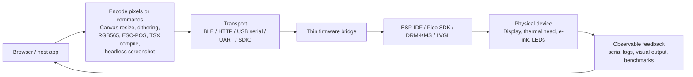

# Browser as Coprocessor for Constrained Runtimes

This report explains a pattern that recurs across at least five projects in the 2026 corpus: a browser (or a host tool that drives a headless browser) performs the compute-heavy work — image resizing, color conversion, dithering, byte packing, TSX compilation, headless rendering — and a constrained runtime (an ESP32, an ESP32-P4, a thermal printer mechanism, or a firmware-served SPA) receives only ready-to-blit or ready-to-print bytes. Understanding this pattern matters because the division of labor is not a convenience; it is the only design that keeps firmware thin enough to debug and fast enough to iterate on.

The reader should finish this chapter able to answer three questions. Why does the browser end up doing the work? What does the pipeline look like end to end, and where do the failures cluster? How would you build a new instance of this pipeline without rediscovering the same failure modes?

## Why the browser ends up doing the work

An ESP32-S3 has a 240 MHz dual-core CPU, 512 KB of SRAM, and — if you are lucky — 8 MB of PSRAM. A thermal printhead at 9600 baud can absorb one 384-pixel row every 50 ms. An ESP32-P4 driving a 720×1280 MIPI DSI panel has a 400 MHz RISC-V core, 32 MB of PSRAM, and a WiFi stack that lives on a separate ESP32-C6 die reached over SDIO. None of these devices is a good place to decode a JPEG, run Floyd-Steinberg dithering, or convert RGBA pixels to RGB565.

A browser has a 3 GHz CPU, gigabytes of RAM, a Canvas API that decodes any image format in milliseconds, a `CompressionStream` primitive that deflates a megabyte of pixels in single-digit milliseconds, and an iteration loop measured in sub-seconds. The browser also has the only fast path from "the user changed their mind" to "the device shows something new." Reflashing firmware to move a button takes minutes; uploading a new bitmap takes seconds.

The division of labor falls out of these constraints. The browser does the work that is iteration-heavy and compute-heavy. The firmware does the work that is timing-sensitive and device-specific: it holds the UART ring buffer that keeps the printhead fed, it holds the SPIRAM screen buffer that LVGL reads from, and it holds the HTTP handler that validates `X-Width` and `X-Height` before streaming bytes to hardware. The contract between them is small and byte-oriented.

The SToMS3R firmware states this invariant directly. The ESP32 does zero image processing. The browser decodes the image, resizes to 384 pixels, runs Floyd-Steinberg dithering, packs bits MSB-first, and POSTs the result as a raw 1-bit bitmap. The firmware reads the full body into heap, sends an 8-byte `GS v 0` header, and calls `uart_write_bytes(buf, full_length)` once (`Projects/2026/04/28/PROJ - SToMS3R - AtomS3R Lite Thermal Printer Firmware.md`, "Data flow" and "The UART bottleneck" sections). The same shape recurs with different transports and different device-side APIs.

## The pipeline

Every instance of this pattern is a pipeline with the same five stages, even when the transport and the device differ.

The browser encodes. The transport carries bytes. The firmware validates and forwards. The HAL drives the device. The device produces observable feedback that flows back to the browser, closing the iteration loop. Each stage has a single responsibility, and the contract between stages is bytes — not images, not commands-as-objects, not function calls across a boundary.

### The encode stage

The encode stage is where the browser earns its keep. The work falls into four families:

- **Pixel transformation.** Resize to the device's native resolution, convert color spaces (RGBA → RGB565, RGBA → 1-bit packed), apply gamma or tone curves. The Tab5 blitter converts 32-bit RGBA to 16-bit RGB565 in JavaScript before upload (`Projects/2026/05/27/ARTICLE - ESP32-P4 MIPI DSI Image Blitter - Browser-to-Display Pipeline on the M5Stack Tab5.md`, "Browser-side RGBA to RGB565 conversion"). SToMS3R converts RGBA to 1-bit packed bytes after Floyd-Steinberg dithering (`Projects/2026/04/28/PROJ - SToMS3R - AtomS3R Lite Thermal Printer Firmware.md`, "The web UI as image processing offload").
- **Compression.** The browser's `CompressionStream('deflate')` produces zlib-format output that the ESP32 ROM-resident miniz can decompress for zero flash cost. UI screenshots compress 15× to 1000×; random noise does not compress at all (`Projects/2026/05/27/ARTICLE - Optimizing WiFi Image Upload on ESP32-P4 - From 6 Seconds to Sub-Second.md`, "Compression ratio by image content").
- **Source compilation.** The Browser-Side React Widget Runtime compiles TSX source to ESM JavaScript via `esbuild-wasm`, wraps it in a Blob URL, and dynamically imports it — all in the browser, with no dev-server module graph (`Projects/2026/04/30/PROJ - Browser-Side React Widget Runtime - In-Browser TSX Compilation and Reload.md`, "How the TSX compilation pipeline works").
- **Host-driven rendering.** The Almanach Render Service drives headless Chrome from a Go CLI, injects a YAML layout into the SPA, applies render-mode CSS, screenshots `.paper-body`, converts the PNG to a 1-bit bitmap, and appends blank raster rows for feed spacing — all before the firmware sees a single byte (`Projects/2026/05/08/ARTICLE - Almanach Render Service - YAML CLI Rendering and Reliable Thermal Printing.md`, "Architecture After the CLI Work").

### The transport stage

The transport is whatever the device can speak. SToMS3R uses UART at 9600 baud. The Tab5 uses HTTP over ESP-Hosted WiFi (an SDIO 4-bit 40 MHz link to an ESP32-C6 that owns the radio). Almanach Studio is served by `esp_http_server` on port 80 over SoftAP or STA. Face Animation Studio exports C++ headers that are compiled into firmware at build time — the transport is the build system itself. The Widget Runtime uses HTTP and SSE between a Go harness server and the browser.

The transport choice is rarely the bottleneck in the way you would predict. The Tab5 WiFi benchmark measured 4.2 Mbps upload and 1.7 Mbps download, with 106 ms RTT — and showed that TCP window size, not radio or SDIO, was the real limiter. Tuning the IDF default TCP window from 5,744 bytes to 65,535 bytes on native ESP32-S3 WiFi produced a 3.8× speedup (`sources/01a-hardware-esp32-firmware-devices.md`, Arc 3). Compression changes the operating regime entirely: a 1.8 MB raw frame that takes 6 seconds over WiFi transfers in 0.05 seconds when it compresses to 121 KB (`Projects/2026/05/27/ARTICLE - Optimizing WiFi Image Upload on ESP32-P4 - From 6 Seconds to Sub-Second.md`, "Bottleneck 1").

### The firmware stage

The firmware stage is intentionally thin. Its job is to validate, buffer, and forward. SToMS3R's `/api/print/bitmap` handler reads `X-Width` and `X-Height` headers, reads the full HTTP body into heap, sends the `GS v 0` header, and calls `uart_write_bytes()` once. The Tab5's `/api/upload` handler receives into a temporary SPIRAM buffer, `memcpy`s to the screen buffer, acquires the LVGL lock, calls `lv_obj_invalidate()`, and releases the lock. The Almanach firmware endpoint validates width, height, and body size against a 90 KiB guard before forwarding to the printer driver.

The thinness is the point. When the firmware is thin, the failure surface is small. When the firmware tries to do image processing, it eats heap, it stalls the UART, and it becomes the place where bugs hide. The SToMS3R article is explicit: the original Arduino firmware's per-byte `HardwareSerial::write()` worked because it kept the ring buffer fed; the first ESP-IDF attempt that interleaved TCP reads with UART writes produced horizontal stripes because the TCP reads introduced gaps (`Projects/2026/04/28/PROJ - SToMS3R - AtomS3R Lite Thermal Printer Firmware.md`, "The UART bottleneck and why streaming strategy matters").

### The HAL and device stages

The HAL is the framework-specific layer: ESP-IDF's `driver/uart`, `esp_lcd`, LVGL 9, M5GFX, or the K118's ESC/POS command set. The device is the physical thing that converts bytes into observable output — a thermal head, a MIPI DSI panel, an SPI LCD, or a robot's face display. The feedback that closes the loop is whatever the device produces: serial logs, printed paper, a display that shows the uploaded image, or a benchmark number.

## Concrete instances

The pattern is not abstract. Each of the following projects is a working instance, and each instance contributes a distinct lesson about where the boundary between browser and firmware should sit.

### SToMS3R: browser dithering → UART → thermal printer

SToMS3R drives a K118 58mm thermal printer from an M5Stack AtomS3R Lite (ESP32-S3). The browser drops an image onto a Canvas, resizes to 384 pixels wide, converts to grayscale with NTSC weights, runs Floyd-Steinberg dithering, packs bits MSB-first, and POSTs the raw 1-bit bitmap. The firmware does zero image processing.

The critical lesson is the streaming strategy. At 9600 baud, a full-width row takes 50 ms to transmit. A gap in the UART stream of even 50 ms causes the printer to interpret the gap as a data boundary and advance the paper by a partial line, producing a visible white stripe. The first ESP-IDF attempt interleaved TCP reads with UART writes in 512-byte chunks; the TCP reads introduced gaps. The fix was to separate the "read from network" phase from the "write to UART" phase entirely: read the entire HTTP body into heap, send the `GS v 0` header, then call `uart_write_bytes(buf, full_length)` once and let the UART driver's 2048-byte ring buffer and ISR handle the rest (`Projects/2026/04/28/PROJ - SToMS3R - AtomS3R Lite Thermal Printer Firmware.md`, "The UART bottleneck and why streaming strategy matters").

This is the canonical statement of the invariant: the browser does the compute-heavy work; the firmware streams raw bytes; the contract between them is a packed bitmap with width and height headers.

### Tab5 MIPI DSI: browser Canvas → HTTP → MIPI DSI panel

The Tab5 is an ESP32-P4 with a 720×1280 MIPI DSI panel. The browser loads an image into a Canvas, resizes to 1280×720, converts each pixel from 32-bit RGBA to 16-bit RGB565 in little-endian order, and POSTs the resulting 1,843,200-byte `ArrayBuffer` as `application/octet-stream`. The ESP32 receives into a temporary SPIRAM buffer, `memcpy`s to the screen buffer, acquires the LVGL lock, invalidates the fullscreen image object, and lets LVGL's render loop push pixels to the ST7123 DPI panel on the next frame (`Projects/2026/05/27/ARTICLE - ESP32-P4 MIPI DSI Image Blitter - Browser-to-Display Pipeline on the M5Stack Tab5.md`, "Data flow" and "The dual-buffer upload strategy").

The dual-buffer strategy is the lesson. Receiving 1.8 MB directly into the screen buffer would let LVGL render a half-old, half-new frame for the 6 seconds the transfer takes. Receiving into a temporary SPIRAM buffer and `memcpy`ing to the screen buffer ensures the display transitions from old frame to new frame in a single render pass. The firmware never sees a half-updated buffer.

The optimization article adds compression to the same pipeline. The browser's `CompressionStream('deflate')` produces zlib output; the ESP32 decompresses with ROM-resident `tinfl_decompress_mem_to_mem` and `TINFL_FLAG_PARSE_ZLIB_HEADER`. UI screenshots compress 15× to 1000×, reducing a 6-second transfer to under 3 seconds and, for restricted-palette UIs, to sub-second (`Projects/2026/05/27/ARTICLE - Optimizing WiFi Image Upload on ESP32-P4 - From 6 Seconds to Sub-Second.md`, "The fix: browser-side compression").

### Almanach Studio and Render Service: React SPA in firmware + Go CLI rendering

Almanach Studio is a ~2100-line React JSX component compiled by esbuild into a 211 KB IIFE bundle, embedded in ESP32 firmware via `EMBED_TXTFILES`, and served at `/almanach` by `esp_http_server`. The SPA is a visual layout editor for 58mm thermal paper. The browser does all the layout, theme selection, and font scaling; the firmware serves the bundle and accepts the resulting bitmap via the existing `/api/print/bitmap` endpoint (`Projects/2026/04/29/ARTICLE - Almanach Studio - A Self-Hosted Thermal Almanac Designer for ESP32.md`, "System Architecture").

The Almanach Render Service inverts the direction of the browser. Instead of the user's browser doing the rendering, a Go CLI starts an internal loopback HTTP server, drives headless Chrome to load the SPA, injects a YAML layout via `window.almanachLoadLayout()`, applies render-mode CSS to hide editor rails, screenshots `.paper-body`, converts the PNG to a packed 1-bit bitmap, appends blank raster rows for feed spacing, and POSTs the bitmap to the firmware. The Go code does not reimplement the renderer; the React SPA remains the rendering source of truth. The CLI automates the SPA through Chrome and captures the result (`Projects/2026/05/08/ARTICLE - Almanach Render Service - YAML CLI Rendering and Reliable Thermal Printing.md`, "Architecture After the CLI Work").

The lesson is that "browser as coprocessor" includes the case where the browser is headless and driven by a host CLI. The same SPA serves both the interactive user and the automated pipeline. The host-side feed fix — appending `feedLines * 24` blank raster rows to the bitmap and sending `X-Feed: 0` — is an embedded-system rule in miniature: when a later command in a device protocol is unreliable in a particular state, prefer sending the desired output through the command path that is already known to work.

### Face Animation Studio: browser sprite tool → C++ header → ESP32 robot

Face Animation Studio is a zero-dependency browser tool for composing 135×240 sprite animations for the M5StackChan robot. The browser loads 48 tiles from three source sheets, normalizes them with a deterministic ImageMagick pipeline (crop, black-threshold, trim, per-sheet scale, global scale, bottom-align), lets the user arrange them on a timeline, previews at 3× zoom with `requestAnimationFrame`, and exports either JSON (for re-editing) or C++ headers with RGB565 `PROGMEM` arrays for direct firmware compilation (`Projects/2026/06/11/ARTICLE - Face Animation Studio - Building a Browser-Based Sprite Animation Tool for an ESP32 Robot.md`, "The Tile Normalization Pipeline" and "Export: From Browser to Firmware").

The transport here is the build system: the browser exports a C++ header that gets `#include`d into the firmware. The firmware reads the `FaceAnimation` struct, looks up tile data by index, and blits to the ST7789 display for the specified duration. The lesson is that the browser-coprocessor pattern does not require a live network link. The "transport" can be a source file that crosses the build-time boundary. The iteration speed still wins: the tool collapses a 5–10 minute draw-compile-flash-check cycle to sub-second feedback in the browser preview.

The normalization pipeline is itself a browser-side compute offload. The three source sheets have different face sizes (Sheet 1 faces are ~4.5% smaller than Sheet 2). Without per-sheet scaling factors (Sheet1 ×1.045, Sheet2 ×1.000, Sheet3 ×0.989) applied before a global scale-to-fit, animations crossing sheet boundaries show visible size jumps. The browser computes these factors; the firmware receives only pixel-perfect 135×240 tiles.

### Browser-Side React Widget Runtime: in-browser TSX compilation

The Browser-Side React Widget Runtime extends the pattern from pixel data to source code. A chat timeline receives a message whose body is TSX source. The browser resolves a runtime policy, initializes `esbuild-wasm` once (memoized as a promise to survive concurrent compiles), validates and rewrites imports through a `RuntimeModuleRegistry`, prepends host React bindings from `window.__LIVE_WIDGET_HOST__`, transforms the TSX to ESM JavaScript, creates a Blob URL, dynamically imports it, validates that the default export is a function, and renders the component into the timeline (`Projects/2026/04/30/PROJ - Browser-Side React Widget Runtime - In-Browser TSX Compilation and Reload.md`, "The central idea: source is data until the browser imports it").

The constrained runtime here is not a microcontroller; it is the security and reproducibility boundary of a chat timeline. The widget source is just a string on the wire — "source is data until the browser imports it." The browser does the compilation; the host provides capabilities through a strict import policy and a shared React instance. Imports become capabilities, not packages: `@live/base` and `@live/charts` are virtual modules backed by host-provided facade modules, and `@live/widgets/<message-id>` lets one compiled widget import another, with cycle detection through a dependency graph.

## Why this pattern recurs

The pattern recurs because the constraint is structural, not incidental. Microcontrollers lack the CPU, RAM, and software ecosystem to do image processing, source compilation, or headless rendering well. Browsers have all three in abundance. The constraint does not go away when you move to a faster microcontroller; it shifts. The ESP32-P4 has a 400 MHz RISC-V core and 32 MB of PSRAM, which is enough to receive and display a 1.8 MB RGB565 frame — but it is still not enough to decode a JPEG, run dithering, or drive Chrome headless. The browser remains the right place for that work.

The pattern also recurs because the iteration loop demands it. Firmware reflashing is a minutes-scale operation. Browser preview is a sub-second operation. When the user is designing a thermal almanac, composing a robot face animation, or mocking up a UI on a physical display, the feedback that matters is "did this look right?" The fastest path to that answer is to do the work in the browser and send only the final bytes to the device. The Almanach Studio article is explicit about this: "The tool collapses this to sub-second feedback: click a tile, see it on the display emulator, hit Play, adjust timing, export when done" (`Projects/2026/06/11/ARTICLE - Face Animation Studio - Building a Browser-Based Sprite Animation Tool for an ESP32 Robot.md`, "Why This Tool Exists").

Finally, the pattern recurs because the contract is byte-oriented and small. A packed 1-bit bitmap with width and height headers. A raw RGB565 ArrayBuffer with `Content-Type: application/octet-stream`. A Blob URL with a default-exported React component. Each contract is tiny, debuggable with `curl` and `xxd`, and independent of the framework wars on either side of it. Small contracts survive.

## Failure modes

The failure modes cluster at the seams between stages. The following table maps each failure mode to the stage where it appears and the lesson it teaches.

| Failure mode | Stage | Instance | Lesson |
|---|---|---|---|
| TCP read gaps cause horizontal stripes between UART writes | Transport → Firmware | SToMS3R | Separate network read from device write; buffer full body before UART |
| Partial frame writes expose half-updated display | Firmware → HAL | Tab5 | Dual-buffer: receive into SPIRAM, `memcpy` to screen, single invalidation |
| LVGL 9 vs LVGL 8 image descriptor API mismatch | HAL | Tab5 | `LV_IMAGE_HEADER_MAGIC`, `LV_COLOR_FORMAT_*`, explicit `stride` are required; read `lv_image_dsc.h` |
| `EMBED_TXTFILES` corrupts multi-byte UTF-8 and appends NUL | Encode → Firmware | Tab5, Almanach | ASCII-only in embedded web assets; strip trailing NUL in the HTTP handler |
| `EMBED_TXTFILES` basename collision silently discards a file | Encode → Firmware | Almanach | Use unique basenames; verify with `nm ... \| grep _binary_` |
| ESP-Hosted WiFi init order crashes with saved NVS credentials | HAL | Tab5 | `configure_apsta_mode()` before `apply_sta_config()`; test with saved NVS |
| `tinfl_decompress_mem_to_mem` stack overflow (43 KB needed, 8 KB default) | Firmware | Tab5 optimization | Size the HTTP task stack to 48 KB; PSRAM is plentiful |
| `httpd` `recv_wait_timeout` too short (5 s default) | Transport | Tab5 | Set to 30 s for binary uploads over WiFi |
| TCP window, not radio, is the WiFi bottleneck | Transport | Tab5 benchmark | Tune TCP window to 65,535 bytes; compression changes the regime |
| Gray values / opacity in CSS become dithered noise on thermal paper | Encode | Almanach Studio | Force pure `#000` on `#fff`, zero opacity, zero grain; verify with `getComputedStyle` |
| Post-bitmap `ESC d n` feed did not visibly advance paper | Firmware → HAL | Almanach Render Service | Bake feed into the bitmap as blank raster rows; send `X-Feed: 0` |
| Schema drift between Go structs and React frontend | Encode | Almanach Render Service | Treat the frontend schema as canonical; mirror it in Go |
| White pixels on tile edges from Lanczos resize interpolation | Encode | Face Animation Studio | Apply `-black-threshold 1%` after the last resize |
| Browser caches old tiles after regeneration | Encode → Feedback | Face Animation Studio | Cache-bust with `?v=2` or content-hashed filenames |
| Concurrent `esbuild.initialize` races ("Cannot call initialize more than once") | Encode | Widget Runtime | Memoize the in-flight initialization as a promise, not just a boolean |
| `es-module-lexer` cannot parse TSX before esbuild transform | Encode | Widget Runtime | Use `@babel/parser` with `jsx` and `typescript` plugins; the import parser must accept the language authors write |
| Duplicate React instances cause invalid hook calls | Encode → HAL | Widget Runtime | Inject host React via `window.__LIVE_WIDGET_HOST__`; imports are capabilities, not packages |
| 80 MHz SPI visual instability (random blits, yellow flashing) | HAL | M5StackChan | Use 40 MHz safe default; no TE/VSYNC pin means software pacing only |

The failure modes that look like hardware problems are usually contract problems. The horizontal stripes in SToMS3R's prints looked like a printer hardware issue, but the fix was to change the streaming strategy in firmware. The LVGL assertion during `rendering_in_progress` looked like a race condition, but the fix was to respect LVGL's single-threaded contract with a lock. The `EMBED_TXTFILES` NUL corruption looked like a JavaScript bug, but the fix was in the IDF build step. In each case, the failure appeared at a seam between stages, and the fix was to make the contract at that seam explicit.

## A learning path for building a browser-coprocessor firmware pipeline

The following sequence is the order in which the lessons must be learned. Skipping a step rediscovers a failure mode that the corpus has already documented.

### Step 1: define the byte contract first

Before writing any browser code or any firmware code, write down the exact byte contract between them. For SToMS3R it is: `POST /api/print/bitmap`, body is raw 1-bit packed bytes MSB-first, `X-Width` and `X-Height` headers give dimensions. For the Tab5 it is: `POST /api/upload`, body is raw RGB565 little-endian, `Content-Type: application/octet-stream`, maximum 1,843,200 bytes. For the Widget Runtime it is: a chat message with `type: "widget"`, a `source` string field, and a `widgetRuntime` policy object. The contract is small, byte-oriented, and debuggable with `curl` and `xxd`. Everything else is implementation.

### Step 2: move the heaviest work to the browser

Once the contract is fixed, move every computation that the browser can do into the browser. Resize, color-convert, dither, compress, compile. The firmware should receive bytes that are as close as possible to what the device needs. The SToMS3R firmware does zero image processing. The Tab5 firmware does zero PNG decoding. The Widget Runtime server does zero TSX compilation. The Almanach Render Service Go CLI does zero React rendering — it drives Chrome headless and screenshots the result.

### Step 3: separate network read from device write

If the transport and the device write are interleaved, the device will see gaps. SToMS3R's first attempt interleaved TCP reads with UART writes in 512-byte chunks and produced horizontal stripes. The fix is to read the entire payload into a buffer first, then write to the device in a single call. For the Tab5, the same principle appears as the dual-buffer strategy: receive into SPIRAM, `memcpy` to the screen buffer, then invalidate once. The display never sees a half-updated frame.

### Step 4: size the firmware for the work it does

The IDF defaults are tuned for small REST payloads, not for megabyte-scale binary uploads. The Tab5 optimization article documents three sizing fixes that are all in this category: the HTTP task stack must be 48 KB to hold `tinfl_decompress_mem_to_mem`'s 43 KB of working state; `recv_wait_timeout` must be 30 s, not the 5 s default; and the LVGL lock must be acquired before any LVGL API call from the HTTP task. None of these are performance optimizations in the usual sense. They are correctness fixes that make the pipeline reliable.

### Step 5: treat embedded assets as a build-time encoding problem

`EMBED_TXTFILES` is not a transparent file-embedding primitive. It appends a NUL terminator that breaks JavaScript parsing, it uses only the basename (so two files with the same basename collide silently), and multi-byte UTF-8 characters can be corrupted in the assembly generation path. The working rules are: ASCII-only in embedded web assets, unique basenames, and strip the trailing NUL in the HTTP handler. Use `EMBED_BINFILES` and manage lengths explicitly if you need binary assets.

### Step 6: make the iteration loop observable

The pattern only pays off if the iteration loop is fast and observable. The Face Animation Studio collapses a 5–10 minute draw-compile-flash cycle to sub-second browser preview. The Tab5 screen viewer replaces a reflash cycle with a web upload that appears on the physical display in under 10 seconds. The Almanach Render Service adds an `inspect` command that reports DOM metrics after render-mode CSS is applied, because "a PNG alone did not explain whether the wrong selector was captured or an ancestor was clipping content." Observable feedback — serial logs, visual output, benchmarks, inspect metrics — is what closes the loop back to the browser.

### Step 7: keep the firmware thin and the contract stable

The Thermal Dithering Algorithms article states the final rule directly: "Keep the firmware bitmap contract stable while evaluating algorithms" (`Projects/2026/05/10/ARTICLE - Thermal Dithering Algorithms - Almanach Rasterization Deep Dive.md`, "Working rules for Almanach rasterization"). The Almanach rasterizer can swap threshold for Atkinson for Floyd-Steinberg for edge-hybrid, and the firmware never needs to know. The rasterizer is where page design becomes physics, but the bitmap contract is what lets you iterate on the rasterizer without touching firmware. The same principle lets the Widget Runtime swap `es-module-lexer` for `@babel/parser` without changing the message contract, and lets the Tab5 add compression without changing the upload endpoint.

## Key points

- The browser does the compute-heavy work (Canvas resize, dithering, RGB565 conversion, ESC-POS encoding, TSX compilation, headless rendering); the firmware streams raw bytes or pixels. This is not a convenience; it is the only design that keeps firmware thin enough to debug and fast enough to iterate on.
- The pipeline is `browser/host → encode → transport → firmware → HAL → physical device → observable feedback → browser`. The contract between stages is bytes, not objects or function calls.
- The pattern recurs because the constraint is structural: microcontrollers lack the CPU, RAM, and software ecosystem for image processing or source compilation, while browsers have all three plus the only fast iteration loop.
- The failure modes cluster at the seams: TCP read gaps cause stripes (SToMS3R), partial frame writes expose half-updated displays (Tab5 dual-buffer), LVGL 9 API changes break image descriptors (Tab5), `EMBED_TXTFILES` corrupts UTF-8 and appends NUL (Tab5, Almanach), and concurrent `esbuild.initialize` races (Widget Runtime). Each failure looks like a hardware problem but is a contract problem.
- Compression changes the operating regime, not just the speed. A 1.8 MB raw frame takes 6 seconds over WiFi; the same frame compressed to 121 KB takes 0.05 seconds. TCP window size, not radio bandwidth, is the bottleneck for native WiFi.
- "Browser as coprocessor" includes the case where the browser is headless and driven by a host CLI. The Almanach Render Service drives Chrome headless from a Go CLI, injects a YAML layout, screenshots `.paper-body`, and posts the bitmap to firmware. The SPA is the rendering source of truth for both the interactive user and the automated pipeline.
- The transport does not have to be a live network link. Face Animation Studio exports C++ headers with RGB565 `PROGMEM` arrays that cross the build-time boundary. The iteration speed still wins because the browser preview is sub-second.
- Keep the firmware bitmap contract stable. The Almanach rasterizer can swap threshold for Atkinson for Floyd-Steinberg without touching firmware. The Widget Runtime can swap import parsers without changing the message contract. Small, byte-oriented contracts survive.

## Closing

The browser-as-coprocessor pattern is the architectural answer to a physical constraint: the device that displays or prints the bytes is not the device that should compute them. The browser has the CPU, the RAM, the Canvas, the `CompressionStream`, the `esbuild-wasm`, and the iteration loop. The firmware has the UART ring buffer, the SPIRAM screen buffer, the LVGL lock, and the physical device. The contract between them is a small, byte-oriented interface that neither side overreaches across.

The next time you face a constrained runtime that needs to display or print rich content, start with the byte contract. Move the heaviest work to the browser. Separate network read from device write. Size the firmware for the work it actually does. Treat embedded assets as a build-time encoding problem. Make the iteration loop observable. Keep the firmware thin and the contract stable. The corpus has already documented the failure modes you will hit; the learning path above is the order in which to encounter them.

The related bridge reports deepen this one. Bridge 7 (Single-Binary Go + SPA) covers the case where the browser is the entire application shell served from firmware. Bridge 8 (Derived Rebuildable Artifacts) covers the case where the browser-produced artifact (a packed bitmap, a C++ header, a generated React scaffold) is disposable and rebuildable from canonical source. Bridge 2 (Go-Backed JavaScript DSLs) covers the case where the browser-side authoring layer is a Go-backed DSL rather than raw TypeScript. Each of those bridges is a specialization of the same division of labor documented here.
