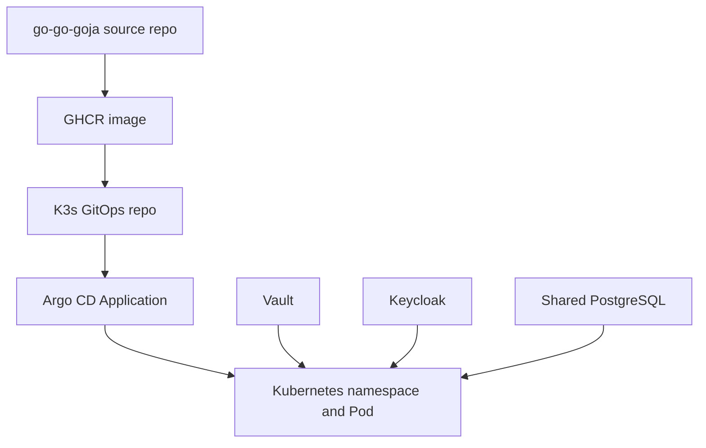
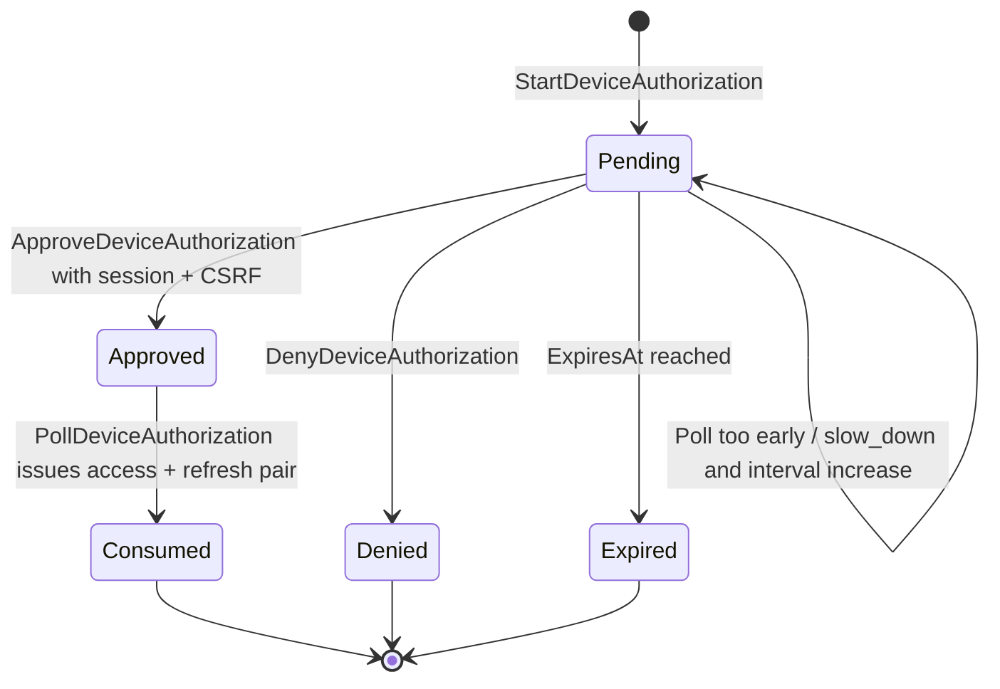
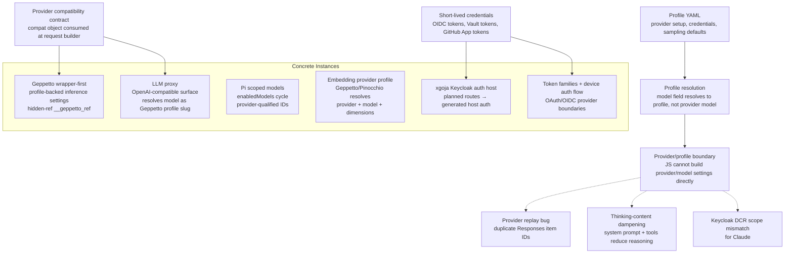

# The Provider/Profile Boundary

This report explains a design pattern that recurs across four topic slices of the workspace: when a caller writes a model name, the value that gets resolved is a **profile**, not a provider model. A profile bundles provider setup, credentials, and sampling defaults into one host-owned value. Callers select profiles; the host resolves final settings; provider factories consume those settings. The pattern shapes Geppetto's wrapper-first JavaScript API, the LLM proxy's OpenAI-compatible surface, Pi's scoped model list, embedding profile validation, the xgoja Keycloak auth host, and the token-family device-authorization flow.

Understanding this boundary matters because every workspace project that integrates an LLM provider, an OIDC identity provider, or a Vault-backed credential path eventually faces the same decision: where should credentials live, who is allowed to assemble provider configuration, and what happens when a caller sends a string that looks like a model name. The provider/profile boundary is the answer that has converged across these projects. The reader should come away able to recognize the pattern, explain why JavaScript is forbidden from building provider settings directly, and identify the failure modes that motivate the boundary.

## 1. What resolves when a client sends a model name

The OpenAI Chat Completions protocol sends a `model` string in the request body. A reasonable first implementation would treat that string as a provider model identifier and forward it directly. The LLM proxy in this workspace does not do that. It treats the `model` field as a Geppetto engine profile slug, resolves the slug through a Geppetto profile registry, and constructs the engine from the resolved `InferenceSettings`. The provider model name (`claude-3-5-sonnet-20241022`, `gpt-5-mini`, `gemini-3-flash-preview`) lives inside the profile YAML, not in the request (`Projects/2026/06/04/ARTICLE - LLM Proxy - Geppetto Engine OpenAI Completions Prototype Deep Dive.md`, section 4.1).

```text
OpenAI Completions request
  model:  profile slug
  prompt: text
        ↓
Geppetto profile resolver
        ↓
Geppetto engine factory
        ↓
Geppetto RunInferenceWithResult
        ↓
OpenAI text_completion response or stream chunks
```

The example profile YAML makes the boundary visible. The slug `sonnet` is a profile. The provider model identifier `claude-3-5-sonnet-20241022` and the credential placeholder `${ANTHROPIC_API_KEY}` are both inside the profile. The client never sees either:

```yaml
slug: default
display_name: Prototype profiles
profiles:
  sonnet:
    slug: sonnet
    display_name: Claude Sonnet through Geppetto
    inference_settings:
      chat:
        api_type: claude
        engine: claude-3-5-sonnet-20241022
        max_response_tokens: 1024
        temperature: 0.2
      api:
        api_keys:
          claude-api-key: ${ANTHROPIC_API_KEY}
        base_urls:
          claude-base-url: https://api.anthropic.com
```

`GET /v1/models` therefore lists profile slugs as if they were models. The response field `owned_by` is set to `geppetto-profile`, which is the boundary made literal: the proxy does not own a provider catalog. It owns a profile catalog. The provider catalog lives behind the profile resolver.

This single rule removes route aliases, provider credential maps, and provider-specific request fields from the proxy. A future request to add a new model becomes "add a profile entry," not "extend the proxy with a new provider adapter." The proxy stays small, and the provider surface area is owned by the package that already understands provider behavior.

## 2. Why JavaScript cannot build provider/model settings directly

The same boundary appears inside Geppetto's JavaScript bindings. The hard-cutover work explicitly removed `gp.inferenceSettings()` from the public API (`Projects/2026/06/01/ARTICLE - Geppetto JS Bindings - Wrapper First Hard Cutover.md`, "Registry-backed inference settings"). The decision is worth sitting with. A JavaScript builder for inference settings sounds convenient. It would let a script set model IDs, endpoint URLs, API key references, and provider-specific values inline. The final design rejects that path.

Three reasons make the rejection durable.

**Credentials are not application data.** Provider API keys, OIDC client secrets, Vault tokens, and GitHub App installation tokens are short-lived, rotation-sensitive, and audit-relevant. Letting JavaScript author them through setters means the same values can leak through snapshots, debug output, error messages, and unredacted logs. The Geppetto settings wrapper redacts keys named `api_keys`, `apiKey`, `secret`, and `token` before any snapshot reaches JavaScript, but redaction is a defense-in-depth measure, not a license to let JS own the values.

**Session and provider state has typed invariants.** A Geppetto `Turn` is not `{ role, content }`. It is a Go struct with block kinds, roles, metadata, IDs, inference IDs, session IDs, and serialization behavior. A provider's `FunctionCall.ID` is not a free string; it is a value that must match the corresponding `FunctionResponse.ID` on the next turn. Tool registry entries are not arrays of functions; they are Go runtime capabilities. When JavaScript is allowed to construct plain maps that look like these values, the maps can pass shape checks while violating invariants the type system would otherwise enforce.

**Provider defaults are policy, not configuration.** Sampling defaults, max response tokens, thinking budgets, and tool-calling modes are decisions an operator should make once and review. A JavaScript builder that sets `temperature: 0.2` inline makes that decision invisible. A profile entry that sets the same field in YAML makes the decision part of a reviewable artifact. The Pi `pi-launcher` tool goes further and treats profile YAML as a compiler: strict parse, profile-relative path resolution, structured validation findings, deterministic argv ordering (`Projects/2026/06/04/PROJ - pi-launcher - Declarative YAML Profiles for Pi.md`, condensed in `sources/05b`).

The result is one rule repeated at every boundary: JavaScript receives wrappers, not ownership. A wrapper is a JavaScript object with methods, but its authoritative state lives in Go. If a method needs an `InferenceSettings`, it requires an `InferenceSettings` wrapper. If a method needs a `Turn`, it requires a `Turn` wrapper. Plain JavaScript maps are accepted only for options where maps are the correct representation.

## 3. The hidden reference mechanism

The wrapper-first API needs a concrete implementation. The Geppetto module attaches Go references to JavaScript objects through a hidden property named `__geppetto_ref`. The property is set, then redefined as non-writable, non-enumerable, and non-configurable (`Projects/2026/06/02/ARTICLE - Geppetto JS Overhaul - Wrapper First Agents Events and Storage Boundaries.md`, "The hidden reference mechanism"):

```go
func (m *moduleRuntime) attachRef(o *goja.Object, ref any) {
    _ = o.Set(hiddenRefKey, ref)
    _ = o.DefineDataProperty(hiddenRefKey, o.Get(hiddenRefKey),
        goja.FLAG_FALSE, // writable
        goja.FLAG_FALSE, // enumerable
        goja.FLAG_FALSE, // configurable
    )
}
```

The point is not that there is a hidden property. The point is that public methods re-enter Go, retrieve the typed reference, clone or validate it, and then operate on Go data. When `agent().inference(settings)` is called, the method does not inspect a JavaScript shape. It asks whether the value carries a trusted Go `InferenceSettings` reference. When `agent.run(turn)` is called, it rejects a plain object even if that object has blocks that look like a turn.

This is not a sandbox boundary. It is an API integrity boundary. It prevents accidental structural lookalikes from being treated as canonical Geppetto values. The same pattern recurs in `goja-bleve`, where `__bleve_ref` carries mappings, queries, indexes, batches, and search requests. It recurs in `gojahttp`, where `AttachHTTPHandler` puts a hidden `http.Handler` reference on a JavaScript object so that `app.mount(prefix, handler)` can compose Go-backed handlers without compile-time coupling. The hidden reference is the workspace's standard technique for "JavaScript holds the value; Go owns the state."

```mermaid
flowchart TD
    JS[JavaScript require('geppetto')] --> Exports[Hard-cut exports]
    Exports --> RegistryNS[inferenceProfiles namespace]
    Exports --> Builders[engine / agent / turn / tool / schema builders]
    RegistryNS --> SettingsWrapper[InferenceSettings wrapper]
    Builders --> GoRefs[Hidden Go-owned references]
    GoRefs --> GeppettoCore[Geppetto inference / session / tool packages]
    GeppettoCore --> ResultWrappers[Turn and RunResult wrappers]
    ResultWrappers --> JS
```

## 4. Profile sources and stack resolution

Profiles are not flat. A profile can stack other profiles and inherit their fields. The Pinocchio runtime registry stores base credential profiles, chat profiles, and embedding profiles in one YAML file. Profile resolution expands stacks and merges the final `InferenceSettings` before provider construction (`Projects/2026/05/23/PROJ - Geppetto Embedding Profiles - Profile-Backed Vector Search.md`, "Architecture").

A concrete stack makes the boundary visible. The `openai-embedding-small` profile does not duplicate the OpenAI key. It stacks `openai-responses-base`, which already owns the OpenAI credential, and adds the embedding-specific fields:

```yaml
profiles:
  openai-embedding-small:
    stack:
      - profile_slug: openai-responses-base
    inference_settings:
      embeddings:
        type: openai
        engine: text-embedding-3-small
        dimensions: 1536
        cache_type: file
        cache_directory: ./.geppetto/embeddings-cache/openai-text-embedding-3-small
```

This shape lets one credential profile serve multiple model kinds without being copied. It also produces a precise failure mode when a caller selects the wrong kind of profile. Selecting the chat profile `gpt-5-low` for a vector-search command fails because `gpt-5-low` does not define `inference_settings.embeddings`. The correct diagnosis is not "OpenAI key missing" but "the selected profile is chat-capable but not embedding-capable." The validation helper `ValidateInferenceSettingsForEmbeddings` runs after stack resolution so that it sees the merged settings, not the raw YAML:

```go
func ValidateInferenceSettingsForEmbeddings(s *settings.InferenceSettings) error {
    if s == nil { /* reject */ }
    if s.Embeddings == nil { /* reject */ }
    if s.Embeddings.Type == "" { /* reject */ }
    if s.Embeddings.Engine == "" { /* reject */ }

    switch s.Embeddings.Type {
    case "openai":
        require s.API.APIKeys["openai-api-key"]
    case "ollama":
        require s.Embeddings.Dimensions != 0
    default:
        reject unsupported provider
    }
}
```

Validation is placed above provider construction deliberately. The low-level provider may return an error such as `no API key provided for OpenAI`. That error is technically correct but does not teach the user how to fix a profile selection problem. The validation helper can say that the selected profile is missing `inference_settings.embeddings`, or that an OpenAI embedding profile did not stack an OpenAI base profile. The error message is shaped by the boundary, not by the provider.

The LLM proxy discovered a related bug during Gemini modernization. Sparse profile overlays were passed directly into Geppetto engine creation, so Gemini provider-specific settings were nil. The proxy resolver now merges the overlay onto Geppetto's base `InferenceSettings` before constructing the engine (`Projects/2026/06/05/ARTICLE - Geppetto Gemini SDK Modernization - Gemini 3 Flash Deep Dive.md`, "The llm-proxy follow-up"). The regression test guards the seam:

```go
func TestYAMLResolverMergesSparseProfileOntoBaseSettings(t *testing.T) {
    // Build a sparse Gemini profile with only Chat settings.
    // Resolve it through llm-proxy.
    // Assert that resolved.Settings.Gemini is non-nil.
}
```

## 5. Concrete instances across the workspace

The provider/profile boundary is not a single project. It is a pattern that appears wherever a caller selects a model, an identity, or a credential and the host resolves the rest. The instances below show the same decision repeated in different domains.

| Instance | Caller selects | Host resolves | Boundary |
|---|---|---|---|
| Geppetto wrapper-first | profile slug | `InferenceSettings` from registry | JS receives read-only wrapper; no `gp.inferenceSettings()` |
| LLM proxy | `model` string | profile slug → engine | Proxy owns protocol translation, not provider setup |
| Pi scoped models | `enabledModels` entry | provider-qualified ID | Cycle list is curated; thinking is separate axis |
| Embedding profiles | embedding profile slug | stacked base + embedding overlay | Validation requires `inference_settings.embeddings` |
| xgoja Keycloak auth host | planned route | host auth services | JS declares intent; Go enforces security |
| Token families + device flow | device code or refresh token | access token via OAuth service | Refresh and device codes do not authenticate routes |

### 5.1 Geppetto wrapper-first

The hard-cutover work removed the legacy `profiles`, `runner`, `turns`, `engines`, `schemas`, `middlewares`, and `tools` namespaces from `require("geppetto")`. The public surface is now `inferenceProfiles`, `engine`, `agent`, `turn`, `tool`, `toolRegistry`, `schema`, `consts`, and `events`. Scripts resolve profiles through `gp.inferenceProfiles.load(...)` or `gp.inferenceProfiles.resolve("default")` and receive a read-only `InferenceSettings` wrapper. The wrapper exposes `toJSON()` (redacted), `clone()`, and `debug()`. There is no setter for API key, base URL, model metadata, or sampling defaults (`Projects/2026/06/01/ARTICLE - Geppetto JS Bindings - Wrapper First Hard Cutover.md`, "Registry-backed inference settings").

The host-default path is gated. `gp.inferenceProfiles.resolve("default")` only works when the Go host configured `EngineProfileRegistry` in `geppetto.Options`. If no registry is configured, the method fails with a clear error. Standalone scripts do not silently resolve against process-global state.

### 5.2 LLM proxy: model field is a profile slug

The LLM proxy exposes `/v1/completions`, `/v1/chat/completions`, `/v1/models`, and `/healthz`. The `model` field in any request is interpreted as a Geppetto profile slug. The proxy resolves the slug, constructs an engine, runs inference through `engine.RunInferenceWithResult`, and maps the resulting turn back into OpenAI-compatible JSON or SSE chunks (`Projects/2026/06/04/ARTICLE - LLM Proxy - Chat Completions Tools and Pinocchio Smoke Technical Report.md`, section 4).

The proxy does not know how Claude, OpenAI Responses, or any future provider is called. It asks for an engine. The engine comes from Geppetto. If a profile selects Groq through OpenAI-compatible Chat Completions, the proxy creates that Geppetto engine. If a profile selects Claude, the proxy creates the Claude engine. Provider execution is not reimplemented in the proxy. Tool execution is also not performed by the proxy. The proxy maps tool declarations and tool-call messages; clients execute tools and send `role: "tool"` messages back.

### 5.3 Pi scoped models: provider-qualified IDs

Pi's model selector lists every built-in and custom provider model. In practice, an engineer working on a coding task rarely needs access to twenty or thirty models. Pi solves this with scoped models: the `enabledModels` array in `settings.json` defines a cycle list accessed through Ctrl+P and Shift+Ctrl+P (`Projects/2026/05/05/ARTICLE - Pi Scoped Models Configuration.md`).

Provider qualification is the boundary decision. Z.AI and Wafer both offer a `GLM-5.1` model, but with different characteristics. Z.AI's version supports reasoning and generates up to 128K output tokens. Wafer's version does not support reasoning and caps output at 32.8K tokens. Using the unqualified `"glm-5.1"` would match both and include an unwanted variant in the cycle. Provider-qualified IDs (`zai/glm-5.1`, `wafer/GLM-5.1`) disambiguate same-name models across providers.

The thinking level is a separate axis. Scoped models only control which models are in the cycle. `wafer/DeepSeek-V4-Pro:high` is not valid syntax inside `enabledModels`. Thinking is set globally through `defaultThinkingLevel`, per invocation through `--thinking`, or per session through Shift+Tab. The two controls compose: cycle the model, then tune the thinking depth for the task.

### 5.4 Embedding provider profiles

The embedding profile project added a profile-backed embedding path to Geppetto and Pinocchio. The central rule is that embedding credentials come from Geppetto/Pinocchio profiles, not from consumer application key flags. A consumer may expose `--profile` and `--profile-registries`. It should not expose `--openai-api-key` merely because it needs embeddings (`Projects/2026/05/23/PROJ - Geppetto Embedding Profiles - Profile-Backed Vector Search.md`, "Working rule").

Vector indexes must record the embedding profile facts used during indexing. The downstream metadata block makes the boundary durable:

```yaml
embedding:
  profile: openai-embedding-small
  provider: openai
  model: text-embedding-3-small
  dimensions: 1536
  registry: ~/.config/pinocchio/profiles.yaml
```

Before vector search, the application compares the selected profile against the index metadata. If the dimensions differ, the search is refused. If the model differs but dimensions match, the application warns or refuses unless the index explicitly allows mixed models. The index is the second boundary: the profile is the source of truth at indexing time, and the index metadata is the source of truth at query time.

### 5.5 xgoja Keycloak auth host

The xgoja Keycloak auth host inverts the boundary. JavaScript declares route intent. A route script can say that `PATCH /orgs/o1/projects/p1` needs a project resource, a role check, CSRF, and audit logging. It does not create the Keycloak client. It does not open a PostgreSQL connection. It does not decide whether cookies are secure. Those responsibilities belong to the Go host and the deployment environment (`Projects/2026/06/16/PROJECT REPORT - xgoja Keycloak Auth Host - Production Deployment Deep Dive.md`, "Why this deployment exists").

The host owns the `http.ServeMux`, constructs `gojahttp.NewHost`, wires the auth stores, registers the OIDC login/callback/logout handlers, and serves health probes. The deployment contract crosses six boundaries:



Each boundary has a different source of truth and a different failure mode. The source repo owns the Dockerfile. The GitOps repo owns the manifests. Vault owns runtime secrets. Keycloak owns realm and client state. PostgreSQL owns the database and role. Argo CD owns reconciliation. The running host requires agreement between public URL, Keycloak redirect URI, Vault runtime secret keys, PostgreSQL DSN, image ENTRYPOINT, Kubernetes args, and Argo target revision.

The `public-base-url` setting is the most important production field. The program listens on `:8080` inside the Pod, but the browser-visible origin is `https://goja-auth.yolo.scapegoat.dev`. OIDC callback URLs must be derived from the browser-visible origin, not from the listen address. This is the boundary between route intent and host infrastructure made operational.

### 5.6 Token families and device authorization flow

The token-family work adds a credential lifecycle layer to the same boundary. Four credential categories exist, each with a different job, storage rule, and route-auth boundary (`Projects/2026/06/21/PROJECT REPORT - go-go-goja Token Families and Device Authorization Flow - Deep Dive.md`, "The credential model"):

| Credential | Prefix | Authenticates planned routes | Primary use |
|---|---|---|---|
| API token | `ggpat_...` | Yes | Direct long-lived agent credential. |
| Access token | `ggat_...` | Yes | Short-lived bearer credential issued from refresh or device flow. |
| Refresh token | `ggrt_...` | No | Rotating renewal credential for access-token families. |
| Device code | `ggdc_...` | No | Polling credential while a user code waits for approval. |

The prefixes are not cosmetic. They let the bearer authenticator choose the expected parser and service before doing constant-time hash comparison. A refresh token presented to a planned route should not produce a route actor. A device code presented to a planned route should not produce a route actor. Only API tokens and access tokens are valid planned-route bearer credentials.

The device authorization state machine makes the boundary visible:



The device code never calls planned routes. The refresh token never calls planned routes. The access token is the route credential. Refresh tokens are renewal credentials; device codes are polling credentials. The boundary is enforced by `CompositeAuthenticator`, which routes tokens to the correct authenticator based on prefix and rejects the wrong credential class at the parser level.

## 6. The provider compatibility contract

Profile resolution answers "which provider and which settings." A second pattern answers "how do we handle provider-specific behavior that does not fit the canonical model." The provider compatibility contract is a `compat` object attached to a model entry. The object is an executable contract, not descriptive metadata. It is consumed where the wire bytes are produced.

The Umans GLM fix is the concrete instance. DeepSeek-style providers accept a `thinking` field in the API request. Some of them also accept `reasoning_effort`. The first implementation emitted both, which produced provider errors. The fix sends `reasoning_effort` only when `compat.supportsReasoningEffort` is true. The `thinkingFormat: "deepseek"` field names the thinking-control shape; it does not imply support for `reasoning_effort` (`sources/05b`, "Provider compatibility contract").

The pattern has two commits. `pi-ai` defines the generic guard. `pi-provider-umans` advertises the capability. This separation is the contract: the generic layer asks the compat object whether a field is allowed; the provider-specific layer populates the compat object with the truth. A provider that introduces a new quirk adds a compat flag and consumes it at the request builder. A provider that removes a quirk removes the compat flag and the consuming branch in the same change.

The same shape appears in Geppetto's Gemini modernization. The legacy `generative-ai-go` SDK could not represent Gemini 3 fields such as `ThinkingConfig`, thought signatures, provider-native function-call IDs, function-response IDs, or response IDs. The modern `google.golang.org/genai v1.58.0` SDK can. The migration added a compile-time capability probe that decides implementation-vs-SDK-boundary first (`Projects/2026/06/05/ARTICLE - Geppetto Gemini SDK Modernization - Gemini 3 Flash Deep Dive.md`, "The first question"):

```json
{
  "modules": {
    "legacy": "github.com/google/generative-ai-go v0.20.1",
    "modern": "google.golang.org/genai v1.58.0"
  },
  "results": [
    { "name": "old_baseline", "build_ok": true },
    { "name": "old_modern_fields", "build_ok": false },
    { "name": "new_modern_fields", "build_ok": true }
  ]
}
```

The probe changed the implementation plan. If the existing SDK cannot represent the required fields, provider polish cannot be limited to small fixes around streaming or tool blocks. Geppetto needs a modern adapter that receives and emits the newer API shape directly. The compat contract is the durable form of that decision: the provider declares what it can do; the consumer checks before emitting.

The pattern generalizes to a workspace rule: consume the invariant where the bytes are produced. The same rule appears in the agent-readable-artifact bridge, where agent files must be served before the SPA fallback. It appears in planned-route auth, where the enforcer pipeline runs before the handler. The structural identity is the point. Compatibility flags, routing order, and enforcement stages are all instances of "check at the boundary that produces the relevant bytes."

## 7. Short-lived credentials everywhere

The provider/profile boundary is one instance of a broader credential strategy. Every credential in the workspace is short-lived and rotated. Long-lived static credentials are treated as a historical pattern to be replaced.

The secret plane documents three Vault auth mounts that cover the common credential sources (`sources/04a`, "Secret and identity plane"):

- `auth/oidc` for humans, backed by Keycloak OIDC.
- `auth/kubernetes` for workloads, backed by Kubernetes ServiceAccount JWTs.
- `auth/github-actions` for CI, backed by GitHub OIDC JWTs.

GitHub Actions OIDC mints short-lived Vault tokens bound to `repository`, `ref=refs/heads/main`, `event_name=push`, and `bound_audiences`. Source repos deleted their `GITOPS_PR_TOKEN` secrets after the migration. The pattern was generalized into a shared `infra-tooling` reusable workflow.

The GitHub App token path replaced an expiring personal access token with a GitHub App installation token. The App private key is stored in Vault, not as a repo secret. The workflow mints a short-lived installation token per run. Three token sources are now supported: `vault` (legacy PAT), `secret` (legacy GitHub Actions secret), and `github_app` (current preferred).

The xgoja Keycloak auth host deployment uses Vault Secrets Operator to render Kubernetes `Secret` objects from Vault KV. Git stores intent; Vault stores values. The runtime secret contains `database`, `dsn`, `keycloak_client_id`, `keycloak_client_secret`, `keycloak_issuer`, `password`, `public_base_url`, and `username`. The bootstrap script preserves existing generated database passwords unless `FORCE_ROTATE` is set.

The token-family work extends the same principle to application credentials. API tokens are long-lived in the sense that they do not expire automatically, but they are revocable, hash-stored, and lookup-prefix-indexed. Access tokens are short-lived bearer credentials with an `ExpiresAt` field. Refresh tokens rotate on every use. Device codes expire in ten minutes by default. The raw values are never stored; the stores keep hashes plus lookup prefixes, and hash comparisons use constant-time comparison after prefix candidate lookup.

The workspace invariant is therefore: credentials enter the system through a small number of trusted paths, they are short-lived or rotation-capable, and they are never exposed as plain application data. The provider/profile boundary is the application-facing layer of this strategy. The Vault and Keycloak planes are the infrastructure-facing layer.

## 8. Failure modes that shaped the boundary

The boundary is not theoretical. Each failure mode below was a concrete bug that motivated a boundary decision.

### 8.1 Provider replay bug: duplicate Responses item IDs

Cross-provider assistant history can produce more than one OpenAI Responses `message` item from one Pi message. The old fallback ID `msg_${msgIndex}` collided, and the provider rejected the request before stream start with duplicate item IDs. The fix introduced per-emitted-item `textBlockIndex` in fallback IDs so that each item has a unique identifier even when the same source message produces multiple output items (`Projects/2026/05/29/ARTICLE - Playbook - Debugging and Fixing Pi Provider Replay Bugs.md`, condensed in `sources/05b`).

The lesson is that replay bugs are deterministic before the network request. End-to-end provider tests are too slow and too expensive to catch them. Conversion-unit tests that exercise the message-to-Responses-item mapping are the right tool. The provider/profile boundary is what makes those tests possible: the mapping is a pure function of the input turn and the provider compat flags, not of network state or provider availability.

### 8.2 Thinking-content dampening

An apparent "thinking truncation" in tool-rich coding agent contexts was investigated as a pipeline bug. The investigation concluded that the model thinks less in tool-rich contexts. A 4K-character system prompt causes roughly 93% reasoning reduction. Tools add little on top. The instruction "think through it yourself, don't use tools" recovers deep reasoning (`Projects/2026/04/07/ARTICLE - Investigating LLM Thinking Content in Tool-Rich Coding Agent Contexts.md`, condensed in `sources/05b`).

The pipeline was not dropping reasoning content. The OpenAI Node SDK does not strip `reasoning_content`. Seven go-minitrace rendering bugs were fixed first to rule out the display layer. The critical lesson is that in protobuf APIs, the `.proto` schema is the real contract. Unknown fields are silently dropped. A consumer that expects a field the schema does not declare will not see it, and the absence is not an error.

This failure mode shapes the boundary because it shows that provider behavior is not fully under application control. A profile that selects a reasoning-capable model does not guarantee reasoning output. The application must observe what the provider emits and adapt. The Geppetto EventEmitter bridge is the observation path: provider delta → Geppetto record → UI event → frontend frame → timeline entity. The compat contract is the declaration path: the provider says what it can do; the consumer checks before emitting. The two paths are complementary.

### 8.3 Keycloak DCR scope mismatch

The Smailnail hosted identity integration failed for Claude because Keycloak's anonymous dynamic client registration policy rejected Claude's DCR request. Claude's DCR request wanted the `service_account` scope. Keycloak's anonymous DCR allowed-scope set did not include it. The fix widened the allowed-scope set to include `service_account` (`Projects/2026/03/18/PROJ - Smailnail - Hosted Identity, Terraform, and Claude Fix.md`).

The failure mode is a boundary mismatch. Keycloak owns the DCR policy. The application owns the client registration request. Neither side is wrong in isolation. The boundary is the allowed-scope set, and the failure is silent until a client tries to register with a scope the set does not allow.

The remediation was encoded into the hosted Terraform path through an admin-API helper that updates the anonymous DCR allowed-scope whitelist. The Terraform boundary carries the remediation as a reproducible artifact, not a one-time hotfix. This is the same pattern as the provider compat contract: the boundary is declared, the failure is named, and the fix is reviewable.

## 9. A learning path for designing a provider/profile boundary

The path below is the sequence of decisions that the workspace projects have made. A new provider integration that follows this path will land in the same shape as the existing ones.

**Step 1: Identify what the caller selects.** A model name, a profile slug, a route plan, a device code. The caller's selection should be a single string or a small structured value. If the caller needs to select multiple things, the selection is probably two selections.

**Step 2: Identify what the host resolves.** Provider setup, credentials, sampling defaults, base URLs, model metadata, tool declarations. The host resolution should produce a typed value that the caller can inspect but not mutate. The Geppetto `InferenceSettings` wrapper with `toJSON()`, `clone()`, and `debug()` is the template.

**Step 3: Place validation above provider construction.** The validation helper checks the merged settings, not the raw YAML. It produces error messages that name the missing field and the profile shape that would fix it. `ValidateInferenceSettingsForEmbeddings` is the template.

**Step 4: Reject plain maps at domain boundaries.** Use a hidden reference property to attach Go state to JavaScript objects. Public methods re-enter Go, retrieve the typed reference, and operate on Go data. The `__geppetto_ref` mechanism is the template.

**Step 5: Put credentials in a separate plane.** Vault, Keycloak, and VSO are the infrastructure-facing layer. The application receives credentials through environment variables, Kubernetes secrets, or host-owned credential resolvers. JavaScript does not see raw API keys. The redaction function is defense-in-depth, not the primary boundary.

**Step 6: Make provider quirks compat flags.** A `compat` object attached to a model entry declares what the provider can do. The consumer checks the flag at the request builder. A provider that introduces a new quirk adds a compat flag and consumes it in the same change. The Umans GLM `supportsReasoningEffort` guard is the template.

**Step 7: Distinguish route credentials from renewal credentials.** API tokens and access tokens authenticate routes. Refresh tokens and device codes do not. The bearer authenticator routes tokens to the correct service based on prefix. The `CompositeAuthenticator` is the template.

**Step 8: Test absence.** A hard cutover is defined partly by what no longer exists. The Geppetto hard-cut contract test asserts that legacy names stay absent. A new provider integration that removes an old path should test that the old path is gone.

**Step 9: Make the boundary reviewable.** Profile YAML, Terraform config, and GitOps manifests are reviewable artifacts. Inline JavaScript setters are not. If a decision is policy, it belongs in a reviewable artifact. If a decision is composition, it belongs in JavaScript.

**Step 10: Document the failure modes.** Every boundary in this report was shaped by a concrete failure. Provider replay bugs, thinking-content dampening, Keycloak DCR scope mismatch, sparse profile overlays, and stale TypeScript declarations are all named failure modes with named fixes. A new provider integration should document its failure modes in the same shape.

## Key points

- The `model` field in an OpenAI-compatible request is a profile slug, not a provider model name. The provider model identifier lives inside the profile YAML, and the client never sees it.
- JavaScript receives wrappers, not ownership. A wrapper is a JavaScript object with methods, but its authoritative state lives in Go. Plain JavaScript maps are accepted only for options where maps are the correct representation.
- The hidden reference mechanism (`__geppetto_ref`, `__bleve_ref`, hidden `http.Handler` ref) is the workspace's standard technique for "JavaScript holds the value; Go owns the state." It is an API integrity boundary, not a security sandbox.
- Profiles stack. A base credential profile serves multiple model kinds without being copied. Validation runs after stack resolution so that it sees the merged settings.
- The provider compatibility contract is an executable `compat` object consumed where the wire bytes are produced. A provider that introduces a new quirk adds a compat flag and consumes it at the request builder in the same change.
- Short-lived credentials are the workspace invariant. OIDC tokens, Vault tokens, GitHub App installation tokens, and rotating refresh tokens all enter through trusted paths and are never exposed as plain application data.
- API tokens and access tokens authenticate routes. Refresh tokens and device codes do not. The bearer authenticator routes tokens to the correct service based on prefix.
- Every boundary in this report was shaped by a concrete failure mode. Provider replay bugs, thinking-content dampening, Keycloak DCR scope mismatch, sparse profile overlays, and stale TypeScript declarations are named failure modes with named fixes.

## Closing

The provider/profile boundary is the application-facing layer of a credential strategy that spans the workspace. The infrastructure-facing layer is Vault, Keycloak, and VSO. The two layers share one rule: credentials enter through a small number of trusted paths, they are short-lived or rotation-capable, and they are never exposed as plain application data.

The boundary is not a single project. It is a pattern that repeats wherever a caller selects a model, an identity, or a credential and the host resolves the rest. The Geppetto wrapper-first API, the LLM proxy, Pi scoped models, embedding profiles, the xgoja Keycloak auth host, and the token-family device-authorization flow are all instances of the same decision. A new provider integration that follows the learning path will land in the same shape as the existing ones.

The next bridge report, on agent-readable artifacts and a14y, takes the same structural rule—"consume the invariant where the bytes are produced"—and applies it to HTTP routing. The provider compat contract checks the invariant at the request builder. The a14y server contract checks the invariant at the routing layer. The two are the same pattern in different domains.



## Evidence map

| Claim | Evidence |
|---|---|
| `model` field is a profile slug | `Projects/2026/06/04/ARTICLE - LLM Proxy - Geppetto Engine OpenAI Completions Prototype Deep Dive.md`, section 4.1 |
| Provider setup belongs to Geppetto profile YAML | Same article, section 4.2; `examples/profiles.yaml` |
| `gp.inferenceSettings()` was deliberately not exposed | `Projects/2026/06/01/ARTICLE - Geppetto JS Bindings - Wrapper First Hard Cutover.md`, "Registry-backed inference settings" |
| Hidden reference mechanism is non-enumerable, non-writable, non-configurable | `Projects/2026/06/02/ARTICLE - Geppetto JS Overhaul - Wrapper First Agents Events and Storage Boundaries.md`, "The hidden reference mechanism" |
| Profile stacks inherit credentials from base profiles | `Projects/2026/05/23/PROJ - Geppetto Embedding Profiles - Profile-Backed Vector Search.md`, "Profile shapes" |
| Embedding validation runs after stack resolution | Same article, "Validation rules" |
| Pi scoped models use provider-qualified IDs | `Projects/2026/05/05/ARTICLE - Pi Scoped Models Configuration.md`, "The matching rules" |
| LLM proxy does not execute client tools | `Projects/2026/06/04/ARTICLE - LLM Proxy - Chat Completions Tools and Pinocchio Smoke Technical Report.md`, section 7 |
| xgoja Keycloak auth host six-system deployment contract | `Projects/2026/06/16/PROJECT REPORT - xgoja Keycloak Auth Host - Production Deployment Deep Dive.md`, "The six-system deployment contract" |
| `public-base-url` is a first-class production concept | Same article, "Glazed command surface" |
| Token families: four credential categories | `Projects/2026/06/21/PROJECT REPORT - go-go-goja Token Families and Device Authorization Flow - Deep Dive.md`, "The credential model" |
| Refresh tokens do not authenticate planned routes | Same article, "Why refresh tokens do not authenticate routes" |
| Provider compatibility contract is executable | `sources/05b`, "Provider compatibility contract"; `Projects/2026/05/29/PROJ - Pi Core - Umans GLM DeepSeek Reasoning Fix Report.md` |
| Gemini SDK capability probe | `Projects/2026/06/05/ARTICLE - Geppetto Gemini SDK Modernization - Gemini 3 Flash Deep Dive.md`, "The first question" |
| Vault three auth mounts | `sources/04a`, "Secret and identity plane"; `Projects/2026/03/27/PROJ - Vault on K3s - Auth and Secret Delivery Platform.md` |
| GitHub App tokens replace PAT | `Projects/2026/06/01/ARTICLE - GitHub App Tokens for GitOps PR Automation.md` |
| Provider replay bug: duplicate Responses item IDs | `Projects/2026/05/29/ARTICLE - Playbook - Debugging and Fixing Pi Provider Replay Bugs.md` |
| Thinking-content dampening is model behavior | `Projects/2026/04/07/ARTICLE - Investigating LLM Thinking Content in Tool-Rich Coding Agent Contexts.md` |
| Keycloak DCR scope mismatch for Claude | `Projects/2026/03/18/PROJ - Smailnail - Hosted Identity, Terraform, and Claude Fix.md` |
| Planned route auth: JS declares intent, Go enforces | `Projects/2026/06/12/ARTICLE - go-go-goja Express Auth - Go Backed Fluent Route Plans.md`, "Final JavaScript API shape" |
| Geppetto EventEmitter bridge: provider delta → Geppetto record → UI event | `sources/05a`, "Provider-to-browser traceability" |
