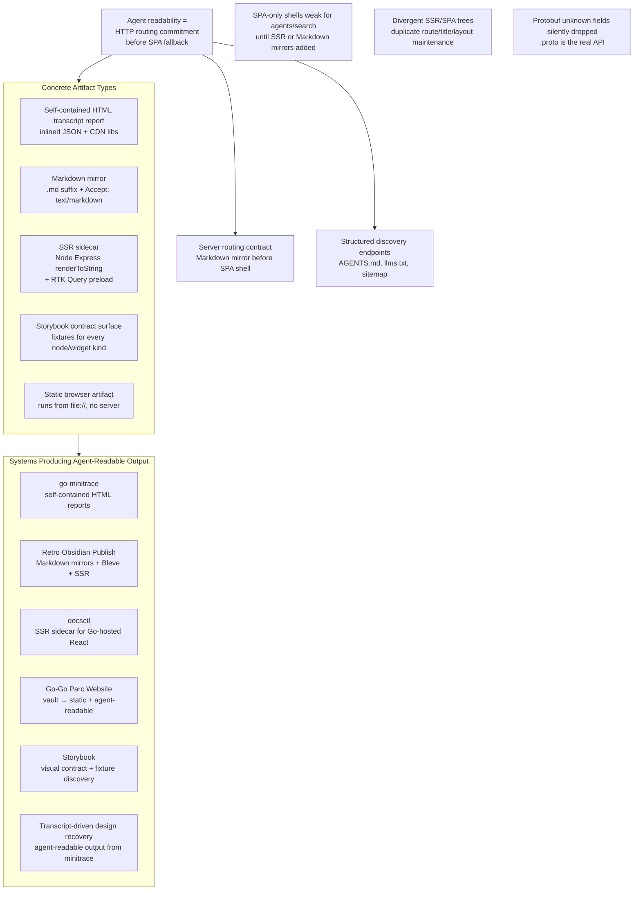
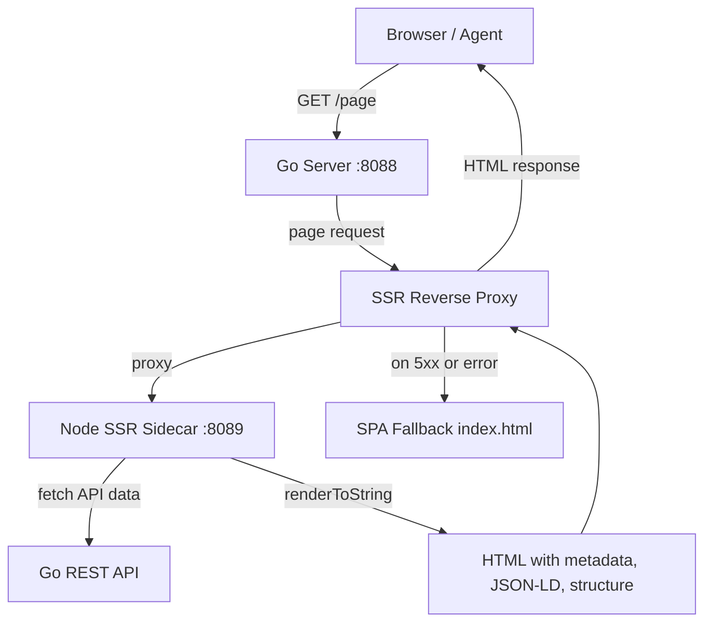

# Bridge 5 — Agent-Readable Artifacts and a14y

## 1. What this report is about

An agent that fetches a URL sees the HTTP response before any JavaScript runs. If that response is an empty React shell, the agent sees almost nothing. This report explains how six systems in this codebase were made legible to agents by treating readability as a server-side routing commitment that must be served before the SPA fallback — and by producing artifact types that carry their own structure without requiring a live server.

The central lesson, repeated across every system studied here, is that agent readability is not a frontend enhancement. It is an HTTP routing contract. A React app can remain the interactive UI, but agents need stable HTTP responses: text files must be text, sitemaps must be XML or Markdown, HTML pages must contain metadata and structure, and Markdown mirrors must be reachable without JavaScript.



This bridge spans four topic slices: Storybook and visual contract surfaces (T3), self-contained transcript reports and dashboard entity events (T5), Retro Obsidian Publish and knowledge bases (T6), and docsctl SSR and single-binary Go+SPA app shells (T7). The same design rule — serve structured responses before the SPA fallback — appears in all of them, even though the artifacts and transport differ.

## 2. Why agent readability exists as a separate concept

Consider what happens when a browser and an agent fetch the same URL. The browser receives an HTML shell, parses it, downloads JavaScript, executes it, fetches data from an API, hydrates a React tree, and renders a page. The agent receives the same HTML shell and stops. Without executing JavaScript, the shell is a `<div id="root"></div>` with no headings, no content, no metadata that an agent can act on.

This is not a bug in the React application. The SPA is doing exactly what it was designed to do: defer rendering to the client. The problem is that the server has made no commitment to agents. Every non-API path falls through to the SPA fallback, and the SPA fallback serves the same empty shell regardless of whether the request came from a browser that will execute JavaScript or an agent that will not.

The docsctl documentation browser scored **42/100** on its first a14y audit for exactly this reason. The site returned an empty SPA shell for every documentation page and also returned that same HTML shell for agent-discovery files such as `/llms.txt`, `/robots.txt`, `/AGENTS.md`, `/sitemap.xml`, and `/sitemap.md` (`Projects/2026/05/25/ARTICLE - Agent a14y for Go-Hosted React Docs - Converting docsctl from SPA Shell to Agent-Readable Site.md`). The browser could render the site after JavaScript loaded. An agent fetching the same URLs saw almost no useful content.

The fix did not come from one large rewrite. It came from placing the right responsibilities at the right layer. The Go server now handles agent-facing files and Markdown mirrors. The Node SSR sidecar provides HTML metadata and server-rendered structure. The development workflow includes browser checks so content-type regressions are caught before they become invisible production failures.

The same pattern recurs in Retro Obsidian Publish, which scored **62/100** before adding Markdown mirrors, discovery endpoints, and SSR, and **99/100** after (`Projects/2026/06/06/PROJ - Retro Obsidian Publish - A Retro Monochrome Vault Browser.md`). The gap between those two scores is not measured in React components. It is measured in HTTP responses.

## 3. The server routing contract

The practical heart of agent readability is routing order. If `/llms.txt` reaches the SPA fallback, the site fails a14y even if the React app works perfectly. If `/assets/main.js` reaches the SSR proxy, the browser receives HTML with a JavaScript URL and fails to load the application. The order must be explicit.

The docsctl server established this contract:

```text
Incoming request
  ├─ /api/*                         → API handler
  ├─ well-known agent file           → WellKnownHandler
  ├─ .md section URL                 → Markdown mirror
  ├─ Accept: text/markdown           → Markdown mirror
  ├─ static asset                    → embedded static file handler
  ├─ page request with SSR enabled   → SSR sidecar proxy
  └─ fallback                        → SPA shell
```

Agent support is not a separate service. It is a set of routing commitments that must sit before the SPA fallback. The Go server checks the well-known handler before the SSR proxy and before the SPA fallback:

```go
if wellKnownHandler.CanHandle(cleanPath) {
    wellKnownHandler.ServeHTTP(w, r)
    return
}
```

Each generated well-known file has a distinct content type and a distinct job. The handler owns a map from path to content type:

```go
var wellKnownPaths = map[string]string{
    "/llms.txt":    "text/plain; charset=utf-8",
    "/robots.txt":  "text/plain; charset=utf-8",
    "/AGENTS.md":   "text/markdown; charset=utf-8",
    "/sitemap.xml": "application/xml; charset=utf-8",
    "/sitemap.md":  "text/markdown; charset=utf-8",
    "/index.md":    "text/markdown; charset=utf-8",
}
```

The important shift is that documentation is no longer only a frontend state. It is also an HTTP resource graph. Agents can discover it through indexes, request Markdown directly, and parse metadata without executing JavaScript.

## 4. Structured discovery endpoints

Agents need entry points into a site's content graph. Three discovery surfaces recur across the systems studied here, each serving a different kind of consumer.

| Endpoint | Content type | Purpose | Who reads it |
|---|---|---|---|
| `/llms.txt` | `text/plain` | Site overview, package list, top-level section links with `.md` suffixes | LLM discovery convention |
| `/AGENTS.md` | `text/markdown` | Installation, usage, API documentation, URL scheme | Coding agents operating on the codebase |
| `/robots.txt` | `text/plain` | AI crawler permissions and sitemap pointer | Crawler policy discovery |
| `/sitemap.xml` | `application/xml` | Standard urlset with `lastmod` fields | Standard crawler discovery |
| `/sitemap.md` | `text/markdown` | Readable index grouped by section with links | Human- and agent-readable index |

The `/AGENTS.md` file is not a marketing page. It is an operating guide. The docsctl-generated content includes installation commands, usage instructions, the URL scheme, and the API surface:

```markdown
# AGENTS.md

## How to use

Browse documentation at http://localhost:8088.
URL scheme: `/{package}/{version}/sections/{slug}`.
Append `.md` to any section URL for raw Markdown.

## API

- `GET /api/packages` — list all packages and versions
- `GET /api/sections?package=X&version=Y` — list sections
- `GET /api/sections/{slug}?package=X&version=Y` — get section content
```

A future agent can fetch `/AGENTS.md`, understand the URL scheme, discover the API, and know that `.md` suffix URLs are the preferred plain-text representation. The site becomes self-describing.

One detail that matters for the `llms.txt` convention: links inside `llms.txt` should point to Markdown resources, not HTML. The a14y `llms-txt.md-extensions` check expects this. Linking to `/sections/foo` sends the agent to HTML. Linking to `/sections/foo.md` sends the agent to raw Markdown that it can parse directly.

## 5. Markdown mirrors and content negotiation

Agent-readable documentation should not require HTML parsing. The docsctl and Retro Obsidian Publish systems both gained two Markdown access paths that sit before the SPA fallback.

The first is a `.md` suffix on any page URL:

```text
/glazed/_/sections/jq-filter          → HTML page
/glazed/_/sections/jq-filter.md       → Markdown mirror
/note/research-kb-tribal-app          → HTML note page
/note/research-kb-tribal-app.md       → Markdown note mirror
```

The second is content negotiation via the `Accept` header:

```bash
curl -H 'Accept: text/markdown' \
  http://localhost:8088/glazed/_/sections/jq-filter
```

The server strips the `.md` suffix and resolves the normal section URL, then returns the content with YAML frontmatter and a canonical `Link` header:

```http
HTTP/1.1 200 OK
Content-Type: text/markdown; charset=utf-8
Link: <http://localhost:8088/glazed/_/sections/jq-filter>; rel="canonical"
```

Retro Obsidian Publish added the same mirrors at `/index.md` and `/note/{slug}.md`, with frontmatter, canonical `Link` headers, and `## Sitemap` sections embedded in each mirror (`Projects/2026/06/06/PROJ - Retro Obsidian Publish - A Retro Monochrome Vault Browser.md`). The SSR HTML advertises the markdown mirrors with `<link rel="alternate" type="text/markdown">` so agents can discover them from the HTML response itself.

Markdown mirrors should be addressable, not only negotiable. `Accept: text/markdown` is useful, but `.md` suffix URLs are easier for agents to discover and share because they do not require header manipulation.

## 6. Concrete artifact types

Agent readability is not only about server routing. Several systems produce standalone artifacts that carry their own structure and do not require a live server at all. Each artifact type solves a different legibility problem.

| Artifact type | What it is | Producing system | Runs without server? |
|---|---|---|---|
| Self-contained HTML transcript report | One HTML file with inlined JSON payload + CDN-rendered React viewer | go-minitrace | Yes (opens from `file://`) |
| Markdown mirror | `.md` suffix or `Accept: text/markdown` response with frontmatter | docsctl, Retro Obsidian Publish | No (served by Go) |
| SSR sidecar HTML | Node Express `renderToString` + RTK Query preload, proxied by Go with SPA fallback | docsctl, Retro Obsidian Publish | No (requires sidecar) |
| Storybook contract surface | Static stories with stable JSON fixtures for every node/widget kind | Fringe Admin DSL, Widget IR, Pyxis | Yes (static build) |
| Static browser artifact | SQLite + React SPA packaged as files, runs from `file://` | Codebase Browser (sql.js) | Yes |

### 6.1 Self-contained HTML transcript reports

go-minitrace produces a single HTML file that contains everything needed to render a transcript: the session data as inlined JSON, the React viewer bundle inlined as a script tag, and the CSS inlined. The file opens from `file://` and behaves like a read-only application without any server, API, or external fetch (`Projects/2026/04/14/ARTICLE - Self-Contained HTML Transcript Exports - Under the Hood in go-minitrace.md`).

The architecture is deliberately conservative. Go owns archive loading and normalization. The export payload is the contract boundary. React owns rendering of that payload. The browser is not the source of truth and is not doing heavy semantic reconstruction — the backend export step is.

The critical engineering problems in this artifact type are not in React. They are in the packaging path:

- **Script-tag-safe payload marshaling.** The payload is JSON embedded inside an HTML `<script type="application/json">` tag. Raw `</script>` sequences in transcript content can terminate the script block early. The marshaller escapes `<`, `>`, `&`, U+2028, and U+2029 to Unicode escape sequences. JSON validity is not enough — the payload must be valid for its embedding context.
- **Literal-safe replacement.** Regex replacement APIs interpret `$0`, `$1`, and `$(dirname "$0")` in transcript data as replacement-group references. The renderer uses literal-safe replacement functions for the inlined bundle, the payload script, and the title. Do not use a regex replacement API when the replacement text is large, user-derived, or transcript-derived content.

### 6.2 SSR sidecar HTML

When a Go-hosted React SPA needs server-rendered HTML for SEO, social previews, or agent readability, the SSR sidecar pattern adds a Node.js Express process that renders React to HTML via `renderToString`, paired with a Go reverse proxy that falls back to the SPA shell when the sidecar is unavailable (`Projects/2026/05/25/ARTICLE - SSR Sidecar for Go-Hosted React SPAs - A Deep Dive into docsctl Server-Side Rendering.md`).



The Go server routes API requests directly (never through the proxy, to avoid loops), then page requests to the SSR proxy, then everything else to the SPA fallback. The fallback is deliberate: when the SSR sidecar is down, the browser still loads the React app and fetches data client-side. The experience degrades but does not break.

Why a sidecar rather than an embedded runtime? The React component tree uses hooks, context, and browser APIs (`window`, `document`, `location`). V8, goja, and WASM runtimes do not provide these. The polyfill surface that React and its ecosystem expect is impractical to maintain. Node.js already provides the full API surface that React expects.

Retro Obsidian Publish took a different hydration approach. The SSR renders simplified components (note title, HTML body, tags, backlinks) while the client renders the full app (sidebar, panels, etc.). Using `hydrateRoot` would require identical DOM trees. Instead, `createRoot()` with `root.textContent = ""` clears the SSR content and mounts the full app fresh. The SSR HTML is still visible to crawlers and agents even though the client replaces it.

### 6.3 Storybook contract surface

Storybook functions as more than a component demo site. In the Fringe Admin DSL and Widget IR pipelines, it is a contract surface: every node kind and widget kind needs stories for normal, empty, mobile, and error states (`Projects/2026/05/16/PROJECT REPORT - Fringe Admin DSL Backend Driven Admin Interfaces Deep Dive.md`; `Projects/2026/06/07/ARTICLE - Widget IR - Building a Data-First React Rendering Pipeline for RAG Evaluation.md`).

The rule is direct: if a primitive cannot be described with a stable JSON fixture, its design is not ready. Storybook stories are the fixtures that make a component's contract concrete and inspectable. They serve both human review and agent consumption — a story file is a structured description of inputs and expected output that can be read without executing the component.

The Pyxis visual parity workflow extends this further. The prototype is the visual source of truth, not Storybook. A baseline element is not just a screenshot — it is an artifact bundle: `screenshot.png` + `computed-css.md` + `computed-css.json` + `prepared.html` + `inspect.json` + `metadata.json` (`Projects/2026/04/23/ARTICLE - Pyxis - Developer Handoff for Visual Comparisons and Storybook Parity.md`). These bundles are agent-readable evidence: an agent or tool can inspect the computed CSS, the matched style declarations, and the prepared HTML without running a browser.

### 6.4 Static browser artifacts

The Codebase Browser produces a SQLite database that is both the browser runtime database and the LLM/script artifact. Go builds it; the browser queries it via `sql.js` (SQLite compiled to WebAssembly). No hidden server. The export is a compiler pass, not server startup. The artifact runs from `file://` with no server process.

This is the strongest form of agent readability for data artifacts: the artifact itself is the runtime. An agent can open the SQLite file directly, query it, and extract exactly the structures it needs without depending on a live HTTP endpoint.

## 7. Systems producing agent-readable output

The bridge plan named six systems. Each produces agent-readable output through a different combination of the artifact types above.

| System | Primary artifact | Discovery surface | Score progression |
|---|---|---|---|
| go-minitrace | Self-contained HTML report + normalized SQLite | `go-minitrace query commands` (JS verb catalog) | N/A (artifact, not site) |
| Retro Obsidian Publish | Markdown mirrors + SSR HTML | `/llms.txt`, `/AGENTS.md`, `/sitemap.md`, `/sitemap.xml`, `/index.md` | 62 → 99 |
| docsctl | Markdown mirrors + SSR HTML | `/llms.txt`, `/robots.txt`, `/AGENTS.md`, `/sitemap.xml`, `/sitemap.md`, `/index.md` | 42 → 97 |
| Go-Go Parc Website | Vault-derived static site | Bleve search + wiki-link resolution | N/A (vault publisher) |
| Storybook | Static stories + fixture bundles | `index.json` story catalog | N/A (contract surface) |
| Transcript-driven design recovery | Queryable transcript archives | DuckDB/SQLite + JS verb commands | N/A (analysis method) |

### 7.1 go-minitrace: self-contained reports and queryable archives

go-minitrace produces two kinds of agent-readable output. The first is the self-contained HTML transcript report described above. The second is the normalized SQLite database (`mt.db()`, 9–10 tables) that serves as the canonical analysis substrate for transcript mining (`Projects/2026/06/07/ARTICLE - Transcript-Driven Design System Recovery with go-minitrace.md`).

The transcript-driven design recovery method converts Pi session JSONL files into DuckDB-queryable `.minitrace.json` archives, then uses SQL `UNNEST` on the `turns` and `tool_calls` arrays to search across every prompt, response, command, and command output. The output is a ranked list of candidate sessions, a catalog of recovered documents with metadata, and the executable scripts that produced everything. All scripts are stored in the ticket's `scripts/` directory so the full research trail is reproducible.

The method demonstrates that agent-readable output is bidirectional. Agents produce transcripts that are themselves agent-readable archives. Another agent — or a human — can query those archives to recover design knowledge that was never committed to a file.

### 7.2 Retro Obsidian Publish: vault as read-only source of truth

Retro Obsidian Publish treats the vault directory as a read-only data source and derives everything from it: parsed HTML, wiki-link resolution, backlinks, search, and a file tree — all from one binary. The agent-readability layer adds Markdown mirrors at `/index.md` and `/note/{slug}.md`, content negotiation via `Accept: text/markdown`, and discovery endpoints (`Projects/2026/06/06/PROJ - Retro Obsidian Publish - A Retro Monochrome Vault Browser.md`).

One detail that prevented crawlable 404 pages: unresolved wiki links are converted to same-page `#unresolved-*` anchors rather than emitting broken links. This keeps the agent-readable surface clean even when the vault has incomplete cross-references.

### 7.3 docsctl: from SPA shell to agent-readable site

The docsctl conversion is the most detailed a14y case study. The score progression shows which changes actually moved the metric:

| Phase | Main change | Page score |
|---|---|---:|
| Baseline | SPA shell only | 42/100 |
| SSR metadata | canonical, OG tags, meta description, lang | 55/100 |
| Well-known files | llms.txt, robots.txt, AGENTS.md, sitemap.xml, sitemap.md, index.md | 76/100 |
| Markdown negotiation | Accept: text/markdown and Markdown mirrors | 82/100 |
| JSON-LD + text ratio | WebPage JSON-LD, noscript fallback | 83/100 |
| Breadcrumb + glossary | BreadcrumbList, glossary link | 91/100 |
| Headings + canonical header | visible-to-agent headings, Link canonical header | 97/100 |

The progression is not linear in effort. The jump from 42 to 55 came from adding SSR metadata. The jump from 55 to 76 came from serving well-known agent files from Go instead of routing them to the SPA shell. The jump from 76 to 82 came from content negotiation. Each phase treated an a14y failure as a concrete HTTP contract violation and fixed it at the layer that owns that contract.

## 8. Failure modes

Three failure modes recur across the systems studied here. Each reveals a constraint that shaped the architecture.

### 8.1 SPA-only shells are weak for agents and search

A server that returns an empty `<div id="root"></div>` for every URL is correct for browsers but insufficient for agents. The docsctl baseline score of 42/100 and the Retro Obsidian baseline of 62/100 both stem from this. The fix is always the same: serve structured responses before the SPA fallback, whether those responses are well-known text files, Markdown mirrors, or SSR-rendered HTML.

### 8.2 Divergent SSR/SPA trees

When SSR and SPA render different component trees, the result is a maintenance burden: duplicate route logic, duplicate title/layout decisions, and the risk that the server-rendered HTML and the client-rendered app tell different stories.

Retro Obsidian Publish hit this failure directly. The original SSR rendered a simplified `SSRNotePage` component while the client rendered the full `App` with sidebar, panels, and chrome. The resolution was to use `createRoot()` with `root.textContent = ""` to clear SSR content and mount the full app fresh, rather than `hydrateRoot` which requires identical DOM trees. The SSR HTML remains visible to crawlers and agents even though the client replaces it.

The durable rule: SSR and SPA do not need to produce identical DOM trees, but they must not diverge in the information they expose. If the SSR HTML claims a title, canonical link, and JSON-LD that the SPA does not preserve, the agent sees one contract and the browser sees another.

### 8.3 Protobuf unknown fields are silently dropped

In protobuf-based APIs, the `.proto` schema is the real contract — not the JSON that crosses the wire. Unknown fields are silently dropped by `protojson` unmarshaling. This caused a subtle bug in the thinking-content investigation: the OpenAI Node SDK does not strip `reasoning_content` (raw `JSON.parse` preserves it), but protobuf consumers that did not declare the field in their `.proto` silently lost it (`Projects/2026/04/07/ARTICLE - Investigating LLM Thinking Content in Tool-Rich Coding Agent Contexts.md`, referenced via `sources/05b`).

The same principle applies to the streaming agent dashboard. The dashboard uses protobuf entity-wrapper UI events so that snapshots and live updates speak the same entity language (`Projects/2026/05/12/ARTICLE - Streaming Agent Dashboard - Server Side Implementation Deep Dive.md`). If a field is not in the `.proto`, the browser will never see it, no matter what the backend publishes. The `sessionstream-lint` vettool enforces this by rejecting top-level `google.protobuf.Struct` and requiring concrete, feature-owned protobuf messages.

### 8.4 Routing-order regressions

One bug made the docsctl site unusable in the browser while the server-side checks looked promising. Once the SSR proxy was introduced, static asset paths such as `/assets/main-Bds3JEJk.js` were treated like page requests. They went through the SSR sidecar, which returned HTML. The browser then tried to execute HTML as JavaScript and load HTML as CSS:

```text
Loading module from "http://localhost:8088/assets/main-Bds3JEJk.js" was blocked
because of a disallowed MIME type ("text/html").
```

The fix was to recognize static assets before the SSR proxy and route them directly to the embedded static file handler. This bug is the reason browser checks belong in the workflow alongside a14y checks. a14y tells whether agents can read the site. Playwright tells whether humans can still use it. The same routing changes that help agents can break static asset loading if they are ordered incorrectly.

## 9. Key points

- Agent readability is an HTTP routing commitment served before the SPA fallback, not a frontend enhancement. The React app can remain the interactive UI; the server must provide meaningful responses at fetch time.
- The routing order is the contract: API, well-known agent files, Markdown mirrors, static assets, SSR proxy, then SPA fallback. Reordering any of these breaks either agent readability or browser usability.
- Markdown mirrors should be addressable via `.md` suffix URLs, not only negotiable via `Accept: text/markdown`. Addressable URLs are easier for agents to discover and share.
- Self-contained HTML artifacts succeed or fail on the packaging path, not the React code. Script-tag-safe payload marshaling and literal-safe replacement are the load-bearing engineering problems.
- SSR sidecars fall back to the SPA shell on failure, never to an error page. The experience degrades but does not break. Static assets must bypass the SSR proxy entirely.
- Storybook functions as a contract surface, not just a demo site. Stable JSON fixtures for every node/widget kind are the evidence that a design is ready.
- The `.proto` schema is the real API in protobuf systems. Unknown fields are silently dropped. `sessionstream-lint` enforces concrete feature-owned messages.
- Agent-readable output is bidirectional. Agents produce transcripts that are themselves queryable archives; another agent can mine those archives to recover design knowledge.

## 10. A learning path for making a system agent-readable

The following sequence distills the a14y work across docsctl and Retro Obsidian Publish into a repeatable path. Each step preserves a testable artifact.

1. **Establish a baseline with the a14y audit.** Run `a14y check` against the main site (not the SSR sidecar in isolation). The audit reports concrete checks with names, expected behavior, and observed behavior. Record the score. This is the contract you are working against.

2. **Serve well-known agent files from the server.** Generate `/llms.txt`, `/robots.txt`, `/AGENTS.md`, `/sitemap.xml`, `/sitemap.md`, and `/index.md` from the live data, not from static files. Each must return the correct content type. These handlers must sit before the SSR proxy and before the SPA fallback.

3. **Add Markdown mirrors and content negotiation.** Support both `.md` suffix URLs and `Accept: text/markdown`. Each mirror should include YAML frontmatter, a canonical `Link` header, and a `## Sitemap` section. Advertise the mirrors from the HTML via `<link rel="alternate" type="text/markdown">`.

4. **Enrich SSR HTML for agents.** Add meta tags (description, Open Graph), canonical links, JSON-LD (`WebPage` with `dateModified`, `BreadcrumbList`), and visually hidden headings (`sr-only`) before the React root. The headings must describe the page and expose navigation structure without duplicating the entire content body.

5. **Fix routing order and verify with both a14y and browser checks.** Static assets must bypass the SSR proxy. API routes must not go through the proxy. After every routing change, run `a14y check` and open the site in a browser to confirm JS/CSS MIME types are correct and the app renders.

6. **Score after each phase.** The score progression shows which changes moved the metric and prevents later regressions from being dismissed as subjective. If a change does not move the score, it did not fix a contract violation.

7. **If the system produces data artifacts, make the artifact self-contained.** Inline the JSON payload, the JS bundle, and the CSS into one HTML file. Use script-tag-safe marshaling and literal-safe replacement. Validate against a large real input, not just synthetic test data.

8. **If the system uses protobuf, enforce the schema.** Reject top-level `Struct`. Require concrete feature-owned messages. Run `sessionstream-lint` as a `go vet` analyzer. The `.proto` is the contract; unknown fields are silently dropped.

## 11. Closing

Agent readability spans the full stack: the Go server's routing order, the SSR sidecar's HTML structure, the Markdown mirror's frontmatter, the self-contained artifact's packaging path, the Storybook fixture's JSON shape, and the protobuf schema's field declarations. No single layer owns it. The systems studied here converged on the same rule from different directions: serve structured responses before the fallback, make artifacts self-contained, and treat every a14y failure as a concrete contract violation at the layer that owns that contract.

The next bridge reports build on this foundation. Single-binary Go + SPA (Bridge 7) is the deployment shape that makes the routing contract durable. Derived rebuildable artifacts (Bridge 8) is the discipline that keeps Markdown mirrors and static artifacts in sync with their canonical source. The routing order documented here is the seam where those bridges connect.

## Evidence index

Primary project articles read for this report:

- `Projects/2026/05/25/ARTICLE - Agent a14y for Go-Hosted React Docs - Converting docsctl from SPA Shell to Agent-Readable Site.md`
- `Projects/2026/05/25/ARTICLE - SSR Sidecar for Go-Hosted React SPAs - A Deep Dive into docsctl Server-Side Rendering.md`
- `Projects/2026/06/06/PROJ - Retro Obsidian Publish - A Retro Monochrome Vault Browser.md`
- `Projects/2026/04/14/ARTICLE - Self-Contained HTML Transcript Exports - Under the Hood in go-minitrace.md`
- `Projects/2026/05/12/ARTICLE - Streaming Agent Dashboard - Server Side Implementation Deep Dive.md`
- `Projects/2026/04/23/ARTICLE - Pyxis - Developer Handoff for Visual Comparisons and Storybook Parity.md`
- `Projects/2026/06/07/ARTICLE - Transcript-Driven Design System Recovery with go-minitrace.md`
- `Projects/2026/05/16/PROJECT REPORT - Fringe Admin DSL Backend Driven Admin Interfaces Deep Dive.md`

Source reports consulted:

- `sources/03b-typography-dmeta-visualdiff-fonts.md` (Storybook contract surface, visual parity)
- `sources/05a-agents-transcripts-sessionstream.md` (self-contained HTML reports, transcript analysis)
- `sources/05b-agents-pi-providers-dashboards.md` (a14y server contract, streaming dashboard, protobuf)
- `sources/06b-data-browsers-readwise-knowledge.md` (Retro Obsidian Publish, KB Playbook, static browser artifacts)
- `sources/07a-webui-localshells-backendui.md` (single-binary Go+SPA, SSR sidecar, agent-readable mirrors)
