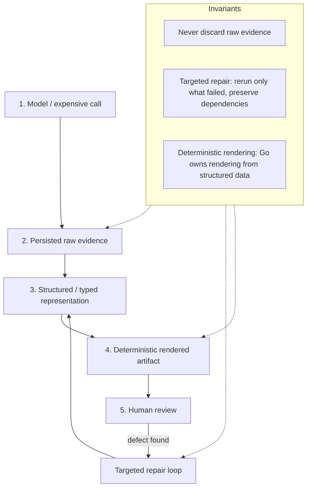

# Evidence-Preserving Workflows with Human-in-the-Loop Repair

## Why this report exists

Across four topic slices — hardware debugging (T1), visual parity (T3), postmortems (T4), and OCR repair (T6) — the same workflow shape recurs. An expensive call runs: a vision-language model OCRs a page, a browser renders two URLs for visual comparison, a serial driver probes a thermal printer, a k3s node reboots. That call produces raw evidence. The raw evidence is then transformed into a structured representation, rendered into an artifact a human can inspect, reviewed, and — when the review finds a defect — repaired by rerunning only what failed. This report names that workflow, explains why each stage exists, and grounds it in concrete project instances.

The reader should leave with one central insight: the value of an expensive observation is determined by whether the system around it can explain how the artifact was produced and repair selected pieces without discarding the rest of the run. A model call that writes a final Markdown file and nothing else is a script. A model call that writes raw input turns, raw response, structured JSON, rendered Markdown, and validation JSON — each in its own artifact — is a workflow. Only the second can be repaired.

## The pattern, stated precisely

An evidence-preserving workflow with human-in-the-loop repair has five stages, each with a distinct owner and a distinct artifact:



Each arrow is a one-way transformation. The model produces raw evidence. The raw evidence is parsed into structured data. The structured data is rendered deterministically. The rendered artifact is reviewed. The review either accepts the artifact or triggers a targeted rerun. The repair loop feeds back into the structured stage, not the model stage — unless the model stage itself is the defective layer, in which case the loop returns to stage one for the affected unit only.

The three invariants are not conveniences. They are the difference between a repairable system and a system that must be rerun from scratch.

## Why each stage exists

### Stage 1: The expensive call

The expensive call is the unit of work that costs time, money, or hardware wear. In Book OCR, it is a vision-language model turn that takes one page image and returns structured content. In CSS Visual Diff, it is a headless Chrome navigation that captures screenshots and computed CSS for two URLs. In thermal printer debugging, it is a UART write that drives 384 heating dots across 58mm of thermal paper. In the k3s post-reboot outage, it is the boot itself — a multi-minute sequence of cloud-init, k3s startup, CCM RBAC, Traefik deployment, and ArgoCD reconciliation.

The defining property is that rerunning the call blindly is expensive enough that the system must support selecting a subset for rerun. Rerunning 202 OCR pages to fix a code-block classification on page 132 wastes provider calls and introduces new model variability. Rerunning a full k3s reboot to verify one Traefik annotation costs ten minutes of downtime per iteration. Rerunning a 9600-baud bitmap print takes ten seconds per test pattern, and the printer's thermal state changes between runs.

### Stage 2: Persisted raw evidence

Raw evidence is the uninterpreted output of the expensive call. It must be persisted before any parsing or transformation happens. This is not a logging concern. It is a correctness invariant.

The Book OCR project states this rule explicitly in its engineering lessons: "Preserve raw evidence before parsing. A parser failure should not destroy the model response. Raw responses, input turns, final turns, structured JSON, rendered Markdown, and validation JSON should be separate artifacts" (`Projects/2026/05/26/ARTICLE - Book OCR Project Report - Structured Workflow Runtime and Manual PDF Repair.md`, §21 Rule 3). The per-page artifact layout is the implementation of that rule:

```
pages/page_NNN/01-turn-input.yaml
pages/page_NNN/02-turn-final.yaml
pages/page_NNN/03-raw-response.json
pages/page_NNN/04-structured.json
pages/page_NNN/05-rendered.md
pages/page_NNN/06-validation.json
```

The `03-raw-response.json` is written before parsing. If parsing fails, `07-error.txt` is written but the raw response is already on disk. The pipeline does not lose the observation merely because the current parser cannot accept it (`Projects/2026/05/26/ARTICLE - Structured Book OCR - Target Page Contracts Workflow Runtime and Production Hardening.md`, §7).

CSS Visual Diff persists four evidence layers per comparison: full-page screenshots, element screenshots, computed CSS properties (`StyleSnapshot`), and CSS cascade winners (`MatchedSnapshot` with specificity A,B,C, origin, and `!important`). All four are written as separate artifacts in a `CompareResult` structure before any LLM review runs (`Projects/2026/04/21/PROJ - CSS Visual Diff - Hair Booking Fringe Restyle Tooling.md`, data model section).

The Loupedeck serial bug investigation persisted raw transcript evidence across multiple Pi agent sessions. The transcript archive became queryable evidence only because the sessions had been converted to `.minitrace.json` and stored. When the bug reappeared months later, the historical evidence was still available for DuckDB queries that proved the bug occurred roughly 50% of the time historically, not as a new regression (`Projects/2026/04/22/ARTICLE - Project Report - Tracing the Loupedeck Serial Bug with Transcript Analysis.md`, Phase 1).

The thermal printer banding research persisted raw evidence at multiple levels: serial timing traces, oscilloscope captures of the printer power rail, logic analyzer traces of TX/RX/CTS, and the printed paper itself. The banding taxonomy — chunk-boundary banding at ~0.625mm, platen-circumference banding at ~44–63mm, supply-sag banding, thermal-history banding — could only be derived because the raw evidence was separable by band spacing (`Projects/2026/04/28/ARTICLE - Deep Research - Thermal Receipt Printer Banding Under Low Serial Feed.md`, diagnostics table).

### Stage 3: Structured / typed representation

Raw evidence is not reviewable at scale. A JSON blob from a model is data. A typed structure with named fields is evidence that a human and a validator can reason about. The structured representation is the boundary between "what the model or hardware produced" and "what the system believes happened."

The Book OCR `StructuredPageOCR` type is the canonical example:

```go
type StructuredPageOCR struct {
    SchemaVersion string
    BookID        string
    PageNumber    int
    PageType      PageType
    Blocks        []OCRBlock
    Warnings      []Warning
}
```

The block types — `heading`, `paragraph`, `list`, `table`, `code`, `figure`, `footnote`, `page_footer`, `blank` — are deliberately small. They do not attempt to represent every possible document-layout concept. They represent the concepts the pipeline needs to render stable Markdown and run deterministic checks (`Projects/2026/05/26/ARTICLE - Structured Book OCR...md`, §3).

The structured boundary is where parser repair happens. Live model responses drift: `page_number` arrives as `"032"`, `diagram_text` arrives as a string instead of an array, figure metadata nests under a `figure` object. The repair policy is deliberately limited:

```
Preserve raw response.
Accept common shape drift.
Repair structure when the needed text is already present.
Do not silently invent content.
```

This policy matters because it separates "the model produced a structurally different but semantically correct response" from "the model produced a wrong response." The first can be repaired at the parser. The second requires a rerun.

CSS Visual Diff's `CompareResult` is the structured representation for visual comparison. It carries `StyleDiff` entries (property, original value, react value) and `WinnerDiff` entries that track which selector won the cascade for each property, with specificity and origin. The cascade winner analysis is the most conceptually dense part of the system because it explains *why* a property changed, not just *that* it changed (`Projects/2026/04/21/PROJ - CSS Visual Diff...md`, CSS cascade winner analysis section).

### Stage 4: Deterministic rendered artifact

The rendered artifact is what the human reviewer inspects. It must be produced deterministically from the structured representation. If rendering is non-deterministic — if the model writes the final Markdown, or if a stochastic post-processor decides what to show — then a reviewer cannot trust that two reviews of the same structured data produce the same artifact.

This is the reason the Book OCR renderer is in Go, not in the model prompt:

> "Markdown is too broad as a model output contract. It mixes recognition, interpretation, layout, and rendering. A structured JSON boundary lets Go own deterministic rendering and validation" (`Projects/2026/05/26/ARTICLE - Book OCR Project Report...md`, §21 Rule 2).

The renderer emits a page marker (`<!-- page:032 -->`), then renders each block type according to deterministic rules. Table rendering is deterministic — the model returns table blocks with headers and rows; Go emits GitHub-flavored Markdown table syntax every time. Code rendering uses `common-lisp` fences. Figure rendering has a policy: if a figure is primarily a spreadsheet and the next block is the table transcription, the renderer suppresses the image marker (`Projects/2026/05/26/ARTICLE - Book OCR Project Report...md`, §9).

For CSS Visual Diff, the rendered artifacts are the screenshots themselves, the diff-comparison PNG (left | right | diff overlay), the Markdown summary, and the agent brief. Each is produced deterministically from the `CompareResult`. The pixel diff is pure Go: it reads both element screenshots as `image.NRGBA`, pads to match dimensions, computes RGB Euclidean distance per pixel, and marks changed pixels red. No external image library, no stochastic processing (`Projects/2026/04/21/PROJ - CSS Visual Diff...md`, pixel diff section).

For thermal printing, the rendered artifact is the printed page itself. The Almanach rasterizer converts a Chrome screenshot to a packed 1-bit bitmap using a fixed threshold. The deterministic property is critical: the first regression test for any new rasterizer is that `rasterMode: threshold` produces byte-identical output to the current implementation (`Projects/2026/05/10/ARTICLE - Thermal Dithering Algorithms - Almanach Rasterization Deep Dive.md`, Phase 1).

### Stage 5: Human review and targeted repair

Human review finds defects that automated validation misses. The repair that follows must be targeted: rerun only the defective unit, preserve the rest of the run, and respect dependency semantics.

The Book OCR manual PDF repair loop is the most fully developed instance. The loop is:

1. Render the full-book Markdown to PDF.
2. Open the PDF in Okular.
3. User identifies pages or snippets that are visually wrong.
4. Map the PDF evidence back to source page markers and page artifact directories.
5. Inspect `04-structured.json`, `05-rendered.md`, `embedded-figures.md`, and `pdftotext` output.
6. Decide whether the issue is prompt, renderer, figure embedding, PDF conversion, or workflow stale assembly.
7. Make the smallest code/prompt/workflow fix that addresses the class of error.
8. Rerun only affected pages or reassemble only when possible.
9. Regenerate PDF and reopen it.
10. Record the step in the diary.

(`Projects/2026/05/26/ARTICLE - Book OCR Project Report...md`, §16)

The critical discipline in step 5 is inspecting the right stage. If a page is wrong in `04-structured.json`, the model or prompt needs repair. If it is right in `04-structured.json` but wrong in `05-rendered.md`, the renderer needs repair. If it is right in `05-rendered.md` but wrong in `embedded-figures.md`, the figure embedding pass needs repair. If it is right in Markdown but wrong in PDF, the Pandoc/LaTeX path needs repair. The layered artifact layout makes these layers separable.

The k3s post-reboot outage follows the same shape, though the artifacts differ. The expensive call is the reboot. The raw evidence is `kubectl get pods`, `ss -tlnp`, `iptables -t nat -L PREROUTING -n -v`, `journalctl -u k3s.service`, and `kubectl auth can-i`. The structured representation is the four-layer networking stack: DNS → Tailscale overlay → Traefik hostPorts → Kubernetes services. The rendered artifact is the post-reboot validation script output. The repair loop is the ordered recovery: disable CCM, let RBAC apply, re-enable CCM, restore Traefik, disable the legacy DNAT proxy, force ArgoCD sync retry. The final step — persisting the recovered model in `cloud-init.yaml` and running a controlled reboot to validate — is the equivalent of regenerating the PDF (`Projects/2026/05/03/ARTICLE - Debugging a k3s Post-Reboot Outage.md`).

## The three invariants

### Invariant 1: Never discard raw evidence

Raw evidence is the only ground truth about what the expensive call actually produced. Once it is discarded, every downstream artifact becomes uncheckable. A structured JSON that disagrees with the rendered Markdown cannot be debugged if the raw response is gone. A pixel diff that disagrees with the cascade winner analysis cannot be reconciled if the screenshots are gone.

The Book OCR project enforces this with artifact ordering. The raw response is written to `03-raw-response.json` before parsing. If parsing fails, the error is written to `07-error.txt`, but the raw response is already on disk. The pipeline does not lose the observation. The turn store (`turns.db`) persists input and final turns through Pinocchio's `chatstore.SQLiteTurnStore` with a stable identifier scheme:

```
convID    = book-ocr:<book-id>:<run-id>
sessionID = page:<NNN>
turnID    = page:<NNN>:01-structured-ocr
phase     = input or final
```

This gives a future reviewer two paths to the same evidence: the per-page YAML files for human inspection, and the SQLite turn store for replay and debugging (`Projects/2026/05/26/ARTICLE - Structured Book OCR...md`, §6).

The Loupedeck serial bug investigation depends on this invariant at a longer timescale. The raw evidence was Pi agent session JSONL, converted to `.minitrace.json` archives. When the bug reappeared months later, the historical evidence was still available. Without it, the bug would have appeared to be a new regression. With it, the bug was provably historical, occurring roughly 50% of the time across multiple sessions spanning several days (`Projects/2026/04/22/ARTICLE - Project Report - Tracing the Loupedeck Serial Bug with Transcript Analysis.md`, Phase 1).

### Invariant 2: Targeted repair — rerun only what failed, preserve dependencies

Rerunning the entire workflow to fix a local defect is the wrong default. It wastes the expensive call, introduces new model variability, and risks breaking what was already correct. The system must support selecting a subset of units for rerun and must respect the dependency graph that connects them.

The Book OCR `structured-rerun-pages` command implements this:

```bash
book-ocr structured-rerun-pages \
  --work-dir /tmp/book-ocr-structured-workflow-full-live-w4-figures \
  --run-id book-ocr/structured-499f1718-bfb6-4135-a52f-56d35001d0bd \
  --pages 132,140,179,181,182 \
  --render-pdf \
  --max-workers 2
```

The operator requeues selected page ops and downstream ops in the existing workflow database. It does not create a new run. It does not rewrite the original graph. It reprocesses already-known page steps (`Projects/2026/05/26/ARTICLE - Book OCR Project Report...md`, §15).

The dependency semantics are the subtle part. The first version of the rerun operator had a bug: it marked downstream assemble and validate ops `ready` at the same time as the page ops. Assembly could run before the rerun pages finished, producing stale final Markdown. The fix was to mark downstream ops `pending` and let the scheduler release them only after selected page steps succeeded:

```
selected structured-page-NNN ops -> ready
downstream assemble/validate ops -> pending
workflow -> running
```

This is the workflow dependency race failure mode. It is listed in the refined concept maps as a first-class failure mode: "Workflow dependency race: targeted rerun set downstream ops `ready` instead of `pending`" (`ttmp/.../design/04-refined-topic-concept-maps-v2.md`, Topic 6 failure modes). The corrected design preserves dependency semantics, and the report notes that targeted reprocessing should eventually become a first-class workflow runtime operator rather than direct CLI SQL.

CSS Visual Diff's visual parity repair loop is the same pattern at a different granularity. For each widget, the loop is: read original source → align Storybook fixture → rewrite promoted TSX/CSS → validate → run focused css-visual-diff → inspect artifacts → commit promoted implementation → backfill IR after promoted shape is stable → regenerate → validate again (`Projects/2026/04/21/PROJ - CSS Visual Diff...md` and `ttmp/.../sources/03b-typography-dmeta-visualdiff-fonts.md`, visual parity repair loop). The unit of rerun is the widget, not the page. The dependency is the IR → generated scaffold → promoted React → Storybook fixture chain.

### Invariant 3: Deterministic rendering — Go owns rendering from structured data

Deterministic rendering is the invariant that makes review meaningful. If rendering is non-deterministic, a reviewer cannot distinguish between "the structured data is wrong" and "the renderer made a different choice this time." The rendered artifact must be a pure function of the structured data.

In Book OCR, Go owns the renderer. The model returns `StructuredPageOCR` JSON. Go renders Markdown. The renderer always emits a page marker, then renders each block type according to deterministic rules. Tables are not left as model-written Markdown. Code blocks are rendered as fenced `common-lisp` blocks. Figure rendering suppresses image markers for table-like figures followed by table blocks. These are Go decisions, not model decisions (`Projects/2026/05/26/ARTICLE - Book OCR Project Report...md`, §9).

In CSS Visual Diff, Go owns the pixel diff, the cascade winner analysis, and the agent brief. The browser captures screenshots and computed CSS. Go computes the diff deterministically. The `agentBrief` service produces a token-efficient summary with deterministic bullet generation rules: lead with pixel drift percentage, emit computed style diff bullets, fill remaining slots with winner-rule selector changes (`Projects/2026/04/21/PROJ - CSS Visual Diff...md`, agent brief service section).

In Almanach thermal printing, Go owns the rasterizer. The Chrome screenshot is the raw evidence. The packed 1-bit bitmap is the structured representation. The printer receives the rendered artifact. The first regression test for any new rasterizer is byte-identical output for threshold mode. The firmware bitmap contract is stable while algorithms are evaluated (`Projects/2026/05/10/ARTICLE - Thermal Dithering Algorithms...md`, working rules).

## Concrete instances compared

The pattern is not a template applied to identical problems. Each instance has a different expensive call, a different evidence type, and a different repair granularity. The table below makes those differences explicit:

| Instance | Expensive call | Raw evidence | Structured representation | Rendered artifact | Repair unit |
|---|---|---|---|---|---|
| Book OCR | VLM page OCR | Input/final turns, raw response | `StructuredPageOCR` JSON | Markdown + PDF | Per page |
| CSS Visual Diff | Headless Chrome navigation | Screenshots, computed CSS, cascade winners | `CompareResult` | Diff PNGs, Markdown brief | Per widget/selector |
| Loupedeck serial bug | USB serial connection | Session JSONL transcripts | `.minitrace.json` archive | DuckDB query results | Per session |
| k3s post-reboot outage | VM reboot | kubectl/ss/iptables/journalctl output | Four-layer networking model | Validation script output | Per recovery step |
| Thermal printer banding | UART bitmap print | Scope traces, logic analyzer, printed paper | Banding taxonomy | Diagnostic decision tree | Per test pattern |
| Almanach rasterization | Chrome screenshot + rasterize | Screenshot PNG | Packed 1-bit bitmap | Printed thermal page | Per raster mode |

The repair unit column is the most important. Book OCR repairs per page because pages are independent units of work. CSS Visual Diff repairs per widget because widgets are independent design-system components. The Loupedeck investigation repaired per session because sessions are the unit of transcript evidence. The k3s outage repaired per recovery step because each step had to be validated before the next. Thermal printer banding repairs per test pattern because each pattern isolates a different failure layer.

## Failure modes

The refined concept maps surface three first-class failure modes for this bridge (`ttmp/.../design/04-refined-topic-concept-maps-v2.md`, Bridge 6 mermaid graph). Each is documented here with its concrete manifestation.

### Failure mode 1: OCR hallucination and style drift

The model produces output that is structurally valid but semantically wrong. In Book OCR, this manifested as duplicated paragraphs, list-page style drift, and caption bleed from neighboring pages. The root cause was the freeform OCR prompt with neighboring page image context: the model was told to treat the first image as the target page and neighboring images as context only, but it copied adjacent visual content into the target page output (`Projects/2026/05/26/ARTICLE - Book OCR Project Report...md`, §4).

The fix was not a better prompt. The fix was a stronger boundary: primary production OCR sees exactly one target page image. The model returns `StructuredPageOCR` JSON. Go renders deterministic Markdown. The target-page-only invariant is enforced in code, not in prompt instructions:

```go
if CountTurnImages(result.InputTurn) != 1 {
    return error
}
```

This is the key lesson. A model may understand instructions about target and context images, but production OCR should not rely on that behavior for final text. Page provenance is a hard requirement. The structured primary call sees exactly one target page image (`Projects/2026/05/26/ARTICLE - Structured Book OCR...md`, §4).

A second manifestation of style drift appears in CSS Visual Diff as visual parity drift: the IR, the promoted React, the Storybook fixture, and the imported original diverge. The Pyxis baseline catalog method addresses this by defining the prototype as the visual source of truth, not Storybook. A baseline element is an artifact bundle: `screenshot.png` + `computed-css.md` + `computed-css.json` + `prepared.html` + `inspect.json` + `metadata.json` (`ttmp/.../sources/03b-typography-dmeta-visualdiff-fonts.md`, baseline catalog method).

### Failure mode 2: Visual parity drift

Visual parity drift occurs when multiple representations of the same visual intent diverge. In the DMETA/TTC arc, the representations are: the imported original, the DMETA semantic IR, the Interaction IR, the generated React scaffold, the promoted React component, and the Storybook fixture. Each representation can drift from the others.

The durable rule from the TTC Visual Parity report is that semantic capacity is not visual obligation. Generated TypeScript contracts describe what a component *can receive*, not what it *must render*. Optional semantic fields stay in the contract but are hidden from the default visual baseline. This allows rich contracts without visual bloat (`ttmp/.../sources/03b-typography-dmeta-visualdiff-fonts.md`, semantic capacity ≠ visual obligation).

The repair loop for visual parity drift is the css-visual-diff parity loop: read original → rewrite promoted → validate → diff → commit → backfill IR → regenerate → validate again. The backfill step is critical: after the promoted shape is stable, settled CSS is backfilled into the IR so the next regeneration preserves the visual decisions.

A specific failure mode within visual parity drift is the stale Storybook process. A stale Storybook process holding port 6008 produced confusing visual-diff behavior because the diff was comparing against a stale fixture, not the current code. The fix was process hygiene: `lsof`, kill stale PIDs, restart cleanly, verify with `curl index.json`. Visual workflows depend on dev-server correctness (`ttmp/.../sources/03b-typography-dmeta-visualdiff-fonts.md`, stale dev-server failure mode).

### Failure mode 3: Workflow dependency race

The workflow dependency race is the most subtle failure mode. It occurs when targeted repair requeues units but does not respect the dependency graph that connects them. The first version of the Book OCR `structured-rerun-pages` operator marked downstream assemble and validate ops `ready` at the same time as the page ops. Assembly ran before the rerun pages finished, producing stale final Markdown even though the per-page artifacts were correct (`Projects/2026/05/26/ARTICLE - Book OCR Project Report...md`, §16.4).

The corrected state transition is:

```
selected structured-page-NNN ops -> ready
downstream assemble/validate ops -> pending
workflow -> running
```

The scheduler releases downstream ops only after their dependencies succeed. This is the right dependency behavior. The report notes that targeted reprocessing should eventually become a first-class workflow runtime operator rather than direct CLI SQL, with a `ResetStepInput` type that carries the workflow ID, op IDs, downstream ops, and reset mode (`Projects/2026/05/26/ARTICLE - Book OCR Project Report...md`, §19).

The general lesson is that targeted repair is not just a matter of changing status flags. It must preserve dependency semantics. A rerun that does not respect dependencies produces artifacts that are internally inconsistent: the per-page artifacts are correct, but the assembled artifact is stale. A reviewer who trusts the assembled artifact will miss the defect.

## The relationship between workflow state and domain projection state

A persistent question across these instances is how to separate generic workflow state from domain-specific state. The Book OCR project answers this directly: workflow state and domain projection state are different.

The workflow engine records generic op state: did the step succeed, how many retries, what is the lease status. OCR operators need OCR-domain state: which page, how many figures, how many tables, how many warnings, where is the rendered Markdown. That belongs in a projection.

The `structured_pages` projection in Book OCR records:

```sql
CREATE TABLE IF NOT EXISTS structured_pages (
  book_id TEXT NOT NULL,
  page_num INTEGER NOT NULL,
  image_path TEXT NOT NULL,
  status TEXT NOT NULL,
  step_id TEXT,
  page_dir TEXT,
  raw_response_path TEXT,
  structured_json_path TEXT,
  rendered_markdown_path TEXT,
  validation_json_path TEXT,
  warning_count INTEGER NOT NULL DEFAULT 0,
  table_count INTEGER NOT NULL DEFAULT 0,
  figure_count INTEGER NOT NULL DEFAULT 0,
  rendered_bytes INTEGER NOT NULL DEFAULT 0,
  error_code TEXT,
  error_message TEXT,
  updated_at TEXT NOT NULL,
  PRIMARY KEY(book_id, page_num)
);
```

The workflow engine knows whether an op succeeded. The projection knows what the work means in the OCR domain. A workflow can say "the run succeeded." The projection can say "page 132 succeeded, has one code block, has zero figures, and rendered to N bytes" (`Projects/2026/05/26/ARTICLE - Structured Book OCR...md`, §11).

This separation appears in other instances. The k3s post-reboot validation script checks the full stack: k3s service state, node readiness, pod health, CCM RBAC, Traefik CRDs, IngressRoutes, ArgoCD application sync and health, legacy proxy state, stale DNAT rules, and external HTTP status codes. The workflow state is "the cluster is up." The projection state is "Traefik is running with hostPorts 80/443, argocd-crib is Synced and Healthy, and the legacy DNAT proxy is disabled." The validation script is the projection query (`Projects/2026/05/03/ARTICLE - Debugging a k3s Post-Reboot Outage.md`, validation script section).

The INFRA-004 SQLite tracker for release trains is another instance. The finite state vocabulary (`planned → branch_created → local_validation → pr_open → codex_waiting → ready → merged → main_actions_verified`) is the projection. The GitHub Actions runs and Codex review signals are the workflow state. The dashboard reads the projection on every request (`ttmp/.../sources/04b-infra-dns-tls-backup-publishing.md`, INFRA-004 SQLite tracker).

## A learning path for building an evidence-preserving workflow with repair

This section is a practical guide for building a new evidence-preserving workflow. It is ordered: each step assumes the previous step is in place.

### Step 1: Identify the expensive call and its unit of rerun

Before writing any code, name the expensive call and the smallest unit that can be rerun independently. For Book OCR, the expensive call is a VLM page turn; the unit of rerun is a page. For CSS Visual Diff, the expensive call is a headless Chrome navigation; the unit of rerun is a selector comparison. For the k3s outage, the expensive call is a VM reboot; the unit of rerun is a recovery step.

If you cannot name the unit of rerun, your workflow is a script. Scripts are fine for one-shot work, but they cannot be repaired. Do not build a repair loop until you know what you are repairing.

### Step 2: Define the raw evidence artifacts

List every artifact the expensive call produces, before any parsing or transformation. These artifacts must be written to disk before parsing happens. The ordering is not a logging concern; it is a correctness invariant.

The Book OCR per-page layout is a reference:

```
01-turn-input.yaml
02-turn-final.yaml
03-raw-response.json
04-structured.json
05-rendered.md
06-validation.json
```

The `03-raw-response.json` is written before `04-structured.json`. If parsing fails, `07-error.txt` is written, but `03-raw-response.json` is already on disk. A failed parse is still a useful observation.

### Step 3: Define the structured representation and the parser repair policy

The structured representation is the boundary between "what the model or hardware produced" and "what the system believes happened." It should be a typed structure with named fields, not a freeform blob. The types should be deliberately small — they should represent the concepts the pipeline needs to render stable output and run deterministic checks, not every possible concept.

Define a parser repair policy. Live model responses drift. The policy should accept common shape drift but should not silently invent content. Write the raw response first. Accept known structural variants. Repair when the needed text is already present. Do not manufacture new content.

### Step 4: Implement the deterministic renderer

The renderer is the production write boundary for the final artifact. It must be a pure function of the structured data. It must not call the model. It must not depend on external state that changes between runs.

For Book OCR, the renderer emits a page marker, then renders each block type according to deterministic rules. For CSS Visual Diff, the pixel diff is pure Go. For Almanach rasterization, the first regression test for any new rasterizer is byte-identical output for the existing mode.

The deterministic property is what makes review meaningful. If rendering is non-deterministic, a reviewer cannot distinguish between "the structured data is wrong" and "the renderer made a different choice this time."

### Step 5: Implement validation gates

Validation encodes every repeated manual finding as a deterministic report. If the reviewer finds the same class of defect twice, it should become a validation check. Book OCR's validation includes: expected page count, adjacent duplicate figure captions, per-page warnings, short-page warnings, empty code/list/table warnings. Each was added after manual review found the defect class.

The thermal printer banding diagnostics table is a validation gate of a different kind: it maps banding signatures to likely root causes and fast discriminators. A band repeating at ~0.625mm on a 384-pixel job points to host chunking without handshake. A band repeating at ~44–63mm points to a platen defect. The validation is the diagnostic decision tree (`Projects/2026/04/28/ARTICLE - Deep Research - Thermal Receipt Printer Banding Under Low Serial Feed.md`, diagnostics table).

### Step 6: Implement the targeted repair operator

The targeted repair operator requeues selected units for rerun and respects the dependency graph. It does not create a new run. It does not rewrite the original graph. It reprocesses already-known units.

The critical correctness property is that downstream ops must be marked `pending`, not `ready`. The scheduler releases them only after their dependencies succeed. If downstream ops are marked `ready`, assembly can run before rerun units finish, producing stale artifacts.

The Book OCR pseudocode is a reference:

```
input: run id, work dir, pages, render pdf flag
open engine.db
mark workflow running
for each selected page:
    delete any stale lease
    set structured-page-NNN status = ready
    reset retry state
set assemble-structured-markdown status = pending
set validate-structured-run status = pending
optionally patch assemble input to render_pdf = true
resume workers
```

### Step 7: Implement the review artifact and the review loop

The review artifact is what the human inspects. For Book OCR, it is the PDF. For CSS Visual Diff, it is the diff-comparison PNG and the Markdown brief. For the k3s outage, it is the validation script output. For thermal printer banding, it is the printed paper itself.

The review loop is: render the artifact, inspect it, map defects back to the source unit, inspect the right stage of the artifact chain, make the smallest fix that addresses the class of error, rerun only affected units, regenerate the artifact, inspect again. The loop is not a single pass. It is iterative, and each iteration should produce a diary entry or commit that records what was found and what was changed.

### Step 8: Persist the recovered model

A live repair is not complete until it survives a rerun. The k3s post-reboot outage report states this directly: "A live repair is not complete until it survives a reboot." The final step was writing the recovered model into `cloud-init.yaml` and running a controlled reboot to validate (`Projects/2026/05/03/ARTICLE - Debugging a k3s Post-Reboot Outage.md`, proving the fix with a real reboot).

For Book OCR, the equivalent is persisting the renderer fix, the prompt tightening, and the figure embedding guardrail in code, then rerunning the affected pages to confirm the fix. For CSS Visual Diff, it is backfilling the settled CSS into the IR after the promoted shape is stable, so the next regeneration preserves the visual decisions.

## Key points

- An evidence-preserving workflow has five stages: expensive call, persisted raw evidence, structured representation, deterministic rendered artifact, human review with targeted repair. Each stage owns one concern and produces one artifact type.
- Never discard raw evidence. The raw response, the input turn, the final turn, the screenshot, the serial trace — these are the only ground truth about what the expensive call produced. Write them to disk before parsing.
- Targeted repair reruns only what failed and preserves dependency semantics. Downstream ops must be marked `pending`, not `ready`, so the scheduler releases them only after their dependencies succeed. A rerun that does not respect dependencies produces internally inconsistent artifacts.
- Deterministic rendering means Go owns the renderer. The model returns structured data. Go renders the final artifact. A reviewer who cannot trust that two reviews of the same structured data produce the same artifact cannot review effectively.
- Workflow state and domain projection state are different. The workflow engine knows whether an op succeeded. The projection knows what the work means in the domain. A workflow can say "the run succeeded." The projection can say "page 132 succeeded, has one code block, has zero figures, and rendered to N bytes."
- Validation encodes every repeated manual finding as a deterministic report. If the reviewer finds the same class of defect twice, it should become a validation check. Spreadsheet images, code-like prose, empty code blocks, short pages, banding at chunk boundaries — all are examples.
- A live repair is not complete until it survives a rerun. Persist the recovered model in the source of truth (cloud-init, IR, renderer code) and run a controlled rerun to validate.

## Closing

The evidence-preserving workflow pattern is not specific to OCR, visual diff, hardware debugging, or infrastructure postmortems. It is the general shape of any system that turns expensive observations into reviewable, repairable artifacts. The Book OCR project is the most fully developed instance, with explicit engineering rules, a workflow runtime, a projection, a targeted rerun operator, and a manual PDF repair loop. The other instances — CSS Visual Diff, the Loupedeck serial bug, the k3s post-reboot outage, thermal printer banding — each demonstrate the pattern in a different domain with a different repair granularity.

The next bridge, Bridge 8 (Derived Rebuildable Artifacts), builds on this pattern. Once raw evidence is preserved and structured data is rendered deterministically, the rendered artifacts themselves become rebuildable from the structured source. The rebuild rule — "derived artifact is disposable, canonical source is the source of truth" — is the natural extension of the evidence-preserving invariants documented here.
