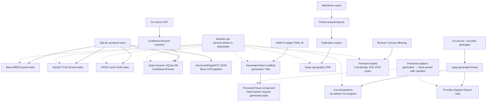

# Bridge 8 — Derived Rebuildable Artifacts

## 1. The pattern and why it exists

A derived artifact is any file, index, or rendered output that a tool can rebuild from a smaller canonical source. A Bleve BM25 index is derived from a SQLite corpus. A paginated PDF is derived from a Markdown report and a Pretext measurement pipeline. A generated React scaffold is derived from a DMETA widget IR in YAML. The canonical source is the source of truth; the derived artifact is disposable.

This pattern exists because the alternative does not scale. When a derived artifact is treated as canonical, the system accumulates state it cannot reproduce. A codebase index that drifts from its source repository becomes untrustworthy. A generated React file that is hand-edited without a provenance trail becomes impossible to regenerate without losing the edits. A TypeScript declaration that no longer matches the runtime profile of its binary produces completions for functions that do not exist. The rebuild rule prevents each of these failures by insisting that derived artifacts are always reproducible from canonical source, even when they are later promoted into hand-owned form.

The pattern appears across at least four topic slices in the project corpus: search indexes in Topic 6, generated React scaffolds in Topic 2 and Topic 3, print layouts in Topic 3, and static browser artifacts in Topic 6 and Topic 7. The same architectural shape repeats: a canonical source (SQLite, YAML IR, Markdown, Go source) feeds a generator or extractor that produces a derived artifact. The generator may run at build time, at request time, or as a one-shot promotion step. The artifact may be regenerated on every change, replaced atomically under a mutex, or promoted once and then hand-owned with a manifest that records where it came from.

## 2. The rebuild rule

The rebuild rule has three clauses, and every derived artifact in this corpus satisfies all three.

**Canonical source is the source of truth.** If the source and the derived artifact disagree, the source wins. The Readwise Viewer treats SQLite as canonical and Bleve as disposable: "SQLite remains canonical; Bleve is disposable derived index. Rebuild from SQLite on demand" (`ttmp/2026/06/22/PROJECT-MAPS-001--concept-maps-for-recent-project-topics/sources/06b-data-browsers-readwise-knowledge.md`). The RAG Evaluation System extends the same rule across embeddings and BM25 indexes (`Projects/2026/05/27/ARTICLE - RAG Evaluation System - Workflow-Driven Retrieval Evaluation.md`).

**Derived artifacts can always be regenerated.** This is what makes them disposable. The Codebase Browser ships a SQLite database that is "both the browser runtime database and the LLM/script artifact. Go builds it; the browser queries it via `sql.js`. No hidden server. Export is a compiler pass, not server startup" (`Projects/2026/04/23/PROJ - Codebase Browser - Static WASM Build and SQLite Prototype.md`). If the database is lost, the indexer rebuilds it from the git repository. If the Bleve index in Readwise is corrupted, `devctl` rebuilds it from the documents table.

**Promotion preserves provenance.** When a derived artifact is promoted into hand-owned form, the promotion is recorded. The DMETA pipeline enforces file lifecycle: "Generated files (`.generated.*`) live under `src/generated/dmeta-widgets/`; promoted components live under `src/components/`. Promoted components import generated types but own their runtime JSX/CSS. File lifecycle is enforced: `regenerate_only` files are overwritten; `scaffold_once` files are protected; `generated_sidecar` files support merge review" (`ttmp/2026/06/22/PROJECT-MAPS-001--concept-maps-for-recent-project-topics/sources/03b-typography-dmeta-visualdiff-fonts.md`). Without provenance, promotion becomes a one-way door: the artifact leaves the generator's contract, the next regeneration overwrites hand-edited work, and the system silently diverges.

## 3. Concrete artifact types

The pattern is broad enough to deserve enumeration. The following artifact types appear in the corpus, each with a different canonical source and a different promotion policy.

| Artifact type | Canonical source | Generator | Promotion path | Evidence |
|---|---|---|---|---|
| Bleve BM25 lexical index | SQLite documents table | Bleve indexer | Always derived; rebuild on demand | Readwise Viewer Bleve port, RAG Evaluation retrieval stack |
| FAISS vector KNN index | SQLite embeddings table | Bleve vector mapping under `-tags=vectors` | Always derived; build-tag-gated | `Projects/2026/06/02/ARTICLE - Building FAISS for Bleve Vector Search.md` |
| SQLite FTS5 full-text index | SQLite documents table | `CREATE VIRTUAL TABLE ... USING fts5` | Always derived; rebuild from base tables | TTC SQLite export, Codebase Browser static DB |
| Generated React scaffold | DMETA widget YAML IR | `dmeta lower-react` | Promoted to hand-owned with manifest and lifecycle tag | `Projects/2026/05/19/ARTICLE - DMETA Design System Factory - From Semantic Archetypes to Validated IR.md`, `Projects/2026/05/28/ARTICLE - TTC DMETA Visual Parity - Preserving IR and Codegen While Matching the Original Design.md` |
| Print layout PDF | Markdown report | Pretext `prepare()`/`layout()` → pagination → React render → print | Always derived; regenerated on every source change | `Projects/2026/05/27/ARTICLE - Pretext Print Layout - Building a Swiss Typography Rendering System for Dense Programming Reports.md` |
| Static browser artifact | Go/AST extract of source repository | `codebase-browser review index` → SQLite DB + React SPA | Always derived; shipped as `dist/` directory | `Projects/2026/04/23/PROJ - Codebase Browser - Static WASM Build and SQLite Prototype.md` |
| Firmware assets (1-bit bitmaps, ESC-POS bytes) | Browser Canvas dithering of source image | Browser encode → transport → firmware | Always derived; encoded per frame | SToMS3R thermal printer pipeline, Almanach raster service |
| Generated help documents | Provider-shipped Markdown in Go `embed.FS` | `xgoja gen-dts` style sidecar; runtime `help` command | Selected at buildspec time; provider-shipped | `Projects/2026/05/31/ARTICLE - xgoja Provider-Shipped Glazed Help Documents.md` |
| TypeScript declarations (`.d.ts`) | Generated xgoja binary's provider modules | Sidecar Go program importing selected providers → `dtsgen.RenderModules` | Always derived; regenerated when provider surface changes | `Projects/2026/06/09/ARTICLE - TypeScript Declarations from xgoja Generated Binaries.md` |

Each row is an instance of the same shape: canonical source, generator, derived artifact, promotion policy. The differences are in the canonical source format, the generator's runtime, and whether the artifact is regenerated in place or promoted once.

## 4. The promotion pattern in detail

Promotion is the most delicate part of the pattern. A derived artifact that is regenerated on every build needs no promotion: the generator owns it, the consumer reads it, and the rebuild rule is trivially satisfied. Promotion becomes necessary when the artifact must be hand-edited but the canonical source must remain the source of truth.

The DMETA pipeline is the canonical example. A widget is described in YAML IR. The `dmeta lower-react` generator produces a `.generated.*` TypeScript file with the widget's contract types, a CSS baseline, and a metadata sidecar. The promoted React component under `src/components/` imports the generated types, owns its JSX, owns its CSS, and is never overwritten by the generator. The bridge between the two is the generated manifest plus a hand-maintained `promotionState.ts`:

```text
src/generated/dmeta-widgets/dmeta.generated-manifest.json
src/dmeta/promotionState.ts
src/dmeta/componentManifest.ts
src/dmeta/index.ts
```

The manifest records which widgets have been promoted and which are still in `regenerate_only` state. The promotion state is hand-maintained, but the generator's metadata is regenerated on every run. The app joins the two: it asks the manifest for generated facts and the promotion state for runtime ownership. This design avoids a hand-maintained registry that would silently diverge from generated output.

The TTC Visual Parity report makes the boundary explicit: "The important constraint was file ownership. Generated files are replaceable. Promoted files are not. The generator can regenerate CSS evidence, TypeScript contracts, metadata, README notes, sidecar stories, and manifest entries. It must not overwrite the hand-owned runtime implementation. That rule stayed intact throughout the push" (`Projects/2026/05/28/ARTICLE - TTC DMETA Visual Parity - Preserving IR and Codegen While Matching the Original Design.md`).

Promotion is not a one-way door. The visual parity loop depends on being able to backfill settled promoted CSS into the IR and regenerate. The loop is: read original source → align Storybook fixture → rewrite promoted TSX/CSS → validate → run focused css-visual-diff → inspect artifacts → commit promoted implementation → backfill IR after promoted shape is stable → regenerate → validate again. The backfill step is what keeps the IR useful: the IR is not a frozen snapshot, it is a living contract that absorbs settled decisions from the promoted layer.

## 5. Architecture: the canonical-source → derived-artifact spine

The following mermaid graph shows the pattern across the corpus. Each artifact type is a leaf; each canonical source is a root; the generator is the edge.



The graph is intentionally redundant: SQLite feeds five different artifact types, Go source feeds two, and Markdown feeds one. The redundancy is the point. The pattern is not tied to one canonical source format. It is tied to the discipline of naming which file is canonical and which file is disposable.

## 6. Two retrieval stacks, one canonical store

The RAG Evaluation System provides the clearest side-by-side comparison of derived artifact types. SQLite is the canonical store. On top of it, two retrieval stacks are derived.

The first stack is the original rag-eval retrieval: BM25 via a Bleve index under `data/indexes/bm25/`, brute-force vector search over stored embeddings in SQLite, and manual reciprocal-rank fusion at the service layer. The Bleve index is disposable. The embeddings are stored in SQLite and scanned in Go. The fusion is a service-level merge.

The second stack is the goja-bleve stack: Bleve-native vector field mappings, KNN search requests, and Bleve-native RRF/RSF score fusion. The vector index is FAISS-backed and build-tag-gated. The fusion happens inside one Bleve `SearchRequest`, not as a post-hoc merge.

| Concern | rag-eval manual RRF | goja-bleve Bleve-native fusion |
|---|---|---|
| Text search | Separate service call | Query inside one `SearchRequest` |
| Vector search | Separate service call over stored embeddings | KNN clauses inside one `SearchRequest` |
| Fusion | Manual merge by `ChunkID` | Bleve RRF/RSF rescoring |
| Component visibility | Explicit `RetrievalResult.Components` | Depends on Bleve result/explanation fields |
| Pagination/windowing | Implemented by service limits | Controlled by Bleve request size/from/window |
| Vector scalability | Brute-force over loaded candidates | FAISS-backed vector indexes under `-tags=vectors` |

Both stacks derive from the same SQLite canonical store. The difference is in how much of the derived work is owned by Bleve versus owned by the application. The rebuild rule holds in both cases: if either index is lost, it is rebuilt from SQLite. The goja-bleve article states the invariant directly: "Vector support is build-tag-safe. Normal builds work without FAISS, and vector builds enable the Bleve KNN path explicitly" (`Projects/2026/06/03/ARTICLE - Goja Bleve - Native Search Bindings for JavaScript RAG Pipelines.md`).

## 7. The SQLite-as-product-boundary instance

The Codebase Browser is the strongest instance of the pattern because the derived artifact is also the runtime. A git commit range is the canonical source. The Go AST extractor walks every source file, collects packages, files, symbols, and cross-references, and produces a SQLite database. The database is then shipped as a static artifact: the browser loads it via `sql.js` (SQLite compiled to WebAssembly), runs SQL queries client-side, and renders the React SPA. There is no server.

The pipeline has four phases:

```text
1. Resolve commits        git log <range> → commit structs
2. Index commits          for each commit: worktree → AST extract → bulk insert
3. Discover markdown docs walk directories for .md files
4. Index each doc          render markdown with resolved codebase widgets
```

Phase 2 is where the derived-artifact discipline matters most. The original schema stored "one row per (commit, entity)": every symbol was inserted once per commit it appeared in. A 50-commit review produced a 32 MB database. Measurement showed that `snapshot_refs` alone was 76% of the database and 99.4% of its rows were exact duplicates of rows already stored for other commits. The average symbol overlap between consecutive commits was 98%.

The fix was a normalized schema: store each unique entity once, and use narrow `(commit_id, entity_id)` mapping tables to record which version appears in which commit. Compatibility views recreate the `snapshot_*` shape so the browser's SQL queries run unchanged.

| Commits | Old schema | New schema | Reduction |
|---|---|---|---|
| 5 | 3.2 MB | 516 KB | 6× |
| 10 | 6.4 MB | 864 KB | 7× |
| 20 | 12.4 MB | 1.1 MB | 11× |
| 50 | 32.3 MB | 1.4 MB | 23× |

The numbers come from `Projects/2026/05/02/ARTICLE - Squeezing a SQLite Database From 32 MB to 1.4 MB - How We Found and Fixed 99 Pct Redundancy in Codebase-Browser.md`. The reduction scales with commit count because each additional commit adds only narrow mapping rows (~8 bytes each) instead of full entity snapshots (~200–400 bytes each). The `WITHOUT ROWID` clause on mapping tables makes them physically compact: the primary key is the storage order.

This is the rebuild rule in its strongest form. The SQLite database is the runtime, but it is still disposable. The canonical source is the git repository. If the database is deleted, the indexer rebuilds it. The optimization did not change the canonical source; it changed how the derived artifact is stored.

## 8. Generated React scaffolds and the promotion contract

The DMETA Design System Factory is the clearest instance of the promotion pattern because it makes the contract explicit in file naming. The generator produces files under `src/generated/dmeta-widgets/` with `.generated.*` suffixes. The promoted React components live under `src/components/`. The generator never overwrites promoted files. The promoted files import generated types but own their JSX and CSS.

The promotion contract has three lifecycle states:

- `regenerate_only` — the file is overwritten on every generation. The generator owns it.
- `scaffold_once` — the file is generated once and then protected. The generator produces the initial scaffold; the developer owns it afterwards.
- `generated_sidecar` — the file is generated but supports merge review. The generator produces a candidate; the developer reviews and merges.

The TTC Visual Parity report adds a fourth implicit state: backfill. After a promoted component settles visually, its CSS is copied back into the IR's `style.code` source block and the IR is regenerated. The backfill step is what keeps the IR useful as a contract: the IR is not a frozen snapshot of the original design intent, it is a living document that absorbs settled decisions from the promoted layer.

The key design decision is that the IR does not try to encode every visual detail. "The durable rule from TTC Visual Parity is: 'Use YAML for metadata and intent. Use TypeScript for props and payloads. Use CSS for style baselines. Use promoted TSX for runtime UI bodies.'" The IR stores TypeScript contracts and CSS baselines as source blocks within YAML metadata. This lets promoted components import generated types directly and allows backfilling settled CSS into IR after visual parity passes.

## 9. Print layouts: measurement as a derived artifact

The Pretext Print Layout system produces a derived artifact (a paginated PDF) from a canonical source (a Markdown report). The pipeline is four layers:

```text
Input Layer        Markdown → typed blocks (HeadingBlock, ProseBlock, CodeBlock, ...)
Measurement Layer  blocks → heights via Pretext prepare/layout
Pagination Engine  blocks → pages (greedy single-pass, orphan prevention)
React Components   pages → HTML with print stylesheet
```

The measurement layer is where the rebuild rule becomes subtle. Pretext's `prepare()` function segments text using the Unicode Line Breaking Algorithm, measures each segment's width using Canvas `measureText()`, and returns an opaque handle. The `layout()` function takes that handle, a container width, and a line height, and computes the total height and line count using pure arithmetic over the cached segment widths. The separation is what makes interactive reflow viable: `prepare()` costs ~19ms for a 500-word block and runs once per content change; `layout()` costs ~0.09ms and runs on every resize.

The derived artifact here is the pagination. The page-break decisions are derived from the measured heights. The heights are derived from the text and the font. If the text changes, the heights change, the pagination changes, and the PDF must be regenerated. The rebuild rule holds: the Markdown is canonical, the PDF is disposable.

The failure mode that forced the architectural lesson was absolute positioning. The initial implementation used Pretext's `yOffset` for absolute CSS positioning within a page. Heights diverged: a block measured at 120px rendered at 128px in CSS, and the 8px error accumulated across the page. The fix was to abandon absolute positioning entirely. The pagination engine still decides which page each block belongs to, but within a page, blocks are rendered using normal CSS flow layout. The working rule is: "Use Pretext for page-break decisions and CSS flow for intra-page layout. The browser's CSS engine is the authority for intra-page layout. Pretext is the authority for text measurement. These two responsibilities must not be conflated" (`Projects/2026/05/27/ARTICLE - Pretext Print Layout - Building a Swiss Typography Rendering System for Dense Programming Reports.md`).

## 10. Generated help documents and TypeScript declarations

The xgoja provider system produces two derived artifacts that are worth examining together because they share a sidecar pattern.

The first is provider-shipped Glazed help documents. A provider package declares a `HelpSource` with a name, a description, an `fs.FS`, and a root directory. The buildspec selects which help sources to include via `help.sources`. The generated binary loads built-in xgoja docs first, then configured provider docs, then configured local docs, into one Glazed `HelpSystem`. The user sees one `help` command. The implementation preserves a single-root-command model instead of asking each provider to install its own help command.

The second is TypeScript declarations. A generated xgoja binary exposes `require()` modules with no type information. The `xgoja gen-dts` command produces a `.d.ts` file that IDEs and TypeScript projects can consume. The challenge is that the binary's provider packages come from `xgoja.yaml` and are not known at compile time. The solution is a sidecar: `xgoja gen-dts` generates a temporary Go program that imports the same providers as the build spec, resolves descriptors, and prints `.d.ts` to stdout.

```
xgoja.yaml
    │
    ▼
writeDTSSidecar() → {go.mod, main.go}
    │
    ▼
go mod tidy && go run .
    │
    ▼
d.ts output
```

The sidecar is ephemeral. It lives in a temp directory and is deleted unless `--keep-work` is passed. It compiles exactly the provider packages selected by the build spec, including third-party providers, using the same code path as a generated xgoja binary.

Both artifacts are derived from the same canonical source: the Go source of the provider packages. The help documents are embedded Markdown files in the provider's `embed.FS`. The TypeScript declarations are produced by modules implementing `TypeScriptDeclarer` and returning a `*spec.Module`. The rebuild rule holds: if the provider's Go source changes, both artifacts must be regenerated. The `--strict` mode for `gen-dts` enforces this by failing when a selected module has no TypeScript descriptor.

## 11. Static browser artifacts and the single-binary pattern

The Codebase Browser and Retro Obsidian Publish share a pattern: a Go binary embeds a React SPA via `go:embed` and serves both API and static frontend from one process. The derived artifact is the binary itself, plus the embedded SPA.

The Codebase Browser takes this further: the static artifact is a directory that can be opened from `file://` with no server. The build produces:

- the compiled React app
- the source tree snapshot
- a TinyGo WASM module (in the current shipping path) or a SQLite database (in the prototype path)
- precomputed JSON with search and cross-reference data
- the runtime glue needed to initialize the WASM module in the browser

The canonical source is the Go + TypeScript source repository. The derived artifact is the `dist/` directory. If the directory is deleted, the build regenerates it. The React SPA uses `HashRouter` so routes work from `file://`. RTK-Query endpoint names stay stable while the transport layer swaps from HTTP to WASM to SQL.

Retro Obsidian Publish applies the same pattern to an Obsidian vault. The vault is the canonical source. The Go binary parses Markdown via Goldmark, resolves wiki-link suffixes, computes backlinks, builds a Bleve search index, and embeds the React SPA. "Vault directory is single source of truth. Application reads, never writes. All data (HTML, search index, backlinks, file tree) derived from Markdown files" (`ttmp/2026/06/22/PROJECT-MAPS-001--concept-maps-for-recent-project-topics/sources/07a-webui-localshells-backendui.md`). The atomic reload pattern swaps vault and search index together under a mutex, so a failed reload leaves the old state active.

## 12. Firmware assets: browser as coprocessor for derived output

The firmware asset pattern is the most constrained instance. A browser Canvas encodes pixels or commands (dithering, RGB565, ESC-POS, UF2), transports them over BLE/HTTP/USB serial/UART, and a thin firmware bridge writes raw bytes to physical I/O. The canonical source is the image or command intent in the browser. The derived artifact is the encoded byte stream.

The SToMS3R thermal printer pipeline is the concrete instance: browser dithering produces a 1-bit bitmap, which is encoded as ESC-POS bytes, transported over UART, and written to a K118 thermal head. The Almanach raster service is another instance: browser Canvas rendering is rasterized and transported over HTTP to a MIPI DSI display.

The rebuild rule here is per-frame. Each frame is derived from the current browser state and disposed after the firmware writes it. There is no promotion: the artifact is always derived, always disposable, always regenerated on the next frame. The failure modes are transport-level: TCP read gaps cause horizontal stripes between UART writes, partial frame writes expose half-updated displays, and LVGL 9 vs LVGL 8 image descriptor APIs mismatch.

## 13. Failure modes

Every derived artifact in the corpus has a characteristic failure mode. The failure modes are not random; they are the predictable consequences of violating the rebuild rule.

**FAISS build fragility.** The FAISS vector stack requires `blevesearch/faiss@fff814d`, CMake with `FAISS_ENABLE_C_API=ON`, `BUILD_SHARED_LIBS=ON`, and `-DCMAKE_CXX_FLAGS="-I$PWD"`. The Go link needs `CGO_LDFLAGS="-L/usr/local/lib -lfaiss_c -lfaiss -lstdc++ -lm"` and `-ldflags "-r /usr/local/lib"`. Missing `libfaiss.so` produces unresolved `faiss::` symbols. The fix is not to weaken the rebuild rule but to encode the build environment in the spec: the `xgoja-vectors.yaml` spec uses `go.env` to encode `CGO_LDFLAGS` in YAML, not shell, so the build is reproducible from the spec alone (`Projects/2026/06/06/ARTICLE - Goja Bleve - Shipping a Vector RAG Runtime with xgoja.md`).

**Visual parity drift.** The DMETA pipeline has four roles that must stay aligned: imported original, DMETA IR, generated artifacts, promoted React, Storybook fixtures. Drift appears when one role changes and the others do not. The css-visual-diff workflow catches drift by comparing pixel diffs and CSS cascade winners. The visual parity repair loop closes the drift: read original source → rewrite promoted TSX/CSS → validate → diff → commit → backfill IR → regenerate → validate again. The failure mode is not the drift itself; it is the absence of a loop that detects and repairs it.

**Pretext heights diverge from CSS.** The absolute-positioning failure in the Pretext print layout system is a failure of the rebuild rule's first clause. Pretext measurement is canonical for page-break decisions, but CSS is canonical for intra-page layout. When Pretext measurement is used for absolute CSS positioning, the two canonical sources disagree, and the derived artifact (the paginated PDF) becomes incorrect. The fix is to assign each responsibility to its correct canonical source: Pretext for page-break decisions, CSS for intra-page layout.

**Generated artifact stale.** A generated artifact becomes stale when the canonical source changes but the artifact is not rebuilt. The TypeScript declaration failure mode is the clearest instance: a `.d.ts` file that does not match the runtime profile of its binary produces completions for functions that do not exist. The `--strict` mode for `gen-dts` catches this at generation time by failing when a selected module has no TypeScript descriptor. The Readwise Viewer's stale Bleve hit IDs — index references pointing to missing SQLite documents — are the same failure in a different artifact type. The fix is the same: rebuild from canonical source.

**TypeScript declarations not matching runtime profile.** This is a specialization of the stale-artifact failure mode. The xgoja `TypeScriptDeclarer` interface returns a `*spec.Module` describing what a module exports. If the module's Go source changes but the descriptor is not updated, the `.d.ts` file lies. The descriptor deep-copy rule in the bundle layer prevents a different failure: if provider descriptors are shared mutable state, aliasing (renaming `fs` to `fs:assets`) mutates the provider-owned descriptor and corrupts other selections. The fix is `cloneModule()` before any rename.

**SQLite concurrency hazards.** Parallel OCR workers need `BEGIN IMMEDIATE` for atomic page claims. The Book OCR work queue uses SQLite with `BEGIN IMMEDIATE` to prevent two workers from claiming the same page. The derived artifact here is the OCR output; the canonical source is the page image and the prompt. The concurrency hazard is a failure of the rebuild rule's second clause: if two workers produce conflicting derived artifacts, neither is reproducible from canonical source.

## 14. A learning path

The following sequence is what a reader would follow to design a system with canonical source and derived artifacts. Each step is grounded in a concrete instance from the corpus.

**Step 1: Name the canonical source.** Before writing any generator, identify which file is the source of truth. In the RAG Evaluation System, it is SQLite. In DMETA, it is the widget YAML IR. In the Pretext print layout, it is the Markdown report. In the Codebase Browser, it is the git repository. In xgoja, it is the Go source of the provider packages. If you cannot name the canonical source in one sentence, you do not have a derived artifact; you have an orphan.

**Step 2: Choose a promotion policy.** Decide whether the artifact is always derived (regenerated on every build), promoted once (generated, then hand-owned), or promoted with backfill (generated, hand-owned, and settled decisions are backfilled into the canonical source). The DMETA lifecycle tags (`regenerate_only`, `scaffold_once`, `generated_sidecar`) are the clearest vocabulary for this choice. Search indexes are always derived. Generated React scaffolds are promoted once with backfill. Print layouts are always derived. Static browser artifacts are always derived. Help documents are selected at buildspec time.

**Step 3: Write the generator.** The generator reads canonical source and produces the derived artifact. The generator must be deterministic: sorting map keys, using stable iteration orders, and producing byte-identical output for identical inputs. The Codebase Browser's bit-identical output between Dagger and local-pnpm paths is the determinism test. The xgoja `.d.ts` renderer sorts `declare module` blocks alphabetically and functions within each block alphabetically.

**Step 4: Enforce the rebuild rule in validation.** Add a validation step that checks whether the derived artifact is consistent with the canonical source. The DMETA validator runs `dmeta validate-ir` after every IR change. The xgoja `--strict` mode fails when a selected module has no TypeScript descriptor. The Readwise `devctl` plugin manages index rebuild and server lifecycle. The Codebase Browser's `--incremental` flag skips commits already present in the database, making re-indexing an already-complete range essentially free.

**Step 5: Record provenance for promoted artifacts.** When an artifact is promoted, record where it came from. The DMETA manifest joins generated metadata with hand-maintained promotion state. The TTC Visual Parity report's backfill step copies settled promoted CSS into the IR's `style.code` source block. Without provenance, the next regeneration either overwrites hand-edited work or skips it silently.

**Step 6: Add a drift detection loop.** For artifacts that can drift (promoted React, visual baselines, TypeScript declarations), add a loop that detects and repairs drift. The css-visual-diff workflow compares pixel diffs and CSS cascade winners. The Storybook contract surface requires fixtures for every node/widget kind. The xgoja golden snapshot test (`pkg/testdata/bleve.d.ts.golden`) turns API drift into a visible diff.

**Step 7: Encode the build environment in the spec.** If the derived artifact depends on build-time configuration (CGO flags, build tags, include paths), encode that configuration in the spec, not in shell. The xgoja `go.env` feature encodes `CGO_LDFLAGS` in `xgoja-vectors.yaml`. The FAISS build instructions are documented in `docs/howto-compile-faiss-for-bleve-vectors.md`. The rebuild rule is only useful if the rebuild is reproducible.

## 15. Key points

- A derived artifact is disposable and rebuildable from a canonical source. The canonical source is the source of truth; the derived artifact can always be regenerated.
- The rebuild rule has three clauses: canonical source is the source of truth, derived artifacts can always be regenerated, and promotion preserves provenance.
- Concrete artifact types in the corpus include Bleve BM25 indexes, FAISS vector KNN indexes, SQLite FTS5 indexes, generated React scaffolds, print layout PDFs, static browser artifacts, firmware assets, generated help documents, and TypeScript declarations.
- The promotion pattern uses file lifecycle tags (`regenerate_only`, `scaffold_once`, `generated_sidecar`) and a manifest that joins generated metadata with hand-maintained promotion state.
- The Codebase Browser is the strongest instance of the pattern because the derived artifact (a SQLite database) is also the runtime, and the canonical source (git repository) is external to the artifact.
- The DMETA pipeline is the clearest instance of the promotion pattern because it makes the contract explicit in file naming and lifecycle tags.
- Failure modes are predictable consequences of violating the rebuild rule: FAISS build fragility, visual parity drift, Pretext heights diverging from CSS, stale generated artifacts, and TypeScript declarations not matching runtime profile.
- A system with canonical source and derived artifacts is designed by naming the canonical source, choosing a promotion policy, writing a deterministic generator, enforcing the rebuild rule in validation, recording provenance for promoted artifacts, adding a drift detection loop, and encoding the build environment in the spec.

## 16. Closing

The derived rebuildable artifact pattern is the architectural backbone that connects search indexes, generated scaffolds, print layouts, static browsers, firmware assets, and generated documentation across this project corpus. The pattern is not about any one artifact type. It is about the discipline of naming which file is canonical and which file is disposable, and then building generators, validators, and promotion contracts that enforce that distinction.

The next bridge reports in this series connect this pattern to its neighbors. Bridge 1 (SQLite as Canonical Store) is the canonical source for many of the artifacts described here. Bridge 5 (Agent-Readable Artifacts and a14y) is a derived artifact type in its own right: markdown mirrors and SSR sidecars are derived from the same canonical sources as the SPAs they serve. Bridge 7 (Single-Binary Go + SPA) is the deployment pattern that ships many of these derived artifacts. The rebuild rule is the contract that makes those connections safe.
