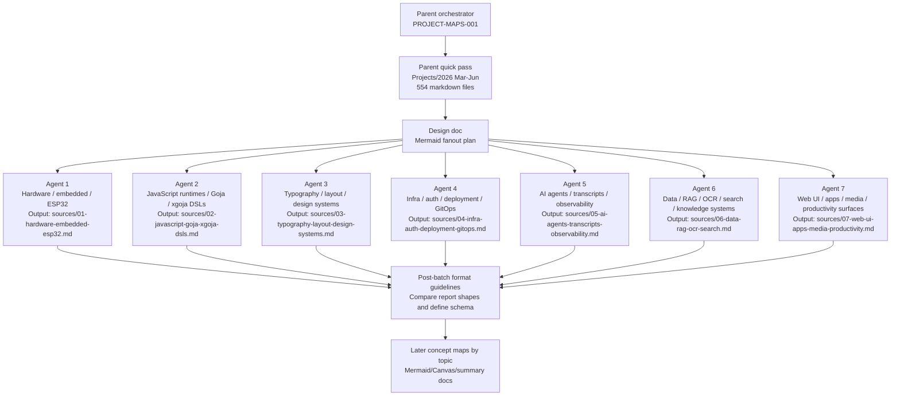

# Initial Scan and Subagent Fanout Plan

## Parent quick pass

Scope: all Markdown files under `Projects/2026/{03,04,05,06}/`, treated as the recent-project corpus.

Quick inventory from filenames/frontmatter:

- Total files: **554**
- By month: **March 64**, **April 180**, **May 201**, **June 109**
- Dominant document types: article/playbook/deep-dive notes, project reports, project notes, and a few reviews/research notes.
- High-signal tags and title clusters: `go`, `goja`, `xgoja`, `javascript`, `react`, `sqlite`, `glazed`, `firmware`, `esp32`, `embedded`, `design-system`, `typography`, `k3s`, `argocd`, `vault`, `keycloak`, `go-minitrace`, `sessionstream`, `rag`, `ocr`, `remarkable`, `loupedeck`, `pi`, `protobuf`, `dsl`.

Initial topic hypothesis: the corpus is not organized around isolated projects, but around recurring platforms and research threads. The first fanout should therefore ask agents to map **topic constellations**: what projects belong together, what concepts recur, what artifacts/reports exist, and which edges should appear in later concept maps.

## First-batch subagent fanout

## Agent task slices

### Agent 1: Hardware / embedded / ESP32

Inspect projects and reports about ESP32, ESP-IDF, M5Stack, AtomS3R, PaperS3, PicoCalc, Loupedeck, reMarkable, thermal printers, BLE/WiFi provisioning, display pipelines, firmware flashing, and physical-device debugging.

### Agent 2: JavaScript runtimes / Goja / xgoja DSLs

Inspect go-go-goja, goja, xgoja, jsverbs, Geppetto bindings, Go-backed JavaScript APIs, generated modules, durable objects, runtime plans, auth hosts, TypeScript support, and DSL patterns.

### Agent 3: Typography / layout / design systems

Inspect Pretext, typography, print layout, Canvas text measurement, DMETA, TTC design systems, CSS visual diff, Storybook/widget systems, layout constraints, visual parity, and generated UI/design artifacts.

### Agent 4: Infra / auth / deployment / GitOps

Inspect K3s, Argo CD, Terraform, Vault, Keycloak/OIDC, Coolify, GitHub App/OIDC tokens, DNS/TLS, backup, deployment outages, release trains, package publishing, and hosted environments.

### Agent 5: AI agents / transcripts / observability

Inspect Pi extensions/core, go-minitrace, transcript analysis, sessionstream, Pinocchio/Geppetto agent flows, LLM proxy/provider work, tool-calling behavior, dashboards, observability, compaction/search extensions, and agent readability.

### Agent 6: Data / RAG / OCR / search / knowledge systems

Inspect RAG evaluation, OCR/book workflows, SQLite/Bleve/FAISS, codebase browser/indexing, Readwise, document co-read, corpus pipelines, search/reranking, data export/import, and knowledge-base workflows.

### Agent 7: Web UI / apps / media / productivity surfaces

Inspect React/browser apps, chat overlays, admin DSLs, Wails/md-view, screencast/audio/video/podcast pipelines, browser automation extensions, web chat, static sites, productivity tools, and end-user app shells not fully covered by other slices.

## First-batch reporting intent

The first batch is intentionally semi-structured: each report should be useful on its own, but the parent will compare the seven outputs afterward and derive stronger reporting guidelines for the next pass. Minimum expected evidence:

- The projects/reports found, with file paths.
- Topic clusters and subclusters.
- Repeated concepts, technologies, methods, and failure modes.
- Candidate concept-map nodes and edges.
- Open questions and overlaps with other agents' slices.
