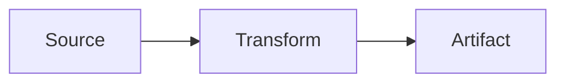
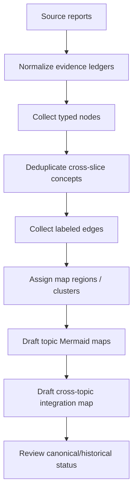

# First Batch Source Report Guidelines

## Goal

This document turns the first seven source reports into a reusable reporting format for the next PROJECT-MAPS-001 research passes. The first batch succeeded at broad topic discovery, but the reports varied in headings, confidence labels, citation style, and how they separated evidence from synthesis. The next batch should keep the useful parts and tighten the shape.

## What the first batch taught us

The most useful first-batch reports all did the same core things:

1. **Grouped project paths by topic arc**, not as one flat bibliography.
2. **Named a small number of canonical starting files** for each topic.
3. **Extracted architectural invariants**, not only project summaries.
4. **Promoted failure modes to first-class findings** because they explain why later projects changed direction.
5. **Produced candidate concept-map nodes and edges** in reusable language.
6. **Called out overlaps** with other topic slices so cross-map bridges are explicit.

The main inconsistencies to fix:

- Some reports used `Key Code` even when they were reading prose project reports; use `Representative evidence` instead.
- Read-depth was not consistently marked. Future reports must distinguish `read`, `heading-scanned`, `title-only`, and `grep-only` evidence.
- Line ranges were useful but uneven. Future reports should cite line ranges for canonical reads and not imply line-level confidence for title-only inventory.
- Source reports mixed project names, technologies, architecture concepts, and failure modes in node lists. Future reports should type nodes.
- One report included an acceptance JSON block; useful for a worker handoff, but not needed in the human-readable source reports unless explicitly requested.

## Required report contract for future source files

Every source report in `sources/` should use the following sections in this order.

### 1. Executive summary

A short 5-8 bullet summary answering:

- What topic slice was investigated?
- What are the 3-5 strongest project arcs?
- What is the likely concept-map spine?
- Which files should a later reader open first?

### 2. Scope and search method

Include:

- Exact corpus path(s), usually `Projects/2026/{03,04,05,06}/`.
- Search terms or title filters used.
- Count of files/hits if measured.
- Selection rule: why some files were deeply read and others were only inventoried.

Example:

```text
Scope: Markdown files under Projects/2026/{03,04,05,06}/.
Search: filename + grep for `esp32|firmware|lvgl|thermal|ble|wifi|m5stack`.
Selection: deeply read canonical architecture reports and title-scanned adjacent reports.
```

### 3. Evidence ledger

Use a compact table. This fixes the first batch's inconsistent confidence levels.

| Path | Evidence level | Lines / basis | Cluster | Why it matters |
|---|---|---|---|---|
| `Projects/.../ARTICLE - Example.md` | read | lines 1-120 | Runtime kernel | Canonical architecture summary |
| `Projects/.../PROJ - Adjacent.md` | title-only | filename/frontmatter | Adjacent UI | Possible follow-up |

Evidence levels:

- `read`: file content read in meaningful detail.
- `heading-scanned`: headings/summary/frontmatter inspected but not full file.
- `grep-only`: relevant keyword hits found; content not otherwise inspected.
- `title-only`: inferred from filename/frontmatter only.
- `external-reference`: path or repo mentioned by a report but outside `Projects/2026`.

### 4. Projects and reports found

Group by project arc or subsystem. Mark status when knowable:

- `current`: later reports indicate this is the active architecture.
- `historical`: important origin but superseded.
- `migrated`: moved into a later platform/system.
- `experimental`: prototype/research branch.
- `unknown`: status not clear from this pass.

This was especially important in the infra report, where Coolify-era and K3s-era documents coexist.

### 5. Representative evidence

Use this instead of `Key Code` for source-report research.

For each canonical file, include 1-3 short evidence bullets:

- The architectural claim.
- The file path and line range or basis.
- Why this claim should influence a concept map.

Do not paste long snippets unless the snippet is itself the best reusable artifact, such as a Mermaid pipeline.

### 6. Topic architecture / spine

Write the 1-2 most important system flows as prose plus optional Mermaid.

Examples from the first batch:

- Hardware: `Browser/CLI -> transport -> firmware/driver -> HAL -> physical device -> observable feedback`.
- Goja/xgoja: `Go host resources -> Go-backed module providers -> runtime profile/plan -> JS/TS composition -> command/HTTP/agent surface`.
- RAG/data: `Source -> Document -> Chunk -> Embedding -> Search -> Evaluation` with SQLite as canonical store.
- Agents/observability: `native transcript -> canonical archive -> normalized DB -> query repository -> self-contained report`.

### 7. Clusters and subclusters

Use 4-8 clusters. For each cluster:

- Name the cluster.
- List 2-6 subclusters or examples.
- Mention the architectural invariant or research question.

Avoid creating a separate cluster for every project; clusters should become map regions.

### 8. Recurring concepts, technologies, and failure modes

Separate the three lists:

- **Concepts**: reusable abstractions such as `renderer-as-interpreter`, `short-lived credentials`, `derived search index`, `dirty rectangles`.
- **Technologies**: concrete tools/libraries/platforms such as `ESP-IDF`, `xgoja`, `SQLite`, `Vault`, `Pretext`, `Bleve`.
- **Failure modes**: bugs/constraints that caused design learning, such as `schema drift`, `serial underfeed`, `measurement/CSS height divergence`, `provider replay bug`.

Failure modes should be treated as concept-map nodes, not footnotes.

### 9. Candidate concept-map material

Use typed nodes and labeled edges.

#### Node table

| Node | Type | Confidence | Notes |
|---|---|---|---|
| `SQLite canonical store` | concept | high | Repeats across RAG, OCR, Readwise, codebase browser |
| `RAG Evaluation System` | project | high | Central data/search arc |
| `FAISS build fragility` | failure-mode | medium | Native vector build dependency |

Suggested node types:

- `project`
- `concept`
- `technology`
- `platform`
- `workflow`
- `artifact`
- `failure-mode`
- `open-question`

#### Edge list

Use this shape:

```text
Source node --edge label--> Target node [confidence] (evidence path)
```

Examples:

```text
SQLite canonical store --rebuilds into--> Derived search index [high] (sources/06)
Keycloak Identity Platform --issues OIDC tokens for--> Vault human access [high] (sources/04)
Browser canvas rasterization --offloads work from--> ESP32 firmware [high] (sources/01)
```

### 10. Overlaps with other topic slices

Name cross-links explicitly. This prevents later maps from becoming isolated islands.

Use bullets like:

```text
- JavaScript runtimes: goja-bleve and xgoja generated vector hosts belong to both Data/RAG and Goja/xgoja.
- Web UI/apps: RAG corpus explorer and Readwise Viewer are data systems with product surfaces.
```

### 11. Open questions and second-pass targets

Include questions that matter for map correctness, not generic curiosity.

Good examples from the first batch:

- Which architecture is canonical/current versus historical?
- Should this arc be a top-level map or a satellite of a broader map?
- Which reports were only inventoried and need deeper reading?
- Which adjacent topic slice owns an overlapping concept?

### 12. Start here

List 1-3 canonical reading paths in priority order. The first batch showed this is one of the most useful sections for later synthesis.

### 13. Report-format notes

A short final section with any improvements to the reporting format discovered while writing the report. This section may disappear after the format stabilizes.

## Recommended source-report template

```markdown
# <Topic Slice> Source Report

## Executive summary
- ...

## Scope and search method
- Corpus: ...
- Search terms: ...
- Selection rule: ...

## Evidence ledger
| Path | Evidence level | Lines / basis | Cluster | Why it matters |
|---|---|---|---|---|

## Projects and reports found
### <Arc / subsystem>
- `<path>` — status: current/historical/experimental/unknown; note.

## Representative evidence
### <Canonical file or claim>
- Claim: ...
- Evidence: `<path>` lines X-Y.
- Map implication: ...

## Topic architecture / spine



## Clusters and subclusters
### Cluster A: ...
- Subclusters: ...
- Invariant: ...

## Recurring concepts, technologies, and failure modes
### Concepts
- ...
### Technologies
- ...
### Failure modes
- ...

## Candidate concept-map material
### Nodes
| Node | Type | Confidence | Notes |
|---|---|---|---|
### Edges
- `A --label--> B [confidence] (evidence)`

## Overlaps with other topic slices
- ...

## Open questions and second-pass targets
- ...

## Start here
1. `<path>` — why.

## Report-format notes
- ...
```

## Concept-map synthesis workflow after source reports



## First-batch source report assessment

| Report | Strongest contribution | Format lesson |
|---|---|---|
| `01-hardware-embedded-esp32.md` | Clear platform grouping and excellent device/transport/failure-mode edges. | Hardware maps need separate hardware, transport, data-format, and failure-mode nodes. |
| `02-javascript-goja-xgoja-dsls.md` | Strong temporal architecture from runtime kernel to xgoja/DSL/auth hosts. | Separate core runtime concepts from application examples. |
| `03-typography-layout-design-systems.md` | Best evidence around measurement/layout invariants and visual parity loops. | Separate central from incidental hits; preserve repo paths when frontmatter gives them. |
| `04-infra-auth-deployment-gitops.md` | Strong ownership/control-plane framing and current-vs-historical concern. | Infra reports need status labels and ownership edges. |
| `05-ai-agents-transcripts-observability.md` | Clear split between live streaming observability and retrospective transcript analysis. | Broad slices need two or more architecture spines when the domain genuinely has them. |
| `06-data-rag-ocr-search.md` | Strong invariant synthesis around SQLite canonical state and derived indexes. | Mark deeply read vs inventory-only files explicitly. |
| `07-web-ui-apps-media-productivity.md` | Good reusable UI/app-shell concepts rather than just product names. | Use architectural concept nodes such as renderer-as-interpreter and headless provider. |

## Immediate next steps

1. Normalize first-batch reports mentally using this contract; do not rewrite them yet unless a later map needs exact machine-readable tables.
2. Draft first-pass topic maps from the seven existing source reports.
3. If launching a second batch, give agents this guidelines document and require the template sections above.
4. Add a cross-topic bridge map for recurring concepts that appear in many slices: `SQLite canonical store`, `Go-backed JavaScript DSL`, `single-binary Go+SPA`, `observable workflow`, `failure-mode-driven design`, `agent-readable artifacts`, and `hosted auth/GitOps substrate`.
