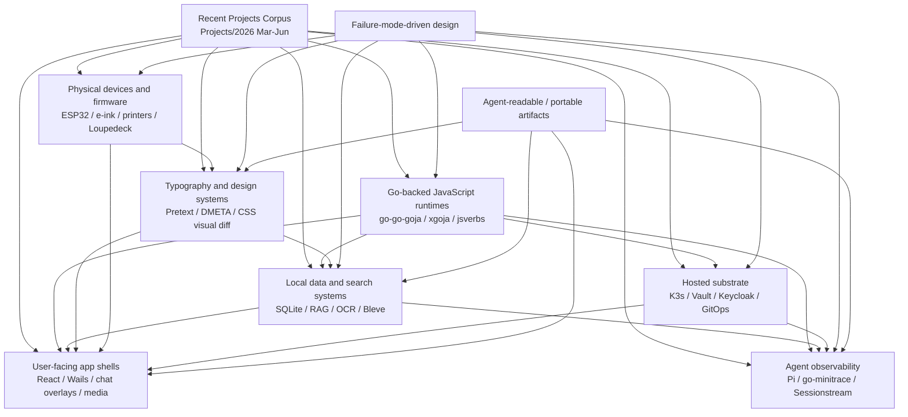
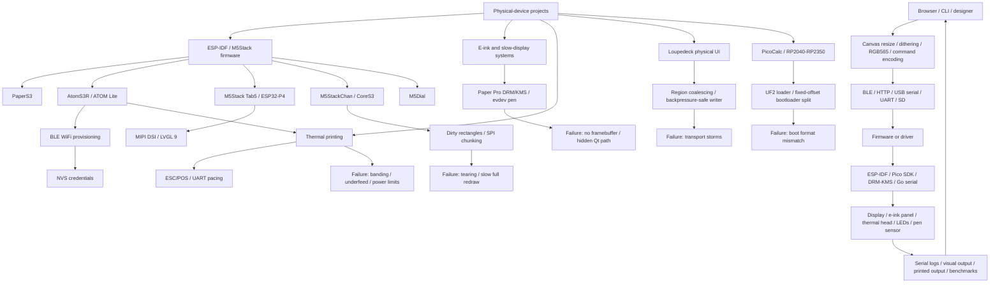
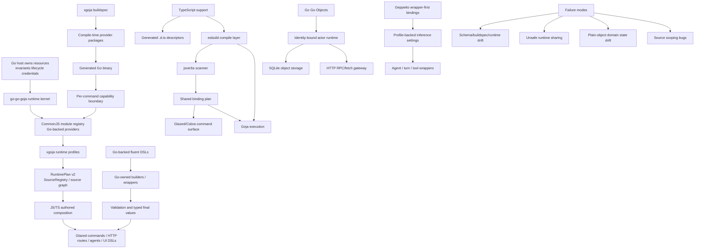
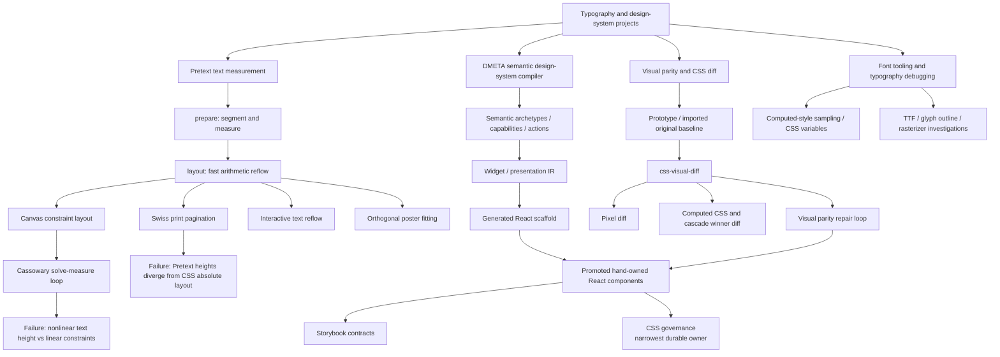
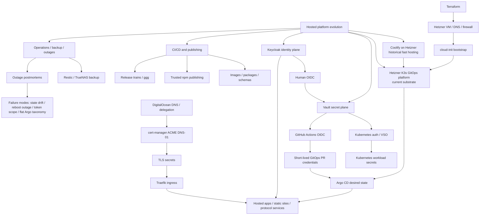
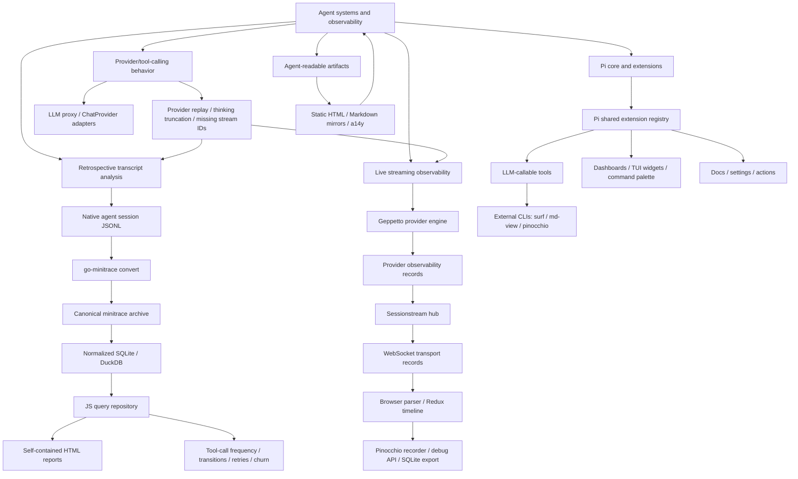
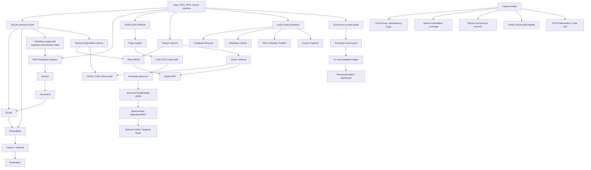

# First Pass Topic Concept Maps

## Scope

These are first-pass Mermaid maps synthesized from the seven source reports in `sources/`. They are intentionally conceptual rather than exhaustive. The goal is to expose recurring topic spines, not to list every project file.

Source reports:

- `sources/01-hardware-embedded-esp32.md`
- `sources/02-javascript-goja-xgoja-dsls.md`
- `sources/03-typography-layout-design-systems.md`
- `sources/04-infra-auth-deployment-gitops.md`
- `sources/05-ai-agents-transcripts-observability.md`
- `sources/06-data-rag-ocr-search.md`
- `sources/07-web-ui-apps-media-productivity.md`

## Cross-topic integration map

## Hardware / embedded / ESP32 map

## JavaScript / Goja / xgoja / DSL map

## Typography / layout / design systems map

## Infra / auth / deployment / GitOps map

## AI agents / transcripts / observability map

## Data / RAG / OCR / search map

## Web UI / apps / media / productivity map

```mermaid
flowchart TD
    Apps[Web UI, apps, media, productivity] --> Local[Local-first app shells]
    Apps --> UIIR[Backend-driven UI / Widget IR]
    Apps --> Chat[Chat overlays and web chat]
    Apps --> Media[Media creation pipelines]
    Apps --> Browser[Browser automation and overlays]

    Local --> Single[Single-binary Go + SPA]
    Local --> Wasm[Go/Wasm browser tools]
    Local --> Daemon[CLI daemon + browser UI]
    Local --> Wails[Wails desktop shell]
    Local --> Knowledge[Static/vault browser]
    Knowledge --> AgentMirror[Agent-readable mirrors]

    UIIR --> Page[Page/node/action DSL]
    Page --> Renderer[Renderer as interpreter]
    Renderer --> Storybook[Storybook contract surface]
    UIIR --> Widget[Widget IR]
    Widget --> HostAPI[Narrow host APIs / opaque action IDs]

    Chat --> ChatProvider[Headless ChatProvider]
    ChatProvider --> Timeline[Sessionstream/WebSocket timeline]
    Timeline --> Stable[Stable entity IDs / ordinals]
    ChatProvider --> Tools[Frontend tool registry]
    Tools --> Approval[Human approval cards]

    Media --> Plan[Declarative media plan]
    Plan --> FFmpeg[ffmpeg subprocess supervisor]
    Media --> Audio[AI audio pipeline\nMiniMax / Demucs / WhisperX]
    Media --> Remotion[Remotion video compositions]

    Browser --> Lens[DOM overlay lens]
    Lens --> Geometry[getBoundingClientRect / computed styles]
    Geometry --> Extraction[Component extraction / visual diff / typography measurement]

    FM[Failure modes] --> SPA[SPA shell poor for agents/search]
    FM --> Reload[One-shot DOM augmentation breaks on live reload]
    FM --> Schema[Widget/schema growth outruns renderer fixtures]
    FM --> Event[Absent-vs-empty and entity-id projection bugs]
    FM --> Extension[Extension cross-context messaging complexity]
```

## Reusable bridge concepts

These nodes should probably appear in the final cross-topic map because they recur in multiple slices:

- **SQLite canonical store**: data/RAG/OCR, go-minitrace, durable objects, Readwise, codebase browser.
- **Go-backed JavaScript DSL**: goja/xgoja, CSS visual diff, UI DSLs, RAG scripting, Loupedeck/device APIs.
- **Single-binary Go + SPA**: data browsers, documentation sites, app shells, dashboards.
- **Derived artifact / rebuildable index**: search indexes, generated UI scaffolds, static sites, firmware assets, printed layouts.
- **Provider/profile boundary**: Geppetto, xgoja, Pi providers, embedding providers, hosted auth.
- **Failure mode as design driver**: every slice uses concrete failures to discover architecture boundaries.
- **Agent-readable artifact**: self-contained transcript reports, SSR/Markdown mirrors, project reports, source maps, Storybook/visual diffs.
- **Human-in-the-loop repair loop**: OCR review, visual parity repair, hardware visual debugging, deployment postmortems, provider replay debugging.

## Refinement notes

- These maps should be treated as draft topology. Node names and edge labels should be normalized once the evidence ledgers are formalized.
- Several high-overlap topics need bridge maps of their own: `go-go-goja + agents`, `RAG + UI`, `design systems + web apps`, `hardware + browser coprocessor`, and `infra + hosted runtime auth`.
- Later maps should mark current/historical status more clearly, especially for Coolify vs K3s and early xgoja RuntimePlan formats.
