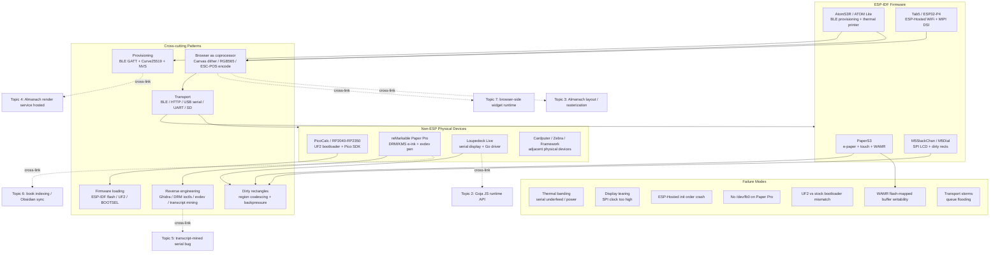
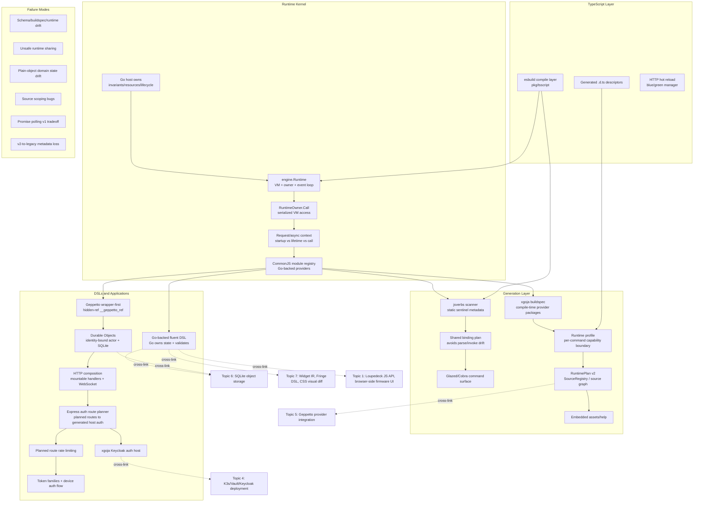
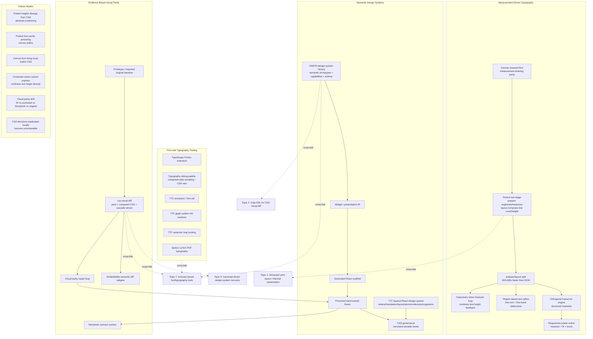
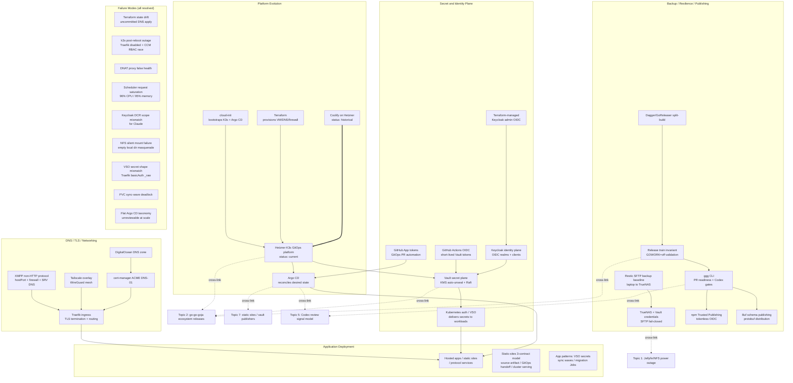
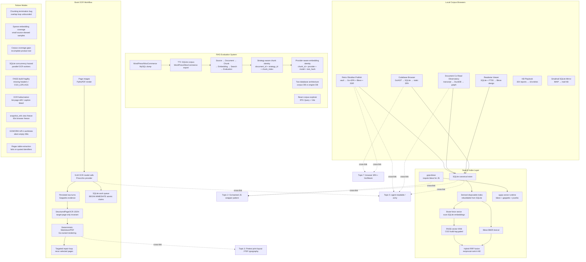
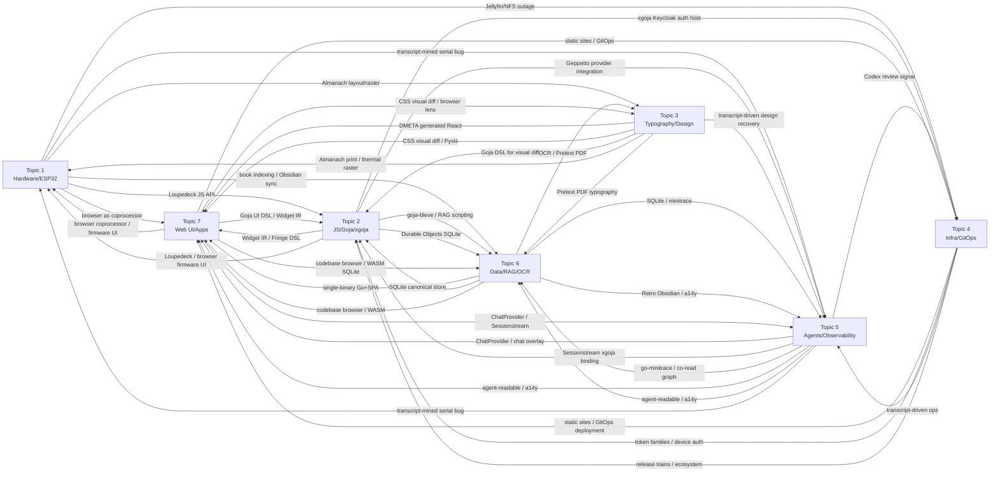

# Refined Topic Concept Maps v2

## Sources

These maps merge 14 second-batch partition summaries (2 per topic × 7 topics) with evidence-backed typed nodes, labeled edges, and explicit cross-topic bridges. Each partition is in `sources/NNx-*.md`.

| Topic | Partition A | Partition B |
|---|---|---|
| 1 Hardware/embedded/ESP32 | `01a-hardware-esp32-firmware-devices.md` | `01b-hardware-remarkable-loupedeck-pico.md` |
| 2 JavaScript/Goja/xgoja/DSLs | `02a-js-runtime-xgoja-typescript.md` | `02b-js-dsls-geppetto-durable-auth.md` |
| 3 Typography/layout/design | `03a-typography-pretext-canvas.md` | `03b-typography-dmeta-visualdiff-fonts.md` |
| 4 Infra/auth/GitOps | `04a-infra-hosting-secrets-deployment.md` | `04b-infra-dns-tls-backup-publishing.md` |
| 5 AI agents/observability | `05a-agents-transcripts-sessionstream.md` | `05b-agents-pi-providers-dashboards.md` |
| 6 Data/RAG/OCR/search | `06a-data-rag-vectors-ocr.md` | `06b-data-browsers-readwise-knowledge.md` |
| 7 Web UI/apps/media | `07a-webui-localshells-backendui.md` | `07b-webui-chat-media-browserext.md` |

---

## Cross-Topic Integration Map

```mermaid
flowchart TD
    subgraph Runtimes["Topic 2: JS Runtimes"]
        GoHost[Go host owns invariants\nresources lifecycle credentials]
        Kernel[go-go-goja runtime kernel]
        XgojaPlan[xgoja RuntimePlan v2\nSourceRegistry]
        GojaDSL[Go-backed fluent DSL]
        Durable[Durable Objects actor runtime]
    end

    subgraph Data["Topic 6: Data/RAG/Search"]
        SQLite[SQLite canonical store]
        RAG[RAG Evaluation System]
        OCR[Book OCR workflow]
        Bleve[Derived search index\nBleve/FAISS]
        Browser[Local corpus browsers]
    end

    subgraph Devices["Topic 1: Hardware/Embedded"]
        ESPIDF[ESP-IDF firmware]
        BrowserCoproc[Browser as coprocessor]
        Display[Display pipeline\ndirty rects / region coalescing]
        Thermal[Thermal printing\nESC/POS dithering]
        Ink[E-ink / DRM/KMS / pen]
    end

    subgraph Design["Topic 3: Typography/Design"]
        Pretext[Pretext measurement\nprepare/layout split]
        DMETA[DMETA design-system compiler]
        VisualDiff[CSS visual diff\nvisual parity loop]
        Storybook[Storybook contract surface]
    end

    subgraph Infra["Topic 4: Infra/GitOps"]
        K3s[Hetzner K3s GitOps platform]
        Vault[Vault secret plane]
        Keycloak[Keycloak identity plane]
        GitOps[Argo CD desired state]
        ReleaseTrains[Release trains / ggg]
    end

    subgraph Agents["Topic 5: Agents/Observability"]
        Minitrace[go-minitrace\ntranscript analysis]
        Sessionstream[Sessionstream hub\nlive observability]
        PiExt[Pi extensions registry]
        LLMProxy[LLM proxy / ChatProvider]
        A14y[Agent-readable artifacts]
    end

    subgraph WebUI["Topic 7: Web UI/Apps"]
        AppShell[Single-binary Go+SPA\napp shell]
        BackendUI[Backend-driven UI\nrenderer-as-interpreter]
        ChatOverlay[Chat overlay\nheadless ChatProvider]
        MediaPlan[Media plan compiler\nffmpeg/GStreamer]
        BrowserLens[Browser overlay lens\nDOM geometry capture]
    end

    %% Cross-topic bridges
    GoHost --> Kernel --> XgojaPlan --> GojaDSL
    GojaDSL --> BackendUI
    GojaDSL --> RAG
    GojaDSL --> ChatOverlay
    Durable --> SQLite
    XgojaPlan --> Minitrace

    SQLite --> RAG
    SQLite --> OCR
    SQLite --> Browser
    SQLite --> Durable
    RAG --> Bleve
    OCR --> AppShell

    BrowserCoproc --> Thermal
    BrowserCoproc --> Display
    BrowserCoproc --> AppShell
    Display --> Design
    Thermal --> MediaPlan

    Pretext --> Design
    DMETA --> BackendUI
    DMETA --> Storybook
    VisualDiff --> BrowserLens
    VisualDiff --> Storybook

    K3s --> GitOps
    Vault --> Keycloak
    Keycloak --> ChatOverlay
    Vault --> ReleaseTrains
    GitOps --> AppShell
    GitOps --> Browser

    Minitrace --> A14y
    Sessionstream --> ChatOverlay
    Sessionstream --> LLMProxy
    PiExt --> A14y
    LLMProxy --> ChatOverlay
    A14y --> AppShell

    ChatOverlay --> Sessionstream
    BackendUI --> AppShell
    BrowserLens --> VisualDiff
    MediaPlan --> AppShell

    %% Failure-mode hub
    FM[Failure-mode-driven design] -.-> Runtimes
    FM -.-> Data
    FM -.-> Devices
    FM -.-> Design
    FM -.-> Infra
    FM -.-> Agents
    FM -.-> WebUI
```



### Reusable bridge concepts (appear in 3+ topics)

| Bridge concept | Topics | Evidence |
|---|---|---|
| **SQLite canonical store** | 2, 5, 6, 7 | Durable object storage, minitrace normalized DB, RAG corpus, codebase browser, Readwise |
| **Go-backed JavaScript DSL** | 2, 5, 6, 7 | goja-bleve, Geppetto wrappers, Widget IR, Loupedeck, CSS visual diff |
| **Single-binary Go + SPA** | 5, 6, 7, 4 | Go-Go Parc, Retro Obsidian, minitrace UI, docsctl, dashboard |
| **Derived rebuildable artifact** | 2, 3, 6, 7 | Search indexes, generated React scaffolds, static sites, firmware assets, print layouts |
| **Provider/profile boundary** | 2, 4, 5, 6 | Geppetto profiles, xgoja auth host, Pi providers, embedding providers |
| **Failure mode as design driver** | all | Every topic uses concrete failures to discover architecture boundaries |
| **Agent-readable artifact** | 5, 6, 7, 3 | Self-contained transcript reports, SSR/Markdown mirrors, Storybook, a14y |
| **Human-in-the-loop repair loop** | 1, 3, 4, 6 | OCR review, visual parity repair, hardware visual debugging, deployment postmortems |
| **Browser as coprocessor** | 1, 7, 3 | SToMS3R, Tab5, Almanach, Face Animation Studio, browser-side widget runtime |

---

## Topic 1: Hardware / Embedded / ESP32

**Merged from**: `01a` (ESP32 firmware: PaperS3, AtomS3R, Tab5, M5StackChan) + `01b` (PicoCalc, reMarkable, Loupedeck, other devices)



**Key architectural invariants**:
- Move expensive/iteration-heavy work out of firmware into browser/host; keep firmware as thin measurable bridge to physical I/O.
- Measurement-drawing parity (same font/shaping/coordinate system) applies to both Canvas typography (T3) and e-ink/thermal output (T1).
- Dirty rectangles + region coalescing + backpressure-safe writer is the universal display-pipeline pattern across ESP32, Loupedeck, and Paper Pro.
- BLE provisioning uses Security 1 / Curve25519 / 6-digit PoP; SoftAP as fallback for non-BLE devices.

---

## Topic 2: JavaScript / Goja / xgoja / DSLs

**Merged from**: `02a` (runtime kernel, jsverbs, xgoja, TypeScript) + `02b` (DSLs, Geppetto, Durable Objects, auth hosts)



**Key architectural invariants**:
- JavaScript owns composition; Go owns domain state, validation, resources, lifecycle, and final typed values.
- Compile-time Go module composition (xgoja) is safer than dynamic Go plugins.
- Runtime profile selection is a capability boundary, not just convenience.
- Wrapper-first APIs are mandatory when credentials, provider config, sessions, or typed domain state matter.
- Hard-cutover discipline: delete legacy paths once typed substrate exists; do not wrap.

---

## Topic 3: Typography / Layout / Design Systems

**Merged from**: `03a` (Pretext, print layout, canvas measurement) + `03b` (DMETA, CSS visual diff, font tooling)



**Key architectural invariants**:
- Measurement-drawing parity is the only foundation: `ctx.measureText` and `ctx.fillText` must use the same font/shaping/coordinate system.
- Two-stage layout: slow `prepare()` once, fast `layout()` many times. Pretext is for page-break decisions, not absolute CSS positioning.
- Structural invariants over computed targets: orthogonality by derived axes, not recalculated angles.
- Generated scaffolds become promoted hand-owned React with provenance; CSS governance assigns each decision to its narrowest durable owner.
- Visual parity requires explicit roles: imported original, DMETA IR, generated artifacts, promoted React, Storybook fixtures.

---

## Topic 4: Infra / Auth / Deployment / GitOps

**Merged from**: `04a` (hosting evolution, secret/identity, app deployment) + `04b` (DNS/TLS, backup, release trains)



**Key architectural invariants**:
- Explicit ownership boundaries: each system owns one layer and does not perform the next layer's job.
- Contracts over scripts: source artifact contract, GitOps handoff contract, cluster serving contract.
- Short-lived credentials everywhere: OIDC tokens, Vault-issued tokens, GitHub App installation tokens, npm Trusted Publishing.
- Day-two operations matter: documentation, taxonomy, app cleanup, backups, monitoring, validation.
- Terraform owns durable infrastructure/DNS; cert-manager owns ephemeral ACME challenge DNS; Argo CD owns Kubernetes desired state.

---

## Topic 5: AI Agents / Transcripts / Observability

**Merged from**: `05a` (go-minitrace, sessionstream, Geppetto) + `05b` (Pi extensions, LLM proxy, dashboards, a14y)

```mermaid
flowchart TD
    subgraph Retrospective["Retrospective Transcript Analysis"]
        NativeJSONL[Native agent session JSONL]
        Convert[go-minitrace convert]
        Archive[Canonical minitrace archive\n.minitrace.json v0.2.0]
        NormDB[Normalized transcript SQLite\nmt.db() 9-10 tables]
        QueryRepo[JS query repository\nscanner-first __verb__ commands]
        HTMLReport[Self-contained HTML report\ninlined JSON + CDN libs]
        ChurnAnalysis[Tool-call churn analysis\nfrequency / transitions / retry loops]
        Authorizer[SQLite authorizer\ncompile-time table allowlist]
    end

    subgraph Live["Live Streaming Observability"]
        ProviderStream[LLM provider stream]
        GeppettoEngine[Geppetto provider engine\nnormalizes provider events]
        ChatPlugin[Chat plugin\npublishes typed events]
        Hub[Sessionstream hub\nprojections + fanout]
        WSTransport[WebSocket transport\nprotobuf frames]
        BrowserReducer[Browser parser\nRedux timeline]
        PinocchioRec[Pinocchio recorder\ndebug API + SQLite reconcile export]
        Correlation[Provider-to-browser traceability\nevents.Correlation identity]
    end

    subgraph PiSurface["Pi Core and Extensions"]
        PiExt[Pi extension\n.ts + jiti + ExtensionAPI]
        Registry[Pi shared registry\nregisterPiExtension + Symbol.for]
        ToolDeleg[Thin-boundary tool delegation\npi.exec to external CLIs]
        PiLauncher[pi-launcher\nYAML profile compiler]
        ScopedModels[Pi scoped models\nenabledModels cycle]
        Compaction[Compaction extension\nrewriting middle session context]
        SessionSearch[Session search extension\ntool call history + fork points]
        ResponseViewer[Response viewer extension]
    end

    subgraph Providers["Provider / Tool-Calling"]
        LLMProxy[LLM proxy\nOpenAI-compatible over Geppetto profiles]
        ChatProvider[ChatProvider headless runtime\ninstance-scoped registries]
        ProviderCompat[Provider compatibility contract\ncompat object consumed at request builder]
        ProviderReplay[Provider replay bug\nduplicate Responses item IDs]
        ThinkingContent[Thinking-content dampening\nsystem prompt + tools reduce reasoning]
        FrontendTool[Frontend tool round trip\nChatFrontendToolCallRequested → browser → result → resume]
    end

    subgraph Dashboards["Dashboards / Readability"]
        StreamingDash[Streaming agent dashboard\nobserver → mapper → projector → entity-wrapper UI event]
        SharedProjector[Shared projector\none event → timeline entity + UI event parity]
        MinitraceUI[go-minitrace web UI\nsession browser / transcript reader / SQL workbench]
        A14y[Agent-readable site\nserver routing contract before SPA fallback]
        MarkdownMirror[Markdown mirror\n.md suffix + Accept: text/markdown]
        SSRSidecar[SSR sidecar\nNode Express renderToString + RTK Query preload]
    end

    NativeJSONL --> Convert --> Archive --> NormDB --> QueryRepo --> HTMLReport
    QueryRepo --> ChurnAnalysis
    NormDB --> Authorizer

    ProviderStream --> GeppettoEngine --> ChatPlugin --> Hub --> WSTransport --> BrowserReducer
    GeppettoEngine --> PinocchioRec
    Hub --> PinocchioRec
    BrowserReducer --> PinocchioRec
    Correlation -.connects.-> GeppettoEngine
    Correlation -.connects.-> BrowserReducer

    PiExt --> Registry --> ToolDeleg
    Registry --> PiLauncher
    Registry --> StreamingDash
    Registry --> Compaction
    Registry --> SessionSearch
    Registry --> ResponseViewer

    LLMProxy --> ChatProvider
    ChatProvider --> Hub
    ProviderCompat --> LLMProxy

    StreamingDash --> SharedProjector
    A14y --> MarkdownMirror
    A14y --> SSRSidecar

    NormDB -.cross-link.-> Topic6[Topic 6: document co-read graph / DuckDB]
    Hub -.cross-link.-> Topic7[Topic 7: ChatProvider / chat overlay / web chat]
    Hub -.cross-link.-> Topic2[Topic 2: goja-sessionstream xgoja binding]
    LLMProxy -.cross-link.-> Topic2[Topic 2: Geppetto wrapper-first JS API]
    A14y -.cross-link.-> Topic7[Topic 7: single-binary Go+SPA / docsctl]
    A14y -.cross-link.-> Topic6[Topic 6: Retro Obsidian Publish / knowledge base]
    ChurnAnalysis -.cross-link.-> Topic1[Topic 1: transcript-mined Loupedeck serial bug]
    Registry -.cross-link.-> Topic2[Topic 2: Pi extensions TypeScript surfaces]
```

**Key architectural invariants**:
- Reusable packages emit neutral records; the application owns storage, debug APIs, and exports.
- Provider-to-browser traceability is the core invariant: provider delta → Geppetto record → UI event → frontend frame → timeline entity.
- Retrospective analysis has converged on normalized SQLite (not DuckDB UNNEST) as the canonical substrate.
- Pi extensions delegate to external CLIs rather than reimplementing capabilities; the boundary is thin by design.
- Agent readability is an HTTP routing commitment before the SPA fallback, not a frontend enhancement.

---

## Topic 6: Data / RAG / OCR / Search

**Merged from**: `06a` (RAG evaluation, Bleve/FAISS, book OCR) + `06b` (codebase browser, Readwise, co-read graph, knowledge base)



**Key architectural invariants**:
- SQLite is the canonical store; all search indexes and workflow artifacts are derived/rebuildable.
- Strategy-aware chunk identity and provider-aware embedding identity enable multi-strategy comparison and rerun-safety.
- Two-database architecture separates corpus reads from workflow orchestration to prevent WAL contention.
- Evidence-preserving model workflow: raw turns → structured JSON → deterministic rendering → targeted repair.
- Static browser artifacts run from `file://` with SQLite-as-browser-runtime (sql.js) or server-backed.

---

## Topic 7: Web UI / Apps / Media / Productivity

**Merged from**: `07a` (local app shells, backend-driven UI) + `07b` (chat overlays, media pipelines, browser extensions)

```mermaid
flowchart TD
    subgraph LocalShells["Local-First App Shells"]
        SingleBinary[Single-binary Go + SPA\ngo:embed pattern]
        GoWasm[Go/Wasm browser tool\nGOOS=js GOARCH=wasm]
        Wails[Wails desktop shell\nbound methods + events]
        mdview[md-view daemon\nstatus: migrated to Wails]
        GoGoParc[Go-Go Parc Website\nsingle-binary + git-sync]
        RetroObs[Retro Obsidian Publish\nvault browser + SSR + a14y]
        RenderBody[RenderBody fragment contract\nchrome-free HTML fragment]
        ReRunnable[Re-runnable DOM augmentation\nsurvives fragment swaps]
    end

    subgraph BackendUI["Backend-Driven UI Systems"]
        UIDSL[Backend-driven UI DSL\nUI as data transported from backend]
        WidgetIR[Widget IR\nJSON-compatible node tree]
        Renderer[Renderer-as-interpreter\nReact switches on node.kind]
        OpaqueAction[Opaque action ID\nbrowser dispatches, backend resolves]
        PageVersion[Page version scoping\nstale actions return effects]
        StorybookC[Storybook contract surface\nfixtures for every node/widget kind]
        ImportCap[Import-as-capability\nmodule registry rewrites specifiers]
        Fringe[Fringe Admin DSL\nrenderer + Goja + protobuf]
        WidgetRuntime[Browser-Side React Widget Runtime\nesbuild-wasm + blob URL]
        WidgetRenderer[WidgetRenderer Standalone\nGoja-authored React-rendered UI]
    end

    subgraph Chat["Chat Overlay and Web Chat"]
        ChatOverlay[Chatbot Overlay Framework\ntyped widget streaming + frontend tools]
        ChatProvider[Generic ChatProvider\nheadless provider runtime]
        CoinVaultChat[CoinVault Web Chat\nproduction adopter + debug export]
        ChatProtocol[Canonical Chat Event Protocol\nreducer-shaped provider adapters]
        FrontendTool[Frontend tool registry\nbrowser-advertised capabilities]
        HumanApproval[Human-in-the-loop tool mode\napproval as tool mode]
        SnapshotHydrate[Snapshot-before-live hydration\nbuffer frames until snapshot applied]
        StableEntity[Stable entity id across patch/terminal]
    end

    subgraph Media["Media Creation Pipelines"]
        Screencast[Screencast Studio\nDSL → plan → ffmpeg/GStreamer]
        Jingle[Jingle Extractor\nMiniMax + Demucs + WhisperX]
        RabbitHole[Rabbit Hole Podcast Intros\nRemotion video compositions]
        PlanCompiler[Compiled plan as central abstraction\nintent → config → plan → execution]
        SubprocessSup[Web server as runtime supervisor\nstaged shutdown ordering]
    end

    subgraph BrowserExt["Browser Automation and Extensions"]
        ChromeOverlay[Chrome DOM Overlay Extractor\nManifest V3 + html2canvas]
        HoverInspect[Hover Component Inspector\nshadow DOM overlay]
        TypoScope[TypoScope Firefox extension\ntypography measurement]
        TabTracker[Firefox Tab Tracker\nWebExtension + Native Messaging]
        SurfGo[surf-go Browser Verbs\nprobe → embed → dual-mode command]
        DOMScrape[DOM Scraping Experiment\njsdom + numbered scripts]
        BrowserLens[Browser overlay lens\nfixed-position viewport-coordinated]
        DOMGeometry[DOM geometry capture\ngetBoundingClientRect + computed CSS]
        LLMValidLoop[LLM-DOM validation loop\nLLM suggests selectors, DOM validates]
    end

    subgraph FailureModes["Failure Modes"]
        SPAWeak[SPA-only shells weak for agents/search]
        OneShotAug[One-shot DOM augmentation breaks on reload]
        SchemaGrowth[Schema/fixture growth outruns renderer]
        AbsentEmpty[Absent-vs-empty content overwrite\nprotobuf/JSON projection]
        EntityIDUnstable[Entity ID instability\npatch vs terminal events]
        SubprocessCancel[Subprocess cancellation/shutdown semantics]
        CoordTrap[getBoundingClientRect traps\nscrolling + fixed positioning]
        ExtBundling[Extension cross-context messaging complexity]
    end

    SingleBinary --> GoGoParc
    SingleBinary --> RetroObs
    GoWasm --> SingleBinary
    Wails --> mdview
    mdview --> Wails

    UIDSL --> WidgetIR --> Renderer
    Renderer --> StorybookC
    Renderer --> OpaqueAction --> PageVersion
    Fringe --> UIDSL
    WidgetRuntime --> ImportCap
    WidgetRenderer --> WidgetIR

    ChatOverlay --> ChatProvider
    ChatProvider --> CoinVaultChat
    ChatProvider --> ChatProtocol
    ChatProvider --> FrontendTool --> HumanApproval
    ChatProtocol --> SnapshotHydrate
    ChatProtocol --> StableEntity

    Screencast --> PlanCompiler
    Jingle --> PlanCompiler
    RabbitHole --> PlanCompiler
    PlanCompiler --> SubprocessSup

    ChromeOverlay --> BrowserLens --> DOMGeometry
    DOMGeometry --> LLMValidLoop
    TypoScope --> BrowserLens

    SingleBinary -.cross-link.-> Topic5[Topic 5: agent-readable mirrors / a14y / SSR sidecar]
    SingleBinary -.cross-link.-> Topic6[Topic 6: codebase browser / Readwise / Retro Obsidian]
    SingleBinary -.cross-link.-> Topic4[Topic 4: static sites deployment / GitOps]
    WidgetIR -.cross-link.-> Topic2[Topic 2: Goja UI DSL / Widget IR to xgoja]
    WidgetIR -.cross-link.-> Topic3[Topic 3: DMETA generated React / visual parity]
    ChatProvider -.cross-link.-> Topic5[Topic 5: Sessionstream hub / LLM proxy]
    ChatProvider -.cross-link.-> Topic2[Topic 2: Geppetto JS bindings]
    BrowserLens -.cross-link.-> Topic3[Topic 3: CSS visual diff / Pyxis baseline catalog]
    PlanCompiler -.cross-link.-> Topic1[Topic 1: firmware subprocess supervision]
    GoWasm -.cross-link.-> Topic6[Topic 6: sql.js / WASM SQLite in browser]
```



**Key architectural invariants**:
- Local-first: single binary serving API + static frontend; Go renderer/core reused across CLI, HTTP, and desktop shells.
- UI as data: page/node/action/widget IR transported from backend or Goja scripts; renderer is an interpreter, not arbitrary executable code.
- Chat mechanics separated from product rendering: headless ChatProvider owns WebSocket/timeline/tool registries; apps keep product UI and CSS.
- Media pipelines: declarative plan over raw commands; web server is runtime supervisor, not just transport.
- Browser overlays are inspection/selection lenses: DOM geometry and computed style capture feed visual diff, component extraction, and typography measurement.

---

## Cross-Topic Bridge Map

This map shows only the bridges between topics, omitting intra-topic detail.



---

## Refinement notes

- These v2 maps are denser than the v1 first-pass maps: they use evidence-backed typed nodes and labeled edges from 14 partition summaries rather than first-batch overview reports.
- Current-vs-historical status is marked for infra (Coolify→K3s) and runtime (RuntimePlan v1→v2, md-view→Wails).
- Failure modes are promoted to first-class nodes in every topic map, not buried in notes.
- The cross-topic bridge map makes explicit which concepts are shared between topics, preventing isolated maps.
- If a third pass is needed, the highest-value refinement would be: (1) deeper coverage of DMETA/TTC/Widget IR convergence, (2) Sessionstream/minitrace schema convergence question, (3) current-vs-deprecated hosted app inventory after the Argo CD reorg, and (4) the "browser as coprocessor" cross-cutting pattern as its own map.
