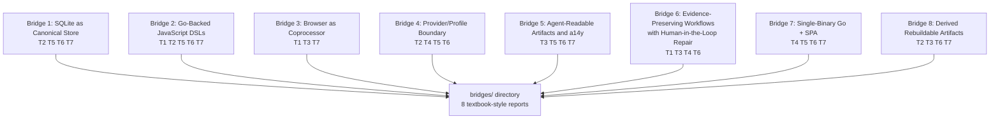
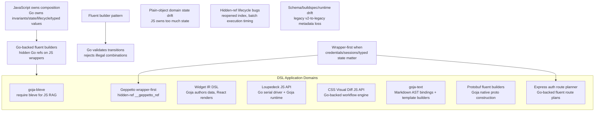
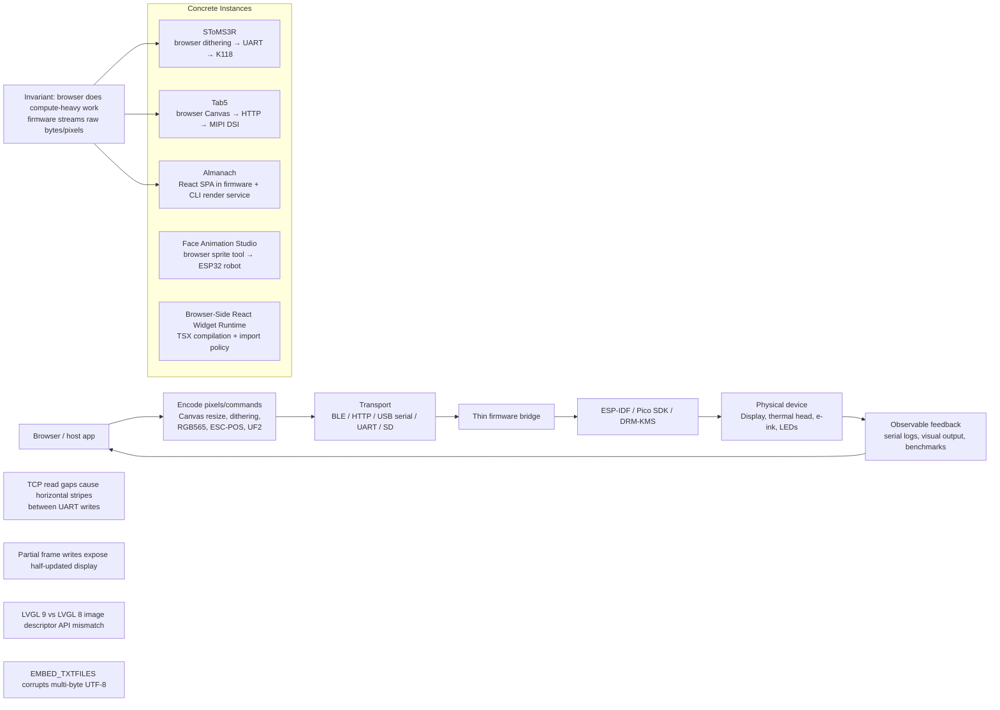
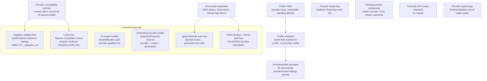
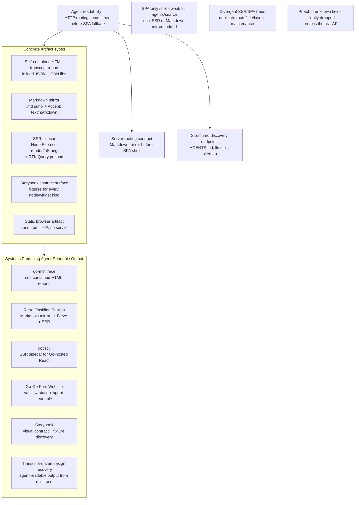
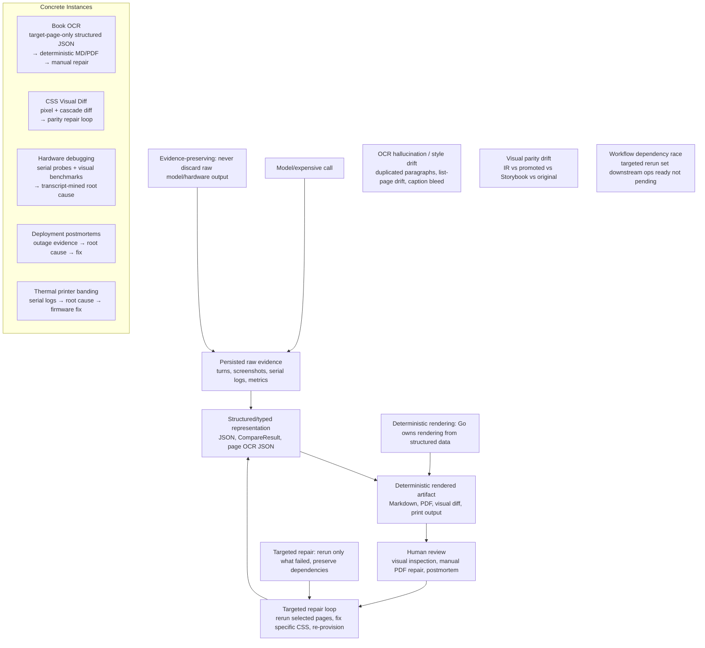
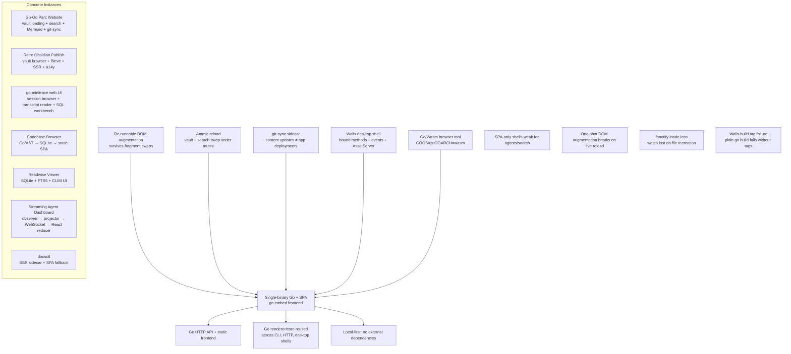
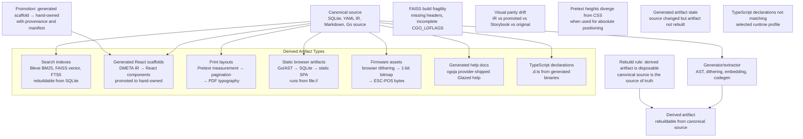

# Bridge Topic Reports Plan

## Goal

The 7 topic maps (design/04) revealed 8 recurring cross-cutting concepts that span multiple topics. Each bridge topic deserves its own textbook-style report because it is a first-class architectural pattern, not just a footnote in a single topic. This document assigns one subagent per bridge topic.

## Bridge topic overview

## Bridge topics and mermaid graphs

### Bridge 1: SQLite as Canonical Store and Product Boundary

**Spans**: T2 (Durable Objects), T5 (go-minitrace), T6 (RAG/OCR/Readwise/codebase browser), T7 (app shells)

**Output**: `bridges/01-sqlite-canonical-store.md`

```mermaid
flowchart TD
    SQLite[SQLite canonical store] --> Durable[Durable Objects\nper-actor SQLite storage]
    SQLite --> Minitrace[go-minitrace\nnormalized transcript DB\nmt.db 9-10 tables]
    SQLite --> RAG[RAG Evaluation\ncorpus DB + engine DB split]
    SQLite --> OCR[Book OCR\nwork queue + provenance]
    SQLite --> Codebase[Codebase Browser\nstatic SQLite + FTS5 + sql.js]
    SQLite --> Readwise[Readwise Viewer\ndocuments + tags + FTS5]
    SQLite --> CoRead[Document Co-Read\nDuckDB graph from transcripts]
    SQLite --> AppShells[App Shells\nGo-Go Parc / Retro Obsidian]

    Boundary[SQLite as product boundary] --> BrowserRuntime[sql.js in browser\nstatic artifact runtime]
    Boundary --> ScriptArtifact[SQLite as script/LLM artifact\nquery plans as frontend architecture]
    Boundary --> OperatorSurface[Glazed CLI over SQLite\nshared service layers]

    FM1[Chunking termination bug\noverlap loop unbounded]
    FM2[SQLite concurrency hazard\nparallel OCR workers need BEGIN IMMEDIATE]
    FM3[snapshot_refs view freeze\n60s browser freeze from broad view expansion]
    FM4[GOWORK=off in worktrees\nsilent empty DBs]
    FM5[Regex table extraction fragility\nfails on quoted identifiers]
```

**Key source reports to read**: `02b`, `05a`, `05b`, `06a`, `06b`, `07a`
**Key project articles**: RAG Evaluation System, Codebase Browser, Readwise Viewer, go-minitrace API Redesign, Durable Objects, SQLite Authorizer and Query Safety, SQLite Introspection

---

### Bridge 2: Go-Backed JavaScript DSLs

**Spans**: T1 (Loupedeck), T2 (go-go-goja/xgoja), T5 (Geppetto), T6 (goja-bleve), T7 (Widget IR/Fringe)

**Output**: `bridges/02-go-backed-js-dsls.md`

**Key source reports to read**: `01b`, `02a`, `02b`, `05a`, `06a`, `07a`
**Key project articles**: Designing DSLs with go-go-goja, Fluent Builders with Go-Backed Objects, goja-bleve, Geppetto JS Bindings, Building a Goja UI DSL, Loupedeck Goja API, CSS Visual Diff JS API, goja-text

---

### Bridge 3: Browser as Coprocessor for Constrained Runtimes

**Spans**: T1 (SToMS3R/Tab5/Almanach/Face Animation), T3 (Almanach raster), T7 (browser widget runtime)

**Output**: `bridges/03-browser-as-coprocessor.md`

**Key source reports to read**: `01a`, `03b`, `07a`, `07b`
**Key project articles**: SToMS3R, ESP32-P4 MIPI DSI Image Blitter, Almanach Studio, Almanach Render Service, Face Animation Studio, Browser-Side React Widget Runtime, Optimizing WiFi Image Upload on ESP32-P4

---

### Bridge 4: Provider/Profile Boundary

**Spans**: T2 (Geppetto), T4 (xgoja auth host), T5 (Pi providers/LLM proxy), T6 (embedding providers)

**Output**: `bridges/04-provider-profile-boundary.md`

**Key source reports to read**: `02b`, `04a`, `05a`, `05b`, `06a`
**Key project articles**: Geppetto JS Bindings, Geppetto JS Overhaul, LLM Proxy, Pi Scoped Models, xgoja Keycloak Auth Host, go-go-goja Express Auth, go-go-goja Token Families, RAG Evaluation embedding profiles, Geppetto Gemini SDK Modernization

---

### Bridge 5: Agent-Readable Artifacts and a14y

**Spans**: T3 (Storybook), T5 (self-contained reports), T6 (Retro Obsidian), T7 (docsctl/SSR)

**Output**: `bridges/05-agent-readable-artifacts.md`

**Key source reports to read**: `03b`, `05a`, `05b`, `06b`, `07a`
**Key project articles**: Agent a14y for Go-Hosted React Docs, Retro Obsidian Publish, Self-Contained HTML Transcript Exports, Streaming Agent Dashboard, Storybook contracts, Building a Knowledge Base Playbook, docsctl and SSR Sidecar

---

### Bridge 6: Evidence-Preserving Workflows with Human-in-the-Loop Repair

**Spans**: T1 (hardware debugging), T3 (visual parity), T4 (postmortems), T6 (OCR repair)

**Output**: `bridges/06-evidence-workflows-repair.md`

**Key source reports to read**: `01a`, `03b`, `04a`, `04b`, `06a`
**Key project articles**: Book OCR Project Report, CSS Visual Diff, k3s Post-Reboot Outage, Thermal Receipt Printer Banding, Deep Research Thermal Printer, Transcript-Driven Design System Recovery, Structured Book OCR

---

### Bridge 7: Single-Binary Go + SPA Pattern

**Spans**: T4 (static sites), T5 (minitrace UI/dashboards), T6 (codebase browser/Readwise), T7 (Go-Go Parc/Retro Obsidian)

**Output**: `bridges/07-single-binary-go-spa.md`

**Key source reports to read**: `04a`, `05a`, `05b`, `06b`, `07a`
**Key project articles**: Go-Go Parc Website, Retro Obsidian Publish, go-minitrace Web UI, Codebase Browser Static WASM, Readwise Viewer, Streaming Agent Dashboard, Wails v2 Desktop Applications, docsctl SSR Sidecar

---

### Bridge 8: Derived Rebuildable Artifacts

**Spans**: T2 (generated React), T3 (print layouts), T6 (search indexes), T7 (static sites/firmware assets)

**Output**: `bridges/08-derived-rebuildable-artifacts.md`

**Key source reports to read**: `02a`, `02b`, `03a`, `03b`, `06a`, `06b`, `07a`
**Key project articles**: DMETA Design System Factory, Pretext Print Layout, Goja Bleve, Building FAISS for Bleve, Codebase Browser Static WASM, xgoja Provider-Shipped Help, TypeScript Declarations, SQLite Introspection (32MB→1.4MB), DMETA Visual Parity

---

## Agent instructions template

Each bridge agent receives:

1. **Skill**: Read `/home/manuel/.pi/agent/skills/textbook-authoring/SKILL.md` and follow its tone, structure, and patterns.
2. **Context**: Read the relevant source reports from `sources/` (listed per bridge) and the refined maps in `design/04`.
3. **Primary sources**: Read the assigned project articles from `Projects/2026/...` directly (not just the source report summaries).
4. **Output**: Write a textbook-style report to the assigned `bridges/NN-*.md` file.
5. **Constraint**: Only write within the ticket workspace (`ttmp/2026/06/22/PROJECT-MAPS-001--concept-maps-for-recent-project-topics/`). Do not modify `Projects/2026/` or any other source files. Do not launch subagents.
6. **Style**: Peter Norvig style — foundational prose, concrete examples, pseudocode, diagrams, structured learning materials. Define the concept, explain why it exists, show concrete instances across multiple topics, extract invariants, document failure modes, and provide a learning path.
