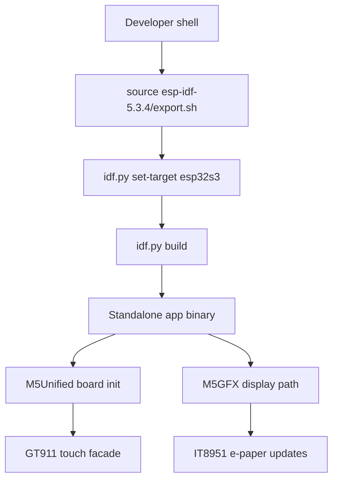
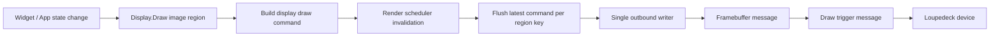
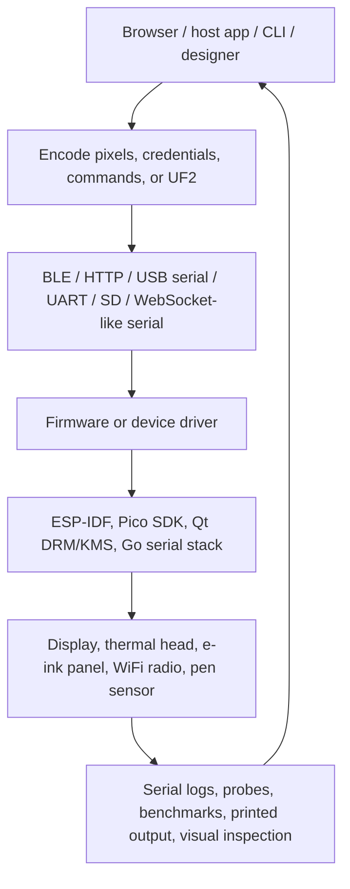

# Code Context

## Files Retrieved
1. `Projects/2026/03/21/PROJ - PaperS3 Firmware - Setup and Build Workflow.md` (lines 1-120) - PaperS3 ESP-IDF/M5Stack donor-component build pattern and e-paper/touch architecture.
2. `Projects/2026/03/21/PROJ - Glyph Protractor Algorithm - PaperS3 Handwriting Recognition.md` (grep hits around lines 21-589) - PaperS3 touch input, gesture recognition, persistent glyph templates, and deferred e-paper redraw.
3. `Projects/2026/04/22/ARTICLE - ATOMS3R BLE Provisioning System Design.md` (lines 1-120) - BLE WiFi provisioning architecture for AtomS3R thermal printer firmware.
4. `Projects/2026/04/28/PROJ - SToMS3R - AtomS3R Lite Thermal Printer Firmware.md` (lines 1-160) - ESP-IDF thermal printer firmware architecture, browser-side dithering, UART/ESC-POS pipeline, and diagnostics.
5. `Projects/2026/05/27/ARTICLE - ESP32-P4 MIPI DSI Image Blitter - Browser-to-Display Pipeline on the M5Stack Tab5.md` (lines 1-120) - browser-to-ESP32-P4-to-LVGL/MIPI display pipeline and failure modes.
6. `Projects/2026/06/11/ARTICLE - M5StackChan - Measuring Draw Performance and Display Pipeline Limits.md` (lines 1-120) - real-hardware display performance methodology for ESP-IDF/LVGL/SPI LCD.
7. `Projects/2026/05/05/ARTICLE - PicoCalc UF2 Loader - Two-Stage Bootloader Deep Dive.md` (lines 1-100) - PicoCalc RP2040/RP2350 bootloader and firmware-loading workflow.
8. `Projects/2026/04/11/ARTICLE - Loupedeck - Render Scheduler, Region Coalescing, and Display Blit Path.md` (lines 1-100) - physical-device display blit pipeline over constrained transport.
9. `Projects/2026/04/07/ARTICLE - Key Findings - ReMarkable Paper Pro Platform Architecture.md` (lines 1-100) - Paper Pro e-ink, DRM/KMS, pen input, and Qt platform architecture.
10. `Projects/2026/{03,04,05,06}/**/*.md` filename inventory via scripted search - broader project/report discovery across the requested corpus.

## Scope and search method

Scope was Markdown reports under `Projects/2026/{03,04,05,06}/`. I used the parent fanout plan, then searched filenames and contents for: `esp32`, `esp-idf`, `idf.py`, `M5Stack`, `AtomS3R`, `PaperS3`, `Paper Pro`, `PicoCalc`, `Loupedeck`, `reMarkable`, `thermal`, `BLE`, `WiFi`, `firmware`, `flash`, `embedded`, `display`, `e-ink/eink`, `MIPI`, `LVGL`, `UF2`, `RP2040`, `printer`, and related variants. I then selectively read high-signal representative reports rather than every hit.

## Projects and reports found

### PaperS3 / M5Stack e-paper ESP32-S3
- `Projects/2026/03/21/PROJ - PaperS3 Firmware - Setup and Build Workflow.md`
- `Projects/2026/03/21/PROJ - Glyph Protractor Algorithm - PaperS3 Handwriting Recognition.md`
- `Projects/2026/03/22/PROJ - PaperS3 E-Reader - Interactive Book Reader on E-Ink.md`
- `Projects/2026/03/22/PROJ - Gnosis Layout Engine - PaperS3 UI Operating System.md`
- `Projects/2026/03/23/PROJ - PaperS3 WAMR Debugging - Embedded Wasm Root Cause.md`

### AtomS3R / ATOM Lite / ESP32 provisioning and thermal printer
- `Projects/2026/04/05/PROJ - Wi-Fi Audio Cues Lab - ESP-IDF Sample for Audio Cues on AtomS3R with Atomic Echo Base.md`
- `Projects/2026/04/05/PROJ - Wi-Fi Audio Cues Lab - ESP32-S3 Audio Feedback for Wi-Fi Events.md`
- `Projects/2026/04/22/ARTICLE - ATOM-PRINTER Firmware - Technical Deep Dive.md`
- `Projects/2026/04/22/ARTICLE - ATOMS3R BLE Provisioning - Project Report.md`
- `Projects/2026/04/22/ARTICLE - ATOMS3R BLE Provisioning Firmware Analysis.md`
- `Projects/2026/04/22/ARTICLE - ATOMS3R BLE Provisioning Firmware Implementation Guide.md`
- `Projects/2026/04/22/ARTICLE - ATOMS3R BLE Provisioning System Design.md`
- `Projects/2026/04/22/ARTICLE - BLE WiFi Provisioning with ESP32 - User Developer Guide.md`
- `Projects/2026/04/23/ARTICLE - ATOM Lite ESP-IDF Provisioning - Project Report.md`
- `Projects/2026/04/28/ARTICLE - Deep Research - Thermal Receipt Printer Banding Under Low Serial Feed.md`
- `Projects/2026/04/28/PROJ - SToMS3R - AtomS3R Lite Thermal Printer Firmware.md`
- `Projects/2026/04/29/ARTICLE - Almanach Studio - A Self-Hosted Thermal Almanac Designer for ESP32.md`
- `Projects/2026/04/29/ARTICLE - Thermal Receipt Printers - K118 Mechanics Commands and Firmware Control.md`
- `Projects/2026/05/08/ARTICLE - Almanach Render Service - YAML CLI Rendering and Reliable Thermal Printing.md`
- `Projects/2026/05/10/ARTICLE - Almanach BLE Provisioning - Chrome Web Bluetooth Pairing Deep Dive.md`
- `Projects/2026/05/10/ARTICLE - Almanach BLE Provisioning - Firmware to Linux CLI Feedback Loop.md`
- `Projects/2026/05/10/ARTICLE - Almanach BLE Provisioning - Native Go Protocol Deep Dive.md`
- `Projects/2026/05/10/ARTICLE - Thermal Dithering Algorithms - Almanach Rasterization Deep Dive.md`

### M5Stack Tab5 / ESP32-P4 / ESP-Hosted / display and WiFi throughput
- `Projects/2026/04/21/ARTICLE - M5 Tab5 - Display Bring-Up Failure and Display Architecture.md`
- `Projects/2026/04/21/ARTICLE - M5 Tab5 - Reference Firmware and Hardware Docs Onboarding.md`
- `Projects/2026/05/27/ARTICLE - ESP32 WiFi Architecture Comparison - ESP-Hosted vs Native WiFi Measured HTTP Throughput.md`
- `Projects/2026/05/27/ARTICLE - ESP32-P4 MIPI DSI Image Blitter - Browser-to-Display Pipeline on the M5Stack Tab5.md`
- `Projects/2026/05/27/ARTICLE - Optimizing WiFi Image Upload on ESP32-P4 - From 6 Seconds to Sub-Second.md`
- `Projects/2026/05/27/ARTICLE - WiFi Throughput Benchmark on ESP32-P4 with ESP-Hosted - Measured Results and Bottleneck Analysis.md`

### M5Dial / CoreS3 / M5StackChan / robot display pipelines
- `Projects/2026/05/27/ARTICLE - M5Dial Dithered 3D Scene Viewer - Software Rendering on ESP32-S3.md`
- `Projects/2026/05/28/ARTICLE - M5Dial Proper 3D Renderer - Building a Z-Buffered Planet and Terrain on ESP32-S3.md`
- `Projects/2026/06/11/ARTICLE - Face Animation Studio - Building a Browser-Based Sprite Animation Tool for an ESP32 Robot.md`
- `Projects/2026/06/11/ARTICLE - M5StackChan - Building and Deploying a Custom App on Real Hardware.md`
- `Projects/2026/06/11/ARTICLE - M5StackChan - Deep Dive Technical Analysis of a Kawaii Desktop Robot Platform.md`
- `Projects/2026/06/11/ARTICLE - M5StackChan - Measuring Draw Performance and Display Pipeline Limits.md`
- `Projects/2026/06/12/ARTICLE - M5Stack Module LLM - Device Side Voice Recognition with StackFlow.md`

### PicoCalc / RP2040/RP2350 / Pico SDK / CYW43
- `Projects/2026/05/05/ARTICLE - PicoCalc UF2 Loader - Two-Stage Bootloader Deep Dive.md`
- `Projects/2026/05/05/ARTICLE - PicoCalc uLisp REPL Window - Backbuffer Rendering and RAM-Conscious UI.md`
- `Projects/2026/05/05/PROJ - uLisp PicoCalc - From Cross-Compilation to a Lisp Machine in Your Hand.md`
- `Projects/2026/05/06/PROJ - uLisp PicoCalc Firmware Split - CMake Modularization Report.md`
- `Projects/2026/05/07/PROJ - Standalone Pico 2W Web Server - Pico SDK Deep Dive.md`
- `Projects/2026/05/09/ARTICLE - PicoCalc Pico SDK Display Bringup - ILI9488 Serial REPL Deep Dive.md`
- `Projects/2026/05/09/ARTICLE - PicoCalc Pico SDK Firmware Deep Dive - Drawing Keyboard and REPL.md`
- `Projects/2026/05/19/ARTICLE - Pico 2 W WiFi Association Debugging - CYW43 FreeRTOS Deep Dive.md`
- `Projects/2026/06/01/ARTICLE - ESP32-P4-WIFI6 as PicoCalc MCU - Deep Technical Dive.md`
- `Projects/2026/06/01/ARTICLE - ESP32-P4 PicoCalc Display Optimization - Queued SPI and Dirty Rectangles.md`

### reMarkable / Paper Pro / cloud sync
- `Projects/2026/03/17/PROJ - reMarkable Cleanup - Tablet Root Reorganization.md`
- `Projects/2026/03/19/PROJ - Remarquee - reMarkable Toolkit.md`
- `Projects/2026/03/28/PROJ - Remarquee - Markdown Upload Polish.md`
- `Projects/2026/03/28/PROJ - Remarquee - V6 Render Overlay Y-Placement Bug.md`
- `Projects/2026/04/06/ARTICLE - Playbook - Building E-Ink Drawing Apps for the reMarkable Paper Pro.md`
- `Projects/2026/04/06/PROJ - Paper Pro Pen Probe - reMarkable E-Ink Drawing and Pen Input.md`
- `Projects/2026/04/07/ARTICLE - Key Findings - ReMarkable Paper Pro Platform Architecture.md`
- `Projects/2026/04/07/ARTICLE - Playbook - Building E-Ink Drawing Apps for the ReMarkable Paper Pro.md`
- `Projects/2026/04/07/PROJ - Paper Pro E-Ink - DRM KMS Fast Mode Investigation.md`
- `Projects/2026/04/07/PROJ - Paper Pro E-Ink - Ghidra Reverse Engineering of libqsgepaper.so.md`
- `Projects/2026/04/07/PROJ - Paper Pro E-Ink - Pen Input and SDK Build Fix.md`
- `Projects/2026/04/07/PROJ - reMarkable Cloud Activity Timeline.md`
- `Projects/2026/04/10/PROJ - reMarkable Book Indexing - Using kimi-k2p5 and remarquee to catalog programming books.md`
- `Projects/2026/04/25/ARTICLE - The rmapi Sync15 Schema V4 Invalid Hash Bug - A Deep Technical Dive.md`
- `Projects/2026/05/04/ARTICLE - Obsidian to reMarkable Sync - Native Delta Upload and Vault Report Pipeline.md`

### Loupedeck physical-device UI/rendering
- `Projects/2026/04/11/PROJ - Loupedeck Live Hello World - Serial Go Driver.md`
- `Projects/2026/04/11/ARTICLE - Loupedeck - Backpressure-Safe Go Frontend Deep Dive.md`
- `Projects/2026/04/11/ARTICLE - Loupedeck - Future Directions for the Render Scheduler and Dynamic UI Runtime.md`
- `Projects/2026/04/11/ARTICLE - Loupedeck - Goja JavaScript Runtime and API Deep Dive.md`
- `Projects/2026/04/11/ARTICLE - Loupedeck - Loading, Animating, and Displaying SVG Button Banks.md`
- `Projects/2026/04/11/ARTICLE - Loupedeck - Optimizing Button Animation FPS on a Serial WebSocket Device.md`
- `Projects/2026/04/11/ARTICLE - Loupedeck - Render Scheduler, Region Coalescing, and Display Blit Path.md`
- `Projects/2026/04/12/ARTICLE - Loupedeck - 12-Tile Cyb-Ito Performance Investigation.md`
- `Projects/2026/04/12/ARTICLE - Loupedeck - Font and Text Rendering Pipeline and Kanji Support.md`
- `Projects/2026/04/13/PROJ - Loupedeck - Architecture Cleanup and Performance Report.md`
- `Projects/2026/04/22/ARTICLE - Project Report - Tracing the Loupedeck Serial Bug with Transcript Analysis.md`
- `Projects/2026/05/31/ARTICLE - Loupedeck Tile Rendering - How Pixels Get From JavaScript to Hardware, and Why Multi-Line Text Was Broken.md`
- `Projects/2026/06/01/ARTICLE - LDCK-API-001 - Building a Loupedeck HTTP API with xgoja.md`

### Other physical-device / firmware-adjacent hits
- `Projects/2026/03/29/PROJ - Cardputer ADV Animation UI - Experimental Minimap Firmware.md`
- `Projects/2026/04/02/PROJ - Cardputer Web Demo - Bluetooth Architecture And Bringup.md`
- `Projects/2026/04/02/PROJ - Cardputer Web Serial Demo - Architecture And Build.md`
- `Projects/2026/04/02/PROJ - Cardputer Web Serial Demo - Technical Project Report.md`
- `Projects/2026/05/22/ARTICLE - Printing to a Zebra ZD420 Thermal Label Printer from Linux over USB.md`
- `Projects/2026/06/19/PROJECT REPORT - Framework False Battery Shutdown - Kernel Lockdown and Power Policy Deep Dive.md`

## Key Code

### PaperS3 firmware pattern
From `Projects/2026/03/21/PROJ - PaperS3 Firmware - Setup and Build Workflow.md` lines 23-34:

> create standalone ESP-IDF app directories like `0075`, `0076`, `0077`; point `EXTRA_COMPONENT_DIRS` at `../../M5PaperS3-UserDemo/components`; pin ESP-IDF `5.3.4`; prefer USB Serial/JTAG; build with `source /home/manuel/esp/esp-idf-5.3.4/export.sh && idf.py set-target esp32s3 && idf.py build`.

Critical architecture from lines 86-103:



### AtomS3R BLE provisioning model
From `Projects/2026/04/22/ARTICLE - ATOMS3R BLE Provisioning System Design.md` lines 35-58:

| Aspect | Decision | Why it matters |
|---|---|---|
| Primary transport | BLE | avoids iOS WiFi network switching restrictions |
| Fallback transport | SoftAP HTTP | keeps non-BLE devices possible |
| Security | Security 1 / Curve25519 | balances security and simplicity |
| Proof of possession | 6-digit PIN | prevents unauthorized provisioning |
| Device name | `ATOMS3R_XXXX` | scan-time identification |

### SToMS3R printer/display pipeline
From `Projects/2026/04/28/PROJ - SToMS3R - AtomS3R Lite Thermal Printer Firmware.md` lines 21-33 and 99-136:


Key concept: browser does compute-heavy image processing; ESP32 streams raw 1-bit ESC/POS bytes. Failure mode: TCP-read gaps between UART writes created horizontal stripes, fixed by buffering the full HTTP body before UART streaming.

### Tab5 browser-to-MIPI pipeline
From `Projects/2026/05/27/ARTICLE - ESP32-P4 MIPI DSI Image Blitter - Browser-to-Display Pipeline on the M5Stack Tab5.md` lines 15-24 and 44-72:


Failure modes called out: `EMBED_TXTFILES` corrupts multi-byte UTF-8/appends NULs; LVGL 9 image descriptor API differs from LVGL 8; ESP-Hosted WiFi initialization order can silently crash; direct writes into screen buffer cause partial-overwrite artifacts during slow WiFi transfer.

### M5StackChan performance measurement
From `Projects/2026/06/11/ARTICLE - M5StackChan - Measuring Draw Performance and Display Pipeline Limits.md` lines 23-32 and 54-65:

- Display: 320x240 RGB565 ILI9341-compatible ILI9342 over SPI, ESP-IDF `esp_lcd` + `esp_lvgl_port`.
- At factory 40 MHz SPI, best full-screen generated blit around 25 FPS with 120-line chunks.
- 80 MHz improves nominal throughput but creates visual instability; safe default remains 40 MHz.
- Dirty rectangles are the best production pattern: full-screen redraws at 40 MHz are ~12.5 FPS, dirty restore/redraw reaches ~25-30 FPS.

### PicoCalc bootloader split
From `Projects/2026/05/05/ARTICLE - PicoCalc UF2 Loader - Two-Stage Bootloader Deep Dive.md` lines 23-34:

- Stock PicoCalc bootloader expects specially linked `.bin` under `/firmware` at a fixed offset.
- `pelrun/uf2loader` uses a tiny flashed bootloader plus `BOOT2040.UF2`/`BOOT2350.UF2` SD-root menu UI.
- Normal UF2 apps can live in `/pico1-apps/` or `/pico2-apps/`.

### Loupedeck constrained transport rendering
From `Projects/2026/04/11/ARTICLE - Loupedeck - Render Scheduler, Region Coalescing, and Display Blit Path.md` lines 21-45 and 69-85:



Key pattern: drawing and sending are separated; repeated region updates collapse under latest-wins keyed invalidation; writer serializes and paces the transport.

### reMarkable Paper Pro architecture
From `Projects/2026/04/07/ARTICLE - Key Findings - ReMarkable Paper Pro Platform Architecture.md` lines 15-28 and 32-83:

```text
Application (Qt Quick / QML)
  -> libepaper.so Qt platform plugin
  -> libqsgepaper.so Qt scenegraph plugin
  -> xochitl daemon
  -> DRM/KMS on /dev/dri/card0
  -> imx-drm / lcdif / remarkable panel
  -> e-ink hardware
```

Critical facts: Paper Pro has no `/dev/fb0`; stylus must be read from `/dev/input/event2`; fast path uses `DRM_IOCTL_MODE_ATOMIC` with proprietary e-ink policy; xochitl renders quarter-resolution buffers.

## Architecture

The hardware slice has a recurring shape: move expensive or iteration-heavy work out of firmware, keep firmware as a thin, measurable bridge to physical I/O, and use physical-device feedback to correct assumptions.

Common layered architecture:



Main clusters:

1. **ESP32/M5Stack firmware applications**: PaperS3, AtomS3R, Tab5, M5Dial, M5StackChan. These revolve around ESP-IDF, board support reuse, LVGL/M5GFX, USB Serial/JTAG, PSRAM, and physical display/printer constraints.
2. **Provisioning and WiFi transport**: AtomS3R BLE provisioning, Almanach BLE provisioning, ESP-Hosted WiFi throughput, Pico 2W CYW43 debugging. These focus on setup UX, iOS/browser constraints, init order, throughput, and native/Chrome/CLI feedback loops.
3. **Display pipelines**: PaperS3 e-paper, Paper Pro DRM/KMS e-ink, Tab5 MIPI DSI, M5StackChan SPI LCD, Loupedeck tile display, PicoCalc ILI9488. Repeated subproblem: rectangular updates, dirty regions, byte formats, refresh/latency, ghosting/tearing, transport backpressure.
4. **Thermal printing**: Atom printer, SToMS3R, Almanach, K118, Zebra. Repeated subproblem: rasterization/dithering, ESC/POS or printer protocol, serial pacing, power/thermal mechanics, horizontal banding, and end-to-end print validation.
5. **Firmware loading/debugging**: ESP-IDF flash/monitor, PaperS3 app scaffolds, PicoCalc UF2 vs stock bootloader, M5StackChan deploy-to-real-hardware, WAMR embedded wasm root cause, hardware probe commands.
6. **Non-ESP physical platforms**: reMarkable/Paper Pro and Loupedeck. These are still conceptually aligned because they expose physical-device constraints, custom transport/display stacks, reverse engineering, and input/display separation.

## Clusters, subclusters, recurring concepts, and failure modes

### Cluster A: ESP-IDF board-support reuse and build reproducibility
Concepts: `idf.py`, ESP-IDF 5.3.4 pinning, `EXTRA_COMPONENT_DIRS`, M5Stack donor firmware, CMake/Kconfig, custom partition tables, USB Serial/JTAG.
Failure modes: wrong component path; unsourced ESP-IDF export script; wrong target; partition missing for SPIFFS; modifying donor/platform code and app code simultaneously.

### Cluster B: Provisioning UX and BLE/WiFi setup
Concepts: BLE GATT provisioning, `protocomm`, Security 1 Curve25519, PoP PIN, SoftAP fallback, NVS credential persistence, Chrome Web Bluetooth, native Go provisioning CLI.
Failure modes: iOS cannot programmatically switch WiFi; ESP-Hosted init order crash; saved credentials causing boot-time surprises; BLE/browser support mismatch.

### Cluster C: Browser/host offload for constrained MCUs
Concepts: Canvas resize, RGBA->RGB565, Floyd-Steinberg dithering, 1-bit packing, HTTP binary upload, YAML/CLI render service, browser as UI iteration loop.
Failure modes: firmware doing too much; UTF-8/NUL corruption in embedded JS; partial frame writes; heap/PSRAM assumptions; slow upload exposing half-updated display.

### Cluster D: Region rendering and backpressure
Concepts: dirty rectangles, region coalescing, latest-wins invalidation, serialized paced writer, LVGL invalidation, chunk size, SPI clock, RGB565 byte order.
Failure modes: transport storms; queue flooding; tearing/yellow flashing at high SPI clock; LVGL object mutation confused with pixel flush; full-screen redraws masking production performance.

### Cluster E: E-ink and slow display physics
Concepts: update modes, ghosting, waveform quality/latency tradeoff, quarter-resolution buffers, pen fast paths, GT911 touch, Paper Pro evdev pen input.
Failure modes: assuming framebuffer exists; assuming Qt tablet events carry pen; coupling input latency to e-paper refresh; changing math/UI/display scheduling together.

### Cluster F: Thermal print mechanics and serial pacing
Concepts: ESC/POS, GS v 0 bitmap print, K118 58mm mechanism, UART 9600 baud, horizontal banding, thermal head power/heat, browser dithering, printer diagnostics.
Failure modes: TCP read gaps causing stripes; underfeeding serial data; insufficient power; QR command sequence unverified; hardware TX/RX ambiguity; long print thermal stability.

### Cluster G: Bootloaders and firmware flashing
Concepts: ESP-IDF flash monitor, USB Serial/JTAG, BOOTSEL, UF2, SD card menu UI, stock PicoCalc fixed-offset bin expectations, app vector table validation.
Failure modes: UF2-to-BIN not accepted by stock bootloader; app linked at wrong offset; confusion between SD-root menu UF2 and flashed bootloader; device-specific install path mistaken for generic firmware copy.

### Cluster H: Reverse engineering and physical-device debugging
Concepts: serial probes, Ghidra, DRM/KMS ioctls, evdev event parsing, transcript mining for serial bugs, visual benchmarks, measurement firmware.
Failure modes: public SDK hiding device-specific behavior; stale assumptions from older hardware generations; benchmark designs that trip watchdogs or overflow stacks; unavailable TE/VSYNC line.

## Candidate concept-map nodes and edges

Nodes:
- ESP-IDF
- M5Stack board support
- ESP32-S3
- ESP32-P4
- ESP-Hosted WiFi
- AtomS3R
- PaperS3
- M5Stack Tab5
- M5StackChan/CoreS3
- M5Dial
- PicoCalc
- RP2040/RP2350
- Pico SDK
- reMarkable Paper Pro
- Loupedeck Live
- Thermal printer / K118
- BLE provisioning
- SoftAP fallback
- NVS credentials
- USB Serial/JTAG console
- ESP console diagnostics
- Browser-side rendering
- Canvas rasterization
- Dithering
- RGB565
- LVGL
- M5GFX/M5Unified
- DRM/KMS
- evdev pen input
- Dirty rectangles
- Region coalescing
- Backpressure-safe writer
- UART pacing
- ESC/POS
- UF2 bootloader
- Physical-device benchmark

Edges:
- `PaperS3` -> `ESP-IDF 5.3.4` -> `M5PaperS3-UserDemo components` -> `M5Unified/M5GFX` -> `GT911 touch` / `IT8951 e-paper`.
- `AtomS3R` -> `BLE provisioning` -> `protocomm Security 1` -> `NVS credentials` -> `WiFi STA`.
- `AtomS3R/SToMS3R` -> `Browser Canvas dithering` -> `1-bit bitmap` -> `HTTP upload` -> `UART/ESC-POS` -> `K118 thermal head`.
- `Tab5` -> `ESP32-P4` -> `ESP-Hosted ESP32-C6 WiFi` -> `HTTP binary upload` -> `SPIRAM screen buffer` -> `LVGL 9` -> `MIPI DSI panel`.
- `M5StackChan` -> `LVGL object mutation` -> `esp_lcd flush` -> `SPI clock/chunk size` -> `dirty rectangles`.
- `Loupedeck` -> `Display.Draw` -> `region coalescing` -> `paced writer` -> `device blit protocol`.
- `Paper Pro` -> `Qt epaper plugin` -> `libqsgepaper EPFramebuffer` -> `DRM/KMS atomic updates` -> `e-ink waveform policy`.
- `Paper Pro pen` -> `/dev/input/event2` -> `evdev parsing` -> `drawing app`.
- `PicoCalc` -> `stock bootloader` conflicts-with `normal UF2`.
- `PicoCalc` -> `uf2loader` -> `BOOT2040/BOOT2350 SD menu` -> `normal app UF2`.
- `Physical debugging` connects-to `serial console`, `probe commands`, `visual output`, `bench firmware`, `transcript mining`.

## Overlaps with other topic slices

- **Web UI / apps / media / productivity surfaces**: browser-based firmware UIs, Almanach Studio, Tab5 image uploader, Face Animation Studio, Loupedeck HTTP API, reMarkable/Remarquee productivity workflows.
- **JavaScript runtimes / Goja / xgoja DSLs**: Loupedeck Goja APIs, LDCK xgoja HTTP API, Almanach/renderer DSLs, browser-side JS image processing, Go-backed JS physical-device control surfaces.
- **Typography / layout / design systems**: thermal almanac layout, PaperS3 e-reader, PicoCalc text UI, Loupedeck font rendering/Kanji, Paper Pro drawing/text surfaces.
- **Infra / auth / deployment / GitOps**: Almanach render service and hosted pieces, deployment of hardware-adjacent web apps, firmware artifact serving maybe crosses with release trains.
- **AI agents / observability**: transcript-mined Loupedeck serial bug, hardware debugging playbooks from transcript analysis, M5Stack Module LLM.
- **Data / RAG / OCR / search**: reMarkable book indexing/sync, Obsidian-to-reMarkable, printed/almanac document workflows.

## Open questions

1. Should the concept maps separate `physical display pipelines` from `firmware build/provisioning`, or keep them under one hardware supercluster?
2. How much should non-ESP physical devices like Loupedeck and Paper Pro be merged with ESP32 work? They share concepts but not toolchains.
3. Are project reports in `ttmp/2026/...` also in scope for the eventual map, or should this corpus map cite only `Projects/2026` summaries and use ttmp paths as secondary evidence?
4. Should thermal printing be its own top-level map? It spans firmware, browser rendering, dithering, mechanics, hosted Almanach, and Linux/Zebra printing.
5. Should `browser as coprocessor for firmware` become a cross-slice concept? It recurs in SToMS3R, Tab5, Almanach, Face Animation Studio, and possibly design-system tools.
6. Need a second pass to inspect all listed files deeply; this first pass prioritized coverage and representative architecture.

## Report-format lessons

- A useful report for this corpus should start with **discovered paths grouped by platform**, because filename density is high and many reports belong to the same project arc.
- Include **representative snippets only**; otherwise the report becomes a second corpus.
- Concept maps should distinguish **hardware node**, **transport node**, **rendering/data format node**, and **failure-mode node**. The same edge pattern repeats across devices.
- Record **failure modes as first-class nodes**, not just notes. They are the strongest cross-project glue: init-order crash, frame tearing, serial underfeed, missing framebuffer, bootloader format mismatch, wrong component path.
- Use one lightweight inventory command plus 5-10 selective reads for first pass; defer exhaustive reading to cluster-specific map refinement.

## Start Here

Start with `Projects/2026/04/28/PROJ - SToMS3R - AtomS3R Lite Thermal Printer Firmware.md`. It is the best single bridge across ESP-IDF, AtomS3R hardware, WiFi, browser-side rendering, thermal printers, UART diagnostics, and physical failure modes. Then open `Projects/2026/05/27/ARTICLE - ESP32-P4 MIPI DSI Image Blitter - Browser-to-Display Pipeline on the M5Stack Tab5.md` for the display-pipeline counterpart.

## Supervisor coordination

No supervisor decision needed. I was not blocked.
