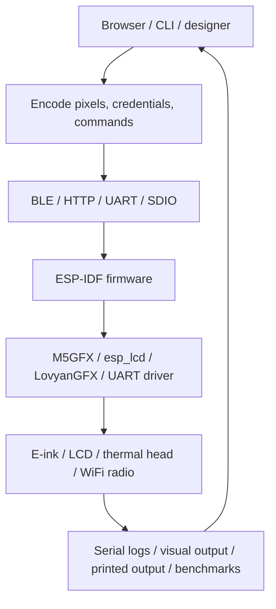

# Hardware/ESP32 Firmware Devices — Condensed Source Report (Partition A)

## Executive summary

- **Slice investigated**: ESP32-firmware device sections of `sources/01` — PaperS3, AtomS3R/thermal printer, Tab5/ESP32-P4, M5Dial/CoreS3/M5StackChan.
- **Strongest arcs**: (1) Browser-as-coprocessor for constrained MCUs (SToMS3R, Tab5, Almanach, Face Animation Studio); (2) ESP-IDF board-support reuse and build reproducibility (PaperS3 donor pattern); (3) ESP-Hosted WiFi throughput characterization and optimization (Tab5); (4) Dirty-rectangle display pipeline optimization (M5StackChan, M5Dial).
- **Concept-map spine**: `Browser/host → encode pixels/commands → transport (BLE/HTTP/UART/SDIO) → firmware → HAL → physical device → observable feedback`.
- **Start here**: `Projects/2026/04/28/PROJ - SToMS3R - AtomS3R Lite Thermal Printer Firmware.md` (best single bridge across ESP-IDF, WiFi, browser rendering, thermal printer, failure modes) and `Projects/2026/05/27/ARTICLE - ESP32-P4 MIPI DSI Image Blitter - Browser-to-Display Pipeline on the M5Stack Tab5.md` (display-pipeline counterpart).

## Scope and search method

- Corpus: `Projects/2026/{03,04,05,06}/**/*.md` assigned to partition A.
- Selection: deeply read canonical architecture/failure-mode reports; heading-scanned adjacent articles and implementation guides.
- Partition boundary: excluded PicoCalc, reMarkable/Paper Pro, Loupedeck, and 'Other physical-device' files (partition B).

## Evidence ledger

| Path | Evidence level | Lines / basis | Cluster | Why it matters |
|---|---|---|---|---|
| `Projects/2026/03/21/PROJ - PaperS3 Firmware - Setup and Build Workflow.md` | read | full file (~230 lines) | PaperS3 build | Canonical donor-component build pattern |
| `Projects/2026/03/21/PROJ - Glyph Protractor Algorithm - PaperS3 Handwriting Recognition.md` | read | full file (~320 lines) | PaperS3 gesture | Protractor recognizer pipeline and deferred e-paper redraw |
| `Projects/2026/03/22/PROJ - PaperS3 E-Reader - Interactive Book Reader on E-Ink.md` | read | full file (~200 lines) | PaperS3 e-reader | ext_text extension, word-wrap paginator, EPD crash failure mode |
| `Projects/2026/03/22/PROJ - Gnosis Layout Engine - PaperS3 UI Operating System.md` | read | full file (~400 lines) | PaperS3 layout engine | Tree-based layout, dirty-rect tracker, static node pool |
| `Projects/2026/03/23/PROJ - PaperS3 WAMR Debugging - Embedded Wasm Root Cause.md` | read | full file (~220 lines) | PaperS3 WAMR | Flash-mapped buffer writability contract violation |
| `Projects/2026/04/22/ARTICLE - ATOMS3R BLE Provisioning System Design.md` | read | full file (~500 lines) | BLE provisioning | BLE GATT provisioning architecture, Security 1, NVS persistence |
| `Projects/2026/04/28/PROJ - SToMS3R - AtomS3R Lite Thermal Printer Firmware.md` | read | full file (~280 lines) | Thermal printer | Browser dithering, UART pacing, ESC/POS, failure modes |
| `Projects/2026/04/28/ARTICLE - Deep Research - Thermal Receipt Printer Banding Under Low Serial Feed.md` | read | full file (~350 lines) | Thermal printer physics | Banding root causes: serial underfeed, thermal head physics, power integrity |
| `Projects/2026/04/29/ARTICLE - Almanach Studio - A Self-Hosted Thermal Almanac Designer for ESP32.md` | read | full file (~350 lines) | Almanach SPA | React SPA embedded in firmware, esbuild IIFE bundling, monochrome enforcement |
| `Projects/2026/05/08/ARTICLE - Almanach Render Service - YAML CLI Rendering and Reliable Thermal Printing.md` | read | lines 1-120 | Almanach CLI | Glazed CLI, YAML layout, Chrome headless render, host-side feed |
| `Projects/2026/05/10/ARTICLE - Almanach BLE Provisioning - Native Go Protocol Deep Dive.md` | read | lines 1-120 | BLE provisioning Go | Native Go BLE provisioning: X25519, AES-CTR, protobuf |
| `Projects/2026/05/10/ARTICLE - Thermal Dithering Algorithms - Almanach Rasterization Deep Dive.md` | read | lines 1-100 | Dithering | Dithering algorithm families, current fixed-threshold baseline |
| `Projects/2026/04/22/ARTICLE - ATOM-PRINTER Firmware - Technical Deep Dive.md` | heading-scanned | frontmatter + headings | Thermal printer | ATOM Lite printer firmware analysis |
| `Projects/2026/04/22/ARTICLE - ATOMS3R BLE Provisioning - Project Report.md` | heading-scanned | frontmatter + headings | BLE provisioning | Project report for BLE provisioning |
| `Projects/2026/04/22/ARTICLE - ATOMS3R BLE Provisioning Firmware Analysis.md` | heading-scanned | frontmatter + headings | BLE provisioning | Firmware analysis |
| `Projects/2026/04/22/ARTICLE - ATOMS3R BLE Provisioning Firmware Implementation Guide.md` | heading-scanned | frontmatter + headings | BLE provisioning | Implementation guide |
| `Projects/2026/04/22/ARTICLE - BLE WiFi Provisioning with ESP32 - User Developer Guide.md` | heading-scanned | frontmatter + headings | BLE provisioning | User/developer guide |
| `Projects/2026/04/23/ARTICLE - ATOM Lite ESP-IDF Provisioning - Project Report.md` | heading-scanned | frontmatter + headings | ATOM Lite provisioning | ATOM Lite provisioning project report |
| `Projects/2026/04/05/PROJ - Wi-Fi Audio Cues Lab - ESP-IDF Sample for Audio Cues on AtomS3R with Atomic Echo Base.md` | heading-scanned | frontmatter + headings | AtomS3R audio | Audio cues for WiFi events |
| `Projects/2026/04/05/PROJ - Wi-Fi Audio Cues Lab - ESP32-S3 Audio Feedback for Wi-Fi Events.md` | heading-scanned | frontmatter + headings | AtomS3R audio | WiFi event audio feedback |
| `Projects/2026/04/29/ARTICLE - Thermal Receipt Printers - K118 Mechanics Commands and Firmware Control.md` | heading-scanned | frontmatter + headings | Thermal printer | K118 command reference |
| `Projects/2026/05/10/ARTICLE - Almanach BLE Provisioning - Chrome Web Bluetooth Pairing Deep Dive.md` | heading-scanned | frontmatter + headings | BLE provisioning browser | Chrome Web Bluetooth pairing |
| `Projects/2026/05/10/ARTICLE - Almanach BLE Provisioning - Firmware to Linux CLI Feedback Loop.md` | heading-scanned | frontmatter + headings | BLE provisioning feedback | Firmware-to-CLI feedback loop |
| `Projects/2026/04/21/ARTICLE - M5 Tab5 - Display Bring-Up Failure and Display Architecture.md` | read | lines 1-60 | Tab5 display | Init-order bug, PI4IOE GPIO expander, PSRAM underrun |
| `Projects/2026/04/21/ARTICLE - M5 Tab5 - Reference Firmware and Hardware Docs Onboarding.md` | title-only | filename | Tab5 onboarding | Reference firmware onboarding |
| `Projects/2026/05/27/ARTICLE - ESP32-P4 MIPI DSI Image Blitter - Browser-to-Display Pipeline on the M5Stack Tab5.md` | read | full file (~350 lines) | Tab5 blitter | Browser RGBA→RGB565, dual-buffer upload, LVGL 9 migration |
| `Projects/2026/05/27/ARTICLE - Optimizing WiFi Image Upload on ESP32-P4 - From 6 Seconds to Sub-Second.md` | read | full file (~350 lines) | Tab5 optimization | Browser compression, miniz ROM decompression, stack sizing |
| `Projects/2026/05/27/ARTICLE - WiFi Throughput Benchmark on ESP32-P4 with ESP-Hosted - Measured Results and Bottleneck Analysis.md` | read | full file (~350 lines) | Tab5 benchmark | 4.2 Mbps upload, 1.7 Mbps download, 106 ms RTT, segment timing |
| `Projects/2026/05/27/ARTICLE - ESP32 WiFi Architecture Comparison - ESP-Hosted vs Native WiFi Measured HTTP Throughput.md` | read | lines 1-60 | WiFi comparison | ESP-Hosted vs native WiFi, TCP window tuning |
| `Projects/2026/05/27/ARTICLE - M5Dial Dithered 3D Scene Viewer - Software Rendering on ESP32-S3.md` | read | lines 1-100 | M5Dial 3D | 2-bit packed framebuffer, Bayer ordered dithering, no PSRAM |
| `Projects/2026/05/28/ARTICLE - M5Dial Proper 3D Renderer - Building a Z-Buffered Planet and Terrain on ESP32-S3.md` | read | lines 1-60 | M5Dial 3D | Z-buffer, 80×80 logical target, 3× scale |
| `Projects/2026/06/11/ARTICLE - Face Animation Studio - Building a Browser-Based Sprite Animation Tool for an ESP32 Robot.md` | read | lines 1-60 | M5StackChan tool | Browser sprite tool, ImageMagick normalization, C++ header export |
| `Projects/2026/06/11/ARTICLE - M5StackChan - Building and Deploying a Custom App on Real Hardware.md` | read | lines 1-60 | M5StackChan deploy | Mooncake app framework, I2C IO expander RGB LEDs |
| `Projects/2026/06/11/ARTICLE - M5StackChan - Deep Dive Technical Analysis of a Kawaii Desktop Robot Platform.md` | heading-scanned | frontmatter + headings | M5StackChan analysis | Technical analysis of robot platform |
| `Projects/2026/06/11/ARTICLE - M5StackChan - Measuring Draw Performance and Display Pipeline Limits.md` | read | full file (~826 lines) | M5StackChan perf | Raw blit benchmark, dirty rectangles, 40 MHz safe default |
| `Projects/2026/06/12/ARTICLE - M5Stack Module LLM - Device Side Voice Recognition with StackFlow.md` | read | lines 1-60 | Module LLM | StackFlow socket protocol, KWS, TTS |

## Condensed per-arc summaries

### Arc 1: PaperS3 / M5Stack e-paper ESP32-S3

- **Donor-component build pattern**: New PaperS3 apps reuse `M5PaperS3-UserDemo/components` via `EXTRA_COMPONENT_DIRS` rather than vendoring. ESP-IDF 5.3.4 pinned. USB Serial/JTAG preferred over UART to avoid pin conflicts. Each app is a small standalone directory (`0075`, `0076`, `0077`, `0078`, `0079`, `0080`, `0081`, `0082`) with a tiny `app_main.cpp` and one runtime class.
- **Gnosis layout engine** (`0078`): Tree-based UI with VBOX/HBOX/FIXED layout, static NodePool (192 nodes, ~140 bytes each), dirty-rect tracker with greedy merging (1024 px² threshold), and periodic full-quality deghosting after 60 partial refreshes. Compile-time DSL → C++ struct initializer lists (no JSON parsing).
- **Protractor gesture recognizer** (`0076`/`0077`): Single-stroke, user-trained classifier. Pipeline: resample to 16 points → center → canonical rotation → vectorize → OptimalCosineDistance. Shared recognition engine for TRAIN and WRITE modes. SPIFFS persistence with `glyph-store-v1` text format. Deferred e-paper redraw: queued segments in `epd_fast`, full renders gated by idle timeout.
- **WAMR root cause** (`0079`/`0081`/`0082`): WAMR's interpreter loader rewrites const strings in-place on flash-mapped buffers. Caused delayed PSRAM crashes ("Cache disabled"). Proven via reduction ladder: embedded-direct → bad; copy-to-RAM → good; `binary_freeable=true` → good; force `reuse_const_strings=false` → good. Reproduced on AtomS3R (not PaperS3-specific).
- **E-reader blocked** (`0080`): EPD driver `_buf` null crash (`ESP-37-EREADER-EPD-CRASH`). Added `ext_text` pointer to Node struct for large text rendering. Word-wrap paginator with incremental page offset table. Bookmark persistence with auto-save every 10 page turns.

### Arc 2: AtomS3R / ATOM Lite / ESP32 provisioning and thermal printer

- **SToMS3R firmware**: ESP-IDF firmware for AtomS3R Lite driving K118 58mm thermal printer. Six modules: `app_main`, `printer_drv` (UART + ESC/POS), `printer_cmd` (16 esp_console commands), `wifi_mgr`, `nvs_store`, `web_server`. Browser does all image processing (Canvas resize → grayscale → Floyd-Steinberg dithering → 1-bit packing); ESP32 streams raw bytes via single `uart_write_bytes()`.
- **BLE provisioning**: BLE GATT preferred over SoftAP to avoid iOS WiFi switching restrictions. Security 1 (Curve25519 + 6-digit PoP). NVS credential persistence. Three ESP-IDF protocomm endpoints: `proto-ver`, `prov-session`, `prov-config`. Almanach evolved from Python `esp_prov.py` → native Go implementation (X25519, AES-CTR stream continuity, protobuf messages).
- **Thermal banding root cause**: At 9600 baud, full-width raster can sustain only 2.5 mm/s vs the printer's advertised 60 mm/s. Gaps in UART stream cause the printer to insert horizontal stripes. Fix: buffer entire HTTP body before UART streaming. Banding taxonomy: chunk-boundary banding (~0.625 mm on 384px), platen-circumference banding (~44-63 mm), supply-sag banding (dense fills), thermal-history banding.
- **Almanach Studio**: React SPA (~2100 lines JSX) compiled via esbuild into 211 KB IIFE bundle, embedded in firmware via `EMBED_TXTFILES`. Served at `/almanach` by `esp_http_server`. Pure monochrome enforcement (#000 on #fff, zero opacity, zero grain). Render service: Go CLI with Glazed verbs (`serve`, `render`, `inspect`, `print`), YAML layout input, Chrome headless screenshot, host-side feed-line appending.
- **GPIO mapping discovery**: K118 cable is straight-through (not crossed); AtomS3R Lite maps to GPIO8/GPIO7/GPIO6 vs ATOM Lite's GPIO23/GPIO33/GPIO19. TX/RX swap handled in software via `uart_set_pin()`.

### Arc 3: M5Stack Tab5 / ESP32-P4 / ESP-Hosted

- **Display bring-up failure**: First attempt skipped PI4IOE GPIO expander initialization (I2C bus). Fix: follow factory BSP sequence: I2C → IO expander → reset → `bsp_display_start_with_config()` → rotation → backlight. Second bug: `lcd.dsi.dpi` underrun from PSRAM throughput — fixed with 200 MHz PSRAM (`CONFIG_IDF_EXPERIMENTAL_FEATURES=y`).
- **Browser-to-MIPI blitter**: Browser converts RGBA→RGB565 (1.8 MB), POSTs as raw binary. Dual-buffer strategy: receive into SPIRAM `tmp_buf`, then `memcpy` to screen buffer → single LVGL invalidation. LVGL 9 migration: `LV_IMAGE_HEADER_MAGIC`, `LV_COLOR_FORMAT_*`, explicit `stride`. ESP-Hosted WiFi init order: `configure_apsta_mode()` before `apply_sta_config()` or crash with saved NVS credentials.
- **Upload optimization 6s→3s**: Browser-side `CompressionStream('deflate')` → zlib. ESP32 ROM-resident `tinfl_decompress_mem_to_mem` with `TINFL_FLAG_PARSE_ZLIB_HEADER`. Stack: tinfl needs ~43 KB, default 8 KB HTTP task stack overflows → set to 48 KB. `recv_wait_timeout` raised from 5s to 30s. UI screenshots compress 15-1000x; random noise does not compress at all.
- **WiFi throughput benchmark**: Upload saturates at 4.2 Mbps (525 KB/s), download 1.7 Mbps (2.4x asymmetric). Ping RTT 106 ms (ESP-Hosted processing dominates, not WiFi radio). 5-7 stalls >50 ms per 1.8 MB upload account for most throughput shortfall. Compression changes the operating regime: 1.8 MB in 0.2s when compressed.
- **Native WiFi comparison**: Default ESP32-S3 (native WiFi) uploads at 3.7 Mbps — *slower* than ESP-Hosted (4.2 Mbps) due to IDF default TCP window (5,744 bytes). After tuning (65,535 byte window, WiFi buffers doubled, A-MPDU), native WiFi reaches 16.0 Mbps (3.8x faster). TCP window, not SDIO, is the bottleneck. PSRAM determines max payload: M5Dial (no PSRAM) caps at 100 KB; CoreS3/Tab5 handle 1.8 MB.

### Arc 4: M5Dial / CoreS3 / M5StackChan / robot display pipelines

- **M5Dial dithered 3D**: 2-bit packed framebuffer (14,400 bytes for 240×240) on a no-PSRAM ESP32-S3. Bayer ordered dithering with four-color palette (black/warm/cool/high). RGB565 expansion only at display-transfer time. First triangle renderer caused watchdog/flicker → pivoted to art-directed poster renderer. Rotary encoder for orbit, button for palette cycling, `esp_console` for parameter tuning without reflashing.
- **M5Dial proper 3D renderer**: 80×80 logical render target with `uint16_t` Z-buffer, 3× scaled to 240×240. Real camera projection and triangle rasterization for planet sphere. Key debugging insight: many visual errors are not Z-buffer errors — geometry, projection, quantization, camera framing, and UI safe areas each fail differently.
- **M5StackChan draw performance**: 320×240 ILI9342 over SPI at 40 MHz. Raw full-screen blit: 25 FPS (120-line chunks), 16.3 FPS (20-line LVGL-matching chunks). 80 MHz reaches 36 FPS but produces visual instability (random blits, yellow flashing). No TE/VSYNC pin on CoreS3 schematic → software pacing only. Dirty-rectangle animation: 25-30 FPS vs 12.5 FPS full-screen. Benchmark failures taught: don't starve system, use `lv_label_set_text_static()`, don't allocate 32 KB on main task stack, byte-swap RGB565 for raw blits, size dirty buffers for union of old/new bounds.
- **Face Animation Studio**: Zero-dependency browser tool for 135×240 sprite animations. ImageMagick tile normalization (crop, trim, threshold, scale) with per-sheet scaling factors. Exports JSON (editor) and C++ headers with RGB565 PROGMEM arrays (firmware). Collapses firmware iteration from 5-10 minutes to sub-second.
- **M5StackChan deploy**: Mooncake app framework with `onCreate`/`onOpen`/`onRunning`/`onClose` lifecycle. RGB LEDs (12× WS2812C) on touch board via PY32L020 I/O expander over I2C. `NeonLight` wrapper queues color but requires `update()` to output. Task watchdog fires in 10s. LVGL runs on Core 0; all LVGL calls need `LvglLockGuard`.
- **Module LLM**: AX630C SoC with Ubuntu/StackFlow runtime. StackFlow socket on port 10001 exposes `audio`, `kws`, `whisper`, `llm`, `tts`, `melotts` as task services. KWS requires `response_format: "kws.bool"` and open socket for async events. Onboard speaker via `melotts` with `response_format: "sys.play.0_1"`.

## Topic architecture / spine



## Clusters and subclusters

### Cluster A: ESP-IDF board-support reuse and build reproducibility
- Subclusters: PaperS3 donor pattern, M5Dial board reuse from 0074, M5StackChan Mooncake framework, ESP-IDF version pinning
- Invariant: reuse proven board support, vary only product logic; keep `app_main` tiny

### Cluster B: Provisioning UX and BLE/WiFi setup
- Subclusters: BLE GATT provisioning, SoftAP fallback, NVS persistence, Chrome Web Bluetooth, native Go provisioning client
- Invariant: BLE preferred over SoftAP for iOS compatibility; Security 1 (Curve25519 + PoP) balances security and simplicity

### Cluster C: Browser/host offload for constrained MCUs
- Subclusters: Canvas dithering + 1-bit packing (SToMS3R), RGBA→RGB565 conversion (Tab5), React SPA embedding (Almanach), sprite normalization (Face Animation Studio), YAML→Chrome render (Almanach CLI)
- Invariant: move expensive computation to the browser; firmware receives only ready-to-blit or ready-to-print bytes

### Cluster D: Region rendering and backpressure
- Subclusters: dirty rectangles (Gnosis, M5StackChan), region coalescing, LVGL invalidation, SPI chunk sizing, RGB565 byte order
- Invariant: update only changed regions; full-screen redraw is the wrong production target for SPI displays

### Cluster E: E-ink and slow display physics
- Subclusters: waveform mode selection (epd_text/epd_fast/epd_quality), ghosting mitigation, deferred redraw, dirty-rect merging, periodic deghosting
- Invariant: a UI on e-ink must be change-aware; partial refresh + dirty tracking is mandatory for responsiveness

### Cluster F: Thermal print mechanics and serial pacing
- Subclusters: ESC/POS, GS v 0 bitmap, K118 58mm mechanism, UART 9600 baud, banding taxonomy, dithering algorithms
- Invariant: buffer full body before UART; gaps in serial stream cause visible banding; baud rate caps achievable raster throughput

### Cluster G: WiFi throughput and ESP-Hosted transport
- Subclusters: ESP-Hosted SDIO, TCP window tuning, browser-side compression, miniz ROM decompression, segment timing analysis, SoftAP vs STA
- Invariant: compression is not optional optimization — it changes the operating regime; TCP window, not SDIO, is the bottleneck

### Cluster H: Embedded debugging and failure-mode-driven design
- Subclusters: WAMR flash-mapped buffer root cause, Tab5 init-order bug, EMBED_TXTFILES NUL corruption, thermal banding diagnostics, M5StackChan benchmark failures
- Invariant: crash site ≠ cause site; reduce to smallest toxic step; test with saved NVS credentials

## Recurring concepts, technologies, and failure modes

### Concepts
- Browser-as-coprocessor: heavy computation in browser, only final bytes to MCU
- Dirty-rectangle rendering: update only changed regions to maximize FPS on slow displays
- Donor-component reuse: proven board support layered under product-specific shells
- Deferred redraw: gate expensive full refreshes behind idle/stale timers
- Buffer-full-body-before-UART: separate network read from device write to prevent gaps
- Dual-buffer upload: receive into temp SPIRAM, memcpy to screen buffer, single invalidation
- Failure-mode-driven design: concrete failures discover architecture boundaries
- Compile-time DSL → struct initializers: skip JSON parsing at runtime
- Provider/transport separation: BLE treated as byte-oriented transport, protocol layers agnostic
- TCP window as real bottleneck: not radio, not SDIO

### Technologies
- ESP-IDF (5.3.4 for PaperS3, v5.5.2 for M5StackChan)
- ESP32-S3, ESP32-P4, ESP32-C6 (ESP-Hosted)
- M5GFX / M5Unified, LovyanGFX, LVGL 9, esp_lcd
- MIPI DSI, SPI, UART, BLE GATT, SDIO
- ESC/POS, GS v 0, protocomm, Security 1 (Curve25519/X25519)
- NVS, SPIFFS, PSRAM/SPIRAM
- esbuild, React 18, IIFE bundling
- miniz/tinfl (ROM-resident), CompressionStream API
- Glazed CLI, Chrome headless rendering
- WAMR (WebAssembly Micro Runtime)
- ImageMagick, esp_console

### Failure modes
- WAMR flash-mapped buffer writability violation (in-place const string rewrite on read-only flash)
- EMBED_TXTFILES NUL terminator corruption (appended `.byte 0` breaks JavaScript)
- ESP-Hosted WiFi init order crash (`apply_sta_config` before `configure_apsta_mode` with saved NVS)
- LVGL assertion during rendering_in_progress (missing LVGL lock from HTTP task)
- Thermal printer horizontal banding (TCP read gaps between UART writes)
- EPD driver null framebuffer crash (lazy buffer allocation path)
- EMBED_TXTFILES basename collision (symbol clash for same-named files)
- 80 MHz SPI visual instability (random blits, yellow flashing at higher clock)
- tinfl stack overflow (43 KB needed, 8 KB default)
- httpd recv_wait_timeout too short (5s default, need 30s for large uploads)
- Benchmark watchdog timeout (aggressive loop starves system)
- lv_label_set_text allocator churn in hot path
- Dirty buffer undersized for union of old/new bounds → heap corruption

## Candidate concept-map material

### Nodes

| Node | Type | Confidence | Notes |
|---|---|---|---|
| ESP-IDF | technology | high | Pervasive firmware framework across all arcs |
| ESP32-S3 | platform | high | PaperS3, AtomS3R, M5Dial, CoreS3, M5StackChan |
| ESP32-P4 | platform | high | Tab5 application processor (RISC-V, MIPI DSI) |
| ESP32-C6 | platform | high | Tab5 WiFi slave via ESP-Hosted |
| ESP-Hosted WiFi | technology | high | SDIO 4-bit 40 MHz transport, 4.2 Mbps upload ceiling |
| M5Stack board support | concept | high | Donor-component reuse pattern |
| PaperS3 | project | high | 960×540 e-paper, GT911 touch, IT8951 |
| Gnosis Layout Engine | project | high | Tree-based UI, dirty-rect tracker, static NodePool |
| Protractor recognizer | concept | high | Single-stroke gesture classification via cosine distance |
| AtomS3R / SToMS3R | project | high | K118 thermal printer, browser dithering, UART streaming |
| Almanach Studio | project | high | React SPA embedded in firmware, esbuild IIFE, monochrome enforcement |
| Almanach Render Service | project | high | Go CLI, Glazed verbs, Chrome headless, YAML layout |
| BLE provisioning | concept | high | GATT transport, Security 1, NVS persistence |
| Native Go provisioning | project | high | X25519, AES-CTR, protobuf, Transport interface |
| M5Stack Tab5 | project | high | 720×1280 MIPI DSI, browser-to-display blitter |
| M5Dial | project | high | 240×240 GC9A01, no PSRAM, 2-bit framebuffer, Bayer dithering |
| M5StackChan | project | high | 320×240 ILI9342, Mooncake framework, dirty-rect benchmark |
| Face Animation Studio | project | high | Browser sprite tool, ImageMagick normalization, C++ header export |
| Module LLM / StackFlow | project | high | AX630C, port 10001 socket, KWS, TTS |
| Browser-as-coprocessor | concept | high | Recurring across SToMS3R, Tab5, Almanach, Face Animation Studio |
| Dirty rectangles | concept | high | Gnosis, M5StackChan, Tab5 (partial-region blits) |
| Deferred redraw | concept | high | PaperS3 e-paper, Gnosis dirty tracker |
| Floyd-Steinberg dithering | technology | high | SToMS3R browser-side, Almanach rasterization |
| RGB565 | technology | high | Tab5, M5Dial, M5StackChan, Face Animation Studio |
| LVGL 9 | technology | high | Tab5 image descriptor API, M5StackChan esp_lvgl_port |
| ESC/POS | technology | high | SToMS3R, K118, Almanach print endpoint |
| NVS credentials | concept | high | BLE provisioning, WiFi auto-connect |
| USB Serial/JTAG | technology | high | Preferred console transport across PaperS3, SToMS3R, M5Dial |
| WAMR flash-mapped buffer bug | failure-mode | high | In-place const string rewrite on read-only flash |
| Thermal banding | failure-mode | high | Serial underfeed, power sag, platen defects |
| ESP-Hosted init-order crash | failure-mode | high | apply_sta_config before configure_apsta_mode with NVS |
| EMBED_TXTFILES NUL corruption | failure-mode | high | Appended NUL breaks JavaScript parsing |
| 80 MHz SPI visual instability | failure-mode | medium | Random blits/yellow flashing on M5StackChan |
| tinfl stack overflow | failure-mode | high | 43 KB stack need vs 8 KB default |
| EPD null framebuffer crash | failure-mode | medium | Panel_EPD _buf null on e-reader first draw |
| Browser-side compression | concept | high | CompressionStream deflate, changes WiFi operating regime |
| TCP window tuning | concept | high | 5,744 → 65,535 bytes: 3.8x native WiFi improvement |
| Compile-time DSL → struct initializers | concept | medium | Gnosis: JSON DSL compiled to C++ initializer lists |
| 2-bit packed framebuffer | concept | high | M5Dial: 14,400 bytes for 240×240, no PSRAM |
| Mooncake app framework | technology | high | M5StackChan: onCreate/onOpen/onRunning/onClose lifecycle |
| Should thermal printing be its own map? | open-question | medium | Spans firmware, browser rendering, dithering, mechanics, hosted Almanach |
| Is browser-as-coprocessor a cross-slice concept? | open-question | high | Recurs in SToMS3R, Tab5, Almanach, Face Animation Studio |

### Edges

```text
PaperS3 --uses donor components from--> M5Stack board support [high] (Projects/2026/03/21/PROJ - PaperS3 Firmware - Setup and Build Workflow.md lines 23-34)
M5Stack board support --provides--> M5GFX/M5Unified [high] (Projects/2026/03/21/PROJ - PaperS3 Firmware - Setup and Build Workflow.md lines 86-103)
M5GFX/M5Unified --drives--> IT8951 e-paper [high] (Projects/2026/03/21/PROJ - PaperS3 Firmware - Setup and Build Workflow.md lines 86-103)
Gnosis Layout Engine --implements--> Dirty rectangles [high] (Projects/2026/03/22/PROJ - Gnosis Layout Engine - PaperS3 UI Operating System.md dirty tracker section)
Gnosis Layout Engine --uses--> Compile-time DSL → struct initializers [high] (Projects/2026/03/22/PROJ - Gnosis Layout Engine - PaperS3 UI Operating System.md screen definitions section)
Protractor recognizer --shares pipeline for--> TRAIN mode and WRITE mode [high] (Projects/2026/03/21/PROJ - Glyph Protractor Algorithm - PaperS3 Handwriting Recognition.md shared-pipeline section)
PaperS3 --deferred redraw via--> Deferred redraw [high] (Projects/2026/03/21/PROJ - Glyph Protractor Algorithm - PaperS3 Handwriting Recognition.md touch capture section)
WAMR flash-mapped buffer bug --causes--> EPD null framebuffer crash [medium] (Projects/2026/03/23/PROJ - PaperS3 WAMR Debugging - Embedded Wasm Root Cause.md reduction ladder)
AtomS3R / SToMS3R --uses--> Browser-as-coprocessor [high] (Projects/2026/04/28/PROJ - SToMS3R - AtomS3R Lite Thermal Printer Firmware.md data flow section)
Browser-as-coprocessor --performs--> Floyd-Steinberg dithering [high] (Projects/2026/04/28/PROJ - SToMS3R - AtomS3R Lite Thermal Printer Firmware.md web UI section)
AtomS3R / SToMS3R --streams via--> ESC/POS [high] (Projects/2026/04/28/PROJ - SToMS3R - AtomS3R Lite Thermal Printer Firmware.md ESC/POS section)
ESC/POS --requires--> Buffer-full-body-before-UART [high] (Projects/2026/04/28/PROJ - SToMS3R - AtomS3R Lite Thermal Printer Firmware.md UART bottleneck section)
Thermal banding --caused by--> serial underfeed at 9600 baud [high] (Projects/2026/04/28/ARTICLE - Deep Research - Thermal Receipt Printer Banding Under Low Serial Feed.md throughput table)
BLE provisioning --prefers--> BLE over SoftAP for iOS [high] (Projects/2026/04/22/ARTICLE - ATOMS3R BLE Provisioning System Design.md design decisions table)
BLE provisioning --uses--> NVS credentials [high] (Projects/2026/04/22/ARTICLE - ATOMS3R BLE Provisioning System Design.md WiFi Manager section)
Native Go provisioning --implements--> BLE provisioning [high] (Projects/2026/05/10/ARTICLE - Almanach BLE Provisioning - Native Go Protocol Deep Dive.md protocol stack table)
Native Go provisioning --uses--> X25519 + AES-CTR [high] (Projects/2026/05/10/ARTICLE - Almanach BLE Provisioning - Native Go Protocol Deep Dive.md summary)
Almanach Studio --embeds via--> EMBED_TXTFILES NUL corruption [high] (Projects/2026/04/29/ARTICLE - Almanach Studio - A Self-Hosted Thermal Almanac Designer for ESP32.md failure modes section)
Almanach Studio --built with--> esbuild IIFE bundling [high] (Projects/2026/04/29/ARTICLE - Almanach Studio - A Self-Hosted Thermal Almanac Designer for ESP32.md build pipeline section)
Almanach Render Service --renders via--> Chrome headless [high] (Projects/2026/05/08/ARTICLE - Almanach Render Service - YAML CLI Rendering and Reliable Thermal Printing.md lines 1-120)
M5Stack Tab5 --uses--> ESP-Hosted WiFi [high] (Projects/2026/05/27/ARTICLE - WiFi Throughput Benchmark on ESP32-P4 with ESP-Hosted.md system under test section)
ESP-Hosted WiFi --limited by--> TCP window tuning [high] (Projects/2026/05/27/ARTICLE - ESP32 WiFi Architecture Comparison - ESP-Hosted vs Native WiFi Measured HTTP Throughput.md lines 1-60)
M5Stack Tab5 --displays via--> MIPI DSI [high] (Projects/2026/05/27/ARTICLE - ESP32-P4 MIPI DSI Image Blitter - Browser-to-Display Pipeline on the M5Stack Tab5.md hardware context)
M5Stack Tab5 --uses--> Browser-as-coprocessor [high] (Projects/2026/05/27/ARTICLE - ESP32-P4 MIPI DSI Image Blitter - Browser-to-Display Pipeline on the M5Stack Tab5.md data flow section)
Browser-as-coprocessor --performs--> RGB565 conversion [high] (Projects/2026/05/27/ARTICLE - ESP32-P4 MIPI DSI Image Blitter - Browser-to-Display Pipeline on the M5Stack Tab5.md RGBA to RGB565 section)
Browser-side compression --reduces payload for--> ESP-Hosted WiFi [high] (Projects/2026/05/27/ARTICLE - Optimizing WiFi Image Upload on ESP32-P4 - From 6 Seconds to Sub-Second.md compression ratio table)
Browser-side compression --uses--> miniz ROM decompression [high] (Projects/2026/05/27/ARTICLE - Optimizing WiFi Image Upload on ESP32-P4 - From 6 Seconds to Sub-Second.md decompression section)
tinfl stack overflow --fixed by--> 48 KB HTTP task stack [high] (Projects/2026/05/27/ARTICLE - Optimizing WiFi Image Upload on ESP32-P4 - From 6 Seconds to Sub-Second.md stack overflow section)
ESP-Hosted init-order crash --caused by--> apply_sta_config before configure_apsta_mode [high] (Projects/2026/05/27/ARTICLE - ESP32-P4 MIPI DSI Image Blitter - Browser-to-Display Pipeline on the M5Stack Tab5.md WiFi init section)
M5Dial --constrained by--> no PSRAM [high] (Projects/2026/05/27/ARTICLE - M5Dial Dithered 3D Scene Viewer - Software Rendering on ESP32-S3.md memory constraint section)
M5Dial --uses--> 2-bit packed framebuffer [high] (Projects/2026/05/27/ARTICLE - M5Dial Dithered 3D Scene Viewer - Software Rendering on ESP32-S3.md summary)
M5StackChan --displays via--> SPI at 40 MHz [high] (Projects/2026/06/11/ARTICLE - M5StackChan - Measuring Draw Performance and Display Pipeline Limits.md display path section)
M5StackChan --optimizes via--> Dirty rectangles [high] (Projects/2026/06/11/ARTICLE - M5StackChan - Measuring Draw Performance and Display Pipeline Limits.md smooth animation section)
80 MHz SPI visual instability --prevents--> 80 MHz production use [medium] (Projects/2026/06/11/ARTICLE - M5StackChan - Measuring Draw Performance and Display Pipeline Limits.md visual stability table)
Face Animation Studio --exports--> C++ header with RGB565 PROGMEM [high] (Projects/2026/06/11/ARTICLE - Face Animation Studio - Building a Browser-Based Sprite Animation Tool for an ESP32 Robot.md summary)
M5StackChan --uses--> Mooncake app framework [high] (Projects/2026/06/11/ARTICLE - M5StackChan - Building and Deploying a Custom App on Real Hardware.md summary)
Module LLM / StackFlow --controlled via--> port 10001 socket [high] (Projects/2026/06/12/ARTICLE - M5Stack Module LLM - Device Side Voice Recognition with StackFlow.md summary)
```

## Overlaps with other topic slices

- **Topic 2 (JavaScript/Goja/xgoja DSLs)**: Almanach Studio uses React JSX compiled by esbuild into IIFE bundles — same build pipeline patterns as web app shells. Native Go provisioning client uses Go with Glazed CLI framework. Almanach Render Service is a Go CLI with Glazed verbs. Face Animation Studio is a zero-dependency browser tool.
- **Topic 3 (Typography/layout/design systems)**: Almanach Studio is a layout editor for thermal paper with 15 block types and 6 themes — directly a design-system concern. Gnosis Layout Engine implements CSS-flexbox-like VBOX/HBOX layout with dirty-rect tracking — same measurement/layout invariants. Thermal dithering algorithms (Floyd-Steinberg, Bayer, Atkinson) overlap with visual parity and rasterization concepts.
- **Topic 4 (Infra/auth/deployment/GitOps)**: BLE provisioning with Security 1 (Curve25519/X25519) and NVS credential persistence mirrors auth/token patterns in the infra slice. Almanach Render Service deployment and Chrome headless rendering pipeline has hosted-service characteristics.
- **Topic 5 (AI agents/transcripts/observability)**: M5Stack Module LLM with StackFlow is a device-side AI pipeline (KWS → STT → LLM → TTS). Serial console diagnostics and benchmark methodologies (per-segment timing, gap histograms) mirror observability patterns. WAMR debugging campaign used systematic reduction ladders similar to transcript-mined debugging.
- **Topic 6 (Data/RAG/OCR/search)**: Almanach print pipeline (Chrome screenshot → PNG → 1-bit bitmap → thermal printer) is a document transformation pipeline. Thermal dithering is an image quantization problem related to OCR/image processing.
- **Topic 7 (Web UI/apps/media/productivity)**: Almanach Studio is a React SPA with embedded serving — directly a web app shell. Face Animation Studio is a browser-based media tool. Tab5 image uploader is a browser-to-device pipeline. esbuild IIFE bundling for embedded serving is a web build pattern.

## Open questions and second-pass targets

1. Should `browser-as-coprocessor` become a cross-slice concept node? It recurs in SToMS3R, Tab5, Almanach, Face Animation Studio, and possibly design-system tools.
2. Should thermal printing be its own top-level map? It spans firmware, browser rendering, dithering, mechanics, hosted Almanach, and Go CLI.
3. The Almanach BLE provisioning articles (Chrome Web Bluetooth, firmware-to-CLI feedback loop) were only heading-scanned — deeper reads may reveal more about the browser BLE provisioning path.
4. The ATOM Lite ESP-IDF Provisioning and ATOM-PRINTER Firmware articles were only heading-scanned — may contain additional provisioning patterns.
5. The M5StackChan Deep Dive Technical Analysis was only heading-scanned — may contain additional platform architecture details.
6. Tab5 Reference Firmware and Hardware Docs Onboarding was title-only — may contain board-level integration details.
7. Is the TCP window tuning finding (native WiFi 3.8x faster than ESP-Hosted after optimization) a generalizable design rule or specific to IDF defaults?

## Start here

1. `Projects/2026/04/28/PROJ - SToMS3R - AtomS3R Lite Thermal Printer Firmware.md` — Best single bridge across ESP-IDF, AtomS3R hardware, WiFi, browser-side rendering, thermal printers, UART diagnostics, and physical failure modes. Contains the core architecture diagram, the browser-as-coprocessor pattern, and the critical failure modes (GPIO mapping, UART pacing, banding).
2. `Projects/2026/05/27/ARTICLE - ESP32-P4 MIPI DSI Image Blitter - Browser-to-Display Pipeline on the M5Stack Tab5.md` — Display-pipeline counterpart showing browser RGBA→RGB565, dual-buffer upload, LVGL 9 migration, and ESP-Hosted WiFi init-order failure mode. Pair with the WiFi throughput benchmark article for the complete transport characterization.

## Report-format notes

- The first-batch report's edge format was informal (`A -> B -> C`). This report uses the guidelines' prescribed `A --label--> B [confidence] (evidence)` shape.
- Evidence levels were applied per the guidelines contract: `read` for deeply inspected files, `heading-scanned` for frontmatter+headings only, `title-only` for filename-only inference.
- Failure modes are promoted to first-class typed nodes as recommended by the first-batch assessment.
- The condensed format omits long code snippets in favor of architectural invariants and design decisions, as instructed.
