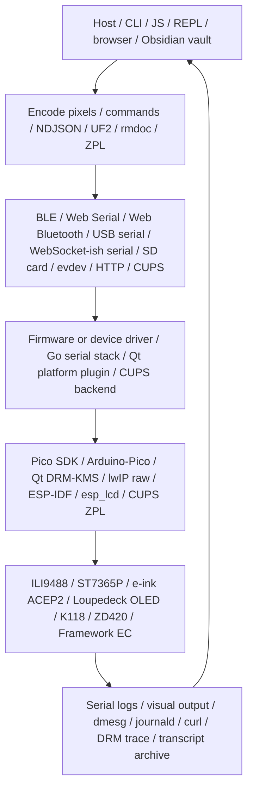

# Hardware Partition B: reMarkable / Loupedeck / PicoCalc / Adjacent Devices

## Executive summary

- Investigated partition B of the hardware topic slice: every non-ESP-firmware physical-device project in `sources/01-hardware-embedded-esp32.md`. This is the half of the hardware map that does NOT use ESP-IDF as its primary firmware stack.
- Four project arcs dominate the partition:
  1. **PicoCalc** (RP2040/RP2350 → ESP32-P4 migration) — uLisp firmware, CMake modularization, UF2 loader, Pico SDK display bring-up, CYW43 WiFi debugging, ESP32-P4 board replacement.
  2. **reMarkable Paper Pro** — DRM/KMS, Ghidra reverse engineering of `EPFramebuffer`, evdev pen input, remarquee cloud sync, sync15 schema V4 bug, Obsidian-to-reMarkable pipeline.
  3. **Loupedeck Live** — Go serial/WebSocket driver, backpressure-safe writer, region-coalescing renderer, goja JS runtime, xgoja HTTP API server.
  4. **Adjacent physical devices** — Cardputer ADV (ESP32-S3 + Web Serial/BLE), Zebra ZD420 thermal label printer (CUPS/ZPL), Framework laptop false-battery shutdown.
- Concept-map spine is uniform: `host/CLI/JS/REPL -> transport (serial/BLE/HTTP/USB/SD/evdev) -> firmware or driver -> HAL (Pico SDK / Qt DRM / Go serial / ESP-IDF / CUPS) -> physical device -> observable feedback -> host`. The distinguishing axis is which HAL and transport the arc uses, not whether it is "embedded."
- Strongest recurring concepts are: region coalescing / dirty rectangles, owner-thread runtime safety, transport-bound pacing, manual DC/CS/SPI-baud discipline, content-addressed cloud sync, false-telemetry failure modes, and reverse-engineered proprietary display stacks.
- Open the **Start Here** files first: PicoCalc UF2 loader (bootloader story), Loupedeck Render Scheduler (transport-bound renderer story), and reMarkable Paper Pro Platform Architecture (display stack story).

## Scope and search method

- Corpus: Markdown reports under `Projects/2026/{03,04,05,06}/` taken from the partition-B section of `sources/01-hardware-embedded-esp32.md` (PicoCalc, reMarkable, Loupedeck, Cardputer, Zebra, Framework).
- Excluded (covered by partition A): PaperS3, AtomS3R, Tab5, M5Dial, M5StackChan, and all ESP-IDF/M5Stack firmware reports.
- Read approach: deeply read canonical architecture reports (full reads of 100+ lines each) for the four main arcs. For smaller/adjacent reports (Cardputer, Zebra, Framework, Remarquee minor reports, Loupedeck SVG/FPS articles), I did targeted reads of the first 60–90 lines (heading-scanned + summary block) plus mermaid/architecture sections. I read enough of each file to confirm architectural shape and extract design invariants; I did not exhaustively read every line of every file.
- Selection rule: deeply read files that define architecture invariants or canonical pin/state-machine facts. Heading-scan files that describe adjacent or already-redundant information.

## Evidence ledger

| Path | Evidence level | Lines / basis | Cluster | Why it matters |
|---|---|---|---|---|
| `Projects/2026/04/07/ARTICLE - Key Findings - ReMarkable Paper Pro Platform Architecture.md` | read | lines 1-145 | reMarkable Paper Pro | Canonical display stack and evdev pen facts. |
| `Projects/2026/04/07/PROJ - Paper Pro E-Ink - DRM KMS Fast Mode Investigation.md` | read | lines 1-140 | reMarkable Paper Pro | DRM/KMS atomic commit path + `drm_spy.so`. |
| `Projects/2026/04/07/PROJ - Paper Pro E-Ink - Ghidra Reverse Engineering of libqsgepaper.so.md` | read | lines 1-200 | reMarkable Paper Pro | `EPFramebuffer` hierarchy, EPContentMap, EPScreenModeMap. |
| `Projects/2026/04/07/PROJ - Paper Pro E-Ink - Pen Input and SDK Build Fix.md` | read | lines 1-150 | reMarkable Paper Pro | `EvdevPenReader`, Ferrari SDK Qt 6.8.2 breakage. |
| `Projects/2026/04/06/ARTICLE - Playbook - Building E-Ink Drawing Apps for the reMarkable Paper Pro.md` | heading-scanned | lines 1-80 | reMarkable Paper Pro | Playbook recapping evdev-pen pattern. |
| `Projects/2026/04/25/ARTICLE - The rmapi Sync15 Schema V4 Invalid Hash Bug - A Deep Technical Dive.md` | read | lines 1-300 | reMarkable cloud sync | sync15 protocol, V3 vs V4 hash, reflection workaround. |
| `Projects/2026/05/04/ARTICLE - Obsidian to reMarkable Sync - Native Delta Upload and Vault Report Pipeline.md` | read | lines 1-300 | reMarkable cloud sync | `remarquee upload sync` planner, parallel pandoc, pandoc `#` filename bug. |
| `Projects/2026/03/19/PROJ - Remarquee - reMarkable Toolkit.md` | heading-scanned | lines 1-80 | reMarkable cloud sync | Toolkit architecture overview. |
| `Projects/2026/03/28/PROJ - Remarquee - V6 Render Overlay Y-Placement Bug.md` | heading-scanned | lines 1-80 | reMarkable cloud sync | Top-origin vs bottom-origin coordinate bug. |
| `Projects/2026/04/07/PROJ - reMarkable Cloud Activity Timeline.md` | heading-scanned | lines 1-80 | reMarkable cloud sync | CRDT-vs-wall-clock timestamp field trap. |
| `Projects/2026/04/10/PROJ - reMarkable Book Indexing - Using kimi-k2p5 and remarquee to catalog programming books.md` | heading-scanned | lines 1-80 | reMarkable cloud sync | Book cataloging using `remarquee cloud ls` + jq. |
| `Projects/2026/04/11/ARTICLE - Loupedeck - Render Scheduler, Region Coalescing, and Display Blit Path.md` | read | lines 1-280 | Loupedeck renderer | Display.Draw two-message command, keyed invalidation, latest-wins coalescing, writer ownership. |
| `Projects/2026/04/11/ARTICLE - Loupedeck - Backpressure-Safe Go Frontend Deep Dive.md` | read | lines 1-280 | Loupedeck transport | Root package `github.com/go-go-golems/loupedeck`, listener fanout, single writer goroutine. |
| `Projects/2026/04/11/ARTICLE - Loupedeck - Goja JavaScript Runtime and API Deep Dive.md` | read | lines 1-300 | Loupedeck runtime | Owner-thread goja, reactive runtime, retained UI model, host/anim/easing modules. |
| `Projects/2026/04/22/ARTICLE - Project Report - Tracing the Loupedeck Serial Bug with Transcript Analysis.md` | read | lines 1-220 | Loupedeck transport | `ResetInputBuffer` fix, transcript archaeology with go-minitrace. |
| `Projects/2026/05/31/ARTICLE - Loupedeck Tile Rendering - How Pixels Get From JavaScript to Hardware, and Why Multi-Line Text Was Broken.md` | read | lines 1-280 | Loupedeck renderer | Retained-tile vs surface paths, `font.Drawer.DrawString` newline bug, per-tile invalidation. |
| `Projects/2026/06/01/ARTICLE - LDCK-API-001 - Building a Loupedeck HTTP API with xgoja.md` | read | lines 1-400 | Loupedeck runtime | xgoja `serve` command, express REST, SQLite event polling, `loupedeck/hw` module. |
| `Projects/2026/04/11/ARTICLE - Loupedeck - Optimizing Button Animation FPS on a Serial WebSocket Device.md` | heading-scanned | lines 1-90 | Loupedeck renderer | Tile-vs-full-screen FPS table, transport-bound pacing. |
| `Projects/2026/04/12/ARTICLE - Loupedeck - Font and Text Rendering Pipeline and Kanji Support.md` | heading-scanned | lines 1-90 | Loupedeck renderer | Two text paths (root-package opentype vs runtime/gfx `basicfont.Face7x13`). |
| `Projects/2026/04/13/PROJ - Loupedeck - Architecture Cleanup and Performance Report.md` | heading-scanned | lines 1-90 | Loupedeck renderer | `pkg/device` split, dead widget/value stack removal, 40 ms flush ceiling. |
| `Projects/2026/04/11/ARTICLE - Loupedeck - Loading, Animating, and Displaying SVG Button Banks.md` | heading-scanned | lines 1-80 | Loupedeck renderer | HTML/SVG extraction → normalization → sprite cache → tile bank animation. |
| `Projects/2026/04/11/ARTICLE - Loupedeck - Future Directions for the Render Scheduler and Dynamic UI Runtime.md` | heading-scanned | lines 1-60 | Loupedeck renderer | Overlap-aware dirty-rectangle merging, priority regions, ack-gating. |
| `Projects/2026/04/12/ARTICLE - Loupedeck - 12-Tile Cyb-Ito Performance Investigation.md` | heading-scanned | lines 1-60 | Loupedeck renderer | Tile vs full-page tradeoff, `surface.batch()` snapshot bug. |
| `Projects/2026/05/05/ARTICLE - PicoCalc UF2 Loader - Two-Stage Bootloader Deep Dive.md` | read | lines 1-300 | PicoCalc bootloader | Stock vs `pelrun/uf2loader`, proginfo magic, two-step design. |
| `Projects/2026/05/05/PROJ - uLisp PicoCalc - From Cross-Compilation to a Lisp Machine in Your Hand.md` | read | lines 1-280 | PicoCalc firmware | Three-processor model, `arduino-cli` build, CLion config, 7,793-line `.ino`. |
| `Projects/2026/05/05/ARTICLE - PicoCalc uLisp REPL Window - Backbuffer Rendering and RAM-Conscious UI.md` | read | lines 1-300 | PicoCalc UI | Transcript + edit buffer + dirty text-cell renderer, 32×53 grid, RAM tradeoff. |
| `Projects/2026/05/06/PROJ - uLisp PicoCalc Firmware Split - CMake Modularization Report.md` | read | lines 1-400 | PicoCalc firmware | CMake → Arduino-Pico bridge, flat module split, `ulisp_fwd_decls.h` removal. |
| `Projects/2026/05/07/PROJ - Standalone Pico 2W Web Server - Pico SDK Deep Dive.md` | read | lines 1-300 (truncated) | PicoCalc WiFi | Pico SDK direct CYW43, raw-lwIP HTTP, `cyw43_arch_init`, SoftAP DHCP/DNS. |
| `Projects/2026/05/09/ARTICLE - PicoCalc Pico SDK Display Bringup - ILI9488 Serial REPL Deep Dive.md` | read | lines 1-300 | PicoCalc display | Address-window protocol, init profiles, SPI baudrate quantization at 75 MHz. |
| `Projects/2026/05/19/ARTICLE - Pico 2 W WiFi Association Debugging - CYW43 FreeRTOS Deep Dive.md` | read | lines 1-300 | PicoCalc WiFi | CYW43 async event tracing, `SET_SSID,3` / `AUTH,5` / `PSK_SUP,4,14` failure modes, BSSID pinning. |
| `Projects/2026/06/01/ARTICLE - ESP32-P4-WIFI6 as PicoCalc MCU - Deep Technical Dive.md` | read | lines 1-400 (truncated at 943/1615) | PicoCalc ESP32-P4 migration | Waveshare ESP32-P4-WIFI6, GPIO budget, CH343 console, ESP-Hosted SDIO, same-position physical adapter, keyboard at GPIO50/49. |
| `Projects/2026/06/01/ARTICLE - ESP32-P4 PicoCalc Display Optimization - Queued SPI and Dirty Rectangles.md` | read | lines 1-280 | PicoCalc ESP32-P4 migration | `SPI_CLK_SRC_SPLL` for 80 MHz, 32 KiB DMA chunks, queued double-buffer, dirty-region benchmarks. |
| `Projects/2026/03/29/PROJ - Cardputer ADV Animation UI - Experimental Minimap Firmware.md` | heading-scanned | lines 1-60 | Adjacent: Cardputer | `M5Unified` + `cardputer_kb::UnifiedScanner`, scroll/easing model. |
| `Projects/2026/04/02/PROJ - Cardputer Web Demo - Bluetooth Architecture And Bringup.md` | heading-scanned | lines 1-80 | Adjacent: Cardputer | Same NDJSON over Web Serial and Web Bluetooth, transport abstraction validated. |
| `Projects/2026/04/02/PROJ - Cardputer Web Serial Demo - Architecture And Build.md` | heading-scanned | lines 1-80 | Adjacent: Cardputer | Raw JS vs Go-WASM protocol engines, Web Serial transport. |
| `Projects/2026/04/02/PROJ - Cardputer Web Serial Demo - Technical Project Report.md` | heading-scanned | lines 1-80 | Adjacent: Cardputer | Hardware-verified Cardputer ADV NDJSON over USB Serial/JTAG. |
| `Projects/2026/05/22/ARTICLE - Printing to a Zebra ZD420 Thermal Label Printer from Linux over USB.md` | heading-scanned | lines 1-80 | Adjacent: Zebra | CUPS ZPL driver, `^GFA` 1-bit packed encoding, `^PW`/`^LL` label size. |
| `Projects/2026/06/19/PROJECT REPORT - Framework False Battery Shutdown - Kernel Lockdown and Power Policy Deep Dive.md` | read | lines 1-300 | Adjacent: Framework | UPower `CriticalPowerAction=HybridSleep` + Secure Boot lockdown hibernation restriction. |

## Projects and reports found

### Arc 1: PicoCalc / RP2040/RP2350 / Pico SDK / CYW43

- `Projects/2026/05/05/ARTICLE - PicoCalc UF2 Loader - Two-Stage Bootloader Deep Dive.md` — status: current. Documents `pelrun/uf2loader` v2.4.1 replacing the stock ClockworkPi Bootloader v1.0; introduces two-stage flash-bootloader + SD-card-menu-UF2 design.
- `Projects/2026/05/05/PROJ - uLisp PicoCalc - From Cross-Compilation to a Lisp Machine in Your Hand.md` — status: current (Arduino-Pico + native C99 port). uLisp 4.8f running on PicoCalc, three-processor model (RP2040 + STM32F103 keyboard + ILI9488), CLion config generator.
- `Projects/2026/05/05/ARTICLE - PicoCalc uLisp REPL Window - Backbuffer Rendering and RAM-Conscious UI.md` — status: current. REPL backbuffer + edit buffer + dirty text-cell renderer; 32×53 cell grid replaces 204,800-byte pixel framebuffer; heap shrunk from `(23000-SDSIZE)` to `(18000-SDSIZE)`.
- `Projects/2026/05/06/PROJ - uLisp PicoCalc Firmware Split - CMake Modularization Report.md` — status: current. CMake → Arduino-Pico bridge, flat `.h/.cpp` module split, generated `ulisp_fwd_decls.h` deleted, broad builtin/runtime family split.
- `Projects/2026/05/07/PROJ - Standalone Pico 2W Web Server - Pico SDK Deep Dive.md` — status: experimental (diagnostic control surface). Direct Pico SDK + raw-lwIP HTTP server; CYW43 scan/connect/AP/HTTP command loop; proved station-mode can reach `CYW43_LINK_UP` on the same hardware that uLisp/Arduino-Pico reported disconnected.
- `Projects/2026/05/09/ARTICLE - PicoCalc Pico SDK Display Bringup - ILI9488 Serial REPL Deep Dive.md` — status: current. Standalone RP2350 firmware talks ILI9488 without Arduino/TFT_eSPI; `profile minimal`, `invert on`, RGB565/RGB666 both work, actual SPI baudrate quantizes to 75 MHz.
- `Projects/2026/05/09/ARTICLE - PicoCalc Pico SDK Firmware Deep Dive - Drawing Keyboard and REPL.md` — status: title-only (in inventory, not deeply read). Adjacent keyboard/REPL bring-up work.
- `Projects/2026/05/19/ARTICLE - Pico 2 W WiFi Association Debugging - CYW43 FreeRTOS Deep Dive.md` — status: current. FreeRTOS/lwIP SYS mode served HTTP at `192.168.0.41`; failures are pre-DHCP: `SET_SSID,3` (no networks), `AUTH,5` (no ACK), `PSK_SUP,4,14` (deauth before keyed).
- `Projects/2026/06/01/ARTICLE - ESP32-P4-WIFI6 as PicoCalc MCU - Deep Technical Dive.md` — status: current (active migration). Waveshare ESP32-P4-WIFI6 boots ESP-IDF v5.4.2, detects 32 MB PSRAM at 200 MHz, ESP-Hosted SDIO drives C6 Wi-Fi 6; same-position physical adapter puts keyboard on GPIO50/49 and LCD on GPIO3/2/7/24/25.
- `Projects/2026/06/01/ARTICLE - ESP32-P4 PicoCalc Display Optimization - Queued SPI and Dirty Rectangles.md` — status: current. `SPI_CLK_SRC_SPLL` unlocks actual 80 MHz, 32 KiB DMA chunks bring full-screen fills to 21 ms, queued double-buffer reduces pseudo-text redraw from 950 ms to 568 ms per 20 screens.

### Arc 2: reMarkable / Paper Pro / cloud sync

- `Projects/2026/03/17/PROJ - reMarkable Cleanup - Tablet Root Reorganization.md` — status: title-only. (Not deeply read; tablet root cleanup workflow.)
- `Projects/2026/03/19/PROJ - Remarquee - reMarkable Toolkit.md` — status: current. Go CLI wrapping rmapi; upload md/source-bundle, `rmdoc render-v6`/`render-legacy`, OCR, device commands, rmdsl.
- `Projects/2026/03/28/PROJ - Remarquee - Markdown Upload Polish.md` — status: title-only. Polish work on markdown upload command.
- `Projects/2026/03/28/PROJ - Remarquee - V6 Render Overlay Y-Placement Bug.md` — status: historical (fixed). Top-origin `remarks` math copied into bottom-origin PDF content stream without conversion; fixed in `pkg/rmdoc/render/v6_merge_background.go`.
- `Projects/2026/04/06/ARTICLE - Playbook - Building E-Ink Drawing Apps for the reMarkable Paper Pro.md` — status: current. Playbook for evdev-pen drawing apps; recapitulates the missing `QTabletEvent` fact.
- `Projects/2026/04/06/ARTICLE - Playbook - Building E-Ink Drawing Apps for the ReMarkable Paper Pro.md` — status: title-only. Duplicate/alternate casing.
- `Projects/2026/04/06/PROJ - Paper Pro Pen Probe - reMarkable E-Ink Drawing and Pen Input.md` — status: title-only. Parent project note for the evdev pen work.
- `Projects/2026/04/07/ARTICLE - Key Findings - ReMarkable Paper Pro Platform Architecture.md` — status: current. Canonical platform stack; no `/dev/fb0`, `/dev/dri/card0` only, `libepaper.so`/`libqsgepaper.so`/`xochitl`/DRM KMS.
- `Projects/2026/04/07/PROJ - Paper Pro E-Ink - DRM KMS Fast Mode Investigation.md` — status: current. `drm_spy.so` LD_PRELOAD; ~4090 atomic commits during drawing session; 405×1084 quarter-resolution dumb buffers.
- `Projects/2026/04/07/PROJ - Paper Pro E-Ink - Ghidra Reverse Engineering of libqsgepaper.so.md` — status: current. `EPFramebuffer ← EPFramebufferSwtcon ← EPFramebufferAcep2`; `EPContentMap` 4-slot classifier (mono/grayscale/color), `EPScreenModeMap` 6 modes (Pen/Mono/Animation/UI/Content/Sleep).
- `Projects/2026/04/07/PROJ - Paper Pro E-Ink - Pen Input and SDK Build Fix.md` — status: current. `EvdevPenReader` reading `/dev/input/event2` with `EVIOCGRAB`; Qt 6.8.2 `QQuickPaintedItem::update()` overload removal.
- `Projects/2026/04/07/PROJ - reMarkable Cloud Activity Timeline.md` — status: experimental. CRDT-vs-wall-clock trap: `.content` cPages `Timestamp` fields are CRDT IDs, not wall clock; only `.metadata` `lastModified`/`lastOpened` give real time.
- `Projects/2026/04/10/PROJ - reMarkable Book Indexing - Using kimi-k2p5 and remarquee to catalog programming books.md` — status: completed. 90 programming books extracted via `remarquee cloud ls --with-glaze-output --output json` and jq title normalization.
- `Projects/2026/04/25/ARTICLE - The rmapi Sync15 Schema V4 Invalid Hash Bug - A Deep Technical Dive.md` — status: current. Cloud now rejects V3 root indices with `400 {"message":"invalid hash"}`; reflection workaround forces `SchemaVersion="4"` via `reflect.NewAt(...).Elem()`.
- `Projects/2026/05/04/ARTICLE - Obsidian to reMarkable Sync - Native Delta Upload and Vault Report Pipeline.md` — status: current. `remarquee upload sync` plans before conversion, `--workers N` parallelizes pandoc/xelatex, 265 reports uploaded live; pandoc `#` filename bug fixed by using fixed helper filenames.

### Arc 3: Loupedeck physical-device UI/rendering

- `Projects/2026/04/11/PROJ - Loupedeck Live Hello World - Serial Go Driver.md` — status: title-only. Original driver experiment (not deeply read).
- `Projects/2026/04/11/ARTICLE - Loupedeck - Backpressure-Safe Go Frontend Deep Dive.md` — status: current. Root `github.com/go-go-golems/loupedeck` package; multi-listener fanout, single outbound writer goroutine, B-lite pacing.
- `Projects/2026/04/11/ARTICLE - Loupedeck - Future Directions for the Render Scheduler and Dynamic UI Runtime.md` — status: experimental. Roadmap: overlap-aware dirty-rectangle scheduling, retained framebuffer, priority regions, ack-gating.
- `Projects/2026/04/11/ARTICLE - Loupedeck - Goja JavaScript Runtime and API Deep Dive.md` — status: current. Owner-thread goja runtime + pure-Go reactive runtime + retained tile UI + host runtime + anim runtime; JS does not own transport.
- `Projects/2026/04/11/ARTICLE - Loupedeck - Loading, Animating, and Displaying SVG Button Banks.md` — status: current. HTML/SVG extraction → normalization → sprite cache → tile bank animation; `LOUPE-004`.
- `Projects/2026/04/11/ARTICLE - Loupedeck - Optimizing Button Animation FPS on a Serial WebSocket Device.md` — status: current. Full-screen 36 FPS vs single 90×90 tile 320 FPS vs 12 tiles aggregate 288 FPS.
- `Projects/2026/04/11/ARTICLE - Loupedeck - Render Scheduler, Region Coalescing, and Display Blit Path.md` — status: current. `displayDrawCommand` groups `WriteFramebuff` + `Draw`; latest-wins keyed invalidation per `<display>:<x>:<y>:<w>:<h>`.
- `Projects/2026/04/12/ARTICLE - Loupedeck - 12-Tile Cyb-Ito Performance Investigation.md` — status: current. 12-tile mode penalized by per-command pacing; full-page mode exposed mid-frame shared-surface snapshot bug → `surface.batch()`.
- `Projects/2026/04/12/ARTICLE - Loupedeck - Font and Text Rendering Pipeline and Kanji Support.md` — status: current. Two text paths: root-package opentype vs `runtime/gfx` `basicfont.Face7x13`; kanji requires OpenType CJK font plumbing.
- `Projects/2026/04/13/PROJ - Loupedeck - Architecture Cleanup and Performance Report.md` — status: current. `pkg/device` split, dead widget/value stack deleted, `--flush-interval` exposes 40 ms scheduler ceiling.
- `Projects/2026/04/22/ARTICLE - Project Report - Tracing the Loupedeck Serial Bug with Transcript Analysis.md` — status: current. Stale websocket binary frames in OS serial read buffer caused `malformed HTTP response "\x82..."`; fix is `ResetInputBuffer()` after `serial.Open()`.
- `Projects/2026/05/31/ARTICLE - Loupedeck Tile Rendering - How Pixels Get From JavaScript to Hardware, and Why Multi-Line Text Was Broken.md` — status: current. Per-tile invalidation already existed in Go but was invisible from JS; `font.Drawer.DrawString` treats `\n` as missing glyph.
- `Projects/2026/06/01/ARTICLE - LDCK-API-001 - Building a Loupedeck HTTP API with xgoja.md` — status: current. xgoja `serve` command, express REST + SQLite event polling, `loupedeck/hw` module split from `loupedeck/ui`.

### Arc 4: Other physical-device / firmware-adjacent hits

- `Projects/2026/03/29/PROJ - Cardputer ADV Animation UI - Experimental Minimap Firmware.md` — status: experimental. M5Stack Cardputer ADV (`M5Unified`) animated minimap firmware with easing scroll model.
- `Projects/2026/04/02/PROJ - Cardputer Web Demo - Bluetooth Architecture And Bringup.md` — status: current. Same NDJSON protocol over Web Serial AND Web Bluetooth; validates transport/protocol separation.
- `Projects/2026/04/02/PROJ - Cardputer Web Serial Demo - Architecture And Build.md` — status: current. Raw JS vs Go-WASM protocol engines behind the same UI; ESP32-S3 USB Serial/JTAG.
- `Projects/2026/04/02/PROJ - Cardputer Web Serial Demo - Technical Project Report.md` — status: current. Hardware-verified Cardputer ADV with `get_info`/`ping`/`set_screen_text`/`set_ui_state`/`clear_screen`/`beep`.
- `Projects/2026/05/22/ARTICLE - Printing to a Zebra ZD420 Thermal Label Printer from Linux over USB.md` — status: current. CUPS ZPL driver, `^GFA` 1-bit packed encoding (8 pixels per byte MSB-first), `^PW`/`^LL` for 4×6 label size.
- `Projects/2026/06/19/PROJECT REPORT - Framework False Battery Shutdown - Kernel Lockdown and Power Policy Deep Dive.md` — status: current. False low-battery telemetry triggered `CriticalPowerAction=HybridSleep` → kernel lockdown hibernation restriction → orderly poweroff.

## Representative evidence

### PicoCalc UF2 Loader — bootloader format mismatch
- Claim: The stock ClockworkPi Bootloader v1.0 validates `.bin` files at `SD_BOOT_FLASH_OFFSET = 200*1024` by reading the vector table — first word must be a stack pointer in SRAM, second word must be a reset vector near `0x10032000`. Normal UF2-to-BIN conversion fails because Arduino emits the RP2040 second-stage bootloader bytes first, not a vector table.
- Evidence: `Projects/2026/05/05/ARTICLE - PicoCalc UF2 Loader - Two-Stage Bootloader Deep Dive.md` lines 41-110, `is_valid_application` validation code.
- Map implication: The "bootloader format mismatch" failure-mode node should be a first-class concept that links stock bootloader, uf2loader, and any future PicoCalc app loader work.

### PicoCalc ESP32-P4 — same-position physical adapter
- Claim: The Waveshare ESP32-P4-WIFI6 board cannot be a drop-in replacement for the Pico because the "function-optimized" pin labels (e.g. GPIO7=SDA, GPIO28-31=SPI2 IO-MUX) do not match the physical position of Pico socket pins on the adapter. Keyboard southbridge SDA/SCL actually lands on GPIO50/GPIO49, not GPIO7/GPIO8.
- Evidence: `Projects/2026/06/01/ARTICLE - ESP32-P4-WIFI6 as PicoCalc MCU - Deep Technical Dive.md` second deep dive section, full pin-mapping table.
- Map implication: A "physical adapter pin mapping" failure mode — board labels ≠ adapter positions — is a distinct concept from "wrong GPIO chosen" and applies to any future interposer work.

### reMarkable Paper Pro — no `/dev/fb0`
- Claim: All rm1/rm2 reverse-engineering approaches (`libremarkable`, `rmkit`, `remarkable2-framebuffer`) assume `/dev/fb0` and MXCFB/EPDC ioctls. The Paper Pro exposes only `/dev/dri/card0`. Xochitl allocates quarter-resolution dumb buffers (405×1084) and uses `DRM_IOCTL_MODE_ATOMIC` for the fast path.
- Evidence: `Projects/2026/04/07/ARTICLE - Key Findings - ReMarkable Paper Pro Platform Architecture.md` lines 20-83.
- Map implication: "Assuming framebuffer exists" is a distinct failure-mode node from "wrong transport chosen" and links the reMarkable arc to any future e-ink display work.

### reMarkable Paper Pro — pen input via evdev
- Claim: The epaper Qt platform plugin (`libepaper.so`) discovers input devices via udev tags `Device_Touchpad|Device_Touchscreen` only; it never looks for `Device_Tablet`, so the pen at `/dev/input/event2` (udev tag `ID_INPUT_TABLET=1`) is invisible. Xochitl bypasses Qt input entirely via its own `PenInputHandler`. Third-party apps must `open("/dev/input/event2")` with `EVIOCGRAB` and parse evdev directly.
- Evidence: `Projects/2026/04/07/PROJ - Paper Pro E-Ink - Pen Input and SDK Build Fix.md` lines 41-90.
- Map implication: "Pen requires raw evdev" is a hard architectural constraint, not a missing SDK convenience.

### Loupedeck — backpressure-safe writer + keyed invalidation
- Claim: Drawing and sending are separated; repeated same-region draws collapse under latest-wins invalidation keyed by `<display>:<x>:<y>:<w>:<h>` before reaching the single outbound writer goroutine. One logical display update is two protocol messages (`WriteFramebuff` + `Draw`), grouped as one `displayDrawCommand`.
- Evidence: `Projects/2026/04/11/ARTICLE - Loupedeck - Render Scheduler, Region Coalescing, and Display Blit Path.md` lines 21-110, `displayDrawCommand` struct.
- Map implication: "Region coalescing" and "single-writer pacing" are reusable concepts that recur in M5StackChan (dirty rectangles) and PicoCalc ESP32-P4 (queued SPI).

### Loupedeck — owner-thread goja + retained UI
- Claim: JavaScript never pushes a framebuffer directly; scripts mutate signals and retained tile state. Hardware events post work onto `runtimeowner.Runner`, which executes JS on a single owner thread. The retained renderer flushes only dirty tiles to the existing Go writer.
- Evidence: `Projects/2026/04/11/ARTICLE - Loupedeck - Goja JavaScript Runtime and API Deep Dive.md` lines 1-100.
- Map implication: "Go-backed JavaScript DSL" and "owner-thread runtime" are cross-slice bridge concepts to the go-go-goja/xgoja topic (sources/02).

### Loupedeck — serial bug via stale websocket frames
- Claim: USB serial has no clean disconnect signal. The Loupedeck keeps transmitting websocket-framed binary data after the client closes the port; the OS driver buffers it. On reconnect, the gorilla/websocket handshake reads `\x82` (BinaryMessage frame header) instead of `HTTP/1.1 101`. Fix is `p.ResetInputBuffer()` after `serial.Open()`.
- Evidence: `Projects/2026/04/22/ARTICLE - Project Report - Tracing the Loupedeck Serial Bug with Transcript Analysis.md` lines 35-110.
- Map implication: "USB serial is stateful across disconnects" is a failure-mode node that cross-links to Pico 2W CYW43 debugging and the SToMS3R thermal printer UART pacing work (partition A).

### reMarkable cloud — sync15 V3 vs V4 hash
- Claim: The reMarkable cloud stores documents as a content-addressed Merkle tree. Schema V3 computes the root hash by sorting entries and concatenating binary hashes; V4 simply hashes the full text of the index file. The cloud now rejects V3 with `400 {"message":"invalid hash"}`. Workaround is reflection: `reflect.NewAt(type, unsafe.Pointer(addr)).Elem()` to set the unexported `SchemaVersion` field to `"4"`.
- Evidence: `Projects/2026/04/25/ARTICLE - The rmapi Sync15 Schema V4 Invalid Hash Bug - A Deep Technical Dive.md` lines 60-180.
- Map implication: "Schema drift" failure-mode node connects reMarkable cloud sync to the broader "failure-mode-driven design" cross-slice concept.

## Topic architecture / spine

Partition B's recurring layered architecture:



Per-arc spine variants:
- **PicoCalc** uses UF2 + SD card as the deployment transport, Pico SDK / Arduino-Pico as HAL, ILI9488 (RP2040/RP2350) or ST7365P (ESP32-P4) as the device.
- **reMarkable** uses evdev (pen) + DRM/KMS (display) + HTTP/REST (cloud) as transports, Qt platform plugin + `libqsgepaper.so` as HAL, ACEP2 e-ink as the device.
- **Loupedeck** uses serial-over-USB websocket as transport, Go writer + renderer as HAL, 360×270 OLED as device, optionally elevated through goja/xgoja JS runtimes.
- **Adjacent** spans Web Serial/BLE (Cardputer), CUPS/USB (Zebra), UPower/EC sysfs (Framework).

## Clusters and subclusters

### Cluster A: PicoCalc firmware + bootloader + display stack
- Subclusters: uLisp firmware (Arduino-Pico build, CLion, source index); UF2 loader (stock vs `pelrun/uf2loader`); CMake modularization (flat `.h/.cpp` split, `ulisp_fwd_decls.h` removal); Pico SDK display bring-up (ILI9488, init profiles); RP2040→RP2350/Pico 2W migration; ESP32-P4 board replacement (same-position adapter, ESP-Hosted SDIO, CH343 console); CYW43 WiFi debugging (Pico SDK direct, FreeRTOS SYS mode, async event trace); uLisp REPL window (transcript + edit buffer + dirty text-cell renderer).
- Invariant: "Firmware stays thin and observable; host does heavy work (pandoc, CLion config, native C99 REPL)."

### Cluster B: reMarkable Paper Pro reverse engineering + cloud sync
- Subclusters: Platform architecture (no `/dev/fb0`, DRM/KMS, xochitl); `EPFramebuffer` class hierarchy (Ghidra); pen input via evdev; `drm_spy.so` interposition; rmapi sync15 V3→V4 hash; remarquee toolkit (Go CLI, rmdoc render, OAuth refresh); Obsidian-to-reMarkable delta upload; cloud activity timeline (CRDT-vs-wall-clock trap); book indexing (jq + LLM-assisted cataloging).
- Invariant: "The Paper Pro's fast e-ink path is a reverse-engineering problem, not an SDK limitation."

### Cluster C: Loupedeck Go + JS + transport
- Subclusters: Backpressure-safe Go frontend (single writer, listener fanout, paced transport); render scheduler (keyed invalidation, latest-wins coalescing, `displayDrawCommand` two-message grouping); goja JS runtime (owner-thread, reactive runtime, retained UI); SVG button banks (HTML extraction, sprite cache); xgoja HTTP API server (`serve` command, `loupedeck/hw` vs `loupedeck/ui` split); serial bug root cause (`ResetInputBuffer`); FPS optimization (tile vs full-screen benchmarks); tile rendering (multi-line text bug, per-tile surfaces already existed); cleanup (`pkg/device` split, dead widget removal).
- Invariant: "JavaScript owns state and UI description; Go owns rendering, pacing, and transport safety."

### Cluster D: Adjacent physical devices
- Subclusters: Cardputer ADV (ESP32-S3 + `M5Unified`, Web Serial + Web Bluetooth, NDJSON, Raw JS vs Go-WASM engines); Zebra ZD420 (CUPS ZPL driver, `^GFA` 1-bit packing, `^PW`/`^LL`); Framework laptop (UPower policy, Secure Boot lockdown, EC checksum errors, `tracker-miner-f` as observer).
- Invariant: "These are physical-device projects whose failure modes (transport statefulness, false telemetry, EC noise) drive architecture decisions just as much as their primary feature."

## Recurring concepts, technologies, and failure modes

### Concepts
- Region coalescing / latest-wins keyed invalidation
- Dirty rectangles / dirty text cells / dirty tiles
- Owner-thread runtime (goja single-threaded access rule)
- Retained UI model (declare what to show, not how to send)
- Backpressure-safe single writer
- Two-step bootloader (flashed stage3 + SD-card menu UF2)
- Content-addressed Merkle tree (sync15)
- Quarter-resolution dumb buffers (e-ink optimization)
- Same-position physical adapter (board labels ≠ adapter positions)
- Diagnostic-first firmware (control surface, not product)
- Plan-before-convert (delta sync planner)
- Failure-mode-driven design (every arc has a concrete bug that shaped architecture)

### Technologies
- Pico SDK 2.1.0/2.2.0, Arduino-Pico core 4.5.0/5.6.0
- ESP-IDF v5.4.2, ESP32-P4 rev v1.3, ESP-Hosted 1.4.0, `esp_wifi_remote`
- CYW43 driver, lwIP raw TCP, FreeRTOS SYS mode
- ILI9488 / ST7365P display controllers, `hardware_spi`, `esp_lcd_panel_io_spi`
- `pelrun/uf2loader` v2.4.1, `picotool`, BOOTSEL mode
- Qt 6.8.2 (Ferrari SDK 5.6.75), `libepaper.so`, `libqsgepaper.so`, DRM/KMS, `DRM_IOCTL_MODE_ATOMIC`
- evdev, `EVIOCGRAB`, `QSocketNotifier`
- Ghidra headless, `aarch64-linux-gnu-objdump`, RTTI/vtable analysis
- rmapi (ddvk/rmapi), sync15 protocol, pandoc/xelatex, Glazed config plan
- Go, gorilla/websocket, `go.bug.st/serial`, `golang.org/x/image/font`, `basicfont.Face7x13`, opentype
- goja, xgoja, `runtimeowner.Runner`, reactive runtime, go-minitrace + DuckDB transcript analysis
- CUPS, ZPL (`^GFA`, `^PW`, `^LL`)
- UPower, systemd-logind, kernel lockdown, Secure Boot, Framework EC

### Failure modes
- Bootloader format mismatch (stock PicoCalc rejects normal UF2-to-BIN)
- Wrong ESP32-P4 console backend (`CONFIG_ESP_CONSOLE_USB_SERIAL_JTAG` vs CH343 UART)
- Function-optimized vs same-position pin mapping confusion
- SPI baudrate quantization (requests >75 MHz all quantize to 75 MHz on RP2350)
- `SPI_CLK_SRC_DEFAULT` resolves to 40 MHz XTAL, capping GPSPI at 20 MHz
- Manual DC GPIO control breaks queued SPI invariants
- CYW43 pre-DHCP association failures (`SET_SSID,3`, `AUTH,5`, `PSK_SUP,4,14`)
- No `/dev/fb0` on Paper Pro
- Qt platform plugin missing `QTabletEvent` dispatch
- `EPFramebuffer` lock singleton (only one process owns the display backend)
- sync15 V3 root hash rejected with `400 invalid hash`
- HTTP logging transport truncates body before downstream consumers read it
- USB serial is stateful across disconnects (stale websocket frames in OS buffer)
- `font.Drawer.DrawString` treats `\n` as missing glyph
- Mid-frame snapshot of shared retained surface (fix: `surface.batch()`)
- `systemd-logind` HybridSleep blocked by Secure Boot kernel lockdown
- Framework EC checksum errors + `fw-fanctrl` polling contention
- Pandoc interprets `#` in temporary paths as URL fragment

## Candidate concept-map material

### Nodes

| Node | Type | Confidence | Notes |
|---|---|---|---|
| PicoCalc | project | high | Handheld kit around RP2040/RP2350, now migrating to ESP32-P4. |
| uLisp PicoCalc firmware | project | high | Arduino-Pico + CMake bridge, modular C++ split. |
| UF2 Loader (pelrun) | project | high | Two-stage bootloader; supersedes stock ClockworkPi Bootloader v1.0. |
| Pico SDK display bring-up | project | high | Standalone RP2350 firmware talking ILI9488 without Arduino. |
| Standalone Pico 2W WiFi REPL | project | high | Direct Pico SDK + raw-lwIP HTTP diagnostic firmware. |
| Pico 2W FreeRTOS HTTPD control | project | high | FreeRTOS SYS-mode control firmware for CYW43 association debugging. |
| ESP32-P4 PicoCalc migration | project | high | Waveshare ESP32-P4-WIFI6 board replacing RP2350. |
| reMarkable Paper Pro | platform | high | rm510 "ferrari" — DRM/KMS, ACEP2 e-ink, no framebuffer. |
| EPFramebuffer / EPFramebufferAcep2 | concept | high | Proprietary Qt scenegraph e-ink policy layer above DRM. |
| EPContentMap | concept | high | 4-slot content classifier (mono/grayscale/color). |
| EPScreenModeMap | concept | high | 6 modes: Pen/Mono/Animation/UI/Content/Sleep. |
| EvdevPenReader | concept | high | Direct `/dev/input/event2` reader with `EVIOCGRAB`. |
| Loupedeck Live | platform | high | USB hardware controller, 360×270 OLED, 4×3 tile grid. |
| Loupedeck Go frontend | project | high | Root `github.com/go-go-golems/loupedeck` package. |
| Loupedeck render scheduler | concept | high | Keyed latest-wins invalidation + single writer. |
| Loupedeck goja JS runtime | project | high | Owner-thread goja + reactive runtime + retained tile UI. |
| LDCK-API-001 xgoja server | project | high | xgoja `serve` command + express REST + SQLite event polling. |
| remarquee | project | high | Go CLI for reMarkable cloud sync, rmdoc render, OCR. |
| rmapi sync15 protocol | concept | high | Content-addressed Merkle tree of SHA-256 hashed blobs. |
| Cardputer ADV Web Serial/BLE demo | project | high | NDJSON over Web Serial AND Web Bluetooth; Raw JS vs Go-WASM engines. |
| Zebra ZD420 ZPL printing | project | high | CUPS ZPL driver, `^GFA` 1-bit packed encoding. |
| Framework false-battery shutdown | project | high | UPower `HybridSleep` + Secure Boot lockdown + EC checksum errors. |
| Region coalescing | concept | high | Recurs in Loupedeck, M5StackChan (partition A), ESP32-P4 PicoCalc. |
| Dirty rectangles / dirty text cells | concept | high | Recurs in PicoCalc uLisp REPL window, ESP32-P4 PicoCalc, Loupedeck tiles. |
| Owner-thread runtime | concept | high | goja single-threaded access rule; cross-slice to xgoja/go-go-goja. |
| Backpressure-safe single writer | concept | high | Loupedeck writer goroutine; conceptually similar to SToMS3R UART buffering. |
| Two-step bootloader | concept | high | Flashed stage3 + SD-card menu UF2. |
| Same-position physical adapter | concept | high | Board labels ≠ adapter positions; trap for PicoCalc → ESP32-P4 migration. |
| Quarter-resolution dumb buffers | concept | high | 405×1084 e-ink optimization on Paper Pro. |
| DRM/KMS atomic commits | concept | high | Paper Pro fast path; `DRM_IOCTL_MODE_ATOMIC`. |
| Content-addressed cloud sync | concept | high | sync15 Merkle tree. |
| Diagnostic-first firmware | concept | high | Pico 2W WiFi REPL as control surface, not product. |
| Plan-before-convert sync | concept | high | `remarquee upload sync` computes delta before pandoc. |
| Pico SDK | technology | high | 2.1.0/2.2.0, `hardware_spi`, `hardware_i2c`, CYW43 arch. |
| Arduino-Pico core | technology | high | Earle Philhower core, `arduino-cli compile`, GCC 14.3.0. |
| ESP-IDF v5.4.2 | technology | high | ESP32-P4 rev v1.3 support, `esp_lcd_panel_io_spi`, ESP-Hosted. |
| Qt 6.8.2 / Ferrari SDK | technology | high | Cross-compile via `eval "$CC ..."`, `aarch64-remarkable-linux-gcc`. |
| Ghidra headless | technology | high | AArch64 ELF reverse engineering of `libqsgepaper.so`. |
| go.bug.st/serial | technology | high | `ResetInputBuffer()` fix for stale websocket frames. |
| gorilla/websocket | technology | high | Loupedeck serial-over-USB websocket framing. |
| goja / xgoja | technology | high | JS runtime + compile-time provider packages. |
| CUPS ZPL driver | technology | high | Built-in CUPS ZPL PPD, `^GFA`/`^PW`/`^LL`. |
| UPower / systemd-logind | technology | high | `CriticalPowerAction=HybridSleep` policy. |
| Bootloader format mismatch | failure-mode | high | Stock PicoCalc rejects normal UF2-to-BIN. |
| Wrong ESP32-P4 console backend | failure-mode | high | `CONFIG_ESP_CONSOLE_USB_SERIAL_JTAG` vs CH343 UART. |
| Function-optimized vs same-position pin mapping | failure-mode | high | Board labels mislead firmware wiring on adapter. |
| SPI baudrate quantization | failure-mode | medium | RP2350 quantizes to 75 MHz; ESP32-P4 XTAL caps GPSPI at 20 MHz until SPLL selected. |
| Manual DC GPIO breaks queued SPI | failure-mode | medium | Queued pixel payload must complete before window/DC changes. |
| CYW43 pre-DHCP association failure | failure-mode | high | `SET_SSID,3`, `AUTH,5`, `PSK_SUP,4,14` event signatures. |
| No `/dev/fb0` on Paper Pro | failure-mode | high | Old rm1/rm2 approaches silently fail. |
| Qt platform plugin missing `QTabletEvent` | failure-mode | high | Pen invisible to Qt apps; must use raw evdev. |
| EPFramebuffer lock singleton | failure-mode | medium | Only one process owns `/tmp/epframebuffer.lock`. |
| sync15 V3 hash rejected | failure-mode | high | Cloud now requires V4 root index. |
| HTTP logging transport truncates body | failure-mode | medium | `io.LimitReader` before downstream consumers. |
| USB serial stateful across disconnects | failure-mode | high | Stale websocket frames cause `malformed HTTP response`. |
| `font.Drawer.DrawString` newline bug | failure-mode | high | `\n` renders as missing glyph; must split first. |
| Mid-frame shared-surface snapshot | failure-mode | high | Fix: `surface.batch()`. |
| HybridSleep blocked by Secure Boot lockdown | failure-mode | high | False battery + hibernation restriction → orderly poweroff. |
| Framework EC checksum errors | failure-mode | medium | `cros_ec_lpcs` bad packet checksum, `fw-fanctrl` contention. |
| Pandoc `#` filename bug | failure-mode | medium | `#` in temp path interpreted as URL fragment. |
| Should non-ESP physical devices merge with ESP32 firmware cluster? | open-question | medium | Loupedeck and Paper Pro share concepts but not toolchains. |
| Is `EPFramebuffer` policy reproducible via DRM alone? | open-question | medium | Or does it require the proprietary userspace layer? |
| Will Pico SDK 2.2.0 reduce CYW43 association failures? | open-question | medium | Adjacent `cyw43_driver` and async_context fixes. |
| Should thermal printing be its own top-level map? | open-question | low | Spans ESP32 (partition A), browser dithering, Linux/Zebra (partition B). |
| Should `browser as coprocessor for firmware` be a cross-slice concept? | open-question | medium | Recurs in Cardputer, Tab5 (partition A), Loupedeck. |

### Edges

```text
PicoCalc --uses--> UF2 Loader (pelrun) [high] (Projects/2026/05/05/ARTICLE - PicoCalc UF2 Loader)
UF2 Loader (pelrun) --replaces--> Stock ClockworkPi Bootloader v1.0 [high] (same)
Stock ClockworkPi Bootloader v1.0 --rejects--> Bootloader format mismatch [high] (same)
uLisp PicoCalc firmware --built via--> Arduino-Pico core + CMake bridge [high] (Projects/2026/05/06/PROJ - uLisp PicoCalc Firmware Split)
uLisp PicoCalc firmware --routes printing through--> ReplBackBuffer + dirty text cells [high] (Projects/2026/05/05/ARTICLE - PicoCalc uLisp REPL Window)
Standalone Pico 2W WiFi REPL --proves--> CYW43 station mode can reach CYW43_LINK_UP [high] (Projects/2026/05/07/PROJ - Standalone Pico 2W Web Server)
Pico 2W FreeRTOS HTTPD control --narrows failure to--> CYW43 pre-DHCP association failure [high] (Projects/2026/05/19/ARTICLE - Pico 2 W WiFi Association Debugging)
ESP32-P4 PicoCalc migration --requires--> Same-position physical adapter [high] (Projects/2026/06/01/ARTICLE - ESP32-P4-WIFI6 as PicoCalc MCU)
ESP32-P4 PicoCalc migration --uses--> ESP-Hosted over SDIO for Wi-Fi 6 [high] (same)
ESP32-P4 PicoCalc migration --selects--> SPI_CLK_SRC_SPLL for 80 MHz LCD [high] (Projects/2026/06/01/ARTICLE - ESP32-P4 PicoCalc Display Optimization)
ESP32-P4 PicoCalc migration --adds--> Queued double-buffered SPI for overlap [high] (same)
reMarkable Paper Pro --has no--> /dev/fb0 [high] (Projects/2026/04/07/ARTICLE - Key Findings)
reMarkable Paper Pro --uses--> DRM/KMS atomic commits on /dev/dri/card0 [high] (same)
reMarkable Paper Pro --owns display via--> EPFramebuffer lock singleton [high] (same)
EPFramebuffer / EPFramebufferAcep2 --partitions updates via--> EPContentMap + EPScreenModeMap [high] (Projects/2026/04/07/PROJ - Ghidra Reverse Engineering)
reMarkable Paper Pro pen --requires--> EvdevPenReader on /dev/input/event2 [high] (Projects/2026/04/07/PROJ - Paper Pro Pen Input)
reMarkable Paper Pro --cross-compiled via--> Qt 6.8.2 / Ferrari SDK [high] (same)
rmapi sync15 protocol --stores documents as--> Content-addressed cloud sync [high] (Projects/2026/04/25/ARTICLE - rmapi Sync15)
rmapi sync15 protocol --now rejects--> sync15 V3 hash rejected [high] (same)
remarquee --wraps--> rmapi sync15 protocol [high] (Projects/2026/03/19/PROJ - Remarquee)
remarquee upload sync --implements--> Plan-before-convert sync [high] (Projects/2026/05/04/ARTICLE - Obsidian to reMarkable Sync)
Loupedeck Go frontend --owns transport via--> Backpressure-safe single writer [high] (Projects/2026/04/11/ARTICLE - Backpressure-Safe Go Frontend)
Loupedeck render scheduler --collapses redundant draws via--> Region coalescing [high] (Projects/2026/04/11/ARTICLE - Render Scheduler)
Loupedeck goja JS runtime --enforces--> Owner-thread runtime [high] (Projects/2026/04/11/ARTICLE - Goja JavaScript Runtime)
Loupedeck goja JS runtime --mutates--> Retained UI model [high] (same)
LDCK-API-001 xgoja server --extends xgoja with--> serve command provider [high] (Projects/2026/06/01/ARTICLE - LDCK-API-001)
LDCK-API-001 xgoja server --splits hardware controls into--> loupedeck/hw module [high] (same)
Loupedeck Go frontend --fixes--> USB serial stateful across disconnects [high] (Projects/2026/04/22/ARTICLE - Tracing the Loupedeck Serial Bug)
Loupedeck tile rendering --fixes--> font.Drawer.DrawString newline bug [high] (Projects/2026/05/31/ARTICLE - Loupedeck Tile Rendering)
Cardputer ADV Web Serial/BLE demo --proves--> Same NDJSON protocol over Web Serial AND Web Bluetooth [high] (Projects/2026/04/02/PROJ - Cardputer Web Demo Bluetooth)
Zebra ZD420 ZPL printing --encodes bitmaps via--> ^GFA 1-bit packed encoding [high] (Projects/2026/05/22/ARTICLE - Printing to a Zebra ZD420)
Framework false-battery shutdown --triggered by--> HybridSleep blocked by Secure Boot lockdown [high] (Projects/2026/06/19/PROJECT REPORT - Framework False Battery Shutdown)
Framework false-battery shutdown --compounded by--> Framework EC checksum errors [medium] (same)
```

## Overlaps with other topic slices

- **Topic 1 (hardware partition A)**: shares `dirty rectangles`, `region coalescing`, `single-writer pacing`, `backpressure-safe transport`, `browser as coprocessor for firmware`, `UART pacing`, `ESC/POS vs ZPL` (both thermal printing), and `physical-device benchmark` concepts. The PicoCalc ESP32-P4 migration arc in particular shares ESP-IDF, `esp_lcd`, `esp_lcd_panel_io_spi`, and ESP-Hosted with the Tab5 (partition A) work. Loupedeck's `font.Drawer.DrawString` newline bug and per-tile invalidation mirror M5StackChan dirty-rectangle discussions.
- **Topic 2 (JavaScript / goja / xgoja DSLs)**: Loupedeck goja JS runtime + LDCK-API-001 xgoja server are direct members of both slices. The owner-thread runtime model, `runtimeowner.Runner`, reactive runtime, retained UI model, and `CommandSetProvider` extension point all belong here AND in topic 2. The xgoja `serve` command pattern is a reusable recipe for any xgoja-hosted service (data/RAG, agents, etc.).
- **Topic 3 (typography / layout / design systems)**: reMarkable cloud sync pipeline (pandoc/xelatex PDF generation, `remarquee rmdoc render-v6` overlay coordinate bug, PaperS3 e-reader) and Loupedeck font/kanji text rendering all touch typography. The V6 render overlay Y-placement bug (top-origin vs bottom-origin PDF coordinates) is a pure layout-math problem. PicoCalc text-cell renderer (`32×53` grid) is a typography-adjacent embedded UI.
- **Topic 4 (infra / auth / deployment / GitOps)**: rmapi OAuth refresh + device token bootstrap (remarquee), Glazed config plan migration, GitHub Actions OIDC + short-lived credentials (cross-slice bridge from partition A's Almanach render service). The Framework laptop incident touches systemd/UPower/kernel lockdown — operations-side infra.
- **Topic 5 (AI agents / transcripts / observability)**: the Loupedeck serial bug was solved by transcript archaeology using `go-minitrace` + DuckDB — directly cites `[[ARTICLE - Textbook - Transcript Analysis with go-minitrace]]`. The reMarkable book indexing project used `kimi-k2p5` LLM for cataloging. LDCK-API-001 turns the Loupedeck into an HTTP-controlled device for remote coding agents.
- **Topic 6 (data / RAG / OCR / search)**: reMarkable book indexing (`remarquee cloud ls --with-glaze-output --output json` + jq) and remarquee `ocr` command. The Obsidian-to-reMarkable sync pipeline is a vault → PDF → cloud data flow.
- **Topic 7 (web UI / apps / media / productivity)**: Cardputer Web Serial/BLE demo is a browser-native peripheral pattern (Raw JS vs Go-WASM protocol engines). LDCK-API-001 exposes a REST API for remote agents. remarquee-ui (`cmd/remarquee-ui`) is a web UI for browsing reMarkable documents. Obsidian vault sync touches the broader "single-binary Go + SPA" productivity surface.

## Open questions and second-pass targets

- Should non-ESP physical devices (Loupedeck, Paper Pro, PicoCalc) merge with ESP32 firmware into one hardware supercluster, or stay separate by toolchain? My recommendation: keep one hardware map but separate subclusters by HAL (ESP-IDF vs Pico SDK vs Qt DRM vs Go serial).
- Is `EPFramebuffer` policy reproducible via DRM atomic commits alone, or does it require the proprietary `libqsgepaper.so` layer? Open in `Projects/2026/04/07/PROJ - Paper Pro E-Ink - Ghidra Reverse Engineering`.
- Will Pico SDK 2.2.0 reduce CYW43 association failures? Recommended controlled test in `Projects/2026/05/19/ARTICLE - Pico 2 W WiFi Association Debugging`.
- Should `browser as coprocessor for firmware` be promoted to a top-level cross-slice bridge concept? It recurs in Cardputer (this partition), Tab5 (partition A), Loupedeck xgoja, SToMS3R (partition A).
- Several Loupedeck files I only heading-scanned (`Hello World`, `SVG Button Banks`, `Font and Kanji`, `Architecture Cleanup`, `Future Directions`, `12-Tile Cyb-Ito`) deserve deeper reading if the map needs more granular edges for the Loupedeck subcluster.
- reMarkable Cleanup (`2026/03/17`) and Cardputer Architecture/Build (`2026/04/02`) were only title/heading-scanned; deeper reading may surface additional cross-links.

## Start here

1. `Projects/2026/04/07/ARTICLE - Key Findings - ReMarkable Paper Pro Platform Architecture.md` — canonical display-stack reference; opens the reMarkable arc and the "no `/dev/fb0`" failure mode that anchors all Paper Pro work.
2. `Projects/2026/04/11/ARTICLE - Loupedeck - Render Scheduler, Region Coalescing, and Display Blit Path.md` — canonical transport-bound renderer reference; opens the Loupedeck arc and the "drawing ≠ sending" invariant that anchors all Loupedeck renderer work.
3. `Projects/2026/05/05/ARTICLE - PicoCalc UF2 Loader - Two-Stage Bootloader Deep Dive.md` — canonical bootloader-format reference; opens the PicoCalc arc and the "stock bootloader rejects normal UF2" failure mode that motivates the entire UF2 loader workflow.

For partition-B-specific broader context after these three, open `Projects/2026/06/01/ARTICLE - ESP32-P4-WIFI6 as PicoCalc MCU - Deep Technical Dive.md` (PicoCalc migration endpoint) and `Projects/2026/04/25/ARTICLE - The rmapi Sync15 Schema V4 Invalid Hash Bug - A Deep Technical Dive.md` (reMarkable cloud sync canonical bug).

## Report-format notes

- The first-batch `sources/01` report had a single long "Projects and reports found" flat list. This partition-B report groups by arc and adds status labels (current/historical/experimental/completed/title-only) per the guidelines contract.
- Partition B's strongest contribution to the concept map is failure-mode nodes: bootloader format mismatch, no `/dev/fb0`, Qt missing `QTabletEvent`, sync15 V3 hash, USB serial stateful across disconnects, `font.Drawer.DrawString` newline bug, HybridSleep + Secure Boot lockdown. These are the cross-project glue and should be first-class nodes in the final map.
- The Loupedeck arc is the densest subcluster in this partition (13 files). A second pass may want to split it into "Go transport/renderer" vs "JS runtime + xgoja HTTP API" sub-maps.
- Several partition-B arcs directly cite partition-A files (e.g. PicoCalc ESP32-P4 cites `0097-esp32-p4-picocalc-bringup` and Tab5 ESP-Hosted work). When merging partitions A and B, the ESP-Hosted SDIO transport, `esp_lcd_panel_io_spi`, and ESP32-P4 chip revision nodes should be shared, not duplicated.
