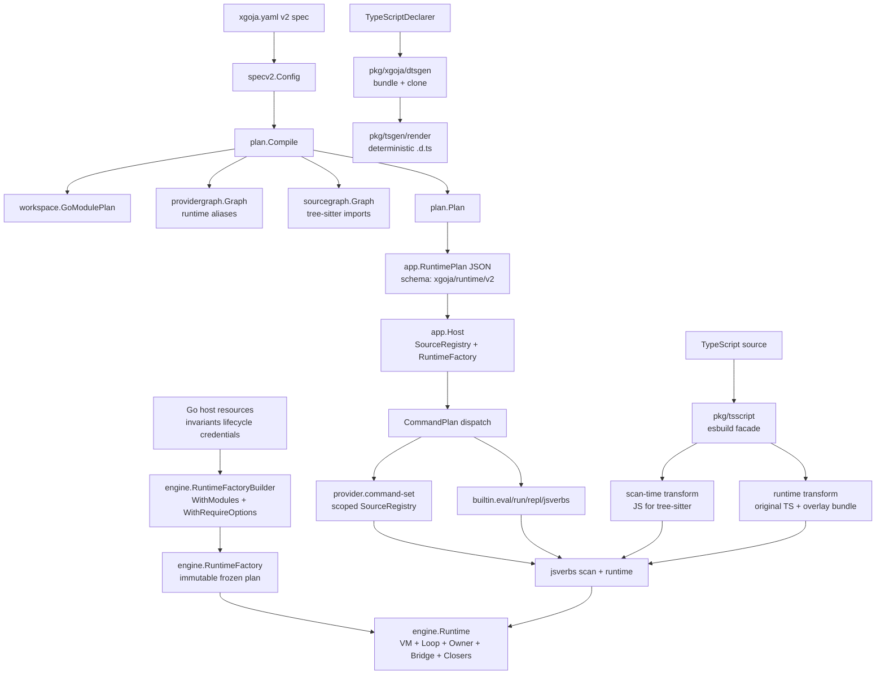

# 02a — JS Runtime, xgoja, TypeScript (Partition A Condensed)

## Executive summary

- **Partition scope:** go-go-goja runtime kernel/lifecycle, jsverbs scanner and command surfaces, xgoja generated-binary/provider/RuntimePlan/asset system, and TypeScript declarations + executable TS support. Excludes Go-backed DSL patterns, Geppetto bindings, and durable objects/HTTP composition/auth hosts (partition B).
- **Architecture spine:** `Go host resources → engine.RuntimeFactoryBuilder → engine.Runtime (VM + owner + event loop + bridge) → xgoja RuntimePlan → JS/TS composition → jsverbs/HTTP/CLI command surface`.
- **Three strongest arcs:** (1) Runtime ownership/context lifecycle (serialized VM access, startup vs lifetime vs call context, reentrant owner detection); (2) xgoja v2 plan compiler (specv2 → workspace → providergraph → sourcegraph → plan.Plan → RuntimePlan); (3) jsverbs pipeline (scan → binding plan → Glazed command → owner-scheduled invocation).
- **Canonical files for a later reader:** `Projects/2026/05/24/ARTICLE - xgoja - Generated Goja Applications Provider Architecture and Runtime Profiles.md` and `Projects/2026/06/13/ARTICLE - xgoja v2 RuntimePlan Hard Cutover - Technical Deep Dive.md`.

## Scope and search method

- **Corpus:** Markdown reports under `Projects/2026/{03,04,05,06}/` matching partition A sections from `sources/02-javascript-goja-xgoja-dsls.md`.
- **Selection:** deeply read canonical architecture reports; heading-scanned adjacent reports; title-only for clearly supplementary files.
- **Files read:** 22 deeply read; 8 heading-scanned; remaining inventoried from source report.

## Evidence ledger

| Path | Evidence level | Lines / basis | Cluster | Why it matters |
|---|---|---|---|---|
| `Projects/2026/03/16/PROJ - go-go-goja jsverbs - JavaScript to Glazed Commands.md` | read | full | jsverbs | Canonical jsverbs pipeline definition |
| `Projects/2026/05/24/ARTICLE - xgoja - Generated Goja Applications Provider Architecture and Runtime Profiles.md` | read | full | xgoja | Canonical xgoja provider/profile system report |
| `Projects/2026/06/13/ARTICLE - xgoja v2 RuntimePlan Hard Cutover - Technical Deep Dive.md` | read | full | xgoja | RuntimePlan v2 cutover, SourceRegistry, legacy rejection |
| `Projects/2026/06/12/ARTICLE - New XGoja - Source Graphs Provider Plans and the V2 Runtime Compiler.md` | read | full | xgoja | V2 planner layers: specv2, workspace, providergraph, sourcegraph, plan |
| `Projects/2026/06/14/ARTICLE - xgoja Sourcegraph Tree-sitter Import Resolution - Technical Deep Dive.md` | read | full | xgoja | Tree-sitter import parsing, RuntimePlan alias propagation |
| `Projects/2026/06/09/ARTICLE - TypeScript Declarations from xgoja Generated Binaries.md` | read | full | TypeScript | Three-layer .d.ts generation: descriptor → bundle → render |
| `Projects/2026/06/10/ARTICLE - XGoja TypeScript Support - Esbuild, JSVerbs, and Hot Reload.md` | read | full | TypeScript | pkg/tsscript esbuild facade, scan/runtime transform split, hot reload |
| `Projects/2026/05/23/ARTICLE - go-go-goja Runtime System - Creation Context Scheduling and Modules.md` | read | full | Runtime kernel | engine.Factory, RuntimeModuleSpec, owner scheduling, module middleware |
| `Projects/2026/05/26/ARTICLE - Runtime Context Ownership in go-go-goja.md` | read | full | Runtime kernel | Startup/lifetime/call/custom context separation, RuntimeServices refactor |
| `Projects/2026/05/15/ARTICLE - go-go-goja Context Management - Runtime Request and Async Call Context.md` | read | lines 1-80 | Runtime kernel | Async context capture for promise settlement |
| `Projects/2026/06/04/ARTICLE - go-go-goja - Runtime Architecture Cleanup and Geppetto Provider Integration.md` | read | full | Runtime kernel / xgoja | Lifecycle naming, Glazed config mapping, host-service contribution, Geppetto provider |
| `Projects/2026/06/08/ARTICLE - xgoja - HTTP Serve, Hot Reload, and Runtime Service Architecture.md` | read | full | xgoja | gojahttp.Host, blue/green reload, ExternalHostService, per-runtime service injection |
| `Projects/2026/06/01/ARTICLE - XGOJA-016 - Embedded Assets in Generated xgoja Binaries.md` | read | full | xgoja | Backend interface, ReadOnlyFSBackend, fs:assets vs fs:host, staticFromAssetsModule |
| `Projects/2026/05/23/ARTICLE - Goja Sandbox Architecture - Lessons from go-go-goja and vm-system.md` | read | lines 1-849 | Runtime kernel | Synthesis of go-go-goja/vm-system/go-go-host sandbox models |
| `Projects/2026/05/08/ARTICLE - Go Plugin Strategies - xgoja Compile-Time Module Composition.md` | read | lines 1-80 | xgoja | xcaddy-style composition rationale, plugin strategy comparison |
| `Projects/2026/05/22/ARTICLE - xgoja - Compile-Time Goja Module Composition and jsverbs Mounting.md` | read | lines 1-80 | xgoja/jsverbs | Generated binary model, three jsverb source modes |
| `Projects/2026/06/06/ARTICLE - Bump-Goja - A Go Ecosystem Migration Playbook.md` | read | lines 1-80 | Runtime kernel | 19-repo dependency migration, API rename patterns |
| `Projects/2026/04/26/ARTICLE - Goja RuntimeHook Internals - Building Tracers, Debuggers, and TUI Visual Debuggers.md` | read | lines 1-80 | Runtime kernel | RuntimeHook API, pause/resume, introspection |
| `Projects/2026/04/20/ARTICLE - Playbook - Adding jsverbs to Arbitrary Go Glazed Tools.md` | read | lines 1-60 | jsverbs | scan→describe→invoke pipeline separation |
| `Projects/2026/06/02/PROJ - xgoja Generated Binary Configuration.md` | read | lines 1-60 | xgoja | appName, envPrefix, config-file support |
| `Projects/2026/05/31/ARTICLE - xgoja Provider-Shipped Glazed Help Documents.md` | read | lines 1-60 | xgoja | providerapi.HelpSource, help.sources |
| `Projects/2026/05/27/ARTICLE - Playbook - Building go-go-goja xgoja Provider Packages.md` | read | lines 1-60 | xgoja | Provider authoring playbook |
| `Projects/2026/05/24/PROJ - XGoja Provider Support - Third-Party Package Rollout.md` | read | lines 1-60 | xgoja | Three provider patterns: simple, guarded, host-services |
| `Projects/2026/04/25/PROJ - go-go-goja Node-like Primitives - Technical Deep Dive.md` | read | lines 1-60 | Runtime kernel | Data-only vs host-access module split |
| `Projects/2026/04/25/RESEARCH - Go-Controlled Shell and Subprocess Sandboxing for JavaScript Runtimes.md` | read | lines 1-60 | Runtime kernel | Subprocess sandboxing design space |
| `Projects/2026/06/03/ARTICLE - xgoja - Building a Query Tool with Jsverbs and Embedded Modules.md` | read | lines 1-60 | jsverbs/xgoja | End-to-end xgoja.yaml → CLI example |
| `Projects/2026/06/04/ARTICLE - go-go-goja - HTTP Serve Support for xgoja Generated Verbs.md` | read | lines 1-60 | jsverbs/xgoja | Provider command set for HTTP serve from jsverbs |
| `Projects/2026/04/25/PROJ - go-go-goja Node-like Primitives - Technical Deep Dive.md` | heading-scanned | frontmatter+summary | Runtime kernel | (same file, dual reference) |

## Condensed per-arc summaries

### Arc 1: Runtime kernel and lifecycle (go-go-goja engine)

- **engine.Runtime** is not just a `*goja.Runtime`; it bundles VM + event loop + RuntimeOwner + bridge bindings + lifecycle context + closers + values map. `Factory.NewRuntime()` creates the VM, starts the loop, creates the owner, stores bridge bindings, registers modules before `require.Enable()`, runs initializers after, returns a live runtime (`Projects/2026/05/23`, lines 1-200).
- **RuntimeOwner serializes VM access.** `Call` (request/response) and `Post` (fire-and-forget) schedule onto the owner path. Reentrant owner calls are detected and executed directly, preventing deadlock (`Projects/2026/05/26`, section 4).
- **Context ownership is explicitly named:** startup context (construction), lifetime context (runtime resources), current owner-entry context (active call), custom context (external request/event), cleanup context (shutdown). `runtimebridge.RuntimeServices` provides `CallWithCurrentContext`, `PostWithLifetimeContext`, `PostWithCustomContext` helpers (`Projects/2026/05/26`, sections 3-7).
- **Async modules settle promises via owner.Post.** `timer` and `fs` capture `CurrentOwnerContext(vm)` at entry, do Go work in goroutines observing both call and lifetime context, and settle promises through `PostWithCustomContext`. This prevents goroutine VM access and preserves request cancellation across `await` boundaries (`Projects/2026/05/15`, lines 1-80; `Projects/2026/05/26`, section 7).
- **Module exposure is explicit policy.** `WithImplicitDefaultRegistryModules(false)` + `WithDataOnlyDefaultRegistryModules(false)` for xgoja/sandboxed runtimes. Module middleware (`Safe()`, `Only()`, `Exclude()`) selects from default registry (`Projects/2026/05/23`, sections "Builder options" and "Module middleware").
- **GOJA-053 cleanup made lifecycle names encode phases:** `Spec` = declarative, `Builder` = mutable construction, `Factory` = creates runtime objects, `Registrar` = registers into another object, `Initializer` = mutates created runtime, `Context` = call-scoped inputs (`Projects/2026/06/04`, Part I).
- **RuntimeHook** (upstream goja PR #697) provides 6 callbacks for tracing/debugging with near-zero overhead. Enables pause/resume via `sync.Cond`, introspection via `Scopes()`, `VMState()`, `CaptureCallStack()` (`Projects/2026/04/26`, lines 1-80).
- **Sandbox architecture synthesis** identifies go-go-goja as the strongest runtime substrate, vm-system as strongest control-plane vocabulary, go-go-host as strongest hosting supervisor. The missing concept is a **managed sandbox instance** joining durable identity + engine.Runtime + execution gate + event scope (`Projects/2026/05/23` sandbox article, lines 1-849).

### Arc 2: jsverbs and generated command surfaces

- **jsverbs is a compiler pipeline:** `scan.go` (discovery + AST literal metadata) → `binding.go` (shared binding plan) → `command.go` (Glazed command descriptions) → `runtime.go` (Goja runtime + source overlay loader → JS function execution). Static sentinels `__package__`, `__section__`, `__verb__` declare metadata; AST literal parsing replaced JS-to-JSON rewriting (`Projects/2026/03/16`, full file).
- **Binding plan prevents parse/invoke drift.** Schema generation and runtime invocation share one internal binding plan. Promise waiting is polling (explicitly marked v1 tradeoff) (`Projects/2026/03/16`, "Architecture" section).
- **Three source modes for xgoja jsverbs:** runtime filesystem (scan from disk), embedded local (`go:embed`), provider-shipped (`providerapi.VerbSource` with `fs.FS`) (`Projects/2026/05/24`, "JavaScript verbs" section; `Projects/2026/05/22`, lines 1-80).
- **HTTP serve from jsverbs:** Provider-owned `serve` command set builds Glazed commands from jsverb metadata, invokes selected verb once to register Express routes, keeps runtime alive. `JSVerbSourceSet` added to `CommandSetContext` (`Projects/2026/06/04` HTTP serve article, lines 1-60).
- **Playbook rule:** keep jsverbs as a pipeline (scan → describe → invoke), put CLI orchestration in host package, make help and execution share `CommandDescriptionForVerb(...)`, treat verb repos as explicitly scanned inputs (`Projects/2026/04/20`, lines 1-60).

### Arc 3: xgoja generated binaries, providers, RuntimePlan, assets

- **xgoja is an xcaddy-style builder.** Reads `xgoja.yaml`, generates Go source importing selected providers, embeds normalized runtime spec, compiles a normal Go binary. Compile-time composition avoids Go plugin ABI issues (`Projects/2026/05/24`, full; `Projects/2026/05/08`, lines 1-80).
- **Build-time vs runtime selection separation:** `packages[]` compiles providers into binary; `runtimes[]` profiles select visible modules per command; `commands[]` map commands to runtime profiles. This is the core capability boundary (`Projects/2026/05/24`, "Build-time selection and runtime selection").
- **RuntimePlan v2 hard cutover:** Generated binaries now embed `app.RuntimePlan` JSON (`schema: xgoja/runtime/v2`). Old top-level keys (`packages`, `modules`, `commandProviders`, `jsverbs`, `help`, `assets`) are **rejected** during decode, not migrated. `SourceRegistry` scopes provider command sources by declared source IDs (`Projects/2026/06/13`, full).
- **V2 planner has five layers:** `specv2` (user schema), `workspace` (Go module resolution from go.work), `providergraph` (selected capabilities + runtime aliases), `sourcegraph` (file discovery + import resolution), `plan` (composition). Design rule: "if code runs in goja, xgoja may compile it" (`Projects/2026/06/12`, full).
- **Tree-sitter import resolution** replaced regex scanning. Parses JS/TS/TSX syntax trees, extracts literal import specifiers, rejects non-literal dynamic imports. RuntimePlan aliases propagated into source scans so `require("fs:assets")` works when `as: fs:assets` is configured (`Projects/2026/06/14`, full).
- **Hot reload via blue/green manager:** `atomic.Pointer[Snapshot]` swap, optional smoke-path validation, last-known-good fallback. Rescans jsverb sources on each reload. TypeScript watch extensions auto-appended when TS sources enabled (`Projects/2026/06/08`, full).
- **Embedded assets:** `assets:` section with `go:embed all:` (preserving dot dirs). `ReadOnlyFSBackend` returns `EROFS` for writes. `fs:assets` vs `fs:host` are separate module instances under different `as:` aliases. `staticFromAssetsModule` serves embedded fs directly via `http.FileServer` (`Projects/2026/06/01`, full).
- **Provider patterns:** (1) simple loader providers for existing CommonJS modules, (2) guarded host-capability providers with `config.allow` gating, (3) host-services providers for modules needing live runtime state. Provider ID must match `registry.Package()` call (`Projects/2026/05/24` rollout; `Projects/2026/05/27` playbook).
- **Config lifecycle (GOJA-053):** Glazed `values.Values` parsed from CLI/config/env are mapped by providers into internal `ModuleSetupContext.Config` before `NewModuleFactory` runs. Public sections (user-facing flags) and internal sections (provider setup) are separate. Provenance preserved via `FieldValue.Log` (`Projects/2026/06/04`, Part III).
- **Host-service contribution:** `HostServiceContributionCapability` lets providers contribute opaque Go services before module setup. Geppetto uses this for tools, middleware factories, event sinks. Strict duplicate detection for named services; append-only for event sinks (`Projects/2026/06/04`, Parts VI-VIII).

### Arc 4: TypeScript support and declarations

- **Three-layer .d.ts generation:** (1) Descriptor: modules implement `TypeScriptDeclarer` returning `*spec.Module` with `Functions` + `RawDTS`; (2) Bundle: `pkg/xgoja/dtsgen` collects descriptors from selected modules, deep-copies for aliasing; (3) Render: `pkg/tsgen/render` produces deterministic sorted `.d.ts` (`Projects/2026/06/09`, full).
- **Sidecar approach for gen-dts:** Compiled Go binaries can't dynamically import packages. `xgoja gen-dts` generates a temporary Go program that imports the same providers as the build spec, resolves descriptors, and prints `.d.ts` to stdout. `--strict` mode fails on missing descriptors (`Projects/2026/06/09`, "The sidecar command").
- **Executable TypeScript via esbuild:** `pkg/tsscript` wraps esbuild Go API with `TransformSource` (syntax lowering, one file) and `BundleEntry`/`BundleVirtualEntryFS` (dependency graph following). Go-backed module aliases marked as externals (`Projects/2026/06/10`, "The compiler facade").
- **Scan-time vs runtime transform split:** Scanning needs parseable JS (tree-sitter can't parse TS). Runtime needs original TS + jsverbs overlay compiled together. Overlay must be appended before bundling so it participates in the same module transformation (`Projects/2026/06/10`, "The jsverbs split").
- **`fs.FS` TypeScript bundling:** `BundleVirtualEntryFS` uses esbuild plugin to resolve relative imports inside `fs.FS` roots. Enables provider-shipped/embedded TypeScript jsverbs with local helper imports without materializing files on disk (`Projects/2026/06/12`, "TypeScript from fs.FS").

## Topic architecture / spine



## Clusters and subclusters

### Cluster A: Runtime kernel and lifecycle
- Subclusters: engine.Runtime composition; RuntimeOwner serialization; context taxonomy (startup/lifetime/call/custom/cleanup); RuntimeServices bridge; module middleware policy; async promise settlement pattern; RuntimeHook tracing; node-like primitives split; subprocess sandboxing research.
- **Invariant:** VM access is always serialized through the owner. Context names must state the ownership domain they control.

### Cluster B: jsverbs pipeline
- Subclusters: AST literal metadata scanning; shared binding plan; source overlay loader; three source modes (disk/embedded/provider); HTTP serve command set; jsverbs in arbitrary Glazed tools.
- **Invariant:** Scanning produces declarative metadata; runtime follows the same binding plan the schema used. Scan-time and runtime transforms are separate for TypeScript.

### Cluster C: xgoja build/runtime system
- Subclusters: buildspec schema; provider packages (simple/guarded/host-services); runtime profiles; generated main.go template; RuntimePlan v2 + SourceRegistry; sourcegraph tree-sitter; embedded assets + ReadOnlyFSBackend; hot reload manager; generated binary configuration; provider-shipped help docs; v2 planner (specv2/workspace/providergraph/sourcegraph/plan).
- **Invariant:** Compile-time Go module composition is the capability boundary. RuntimePlan is the execution contract. Source scoping covers every source-dependent operation.

### Cluster D: TypeScript developer experience
- Subclusters: descriptor interface (`TypeScriptDeclarer`); bundle layer (`dtsgen`); render layer (`tsgen/render`); sidecar generation; esbuild compiler facade; scan/runtime transform split; `fs.FS` bundling; hot reload watch extensions.
- **Invariant:** TypeScript is a compilation layer, not a runtime replacement. Transform for scanning, bundle for execution. Overlay compiled together with source.

## Recurring concepts, technologies, and failure modes

### Concepts
- **Runtime ownership:** serialized VM access through RuntimeOwner; reentrant detection
- **Context taxonomy:** startup vs lifetime vs current-owner vs custom vs cleanup
- **Compile-time composition:** source-level Go module selection avoids plugin ABI fragility
- **Runtime profile as capability boundary:** binary contains providers, profile selects modules
- **SourceRegistry scoping:** command-scoped source subsets prevent source leakage
- **RuntimePlan as execution contract:** v2 semantics survive YAML → generation → runtime without DTO translation
- **Scan/runtime transform split:** TypeScript needs different compilation for metadata scanning vs execution
- **Overlay-before-bundling:** jsverbs overlay appended before esbuild compilation
- **Blue/green hot reload:** atomic snapshot swap with last-known-good fallback
- **Provider-neutral host services:** opaque keyed service bags; provider owns typed interpretation
- **Strict key rejection at decode:** stale generated output fails immediately

### Technologies
- Go, goja, goja_nodejs (require/eventloop)
- engine.Runtime, RuntimeFactoryBuilder, RuntimeModuleSpec, RuntimeInitializer
- runtimeowner.RuntimeOwner, runtimebridge.RuntimeServices
- xgoja buildspec, providerapi.Registry, providerapi.Module
- app.RuntimePlan (schema: xgoja/runtime/v2), SourceRegistry
- specv2, workspace, providergraph, sourcegraph, plan.Plan
- esbuild (Go API), pkg/tsscript
- tree-sitter (JavaScript + TypeScript grammars)
- Glazed/Cobra command framework, schema.Section, values.Values
- go:embed (with `all:` prefix for dot dirs)
- SQLite (Geppetto turn store, embedded assets)
- Bubble Tea REPL

### Failure modes
- **Unsafe runtime sharing:** touching VM from goroutines without owner.Post → deadlock/corruption
- **Lost async context:** promise settlement using lifetime context instead of captured call context → request cancellation lost after `await`
- **Legacy DTO translation loss:** v2 features (e.g., `commands[].sources`) lost during v1 conversion → HTTP serve missing jsverb subcommands
- **Source scoping gaps:** hot reload rescanning all sources instead of command-scoped subset → unselected files observed
- **Regex import scanning:** false positives in strings/comments, missing ESM/export-from/side-effect imports → incorrect source graph
- **RuntimePlan alias mismatch:** provider-wide aliases used instead of configured `as:` aliases → `require("fs:assets")` rejected
- **Descriptor mutation:** shared provider descriptors renamed without deep-copy → aliasing corrupts other selections
- **VCS stamping in generated builds:** `go build` in temp workspace fails on VCS status → needs `-buildvcs=false`
- **Dot directory embed loss:** `go:embed` without `all:` prefix omits `.well-known` → web assets missing
- **Root mount normalization:** `mount: /` normalized to empty string → all asset reads return ENOENT
- **Overlay ordering:** esbuild bundles before overlay appended → function names wrapped/transformed, overlay can't reference them
- **Tests preserving old architecture:** active tests supplying old generated JSON keep compatibility decoder alive past cutover

## Candidate concept-map material

### Nodes

| Node | Type | Confidence | Notes |
|---|---|---|---|
| `engine.Runtime` | concept | high | Owned VM + loop + owner + bridge + closers + values |
| `RuntimeOwner` | concept | high | Serialized VM access, reentrant detection, Call/Post |
| `runtimebridge.RuntimeServices` | concept | high | Module-facing bridge: lifetime context + owner scheduling |
| `Context taxonomy` | concept | high | Startup/lifetime/current-owner/custom/cleanup |
| `RuntimeModuleSpec` | concept | high | Unified runtime-aware module registration interface |
| `Module middleware` | concept | high | Safe/Only/Exclude/Add/Custom selection over default registry |
| `jsverbs scanner` | concept | high | AST literal parsing, sentinel metadata, binding plan |
| `Shared binding plan` | concept | high | Prevents parse/invoke drift between schema and runtime |
| `Source overlay loader` | concept | high | Preserves relative require(), captures verb functions |
| `xgoja buildspec` | artifact | high | Declarative YAML → generated Go binary |
| `providerapi.ProviderRegistry` | concept | high | Provider package registration before runtime construction |
| `Runtime profile` | concept | high | Selects visible modules per command; capability boundary |
| `app.RuntimePlan` | concept | high | schema: xgoja/runtime/v2; execution contract |
| `SourceRegistry` | concept | high | Command-scoped source lookup, kind filtering |
| `plan.Plan` | concept | high | V2 composition boundary: spec + workspace + providergraph + sourcegraph |
| `sourcegraph.Graph` | concept | high | File discovery, origins, tree-sitter import resolution |
| `providergraph.Graph` | concept | high | Provider selection, runtime alias computation, command-set resolution |
| `workspace.GoModulePlan` | concept | high | Go module resolution from go.work, explicit/CLI replacements |
| `hotreload.Manager` | concept | high | Blue/green atomic snapshot swap, smoke validation |
| `ExternalHostService` | concept | high | Inject gojahttp.Host with OwnsListen:false for hot reload |
| `HostServiceContribution` | concept | high | Provider-neutral opaque keyed service bags |
| `ReadOnlyFSBackend` | concept | high | Read-only embedded asset filesystem, EROFS on writes |
| `pkg/tsscript` | technology | high | Esbuild Go API facade: Transform/Bundle/BundleVirtualEntryFS |
| `TypeScriptDeclarer` | concept | high | Module interface returning spec.Module for .d.ts generation |
| `dtsgen.BundleModules` | concept | high | Collects descriptors, deep-copies for aliasing |
| `tree-sitter import parser` | technology | high | JS/TS/TSX syntax tree import extraction |
| `RuntimeHook` | technology | medium | Upstream goja PR #697, 6 callbacks, pause/resume |
| `go-go-goja` | project | high | Runtime substrate |
| `xgoja` | project | high | Generated binary builder |
| `jsverbs` | project | high | JS-to-Glazed command pipeline |
| `Bump-Goja migration` | workflow | medium | 19-repo coordinated dependency bump playbook |
| `Legacy DTO translation loss` | failure-mode | high | v2 features lost during v1 conversion |
| `Source scoping gap` | failure-mode | high | Hot reload scanning unselected sources |
| `Regex import false positives` | failure-mode | high | Strings/comments matched as imports |
| `RuntimePlan alias mismatch` | failure-mode | high | Provider-wide aliases vs configured `as:` |
| `Unsafe runtime sharing` | failure-mode | high | VM access from goroutines without owner |
| `Lost async context` | failure-mode | high | Promise settlement without captured call context |
| `Overlay ordering bug` | failure-mode | high | esbuild before overlay breaks function references |
| `Should v1 paths be hard-removed from doctor/build/gen-dts?` | open-question | high | Migration tool exists; normal commands still bridge |
| `Should go-go-goja, vm-system, go-go-host merge into one sandbox manager?` | open-question | medium | Sandbox architecture synthesis |
| `Should provider Go module path be explicit in v2 schema?` | open-question | medium | Currently inferred from import path |

### Edges

```text
engine.RuntimeFactoryBuilder --freezes into--> engine.RuntimeFactory [high] (Projects/2026/05/23)
engine.RuntimeFactory --creates--> engine.Runtime [high] (Projects/2026/05/23)
engine.Runtime --owns--> RuntimeOwner [high] (Projects/2026/05/23, 05/26)
RuntimeOwner --serializes--> *goja.Runtime [high] (Projects/2026/05/26)
runtimebridge.RuntimeServices --bridges--> RuntimeOwner [high] (Projects/2026/05/26)
Context taxonomy --guides--> runtimebridge helpers [high] (Projects/2026/05/26)
RuntimeModuleSpec --registers before--> require.Enable() [high] (Projects/2026/05/23)
RuntimeInitializer --runs after--> require.Enable() [high] (Projects/2026/05/23)
jsverbs scanner --produces--> Shared binding plan [high] (Projects/2026/03/16)
Shared binding plan --prevents drift between--> Glazed command description [high] (Projects/2026/03/16)
Source overlay loader --preserves--> relative require() [high] (Projects/2026/03/16)
xgoja buildspec --selects at build time--> providerapi.ProviderRegistry [high] (Projects/2026/05/24)
Runtime profile --selects at runtime--> CommonJS module visibility [high] (Projects/2026/05/24)
plan.Plan --composes--> specv2 + workspace + providergraph + sourcegraph [high] (Projects/2026/06/12)
plan.Plan --renders into--> app.RuntimePlan JSON [high] (Projects/2026/06/13)
app.RuntimePlan --rejects--> legacy top-level keys [high] (Projects/2026/06/13)
SourceRegistry --scopes--> provider command sources [high] (Projects/2026/06/13)
sourcegraph.Graph --parses with--> tree-sitter import parser [high] (Projects/2026/06/14)
RuntimePlan aliases --propagated into--> SourceRegistry [high] (Projects/2026/06/14)
hotreload.Manager --swaps via--> atomic.Pointer[Snapshot] [high] (Projects/2026/06/08)
ExternalHostService --injects--> gojahttp.Host with OwnsListen:false [high] (Projects/2026/06/08)
HostServiceContribution --collected before--> ModuleSetupContext [high] (Projects/2026/06/04)
Glazed values.Values --mapped into--> ModuleSetupContext.Config [high] (Projects/2026/06/04)
ReadOnlyFSBackend --returns EROFS for--> write operations [high] (Projects/2026/06/01)
pkg/tsscript --wraps--> esbuild Go API [high] (Projects/2026/06/10)
TypeScriptDeclarer --returns--> spec.Module [high] (Projects/2026/06/09)
dtsgen.BundleModules --deep-copies--> provider descriptors [high] (Projects/2026/06/09)
Scan-time transform --produces JS for--> tree-sitter parsing [high] (Projects/2026/06/10)
Runtime transform --bundles original TS plus--> jsverbs overlay [high] (Projects/2026/06/10)
Overlay-before-bundling --preserves--> function name references [high] (Projects/2026/06/10)
RuntimeHook --enables--> tracers/debuggers/pause-resume [medium] (Projects/2026/04/26)
Bump-Goja migration --applies--> engine API renames across 19 repos [medium] (Projects/2026/06/06)
Legacy DTO translation loss --caused by--> v1 compatibility layer [high] (Projects/2026/06/13)
Source scoping gap --fixed by--> command-scoped SourceRegistry [high] (Projects/2026/06/13)
Regex import false positives --fixed by--> tree-sitter parser [high] (Projects/2026/06/14)
RuntimePlan alias mismatch --fixed by--> propagating runtime.modules[].as aliases [high] (Projects/2026/06/14)
```

## Cross-links to other topic slices

- **Topic 4 (Infra/auth/deployment/GitOps):** xgoja Keycloak auth host deployment shares K3s, Argo CD, Vault, Traefik concerns. The `go-go-host` site hosting model (referenced in sandbox architecture synthesis) overlaps with infra deployment patterns. Generated binary configuration (`appName`, `envPrefix`) connects to Glazed config-file conventions used across infra tools.
- **Topic 5 (AI agents/transcripts/observability):** Geppetto provider integration (GOJA-053) connects go-go-goja runtime to agent inference, turn persistence, tool registries, and event sinks. `go-minitrace` provider is a host-services provider needing live SQLite connections. RuntimeHook tracing concept overlaps with agent observability. Sessionstream WebSocket integration touches both runtime and agent observability.
- **Topic 6 (Data/RAG/search):** `db-browser` SQLite runtime, `goja-text` Markdown/extraction modules, and `database` module context-aware queries connect to data/RAG systems. The `cozodb-goja` provider candidate bridges CozoDB access. SQLite is used as Geppetto turn store and embedded asset store.
- **Topic 7 (Web UI/apps/productivity):** Express HTTP module, UI DSL, and `staticFromAssetsModule` connect to web app shells. The `single-binary Go + SPA` pattern is exemplified by xgoja generated binaries with embedded assets and Express routes. Widget IR and DMETA overlap with UI DSL reports in partition B.
- **Topic 1 (Hardware/embedded):** Loupedeck provider (third-party rollout) and hardware event posting through `PostWithLifetimeContext` connect to device interfaces. The Loupedeck retained-UI deadlock was the concrete failure that forced the context ownership refactor.
- **Topic 3 (Typography/design systems):** CSS Visual Diff JavaScript workflow engine (partition B) uses go-go-goja as its runtime. Widget IR/DMETA generated React scaffold connects to UI DSL patterns.

## Open questions and second-pass targets

1. **Should v1 paths be hard-removed from `doctor`, `build`, `gen-dts`?** Currently v2 specs bridge into the existing generator. The target is direct `plan.Plan` consumption. (`Projects/2026/06/12`, "What remains unfinished")
2. **Should go-go-goja, vm-system, and go-go-host merge into one sandbox manager?** The sandbox architecture synthesis identifies a missing "managed sandbox instance" concept. This is a major architectural decision. (`Projects/2026/05/23` sandbox article)
3. **Should provider Go module path be explicit in v2 schema?** Currently inferred from import path by trimming `/pkg/`, `/cmd/`, `/internal/`. Works for current layout but fragile. (`Projects/2026/06/12`)
4. **Should `run --keep-alive` become a first-class `serve` command?** Currently `--keep-alive` is a flag; provider-owned serve command offers a more precise contract. (`Projects/2026/06/01`)
5. **Is promise polling in jsverbs sufficient, or should a less polling-heavy bridge be designed?** Explicitly marked as v1 tradeoff. (`Projects/2026/03/16`)
6. **Should data-only automatic modules remain enabled by default for engine callers?** xgoja disables them; other callers may want them. (`Projects/2026/05/23`)
7. **How much of the implementation path lives outside `Projects/2026` in referenced workspaces?** Many reports reference `/home/manuel/workspaces/...` paths that would need source-level review.

## Start here

1. `Projects/2026/05/24/ARTICLE - xgoja - Generated Goja Applications Provider Architecture and Runtime Profiles.md` — the clearest system-level explanation of xgoja as compile-time provider composition plus runtime profiles. Read this first to understand the build-time/runtime selection separation.
2. `Projects/2026/06/13/ARTICLE - xgoja v2 RuntimePlan Hard Cutover - Technical Deep Dive.md` — the current v2 runtime representation, SourceRegistry, and legacy rejection. Read this second to understand the execution contract.
3. `Projects/2026/05/23/ARTICLE - go-go-goja Runtime System - Creation Context Scheduling and Modules.md` — the engine runtime substrate. Read this for the runtime kernel lifecycle and module registration.
4. `Projects/2026/06/10/ARTICLE - XGoja TypeScript Support - Esbuild, JSVerbs, and Hot Reload.md` — the TypeScript compilation layer. Read this for the scan/runtime transform split.

## Report-format notes

- This report follows the condensed format requested: denser per-arc summaries (2-5 bullets) focusing on architecture invariants and design decisions.
- Evidence ledger marks only files actually read in this pass. Files inventoried from the first-batch report but not re-read are excluded.
- Cross-links explicitly name the other topic number and shared concept, per the guidelines contract.
- Node types follow the suggested vocabulary. Failure modes are promoted to first-class nodes.
- The Mermaid spine shows the full v2 pipeline from spec to runtime to TypeScript/DTS, which is denser than the first-pass map.
