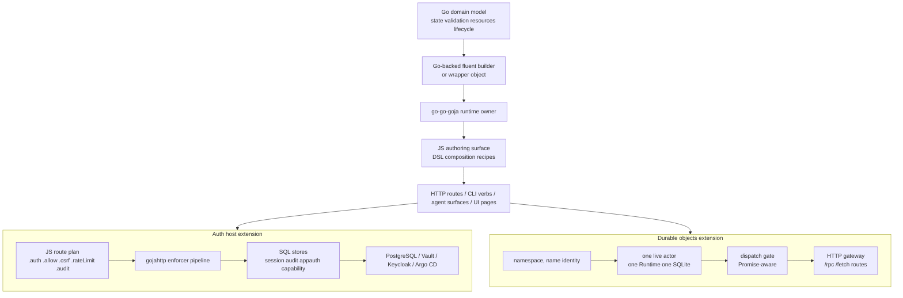

# 02b JavaScript DSLs, Geppetto, Durable Objects, and Auth Hosts

## Executive summary

- **Partition B** covers three DSL/application arcs: Go-backed JavaScript API design (goja-text, CSS visual diff, db-browser, Fringe UI DSL, Kanban, Widget IR, Discord, Loupedeck), Geppetto wrapper-first agent bindings, and durable objects + HTTP composition + auth host infrastructure.
- The **dominant architectural pattern** across all three arcs is "JavaScript owns composition; Go owns invariants, resources, lifecycle, credentials, and typed boundary values." Every DSL, binding, and auth surface repeats this ownership split.
- The **strongest concept-map spine** is: Go domain model → Go-backed fluent builder/wrapper → Goja runtime → JS authoring surface → HTTP/CLI/agent command surface. Auth hosts extend this to: JS route plan → Go enforcer pipeline → Go stores → PostgreSQL/Vault/Keycloak.
- **Failure modes are first-class design drivers**: options-map traps, plain-object drift, unsafe runtime sharing, schema drift between source/manifest/runtime, deployment contract drift across six systems.
- Canonical starting files: the DSL design synthesis (`Projects/2026/06/22/ARTICLE - Designing DSLs with go-go-goja...`) and the Geppetto wrapper-first cutover (`Projects/2026/06/01/ARTICLE - Geppetto JS Bindings...`).

## Scope and search method

- Corpus: Markdown reports under `Projects/2026/{03,04,05,06}/`.
- Partition B assignment: 'Go-backed JavaScript APIs and DSL patterns', 'Geppetto bindings and agent/runtime integration', and 'Durable objects, HTTP composition, auth hosts'. Does NOT include runtime-core/jsverbs/xgoja/TypeScript sections (partition A).
- Selection: deeply read canonical architecture reports for each arc; focused on architectural invariants, design decisions, and failure modes rather than implementation trivia.
- 18 files read in full; remaining inventoried files in these arcs are title-scanned or heading-scanned.

## Evidence ledger

| Path | Evidence level | Lines / basis | Cluster | Why it matters |
|---|---|---|---|---|
| `Projects/2026/06/22/ARTICLE - Designing DSLs with go-go-goja - Go-Backed JavaScript APIs.md` | read | full file (~600 lines) | DSL design | Canonical cross-project DSL design synthesis; central ownership rule |
| `Projects/2026/06/07/ARTICLE - Fluent Builders with Go-Backed Objects for JavaScript.md` | read | full file (~400 lines) | DSL design | goja-text fluent builder pattern; service-layer/module-adapter/provider three-layer architecture |
| `Projects/2026/04/29/ARTICLE - CSS Visual Diff - Retiring the Native YAML Runner for a JavaScript First Workflow Engine.md` | read | full file (~350 lines) | DSL patterns | Schema-as-API vs schema-as-data; JS-first workflow engine pivot |
| `Projects/2026/05/08/ARTICLE - db-browser - Goja JavaScript SQLite App Runtime Deep Dive.md` | read | full file (~500 lines) | DSL / app runtime | Express-style serving, ui.dsl server-rendered HTML, write gate, scoped table query |
| `Projects/2026/05/13/PROJECT REPORT - Fringe Interactive DSL and Goja Backend Runtime Deep Dive.md` | read | full file (~600 lines) | UI DSL / server-driven UI | Backend-driven JSON page DSL; Goja flow scripts; opaque action IDs; page-version-scoped callbacks |
| `Projects/2026/05/03/ARTICLE - Kanban DSL - Server Rendered Boards with Goja Callbacks.md` | read | full file (~500 lines) | DSL / server-rendered UI | Server-rendered fragment refresh; fluent board builder; Go-owned browser runtime |
| `Projects/2026/06/05/ARTICLE - Building a Goja UI DSL from Scratch - Widget IR to xgoja.md` | read | full file (~600 lines) | Widget IR / RAG | Goja authors Widget IR data; React renders; IR DSL → runner → server → xgoja provider |
| `Projects/2026/04/22/ARTICLE - Go-Side JavaScript DSLs for Discord Bots - Types, Errors, and In-Place Updates.md` | read | full file (~350 lines) | DSL / Discord bot | Goja Proxy traps for fluent builders; typed Go values from `.build()`; interaction lifecycle |
| `Projects/2026/06/01/ARTICLE - Geppetto JS Bindings - Wrapper First Hard Cutover.md` | read | full file (~500 lines) | Geppetto / agent bindings | Wrapper-first API; hidden Go refs; registry-backed inference settings; explicit-turn model |
| `Projects/2026/06/02/ARTICLE - Geppetto JS Overhaul - Wrapper First Agents Events and Storage Boundaries.md` | read | full file (~600 lines) | Geppetto / streaming / storage | EventEmitter `runAsync`; run-scoped emitter refs; owner-thread safety; storage boundary design |
| `Projects/2026/06/12/ARTICLE - Go Go Objects - Durable Objects Runtime on Goja.md` | read | full file (~500 lines) | Durable objects | Identity-bound actor runtime; per-object SQLite; alarms; eviction; xgoja/v2 serving paths |
| `Projects/2026/06/14/ARTICLE - Go Go Objects - Async Durable Objects Dispatch and xgoja v2 Integration.md` | read | full file (~400 lines) | Durable objects / async | Promise-aware dispatch; actor dispatch gate vs RuntimeOwner; durable error code preservation |
| `Projects/2026/06/12/ARTICLE - Goja HTTP Composition - Mountable Handlers and Sessionstream WebSockets.md` | read | full file (~500 lines) | HTTP composition | Mountable `http.Handler` ABI; hidden handler ref; sessionstream protobuf bindings; prefix vs route matching |
| `Projects/2026/06/12/ARTICLE - go-go-goja Express Auth - Go Backed Fluent Route Plans.md` | read | full file (~600 lines) | Auth / planned routes | Planned route builders; hard cutover from raw handlers; host-owned auth pipeline; strict raw-route rejection |
| `Projects/2026/06/14/ARTICLE - go-go-goja Express Auth - From Planned Routes to Generated Host Auth.md` | read | full file (~600 lines) | Auth / generated host | `hostauth` package; lazy service factory; SQL stores; hot reload auth services; generated-host example |
| `Projects/2026/06/16/PROJECT REPORT - xgoja Keycloak Auth Host - Production Deployment Deep Dive.md` | read | full file (~500 lines) | Auth / deployment | Six-system deployment contract; Keycloak OIDC; Vault/VSO; Argo CD; Postgres stores |
| `Projects/2026/06/20/ARTICLE - go-go-goja Planned Route Rate Limiting - Deep Dive.md` | read | full file (~500 lines) | Auth / rate limiting | Rate limiting as route primitive; pre-auth/post-auth stages; typed key parts; `RateLimiter` interface |
| `Projects/2026/06/20/PROJECT REPORT - go-go-goja Programmatic Agent Fetch Auth - End-to-End Deep Dive.md` | read | full file (~600 lines) | Auth / programmatic agents | Agent principals; API tokens; guarded fetch module; credential source builders; generated smoke |

### Heading-scanned files (not deeply read, but inventoried)

| Path | Evidence level | Cluster | Note |
|---|---|---|---|
| `Projects/2026/04/11/ARTICLE - Loupedeck - Goja JavaScript Runtime and API Deep Dive.md` | heading-scanned | DSL / device | Device-control JS API; precedent for host-first APIs |
| `Projects/2026/04/20/PROJ - JS Discord Bot - Building a Discord Bot with a JavaScript API.md` | heading-scanned | DSL / Discord | Early host-first JS API pattern |
| `Projects/2026/04/21/PROJ - CSS Visual Diff - Hair Booking Fringe Restyle Tooling.md` | heading-scanned | DSL / visual diff | Pyxis project context |
| `Projects/2026/05/13/PROJECT REPORT - Fringe Go Host Modules Walkthrough.md` | heading-scanned | UI DSL | Fringe host module walkthrough |
| `Projects/2026/05/15/PROJECT REPORT - Fringe Admin DSL and React Renderer Technique Deep Dive.md` | heading-scanned | UI DSL | Admin DSL pattern |
| `Projects/2026/06/02/ARTICLE - Geppetto JS Session API - From Turns to Sessions.md` | heading-scanned | Geppetto | Session model evolution |
| `Projects/2026/06/04/ARTICLE - go-go-goja - Runtime Architecture Cleanup and Geppetto Provider Integration.md` | heading-scanned | Geppetto integration | go-go-goja + Geppetto provider wiring |
| `Projects/2026/06/20/ARTICLE - go-go-goja Programmatic Auth After Rate Limiting - Deep Dive.md` | heading-scanned | Auth / programmatic | AuthResult, typed grants, agents |
| `Projects/2026/06/21/PROJECT REPORT - go-go-goja Token Families and Device Authorization Flow - Deep Dive.md` | heading-scanned | Auth / token families | Refresh-token rotation, device auth flow |
| `Projects/2026/06/14/ARTICLE - Go Go Objects - Async Behavior in Durable Objects.md` | heading-scanned | Durable objects | Async behavior complement |
| `Projects/2026/06/02/PROJ - Goja Text - Go-Backed Markdown AST Bindings.md` | title-only | DSL / goja-text | Markdown AST bindings |
| `Projects/2026/06/07/ARTICLE - Minitrace Viz API Redesign - Normalized SQL and Fluent Goja Builders.md` | title-only | DSL / data query | Query recipe pattern |

## Condensed per-arc summaries

### Arc 1: Go-backed JavaScript APIs and DSL patterns

- **Central ownership rule**: JavaScript owns composition (which sections, which views, which callbacks); Go owns domain state, validation, host resources, lifecycle, and typed boundary values. This is the foundational design maxim across goja-text, CSS visual diff, db-browser, Fringe, Kanban, Widget IR, and Discord DSLs.
- **API shape decision guide**: flat functions for stateless conversions → result objects for reusable evidence → fluent builders for stateful construction → data contracts for transporting facts → generated schema builders for typed payloads → IR helpers for authoring serializable trees. The choice depends on whether intermediate state has invariants.
- **Three-layer module architecture** (from goja-text): (1) service layer (pure Go, zero goja imports, testable independently), (2) native module adapter (Loader, SetExport, goja conversion), (3) provider wiring (xgoja buildspec and embedded assets). Every module follows this sequence.
- **Builder lifecycle discipline**: create → configure → validate → build/render/parse → use result. Child builders need explicit commit points (`End()`) with deterministic double-`End()` behavior. Escape hatches must be explicit and searchable (`Raw()`, `rawWidget()`).
- **CSS Visual Diff pivot**: retired native YAML runner in favor of JavaScript-first workflow engine. Core lesson: schema-as-API (core-owned) vs schema-as-data (userland). New features enter through service/runtime types and JS API, not through native manifest schemas.
- **db-browser**: Goja SQLite app runtime with Express-style serving, server-rendered `ui.dsl` (text escaped by default, `ui.raw` for trusted HTML), write-gate (`guardedDB` with double opt-in), explicit-only jsverbs scanning, scoped table query state as open follow-up.
- **Fringe Interactive DSL**: backend-driven UI architecture — JS flow scripts in Goja produce JSON pages, browser receives opaque action IDs (not callbacks), page-version-scoped actions prevent stale event mutation, render is transactional (failed render preserves previous actions).
- **Kanban DSL**: server-rendered fragment refresh loop — board builder → Go-owned browser runtime → `data-kb-*` protocol attributes → action POST → Goja callback → SQLite mutation → server-rerendered HTML fragment → DOM replacement. `draggable="true"` (enumerated, not boolean) was a real browser contract bug.
- **Widget IR to xgoja**: Goja authors Widget IR (JSON-compatible tree), React renders from IR. Key invariant: "Goja authors data; React renders UI." Semantic recipes expand to ordinary IR, not wire types. Design token bridge needed for standalone visual quality. xgoja provider packages must live under stable module paths for generated builds.
- **Discord bot DSL**: Goja Proxy traps preserve fluent chaining while Go owns builder state. Three-way method lookup: own method → chain function; known method from different builder → guided error; unknown method → listable error. `.build()` returns typed Go values (`*discordgo.MessageEmbed`, `discordgo.Button`). Interaction lifecycle: response type chosen centrally (type 4/5/6/7).

### Arc 2: Geppetto bindings and agent/runtime integration

- **Wrapper-first hard cutover**: removed legacy permissive namespaces (`profiles`, `runner`, `turns`, `engines`, `schemas`, `middlewares`, `tools`). Public API reduced to `inferenceProfiles`, `engine`, `agent`, `turn`, `tool`, `toolRegistry`, `schema`, `consts`, `events`. Hidden Go reference mechanism (`__geppetto_ref`, non-enumerable/non-writable/non-configurable) enforces that plain JS maps cannot substitute for domain wrappers.
- **Registry-backed inference settings**: `gp.inferenceSettings()` builder was deliberately NOT exposed. Scripts resolve profiles from Geppetto engine profile registries (YAML/SQLite sources). Settings wrappers are read-only: `toJSON()` (redacted), `clone()`, `debug()`. Secrets redacted before any snapshot reaches JavaScript.
- **Explicit-turn model**: `agent.run(turn)` requires a Go-owned `Turn` wrapper, not a plain object. No `agent.ask()`, no `agent.system()`, no hidden conversation memory. Multi-turn context is explicit — the script includes previous user/assistant blocks in the next turn. This makes conversation state inspectable, forkable, replayable.
- **EventEmitter `runAsync`**: synchronous `run()` blocks live callbacks (JS owner thread waits for inference). `runAsync(turn)` returns a promise handle; listeners attached at builder-level via `.events(emitter)` before run start. Run-scoped emitter refs adopted and closed deterministically at settlement — GC is not a lifecycle protocol. `handle.on(...)` rejected as racy (early events lost before listener registration).
- **Owner-thread safety**: all `goja.Value` inspection/export happens on the runtime owner. Background goroutines do Go work and schedule owner-thread settlement. EventEmitter payload copies prevent shared mutable state across emission paths.
- **Storage boundary**: final-turn persistence is a Geppetto seam (`enginebuilder.TurnPersister`); timeline/sessionstream hydration is Pinocchio-owned. The design says: Geppetto emits events and persists final turns; it should NOT own chat UI timelines. Proposed `gp.turnStores` API is host-backed, not Geppetto-imports-Pinocchio.

### Arc 3: Durable objects, HTTP composition, auth hosts

- **Durable Objects on Goja**: `(namespace, name)` identity → lazily started as one JS actor → owns one `engine.Runtime` → one private SQLite database. `RuntimeOwner.Call()` serializes VM access. Central alarm index wakes evicted objects. Active-dispatch tracking prevents eviction during running work. Not Cloudflare compatibility — a local single-process actor kernel.
- **Async durable objects**: Promise-aware dispatch — handlers may return `goja.Promise`; runtime waits for settlement before converting result. Critical distinction: `RuntimeOwner.Call()` serializes VM callbacks, but actor needs its own dispatch gate (channel, not mutex) for async event lifecycle. Promise detection and state inspection must happen on owner thread. Durable error codes preserved across sync throws and async rejections.
- **HTTP composition**: shared `gojahttp.AttachHTTPHandler` / `HTTPHandlerFromValue` ABI — hidden `http.Handler` ref on JS objects. `app.mount(prefix, handler)` lets JS mount Go-backed handlers (WebSockets, APIs) without compile-time coupling. Generic mounts preserve request paths by default; static mounts strip prefixes. Sessionstream bindings: protobuf builder modules carry hidden prototype tokens; payload conversion tries hidden-ref first, falls back to protojson.
- **Planned route auth**: hard cutover from `app.get(path, handler)` to `app.get(path).public().handle(...)` or `app.patch(path).auth(...).resource(...).csrf().allow(...).audit(...).handle(...)`. `RoutePlan` is the host-owned contract validated at registration. Host enforces: authenticate → CSRF → resolve resources → authorize → audit → handler. Strict raw-route rejection available (`RejectRawRoutes: true`).
- **Generated host auth**: `pkg/xgoja/hostauth` — provider-neutral config resolution, store builders (memory/SQLite/Postgres), session manager, `gojahttp.AuthOptions`. Lazy `ServiceFactoryKey` installed before command construction; concrete `ServicesKey` built after command values parsed. Hot reload shares auth services across candidate runtimes. `hostauth.Config{Mode: oidc}` returns `ErrOIDCNotImplemented` — generated OIDC is tracked as issue #82.
- **Production deployment**: six-system contract — source repo → GHCR image → K3s GitOps → Argo CD → Vault/VSO → Keycloak → PostgreSQL. `public-base-url` is a first-class concept (browser origin, not listen address). ENTRYPOINT/args must not duplicate subcommand. OIDC transaction store in-memory — keep replicas at one until durable.
- **Rate limiting as route primitive**: `RateLimitSpec` in `RoutePlan`; pre-auth (IP/route/param/header/bodyField) and post-auth (actor/resource) stages. Typed key parts, not string templates. `RateLimiter` interface for replaceable backends. In-memory default for dev; production needs distributed backend. `429 + Retry-After` on denial.
- **Programmatic agent fetch auth**: agent principals (`express.agent()`) vs session users (`express.sessionUser()`) vs `express.anyOf(...)`. API tokens issued once, stored by hash, never persisted in plaintext. Guarded `fetch` module — host must explicitly enable outbound origins, timeouts, response-size limits, credential-source permissions. Credential source builders (`fetch.auth.bearer().fromFile(...).jsonPath(...)`) are Go-owned, not plain JS maps. Generated server+agent smoke proves end-to-end without `exec` or `curl`.

## Topic architecture / spine



## Clusters and subclusters

### Cluster A: Go-backed DSL design patterns
- Subclusters: fluent builders (goja-text template/markdown), document parsing DSL, data contracts/query recipes (minitrace), IR authoring (Widget IR, Fringe UI DSL), server-rendered HTML (db-browser ui.dsl, Kanban), device APIs (Loupedeck, Discord Proxy traps)
- Invariant: Go owns domain model; JS owns composition. Builder lifecycle has explicit commit points. Escape hatches are searchable.

### Cluster B: Workflow engine pivots
- Subclusters: CSS visual diff YAML→JS-first, Fringe static components→backend-driven DSL, db-browser scoped table query
- Invariant: schema-as-data (userland) vs schema-as-API (core). New features enter through service types and JS API, not through native manifest schemas.

### Cluster C: Server-driven UI and action routing
- Subclusters: Fringe page-version-scoped actions, Kanban fragment refresh loop, Widget IR → React renderer, db-browser Express + ui.dsl
- Invariant: browser receives data/opaque action IDs, not callbacks or functions. Server-rendered refresh is the canonical loop. Renderer is a data interpreter.

### Cluster D: Geppetto wrapper-first bindings
- Subclusters: inference profile registries, explicit-turn model, EventEmitter `runAsync`, tool/tool registry builders, storage boundary design
- Invariant: JavaScript receives wrappers, not ownership. Hidden Go refs enforce API integrity. Runtime owner controls all VM access. Run-scoped lifecycle for emitters and resources.

### Cluster E: Durable objects actor runtime
- Subclusters: identity/manager/actor lifecycle, per-object SQLite storage, alarm reconciliation, async dispatch gate, xgoja/v2 serving paths
- Invariant: one runtime per live object. `goja.Value` never crosses actor boundaries. Actor dispatch gate ≠ RuntimeOwner serialization. Storage is synchronous-only (transactions don't span awaits).

### Cluster F: HTTP composition and mountable handlers
- Subclusters: `gojahttp.AttachHTTPHandler` ABI, `app.mount()` prefix matching, sessionstream protobuf bindings, WebSocket transport composition
- Invariant: JS modules compose at the `http.Handler` boundary without compile-time coupling. Hidden handler refs mirror hidden protobuf refs. Producer attaches; consumer extracts.

### Cluster G: Planned route auth pipeline
- Subclusters: RoutePlan builders, enforcer pipeline (auth→CSRF→resource→authorize→audit), rate limiting (pre/post-auth stages), programmatic agents/API tokens, guarded fetch client
- Invariant: JS declares intent; Go owns enforcement. Principal kind ≠ credential method. Host capabilities are explicit (fetch, fs, auth must be declared in spec). Credentials are not normal application data.

### Cluster H: Host auth infrastructure and deployment
- Subclusters: `hostauth` lazy service factory, SQL stores (session/audit/capability/appauth), Keycloak OIDC integration, Vault/VSO secret delivery, Argo CD GitOps, generated-host example
- Invariant: deployment is a contract across source/image/manifests/Vault/Keycloak/Postgres. `public-base-url` is first-class. Lazy factories for early discovery, late resource construction.

## Recurring concepts, technologies, and failure modes

### Concepts
- `Go-owns-invariants / JS-owns-composition` — the central ownership maxim
- `Wrapper-first API` — Go-owned wrapper objects with hidden refs; plain maps rejected at boundaries
- `Planned route plan` — host-owned security contract validated at registration, enforced before handler
- `Server-rendered fragment refresh` — browser stays generic; server rerenders truth
- `Opaque action IDs` — browser receives action references, not callback functions
- `Page-version-scoped actions` — old actions become stale after successful render
- `Schema-as-data vs schema-as-API` — userland YAML/JSON vs core-owned manifest schemas
- `Lazy service factory` — early discovery, late resource construction (databases opened after command parsing)
- `Run-scoped emitter refs` — EventEmitter refs adopted per-run, closed at settlement
- `Actor dispatch gate` — channel-based, cancellable; separate from RuntimeOwner serialization
- `Pre-auth / post-auth rate limit stages` — cheap IP/route limits before auth; actor/resource limits after
- `Hidden Go reference` — non-enumerable property carrying typed Go state on JS objects
- `Render-as-interpreter` — renderer maps data to components; does not evaluate code

### Technologies
- Go, goja, `go-go-goja/pkg/engine`, `RuntimeOwner`, CommonJS `require`
- `modules.NativeModule` contract and `providerapi.Module` provider registration
- `gojahttp.Host`, `gojahttp.AuthOptions`, `gojahttp.RoutePlan`, `gojahttp.Enforcer`
- `hostauth.Config`, `hostauth.ServiceFactoryKey`, `hostauth.ServicesKey`
- `sessionauth.Store`, `audit.Store`, `capability.Store`, `appauth` stores (memory/SQLite/Postgres)
- SQLite (per-object durable storage, dev tests), PostgreSQL (production auth stores)
- Keycloak (OIDC IdP), Vault/VSO (secret delivery), Argo CD (GitOps reconciliation)
- Express module (`app.get().public().handle(...)`), `app.mount(prefix, handler)`
- `fetch.client()` guarded fetch, `fetch.auth.bearer()` credential source builders
- `jsevents.Manager`, `EmitterRef`, `runtimebridge.RuntimeServices`
- `gojahttp.AttachHTTPHandler` / `HTTPHandlerFromValue` mountable handler ABI
- Protobuf builder modules (`protogoja.MessageFromValue`)
- React `WidgetRenderer`, Widget IR (JSON-compatible tree)
- esbuild (TypeScript lowering — partition A), Glazed/Cobra CLI, GoReleaser

### Failure modes
- `Options-map trap` — plain JS objects as domain state; errors arrive late and vague
- `Plain-object drift` — JS maps substituting for Go-backed wrappers; loses type safety
- `Unsafe runtime sharing` — touching `goja.Value` from non-owner goroutine; panics or races
- `Schema/manifest drift` — source/generated/runtime DTOs diverge; compatibility wrappers preserve old concepts
- `Handle-based event API race` — `handle.on(...)` after run start misses early events
- `Persistent emitter refs` — builder-level ref outlives run; stale callbacks
- `Promise detection outside owner` — `value.Export()` touches VM state; must run on owner
- `Durable error code loss across await` — GoError rejection wraps Go error in JS object; must extract
- `Deployment contract drift` — names/URLs/secrets/args diverge across source/image/manifests/Vault/Keycloak/Argo
- `ENTRYPOINT/args duplication` — Kubernetes args repeat subcommand already in ENTRYPOINT
- `draggable as boolean` — HTML5 enumerated attribute; bare `draggable` unreliable; must be `draggable="true"`
- `CSS token gap in standalone package` — copied components need original design-token variables; transparent/default-looking output
- `Goja struct export uses Go field names` — JS sees `Query` not `query`; must convert to maps at boundary
- `Route parameter validation gaps` — rate-limit key referencing nonexistent param; invalid route declarations
- `Missing limiter fail-closed` — route declares rate limit but no limiter configured; should error, not silently allow
- `Go-backed typed slices lost in Goja` — database rows as typed Go slice not `[]any`; needs reflection normalization

## Candidate concept-map material

### Nodes

| Node | Type | Confidence | Notes |
|---|---|---|---|
| Go-backed fluent builder DSL | concept | high | Central pattern across goja-text, Fringe, Kanban, Discord, Widget IR |
| Wrapper-first API boundary | concept | high | Geppetto hard cutover; hidden Go refs enforce integrity |
| Go-owns-invariants / JS-owns-composition | concept | high | Foundational design maxim from DSL synthesis |
| Schema-as-data vs schema-as-API | concept | high | CSS visual diff pivot; core vs userland ownership |
| Server-rendered fragment refresh | concept | high | Kanban, db-browser, Fringe; browser stays generic |
| Opaque action IDs | concept | high | Fringe backend-driven UI; browser receives refs not callbacks |
| Page-version-scoped actions | concept | high | Fringe; stale actions return current page + info effect |
| Widget IR (JSON-compatible tree) | concept | high | RAG evaluation; Goja authors data, React renders |
| Actor dispatch gate (channel) | concept | high | Durable objects; separate from RuntimeOwner |
| Lazy service factory | concept | high | hostauth; early discovery, late resource construction |
| Pre-auth/post-auth rate limit stages | concept | high | Planned route rate limiting |
| Hidden Go reference mechanism | concept | high | Non-enumerable property; Geppetto, gojahttp, protogoja |
| Mountable HTTP handler ABI | concept | high | gojahttp.AttachHTTPHandler; cross-module composition |
| Planned route plan (RoutePlan) | concept | high | Host-owned security contract validated at registration |
| Programmatic agent principal | concept | high | express.agent(); distinct from session user |
| Guarded fetch module | concept | high | Outbound HTTP as explicit host capability |
| Run-scoped emitter refs | concept | high | EventEmitter adopted per-run, closed at settlement |
| Explicit-turn conversation model | concept | high | Geppetto; no hidden session memory |
| Registry-backed inference settings | concept | high | Geppetto; no JS-side provider/model setters |
| Durable Object (identity-bound actor) | concept | high | go-go-objects; one runtime, one SQLite per object |
| goja-text | project | high | Template + Markdown builder DSL modules |
| CSS Visual Diff | project | high | JS-first workflow engine; YAML runner retired |
| db-browser | project | high | Goja SQLite app runtime with Express + ui.dsl |
| Fringe Interactive DSL | project | high | Backend-driven UI; Goja flow scripts; opaque action IDs |
| Kanban DSL | project | high | Server-rendered boards with Goja callbacks |
| Widget IR / RAG site | project | high | Goja-authored React-rendered UI via xgoja provider |
| Discord bot DSL | project | high | Goja Proxy traps; typed Go values from `.build()` |
| Geppetto JS bindings | project | high | Wrapper-first agent/inference API |
| go-go-objects (Durable Objects) | project | high | Local single-process actor runtime on Goja |
| go-go-goja Express Auth | project | high | Planned route auth; host-owned enforcement pipeline |
| xgoja Keycloak Auth Host | project | high | Production deployment on K3s with Vault/Argo |
| Geppetto engine profile registry | technology | high | YAML/SQLite profile sources; resolved into InferenceSettings |
| SQLite per-object storage | technology | high | Durable Objects; private DB per actor identity |
| PostgreSQL auth stores | technology | high | Session, audit, capability, appauth SQL stores |
| Keycloak OIDC | technology | high | Identity provider for auth host |
| Vault Secrets Operator (VSO) | technology | high | Kubernetes secret delivery from Vault |
| Argo CD | technology | high | GitOps reconciliation for auth host |
| Goja Proxy traps | technology | medium | Discord bot; fluent chaining with Go-owned state |
| `gojahttp.Enforcer` | technology | high | Host-owned request pipeline (auth→CSRF→resource→authorize→audit→handler) |
| `hostauth.ServiceFactoryKey` | technology | high | Lazy factory for generated-host auth services |
| `fetch.client()` / `fetch.auth.bearer()` | technology | high | Guarded fetch client with credential source builders |
| K3s GitOps platform | platform | high | Deployment substrate for auth host |
| Options-map trap | failure-mode | high | Plain JS objects as domain state; late vague errors |
| Plain-object drift | failure-mode | high | JS maps bypassing Go-backed wrapper validation |
| Unsafe runtime sharing | failure-mode | high | goja.Value touched from non-owner goroutine |
| Deployment contract drift | failure-mode | high | Names/URLs/secrets/args diverge across six systems |
| Handle-based event API race | failure-mode | medium | `handle.on(...)` misses early provider events |
| Durable error code loss across await | failure-mode | medium | GoError rejection wraps Go error; must extract on owner |
| CSS token gap in standalone package | failure-mode | medium | Missing design-token variables make real components look broken |
| Goja struct export field name mismatch | failure-mode | medium | Go field names not JSON names; must convert to maps |
| Should generated OIDC host replace example-based deployment? | open-question | high | Issue #82; `hostauth.Config{Mode: oidc}` returns `ErrOIDCNotImplemented` |
| Should Durable Objects implement input/output gates? | open-question | medium | Cloudflare-style event interleaving during awaits |
| Should Geppetto own timeline persistence? | open-question | medium | Design says no; Pinocchio should own UI timeline |
| Which DSLs are production-ready exemplars? | open-question | medium | CSS Visual Diff, Fringe, goja-text, auth routes, or Geppetto? |

### Edges

```text
Go domain model --exposed through--> Go-backed fluent builder DSL [high] (Projects/2026/06/22/ARTICLE - Designing DSLs...)
Go-backed fluent builder DSL --enforces--> Go-owns-invariants / JS-owns-composition [high] (Projects/2026/06/07/ARTICLE - Fluent Builders...)
Go-owns-invariants / JS-owns-composition --violated by--> Options-map trap [high] (Projects/2026/06/22/ARTICLE - Designing DSLs...)
CSS Visual Diff --retired native YAML runner for--> Schema-as-data vs schema-as-API [high] (Projects/2026/04/29/ARTICLE - CSS Visual Diff...)
db-browser --serves pages through--> Server-rendered fragment refresh [high] (Projects/2026/05/08/ARTICLE - db-browser...)
Fringe Interactive DSL --dispatches via--> Opaque action IDs [high] (Projects/2026/05/13/PROJECT REPORT - Fringe Interactive DSL...)
Opaque action IDs --scoped by--> Page-version-scoped actions [high] (Projects/2026/05/13/PROJECT REPORT - Fringe Interactive DSL...)
Widget IR / RAG site --produces--> Widget IR (JSON-compatible tree) [high] (Projects/2026/06/05/ARTICLE - Building a Goja UI DSL...)
Discord bot DSL --uses--> Goja Proxy traps [high] (Projects/2026/04/22/ARTICLE - Go-Side JavaScript DSLs...)
Geppetto JS bindings --enforces--> Wrapper-first API boundary [high] (Projects/2026/06/01/ARTICLE - Geppetto JS Bindings...)
Wrapper-first API boundary --implemented via--> Hidden Go reference mechanism [high] (Projects/2026/06/01/ARTICLE - Geppetto JS Bindings...)
Geppetto JS bindings --resolves settings from--> Geppetto engine profile registry [high] (Projects/2026/06/01/ARTICLE - Geppetto JS Bindings...)
Geppetto JS bindings --requires--> Explicit-turn conversation model [high] (Projects/2026/06/02/ARTICLE - Geppetto JS Overhaul...)
Explicit-turn conversation model --prevents--> Unsafe runtime sharing [high] (Projects/2026/06/02/ARTICLE - Geppetto JS Overhaul...)
Geppetto JS bindings --streams via--> Run-scoped emitter refs [high] (Projects/2026/06/02/ARTICLE - Geppetto JS Overhaul...)
Run-scoped emitter refs --prevents--> Handle-based event API race [high] (Projects/2026/06/02/ARTICLE - Geppetto JS Overhaul...)
go-go-objects (Durable Objects) --isolates actors via--> Durable Object (identity-bound actor) [high] (Projects/2026/06/12/ARTICLE - Go Go Objects...)
Durable Object (identity-bound actor) --owns one--> SQLite per-object storage [high] (Projects/2026/06/12/ARTICLE - Go Go Objects...)
Durable Object (identity-bound actor) --serializes async via--> Actor dispatch gate (channel) [high] (Projects/2026/06/14/ARTICLE - Go Go Objects - Async...)
Actor dispatch gate (channel) --prevents--> Unsafe runtime sharing [high] (Projects/2026/06/14/ARTICLE - Go Go Objects - Async...)
Mountable HTTP handler ABI --enables--> Cross-module Go handler composition [high] (Projects/2026/06/12/ARTICLE - Goja HTTP Composition...)
go-go-goja Express Auth --enforces security via--> Planned route plan (RoutePlan) [high] (Projects/2026/06/12/ARTICLE - go-go-goja Express Auth...)
Planned route plan (RoutePlan) --validated at registration by--> gojahttp.Enforcer [high] (Projects/2026/06/12/ARTICLE - go-go-goja Express Auth...)
go-go-goja Express Auth --hard-cut from--> Raw Express handlers [high] (Projects/2026/06/12/ARTICLE - go-go-goja Express Auth...)
Planned route plan (RoutePlan) --extended by--> Pre-auth/post-auth rate limit stages [high] (Projects/2026/06/20/ARTICLE - go-go-goja Planned Route Rate Limiting...)
go-go-goja Express Auth --supports--> Programmatic agent principal [high] (Projects/2026/06/20/PROJECT REPORT - go-go-goja Programmatic Agent Fetch Auth...)
Programmatic agent principal --authenticated via--> Guarded fetch module [high] (Projects/2026/06/20/PROJECT REPORT - go-go-goja Programmatic Agent Fetch Auth...)
Guarded fetch module --uses--> Credential source builders [high] (Projects/2026/06/20/PROJECT REPORT - go-go-goja Programmatic Agent Fetch Auth...)
xgoja Keycloak Auth Host --deployed on--> K3s GitOps platform [high] (Projects/2026/06/16/PROJECT REPORT - xgoja Keycloak Auth Host...)
xgoja Keycloak Auth Host --authenticates via--> Keycloak OIDC [high] (Projects/2026/06/16/PROJECT REPORT - xgoja Keycloak Auth Host...)
xgoja Keycloak Auth Host --receives secrets from--> Vault Secrets Operator (VSO) [high] (Projects/2026/06/16/PROJECT REPORT - xgoja Keycloak Auth Host...)
xgoja Keycloak Auth Host --reconciled by--> Argo CD [high] (Projects/2026/06/16/PROJECT REPORT - xgoja Keycloak Auth Host...)
xgoja Keycloak Auth Host --persists auth state in--> PostgreSQL auth stores [high] (Projects/2026/06/16/PROJECT REPORT - xgoja Keycloak Auth Host...)
PostgreSQL auth stores --shared across--> Session / audit / capability / appauth stores [high] (Projects/2026/06/14/ARTICLE - go-go-goja Express Auth - From Planned Routes...)
hostauth.ServiceFactoryKey --builds lazily--> PostgreSQL auth stores [high] (Projects/2026/06/14/ARTICLE - go-go-goja Express Auth - From Planned Routes...)
Should generated OIDC host replace example-based deployment? --tracked by--> Issue #82 [high] (Projects/2026/06/16/PROJECT REPORT - xgoja Keycloak Auth Host...)
```

## Cross-links to other topic slices

- **Topic 4 (Infra/auth/deployment/GitOps)**: Keycloak auth host deployment shares K3s, Argo CD, Vault/VSO, Postgres, cert-manager/TLS, and GitOps drift concerns. The `public-base-url` concept and six-system deployment contract are directly relevant. `hostauth` stores use the same Postgres cluster. Token families and device authorization flow touch Keycloak realm/client management.
- **Topic 5 (AI agents/transcripts/observability)**: Geppetto bindings are the JS surface for LLM provider calls, agent turns, tool registries, and EventEmitter streaming. The explicit-turn model connects to transcript analysis (go-minitrace). `runAsync` + EventEmitter is the live-streaming observability path. Pinocchio timeline storage boundary is explicitly a Pinocchio concern, not Geppetto.
- **Topic 6 (Data/RAG/OCR/search)**: Widget IR / RAG site produces Goja-authored UI over RAG evaluation data. db-browser is a Goja SQLite inspection app. goja-text Markdown/template builders produce structured documents. Minitrace viz query recipes use the same fluent builder pattern. SQLite is the canonical store for both durable objects and dev auth stores.
- **Topic 7 (Web UI/apps/media/productivity)**: Fringe UI DSL, Widget IR, Kanban DSL, db-browser ui.dsl, and Discord bot DSL are all server-driven UI / app-shell concepts. The `ui.dsl` server-rendered HTML pattern and the "renderer-as-interpreter" concept overlap with web UI app shells. CSS Visual Diff overlaps with design-system visual parity loops.
- **Topic 3 (Typography/layout/design systems)**: CSS Visual Diff is a visual parity tool that touches design tokens, computed CSS, and Storybook contracts. The standalone package token bridge (`--mac-*` → `--rag-*`) is a design-system concern. Widget IR component extraction and visual diff overlap with typography measurement.
- **Topic 1 (Hardware/embedded/ESP32)**: Loupedeck Goja JavaScript Runtime is a device-control DSL that uses the same Go-owns-invariants pattern. The browser-to-device transport (canvas rasterization → BLE/HTTP/USB) is adjacent to the Kanban/Discord DSL patterns.

## Start here

1. `Projects/2026/06/22/ARTICLE - Designing DSLs with go-go-goja - Go-Backed JavaScript APIs.md` — the canonical cross-project DSL design synthesis. It defines the ownership rule, API shape decision guide, builder lifecycle, escape hatches, validation model, data conversion rules, and the design checklist. Every other DSL in this partition is an instance of the patterns described here.
2. `Projects/2026/06/01/ARTICLE - Geppetto JS Bindings - Wrapper First Hard Cutover.md` — the canonical wrapper-first binding design. It defines the hidden Go reference mechanism, registry-backed settings, explicit-turn model, and the hard-cut philosophy. The companion `Projects/2026/06/02/ARTICLE - Geppetto JS Overhaul...` extends this with EventEmitter streaming and storage boundaries.
3. For the auth/durable objects arc: `Projects/2026/06/12/ARTICLE - go-go-goja Express Auth - Go Backed Fluent Route Plans.md` establishes the planned-route contract, and `Projects/2026/06/14/ARTICLE - go-go-goja Express Auth - From Planned Routes to Generated Host Auth.md` extends it to generated hosts with `hostauth`.

## Report-format notes

- This report is intentionally denser than the first-batch `sources/02-javascript-goja-xgoja-dsls.md`. It focuses on architectural invariants and design decisions, not implementation trivia.
- Failure modes are promoted to first-class concept-map nodes because every arc uses concrete failures to discover architecture boundaries.
- Cross-links are explicit bullets naming the other topic number and shared concept, per the guidelines contract.
- The evidence ledger distinguishes `read` (full file), `heading-scanned`, and `title-only` per the reporting contract. No `grep-only` or `external-reference` levels were needed for this partition.
