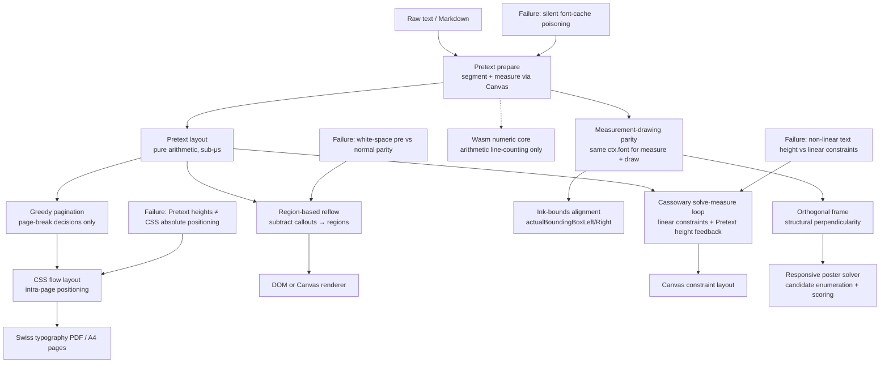

# Typography Partition A — Pretext, Print-Layout Core, and Canvas Measurement

## Executive summary

- **Partition**: Two arcs from the parent topic-03 report — "Pretext and print-layout core" (4 files) and "Canvas text measurement, geometry, and constraints" (4 files), plus one adjacent print-DSL file that belongs to the print-layout arc. Partition B owns DMETA/TTC/generated UI, CSS visual diff/Storybook/parity, and Typography debugging/font tooling.
- **Strongest arcs**: (1) Pretext two-stage measurement (`prepare` once → `layout` many) as the recurring engine for print pagination, interactive reflow, constraint solving, and poster fitting. (2) Canvas measurement-drawing parity: measuring and drawing through the same `ctx.font` / shaping engine eliminates DOM-vs-canvas drift.
- **Concept-map spine**: `Pretext prepare/layout split` → `print pagination (page-break decisions only)` → `CSS flow for intra-page layout` → `Cassowary solve-measure loop for constraints` → `region-based interactive reflow` → `orthogonal frame/poster solver` → `measurement-drawing parity on Canvas`.
- **Canonical failures**: Pretext heights diverge from CSS absolute positioning; Cassowary cannot express non-linear text height directly; silent font-cache poisoning when fonts load asynchronously; `white-space: pre` vs `normal` parity mismatch.
- **Start here**: `Projects/2026/05/27/ARTICLE - Pretext Print Layout - Building a Swiss Typography Rendering System for Dense Programming Reports.md` (the canonical Pretext architecture + failure modes), then `Projects/2026/06/02/ARTICLE - Constraint-Based Layout on Canvas - Cassowary + Pretext + React.md` (the solve-measure loop).

## Scope and search method

- **Corpus**: Markdown reports under `Projects/2026/{03,04,05,06}/`.
- **Partition**: Files explicitly assigned to arcs "Pretext and print-layout core" and "Canvas text measurement, geometry, and constraints" from the parent source report `sources/03-typography-layout-design-systems.md`. Added one adjacent file (`Ruder Typography Plates`) referenced by both Canvas articles and squarely about Pretext measurement on Canvas. Added two print-DSL files (Berkeley Mono specimen, Sphinx LaTeX PDF) that belong to the print-layout arc.
- **Excluded**: DMETA/TTC/generated UI, CSS visual diff/Storybook/parity, typography debugging/font tooling — assigned to partition B.
- **Selection rule**: deeply read all files in the two assigned arcs plus adjacent print-layout files.

## Evidence ledger

| Path | Evidence level | Lines / basis | Cluster | Why it matters |
|---|---|---|---|---|
| `Projects/2026/03/30/PROJ - Pretext - Current AssemblyScript Implementation.md` | read | full file (~180 lines) | Pretext core / wasm boundary | Defines the narrow wasm numeric-core boundary: wasm owns only arithmetic line-counting over JS-prepared arrays |
| `Projects/2026/05/18/ARTICLE - Semantic Print-Layout DSL - Berkeley Mono Manual Specimen Lab.md` | read | full file (~200 lines) | Print-DSL | Semantic builder DSL emitting serializable document tree; live eval loop; theme/builder/renderer separation |
| `Projects/2026/05/27/ARTICLE - Pretext Print Layout - Building a Swiss Typography Rendering System for Dense Programming Reports.md` | read | full file (~250 lines) | Pretext print-layout core | Canonical Pretext architecture: four-layer system, absolute-positioning failure, flow-layout fix, Swiss typography rules |
| `Projects/2026/06/02/ARTICLE - Constraint-Based Layout on Canvas - Cassowary + Pretext + React.md` | read | full file (~250 lines) | Canvas constraints | Iterative solve-measure loop bridging linear Cassowary and non-linear text height; strength hierarchy; constraint propagation |
| `Projects/2026/06/19/ARTICLE - Ruder Typography Plates on Canvas - From Pretext Measurement to a Fluent DSL.md` | read | full file (~300 lines) | Canvas measurement | Measurement-drawing parity; ink-bounds vs advance-box alignment; construction guides; ideal DSL design |
| `Projects/2026/06/19/ARTICLE - Perpendicular Text Composition on Canvas - A Frame + Run Engine.md` | read | full file (~200 lines) | Canvas geometry | Structural orthogonality invariant: derive second axis from first by construction, not computation |
| `Projects/2026/06/19/ARTICLE - Responsive Orthogonal Typography Solver - Pretext Poster Fitting Deep Dive.md` | read | full file (~250 lines) | Canvas geometry | Responsive poster solver: candidate enumeration, font-scale search, hard constraints vs soft scoring |
| `Projects/2026/06/20/PROJECT REPORT - typo-reflow-foldout - Pretext-Driven Text Reflow Architecture.md` | read | full file (~250 lines) | Pretext interactive reflow | Region-based reflow abstraction; per-frame layout at 15-35μs; three parity failure modes |
| `Projects/2026/06/22/ARTICLE - Taking Control of Sphinx LaTeX PDF Typography.md` | read | full file (~200 lines) | Print-layout (LaTeX) | Sphinx `latex_elements` as single control point; `\makeatletter` trap; `fncychap` chapter headings; live `latexmk -pvc` loop |

## Condensed per-arc summaries

### Arc 1: Pretext two-stage measurement core

- **`prepare()` / `layout()` split**: `prepare()` segments text (UAX #14), measures segment widths via Canvas `measureText`, returns an opaque handle. `layout()` is pure arithmetic over cached widths — 500-600× faster than DOM measurement. For 50 blocks: ~1s one-time prepare, <5ms per re-layout. (`Projects/2026/05/27/...` lines 38-60)
- **Wasm numeric core boundary**: The AssemblyScript port handles only the arithmetic line-counting core over JS-prepared numeric arrays. Analysis, segmentation, measurement, and rich line materialization remain JavaScript-side. Wasm receives a "compiled layout IR" — no source string, no measurement backend. (`Projects/2026/03/30/...` full file)
- **Engine-profile shims**: The upload bridge passes behavior flags (`lineFitEpsilon`, `discretionaryHyphenWidth`, `tabStopAdvance`, soft-hyphen policies) across the JS→wasm boundary. Wasm does not discover browser behavior for itself. (`Projects/2026/03/30/...` "Upload boundary" section)
- **Architecture invariant**: "Wasm starts after the prepared numeric state already exists." The port proves the resize-hot-path core can live in wasm, the prepared-state interface can be flat numeric arrays, and batch line counting is natural for wasm. (`Projects/2026/03/30/...` "Architecture" section)

### Arc 2: Pretext print-layout system

- **Four-layer architecture**: Input (Markdown→MDAST→typed blocks) → Measurement (Pretext `prepare`/`layout` per block) → Pagination (greedy single-pass, orphan prevention) → React Components (CSS flow layout). Each layer has a single responsibility. (`Projects/2026/05/27/...` "four-layer architecture" section)
- **Absolute-positioning failure → flow-layout fix**: Initial implementation used Pretext `yOffset` for absolute CSS positioning. Heights diverged (120px measured → 128px rendered), accumulating overlaps across a page. **Working rule**: "Use Pretext for page-break decisions and CSS flow for intra-page layout. The browser's CSS engine is the authority for intra-page layout." (`Projects/2026/05/27/...` "absolute-positioning failure" section)
- **Font string synchronization**: Pretext canvas font strings must exactly match CSS `font-family`/`font-size` declarations. Centralized in `src/measurement/fonts.ts`. Any mismatch produces measurement errors that accumulate. (`Projects/2026/05/27/...` "font string synchronization" section)
- **Swiss typography system**: 6px baseline grid; three typefaces (Newsreader body, Inter headings, JetBrains Mono code); hierarchy through size/weight contrast, not decoration; all spacing derived from baseline unit. Two-column grid design (not yet implemented) introduces width-adaptive code blocks via `measureNaturalWidth()`. (`Projects/2026/05/27/...` "typographic palette" + "two-column grid" sections)
- **Semantic CSS custom properties**: Three-layer token system: primitives (`--baseline: 6px`) → layout tokens (`--column-width`) → semantic spacing (`--space-h2-before`). Overridable in `@media print` without React code changes. (`Projects/2026/05/27/...` "semantic CSS custom properties" section)

### Arc 3: Interactive text reflow (typo-reflow-foldout)

- **Region abstraction**: Geometry problem and text-walking problem are independent. Geometry: subtract callout obstructions from column horizontal extent per line-band → free rectangular regions in reading order. Text: Pretext `layoutNextLineRange` fills each region one line at a time. (`Projects/2026/06/20/...` "region abstraction" section)
- **Two-stage memoization enforced**: `prepare` runs only on text/font/letter-spacing change. Drag calls only the fast `layout` stage. PerfHud counts both stages independently; `prepare` climbing during drag is a bug, not a slow operation. (`Projects/2026/06/20/...` "interaction hot path" section)
- **Three parity failure modes**: (1) CSS `white-space: pre` vs `normal` — `pre` preserves trailing space, making lines ~1 space wider, overflows at narrow gutter widths. (2) Callout chrome parity — `box-sizing: border-box` means visual width ≠ content width; obstruction box must match visual box. (3) **Silent font-cache poisoning** — Pretext caches segment widths at `prepare()` time using whatever font is active. If named font isn't loaded, canvas silently falls back to substitute metrics and caches wrong widths. Only manifests at narrow widths. Fix: await `document.fonts.ready`, call `pretext.clearCache()` after fonts load. (`Projects/2026/06/20/...` "keeping pretext measurement honest" section)
- **Performance**: Reflow pipeline is 15-35μs per frame (~500× under 16.6ms budget). DOM renderer crosses budget at ~700 lines; canvas renderer stays under 2ms at 2000 lines. The renderer choice, not Pretext, decides drag smoothness. (`Projects/2026/06/20/...` "performance measurements" section)

### Arc 4: Cassowary constraint layout on Canvas

- **Iterative solve-measure loop**: Text height is non-linear (discontinuous at line-break thresholds); Cassowary solves linear constraints. Solution: resolve constraints → measure text heights with Pretext → feed measured heights as edit variable suggestions → re-solve → repeat until convergence (2-3 iterations, <1ms). (`Projects/2026/06/02/...` "iterative solve-measure loop" section)
- **Strength hierarchy determines yielding**: required > strong > medium > weak. Required constraints are for structural relationships only (bounds, gaps, alignment equalities). Weak constraints are for preferences (margins). Edit variables are strong. When a required constraint links two frames, dragging one requires suggesting values for both — the solver cannot reconcile conflicting strong edit variables through a required equality. (`Projects/2026/06/02/...` "strength hierarchy" section)
- **ConstraintEngine lives outside Redux**: The Cassowary `Solver` is mutable and non-serializable; only resolved layout values are stored in Redux. Canvas render loop reads from `store.getState()` every animation frame, decoupled from React re-renders. (`Projects/2026/06/02/...` "architecture" section)
- **kiwi.Constraint constructor trap**: `new kiwi.Constraint(expr, op, Strength.strong)` creates `expr == 1000000` instead of `expr == 0` at strong strength. Always use `solver.createConstraint(lhs, op, rhs, strength)`. (`Projects/2026/06/02/...` "common failure modes" section)

### Arc 5: Canvas measurement-drawing parity (Ruder plates)

- **Measurement-drawing parity is the foundation**: When `ctx.measureText` and `ctx.fillText` run against the same font shorthand on the same DPR-scaled canvas, measured advance widths and drawn glyph origins coincide exactly. No DOM-vs-canvas drift. This is why the project draws on Canvas rather than positioning DOM nodes. (`Projects/2026/06/19/ARTICLE - Ruder Typography Plates...` "shared foundation" section)
- **Ink-bounds vs advance-box alignment**: `textAlign='left'|'right'|'center'` anchors the advance box, not visible ink. For glyphs with side bearings, advance-box alignment produces ragged columns. Fix: offset draw position by `actualBoundingBoxLeft` and `actualBoundingBoxRight`. (`Projects/2026/06/19/ARTICLE - Ruder Typography Plates...` "Plate 2" section)
- **Construction guides are weight-invariant; ink area is not**: Cap-height, x-height, descender guides drawn from regular weight (400) apply to every weight. The ink-area block behind a glyph grows with weight because the stem thickens. (`Projects/2026/06/19/ARTICLE - Ruder Typography Plates...` "Plate 3" section)
- **Ideal fluent DSL**: The implementation leaks canvas vocabulary (`ctx.font`, `actualBoundingBoxLeft`) into typography specs. The ideal DSL speaks domain vocabulary (`.alignInk('left','center','right')`, `.weightRamp([400,700,900])`, `.measure('ink-bounds')`). Design doc only, not implemented. (`Projects/2026/06/19/ARTICLE - Ruder Typography Plates...` "ideal fluent DSL" section)

### Arc 6: Orthogonal/perpendicular text composition

- **Structural orthogonality invariant**: Perpendicularity is a property of the data model, not a computed target. One orthonormal frame is defined at the corner (`u = (cos θ, sin θ)`); the second axis is `v = (-sin θ, cos θ)`, derived once and never stored independently. Dot product is zero for every θ. First implementation computed `angle₂ = angle₁ + π/2` and drifted to 113°. (`Projects/2026/06/19/ARTICLE - Perpendicular Text Composition...` "frame" section)
- **Rotation is a single transform applied once about the corner**: All text is placed in local frame coordinates where axes are unit basis. Global rotation does not interact with per-run placement. (`Projects/2026/06/19/ARTICLE - Perpendicular Text Composition...` "frame" section)
- **Closed-form fill-the-frame solve**: Fit-only binary search over font size leaves voids. Joint solve for font size and corner position by pinning each run to a different edge. Text advance width scales linearly with font size, so ratios measured once at 100px give closed-form constraints. (`Projects/2026/06/19/ARTICLE - Perpendicular Text Composition...` "solving for font size" section)
- **Responsive poster solver**: Enumerated search over candidate strategies (inline/break, anchored/shifted, offset variants) × font scales. Hard constraints (orthogonality, no overlap, in-bounds) validated with rotated polygon intersection. Soft scoring (violations, font penalty, compactness) selects best candidate. Current limitation: validity is not yet typographic quality. (`Projects/2026/06/19/ARTICLE - Responsive Orthogonal Typography Solver...` "solve pipeline" + "scoring" sections)

### Arc 7: Print-layout DSLs (Berkeley Mono, Sphinx LaTeX)

- **Semantic builder DSL**: Berkeley Mono specimen lab separates theme/typography, layout primitives, and domain components. Builder API emits a plain serializable document tree; HTML renderer consumes it. Live eval loop (CodeMirror → `new Function()` → 180ms debounce → re-render). Settings panel is declarative via `typographyLab()` DSL. (`Projects/2026/05/18/...` full file)
- **Sphinx LaTeX single control point**: A Sphinx LaTeX PDF's entire appearance is controlled by one Python dict (`latex_elements` in `conf.py`) plus `latex_engine`. Three layers: Sphinx options (`pointsize`, `geometry`, `sphinxsetup`), raw LaTeX in `preamble` string (`fancyhdr`, `hyperref`), and `fncychap` package for chapter openings. (`Projects/2026/06/22/...` "single point of control" section)
- **`\makeatletter` trap**: Sphinx injects the `preamble` outside any `\makeatletter … \makeatother` group. `@`-macro names (`\py@HeaderFamily`, `\p@`) fail to tokenise. Wrap all `@`-macro blocks in `\makeatletter`. (`Projects/2026/06/22/...` "makeatletter trap" section)
- **Measure and leading before fonts**: "Measure and leading fix 'hard to read' far more often than font choice does." Increasing from 10pt to 12pt with `hmargin=1.5in` moved the book from 213 to ~300 pages — expected and correct. (`Projects/2026/06/22/...` "measure and size" section)

## Topic architecture / spine



## Candidate concept-map material

### Nodes

| Node | Type | Confidence | Notes |
|---|---|---|---|
| Pretext `prepare()`/`layout()` split | concept | high | Central recurring primitive; 500-600× faster than DOM. Appears in print, reflow, constraints, poster fitting. |
| Pretext wasm numeric core | project | high | Narrow boundary: arithmetic line-counting over JS-prepared arrays only. Status: active. |
| Canvas text measurement | technology | high | `ctx.measureText()` as width oracle backing Pretext `prepare()`. |
| Measurement-drawing parity | concept | high | Same `ctx.font` for measure + draw eliminates DOM-vs-canvas drift. Foundation of all Canvas typography projects. |
| Ink-bounds alignment | concept | high | `actualBoundingBoxLeft/Right` offsets for visible-edge alignment; advance-box alignment is wrong for display glyphs. |
| Pretext print-layout system | project | high | Four-layer: input→measurement→pagination→React. Status: current. |
| Swiss typography / baseline grid | concept | high | 6px baseline; hierarchy through size/weight contrast; all spacing derived from baseline. |
| Absolute-positioning failure mode | failure-mode | high | Pretext heights diverge from CSS rendered heights; fix is page-break decisions only + CSS flow. |
| Font string synchronization | concept | high | Canvas font strings must exactly match CSS declarations; centralized in one module. |
| Semantic CSS custom properties | concept | high | Three-layer token system: primitives → layout → semantic spacing. |
| Width-adaptive code blocks | concept | medium | `measureNaturalWidth()` decides column vs full-width; planned, not implemented. |
| Region-based text reflow | concept | high | Geometry (subtract obstructions → regions) independent from text-walking (Pretext fills regions). |
| Two-stage memoization boundary | concept | high | `prepare` must never run in per-frame drag path; PerfHud enforces. |
| Silent font-cache poisoning | failure-mode | high | Pretext caches fallback metrics if font not loaded; only manifests at narrow widths. Fix: await `document.fonts.ready` + `clearCache()`. |
| `white-space` parity mismatch | failure-mode | high | `pre` preserves trailing space → overflow at narrow widths; `normal` is correct. |
| Callout chrome parity | failure-mode | high | `box-sizing: border-box` means visual width ≠ content width; obstruction must match visual. |
| Cassowary solve-measure loop | concept | high | Iterative: solve positions → measure heights with Pretext → feed back as suggestions → repeat. Converges 2-3 iterations, <1ms. |
| Cassowary strength hierarchy | concept | high | required > strong > medium > weak; determines yielding when overconstrained. Required = structural only. |
| Constraint propagation through required constraints | concept | high | Dragging a frame linked by required equality requires suggesting values for both frames. |
| `kiwi.Constraint` constructor trap | failure-mode | high | Positional params create `expr == Strength_value` instead of `expr == 0` at that strength. |
| ConstraintEngine outside Redux | concept | high | Mutable solver is non-serializable; only resolved values stored in Redux. |
| Structural orthogonality invariant | concept | high | Derive second axis from first by construction, not computation. Perpendicularity is data property. |
| Orthogonal frame + run engine | project | high | One angle θ, two derived axes; runs placed on axes; rotation = single transform. Status: current. |
| Closed-form fill-the-frame solve | concept | high | Joint solve for font size + corner position by pinning runs to edges; replaces binary search. |
| Responsive poster solver | project | high | Enumerated search: candidate strategies × font scales; hard constraints + soft scoring. Status: active. |
| Rotated polygon overlap validation | concept | high | Separating-axis test on convex ink-box quadrilaterals; cross-family only. |
| LayoutViolation diagnostics | concept | high | Violations carry type + data (angle/overlap/out-of-bounds), not boolean failure. |
| Ruder typography plates | project | high | Seven plates exercising measurement, ink-bounds, construction guides, geometry. Status: complete. |
| Ideal fluent typography DSL | open-question | medium | Design doc only; domain vocabulary over canvas vocabulary. Not implemented. |
| Berkeley Mono specimen lab | project | high | Semantic builder DSL → serializable tree → HTML renderer; live eval loop; declarative controls. Status: current. |
| Sphinx LaTeX PDF typography | project | high | `latex_elements` as single control point; `fncychap` chapter headings; live `latexmk -pvc` loop. Status: current. |
| `\makeatletter` trap | failure-mode | high | Sphinx `preamble` runs outside `\makeatletter`; `@`-macros fail to tokenise. |
| Semantic builder DSL pattern | concept | high | Fluent API emitting plain serializable tree; renderer consumes tree. Separates authoring from placement. |
| Live eval loop | workflow | high | CodeMirror → `new Function()` → debounce → re-render; presets persist settings + code. |
| `latexmk -pvc` live preview loop | workflow | high | Two-layer: `entr` watches `conf.py` → `make latex` → `latexmk -pvc` recompiles `.tex` → viewer reloads. |

### Edges

```text
Pretext prepare/layout split --enables--> fast pagination and interactive reflow [high] (Projects/2026/05/27/...)
Canvas text measurement --backs--> Pretext prepare stage [high] (Projects/2026/05/27/... lines 38-60)
Pretext measurement --informs--> pagination page-break decisions [high] (Projects/2026/05/27/... "absolute-positioning failure")
Pretext measurement --must not be used for--> absolute CSS positioning [high] (Projects/2026/05/27/... "absolute-positioning failure")
Absolute-positioning failure mode --drives--> CSS flow layout for intra-page positioning [high] (Projects/2026/05/27/...)
Font string synchronization --prevents--> measurement-vs-rendered height divergence [high] (Projects/2026/05/27/... "font string synchronization")
Pretext wasm numeric core --handles only--> arithmetic line-counting [high] (Projects/2026/03/30/... full file)
Pretext prepare/layout split --enables--> region-based text reflow [high] (Projects/2026/06/20/... "pretext two-stage API")
Region-based text reflow --separates--> geometry problem from text-walking problem [high] (Projects/2026/06/20/... "region abstraction")
Two-stage memoization boundary --protects--> prepare from per-frame drag path [high] (Projects/2026/06/20/... "interaction hot path")
Silent font-cache poisoning --requires--> await document.fonts.ready + clearCache() [high] (Projects/2026/06/20/... "font-cache poisoning")
white-space parity mismatch --causes--> overflow at narrow gutter widths [high] (Projects/2026/06/20/... "font configuration parity")
Cassowary solver --requires bridge to--> Pretext measured text height [high] (Projects/2026/06/02/... "iterative solve-measure loop")
Cassowary strength hierarchy --determines--> which constraints yield when overconstrained [high] (Projects/2026/06/02/... "strength hierarchy")
Constraint propagation through required constraints --requires--> suggesting values for both linked frames [high] (Projects/2026/06/02/... "interaction")
kiwi.Constraint constructor trap --causes--> unsatisfiable constraint errors [high] (Projects/2026/06/02/... "common failure modes")
ConstraintEngine --lives outside--> Redux store [high] (Projects/2026/06/02/... "architecture")
Measurement-drawing parity --guarantees--> measured advance widths equal drawn glyph origins [high] (Projects/2026/06/19/ARTICLE - Ruder Typography Plates... "shared foundation")
Ink-bounds alignment --fixes--> ragged columns from advance-box alignment [high] (Projects/2026/06/19/ARTICLE - Ruder Typography Plates... "Plate 2")
Structural orthogonality invariant --guarantees--> perpendicularity by construction not computation [high] (Projects/2026/06/19/ARTICLE - Perpendicular... "frame")
Closed-form fill-the-frame solve --replaces--> binary search font-size fitting [high] (Projects/2026/06/19/ARTICLE - Perpendicular... "solving for font size")
Responsive poster solver --enumerates--> candidate strategies × font scales [high] (Projects/2026/06/19/ARTICLE - Responsive... "solve pipeline")
LayoutViolation diagnostics --makes--> solver decisions inspectable [high] (Projects/2026/06/19/ARTICLE - Responsive... "hard constraints")
Semantic builder DSL pattern --emits--> serializable document tree [high] (Projects/2026/05/18/... "builder API")
Live eval loop --drives--> real-time re-render from CodeMirror [high] (Projects/2026/05/18/... "live eval loop")
Sphinx latex_elements --controls--> entire LaTeX PDF appearance [high] (Projects/2026/06/22/... "single point of control")
latexmk -pvc live preview loop --requires--> two-layer watching (conf.py + .tex) [high] (Projects/2026/06/22/... "live preview loop")
```

## Cross-links to other topic slices

- **Topic 1 (Hardware/embedded/ESP32)**: Thermal printer layout and e-ink/PicoCalc text rendering share the measurement-then-rasterize pattern. The `prepare`/`layout` split is conceptually parallel to host-side raster preparation → device-side display. The Ruder plates' pixel-scan verification is conceptually parallel to hardware visual debugging.
- **Topic 2 (JavaScript runtimes/goja/xgoja)**: Berkeley Mono's live eval loop uses `new Function()` — a mini DSL runtime. The ideal typography DSL (`.family().weightRamp().alignInk().render()`) is structurally similar to Go-backed fluent DSLs. Pretext itself is a pure TypeScript library that could run under goja.
- **Topic 5 (AI agents/transcripts/observability)**: The Ruder plates used a vision-language model for nine-pass visual comparison of typography against reference images. The methodology — re-establish full context per call, trust relative judgments, distrust absolute pixel estimates — is directly relevant to agent-driven visual QA. The perf-report.html and FitDiagnostics objects are agent-readable artifacts.
- **Topic 6 (Data/RAG/OCR/search)**: The Pretext print-layout system renders the Book OCR Project Report as its canonical 48KB test document. The Markdown→typed-blocks→Pretext measurement pipeline is a document transform pipeline conceptually parallel to Source→Document→Chunk→Embedding.
- **Topic 7 (Web UI/apps/media/productivity)**: React/Canvas rendering architectures, Vite+TypeScript app shells, and browser DOM/CSS interaction patterns are shared across all projects in this partition. The Berkeley Mono specimen lab's CodeMirror integration and the typo-reflow-foldout's Zustand store are web-app-shell patterns. The canvas-vs-DOM renderer tradeoff (DOM for accessibility, canvas for performance) maps to the "SPA shell poor for agents/search" failure mode.

## Open questions and second-pass targets

- Should Pretext be represented as one node or split into `library`, `measurement API`, `wasm numeric core`, `print-layout usage`, `canvas usage`, and `reflow usage`? The wasm boundary is architecturally significant and may warrant its own node.
- Is the Berkeley Mono specimen lab part of this partition or does it belong more naturally to Topic 7 (Web UI/apps)? It is a print-layout DSL but also a browser-based interactive tool. I've included it because its architecture (semantic builder → serializable tree → renderer) is a print-layout pattern.
- Should the Sphinx LaTeX PDF typography be a separate print-pipeline node that connects to Pretext print-layout as an alternative path to PDF typography? Both produce paginated typographic documents but use entirely different engines (LaTeX vs React+Pretext).
- The ideal fluent typography DSL is only a design doc — should it be an `open-question` node or a `concept` node? It represents a future direction, not a current implementation.
- The responsive poster solver's soft-scoring model is explicitly unfinished (validity ≠ typographic quality). Should this be an `open-question` node or a `failure-mode` node for "first valid candidate is not best candidate"?

## Start here

1. `Projects/2026/05/27/ARTICLE - Pretext Print Layout - Building a Swiss Typography Rendering System for Dense Programming Reports.md` — the canonical Pretext architecture and failure-mode reference. Establishes the two-stage API, the absolute-positioning failure, and the flow-layout fix that all subsequent projects build on.
2. `Projects/2026/06/02/ARTICLE - Constraint-Based Layout on Canvas - Cassowary + Pretext + React.md` — the solve-measure loop that bridges linear constraints and non-linear text height. Together these two files expose the measurement→layout→rendering spine and the two hardest failure modes in the partition.
