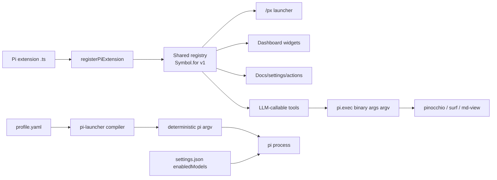
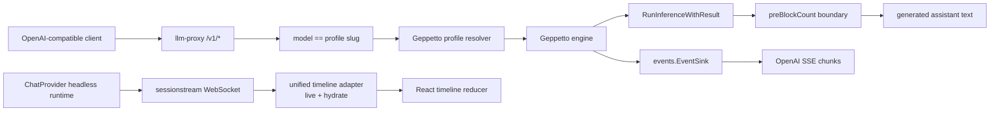
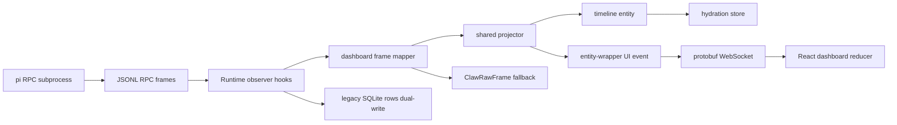

# Topic 5 Partition B — Pi Core, LLM Proxy/Provider, Dashboards/Observability/a14y

## Executive summary

- Partition B covers three surface/provider arcs of topic 5: **Pi core and extensions**, **LLM proxy/provider work and tool-calling behavior**, and **Dashboards, observability, readability/a14y**. Transcript analysis (go-minitrace) and live streaming flows (Sessionstream/Pinocchio/Geppetto) belong to partition A and are referenced here only as cross-links.
- The strongest Pi arc is the **shared extension framework + registry + thin-boundary tool delegation** model; a second Pi arc is the **launch-time config compiler** (`pi-launcher`) that turns one YAML profile into deterministic `pi` argv.
- The strongest provider arc is the **LLM proxy** that maps an OpenAI-compatible surface onto Geppetto engine profiles, plus the **ChatProvider headless runtime** extracted from overlay/web-chat duplication, and the **provider-compatibility-contract** pattern (compat flags consumed where the wire bytes are produced).
- The strongest dashboard arc is the **streaming agent dashboard** (`run_id == sessionstream.SessionId`, shared projector, protobuf entity-wrapper UI events) and the **a14y server-contract** pattern (agent readability is an HTTP routing commitment before the SPA fallback, not a frontend enhancement).
- Likely concept-map spine: `Pi extension -> registerPiExtension -> registry -> launcher/dashboard/docs/tools -> thin boundary -> external CLI`; `OpenAI client -> llm-proxy -> Geppetto profile slug -> engine -> canonical events`; `pi RPC frames -> observer -> mapper -> shared projector -> entity-wrapper UI event -> WebSocket -> React reducer`.
- Start with `PROJECT REPORT - Pi Extensions Shared Framework and Tool Surface Deep Dive.md` and `ARTICLE - Streaming Agent Dashboard - Server Side Implementation Deep Dive.md`.

## Scope and search method

- Corpus: Markdown project/report/article files under `Projects/2026/{04,05,06}/` assigned to partition B in the first-batch report `sources/05`.
- Selection rule: deeply read the canonical architecture reports for each subcluster (one to three per arc); heading-scan companion reports; title-only inventory the rest. Partition A files (go-minitrace transcript analysis; Sessionstream/Pinocchio/Geppetto live streaming flows) were not deep-read here and appear only as cross-links.
- The partition B file set is taken directly from `sources/05` sections "Pi core and extensions", "LLM proxy/provider work and tool-calling behavior", and "Dashboards, observability, readability/a14y".

## Evidence ledger

| Path | Evidence level | Lines / basis | Cluster | Why it matters |
|---|---|---|---|---|
| `Projects/2026/05/13/PROJECT REPORT - Pi Extensions Shared Framework and Tool Surface Deep Dive.md` | read | lines 1-440 (full) | Pi core/extensions | Canonical registry + thin-boundary tool delegation model |
| `Projects/2026/06/04/PROJ - pi-launcher - Declarative YAML Profiles for Pi.md` | read | lines 1-470 (full) | Pi core | Launch-time config compiler; strict YAML; deterministic argv |
| `Projects/2026/04/23/PROJ - Pi Extension - A Textbook on Writing and Testing Pi Extensions.md` | read | lines 1-560 (full) | Pi core/extensions | Event seams, read-only copies invariant, three-layer extension pattern |
| `Projects/2026/05/14/ARTICLE - Pi Agent Dashboard - RPC Streaming Presets and Protobuf Deep Dive.md` | read | lines 1-560 (full) | Pi core / dashboards | run_id==session id; RPC default; protobuf entity-wrapper events; preset output-schema contract |
| `Projects/2026/05/12/ARTICLE - Streaming Agent Dashboard - Server Side Implementation Deep Dive.md` | read | lines 1-430 (full) | Dashboards/observability | Shared projector (one event -> entity + UI event); observer seam; raw-frame fallback |
| `Projects/2026/06/04/ARTICLE - LLM Proxy - Geppetto Engine OpenAI Completions Prototype Deep Dive.md` | read | lines 1-430 (full) | LLM proxy | model==profile slug; Geppetto owns provider setup; preBlockCount output boundary |
| `Projects/2026/06/01/ARTICLE - Generic ChatProvider - From Overlay Runtime to Provider Backed Web Chat.md` | read | lines 1-1111 (full) | Provider / web chat | Headless provider runtime; unified timeline adapter (live + hydrate); provider-scoped registries |
| `Projects/2026/05/25/ARTICLE - Agent a14y for Go-Hosted React Docs - Converting docsctl from SPA Shell to Agent-Readable Site.md` | read | lines 1-400 (full) | a14y | Server contract: agent files before SPA fallback; .md mirrors; a14y 42->97 |
| `Projects/2026/06/06/PROJ - Retro Obsidian Publish - A Retro Monochrome Vault Browser.md` | read | lines 1-560 (full) | a14y / dashboards | Single-binary vault publisher; SSR sidecar; a14y 62->99; vault as read-only source of truth |
| `Projects/2026/05/29/ARTICLE - Playbook - Debugging and Fixing Pi Provider Replay Bugs.md` | read | lines 1-310 (full) | Pi core / provider | Duplicate Responses item IDs during cross-provider replay; conversion-unit test |
| `Projects/2026/04/07/ARTICLE - Investigating LLM Thinking Content in Tool-Rich Coding Agent Contexts.md` | read | lines 1-560 (full) | Provider/tool-calling | Thinking dampening is model behavior, not pipeline loss; proto schema is the contract |
| `Projects/2026/05/05/ARTICLE - Pi Scoped Models Configuration.md` | read | lines 1-300 (full) | Pi core | enabledModels cycle; provider-qualified IDs; thinking is separate axis |
| `Projects/2026/04/23/ARTICLE - Go Logging Landscape - Zerolog, Slog, and Per-Component Control.md` | read | lines 1-490 (full) | observability | zerolog sub-logger value-copy bug; slog handler separates filtering from routing; seilog |
| `Projects/2026/05/29/PROJ - Pi Core - Umans GLM DeepSeek Reasoning Fix Report.md` | read | lines 1-380 (full) | Pi core / provider | compat flags consumed at request builder; supportsReasoningEffort guard |
| `Projects/2026/05/15/ARTICLE - Pi Claw Runtime Packaging - Scenario Driven LLM Extraction and Auditable Agent Runs.md` | read | lines 1-560 (full) | Pi core / provider | pirpc + clawrun reusable substrates; scenario YAML; generated typed tools; auditability rule |
| `Projects/2026/06/05/ARTICLE - Geppetto Gemini SDK Modernization - Gemini 3 Flash Deep Dive.md` | heading-scanned | lines 1-80 | LLM proxy | SDK capability probe; genai v1.58 vs legacy; ThinkingConfig preservation |
| `Projects/2026/05/19/ARTICLE - Presentation-Based UI for Log Viewing.md` | heading-scanned | lines 1-60 | observability | Presentations not strings; operations as data; CLIM-style typed presentations |
| `Projects/2026/05/29/PROJ - Pi Extensions - Umans GLM Compaction Fix Report.md` | heading-scanned | lines 1-60 | Pi core/extensions | Extension-side workaround (disable thinking for title call); deeper fix in pi-ai |
| `Projects/2026/06/05/ARTICLE - LLM Proxy - Chat Completions Tools and Pinocchio Smoke Technical Report.md` | heading-scanned | lines 1-60 | LLM proxy | /v1/chat/completions sibling; function tools -> Geppetto tools; Pinocchio smoke passed |
| `Projects/2026/05/29/ARTICLE - Chatbot Overlay Framework - TypeScript and Frontend Tool Calling Deep Dive.md` | heading-scanned | lines 1-60 | provider/tool-calling | Frontend tool round trip via sessionstream; human-in-the-loop same protocol |
| `Projects/2026/04/07/PROJ - pi Mono - Investigating LLM Thinking Content Truncation.md` | title-only | filename/frontmatter | Pi core | Project companion to the thinking investigation |
| `Projects/2026/04/21/ARTICLE - Playbook - Building and Testing Pi Extensions.md` | title-only | filename/frontmatter | Pi core/extensions | Extension lifecycle/testing playbook |
| `Projects/2026/04/21/PROJ - Pi Extension - Hello World Before Thinking Blocks.md` | title-only | filename/frontmatter | Pi core/extensions | Minimal thinking-block widget reference |
| `Projects/2026/04/25/PROJ - Pi Session Summary Extension - Textbook Report.md` | title-only | filename/frontmatter | Pi core/extensions | Summary-block injection + widget |
| `Projects/2026/04/26/PROJ - Pi Extensions - Agent Env and Response Capture.md` | title-only | filename/frontmatter | Pi core/extensions | Agent env/response capture extension |
| `Projects/2026/04/27/ARTICLE - Textbook - Building Beautiful TUIs for Pi Extensions.md` | title-only | filename/frontmatter | Pi core/extensions | TUI component contract |
| `Projects/2026/04/27/PROJ - Pi Extensions - Compaction Title Extension.md` | title-only | filename/frontmatter | Pi core/extensions | Compaction-title extension (site of Umans workaround) |
| `Projects/2026/04/27/PROJ - Pi Extensions - Direnv Bash Extension.md` | title-only | filename/frontmatter | Pi core/extensions | Shell/env extension |
| `Projects/2026/05/05/PROJ - Configuring Wafer Models in Pi.md` | title-only | filename/frontmatter | Pi core | Wafer model/provider config |
| `Projects/2026/05/11/ARTICLE - Selective Compaction Extension - Rewriting Middle Session Context.md` | title-only | filename/frontmatter | Pi core/extensions | Selective middle-context compaction |
| `Projects/2026/05/19/ARTICLE - Building a Session Search Extension for Pi - Searching Tool Call History and Navigating Fork Points.md` | title-only | filename/frontmatter | Pi core/extensions | Session-search extension; fork-point navigation |
| `Projects/2026/05/21/ARTICLE - Response Viewer - A Pi Extension for Browsing and Opening Assistant Responses in a Markdown Viewer.md` | title-only | filename/frontmatter | Pi core/extensions | Response viewer extension |
| `Projects/2026/05/27/ARTICLE - Pi Command Palette - Keyboard-Driven Hierarchical Action Menu.md` | title-only | filename/frontmatter | Pi core/extensions | Command palette over registry |
| `Projects/2026/05/28/ARTICLE - Pi Agent Command Palette Extension Architecture - Shared Registry and Keyboard-Driven Actions.md` | title-only | filename/frontmatter | Pi core/extensions | Palette architecture over shared registry |
| `Projects/2026/05/28/ARTICLE - Pi Agent Modals and Terminal Shortcuts - Debugging Overlay Shortcut Behavior.md` | title-only | filename/frontmatter | Pi core/extensions | Modal/shortcut debugging |
| `Projects/2026/05/29/PROJ - Pi Extensions - Response Viewer Metadata Report.md` | title-only | filename/frontmatter | Pi core/extensions | Response-viewer metadata |
| `Projects/2026/04/17/ARTICLE - Dialectic Agent - Implementing Tool-Calling Reasoning for AI Memory Systems.md` | title-only | filename/frontmatter | provider/tool-calling | Tool-calling reasoning for memory |
| `Projects/2026/04/17/ARTICLE - Hermes Agent - Self-Improving AI Agent with Persistent Memory and Skills.md` | title-only | filename/frontmatter | provider/tool-calling | Persistent memory/skills agent |
| `Projects/2026/04/17/ARTICLE - Browser-Owned Capability Execution for Chat - Narrative Field Guide.md` | title-only | filename/frontmatter | provider/tool-calling | Browser-owned capability execution |
| `Projects/2026/04/17/ARTICLE - Playbook - Building a Sandboxed Agent Runner with Go Glazed and Firecracker.md` | title-only | filename/frontmatter | provider/tool-calling | Sandboxed agent runner (Firecracker) |
| `Projects/2026/04/17/PROJ - Client-side Tool Broker for Chat - Intern Research Guide.md` | title-only | filename/frontmatter | provider/tool-calling | Client-side tool broker |
| `Projects/2026/04/29/ARTICLE - Building a Tool-Using Go Chat Agent - Geppetto Goja and Glazed.md` | title-only | filename/frontmatter | provider/tool-calling | Go chat agent tool calls (Geppetto/Goja) — overlaps partition A |
| `Projects/2026/05/31/ARTICLE - ChatProvider Web Chat Cleanup - Provider Runtime Timeline Adapters and Example Architecture.md` | title-only | filename/frontmatter | provider/web chat | Predecessor to Generic ChatProvider report |
| `Projects/2026/06/22/ARTICLE - Analyzing Agent Tool-Calling Behavior with go-minitrace.md` | title-only | filename/frontmatter | provider/tool-calling (cross) | go-minitrace -> partition A; cross-link only |
| `Projects/2026/04/07/ARTICLE - Playbook - Building Prometheus and Grafana into a Go Application from Scraper.md` | title-only | filename/frontmatter | observability | Prometheus/Grafana app observability — overlaps topic 4 |
| `Projects/2026/04/15/ARTICLE - Screencast Studio - Prometheus Metrics Architecture and Field Guide.md` | title-only | filename/frontmatter | observability | Metrics architecture field guide |
| `Projects/2026/04/25/ARTICLE - Observability - Hetzner K3s Metrics Logging and Alerting.md` | title-only | filename/frontmatter | observability | Infra observability — overlaps topic 4 |
| `Projects/2026/05/08/ARTICLE - Transcript Mining - Using go-minitrace to Find and Fix Tool-Call Churn in Agent Sessions.md` | title-only | filename/frontmatter | provider/tool-calling (cross) | go-minitrace churn -> partition A; cross-link only |

## Projects and reports found (condensed per-arc summaries)

### Arc 1 — Pi core and extensions

- **Shared extension framework + registry** (`05/13`): every extension calls `registerPiExtension()` contributing metadata, actions, docs, settings, widgets, commands, tools to one discoverable shape stored under `Symbol.for("wesen.pi.extensions.registry.v1")`. The `/px` launcher and dashboard read that registry; extensions stay thin at boundaries by delegating to external CLIs (`pinocchio`, `surf`, `md-view`) via `pi.exec(binary, args, ...)` argv arrays (never shell interpolation). Status: current.
- **Extension event seams** (`04/23` textbook): the API is event subscription + tool/command registration + UI methods; `message_update` exposes the raw `AssistantMessageEvent` stream; the critical invariant is that handlers receive **read-only copies** of session state — only `before_agent_start` (system prompt), `input` (prompt), and `tool_call` (block) are mutable. Standard message mutation at `turn_end` is silently discarded. The three-layer pattern is observe -> inject -> display.
- **pi-launcher** (`06/04`): a compiler, not a config manager — strict YAML parse (`KnownFields(true)`), profile-relative path resolution, structured validation findings, deterministic argv ordering, dry-run or executed `pi` process. Scope deliberately narrowed: no `extends`, no named-profile lookup, no `settings.json` generation, no SDK embedding. `extensions.sources` (not `.paths`) because Pi `--extension` accepts local files, npm/git/URL specs. Status: current (MVP).
- **Provider compatibility contract** (`05/29` Umans GLM fix + `05/29` compaction workaround): the model `compat` object is an executable contract, not descriptive metadata. `thinkingFormat: "deepseek"` names the thinking-control shape; it does **not** imply support for `reasoning_effort`. The fix sends `reasoning_effort` only when `compat.supportsReasoningEffort` is true. Two-commit pattern: pi-ai defines the generic guard; pi-provider-umans advertises the capability. Status: current (local backport; upstream PR #5196 has the guard).
- **Provider replay bug** (`05/29` playbook): cross-provider assistant history (e.g. GLM `thinking`+`text`) can produce >1 OpenAI Responses `message` item from one Pi message; old fallback ID `msg_${msgIndex}` collided -> duplicate item rejection before stream start. Fix: per-emitted-item `textBlockIndex` in fallback IDs. Lesson: replay bugs are deterministic before the network request -> use conversion-unit tests, not end-to-end provider tests. Status: fixed upstream.
- **Pi Agent Dashboard** (`05/14`): `run_id == sessionstream.SessionId` invariant; RPC mode is now the default Pi mode (rich live frames for messages/thinking/tools/lifecycle); shared projector maps one event to both a timeline entity and a matching UI event (entity-wrapper, not deltas); preset output-schema is a prompt-level contract (scratch tables allowed, required result tables immutable). Status: current.
- **Scoped models** (`05/05`): `enabledModels` array curates a Ctrl+P cycle list; provider-qualified IDs (`zai/glm-5.1` vs `wafer/GLM-5.1`) disambiguate same-name models across providers; thinking level is a separate axis (Shift+Tab), not per-model in the cycle. Status: current.
- Title-only inventory: hello-world thinking widget, session-summary, agent-env, compaction-title, direnv-bash, TUI textbook, Wafer config, selective compaction, session-search, response-viewer, command palette (x2), modals/shortcuts, response-viewer metadata.

### Arc 2 — LLM proxy / provider work and tool-calling behavior

- **LLM proxy** (`06/04` Completions + `06/05` Chat Completions heading-scan): a Go server exposing OpenAI-compatible `/v1/completions`, `/v1/chat/completions`, `/v1/models`, `/healthz`; the `model` field is a **Geppetto engine profile slug**, not a provider model name — provider setup belongs to Geppetto profile YAML. Non-streaming uses `engine.RunInferenceWithResult` with a `preBlockCount` boundary so generated text is extracted only from post-prompt blocks; streaming attaches a Geppetto `events.EventSink` and converts `EventTextDelta` to SSE chunks; only the HTTP handler goroutine writes to `ResponseWriter`. Chat Completions maps messages->turn blocks, function tools->Geppetto per-turn tools, and was smoke-tested through Pinocchio itself. Status: current (prototype).
- **Generic ChatProvider** (`06/01`): extraction of a headless provider runtime `@go-go-golems/chat-provider` from overlay/web-chat duplication. Owns session creation, WebSocket, snapshot hydration, live projection, provider-scoped registries (instance-scoped, not global), frontend tool execution. Apps own profile selection, request-body fields, layout, cards, domain adapters. The key architectural correction: the **unified timeline adapter API** — live projection and snapshot hydration are registered together so an entity that renders live also renders after reload (live-only projectors created reload bugs showing raw protobuf `@type` JSON). Status: current.
- **Thinking-content investigation** (`04/07`): apparent "thinking truncation" was model behavior, not pipeline loss. The 4K-char system prompt causes ~93% reasoning reduction; tools add little on top; "think through it yourself, don't use tools" recovers deep reasoning. The OpenAI Node SDK does not strip `reasoning_content` (raw `JSON.parse`). Seven go-minitrace rendering bugs were fixed first. Critical lesson: in protobuf APIs, the `.proto` schema is the real contract — unknown fields are silently dropped. Status: resolved.
- **Geppetto Gemini modernization** (`06/05` heading-scan): replaced legacy `generative-ai-go` with `google.golang.org/genai v1.58.0`; SDK-capability compile probe decides implementation-vs-SDK-boundary first; preserves `ThinkingConfig`, thought signatures, provider-native function-call IDs, response IDs. Status: current.
- **Pi Claw runtime packaging** (`05/15`): reusable Go packages `pkg/pirpc` (pi RPC subprocess control, JSONL frame reader avoiding `bufio.Scanner` limits, waits for `agent_end`, extracts `tool_execution_end.details`) and `pkg/clawrun` (run ledger around SQLite input/output DBs). Domain logic (`extractctl` for therapist search) stays separate: scenario YAML -> generated TypeScript pi tool -> `clawrun` run -> normalized scenario tables -> import into main DB. Core rule: auditability — every normalized row traces back to provider, scenario, model, prompt, tool result, raw RPC frame, session file. Tool results preferred over prose JSON. Status: current.
- **Frontend tool calling** (`05/29` Chatbot Overlay heading-scan): frontend tools are a sessionstream-native round trip (`ChatFrontendToolCallRequested` -> browser executes -> `ChatFrontendToolResult` -> backend resumes); human-in-the-loop tools use the same protocol but leave the call pending until a React approval card invokes `respond()`/`reject()`. Status: current.
- Title-only inventory: dialectic agent, Hermes agent, browser-owned capability execution, sandboxed Firecracker runner, client-side tool broker, Go chat agent (Geppetto/Goja), ChatProvider cleanup predecessor.

### Arc 3 — Dashboards, observability, readability/a14y

- **Streaming agent dashboard** (`05/12` server-side + `05/14` full-stack): the runtime performs work, the dashboard observes, sessionstream materializes. The **observer seam** (`internal/runtime/observer.go`: `RunCreated`, `RunStatusChanged`, `ProcessOutput`, `RPCFrame`) lets streaming be added without breaking the legacy SQLite polling store (dual-write). The **shared projector** (`ProjectClawEvent`) maps one backend event into both a timeline entity and a matching entity-wrapper UI event so snapshots and live updates speak the same entity language — the frontend only upserts, never appends deltas. Raw-frame fallback (`ClawRawFrameEvent`) preserves unknown protocol frames as a staging area for protocol discovery. Status: current.
- **a14y server contract** (`05/25` docsctl): agent readability is a server routing commitment, not a frontend enhancement. Well-known agent files (`/llms.txt`, `/robots.txt`, `/AGENTS.md`, `/sitemap.xml`, `/sitemap.md`, `/index.md`) and `.md` suffix mirrors + `Accept: text/markdown` content negotiation must be served **before** the SPA fallback. Static assets must bypass the SSR proxy (a routing-order bug served HTML for `/assets/*.js`). Score: 42 -> 97. Status: current.
- **Retro Obsidian Publish** (`06/06`): single-binary Go vault publisher; vault directory is read-only source of truth, all data (HTML, Bleve search, backlinks, tree) is derived. SSR sidecar (Node Express + `renderToString` + RTK Query cache preloading) with `createRoot` client takeover (not `hydrateRoot`, to avoid DOM mismatch). a14y 62 -> 99 via markdown mirrors, discovery endpoints, unresolved-wiki-link -> same-page anchors. Deployed to K3s with three-container pod (app, ssr, git-sync). Status: production.
- **Go logging landscape** (`04/23`): zerolog sub-loggers created with `log.With()` are **value copies** that snapshot global logger state at creation time — they do not update on runtime reconfiguration (the triggering bug). `log/slog`'s `Handler` interface separates formatting from routing, making per-component filtering tractable; `seilog` adds hierarchical slash-separated names + glob-pattern level assignment returning plain `*slog.Logger`. Rule: never store a derived sub-logger in a package-level variable; always derive at call time. Status: current.
- **Presentation-based log viewing** (`05/19` heading-scan): CLIM-inspired model — every log value is a typed presentation (not a bare string) that carries its semantic type and valid operations; operations are registered definitions, not hardcoded handlers; visual system maximizes data-ink ratio (Tufte density, retro aesthetic). Status: current.
- Title-only inventory (observability): Prometheus/Grafana playbook, Screencast Studio metrics, Hetzner K3s metrics/logging/alerting (overlaps topic 4).

## Representative evidence

### Pi extension registry is data, not logic
- Claim: extensions declare capabilities as a registration object; the launcher/dashboard render them.
- Evidence: `Projects/2026/05/13/PROJECT REPORT - Pi Extensions Shared Framework...md` lines 50-90 (registry contract + `registerPiExtension` shape, `Symbol.for` global store).
- Map implication: "Pi shared registry" is a hub node feeding launcher, dashboard, docs, settings, widgets.

### Read-only copies invariant
- Claim: `turn_end` mutation is discarded; only `before_agent_start`, `input`, `tool_call` return values change behavior.
- Evidence: `Projects/2026/04/23/PROJ - Pi Extension - A Textbook...md` lines ~250-300 (section 7, "The Mutation Problem").
- Map implication: a failure-mode node "message mutation discarded" constrains where extension injection can happen.

### llm-proxy model==profile slug
- Claim: the OpenAI `model` field is a Geppetto engine profile slug; provider setup belongs to profile YAML.
- Evidence: `Projects/2026/06/04/ARTICLE - LLM Proxy - Geppetto Engine OpenAI Completions...md` lines ~90-110 (section 4.1) and `examples/profiles.yaml` (`api_type`, `engine`, `api_keys`).
- Map implication: "profile slug resolution" seam between OpenAI clients and Geppetto inference boundary.

### Shared projector: one event, two consequences
- Claim: `ProjectClawEvent` returns both a timeline entity and a matching UI event so store and browser receive the same materialized entity.
- Evidence: `Projects/2026/05/12/ARTICLE - Streaming Agent Dashboard - Server Side...md` lines ~150-200 (projector + `assertEntityAndUIParity` test).
- Map implication: "entity-wrapper UI events" is a design-decision node that prevents snapshot/live drift.

### a14y is a server contract
- Claim: agent files must be served before the SPA fallback; static assets must bypass the SSR proxy.
- Evidence: `Projects/2026/05/25/ARTICLE - Agent a14y for Go-Hosted React Docs...md` lines ~80-120 (routing order) and score progression table.
- Map implication: "agent-readable site" node depends on "routing order before SPA fallback".

## Topic architecture / spine

### Spine A — Pi local agent surface


### Spine B — LLM proxy / provider surface


### Spine C — Streaming dashboard / observability


## Clusters and subclusters

### Cluster 1: Pi extension platform
- Subclusters: shared registry; event seams; TUI component contract; thin-boundary tool delegation; testing (load check -> direct tool check -> tmux smoke); documentation hierarchy.
- Invariant: extensions describe themselves as data; side effects live at narrow Pi or external-tool boundaries; tool metadata is part of the runtime contract (the model reads it).

### Cluster 2: Pi launch + model/provider config
- Subclusters: pi-launcher YAML compiler; scoped models cycle; thinking-level axis; Wafer/Umans provider config.
- Invariant: launch config is a reviewable artifact; thinking is separate from model selection.

### Cluster 3: Provider compatibility + replay
- Subclusters: compat-flag contract; DeepSeek reasoning-effort guard; cross-provider replay ID uniqueness; thinking-content investigation; Gemini SDK modernization.
- Invariant: compatibility flags must be consumed where the incompatible bytes are produced; the proto schema is the real API contract.

### Cluster 4: LLM proxy + ChatProvider runtime
- Subclusters: OpenAI-compatible proxy over Geppetto; profile-slug resolution; headless ChatProvider; provider-scoped registries; unified timeline adapters; frontend tool round trip.
- Invariant: the proxy owns protocol translation, not provider setup; live and hydration projection are one registered concept.

### Cluster 5: Auditable agent runs (Claw)
- Subclusters: pirpc subprocess control; clawrun run ledger; scenario YAML; generated typed tools; per-provider attempts; import observations vs overrides.
- Invariant: every normalized row traces back to provider, scenario, model, prompt, tool result, raw frame, session file.

### Cluster 6: Streaming dashboard
- Subclusters: observer seam; shared projector; entity-wrapper UI events; protobuf hard cutover; preset output-schema contract; RPC-mode default.
- Invariant: run_id == sessionstream.SessionId; backend owns accumulation, frontend owns rendering.

### Cluster 7: Agent readability (a14y)
- Subclusters: server routing contract; well-known agent files; .md mirrors + content negotiation; SSR sidecar; JSON-LD + headings; single-binary vault publisher.
- Invariant: agent readability is an HTTP resource graph commitment served before the SPA fallback.

### Cluster 8: Logging observability
- Subclusters: zerolog value-copy bug; slog handler model; seilog hierarchical levels; per-component runtime control; presentation-based log UI.
- Invariant: never store a derived sub-logger in a package-level variable; the handler (not the logger value) carries filtering state.

## Recurring concepts, technologies, and failure modes

### Concepts
- Thin-boundary tool delegation (Pi extensions delegate to external CLIs via argv arrays).
- Shared registry as discovery surface (`registerPiExtension`, `Symbol.for` global store).
- Read-only event views (handlers receive copies; only 3 mutable events).
- Profile-slug resolution (model field is an engine profile slug, not a provider model name).
- Provider compatibility contract (`compat` object is executable, not descriptive).
- Entity-wrapper UI events (backend owns accumulation; frontend only upserts).
- Observer seam (add streaming without breaking legacy dual-write store).
- Unified timeline adapter (live + hydrate registered together).
- Agent readability as server contract (routing before SPA fallback).
- Auditability (every row traces back to full provenance chain).
- Presentation-based UI (typed presentations, not strings).
- Config-as-compiler (pi-launcher: strict parse -> resolve -> validate -> deterministic argv).

### Technologies
- Pi (`@earendil-works/pi-coding-agent` / `@mariozechner/pi-coding-agent`), pi-ai, pi-tui, jiti.
- Geppetto engine + profiles + `events.EventSink` + `RunInferenceWithResult`.
- `llm-proxy` (Go server, OpenAI-compatible).
- `@go-go-golems/chat-provider` (headless React runtime), sessionstream, protobuf, RTK Query, Redux.
- `google.golang.org/genai v1.58.0` (Gemini modern SDK).
- SQLite (canonical run store), Bleve (search), DuckDB (transcript queries — partition A).
- Protobuf + `protojson` + `@bufbuild/protobuf` (dashboard contract).
- zerolog, `log/slog`, seilog.
- Glazed (CLI framework, logging flags, help system).
- React + Vite + Storybook + MSW; macOS1/HyperCard theme (`@go-go-golems/os-core`).
- devctl (multi-service orchestration); docmgr (ticketing/diary).

### Failure modes
- **zerolog sub-logger value-copy freeze**: package-level `log.With()` snapshots the pre-init writer; never store derived loggers in package vars.
- **Message mutation discarded**: `turn_end` gives a copy; inline replacement is unavailable.
- **Duplicate Responses item IDs**: cross-provider assistant `thinking`+`text` emits >1 message item with the same fallback ID; fix with per-item `textBlockIndex`.
- **thinking + reasoning_effort conflict**: DeepSeek branch emitted both; compat flag `supportsReasoningEffort` must gate `reasoning_effort`.
- **Thinking-content "truncation" misattribution**: model thinks less in tool-rich contexts; not pipeline loss.
- **Live-only projection reload bug**: entity renders live but shows raw protobuf JSON after reload; fix with unified adapter hydration policy.
- **Global registry invisible coupling**: import-time mutation changes other tests; use provider-scoped registries.
- **Routing-order a14y regression**: SSR proxy served HTML for `/assets/*.js`; agent files reached SPA fallback; fix with explicit ordering.
- **Default_profile_slug YAML rejection**: Geppetto codec rejects the field; example must use slug `default`.
- **Docker RPC needs `-i`**: stdin must stay open or pi exits before commands.
- **Output-schema drift**: agent drops/recreates required result tables; prompt-level contract + future post-run validation.
- **Schema drift** (cross): protobuf ordinals, event payload contracts, generated routes.

## Candidate concept-map material

### Nodes

| Node | Type | Confidence | Notes |
|---|---|---|---|
| Pi extension | project | high | `.ts` files loaded by jiti; factory receives ExtensionAPI |
| Pi shared registry | concept | high | `registerPiExtension` + `Symbol.for` v1 global store |
| Pi extension event system | concept | high | observe/inject/display; read-only copies invariant |
| Thin-boundary tool delegation | concept | high | argv arrays via `pi.exec`; delegate to pinocchio/surf/md-view |
| pi-launcher | project | high | YAML profile compiler; strict parse; deterministic argv |
| Pi scoped models | concept | high | enabledModels cycle; provider-qualified IDs |
| Pi Agent Dashboard | project | high | run_id==session id; RPC default; presets |
| LLM proxy | project | high | OpenAI-compatible surface over Geppetto profiles |
| Geppetto engine profile slug | concept | high | model field resolves to profile, not provider model |
| Geppetto profile YAML | artifact | high | provider setup, credentials, sampling defaults |
| ChatProvider headless runtime | project | high | `@go-go-golems/chat-provider`; instance-scoped registries |
| Unified timeline adapter | concept | high | live + hydrate registered together |
| Provider compatibility contract | concept | high | `compat` object is executable; consumed at request builder |
| supportsReasoningEffort guard | concept | high | gates reasoning_effort emission per provider |
| Provider replay bug | failure-mode | high | duplicate Responses item IDs from cross-provider history |
| Thinking-content dampening | failure-mode | high | system prompt + tools reduce model reasoning; not loss |
| Pi Claw runtime | project | high | pirpc + clawrun; scenario-driven auditable runs |
| Scenario YAML | artifact | high | extraction definition registry; model, prompt, tool schema |
| Generated typed pi tool | artifact | high | TS extension from YAML schema; tool_execution_end.details |
| Streaming agent dashboard | project | high | observer -> mapper -> projector -> entity-wrapper UI event |
| Shared projector | concept | high | one event -> timeline entity + UI event (parity) |
| Entity-wrapper UI event | concept | high | backend owns accumulation; frontend upserts |
| Runtime observer seam | concept | high | additive hooks; dual-write legacy + streaming |
| Raw-frame fallback | concept | medium | preserves unknown protocol frames for discovery |
| Agent-readable site | concept | high | a14y; server routing contract before SPA fallback |
| Markdown mirror | artifact | high | .md suffix + Accept: text/markdown |
| SSR sidecar | technology | high | Node Express renderToString + RTK Query preload |
| Single-binary Go + SPA | concept | high | retro obsidian publish; docsctl |
| Bleve search index | technology | high | retro obsidian full-text search |
| zerolog sub-logger value-copy bug | failure-mode | high | frozen at package init; never store derived loggers |
| slog handler model | concept | high | separates formatting from routing; per-component filtering |
| seilog | technology | medium | hierarchical slash-separated names; glob level assignment |
| Presentation-based log UI | concept | medium | typed presentations; operations as data; CLIM-inspired |
| protobuf schema as contract | concept | high | unknown fields silently dropped; .proto is the real API |
| devctl | technology | high | multi-service orchestration; deadline-timeout fix |
| docmgr | technology | high | ticketing/diary; engineering memory |
| Firecracker sandbox | technology | medium | sandboxed agent runner (title-only) |
| Frontend tool round trip | workflow | medium | ChatFrontendToolCallRequested -> browser -> result -> resume |

### Edges

```text
Pi extension --registers via--> Pi shared registry [high] (Projects/2026/05/13 lines 50-90)
Pi shared registry --feeds--> /px launcher / dashboard / docs / widgets / tools [high] (Projects/2026/05/13 lines 70-90)
Pi LLM-callable tool --delegates to--> external CLI (pinocchio/surf/md-view) [high] (Projects/2026/05/13 lines 130-260)
pi-launcher --compiles--> deterministic pi argv [high] (Projects/2026/06/04 lines 60-120)
profile.yaml --strict-parsed by--> pi-launcher [high] (Projects/2026/06/04 lines 140-200)
Pi scoped models --cycles via--> enabledModels array [high] (Projects/2026/05/05 lines 30-80)
OpenAI-compatible client --calls--> LLM proxy [high] (Projects/2026/06/04 lines 90-130)
LLM proxy --resolves model as--> Geppetto engine profile slug [high] (Projects/2026/06/04 lines 100-110)
Geppetto engine profile slug --supplies--> Geppetto profile YAML [high] (Projects/2026/06/04 examples/profiles.yaml)
LLM proxy --runs inference via--> RunInferenceWithResult [high] (Projects/2026/06/04 lines 200-240)
preBlockCount boundary --separates--> prompt vs generated text [high] (Projects/2026/06/04 lines 240-270)
Geppetto events.EventSink --streams to--> OpenAI SSE chunks [high] (Projects/2026/06/04 lines 280-330)
ChatProvider headless runtime --owns--> sessionstream WebSocket + snapshot hydration [high] (Projects/2026/06/01 lines 200-260)
Unified timeline adapter --registers together--> live projection + snapshot hydration [high] (Projects/2026/06/01 lines 380-450)
Provider compatibility contract --consumed at--> request builder boundary [high] (Projects/2026/05/29 Umans fix lines 90-140)
supportsReasoningEffort guard --gates--> reasoning_effort emission [high] (Projects/2026/05/29 Umans fix lines 140-160)
Provider replay bug --caused by--> duplicate Responses item IDs [high] (Projects/2026/05/29 replay playbook lines 60-100)
Thinking-content dampening --caused by--> system prompt + tool-rich context [high] (Projects/2026/04/07 lines 300-360)
protobuf schema as contract --silently drops--> unknown fields [high] (Projects/2026/04/07 lines 100-140)
pi RPC subprocess --emits--> JSONL RPC frames [high] (Projects/2026/05/14 lines 200-260)
Runtime observer seam --dual-writes--> legacy SQLite + streaming events [high] (Projects/2026/05/12 lines 200-260)
Shared projector --maps one event to--> timeline entity + entity-wrapper UI event [high] (Projects/2026/05/12 lines 150-200)
Entity-wrapper UI event --upserted by--> React dashboard reducer [high] (Projects/2026/05/14 lines 330-380)
Raw-frame fallback --preserves--> unknown protocol frames [medium] (Projects/2026/05/12 lines 260-300)
Agent-readable site --requires--> routing order before SPA fallback [high] (Projects/2026/05/25 lines 80-120)
Markdown mirror --served via--> .md suffix + Accept: text/markdown [high] (Projects/2026/05/25 lines 120-160)
SSR sidecar --enriches--> HTML metadata + JSON-LD [high] (Projects/2026/05/25 lines 160-200)
zerolog sub-logger value-copy bug --fixed by--> derive logger at call time [high] (Projects/2026/04/23 lines 60-120)
slog handler model --separates--> formatting from routing [high] (Projects/2026/04/23 lines 200-260)
seilog --returns--> plain *slog.Logger with hierarchical levels [medium] (Projects/2026/04/23 lines 300-340)
Pi Claw runtime --produces--> auditable run ledger [high] (Projects/2026/05/15 lines 100-160)
Scenario YAML --generates--> Generated typed pi tool [high] (Projects/2026/05/15 lines 200-260)
Generated typed pi tool --returns--> tool_execution_end.details [high] (Projects/2026/05/15 lines 260-300)
```

## Overlaps with other topic slices

- **Topic 2 (JavaScript/Goja/xgoja)**: go-minitrace JS query commands and fluent Goja builders (partition A); Geppetto JS bindings and wrapper-first agents; xgoja/sessionstream integration; Goja-based analysis scripting in Pi Claw/extractctl. The ChatProvider and Pi extensions are TypeScript-over-Node (jiti), not Goja, but share the "host owns resources, extension owns composition" principle.
- **Topic 4 (infra/auth/deployment/GitOps)**: Retro Obsidian Publish K3s/ArgoCD/Vault deployment; Prometheus/Grafana + Hetzner K3s observability reports; Vault secrets for git-sync; LLM proxy hosting; devctl as local orchestration. The `devctl` deadline-timeout bug and `GOWORK=off` module hygiene are shared infra lessons.
- **Topic 6 (data/RAG/OCR/search)**: Pi Claw therapist extraction feeds Bleve/faiss hybrid search documents; Retro Obsidian Publish uses Bleve full-text search; CoinVault RAG over SQLite tools; the auditability rule (observations vs overrides) mirrors RAG evaluation provenance. Scenario YAML -> generated tools -> normalized tables is a data-production pipeline akin to the RAG Source->Document->Chunk->Embedding spine.
- **Topic 7 (web UI/apps/media)**: ChatProvider headless runtime, React/Redux timelines, Storybook/MSW, macOS1 theme, chat overlays, self-contained report UIs. The unified timeline adapter and provider-scoped registry patterns are reusable web-app concepts. docsctl and Retro Obsidian Publish are single-binary Go + SPA app shells.
- **Topic 1 (hardware)**: applied transcript analysis used to trace the Loupedeck serial bug (cross-link via partition A's go-minitrace); Pi Claw/extractctl runs are themselves debuggable via transcript analysis.
- **Topic 3 (design systems)**: macOS1/HyperCard retro design system shared by Pi Agent Dashboard, Retro Obsidian Publish, and presentation-based log viewer; CSS token governance; Storybook contracts.
- **Topic 5 partition A**: the strongest cross-link — Pi RPC frames and session JSONL are the raw input to go-minitrace transcript analysis; provider replay bugs and thinking-content investigation were diagnosed with go-minitrace; the streaming dashboard observer seam and minitrace's normalized SQLite are complementary live-vs-retrospective observability systems. The `Transcript Mining` and `Analyzing Agent Tool-Calling Behavior` files are partition A but are behavioral-analysis outputs of the provider/tool-calling work documented here.

## Open questions and second-pass targets

- Is the Pi shared registry API (`actions`, `docs`, `widgets`, `tools`, `settings`) stable enough as a concept-map node set, or will it keep growing?
- Should Sessionstream observability records (partition A) and the dashboard's entity-wrapper UI events converge into a common event schema, or remain separate live-vs-retrospective systems?
- Which provider bugs are permanently fixed vs documented as known failure modes: reasoning truncation (resolved: model behavior), replay duplicate IDs (fixed upstream), Umans reasoning_effort (fixed), Gemini visible-thinking gap (open)?
- Should the LLM proxy add `/v1/responses` (deferred design exists) or stay Completions/Chat-Completions only?
- Are self-contained HTML reports (partition A) meant as archival artifacts or temporary debug outputs — and do they converge with the a14y markdown-mirror pattern?
- How should "agent readability" be measured consistently across docsctl (97), Retro Obsidian Publish (99), Pi extension docs, and generated help sites?
- Title-only Pi extension files (session-search, selective compaction, response-viewer, command palette) need deeper reading to confirm whether they introduce new map nodes or are instances of the shared-framework pattern.
- The Firecracker sandboxed runner and client-side tool broker (title-only) may add a "sandboxed agent execution" node bridging topics 4 and 5.

## Start here

1. `Projects/2026/05/13/PROJECT REPORT - Pi Extensions Shared Framework and Tool Surface Deep Dive.md` — the canonical Pi extension platform architecture: registry, thin-boundary delegation, testing practice, and the three extension classes (VLM tool, search tool, session-history TUI).
2. `Projects/2026/05/12/ARTICLE - Streaming Agent Dashboard - Server Side Implementation Deep Dive.md` — the canonical streaming-observability architecture: observer seam, shared projector, entity-wrapper UI events, and the dual-write migration strategy. (Pair with `05/14` for the full-stack RPC + preset view.)

## Report-format notes

- Partitioning topic 5 into A (transcripts + live streaming flows) and B (Pi/provider/dashboards) worked well: it prevented Sessionstream/Pinocchio/Geppetto-flow detail from dominating the Pi/provider surface and vice versa. The clearest boundary is "retrospective transcript analysis + live event pipeline" (A) vs "agent surface, provider adapters, and human/agent-facing dashboards" (B).
- The compat-flag-as-contract pattern (provider work) and the routing-order-as-contract pattern (a14y) are structurally identical design lessons ("consume the invariant where the bytes are produced") and should be linked in the cross-topic bridge map.
- Several Pi extension reports are near-clones of the shared-framework textbook; for map purposes they are instances, not new nodes. The session-search and selective-compaction extensions may warrant individual nodes if deeper reading reveals novel concepts (fork-point navigation, middle-context rewriting).
- Evidence levels: 16 files deeply read, 4 heading-scanned, ~25 title-only. The title-only files are concentrated in the Pi extension and provider/tool-calling subclusters where the shared-framework pattern already captures the architecture.
