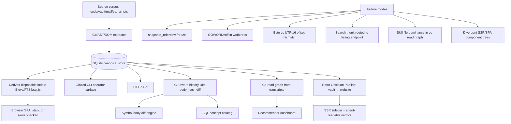

# Data Browsers, Readwise, Knowledge — Partition B Condensed Summary

## Executive summary

- Partition B covers five arcs: codebase browser/indexing/static SQL, Readwise personal library/local search, document co-read/knowledge graph/recommender, knowledge base/publishing/Obsidian, and data export/import/scraping/notebooks/SQLite preset.
- The **strongest spine** is: `source corpus → Go/AST extractor → normalized SQLite → derived search index (Bleve/FTS5) → browser SPA (static or server-backed)`. SQLite-as-canonical-store and derived/disposable indexes are the dominant invariants.
- The **codebase browser arc** is the deepest and most architecturally evolved: it progressed from Go HTTP server → static WASM+JSON → sql.js SQLite-in-browser, with a git-aware history layer, a 23× size optimization, and a Web Worker resilience layer.
- The **knowledge/publishing arc** (Retro Obsidian Publish, KB Playbook) shows the same single-binary Go+SPA pattern applied to Obsidian vaults, with Bleve search, SSR hydration, and agent-readable markdown mirrors.
- Canonical starting files: `Projects/2026/04/20/PROJ - Codebase Browser - Embedded Go+TS Doc Server...` and `Projects/2026/05/21/PROJ - Readwise Viewer.md`.

## Scope and search method

- Corpus: `Projects/2026/{03,04,05,06}/` — specifically the five assigned arc headings from `sources/06`.
- Files read: 24 markdown files across the five arcs (listed in evidence ledger below).
- Selection: deeply read canonical architecture reports; heading-scanned companion/textbook/playbook files for adjacency; title-only for the most peripheral inventory entries.

## Evidence ledger

| Path | Evidence level | Lines / basis | Cluster | Why it matters |
|---|---|---|---|---|
| `Projects/2026/04/20/PROJ - Codebase Browser - Embedded Go+TS Doc Server...md` | read | lines 1-120+ | Codebase browser | Canonical architecture: single-binary Go+SPA, AST indexer, `codebase-snippet` directives |
| `Projects/2026/04/20/PROJ - Codebase Browser - Static Analysis and Dagger Pipeline.md` | read | lines 1-300+ | Codebase browser | Schema-first multi-language extraction, Dagger orchestration, bit-identical output |
| `Projects/2026/04/23/PROJ - Codebase Browser - Static WASM Build and SQLite Prototype.md` | read | lines 1-200+ | Codebase browser | Static artifact delivery, TinyGo WASM, SQLite prototype as query engine |
| `Projects/2026/04/23/ARTICLE - Playbook - Static Browser Code Indexes...md` | read | lines 1-200+ | Codebase browser | Reusable playbook: build-time extraction, SQLite/FTS5 as destination, UI contract stability |
| `Projects/2026/04/23/ARTICLE - Textbook - Building a Git-Aware Codebase Index...md` | read | lines 1-400+ | Codebase browser | Git worktree extraction, body_hash change detection, SQL concept catalog, FULL OUTER JOIN diff |
| `Projects/2026/04/23/ARTICLE - Textbook - Using the Codebase Browser History Index.md` | read | lines 1-250+ | Codebase browser | CLI/web usage: scan, diff, symbol-history, concept execution, working rules |
| `Projects/2026/05/01/ARTICLE - Static SQL.js Codebase Browser...md` | read | lines 1-400+ | Codebase browser | sql.js as browser runtime, SQLite as product boundary, byte-offset discipline, export as compiler pass |
| `Projects/2026/05/02/ARTICLE - SQLite Introspection...md` | read | lines 1-300+ | Codebase browser | dbstat virtual table, modernc.org/sqlite pure-Go driver, page-level size analysis |
| `Projects/2026/05/02/ARTICLE - Squeezing a SQLite Database...md` | read | lines 1-400+ | Codebase browser | 23× size reduction via normalized schema, integer FKs, WITHOUT ROWID, GOWORK=off bug |
| `Projects/2026/05/03/ARTICLE - SQLite in the Browser...md` | read | lines 1-400+ | Codebase browser | query-plan-as-frontend-architecture, snapshot_refs view freeze, Web Worker RPC protocol |
| `Projects/2026/05/27/ARTICLE - Go AST Analysis - From JS Bindings...md` | read | lines 1-80 | Codebase browser | goja AST query builder, xgoja packaging, SQLite persistence, retro web browser |
| `Projects/2026/05/27/ARTICLE - Go AST Analysis - xgoja Bindings...md` | read | lines 1-80 | Codebase browser | xgoja provider, Loupedeck code-nav prototype, fluent builder pattern |
| `Projects/2026/05/21/PROJ - Readwise Viewer.md` | read | lines 1-300+ | Readwise/local search | SQLite canonical store, Glazed CLI, CLIM UI, PresentationRef envelopes, FTS5→Bleve design |
| `Projects/2026/05/22/ARTICLE - Readwise Viewer Bleve Search Port.md` | read | lines 1-400+ | Readwise/local search | Bleve BM25 cutover, FTS5 removal, boosted field queries, devctl lifecycle, search≠listing |
| `Projects/2026/05/13/PROJECT REPORT - Document Co-Read Observatory...md` | read | lines 1-400+ | Co-read/recommender | go-minitrace transcript mining, DuckDB queries, co-read graph, association rules |
| `Projects/2026/05/11/ARTICLE - Building a Knowledge Base Playbook...md` | read | lines 1-100 | Knowledge base | 304 reports→18 KB entries, tribal/on-ramp/fundamental taxonomy, trigger rules (3/5) |
| `Projects/2026/05/15/ARTICLE - Retro Obsidian Publish...md` | read | lines 1-100 | Knowledge base/publishing | Single-binary Go+React, vault as read-only source, wiki-link resolution, Bleve search, go:embed |
| `Projects/2026/06/06/PROJ - Retro Obsidian Publish...md` | read | lines 1-100 | Knowledge base/publishing | Production status, SSR sidecar, a14y agent-readable, K8s/GitOps deployment |
| `Projects/2026/06/07/PROJ - Retro Obsidian Publish - React Router SSR...md` | heading-scanned | lines 1-80 | Knowledge base/publishing | SSR hydration cleanup, single hydratable React tree, divergent-architecture failure |
| `Projects/2026/05/04/ARTICLE - Obsidian to reMarkable Sync...md` | read | lines 1-80 | Knowledge base/publishing | Delta upload sync, parallel pandoc, vault-to-reMarkable pipeline |
| `Projects/2026/03/21/PROJ - DOM Scraping Experiment...md` | read | lines 1-100 | Data export/scraping | jsdom web-to-markdown, numbered reproducible scripts, modular fetch→extract→markdown pattern |
| `Projects/2026/03/23/PROJ - CozoDB Editor - Merge Resolution...md` | read | lines 1-100 | Data export/notebooks | Multi-preset notebook (Cozo/JS/SQLite), CodeMirror editor, registry-based preset selection |
| `Projects/2026/03/22/PROJ - CozoDB Editor - Notebook Packaging...md` | heading-scanned | lines 1-60 | Data export/notebooks | Original notebook packaging arc, Cozo→JS preset evolution |
| `Projects/2026/03/15/PROJ - CozoDB Editor - SEM Streaming...md` | heading-scanned | lines 1-60 | Data export/notebooks | Early CozoDB editor, SEM event stream, AI hints |
| `Projects/2026/04/02/PROJ - Smailnail SQLite Mirror...md` | read | lines 1-80 | Data export/scraping | IMAP→SQLite mirror, FTS5, raw .eml persistence, merge shards, annotation layer |
| `Projects/2026/04/14/PROJ - WASM JSON Flattener...md` | read | lines 1-80 | Data export/scraping | Dual-target Go CLI+WASM, TinyGo 95% size reduction, shared core package |
| `Projects/2026/04/15/PROJ - JSON Flattener...md` | heading-scanned | lines 1-60 | Data export/scraping | Follow-up JSON flattener, completed status |
| `Projects/2026/04/15/ARTICLE - Building a Dual-Target Go CLI...md` | heading-scanned | lines 1-40 | Data export/scraping | Engineering pattern article for dual-target Go tools |
| `Projects/2026/05/07/ARTICLE - SQLite Trace Browser...md` | read | lines 1-100 | Data export/notebooks | db-browser serve, defensive schema reading, ui.dsl components, trace-as-journey |
| `Projects/2026/05/08/ARTICLE - db-browser - Goja JS SQLite App Runtime...md` | read | lines 1-80 | Data export/notebooks | Goja runtime with db/express/ui.dsl modules, jsverbs, server-rendered HTML DSL |
| `Projects/2026/06/08/ARTICLE - SQLite Authorizer...md` | read | lines 1-80 | Data export/notebooks | SQLite authorizer callback, read-only enforcement, regex-vs-authorizer failure modes |
| `Projects/2026/06/22/ARTICLE - CozoDB Editor Modernization...md` | heading-scanned | lines 1-40 | Data export/notebooks | Sessionstream hard cutover, protobuf typed artifacts, SEM deletion |

## Condensed per-arc summaries

### Arc 1: Codebase browser / indexing / static SQL

- **Evolution path**: Go HTTP server (GCB-001) → multi-language AST extraction + Dagger pipeline (GCB-002) → static WASM+JSON build (GCB-006) → SQLite/FTS5 prototype (GCB-007) → sql.js browser runtime with no server (GCB-015) → git-aware history index with body_hash diff (GCB-009) → 23× size optimization via normalized schema (GCB-017) → Web Worker resilience layer (GCB-022) → Go AST analysis via goja/xgoja.
- **Core invariant**: the extractor schema (`types.go`) is the load-bearing contract; Go/TS schemas must be byte-identical in JSON. Symbol IDs (`sym:<importPath>.<kind>.<name>`) survive file moves within a module. Bit-identical output between Dagger and local-pnpm paths is the determinism test.
- **SQLite-as-product-boundary**: the DB file is both the browser runtime database and the LLM/script artifact. Go builds it; the browser queries it via `sql.js`. No hidden server. Export is a compiler pass, not server startup.
- **Critical failure modes**: `GOWORK=off` needed in worktree extraction (silent empty DBs); `snapshot_refs` compatibility view caused 60s browser freezes (query-plan-as-frontend-architecture); byte-offset discipline required (slice `Uint8Array` before UTF-8 decode); PascalCase JSON fields silently broke TypeScript clients.
- **Optimization pattern**: normalized schema with integer FKs + `WITHOUT ROWID` mapping tables reduced 50-commit DB from 32 MB to 1.4 MB (23×). Compatibility views let frontend SQL run unchanged.

### Arc 2: Readwise / personal library / local search

- **Architecture**: Python sync → SQLite (`documents`, `tags`, `document_tags`, `sync_runs`, `sync_state`) → Go/Glazed CLI + HTTP API → CLIM-style web UI. 13,848 documents.
- **Search evolution**: started with SQLite FTS5; Bleve BM25 port replaced FTS5 entirely (triggers dropped, `--backend` flag removed). SQLite remains canonical; Bleve is disposable derived index. Rebuild from SQLite on demand.
- **Key design decisions**: boosted field disjunction query (title 5.0, tags 4.0, summary 2.5, notes 2.0, content_text 1.0, search_text 0.5); API hydrates Bleve hits back through SQLite for canonical display data; `devctl` plugin manages index rebuild + server lifecycle.
- **CLIM interaction model**: typed `PresentationRef` envelopes, discriminated union `InteractionState` (normal/select/confirm), actions-as-presentations, pure command parser with Bun tests, `make check-web` freshness guard.
- **Failure mode**: CLIM `SEARCH` thunk initially routed to `/api/documents?q=...` instead of `/api/search`, returning full corpus for every query. Fix: route `filters.q` to `api.search`.

### Arc 3: Document co-read / knowledge graph / recommender

- **Source**: go-minitrace session archives → `tool_calls` with `READ` operations → document path classification (skill, docmgr-ticket, docs-tree, readme, markdown, text-doc).
- **Pipeline**: DuckDB SQL extracts read-events → close co-read pairs (windowed by tool_seq and turn distance) → association rules (confidence, lift, PMI, hybrid_score) → graph export (nodes+edges) → session timeline for audit.
- **JavaScript query-command layer**: `docs coread` verbs (`read-events`, `doc-frequency`, `global-pairs`, `recommend`, `association-rules`, `graph`, `session-timeline`) built on shared `docReadsCte()` helper.
- **Key finding**: skill files dominate the global graph (loaded in bundles at workflow start). Production recommender needs mode presets (workflow/project-docs/skills-only).
- **Dashboard**: static local app generated from JSON exports; no backend process. Scoring modes: hybrid_score, support_sessions, confidence, lift, PMI.

### Arc 4: Knowledge base / publishing / Obsidian

- **KB Playbook**: 304 project reports → 18 KB entries using three-section taxonomy (Tribal/On-Ramp/Fundamental) with trigger rules (tribal: 3 projects, on-ramp: 5 projects, fundamentals: 2+ supporting KB entries). Candidate tracking list prevents re-discovery cost.
- **Retro Obsidian Publish**: single-binary Go+React app treating Obsidian vault as read-only data source. Goldmark parsing, wiki-link suffix resolution, backlink computation, Bleve full-text search. `go:embed` SPA. No database — in-memory index at load time.
- **Production evolution**: SSR sidecar (Node.js Express + React Router hydration), agent-readable markdown mirrors (`/index.md`, `/note/{slug}.md`), `a14y` score 62→99, K8s deployment with git-sync, Vault secrets, ArgoCD.
- **Obsidian→reMarkable sync**: delta-aware upload (compute remote tree first, skip unchanged before pandoc), parallel `--workers N` conversion, sequential rmapi upload. 265 reports synced.
- **Failure mode**: divergent SSR/SPA component trees (SSRNotePage vs full App) caused maintenance burden; resolved by single hydratable React Router tree.

### Arc 5: Data export/import / scraping / notebooks / SQLite preset

- **DOM scraping**: jsdom-based web-to-markdown pipeline (HN, NYT, WonderOS, GitHub). Numbered reproducible scripts. Four-file modular pattern: fetch→extract→markdown→run. No browser automation needed.
- **CozoDB Editor**: evolved from single Cozo app to multi-preset notebook (Cozo/JS/SQLite). Registry-based preset selection, CodeMirror editor shell, backend store split. Later modernized to `sessionstream` (protobuf typed artifacts, HTTP ingress + websocket fanout, SQLite hydration).
- **Smailnail SQLite Mirror**: IMAP→SQLite mirror with FTS5, raw .eml persistence, incremental checkpoints, date-bounded backfills, merge-mirror-shards consolidation, annotation layer for human/LLM triage.
- **WASM JSON Flattener**: dual-target Go CLI+WASM with shared `pkg/flatten` core. TinyGo variant: 171 KB vs 3.1 MB (95% reduction). `syscall/js` bridge requires `select{}` to keep runtime alive.
- **db-browser / SQLite Authorizer**: Goja JavaScript runtime for SQLite inspection apps (`db-browser serve`). `ui.dsl` server-rendered HTML DSL. SQLite authorizer callback as defense-in-depth against regex-based table extraction failures (quoted identifiers, CTE aliases).

## Topic architecture / spine



## Clusters and subclusters

### Cluster A: SQLite as canonical store + derived search index
- Subclusters: codebase browser static DB, Readwise mirror, Smailnail mail mirror, CozoDB SQLite preset, db-browser inspection apps, Retro Obsidian Publish in-memory index.
- Invariant: SQLite owns the data; Bleve/FTS5/sql.js are disposable derived artifacts that can be rebuilt from SQLite.

### Cluster B: Static/local browser artifacts
- Subclusters: codebase-browser static export (sql.js + React SPA), Retro Obsidian Publish (Go binary + embedded React), Document Co-Read Observatory (static dashboard from JSON), WASM JSON Flattener (browser WASM tool).
- Invariant: if the data is known at build time, the browser should consume it directly — no server needed.

### Cluster C: Multi-language AST extraction + schema-first indexing
- Subclusters: Go extractor (`go/packages`), TS extractor (Compiler API two-pass), Dagger-orchestrated Node toolchain, goja/xgoja AST query builder.
- Invariant: one shared schema, stable symbol IDs, dup-ID detection as bug detector, build-time-only Node dependency.

### Cluster D: Git-aware history and change detection
- Subclusters: worktree-based per-commit extraction, body_hash as change key, FULL OUTER JOIN diff, SQL concept catalog, incremental indexing.
- Invariant: `body_hash` is the foundation — without it you have a catalog, with it you have change detection.

### Cluster E: Knowledge publishing and agent-readability
- Subclusters: KB Playbook taxonomy (tribal/on-ramp/fundamental), Retro Obsidian Publish (wiki-link resolution, backlinks, Bleve search), Obsidian→reMarkable sync, markdown mirrors + a14y.
- Invariant: turn project reports and Markdown vaults into browsable/searchable knowledge surfaces with agent-readable mirrors.

### Cluster F: Transcript-derived knowledge graphs
- Subclusters: document read-event extraction, co-read pair computation, association rules (confidence/lift/PMI), graph export, session timeline audit.
- Invariant: transcript history is implicit feedback; document reads are weak signals, close co-reads are stronger signals.

## Recurring concepts, technologies, and failure modes

### Concepts
- SQLite-as-product-boundary (DB is both runtime and artifact)
- Derived disposable index (rebuild from canonical store)
- Schema-first multi-language extraction (one contract, multiple extractors)
- Stable symbol IDs as join key (`sym:<importPath>.<kind>.<name>`)
- Query-plan-as-frontend-architecture (view expansion = UI freeze)
- Normalized schema with integer FKs (vs. snapshot-per-commit)
- PresentationRef envelopes (typed semantic UI objects)
- CLIM interaction model (discriminated union states, actions-as-presentations)
- Agent-readable artifacts (markdown mirrors, a14y, structured discovery)
- Reproducible numbered scripts
- Body_hash as change detection foundation
- Compatibility views over consumer rewrites

### Technologies
- SQLite / FTS5 / sql.js (WebAssembly SQLite)
- Bleve (BM25, boosted field disjunction, v2)
- modernc.org/sqlite (pure-Go driver with dbstat)
- Goja / xgoja / jsverbs
- Dagger (hermetic Node/pnpm container builds)
- DuckDB (transcript mining, co-read analysis)
- Git worktrees (parallel per-commit extraction)
- React / RTK Query / Vite / HashRouter
- Goldmark (Markdown parsing, codebase-snippet directives)
- CodeMirror (multi-language notebook editor)
- TinyGo (WASM, 95% size reduction)
- fsnotify (live vault reloading)
- `go:embed` (single-binary packaging)
- Web Workers (sql.js off-main-thread)
- devctl (service lifecycle management)

### Failure modes
- `snapshot_refs` compatibility view causes 60s browser freeze (broad view expansion before file constraint)
- `GOWORK=off` needed in worktree extraction (go.work silently breaks packages.Load)
- Byte-offset vs UTF-16 code-unit mismatch (broken snippets on non-ASCII)
- PascalCase JSON fields silently break TypeScript clients (`undefined === undefined`)
- SQLite indexes on long string keys dominate data size (122 MB indexes vs 78 MB data)
- Search thunk routed to listing endpoint (returns full corpus for every query)
- Skill file dominance in co-read graph (hides project-specific documents)
- Divergent SSR/SPA component trees (maintenance burden, duplicate route logic)
- Regex-based table extraction fails on quoted identifiers and CTE aliases
- FTS5 not available in all browser SQLite builds (fallback to LIKE)
- Stale Bleve hit IDs (index references missing SQLite document)
- `null` vs `[]` in Go JSON (nil slice marshals to null, breaks frontend `.length`)

## Candidate concept-map material

### Nodes

| Node | Type | Confidence | Notes |
|---|---|---|---|
| Codebase Browser | project | high | Central browser/indexing arc; spans GCB-001 through GCB-022 |
| Readwise Viewer | project | high | Personal library workbench; FTS5→Bleve search evolution |
| Document Co-Read Observatory | project | high | Transcript mining to recommender dashboard |
| Retro Obsidian Publish | project | high | Self-hosted vault publisher; production with SSR + a14y |
| KB Playbook | project | high | 304 reports → 18 entries; three-section taxonomy |
| Smailnail SQLite Mirror | project | medium | IMAP→SQLite mail knowledge base |
| CozoDB Editor | project | medium | Multi-preset notebook; sessionstream modernization |
| db-browser | project | medium | Goja JS runtime for SQLite inspection apps |
| SQLite Authorizer | concept | high | Compile-time callback for read-only enforcement |
| SQLite canonical store | concept | high | Repeats across all five arcs |
| Derived disposable index | concept | high | Bleve/FTS5/sql.js rebuildable from SQLite |
| SQLite-as-product-boundary | concept | high | DB is both browser runtime and script/LLM artifact |
| Static browser artifact | concept | high | Runs from file://, no server process |
| Schema-first multi-language extraction | concept | high | One shared schema, stable IDs, dup-ID detection |
| Body_hash change detection | concept | high | Per-function SHA-256 enables git-aware diff |
| Normalized schema with integer FKs | concept | high | 23× size reduction; WITHOUT ROWID mapping tables |
| Compatibility views | concept | high | Recreate snapshot_* shape over normalized tables |
| Query-plan-as-frontend-architecture | concept | high | View expansion = UI freeze in browser SQLite |
| PresentationRef envelopes | concept | high | Typed semantic UI objects in Readwise CLIM |
| CLIM interaction model | concept | high | Discriminated union states, actions-as-presentations |
| Agent-readable artifact | concept | high | Markdown mirrors, a14y, structured discovery endpoints |
| Reproducible numbered scripts | concept | high | DOM scraping, WordPress export, dashboard generation |
| Co-read graph | concept | high | Implicit document relationship from transcript reads |
| Association rules (confidence/lift/PMI) | concept | high | Directional metrics for document recommendation |
| SQLite / FTS5 / sql.js | technology | high | Canonical store, full-text search, browser runtime |
| Bleve | technology | high | BM25, boosted field disjunction, v2 |
| modernc.org/sqlite | technology | high | Pure-Go driver with dbstat support |
| Goja / xgoja / jsverbs | technology | high | JavaScript orchestration over Go-backed modules |
| Dagger | technology | high | Hermetic Node/pnpm container builds from Go |
| DuckDB | technology | high | Transcript mining backend for co-read analysis |
| Git worktrees | technology | high | Parallel per-commit extraction without destroying working dir |
| TinyGo | technology | high | WASM compilation, 95% size reduction |
| Web Workers | technology | high | sql.js off-main-thread execution |
| CodeMirror | technology | medium | Multi-language notebook editor shell |
| Glazed CLI | technology | high | Structured output formatting for operator commands |
| Goldmark | technology | medium | Markdown parsing with codebase-snippet directives |
| snapshot_refs view freeze | failure-mode | high | 60s browser freeze from broad view expansion |
| GOWORK=off in worktrees | failure-mode | high | Silent empty DBs from go.work interference |
| Byte-offset vs UTF-16 mismatch | failure-mode | high | Broken snippets on non-ASCII source |
| Long-string-key index bloat | failure-mode | high | Indexes larger than data (122 MB vs 78 MB) |
| Search thunk routing bug | failure-mode | high | SEARCH routed to listing endpoint |
| Skill dominance in co-read graph | failure-mode | medium | Skills hide project-specific documents |
| Divergent SSR/SPA trees | failure-mode | medium | Duplicate route/title/layout maintenance burden |
| Regex table extraction fragility | failure-mode | high | Fails on quoted identifiers and CTE aliases |
| FTS5 browser availability gap | failure-mode | medium | Not all sql.js builds include FTS5 |
| Should Bleve embeddings layer be built for Readwise? | open-question | medium | RWVEC-001 designed but not implemented |
| Should codebase-browser ship only SQLite and remove WASM? | open-question | medium | Open question in GCB-007 |
| Are co-read recommendations production-ready? | open-question | medium | v1 works; needs canonical doc IDs and mode presets |

### Edges

```text
Codebase Browser --extracts via--> Schema-first multi-language extraction [high] (Projects/2026/04/20/PROJ - Codebase Browser - Static Analysis...)
Schema-first multi-language extraction --produces--> SQLite canonical store [high] (Projects/2026/04/23/PROJ - Codebase Browser - Static WASM...)
SQLite canonical store --rebuilds into--> Derived disposable index [high] (Projects/2026/05/22/ARTICLE - Readwise Viewer Bleve Search Port.md)
SQLite canonical store --serves as--> SQLite-as-product-boundary [high] (Projects/2026/05/01/ARTICLE - Static SQL.js Codebase Browser...)
SQLite-as-product-boundary --queries via--> sql.js in browser [high] (Projects/2026/05/01/ARTICLE - Static SQL.js Codebase Browser...)
Static browser artifact --runs from--> file:// with no server [high] (Projects/2026/04/23/PROJ - Codebase Browser - Static WASM...)
Codebase Browser --tracks history via--> Body_hash change detection [high] (Projects/2026/04/23/ARTICLE - Textbook - Building a Git-Aware...)
Body_hash change detection --requires--> Git worktrees [high] (Projects/2026/04/23/ARTICLE - Textbook - Building a Git-Aware...)
Git worktrees --needs--> GOWORK=off in worktrees [high] (Projects/2026/05/02/ARTICLE - Squeezing a SQLite Database...)
snapshot_refs view freeze --caused by--> Query-plan-as-frontend-architecture [high] (Projects/2026/05/03/ARTICLE - SQLite in the Browser...)
Query-plan-as-frontend-architecture --mitigated by--> Web Workers [high] (Projects/2026/05/03/ARTICLE - SQLite in the Browser...)
Normalized schema with integer FKs --reduces 23x--> Long-string-key index bloat [high] (Projects/2026/05/02/ARTICLE - Squeezing a SQLite Database...)
Compatibility views --preserve--> React/RTK Query frontend contract [high] (Projects/2026/05/02/ARTICLE - Squeezing a SQLite Database...)
Readwise Viewer --uses--> SQLite canonical store [high] (Projects/2026/05/21/PROJ - Readwise Viewer.md)
Readwise Viewer --migrated search to--> Bleve [high] (Projects/2026/05/22/ARTICLE - Readwise Viewer Bleve Search Port.md)
Readwise Viewer --cutover removed--> FTS5 [high] (Projects/2026/05/22/ARTICLE - Readwise Viewer Bleve Search Port.md)
Readwise Viewer --UI uses--> PresentationRef envelopes [high] (Projects/2026/05/21/PROJ - Readwise Viewer.md)
PresentationRef envelopes --part of--> CLIM interaction model [high] (Projects/2026/05/21/PROJ - Readwise Viewer.md)
Search thunk routing bug --fixed by routing filters.q to--> /api/search [high] (Projects/2026/05/22/ARTICLE - Readwise Viewer Bleve Search Port.md)
Document Co-Read Observatory --mines--> go-minitrace transcripts [high] (Projects/2026/05/13/PROJECT REPORT - Document Co-Read...)
go-minitrace transcripts --queried via--> DuckDB [high] (Projects/2026/05/13/PROJECT REPORT - Document Co-Read...)
Document Co-Read Observatory --builds--> Co-read graph [high] (Projects/2026/05/13/PROJECT REPORT - Document Co-Read...)
Co-read graph --ranked by--> Association rules (confidence/lift/PMI) [high] (Projects/2026/05/13/PROJECT REPORT - Document Co-Read...)
Skill dominance in co-read graph --mitigated by--> mode presets [medium] (Projects/2026/05/13/PROJECT REPORT - Document Co-Read...)
Retro Obsidian Publish --treats vault as--> read-only data source [high] (Projects/2026/05/15/ARTICLE - Retro Obsidian Publish...)
Retro Obsidian Publish --embeds SPA via--> go:embed [high] (Projects/2026/05/15/ARTICLE - Retro Obsidian Publish...)
Retro Obsidian Publish --adds--> Agent-readable artifact [high] (Projects/2026/06/06/PROJ - Retro Obsidian Publish...)
Divergent SSR/SPA trees --resolved by--> single hydratable React Router tree [high] (Projects/2026/06/07/PROJ - Retro Obsidian Publish - React Router SSR...)
KB Playbook --classifies into--> Tribal/On-Ramp/Fundamental taxonomy [high] (Projects/2026/05/11/ARTICLE - Building a Knowledge Base Playbook...)
Smailnail SQLite Mirror --mirrors IMAP into--> SQLite canonical store [high] (Projects/2026/04/02/PROJ - Smailnail SQLite Mirror...)
CozoDB Editor --supports--> multi-preset notebook (Cozo/JS/SQLite) [high] (Projects/2026/03/23/PROJ - CozoDB Editor - Merge Resolution...)
db-browser --runs trusted JS via--> Goja / xgoja / jsverbs [high] (Projects/2026/05/08/ARTICLE - db-browser...)
SQLite Authorizer --replaces--> Regex table extraction fragility [high] (Projects/2026/06/08/ARTICLE - SQLite Authorizer...)
```

## Overlaps with other topic slices

- **Topic 2 (JavaScript runtimes / Goja / xgoja)**: `go-ast-analysis` exposes Go AST to JavaScript via goja; `db-browser` is a Goja SQLite app runtime with `express`/`ui.dsl` modules; `goja-bleve` provides JS Bleve bindings for search; CozoDB editor uses go-go-goja for JS preset. Shared concept: Go-backed JavaScript DSL as control layer over Go domain logic.
- **Topic 5 (AI agents / transcripts / observability)**: Document Co-Read Observatory mines go-minitrace transcripts — same transcript archive used by agent observability; db-browser SQLite Trace Browser inspects CoinVault debug SQLite traces; CozoDB Editor modernized to `sessionstream` (protobuf typed artifacts). Shared concept: transcript/trace as evidence source.
- **Topic 7 (Web UI / apps / media / productivity)**: Retro Obsidian Publish is a single-binary Go+SPA vault browser; Readwise Viewer has CLIM web UI; Codebase Browser has React/RTK Query SPA; CozoDB Editor is a notebook IDE. Shared concept: single-binary Go + embedded SPA as deployment pattern.
- **Topic 3 (Typography / layout / design systems)**: Retro Obsidian Publish uses a retro monochrome visual design system; CozoDB Editor has CodeMirror highlighting. Shared concept: design system as product identity.
- **Topic 4 (Infra / auth / deployment / GitOps)**: Retro Obsidian Publish deployed via K3s/ArgoCD with git-sync, Vault secrets, GHCR images; Smailnail has hosted backend/OIDC. Shared concept: GitOps deployment of local-first apps.
- **Topic 1 (Hardware / embedded / ESP32)**: Obsidian-to-reMarkable sync targets reMarkable tablet hardware; go-ast-analysis has Loupedeck code-nav prototype. Shared concept: physical device as reading/control surface.
- **Topic 6 Partition A (RAG evaluation / Bleve/FAISS / Book OCR)**: Readwise Viewer's Bleve search port shares the same Bleve v2 and BM25 retrieval stack; codebase-browser's sql.js runtime shares SQLite-as-canonical-store invariant with RAG corpus DB; both partitions share the `Source → Document → Chunk → Search` pipeline shape for different domains.

## Open questions and second-pass targets

1. Did Readwise Viewer's RWVEC-001 embeddings/vector search ever get implemented, or is it still design-only? The Bleve BM25 port is shipped; vectors are designed but not built.
2. Should codebase-browser fully remove the custom TinyGo WASM module now that sql.js is the runtime? (Open in GCB-007.)
3. Did the Document Co-Read Observatory ever get canonical document IDs and mode presets? The v1 report says these are next improvements.
4. Is the CozoDB Editor's sessionstream modernization (2026-06-22) stable enough to be the current architecture, or is it still on a task branch?
5. Should the KB Playbook's trigger rules (3/5) be parameterized per-library-density, or are they stable enough as-is?
6. The SQLite Authorizer analysis was motivated by go-minitrace bugs — was the authorizer actually implemented in go-minitrace, or is it still analysis-only?

## Start here

1. `Projects/2026/04/20/PROJ - Codebase Browser - Embedded Go+TS Doc Server with Live Source Snippets.md` — canonical entry point for the codebase browser arc. It names the five-layer architecture, the `codebase-snippet` directive system, the symbol-ID invariant, and the Dagger pipeline. Read this first to understand the project that evolved through 10+ tickets into the sql.js browser.
2. `Projects/2026/05/21/PROJ - Readwise Viewer.md` — canonical entry point for the Readwise/local search arc. It establishes SQLite canonical store, Glazed CLI, CLIM interaction model, and the design path toward Bleve/embeddings. Follow with `Projects/2026/05/22/ARTICLE - Readwise Viewer Bleve Search Port.md` to see the FTS5→Bleve cutover.

## Report-format notes

- The codebase browser arc is unusually deep (10+ project reports spanning April-May 2026) and generates enough material for its own concept map sub-region. Consider whether it deserves a dedicated map rather than being a satellite of the broader Topic 6 data map.
- The "SQLite-as-product-boundary" concept is strong enough to be a first-class bridge node in the cross-topic integration map — it connects data/RAG, codebase browser, Readwise, Smailnail, and db-browser.
- The "query-plan-as-frontend-architecture" failure mode is novel and map-worthy: it only exists when SQLite runs in the browser, making it a unique concept at the intersection of data systems and frontend performance.
