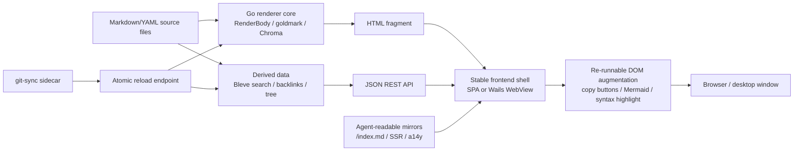
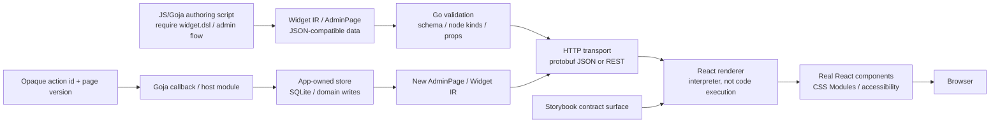

# 07a — Web UI: Local-First Shells & Backend-Driven UI (Partition A)

## Executive summary

- **Partition scope:** Cluster 1 (Local-first Go-hosted browser/desktop apps) and Cluster 2 (Backend-driven / generated UI systems) from the first-batch source report `sources/07`.
- **Two architecture spines:** (1) Go binary + embedded frontend serving derived content from local files; (2) UI-as-data transported from backend/Goja to a React renderer that interprets known node kinds.
- **Strongest arcs:** md-view daemon→Wails migration (process model rewrite), Go-Go Parc/Retro Obsidian vault publishers (single-binary + git-sync), Fringe Admin DSL (renderer-as-interpreter), Widget IR pipeline (Goja authors data, React renders).
- **Concept-map spine for Cluster 1:** `Markdown/YAML source → Go renderer (fragment) → embedded SPA or Wails WebView → browser augmentation → agent-readable mirror`.
- **Concept-map spine for Cluster 2:** `JS/Goja authoring → Widget IR (JSON) → Go validation/transport → React renderer (interpreter) → Storybook contract surface`.
- **Start here:** `Projects/2026/06/13/ARTICLE - Replacing md-view with a Wails v2 Desktop Application - Technical Deep Dive.md` (process model migration) and `Projects/2026/05/16/PROJECT REPORT - Fringe Admin DSL Backend Driven Admin Interfaces Deep Dive.md` (renderer-as-interpreter).

## Scope and search method

```text
Corpus: Projects/2026/{04,05,06}/ Markdown files.
Partition: Cluster 1 (Local-first Go-hosted browser/desktop apps) + Cluster 2 (Backend-driven / generated UI systems) from sources/07.
Search: filename + grep for SQLide|md-view|Wails|Go-Go Parc|Retro Obsidian|Fringe Admin|Browser-Side React Widget|WidgetRenderer|Widget IR|DMETA Viewer|Fake CMS|Playbook.*Wasm.
Selection: deeply read the 8 canonical files; heading-scanned 5 adjacent files.
```

## Evidence ledger

| Path | Evidence level | Lines / basis | Cluster | Why it matters |
|---|---|---|---|---|
| `Projects/2026/04/02/PROJ - SQLide Browser - Go Wasm SQL IDE.md` | read | full file | C1 | Canonical Go/Wasm + sqlite-wasm worker split architecture |
| `Projects/2026/04/02/ARTICLE - Playbook - Self-Contained Go Wasm and JavaScript Browser Applications.md` | heading-scanned | lines 1-80 | C1 | Extracted architectural playbook from SQLide; when-to-use rules |
| `Projects/2026/05/07/ARTICLE - md-view - Building a Daemon-Based Markdown Viewer in Go.md` | read | full file | C1 | Three-process daemon architecture: CLI/daemon/browser, SSE reload, inline everything |
| `Projects/2026/05/28/PROJ - md-view - Markdown Viewer Daemon.md` | read | full file | C1 | Productized status: Chroma, Mermaid, image path resolution, i3 titles |
| `Projects/2026/06/13/ARTICLE - Replacing md-view with a Wails v2 Desktop Application - Technical Deep Dive.md` | read | full file | C1 | Process model rewrite: daemon→Wails, RenderBody fragment contract, re-runnable augmentation |
| `Projects/2026/05/14/PROJECT REPORT - Go-Go Parc Website - Implementation Deployment and Git-Sync Runtime.md` | read | full file | C1 | Single-binary Go+SPA, git-sync sidecar, atomic reload, YAML normalization |
| `Projects/2026/06/06/PROJ - Retro Obsidian Publish - A Retro Monochrome Vault Browser.md` | read | full file | C1 | Vault browser with SSR sidecar, agent-readable mirrors, a14y 99/100 |
| `Projects/2026/05/19/ARTICLE - DMETA Viewer - A Go and React Single-Binary YAML Browser with Swiss Typography.md` | heading-scanned | lines 1-80 | C1 | Single-binary Go+React YAML browser; Swiss typography design system |
| `Projects/2026/06/18/PROJECT REPORT - Fake CMS 11ty Frontend - GraphQL to Static Site Deep Dive.md` | heading-scanned | lines 1-80 | C1 | GraphQL-to-Eleventy static site; project-local plugin pattern |
| `Projects/2026/04/30/PROJ - Browser-Side React Widget Runtime - In-Browser TSX Compilation and Reload.md` | read | full file | C2 | Source-as-data pipeline: esbuild-wasm, blob URL import, strict import policy, module registry |
| `Projects/2026/05/16/PROJECT REPORT - Fringe Admin DSL Backend Driven Admin Interfaces Deep Dive.md` | read | full file | C2 | Renderer-as-interpreter, Goja backend execution, opaque action IDs, page versioning, protobuf transport |
| `Projects/2026/06/04/ARTICLE - WidgetRenderer Standalone Site - Goja Authored React Rendered UI.md` | read | lines 1-120 | C2 | Goja authors Widget IR (JSON), Go serves, React renders; package separation |
| `Projects/2026/06/05/ARTICLE - Building a Goja UI DSL from Scratch - Widget IR to xgoja.md` | heading-scanned | lines 1-80 | C2 | Widget IR evolution: Goja→xgoja provider, five surfaces to sync |
| `Projects/2026/06/07/ARTICLE - Widget IR - Building a Data-First React Rendering Pipeline for RAG Evaluation.md` | read | lines 1-120 | C2 | Full data-first pipeline: authoring→IR→validation→HTTP→React; five surfaces, ActionSpec boundary |

## Condensed per-arc summaries

### Arc 1: SQLide Browser — Go/Wasm split architecture (C1)

- **Split architecture invariant:** Go handles text processing and state (SQL splitting, statement classification); SQLite's own Wasm build runs in a dedicated worker for DB operations and OPFS persistence. Go never talks to SQLite directly (`Projects/2026/04/02/PROJ - SQLide Browser - Go Wasm SQL IDE.md`, lines 22-30).
- **Bridge lifecycle:** Go module exports via `syscall/js`, loaded through `go-bridge.js` which injects `wasm_exec.js`, instantiates Wasm, and polls for up to 3s for the Go module to register itself (lines 68-75).
- **OPFS requires COOP/COEP headers:** Cross-origin isolation (`require-corp`, `same-origin`) is mandatory; without it, OPFS silently degrades to in-memory (lines 112-120).
- **Working rule:** "Keep the split architecture. Go does text processing and state; SQLite Wasm does database operations in a worker" (lines 130-133).
- **Playbook generalization:** The `04/02` Playbook article extracts the pattern: use Go/Wasm when reusing Go logic, NOT when the module is a thin `syscall/js` wrapper; binary size is ~2-4 MB overhead.

### Arc 2: md-view daemon — CLI/daemon/browser three-process model (C1)

- **Three protocols, one purpose each:** Unix socket (CLI→daemon NDJSON), HTTP (daemon→browser pages), SSE (daemon→browser reload events). Never mix protocols (`Projects/2026/05/07/ARTICLE - md-view...md`, lines 60-80).
- **Daemon start without fork:** Go lacks `fork()`. CLI re-executes its own binary with `serve` subcommand, `SysProcAttr{Setpgid: true}`, then polls for socket file (lines 160-175).
- **Inline everything:** All CSS, JS, and Chroma stylesheets embedded via `go:embed`. No external assets, no CDN, works offline (lines 135-145).
- **SSE over WebSockets:** SSE is unidirectional, rides on HTTP infrastructure, close to zero incremental complexity. WebSockets' bidirectionality is unnecessary for file-change notification (lines 205-220).
- **Failure mode:** fsnotify watches inode, not path. `git checkout` recreates file → watch lost, SSE stays open but no events arrive (lines 225-235).
- **Productized features (05/28):** Chroma highlighting (200+ languages), Mermaid diagrams with MutationObserver theme re-render, relative image path rewriting via `/file/` handler with directory allowlist, dark/light toggle, i3/Sway window titles.

### Arc 3: md-view Wails migration — process model rewrite (C1)

- **Core change:** Browser moves inside the process. HTTP transport removed; Wails bound methods + events replace HTTP/SSE (`Projects/2026/06/13/ARTICLE - Replacing md-view with a Wails v2...md`, lines 45-55).
- **Renderer survives as fragment producer:** `Render(filePath, opts) -> full HTML page` becomes `RenderBody(filePath, opts) -> { Frontmatter, Body, Title }`. The shell (toolbar, dropzone, content area) lives in `frontend/dist/index.html` and persists across file opens (lines 80-100).
- **Re-runnable augmentation invariant:** In a stable-shell WebView, all DOM augmentation (copy buttons, Mermaid) must be re-runnable after fragment swaps. `augment.js` exposes `window.MDSAugmentPage()` called after every `showContent(html)` (lines 105-130).
- **Build system cutover:** `wails build` is mandatory, not plain `go build`. Plain `go build` produces a binary that fails with "Wails applications will not build without the correct build tags" (lines 155-165).
- **Known limitation:** Linux `SingleInstanceLock` uses D-Bus and did not deduplicate second launches on this machine. Code is correct by API but behavior is platform-specific (lines 170-185).
- **Working rules distilled:** (1) If browser moves inside process, remove network transport. (2) Preserve renderer as pure component. (3) In stable-shell WebView, augmentation must be re-runnable. (4) Menu callbacks must emit events, not update DOM directly. (5) Relative file serving needs allowlist with separator-aware prefix check.

### Arc 4: Go-Go Parc Website — single-binary + git-sync (C1)

- **Content/application separation:** Application code changes → new container image + Kubernetes rollout. Content changes → new Git commit in vault repo. `git-sync` sidecar tracks vault, calls reload endpoint (`Projects/2026/05/14/PROJECT REPORT - Go-Go Parc Website...md`, lines 10-20, 290-310).
- **Atomic reload:** `RuntimeState.Reload()` builds new vault + search index together, swaps both under mutex. Failed reload leaves old state active (lines 170-185).
- **SnapshotProvider interface:** Handlers ask provider for current `(*vault.Vault, *search.Index)` pair, not owning vault directly. This indirection enables atomic swap without changing handlers (lines 55-65).
- **YAML normalization bug:** `goldmark-meta` returns `map[interface{}]interface{}` for nested YAML; Go JSON encoder can't serialize non-string keys. Fix: recursive `normalizeYAMLValue()` moved invariant into parser (lines 140-165).
- **Wiki-link suffix resolution:** Builds index mapping every path suffix to full slug. `[[tribal/app]]` resolves to `research/kb/tribal/app-auth`. First registered suffix wins (lines 100-120).
- **Rollout failures as learning:** SSH secret permissions (fsGroup + 0440), GHCR image pull secrets, memory limits, homepage heuristic, YAML encoding — each fix became part of deployed configuration (lines 370-440).

### Arc 5: Retro Obsidian Publish — vault browser with SSR + a14y (C1)

- **Single binary + SSR sidecar:** Go binary serves API + embedded React SPA. Node.js Express sidecar pre-fetches data, renders via `renderToString()`, returns HTML. Go reverse-proxies with SPA fallback on sidecar failure (`Projects/2026/06/06/PROJ - Retro Obsidian Publish...md`, lines 28-40).
- **No hydration mismatch:** SSR renders simplified components; client uses `createRoot()` with `root.textContent = ""` to clear SSR content and mount fresh. SSR HTML still visible to crawlers (lines 42-55).
- **Agent-readable mirrors:** `/index.md`, `/note/{slug}.md` endpoints with frontmatter, canonical `Link` headers, `## Sitemap` sections. Content negotiation: `Accept: text/markdown` returns markdown mirrors. a14y score 62→99 (lines 30-38).
- **Vault directory is single source of truth:** Application reads, never writes. All data (HTML, search index, backlinks, file tree) derived from Markdown files (working rule).
- **Three-container pod:** app (Go), ssr (Node.js), git-sync (vault sync). Vault secrets via VaultOperator.

### Arc 6: Browser-Side React Widget Runtime — source-as-data (C2)

- **Core pipeline:** `message source string → esbuild-wasm TSX transform → Blob URL → dynamic import(blobUrl) → React component → timeline render` (`Projects/2026/04/30/PROJ - Browser-Side React Widget Runtime...md`, lines 25-35).
- **Source is data until browser imports it:** Widget message is JSON on the wire. Server doesn't compile. Source becomes executable only after policy checks + esbuild transform + blob import (lines 55-70).
- **Shared React instance:** Runtime injects React from host via `window.__LIVE_WIDGET_HOST__.React`. Prevents duplicate React / invalid hook calls. Widget authors write `React.useState()` without importing (lines 85-95).
- **Import-as-capability:** `@live/base` and `@live/charts` are virtual modules. Runtime rewrites specifiers to blob URLs pointing at host-provided facade modules. Imports become capabilities, not packages (lines 120-140).
- **Parser-backed import rewriting:** Uses `@babel/parser` (not `es-module-lexer`) because import analysis happens before TSX compilation and must understand JSX syntax (lines 160-175).
- **Widget-to-widget imports with cycle detection:** Compiled widgets registered as `@live/widgets/<message-id>`. Graph tracks imports/importers, rejects cycles (lines 180-200).
- **Not HMR, runtime module replacement:** No Vite graph, no file path, no patch protocol. Custom source hash, blob URL, keyed remount with new `key` (lines 75-85).

### Arc 7: Fringe Admin DSL — renderer-as-interpreter (C2)

- **Core rule:** "Authoring may be fluent. Transport must be JSON/protobuf data. Rendering must be explicit interpretation. Domain writes must stay app-owned." (`Projects/2026/05/16/PROJECT REPORT - Fringe Admin DSL...md`, lines 37-50).
- **Page/node/action model:** Page contains shell metadata, top-level nodes (each with `kind`, `props`, children), optional surfaces (modals, drawers). Actions carry semantic metadata (`type`, `target`, `intent`, `presentation`, `placement`). Browser-visible `id` is generated by runtime, not a trusted command name (lines 55-90).
- **Renderer switches on `node.kind`:** `renderAdminNode(node, ctx)` is an explicit interpreter. Unknown kinds show fallback `<pre>`. No hidden mapping from backend strings to arbitrary React imports (lines 95-120).
- **Goja backend execution:** Flow exports `initialState` and `render`. `ctx.bind(actionBuilder, callback)` registers callbacks with opaque ids. Browser dispatches action id → session checks page version → calls Goja callback → returns new AdminPage (lines 125-160).
- **Page version scoping:** Stale browser actions return informational toast effect instead of applying stale mutation. `event.PageVersion != s.Version` → return toast, not mutate (lines 165-180).
- **Persistence is app-owned:** `pkg/intakeadmin/` store is outside `pkg/admindsl/`. Admin DSL knows how to render tables/forms; app knows what an intake request means. Host modules (`host/intake-admin`) are narrow, JSON-round-tripped (lines 190-230).
- **Component growth driven by real screens:** New primitives added only when needed: `resourceTable`, `imageGallery`, `editableList`, `monthAvailabilityGrid`, `previewFrame`, `diffView`. Each requires schema + validator + Go builder + Goja export + frontend renderer + tests + Storybook (lines 250-290).
- **Storybook as contract surface:** Every node kind needs stories for normal, empty, mobile, and error states. If a primitive can't be described with a stable JSON fixture, its design is not ready (lines 295-330).
- **Protobuf transport:** Envelope is typed (`AdminFlowState`, `AdminPage`, `AdminNode`); `props` remains `google.protobuf.Struct` for evolution. Renderer receives plain TypeScript objects, independent of protobuf (lines 335-360).

### Arc 8: Widget IR pipeline — Goja authors data, React renders (C2)

- **Central invariant:** Goja produces Widget IR (JSON), not HTML. React is the sole renderer and keeps ownership of CSS Modules, actions, and accessibility. If Go rendered HTML, it would create a second UI implementation (`Projects/2026/06/04/ARTICLE - WidgetRenderer...md`, lines 40-55; `Projects/2026/06/07/ARTICLE - Widget IR...md`, lines 15-30).
- **Widget IR shape:** `WidgetNode = TextNode | ElementNode | ComponentNode`. All props must be JSON-serializable. No functions, React elements, or live references across boundaries (`Projects/2026/06/07/...`, lines 55-70).
- **ActionSpec boundary:** React callbacks can't appear in JSON. `onAnnotationSelectAction` is converted to a callback that fires server actions. Works uniformly for buttons, table rows, transcript annotations, document selections (`Projects/2026/06/07/...`, lines 75-85).
- **Five surfaces to sync:** Adding a new component requires updating (1) TypeScript IR types, (2) React renderer, (3) Goja DSL helpers, (4) server schema, (5) stories/tests. Missing any surface produces visible failures (`Projects/2026/06/07/...`, lines 90-110).
- **xgoja provider packaging:** DSL wrapped as xgoja provider, generates a binary that serves React WidgetRenderer app backed by JavaScript verbs. Token bridge and default shell chrome needed for standalone visual quality (`Projects/2026/06/05/ARTICLE - Building a Goja UI DSL...md`, lines 20-40).
- **Package separation:** `pkg/widgetdsl` (authoring), `pkg/widgetrunner` (execution/validation), `pkg/widgetserver` (HTTP), `pkg/defaultspa` (embedded frontend), `pkg/widgetschema` (schema metadata), `packages/rag-evaluation-site` (reusable React npm package) (`Projects/2026/06/04/...`, lines 60-80).

## Topic architecture / spine

### Cluster 1 spine: Local-first Go-hosted apps



### Cluster 2 spine: Backend-driven / generated UI



## Clusters and subclusters

### Cluster A: Local-first Go-hosted browser/desktop apps

- **Subcluster A1: Go/Wasm browser tools** — SQLide Browser (split Go/Wasm + sqlite-wasm worker), Playbook generalization. Invariant: Go owns logic, worker owns engine; COOP/COEP required for OPFS.
- **Subcluster A2: Daemon/browser productivity tools** — md-view daemon (three-protocol model), md-view productized (Chroma/Mermaid/images). Invariant: one protocol per purpose; inline everything for offline.
- **Subcluster A3: Desktop shell migration** — Wails v2 replacement of md-view. Invariant: renderer survives as fragment producer; augmentation must be re-runnable in stable-shell WebView.
- **Subcluster A4: Vault/knowledge-site publishers** — Go-Go Parc Website (git-sync + atomic reload), Retro Obsidian Publish (SSR sidecar + agent mirrors), DMETA Viewer (single-binary YAML browser). Invariant: vault is read-only source of truth; content and application updates are separate loops.
- **Subcluster A5: Static site generation** — Fake CMS 11ty (GraphQL-to-Eleventy). Invariant: project-local plugin owns data fetching/normalization; templates remain visible for teaching.

### Cluster B: Backend-driven / generated UI systems

- **Subcluster B1: Browser-side widget runtime** — Browser-Side React Widget Runtime (esbuild-wasm, blob URL, import-as-capability). Invariant: source is data until compiled + imported; shared React instance; strict import policy.
- **Subcluster B2: Admin DSL with Goja backend** — Fringe Admin DSL (renderer-as-interpreter, opaque action IDs, page versioning). Invariant: page is data, node kind is explicit, action id is opaque, host modules are narrow, app schemas are app-owned.
- **Subcluster B3: Widget IR pipeline** — WidgetRenderer Standalone, Widget IR to xgoja, Widget IR Data-First. Invariant: Goja authors data, React renders; Widget IR is JSON, not HTML; five surfaces must stay in sync.
- **Subcluster B4: Storybook/fixture contract** — Both Fringe Admin DSL and Widget IR use Storybook as a contract surface for every node/widget kind. Invariant: if a primitive can't be described with a stable JSON fixture, its design is not ready.

## Recurring concepts, technologies, and failure modes

### Concepts

- `renderer-as-fragment-producer` — RenderBody returns chrome-free HTML fragment, not full page
- `re-runnable DOM augmentation` — scripts must survive fragment swaps in stable-shell WebView
- `renderer-as-interpreter` — React switches on node.kind, not code execution
- `source-as-data` — widget source is just a string until policy checks + compilation
- `opaque action ID` — browser dispatches ids, backend resolves callbacks
- `page version scoping` — stale browser actions return effects, not mutations
- `import-as-capability` — module registry rewrites specifiers to blob URLs
- `content/application separation` — git-sync content updates vs image rebuild deployments
- `atomic reload` — vault + search index swapped together under mutex
- `agent-readable mirror` — markdown mirrors, SSR, a14y endpoints
- `single-binary Go + SPA` — `go:embed` frontend into Go binary
- `SnapshotProvider` — handlers ask provider for current state, enabling atomic swap
- `Storybook contract surface` — every node/widget kind needs fixtures for normal/empty/error/mobile states
- `narrow host modules` — Goja flows call app-owned APIs, not generic write access
- `one protocol, one purpose` — Unix socket for CLI, HTTP for pages, SSE for reload

### Technologies

- `Go/Wasm` (`GOOS=js GOARCH=wasm`, `syscall/js`, `wasm_exec.js`)
- `sqlite-wasm` (`@sqlite.org/sqlite-wasm`, OPFS, OO1 API)
- `Wails v2` (bound methods, events, AssetServer.Handler, SingleInstanceLock)
- `goldmark` (GFM, Chroma highlighting, frontmatter)
- `fsnotify` (file watching, inotify inode limitation)
- `Bleve` (in-memory full-text search, fuzzy/prefix matching)
- `esbuild-wasm` (browser-side TSX compilation)
- `@babel/parser` (TSX-aware import analysis)
- `Goja` (JavaScript runtime for admin flows, Widget DSL)
- `protobuf` (AdminFlowState envelope, google.protobuf.Struct for props)
- `Vite` (frontend build, library vs app mode, COOP/COEP headers)
- `git-sync` (Kubernetes sidecar, symlink-based checkout, webhook reload)
- `RTK Query` (Redux Toolkit API data fetching, SSR cache preloading)
- `Express` (SSR sidecar, renderToString)
- `Eleventy` (static site generation, project-local plugin)

### Failure modes

- `fsnotify inode loss` — file deleted/recreated (git checkout) loses watch; SSE stays open but no events
- `COOP/COEP silent degradation` — missing cross-origin isolation headers → OPFS falls back to in-memory silently
- `stale PID files` — daemon crash without cleanup → CLI must detect and auto-recover
- `Wails build tag failure` — plain `go build` fails; must use `wails build` or explicit tag set
- `D-Bus single-instance failure` — Linux SingleInstanceLock doesn't deduplicate via D-Bus
- `YAML map[interface{}]interface{}` — goldmark-meta nested values not JSON-serializable; needs recursive normalization
- `duplicate React instances` — widget imports React → invalid hook calls; must inject host React
- `concurrent esbuild initialize` — multiple widgets compiling concurrently race into `esbuild.initialize`; fix with memoized promise
- `es-module-lexer TSX failure` — lexer can't parse JSX before esbuild transform; must use `@babel/parser`
- `schema/fixture growth outruns renderer` — new widget types without Storybook coverage or renderer cases produce silent fallbacks
- `Goja struct field name drift` — Go struct JSON tags vs Goja export; fix with JSON round-trip
- `page version staleness` — browser dispatches action from old page; must return informational effect, not mutate
- `homepage heuristic ambiguity` — fallback `/index` selection picks nested source index; must prefer explicit home slugs
- `one-shot DOM augmentation` — scripts that run once per page load break when only `#content` is replaced

## Candidate concept-map material

### Nodes

| Node | Type | Confidence | Notes |
|---|---|---|---|
| `Local-first web app shell` | concept | high | Single binary serving API + static frontend |
| `Single-binary Go + SPA` | concept | high | `go:embed` pattern across vault browsers, DMETA, SQLide |
| `Go/Wasm browser tool` | technology | high | `GOOS=js GOARCH=wasm`, `syscall/js` |
| `Split Go/Wasm + worker architecture` | concept | high | Go owns logic, worker owns engine |
| `sqlite-wasm worker` | technology | high | OPFS persistence, COOP/COEP required |
| `Wails desktop shell` | technology | high | Bound methods + events, AssetServer.Handler |
| `md-view daemon` | project | high | Three-protocol model, status: migrated to Wails |
| `RenderBody fragment contract` | concept | high | Renderer returns chrome-free HTML fragment |
| `Re-runnable DOM augmentation` | concept | high | Scripts survive fragment swaps in stable-shell WebView |
| `Go-Go Parc Website` | project | high | Single-binary + git-sync, status: current/production |
| `Retro Obsidian Publish` | project | high | Vault browser + SSR + a14y, status: current/production |
| `Atomic reload (vault+search)` | concept | high | RuntimeState.Reload swaps both under mutex |
| `SnapshotProvider` | concept | high | Handlers ask provider for current state pair |
| `Agent-readable web mirror` | concept | high | Markdown mirrors, SSR, a14y endpoints |
| `git-sync sidecar` | technology | high | Kubernetes content sync via symlink + webhook |
| `Content/application separation` | concept | high | Content updates ≠ application deployments |
| `Backend-driven UI DSL` | concept | high | UI as data transported from backend to renderer |
| `Widget IR` | concept | high | JSON-compatible UI node tree, not HTML |
| `Renderer-as-interpreter` | concept | high | React switches on node.kind, explicit cases |
| `Opaque action ID` | concept | high | Browser dispatches ids, backend resolves callbacks |
| `Page version scoping` | concept | high | Stale actions return effects, not mutations |
| `Storybook contract surface` | concept | high | Fixtures for every node/widget kind |
| `Narrow host modules` | concept | high | Goja flows call app-owned APIs |
| `Import-as-capability` | concept | high | Module registry rewrites specifiers to blob URLs |
| `Source-as-data (until compiled)` | concept | high | Widget source is string until policy + compilation |
| `Shared React instance` | concept | high | Host injects React, prevents duplicate copies |
| `Fringe Admin DSL` | project | high | Renderer-as-interpreter + Goja + protobuf, status: current |
| `Browser-Side React Widget Runtime` | project | high | esbuild-wasm + blob URL + import policy, status: active/experimental |
| `WidgetRenderer Standalone Site` | project | high | Goja-authored React-rendered UI, status: current |
| `Widget IR Data-First Pipeline` | project | high | Full pipeline for RAG evaluation, status: current |
| `esbuild-wasm` | technology | high | Browser-side TSX compilation |
| `@babel/parser for TSX imports` | technology | high | TSX-aware import analysis before compilation |
| `Five surfaces to sync` | concept | high | TS IR, renderer, Goja helpers, server schema, stories/tests |
| `Goja` | technology | high | JS runtime for admin flows and Widget DSL |
| `protobuf transport` | technology | high | AdminFlowState envelope with Struct props |
| `DMETA Viewer` | project | medium | Single-binary Go+React YAML browser, heading-scanned |
| `Fake CMS 11ty Frontend` | project | medium | GraphQL-to-static-site, heading-scanned |
| `Playbook: Go/Wasm browser apps` | artifact | high | Extracted architectural playbook from SQLide |
| `fsnotify inode loss` | failure-mode | high | Watch lost on file recreation |
| `Wails build tag failure` | failure-mode | high | Plain `go build` fails without Wails tags |
| `YAML map[interface{}]interface{}` | failure-mode | high | Nested YAML not JSON-serializable |
| `es-module-lexer TSX failure` | failure-mode | high | Lexer can't parse JSX before transform |
| `concurrent esbuild initialize` | failure-mode | high | Race condition on wasm initialization |
| `schema/fixture growth outruns renderer` | failure-mode | high | New types without coverage produce silent fallbacks |
| `one-shot DOM augmentation breaks on reload` | failure-mode | high | Scripts must be re-runnable in stable shell |
| `SPA-only shells weak for agents/search` | failure-mode | medium | Until SSR or Markdown mirrors added |
| `Should DMETA/Widget IR/Admin DSL be one umbrella or separate UI-IR traditions?` | open-question | medium | Three parallel UI-IR traditions with overlapping concepts |
| `Should Wails/md-view have its own app-shell lifecycle map?` | open-question | medium | daemon→Wails v2→Wails v3 evolution |

### Edges

```text
Single-binary Go + SPA --serves--> Local-first web app shell [high] (Projects/2026/05/14, 06/06)
Go/Wasm browser tool --uses--> Split Go/Wasm + worker architecture [high] (Projects/2026/04/02)
Split Go/Wasm + worker architecture --requires--> sqlite-wasm worker [high] (Projects/2026/04/02)
sqlite-wasm worker --requires COOP/COEP headers--> OPFS persistence [high] (Projects/2026/04/02)
md-view daemon --migrated to--> Wails desktop shell [high] (Projects/2026/06/13)
Wails desktop shell --preserves--> RenderBody fragment contract [high] (Projects/2026/06/13)
RenderBody fragment contract --enables--> Re-runnable DOM augmentation [high] (Projects/2026/06/13)
Re-runnable DOM augmentation --prevents--> one-shot DOM augmentation breaks on reload [high] (Projects/2026/06/13)
Wails desktop shell --must use--> wails build (not plain go build) [high] (Projects/2026/06/13)
Go-Go Parc Website --uses--> git-sync sidecar [high] (Projects/2026/05/14)
git-sync sidecar --calls--> Atomic reload (vault+search) [high] (Projects/2026/05/14)
Atomic reload (vault+search) --uses--> SnapshotProvider [high] (Projects/2026/05/14)
Content/application separation --enables--> git-sync sidecar [high] (Projects/2026/05/14)
Retro Obsidian Publish --adds--> Agent-readable web mirror [high] (Projects/2026/06/06)
Agent-readable web mirror --requires--> SSR sidecar [high] (Projects/2026/06/06)
Backend-driven UI DSL --compiles/transports--> Widget IR [high] (Projects/2026/05/16, 06/07)
Widget IR --interpreted by--> Renderer-as-interpreter [high] (Projects/2026/05/16, 06/04)
Renderer-as-interpreter --switches on--> node.kind [high] (Projects/2026/05/16)
Renderer-as-interpreter --validated by--> Storybook contract surface [high] (Projects/2026/05/16, 06/07)
Opaque action ID --dispatched by--> browser [high] (Projects/2026/05/16)
Opaque action ID --resolved by--> Goja callback [high] (Projects/2026/05/16)
Page version scoping --guards against--> stale browser actions [high] (Projects/2026/05/16)
Narrow host modules --called by--> Goja flows [high] (Projects/2026/05/16)
Narrow host modules --write to--> App-owned store [high] (Projects/2026/05/16)
Browser-Side React Widget Runtime --uses--> esbuild-wasm [high] (Projects/2026/04/30)
Browser-Side React Widget Runtime --enforces--> Source-as-data (until compiled) [high] (Projects/2026/04/30)
Source-as-data (until compiled) --requires--> Shared React instance [high] (Projects/2026/04/30)
Import-as-capability --rewrites specifiers via--> Module registry [high] (Projects/2026/04/30)
Module registry --must use--> @babel/parser for TSX imports [high] (Projects/2026/04/30)
es-module-lexer TSX failure --fixed by--> @babel/parser for TSX imports [high] (Projects/2026/04/30)
WidgetRenderer Standalone Site --separates--> Goja authoring / Go serving / React rendering [high] (Projects/2026/06/04)
Widget IR Data-First Pipeline --requires syncing--> Five surfaces to sync [high] (Projects/2026/06/07)
Five surfaces to sync --prevents--> schema/fixture growth outruns renderer [high] (Projects/2026/06/07)
YAML map[interface{}]interface{} --fixed by--> recursive normalizeYAMLValue [high] (Projects/2026/05/14)
fsnotify inode loss --causes--> lost file watch on recreation [high] (Projects/2026/05/07)
concurrent esbuild initialize --fixed by--> memoized initialization promise [high] (Projects/2026/04/30)
```

## Cross-links to other topic slices

- **Topic 02 (JS runtimes/goja/xgoja):** Fringe Admin DSL uses Goja for backend admin flow execution; Widget IR pipeline wraps DSL as xgoja provider. Goja struct field name drift and JSON round-trip pattern shared. The `widget.dsl` / `rag.dsl` Goja native modules are direct instances of the Go-backed module provider pattern from Topic 02.
- **Topic 03 (typography/design systems):** DMETA Viewer uses Swiss typography system (single font, single size, weight+color hierarchy). DMETA design-system compiler produces Widget IR that the React renderer consumes. Storybook contract surfaces overlap with design-system visual parity work. CSS governance patterns shared.
- **Topic 04 (infra/auth/deployment):** Go-Go Parc and Retro Obsidian Publish deploy via K3s GitOps with Argo CD, Vault Secrets Operator, Traefik ingress, cert-manager TLS. git-sync sidecar + reload endpoint pattern is infra-adjacent. Wails packaging touches release tooling (GoReleaser). GHCR image pull secrets and fsGroup permissions are infra concerns.
- **Topic 05 (AI agents/transcripts/observability):** Agent-readable web mirrors (markdown mirrors, SSR, a14y) directly serve agent observability use cases. Browser-Side React Widget Runtime was designed for chat timeline widget injection — overlaps with chat overlay/frontend tool execution. Widget IR pipeline originated in RAG evaluation system. Pinocchio web chat cleanup shares headless provider factoring.
- **Topic 06 (data/RAG/search):** Bleve search index in Go-Go Parc/Retro Obsidian. Widget IR pipeline is from the RAG Evaluation System. SQLite as canonical store (SQLide, intake admin). Derived search indexes rebuilt atomically with vault content. OPFS as browser-side SQLite persistence.
- **Topic 01 (hardware/embedded):** Wails desktop shell for reMarkable upload (md-view). Cardputer web serial demos share browser-to-device bridge pattern. Loupedeck dynamic UI runtime shares Goja-driven UI rendering concepts with Fringe Admin DSL.

## Open questions and second-pass targets

1. Should `DMETA / Widget IR / Admin DSL` be treated as one umbrella UI-IR node or three separate parallel traditions? They share renderer-as-interpreter and Storybook contracts but differ in transport (protobuf vs REST vs blob URL) and authoring (Goja vs browser-side TSX vs Goja+xgoja).
2. Should `Wails/md-view` get its own app-shell lifecycle map: daemon/browser → Wails v2 → Wails v3 bridge? The process model migration is a first-class architectural learning.
3. Is `Content/application separation` a topic-07 concept or an infra concept? It straddles both.
4. `DMETA Viewer` and `Fake CMS 11ty` were only heading-scanned; deeper reading needed to confirm whether they introduce new architectural invariants or repeat the single-binary pattern.
5. `Fringe Admin DSL` earlier reports (05/13, 05/15) and `Bottom-Up Admin DSL Widget IR` (05/18) need deeper reading to trace the evolution from static Storybook fixtures to Goja backend.
6. Are there additional Widget IR recipe-level reports (06/06 RAG-EVAL DSL directory) that introduce new semantic recipes beyond the ones covered?

## Start here

1. `Projects/2026/06/13/ARTICLE - Replacing md-view with a Wails v2 Desktop Application - Technical Deep Dive.md` — the most concentrated source for the process-model rewrite pattern: daemon→Wails, fragment contract, re-runnable augmentation, build cutover, and distilled working rules. This single file captures the Cluster 1 architectural evolution.
2. `Projects/2026/05/16/PROJECT REPORT - Fringe Admin DSL Backend Driven Admin Interfaces Deep Dive.md` — the canonical source for the renderer-as-interpreter pattern: page/node/action model, Goja backend execution, opaque action IDs, page versioning, Storybook as contract surface, and app-owned persistence. This single file captures the Cluster 2 architectural invariants.

## Report-format notes

- This condensed report follows the guidelines contract but is intentionally denser than the first-batch report: per-arc summaries are 2-5 bullets focused on invariants and design decisions, not trivia.
- Evidence ledger marks `read` vs `heading-scanned` explicitly. All 8 canonical files were fully read; 5 adjacent files were heading-scanned for architectural signal only.
- Nodes are typed per the guidelines contract: `project`, `concept`, `technology`, `platform`, `workflow`, `artifact`, `failure-mode`, `open-question`.
- Cross-links name the specific shared concept, not just the topic number, to enable explicit bridge construction in the final map.
- The two architecture spines (Cluster 1 and Cluster 2) are kept separate because they genuinely have different data flows, even though they share concepts like `renderer-as-interpreter` and `Storybook contract surface`.
