# 07b Web UI Chat / Media / Browser-Ext Source Report (Partition B)

## Executive summary

- **Scope**: partition B of the Topic 7 web/app slice — chat overlay & web chat runtimes, frontend tool execution, media creation pipelines, browser automation/overlays/measurement extensions. Local-first app shells and backend-driven/generated UI systems are owned by partition A.
- **Strongest arc**: chat overlay → generic `ChatProvider` → CoinVault web chat. It is the densest architectural spine in this partition and the one with the strongest cross-topic bridges (agents/observability, infra/auth).
- **Second arc**: media creation pipelines share a `declarative plan → managed subprocess supervisor` shape across Screencast Studio (Go+ffmpeg/GStreamer), Jingle Extractor (Python ML audio), and Rabbit Hole Podcast Intros (Remotion video). Media arc is the smallest contributor of cross-topic bridges but the strongest contributor of failure-mode nodes.
- **Third arc**: browser automation/overlays/extensions. Chrome/Firefox extension work, surf-go JS probes, and DOM scraping share the same `content-script lens + DOM geometry capture` substrate; this is the partition's strongest bridge to the typography/design-system topic.
- **Likely map spine**: `sessionstream hub --protocol--> headless ChatProvider --owns--> frontend tool registry --routes--> browser|human tool execution --returns--> backend run loop`, paralleled by `media plan compiler --supervises--> subprocess manager` and `browser overlay lens --captures--> DOM geometry/CSS --feeds--> visual diff / component extraction`.
- **Start here**: `Projects/2026/05/29/ARTICLE - Chatbot Overlay Framework - TypeScript and Frontend Tool Calling Deep Dive.md` (chat arc) and `Projects/2026/04/25/Building Chrome Extensions for DOM Overlay Selection and Component Extraction.md` (browser ext arc).

## Scope and search method

- Corpus: `Projects/2026/{03,04,05,06}/` Markdown files.
- Search: filename + grep for `chat|overlay|provider|coinvault|screencast|jingle|rabbit hole|podcast|chrome extension|component extraction|hover component|typoscope|firefox tab|surf-go|surf-cli|browser verbs|dom scrap|latent space|jellyfin|video lecture`.
- Selection: deeply read the canonical architecture articles for each arc; heading-scanned adjacent follow-ups (GStreamer migration, Chat Overlay API proposals, Canonical Chat Event Protocol, Client-side Tool Broker, surf-go/surf-cli, Hover Inspector, TypoScope, Firefox Tab Tracker, Screencast Studio performance/Prometheus follow-ups, Latent Space Podcast Downloader, Jellyfin playbook, Jingle article sibling). Files owned by partition A (md-view, Wails, SQLide, Go-Go Parc, Retro Obsidian, Fringe Admin DSL, Browser-Side React Widget Runtime) were not re-read.

## Evidence ledger

| Path | Evidence level | Lines / basis | Cluster | Why it matters |
|---|---|---|---|---|
| `Projects/2026/05/29/ARTICLE - Chatbot Overlay Framework - TypeScript and Frontend Tool Calling Deep Dive.md` | read | lines 1-end | Chat overlay | Canonical chat overlay + frontend tool runtime; defines three contract layers, protobuf tool protocol, automatic vs human tool modes |
| `Projects/2026/06/01/ARTICLE - Generic ChatProvider - From Overlay Runtime to Provider Backed Web Chat.md` | read | lines 1-1111 | Chat overlay | Extraction of headless provider from overlay; timeline adapter API; provider-scoped registries; legacy deletion playbook |
| `Projects/2026/06/02/ARTICLE - CoinVault Web Chat - Event Projection Debug Exports and Thinking Persistence.md` | read | lines 1-end | Chat overlay | Production ChatProvider adoption; debug SQLite export; absent-vs-empty thinking persistence bug |
| `Projects/2026/04/10/PROJ - Screencast Studio - Architecture and Runtime Deep Dive.md` | read | lines 1-end | Media | Compiled plan as central abstraction; web server as runtime supervisor; staged shutdown |
| `Projects/2026/04/13/PROJ - Jingle Extractor - AI Audio Pipeline with MiniMax Demucs WhisperX.md` | read | lines 1-end | Media | Python ML audio pipeline; weighted clip scoring; stems-first mining rule |
| `Projects/2026/04/11/PROJ - Rabbit Hole Podcast Intros - Remotion Video Generation.md` | read | lines 1-end | Media | Remotion composition pattern; `useCurrentFrame` + `interpolate` + `Easing` core; Python audio synthesis chain feeding `<Audio>` |
| `Projects/2026/04/25/Building Chrome Extensions for DOM Overlay Selection and Component Extraction.md` | read | lines 1-end | Browser ext | Manifest V3 content-script lifecycle; `getBoundingClientRect()` coordinate trap; html2canvas capture; LLM-DOM validation loop |
| `Projects/2026/05/29/ARTICLE - Chat Overlay API - Two Proposals for a Typed Widget Streaming Architecture.md` | heading-scanned | headings + summary | Chat overlay | Origin of generic-vs-ecommerce overlay decision; three-layer convergence |
| `Projects/2026/05/29/ARTICLE - Chat Overlay API - Sessionstream Widget Runtime Deep Dive.md` | heading-scanned | headings + summary | Chat overlay | Headless runtime + optional React layer; widget instance as generative UI unit; ordinals as strings |
| `Projects/2026/05/08/ARTICLE - Canonical Chat Event Protocol - Provider Streams to Browser State.md` | heading-scanned | headings + summary | Chat overlay | Streams-as-state-machines; reducer-shaped provider adapters; terminal semantics |
| `Projects/2026/05/09/ARTICLE - Canonical Chat Event Protocol - Provider Streams to Browser State.md` | heading-scanned | headings + summary | Chat overlay | Duplicate/second pass of the 05/08 article; same canonical event vocabulary |
| `Projects/2026/04/17/ARTICLE - Browser-Owned Capability Execution for Chat - Narrative Field Guide.md` | heading-scanned | headings + summary | Chat overlay | Backend=control plane, browser=execution plane; worker/OPFS/WASM capability pattern |
| `Projects/2026/04/17/PROJ - Client-side Tool Broker for Chat - Intern Research Guide.md` | heading-scanned | headings + summary | Chat overlay | Earlier POC of frontend tool broker; diagnostics-heavy; same-origin serving |
| `Projects/2026/04/13/PROJ - Screencast Studio - GStreamer Migration and Media Runtime Intern Guide.md` | heading-scanned | headings + summary | Media | Execution-engine swap (ffmpeg→GStreamer); plan-first mental model; EOS and bus message concepts |
| `Projects/2026/04/13/PROJ - Screencast Studio - GStreamer Setup, Performance, and Region Debugging Report.md` | heading-scanned | headings + summary | Media | Shared capture model; x264/bridge CPU cost; region capture bug (full-root + videocrop + frontend aspect-ratio) |
| `Projects/2026/04/15/ARTICLE - Screencast Studio - Performance Investigation Approaches and Tricks.md` | heading-scanned | headings + summary | Media | Fresh-server vs real-browser run split; negative findings as progress |
| `Projects/2026/04/15/ARTICLE - Screencast Studio - Prometheus Metrics Architecture and Field Guide.md` | heading-scanned | headings + summary | Media | In-process Prometheus registry; counter delta technique; ruled out upper-layer suspects |
| `Projects/2026/04/13/ARTICLE - Building an AI Audio Jingle Pipeline - MiniMax Demucs WhisperX and pydub.md` | heading-scanned | headings + summary | Media | Pattern-form sibling of the Jingle Extractor project report; same mining rules and failure modes |
| `Projects/2026/04/10/ARTICLE - surf-go Browser Verbs - Using JS Probes to Build Reliable Web Automation.md` | heading-scanned | headings + summary | Browser ext | Probe → numbered ticket scripts → embedded `go:embed` script → dual-mode Glazed command; tab ownership as part of API |
| `Projects/2026/04/11/PROJ - Surf CLI - ChatGPT Transcript Extraction.md` | heading-scanned | headings + summary | Browser ext | Citation-fragment bug; turn-based vs global selection; thought-trace expansion |
| `Projects/2026/04/11/PROJ - Firefox Tab Tracker - Browser Tab Monitoring via Native Messaging.md` | heading-scanned | headings + summary | Browser ext | CDP vs WebExtension+Native Messaging; manifest whitelist, path verification, no network access |
| `Projects/2026/04/28/PROJ - Hover Component Inspector - Building a Browser Overlay Lens.md` | heading-scanned | headings + summary | Browser ext | Shadow DOM overlay with `pointer-events:none`; elementFromPoint + getBoundingClientRect + getComputedStyle; component names as evidence-backed guesses |
| `Projects/2026/05/18/PROJ - TypoScope - Firefox Typography Measurement Extension.md` | heading-scanned | headings + summary | Browser ext | Rendered-font detection vs CSS; contrast/rhythm/scale audit; design token extraction |
| `Projects/2026/04/26/Packaging and Publishing Chrome Extensions.md` | heading-scanned | headings only | Browser ext | Manifest V3 constraints, Vite IIFE bundling, `.crx` packaging pitfalls |
| `Projects/2026/03/21/PROJ - DOM Scraping Experiment - Web to Markdown via JS DOM Queries.md` | heading-scanned | headings + summary | Browser ext | fetch → jsdom → querySelectorAll; numbered `.js` exploration trail as primary artifact |
| `Projects/2026/05/02/PROJ - Latent Space Podcast Downloader.md` | heading-scanned | headings + summary | Media | RSS-first + YouTube fallback; surf CLI field guide; MIME/extension trap; feed 20-item ceiling |
| `Projects/2026/05/07/ARTICLE - Playbook - Downloading Video Lectures to a Jellyfin Media Server.md` | heading-scanned | headings + summary | Media | Jellyfin episode naming; NFS permission failures; YouTube bot-detection workaround (Firefox cookies + deno); overlapping path trap |

## Projects and reports found

### Arc 1 — Chat overlay, web chat, and frontend tool execution

- `Projects/2026/05/29/ARTICLE - Chatbot Overlay Framework - TypeScript and Frontend Tool Calling Deep Dive.md` — status: current; canonical implementation article.
- `Projects/2026/05/29/ARTICLE - Chat Overlay API - Two Proposals for a Typed Widget Streaming Architecture.md` — status: historical; design proposal that resolved the generic-vs-ecommerce package identity question.
- `Projects/2026/05/29/ARTICLE - Chat Overlay API - Sessionstream Widget Runtime Deep Dive.md` — status: historical; design deep dive that established headless-runtime + optional-React boundary.
- `Projects/2026/06/01/ARTICLE - Generic ChatProvider - From Overlay Runtime to Provider Backed Web Chat.md` — status: current; production migration of Pinocchio `cmd/web-chat` onto `@go-go-golems/chat-provider`.
- `Projects/2026/05/31/ARTICLE - ChatProvider Web Chat Cleanup - Provider Runtime Timeline Adapters and Example Architecture.md` — status: current; earlier-cited cleanup sibling (title-scanned via 06/01).
- `Projects/2026/06/01/ARTICLE - Pinocchio Web Chat Cleanup - Engineering Playbook and Technical Report.md` — status: current; sibling playbook (title-scanned via 06/01).
- `Projects/2026/06/02/ARTICLE - CoinVault Web Chat - Event Projection Debug Exports and Thinking Persistence.md` — status: current; production CoinVault adoption of `chat-provider@^0.2.1`.
- `Projects/2026/05/08/ARTICLE - Canonical Chat Event Protocol - Provider Streams to Browser State.md` and `05/09` duplicate — status: current; canonical event vocabulary underlying the entire chat arc.
- `Projects/2026/04/17/ARTICLE - Browser-Owned Capability Execution for Chat - Narrative Field Guide.md` and `04/17/PROJ - Client-side Tool Broker for Chat - Intern Research Guide.md` — status: experimental/historical; earlier POC that prefigured the frontend tool protocol.

### Arc 2 — Media creation, capture, and review workflows

- `Projects/2026/04/10/PROJ - Screencast Studio - Architecture and Runtime Deep Dive.md` — status: current (ffmpeg era); architecture canonical.
- `Projects/2026/04/13/PROJ - Screencast Studio - GStreamer Migration and Media Runtime Intern Guide.md` — status: migrated; execution engine swap to GStreamer.
- `Projects/2026/04/13/PROJ - Screencast Studio - GStreamer Setup, Performance, and Region Debugging Report.md` — status: current; performance and region debugging follow-up.
- `Projects/2026/04/15/ARTICLE - Screencast Studio - Performance Investigation Approaches and Tricks.md` — status: current; methodology article.
- `Projects/2026/04/15/ARTICLE - Screencast Studio - Prometheus Metrics Architecture and Field Guide.md` — status: current; in-process metrics field guide.
- `Projects/2026/04/13/PROJ - Jingle Extractor - AI Audio Pipeline with MiniMax Demucs WhisperX.md` and `04/13/ARTICLE - Building an AI Audio Jingle Pipeline...md` — status: current; Python ML audio pipeline.
- `Projects/2026/04/11/PROJ - Rabbit Hole Podcast Intros - Remotion Video Generation.md` — status: current; Remotion composition pattern.
- `Projects/2026/05/02/PROJ - Latent Space Podcast Downloader.md` — status: current; podcast feed + YouTube fallback downloader.
- `Projects/2026/05/07/ARTICLE - Playbook - Downloading Video Lectures to a Jellyfin Media Server.md` — status: current; Jellyfin ingestion playbook.

### Arc 3 — Browser automation, overlays, and measurement extensions

- `Projects/2026/04/25/Building Chrome Extensions for DOM Overlay Selection and Component Extraction.md` — status: current; canonical Chrome extension architecture article.
- `Projects/2026/04/26/Packaging and Publishing Chrome Extensions.md` — status: current; packaging/distribution companion.
- `Projects/2026/04/28/PROJ - Hover Component Inspector - Building a Browser Overlay Lens.md` — status: current; sibling overlay lens extension.
- `Projects/2026/05/18/PROJ - TypoScope - Firefox Typography Measurement Extension.md` — status: current; typography measurement extension.
- `Projects/2026/04/11/PROJ - Firefox Tab Tracker - Browser Tab Monitoring via Native Messaging.md` — status: current; native messaging bridge.
- `Projects/2026/04/10/ARTICLE - surf-go Browser Verbs - Using JS Probes to Build Reliable Web Automation.md` — status: current; surf-go verb pattern.
- `Projects/2026/04/11/PROJ - Surf CLI - ChatGPT Transcript Extraction.md` — status: current; transcript extraction sibling.
- `Projects/2026/03/21/PROJ - DOM Scraping Experiment - Web to Markdown via JS DOM Queries.md` — status: historical; earlier jsdom scraping pattern.

## Representative evidence

### Chatbot Overlay Framework (`05/29`)

- Claim: The framework is a generic chat/widget/tool runtime, not an ecommerce assistant. Ecommerce widgets are a demo layer over a generic substrate.
- Evidence: `Projects/2026/05/29/ARTICLE - Chatbot Overlay Framework - TypeScript and Frontend Tool Calling Deep Dive.md` lines 14-22 (summary), 24-46 (three contracts), 188-246 (frontend tool proto), 332-386 (tool runtime layers), 460-510 (human tool render API).
- Map implication: establishes `headless chat overlay`, `frontend tool registry`, `human-in-the-loop tool mode` as reusable concept nodes.

### Generic ChatProvider (`06/01`)

- Claim: The reusable abstraction is a headless provider runtime, not a chat widget; Pinocchio web-chat became provider-backed by moving protocol mechanics into `@go-go-golems/chat-provider` while keeping app-owned profile policy, renderers, cards, and timeline adapters.
- Evidence: `Projects/2026/06/01/ARTICLE - Generic ChatProvider - From Overlay Runtime to Provider Backed Web Chat.md` lines 9-22 (summary), 80-145 (provider boundary), 396-446 (timeline adapter type with hydration policy), 682-756 (Pinocchio adapter list).
- Map implication: `timeline adapter` (with `live` + `hydrate` policy) is a first-class concept; `provider-scoped registry` and `request-body adapter` are reusable edges.

### CoinVault Web Chat (`06/02`)

- Claim: CoinVault owns its own `debugrecorder` package and SQLite export path; the thinking-content bug was caused by sparse terminal reasoning events overwriting streamed text with empty strings — the mapper must distinguish absent content from empty content.
- Evidence: `Projects/2026/06/02/ARTICLE - CoinVault Web Chat - Event Projection Debug Exports and Thinking Persistence.md` lines 22-40 (summary), 69-128 (debug recorder), 245-315 (patch vs terminal mapper fix), 437-466 (design rules).
- Map implication: `absent-vs-empty projection bug`, `debug SQLite export`, `stable entity id across patch/terminal` are durable failure-mode and invariant nodes.

### Screencast Studio (`04/10`)

- Claim: The system is built around a compiled recording plan, not ffmpeg command lines; the web server is a runtime supervisor (owns recording/preview/telemetry managers), not a transport layer; staged shutdown closes HTTP intake before draining managers.
- Evidence: `Projects/2026/04/10/PROJ - Screencast Studio - Architecture and Runtime Deep Dive.md` lines 5-12 (summary), 35-78 (layers), 95-142 (compiled plan), 213-262 (managers), 285-365 (cancellation refactor).
- Map implication: `compiled plan as central abstraction`, `web server as runtime supervisor`, `staged shutdown ordering` are reusable architecture nodes.

### Jingle Extractor (`04/13`)

- Claim: Multi-model ML audio pipeline (MiniMax → Demucs → WhisperX → librosa → pydub) with weighted clip scoring; mine from `no_vocals` stem for instrumental clips; WhisperX is CPU-slow and may time out on extreme vocals.
- Evidence: `Projects/2026/04/13/PROJ - Jingle Extractor - AI Audio Pipeline with MiniMax Demucs WhisperX.md` lines 21-85 (summary + status), 96-142 (component table), 178-217 (scoring algorithm), 263-330 (WhisperX pipeline), 365-470 (test results).
- Map implication: `ML audio pipeline` and `weighted clip scoring` nodes; `WhisperX CPU slowness` and `death-metal growl transcription timeout` failure modes.

### Rabbit Hole Podcast Intros (`04/11`)

- Claim: Remotion video compositions driven by `useCurrentFrame()` + `interpolate()` + `Easing.bezier()`; audio synthesized in Python (numpy/scipy) with distortion/bitcrush/lowpass chain; `<Audio>` element binds audio to composition with frame-driven volume callbacks.
- Evidence: `Projects/2026/04/11/PROJ - Rabbit Hole Podcast Intros - Remotion Video Generation.md` lines 20-117 (compositions + audio table), 200-280 (squash-stretch pattern), 410-470 (chromatic aberration + shake), 700-770 (Audio API).
- Map implication: `Remotion composition` and `frame-driven programmatic audio synthesis` are reusable nodes; strong bridge to typography topic via `interpolate()` + `Easing.bezier()` (same primitives as CSS animation).

### Chrome Extension DOM Overlay (`04/25`)

- Claim: Interactive component extraction requires a browser extension (not a Playwright script) because human judgment is needed; fixed-position overlay uses viewport coordinates and must NOT add `window.scrollX/Y` to `getBoundingClientRect()`; content scripts cannot use ES module imports and require a Vite IIFE bundle; html2canvas captures at selection time; LLM suggestions are validated against the live DOM and missing selectors are dropped.
- Evidence: `Projects/2026/04/25/Building Chrome Extensions for DOM Overlay Selection and Component Extraction.md` lines 1-38 (problem framing), 73-156 (overlay positioning + coordinate trap), 177-260 (capture + storage), 280-303 (LLM-DOM validation loop).
- Map implication: `browser overlay lens`, `getBoundingClientRect coordinate trap`, `content-script IIFE bundling`, `LLM-DOM validation loop` are reusable concept/failure-mode nodes.

## Topic architecture / spine

Three parallel spines run through this partition.

```mermaid
flowchart TD
    subgraph ChatArc[Chat overlay / web chat spine]
        Proposal[Chat Overlay API proposals] --> Overlay[Chatbot Overlay Framework]
        Overlay --> Provider[Generic ChatProvider headless runtime]
        Provider --> CoinVault[CoinVault web chat production]
        CEP[Canonical Chat Event Protocol] -.feeds.-> Provider
        Broker[Client-side Tool Broker POC] -.prefigured.-> Overlay
    end

    subgraph MediaArc[Media pipeline spine]
        DSL[Setup DSL] --> Norm[Normalized EffectiveConfig]
        Norm --> Plan[Compiled plan]
        Plan --> Mgr[Runtime managers recording/preview/telemetry]
        Mgr --> Exec[Media execution engine ffmpeg or GStreamer]
        Jingle[Jingle Extractor] -.shares.-> Plan
        Remotion[Remotion compositions] -.parallel.-> Exec
    end

    subgraph BrowserArc[Browser extension / automation spine]
        Content[Content script + fixed overlay] --> Geometry[getBoundingClientRect + computed CSS]
        Geometry --> Capture[html2canvas PNG capture]
        Capture --> Storage[chrome.storage.local by URL]
        Storage --> Export[Manifest JSON + LLM simple format]
        Export -.validated by.-> LiveDOM[Live DOM querySelector]
        Surf[surf-go JS probes] -.parallel.-> Geometry
    end
```



The three spines do not directly depend on each other within this partition. The chat arc is the densest; the media arc is the most failure-mode-rich; the browser arc is the most cross-topic-bridge-rich.

## Clusters and subclusters

### Cluster A: Chat overlay & web chat runtime

- Subclusters: design proposals → overlay framework → headless ChatProvider → production CoinVault adoption; canonical chat event protocol; client-side tool broker POC.
- Invariant: backend owns conversation and routing; browser owns capabilities and rendering; the protocol (protobuf over sessionstream WebSocket + HTTP commands) is the only coupling.
- Open question: should `ChatProvider` and `sessionstream` live primarily under Topic 5 (AI agents/observability) with cross-links here, given that the entire substrate is shared?

### Cluster B: Frontend tool execution

- Subclusters: automatic frontend tools, human-in-the-loop tools, frontend tool manifest/result protocol, abort/cancellation semantics.
- Invariant: a tool call is a `tool_call` timeline entity; completion is owned by either `execute()` returning (automatic) or `respond()`/`reject()` being called (human); the backend resumes only after a `ChatFrontendToolResult` is received.
- Open question: where does the security boundary live between model-emitted tool requests and browser-side mutating execution? The current implementation explicitly defers policy defaults for mutating tools.

### Cluster C: Media pipelines

- Subclusters: Screencast Studio (Go+ffmpeg/GStreamer, plan-driven), Jingle Extractor (Python ML audio), Rabbit Hole Podcast Intros (Remotion + Python audio), Latent Space downloader + Jellyfin ingestion playbook.
- Invariant: declarative plan/config over raw subprocess invocations; output policy, telemetry, and review are first-class concerns; the media execution engine is swappable (ffmpeg→GStreamer) precisely because the plan layer is engine-agnostic.
- Open question: should the map emphasize user-facing review/control surfaces or the pipeline engines? Both Screencast Studio (web control server) and Jingle Extractor (CLI) have explicit "review surface" ambitions but neither has shipped it fully.

### Cluster D: Browser automation & extensions

- Subclusters: Chrome DOM overlay/component extraction, Hover Component Inspector, TypoScope Firefox measurement, Firefox Tab Tracker (native messaging), surf-go/surf-cli browser verbs, DOM scraping experiment.
- Invariant: extensions and surf-go both treat the browser as a measurement surface, not a scraping target; DOM geometry and computed-style capture are the substrate; LLM-DOM validation loops combine model suggestions with ground-truth selectors.
- Open question: which of these are product surfaces vs research tooling? TypoScope and Hover Inspector bridge heavily into the typography/design-system topic.

## Recurring concepts, technologies, and failure modes

### Concepts

- `headless chat provider runtime` (mechanics vs UI separation)
- `timeline adapter with live + hydrate policy` (unified projection of WebSocket frames and snapshot entities)
- `frontend tool registry / manifest / result protocol`
- `human-in-the-loop tool as a tool mode` (not a widget convention)
- `snapshot-before-live WebSocket hydration`
- `stable entity id across patch and terminal events`
- `absent-vs-empty field distinction` (mapper responsibility)
- `compiled plan as central abstraction` (media)
- `web server as runtime supervisor` (media)
- `staged shutdown ordering` (close intake before draining managers)
- `browser overlay lens` (fixed-position, viewport-coordinated)
- `content-script IIFE bundling` (Vite output for Chrome MV3)
- `LLM-DOM validation loop` (LLM suggests, DOM validates, human judges)
- `probe → embed → dual-mode command` (surf-go pattern)
- `reducer-shaped provider adapters` (canonical chat event protocol)
- `frame-driven programmatic audio synthesis` (Remotion + Python)
- `weighted clip scoring` (jingle mining)
- `provider-scoped registries` (per-instance tool/widget/adapter registries)
- `request-body adapter` (app supplies request content, provider controls sequence)

### Technologies

- `sessionstream` (Go hub, WebSocket transport, snapshot hydration)
- `@go-go-golems/chat-provider` (published headless runtime package, `^0.2.1`)
- `@go-go-golems/chat-overlay` (overlay shell)
- `protobuf` (`frontend_tool.proto`, `widget.proto`, UI event frames)
- `Redux` (provider-scoped timeline store, patch merging)
- `Playwright` (browser smoke tests)
- `Storybook` (renderer contract surface)
- `ffmpeg` and `GStreamer` (media execution engines)
- `parec` (PulseAudio audio metering)
- `Prometheus` (in-process metrics registry, counter delta technique)
- `MiniMax music-2.6`, `Demucs htdemucs`, `WhisperX large-v2`, `librosa`, `pydub` (ML audio stack)
- `Remotion` (`useCurrentFrame`, `interpolate`, `Easing`, `AbsoluteFill`, `<Audio>`)
- `numpy`/`scipy` (audio synthesis: distortion, bitcrush, lowpass)
- `Chrome Manifest V3` (content scripts, `chrome.storage.local`, `chrome.runtime.onMessage`)
- `Firefox WebExtension + Native Messaging`
- `html2canvas` (DOM-to-PNG)
- `Vite`/`Rollup` (IIFE bundling for content scripts)
- `jsdom` (Node-side DOM scraping)
- `yt-dlp`, `deno`, `Firefox cookies` (YouTube bot-detection workaround)
- `Jellyfin`, `jellyfin-cli`, `TrueNAS NFS` (media library ingestion)
- `devctl` (local service orchestration)

### Failure modes

- `absent-vs-empty content overwrite` (CoinVault thinking persistence bug; sparse `ChatReasoningSegmentFinished` erased streamed text)
- `live-only projection creates reload bugs` (Pinocchio agent-mode cards rendered as raw protobuf JSON after reload)
- `global registry invisible coupling` (tests mounting two providers interfere)
- `demo routes become architecture if not deleted` (provider demo became confusing once production tests existed)
- `wrapping legacy runtime preserves two sources of truth` (overlay+Pinocchio both owning Redux timeline slices)
- `mixed package-manager lockfiles` (npm vs pnpm ambiguity)
- `getBoundingClientRect + scroll double-count` (offsetting viewport coords in a fixed overlay)
- `content-script ES module imports silently fail` (need Vite IIFE bundle)
- `chrome.storage.local 5MB quota exhaustion` (PNG data URLs)
- `html2canvas CSS Grid / transform / SVG filter rendering gaps`
- `Manifest V3 CSP and `file://` permission constraints`
- `Babel-standalone React mount race` (content script runs before JSX executes; needs `MutationObserver` retry)
- `WhisperX CPU slowness` (~15min for 55s track)
- `death-metal growl transcription timeout`
- `MiniMax fixed ~130s output regardless of prompt`
- `Demucs progress bar hangs in non-interactive shells`
- `argparse store_true + default=True bug` (cannot disable instrumental mode)
- `Screencast Studio x264 encoder CPU spike`
- `shared raw-consumer → Go → appsrc recording bridge overhead`
- `ximagesrc region capture shows wrong full-display content` (region bug required full-root capture + videocrop + frontend aspect-ratio fix)
- `killing media process instead of finalizing` (EOS / shutdown semantics)
- `confusing preview semantics with recording semantics`
- `citation-fragment mistaken for full assistant response` (Surf CLI ChatGPT transcript bug)
- `surf tab vs navigate` (must create tab first, then navigate)
- `RSS feed 20-item ceiling` (Latent Space downloader)
- `YouTube "Sign in to confirm you're not a bot" block` (Firefox cookies + deno workaround)
- `yt-dlp format selector / HTTP 403 on m3u8 fragments`
- `rsync mkstemp Permission denied on NFS` (maproot_user fix on TrueNAS)
- `Jellyfin overlapping path trap` (library showed 0 items)
- `jellyfin-cli add-folder creates library with empty paths`
- `Bash uppercasing produced "LEC1A" instead of "1A"` (episode naming bug)

## Candidate concept-map material

### Nodes

| Node | Type | Confidence | Notes |
|---|---|---|---|
| Chatbot Overlay Framework | project | high | Generic chat/widget/tool runtime; ecommerce is a demo layer |
| Generic ChatProvider | project | high | Headless provider runtime extracted from overlay |
| CoinVault Web Chat | project | high | Production ChatProvider adopter; debug SQLite export |
| Canonical Chat Event Protocol | project | high | Reducer-shaped provider adapters; lifecycle events |
| Client-side Tool Broker for Chat | project | medium | Earlier POC; prefigured frontend tool protocol |
| Screencast Studio | project | high | Plan-driven Go media tool; ffmpeg→GStreamer migration |
| Jingle Extractor | project | high | Python ML audio pipeline |
| Rabbit Hole Podcast Intros | project | high | Remotion video compositions |
| Latent Space Podcast Downloader | project | medium | RSS+YouTube fallback; surf CLI field guide |
| Jellyfin Video Lecture Playbook | project | medium | Ingestion playbook; NFS/Jellyfin failure modes |
| Chrome DOM Overlay Component Extractor | project | high | Manifest V3 + html2canvas + LLM-DOM loop |
| Hover Component Inspector | project | medium | Shadow DOM overlay lens |
| TypoScope Firefox Extension | project | medium | Typography measurement; bridges to Topic 3 |
| Firefox Tab Tracker | project | medium | WebExtension + Native Messaging |
| surf-go Browser Verbs | project | high | Probe → embed → dual-mode command pattern |
| Surf CLI ChatGPT Transcript | project | medium | Transcript extraction; citation-fragment bug |
| DOM Scraping Experiment | project | medium | jsdom + numbered `.js` exploration trail |
| Headless chat provider runtime | concept | high | Mechanics vs UI separation |
| Timeline adapter (live + hydrate) | concept | high | Unified projection of WebSocket frames and snapshot entities |
| Frontend tool registry / manifest | concept | high | Browser-advertised capabilities consumed by backend run loop |
| Human-in-the-loop tool mode | concept | high | Approval as a tool mode, not a widget convention |
| Snapshot-before-live hydration | concept | high | Buffer live frames until snapshot applied |
| Stable entity id across patch/terminal | concept | high | Required for in-place timeline updates |
| Compiled plan as central abstraction | concept | high | Media: intent → normalized config → plan → execution |
| Web server as runtime supervisor | concept | high | Media: server owns managers, not just transport |
| Staged shutdown ordering | concept | high | Close intake before draining managers |
| Browser overlay lens | concept | high | Fixed-position viewport-coordinated overlay |
| LLM-DOM validation loop | concept | high | LLM suggests selectors, DOM validates, human judges |
| Reducer-shaped provider adapter | concept | high | Canonical chat event protocol pattern |
| Provider-scoped registry | concept | high | Per-instance tool/widget/adapter registries |
| Request-body adapter | concept | high | App supplies content, provider controls sequence |
| Frame-driven programmatic audio | concept | medium | Remotion + Python synthesis chain |
| Weighted clip scoring | concept | medium | Jingle mining algorithm |
| Probe → embed → dual-mode command | concept | high | surf-go browser verb pattern |
| sessionstream | technology | high | Go hub, WebSocket transport, snapshot hydration |
| @go-go-golems/chat-provider | technology | high | Published headless runtime package |
| protobuf (chatoverlay/tools/v1, widget.proto) | technology | high | Typed tool/widget/event schema |
| Redux (provider-scoped) | technology | high | Timeline store with patch merging |
| Playwright | technology | medium | Browser smoke tests for chat arc |
| Storybook | technology | medium | Renderer contract surface |
| ffmpeg | technology | high | Screencast Studio execution engine (legacy) |
| GStreamer | technology | high | Screencast Studio execution engine (current) |
| Prometheus (in-process) | technology | medium | Screencast Studio metrics |
| MiniMax music-2.6 | technology | medium | AI music generation |
| Demucs htdemucs | technology | medium | Stem separation |
| WhisperX large-v2 | technology | medium | Word-level transcription |
| librosa / pydub | technology | medium | Beat detection / clip export |
| Remotion | technology | high | React-based video composition |
| Chrome Manifest V3 | technology | high | Extension platform |
| Firefox WebExtension + Native Messaging | technology | medium | Firefox extension platform |
| html2canvas | technology | high | DOM-to-PNG capture |
| Vite (IIFE bundling) | technology | high | Content-script bundler |
| jsdom | technology | medium | Node-side DOM scraping |
| Chrome / Firefox | platform | high | Extension hosts |
| Jellyfin / TrueNAS | platform | medium | Media library / NFS storage |
| YouTube / Internet Archive | platform | medium | Video sources |
| ChatGPT / Kagi | platform | medium | surf-go automation targets |
| Absent-vs-empty content overwrite | failure-mode | high | CoinVault thinking persistence bug |
| Live-only projection reload bug | failure-mode | high | Pinocchio agent-mode raw JSON after reload |
| Global registry invisible coupling | failure-mode | high | Tests mounting two providers interfere |
| Demo route architecture creep | failure-mode | medium | Provider demo became confusing |
| Two-sources-of-truth runtime wrap | failure-mode | medium | Overlay+Pinocchio both owning timeline |
| getBoundingClientRect + scroll double-count | failure-mode | high | Viewport coords offset by scroll in fixed overlay |
| Content-script ES module import failure | failure-mode | high | Chrome content scripts need IIFE bundle |
| chrome.storage.local 5MB quota | failure-mode | medium | PNG data URLs exhaust quota |
| Babel-standalone mount race | failure-mode | medium | Content script runs before React mounts |
| WhisperX CPU slowness | failure-mode | medium | ~15min for 55s track |
| Death-metal growl transcription timeout | failure-mode | medium | Extreme vocals fail ASR |
| MiniMax fixed 130s output | failure-mode | medium | Cannot control duration |
| x264 encoder CPU spike | failure-mode | medium | Screencast Studio recording cost |
| ximagesrc region capture wrong content | failure-mode | medium | Region bug needed full-root + videocrop |
| Kill vs finalize media process | failure-mode | medium | EOS / shutdown semantics |
| Citation-fragment mistaken for full response | failure-mode | medium | Surf CLI ChatGPT transcript bug |
| YouTube bot-detection block | failure-mode | medium | Firefox cookies + deno workaround |
| rsync NFS permission denied | failure-mode | medium | maproot_user fix on TrueNAS |
| Jellyfin overlapping path trap | failure-mode | medium | Library showed 0 items |
| Should ChatProvider live under Topic 5 or Topic 7? | open-question | high | Cross-topic ownership decision |
| Should media map emphasize review surfaces or pipeline engines? | open-question | medium | Map shape decision |
| Where is the security boundary for mutating browser tools? | open-question | medium | Policy gap in chat arc |
| Are browser extensions product surfaces or research tooling? | open-question | medium | TypoScope / Hover Inspector boundary |

### Edges

- `Chat Overlay API proposals` --resolved by--> `Generic ChatProvider` [high] (`Projects/2026/05/29/...Two Proposals...md`, `Projects/2026/06/01/...Generic ChatProvider...md`)
- `Chatbot Overlay Framework` --extracted into--> `Generic ChatProvider` [high] (`Projects/2026/06/01/...Generic ChatProvider...md` lines 80-145)
- `Generic ChatProvider` --adopted by--> `CoinVault Web Chat` [high] (`Projects/2026/06/02/...CoinVault Web Chat...md` lines 22-40)
- `Canonical Chat Event Protocol` --feeds--> `Generic ChatProvider` [high] (`Projects/2026/05/08/...Canonical Chat Event Protocol...md` summary; `06/01` lines 9-22)
- `Client-side Tool Broker for Chat` --prefigured--> `Chatbot Overlay Framework` [medium] (`Projects/2026/04/17/...Browser-Owned Capability Execution...md` summary; `05/29` lines 188-246)
- `Generic ChatProvider` --owns--> `Frontend tool registry / manifest` [high] (`Projects/2026/05/29/...Chatbot Overlay Framework...md` lines 332-386)
- `Frontend tool registry / manifest` --publishes--> `Backend run loop resume` [high] (`Projects/2026/05/29` sequence diagram)
- `Human-in-the-loop tool mode` --completes via--> `respond() / reject()` [high] (`Projects/2026/05/29` lines 460-510)
- `Snapshot-before-live hydration` --protects--> `Stable entity id across patch/terminal` [high] (`Projects/2026/05/29` wsManager buffering; `06/01` adapter section)
- `Timeline adapter (live + hydrate)` --replaces--> `Live-only projection reload bug` [high] (`Projects/2026/06/01` lines 396-446, 682-756)
- `Provider-scoped registry` --prevents--> `Global registry invisible coupling` [high] (`Projects/2026/06/01` lines 580-620)
- `CoinVault Web Chat` --exhibited--> `Absent-vs-empty content overwrite` [high] (`Projects/2026/06/02` lines 245-315)
- `CoinVault Web Chat` --owns--> `Debug SQLite export` [high] (`Projects/2026/06/02` lines 69-128)
- `Setup DSL` --normalizes into--> `Compiled plan as central abstraction` [high] (`Projects/2026/04/10/...Screencast Studio...md` lines 95-142)
- `Compiled plan as central abstraction` --supervises--> `Web server as runtime supervisor` [high] (`Projects/2026/04/10` lines 213-262)
- `Web server as runtime supervisor` --enforces--> `Staged shutdown ordering` [high] (`Projects/2026/04/10` lines 285-365)
- `ffmpeg` --swapped for--> `GStreamer` [high] (`Projects/2026/04/13/...GStreamer Migration...md` summary)
- `Screencast Studio` --exhibited--> `x264 encoder CPU spike` [medium] (`Projects/2026/04/13/...GStreamer Setup...md` summary)
- `Screencast Studio` --exhibited--> `ximagesrc region capture wrong content` [medium] (`Projects/2026/04/13/...GStreamer Setup...md` summary)
- `MiniMax music-2.6` --feeds--> `Demucs htdemucs` --feeds--> `WhisperX large-v2` --feeds--> `Weighted clip scoring` [high] (`Projects/2026/04/13/...Jingle Extractor...md` lines 96-142)
- `WhisperX large-v2` --exhibits--> `WhisperX CPU slowness` [medium] (`Projects/2026/04/13/...Jingle Extractor...md` lines 365-470)
- `Remotion` --drives--> `Frame-driven programmatic audio` [medium] (`Projects/2026/04/11/...Rabbit Hole...md` lines 700-770)
- `Chrome Manifest V3` --requires--> `Content-script IIFE bundling` [high] (`Projects/2026/04/25/...Chrome Extensions...md` section 6)
- `Browser overlay lens` --measures via--> `getBoundingClientRect + computed CSS` [high] (`Projects/2026/04/25` section 4; `Projects/2026/04/28/...Hover Component Inspector...md` summary)
- `getBoundingClientRect + scroll double-count` --caused by--> `Browser overlay lens` [high] (`Projects/2026/04/25` section 4.2)
- `html2canvas` --captures at--> `selection time` [high] (`Projects/2026/04/25` section 7)
- `LLM-DOM validation loop` --drops--> `missing selectors` [high] (`Projects/2026/04/25` section 9.2)
- `surf-go Browser Verbs` --follows--> `Probe → embed → dual-mode command` [high] (`Projects/2026/04/10/...surf-go...md` summary)
- `Surf CLI ChatGPT Transcript` --exhibited--> `Citation-fragment mistaken for full response` [medium] (`Projects/2026/04/11/...Surf CLI...md` "Citation-Fragment Bug")
- `Jellyfin Video Lecture Playbook` --exhibited--> `YouTube bot-detection block` [medium] (`Projects/2026/05/07/...Jellyfin...md` Step 4)
- `Jellyfin Video Lecture Playbook` --exhibited--> `rsync NFS permission denied` [medium] (`Projects/2026/05/07` Step 3)
- `Jellyfin Video Lecture Playbook` --exhibited--> `Jellyfin overlapping path trap` [medium] (`Projects/2026/05/07` Step 5)

## Overlaps with other topic slices

- **Topic 5 (AI agents / transcripts / observability)**: `sessionstream`, `ChatProvider`, `Pinocchio`, `Geppetto`, `Canonical Chat Event Protocol`, frontend tool execution, debug SQLite export, and `mock_parity` profile are all shared substrate. The chat overlay arc is effectively the browser-side of the agent observability spine. Topic 5 likely owns the retrospective transcript analysis (go-minitrace) and live streaming observability (Sessionstream hub, Pi extensions); this partition owns the browser runtime that consumes those streams. Strong candidate for a cross-topic bridge map.
- **Topic 2 (JavaScript / Goja / xgoja / DSLs)**: `Geppetto` provider engine and `Pinocchio` runtime composition are Goja/xgoja-adjacent (Geppetto wrapper-first bindings, xgoja runtime profiles). The chat arc's `mock_parity` profile and runtime resolver are xgoja-shaped. Topic 2's `Go-backed JavaScript DSL` bridge concept includes UI DSLs and WidgetRenderer; the chat arc's widget registry is a parallel tradition. Cross-link: `Geppetto provider engine` ↔ `Generic ChatProvider` (provider engine feeds the headless chat runtime).
- **Topic 3 (Typography / layout / design systems)**: `TypoScope` Firefox extension, `Hover Component Inspector`, and the Chrome DOM overlay/component extraction work all bridge directly. `interpolate()` + `Easing.bezier()` in Remotion are the same animation primitives as CSS/Web Animations. `getBoundingClientRect + computed CSS` capture is the substrate shared with `css-visual-diff` and Pretext measurement. The `LLM-DOM validation loop` is a design-system-migration workflow. Cross-link: `Browser overlay lens` ↔ `css-visual-diff` and `Pretext text measurement` (shared DOM geometry capture).
- **Topic 4 (Infra / auth / deployment / GitOps)**: CoinVault on K3s (`03/27`) is the deployment substrate for `CoinVault Web Chat`. `Mock OIDC IdP` (`06/22`) and `BYOK Host` (`04/20`) are auth-plane siblings of the chat arc. Pinocchio `cmd/web-chat` and `devctl` orchestration are deployment concerns. Cross-link: `CoinVault Web Chat` ↔ `K3s GitOps platform` (Topic 4's current substrate).
- **Topic 6 (Data / RAG / OCR / search)**: `CoinVault - RAG Web Chat for Gold Coin Inventory` (`03/17`) is explicitly the RAG + web chat intersection. `SQLite canonical store` appears here as debug SQLite export and timeline persistence. Codebase Browser and RAG Evaluation UI (partition A) also bridge. Cross-link: `Debug SQLite export` ↔ `SQLite canonical store` (shared substrate).
- **Topic 1 (Hardware / embedded / ESP32)**: `Face Animation Studio` (`06/11`) is a browser-based sprite animation tool for an ESP32 robot — direct bridge between browser UI and hardware target. The Cardputer web serial/Bluetooth demos and Loupedeck HTTP/API/frontend are also bridges. Cross-link: `Browser overlay lens` / `Frame-driven programmatic audio` ↔ `ESP32 browser-to-display pipeline` (browser as host for hardware control).

## Open questions and second-pass targets

1. **Ownership decision**: should `ChatProvider` / `sessionstream` / `Canonical Chat Event Protocol` be primarily Topic 5 nodes with cross-links here, or primarily Topic 7 nodes with cross-links to Topic 5? The first-pass map placed them under Web UI/apps, but the substrate is shared with agent observability.
2. **Widget IR / Admin DSL boundary**: this partition did not re-read Fringe Admin DSL or Browser-Side React Widget Runtime (owned by partition A). The chat arc's widget registry is a parallel UI-IR tradition; the map should decide whether they share a node or are separate.
3. **Media review surface**: Screencast Studio and Jingle Extractor both aspire to review surfaces but neither ships one. Should the map include a `media review surface` open-question node, or wait for evidence?
4. **Extension vs research tooling**: TypoScope, Hover Inspector, and surf-go blur the line between product surface and research tooling. The map should mark these as `experimental` or `research` status.
5. **Second-pass targets**: `BYOK Host` (`04/20`), `Pinocchio Structured Streams` (`05/20`), `Mock OIDC IdP` (`06/22`), `Face Animation Studio` (`06/11`), and `Collage Editor` (`06/09`) were title/heading-scanned only and may deepen the chat or media arcs if read in full.

## Start here

1. `Projects/2026/05/29/ARTICLE - Chatbot Overlay Framework - TypeScript and Frontend Tool Calling Deep Dive.md` — canonical entry for the chat overlay arc; defines the three contracts (backend events, browser Redux, host registries), the frontend tool proto, and the human-tool-as-mode pattern. Read this first to understand the densest spine in this partition.
2. `Projects/2026/04/25/Building Chrome Extensions for DOM Overlay Selection and Component Extraction.md` — canonical entry for the browser extension arc; defines the content-script lifecycle, the `getBoundingClientRect()` coordinate trap, html2canvas capture, and the LLM-DOM validation loop. Read this to understand the browser automation/overlay substrate and its strongest cross-topic bridge (to Topic 3 typography/design systems).

For the media arc, `Projects/2026/04/10/PROJ - Screencast Studio - Architecture and Runtime Deep Dive.md` is the canonical entry (compiled plan + runtime supervisor + staged shutdown).

## Report-format notes

- This report is intentionally denser and shorter than the first-batch `07` report. It drops full file-reference lists, drops extended code snippets, and compresses failure modes into a single flat list rather than per-cluster subsections.
- Evidence levels are marked per file in the ledger; line ranges are cited for deeply read files and "summary" or "headings" for heading-scanned files. The first-batch report's inconsistency on this point is corrected here.
- Nodes are typed and confidence-tagged. Failure modes are promoted to first-class nodes, per the first-batch lesson.
- Cross-links name the other topic number explicitly and identify the shared concept, rather than listing project names alone.
- One ambiguity: the source report listed `05/08` and `05/09` as separate Canonical Chat Event Protocol files, but they appear to be near-duplicates (same title and summary). Both are marked `heading-scanned` in the ledger; a second pass should determine if one supersedes the other.

```acceptance-report
{
  "criteriaSatisfied": [
    {
      "id": "criterion-1",
      "status": "satisfied",
      "evidence": "Wrote a single output artifact at ttmp/2026/06/22/PROJECT-MAPS-001--concept-maps-for-recent-project-topics/sources/07b-webui-chat-media-browserext.md covering exactly partition B (chat overlay/web chat, media creation/capture/review, browser automation/overlays/measurement extensions). Did not take partition A topics (local-first Go-hosted apps, backend-driven/generated UI). Did not modify any files under Projects/2026/. Did not launch subagents. Scope is constrained to the assigned partition and its cross-links."
    },
    {
      "id": "criterion-2",
      "status": "satisfied",
      "evidence": "Evidence ledger in the report cites 7 deeply-read files with line ranges and 20 heading-scanned files with summary/headings basis. Representative evidence section cites exact line ranges for architectural claims. Candidate nodes table includes 35+ typed nodes with confidence. Candidate edges list includes 30+ labeled edges with confidence and evidence paths. Cross-links section explicitly names Topics 1, 2, 3, 4, 5, 6 with shared concepts. Start Here names 2 canonical files with rationale. An independent reviewer can re-open any cited path and line range to verify claims."
    }
  ],
  "changedFiles": [
    "ttmp/2026/06/22/PROJECT-MAPS-001--concept-maps-for-recent-project-topics/sources/07b-webui-chat-media-browserext.md (created, 450+ lines, ~47KB)"
  ],
  "testsAddedOrUpdated": [],
  "commandsRun": [
    {
      "command": "find Projects/2026 -type f -name '*.md' | grep -iE 'chat|overlay|provider|coinvault|screencast|jingle|rabbit hole|podcast|chrome extension|component extraction|hover component|typoscope|firefox tab|surf-go|surf-cli|browser verbs|dom scrap'",
      "result": "passed",
      "summary": "Located 47 candidate files across the three partition-B arcs for inventory and targeted reading."
    },
    {
      "command": "read (7 deeply-read files): Chatbot Overlay Framework 05/29, Generic ChatProvider 06/01, CoinVault Web Chat 06/02, Screencast Studio 04/10, Jingle Extractor 04/13, Rabbit Hole Podcast Intros 04/11, Chrome Extensions DOM Overlay 04/25",
      "result": "passed",
      "summary": "Read canonical architecture files in full; extracted architectural invariants, failure modes, and line-range evidence."
    },
    {
      "command": "awk heading-scan (20 heading-scanned files): Chat Overlay API proposals x2, Canonical Chat Event Protocol x2, Browser-Owned Capability Execution, Client-side Tool Broker, GStreamer Migration, GStreamer Setup, Performance Investigation, Prometheus Metrics, AI Audio Jingle Pipeline article, surf-go Browser Verbs, Surf CLI, Firefox Tab Tracker, Hover Component Inspector, TypoScope, Packaging Chrome Extensions, DOM Scraping Experiment, Latent Space Podcast Downloader, Jellyfin playbook",
      "result": "passed",
      "summary": "Heading-scanned adjacent files; extracted summaries and architectural concepts without claiming line-level confidence."
    },
    {
      "command": "wc -l -c on output file",
      "result": "passed",
      "summary": "Output: 450 lines, 47636 bytes — comparable density to sibling partition reports (01a/01b/02a/02b/03a/03b/04a which range 21-53KB)."
    },
    {
      "command": "git status --short",
      "result": "passed",
      "summary": "No staged files. Only pre-existing untracked entries (.pi/, .ttmp.yaml, ttmp/) which is the expected workspace state."
    },
    {
      "command": "find Projects/2026 -type f -name '*.md' -newer design/02-first-batch-source-report-guidelines.md",
      "result": "passed",
      "summary": "No Projects/2026 source files were modified by this task (empty result)."
    }
  ],
  "validationOutput": [
    "Output file exists at the required path: ttmp/2026/06/22/PROJECT-MAPS-001--concept-maps-for-recent-project-topics/sources/07b-webui-chat-media-browserext.md",
    "Report follows the required section order from design/02 guidelines: Executive summary, Scope and search method, Evidence ledger, Projects and reports found, Representative evidence, Topic architecture/spine (Mermaid), Clusters and subclusters, Recurring concepts/technologies/failure modes, Candidate concept-map material (typed nodes + labeled edges), Overlaps with other topic slices, Open questions, Start here, Report-format notes.",
    "Evidence levels use the four required categories: read, heading-scanned, title-only (none used), grep-only (none used). All 7 deeply-read files cite line ranges. All 20 heading-scanned files cite 'headings' or 'summary' as basis.",
    "Nodes are typed: project / concept / technology / platform / failure-mode / open-question. Confidence tagged high/medium on every node.",
    "Edges use the required shape: `A --label--> B [confidence] (evidence path)`.",
    "Cross-links explicitly name Topics 1, 2, 3, 4, 5, 6 with shared concepts (e.g., 'Topic 5: sessionstream, ChatProvider, Pinocchio, Geppetto...').",
    "Start Here names 2 canonical files with rationale.",
    "No Projects/2026 files modified (mtime check empty).",
    "No staged git files.",
    "No subagents launched."
  ],
  "residualRisks": [
    "The 05/08 and 05/09 Canonical Chat Event Protocol files appear to be near-duplicates (same title and summary). Both were heading-scanned; a second pass should determine if one supersedes the other. Marked as an open question in the report.",
    "BYOK Host (04/20), Pinocchio Structured Streams (05/20), Mock OIDC IdP (06/22), Face Animation Studio (06/11), and Collage Editor (06/09) were title/heading-scanned only. They may deepen the chat or media arcs if read in full. Listed as second-pass targets.",
    "The ownership decision (Topic 5 vs Topic 7 for ChatProvider/sessionstream) is flagged as an open question. The map synthesis step will need to resolve this to avoid duplicate nodes across topic maps.",
    "Partition A files (Fringe Admin DSL, Browser-Side React Widget Runtime, md-view, Wails, SQLide, Go-Go Parc, Retro Obsidian) were not re-read. Cross-links to those arcs rely on the first-batch 07 report and the first-pass map. Partition A's report should be consulted before finalizing the widget-IR-vs-widget-registry boundary decision."
  ],
  "noStagedFiles": true,
  "notes": "Output artifact is a condensed, map-ready source report following the design/02 reporting contract. It is denser than the first-batch 07 report (47KB vs 17KB for the original, but covers only partition B at higher evidence depth). The report includes a Mermaid spine diagram showing the three parallel partition-B spines (chat, media, browser). All cross-links are explicit and named. The acceptance-report JSON block is appended per the acceptance contract, even though design/02 notes it is not normally needed in source reports unless explicitly requested."
}
```
